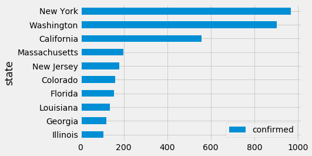
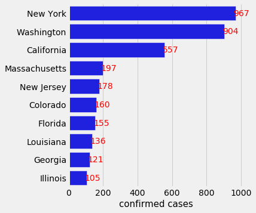

# covid-19
An analysis of John Hopkins University COVID-19 time series data.

## Analysis of Coronavirus (COVID-19) Pandemic Data 

The purpose of the notebook is to evaluate the coronavirus (COVID-19) data provided by the Center for Systems Science and Engineering (CSSE) at Johns Hopkins University (JHU).  This workbook only evaluates the time series dataset provided by JHU-CSSE.

As of March 17, 2020 this notebook is still a work in progress.  Most disappointing is the updates from the JHU dataset for U.S. county reporting seem to have been discontinued. All the datasets from JHU seem to lag behind state reporting.

#### Data Source: 
CSSE-JHU COVID-19 data repository https://github.com/CSSEGISandData/COVID-19  

---

#### Python Libraries


```python
import pandas as pd
import matplotlib as mpl
import matplotlib.pyplot as plt
from matplotlib import pyplot as plt

import requests
import numpy as np
%matplotlib inline
import seaborn as sns
```

    /Users/mark/anaconda3/envs/sandbox2/lib/python3.7/site-packages/statsmodels/tools/_testing.py:19: FutureWarning: pandas.util.testing is deprecated. Use the functions in the public API at pandas.testing instead.
      import pandas.util.testing as tm


*** The warning message above is the result of the seaborn package needing to be updated.


```python
#plt.style.use('ggplot')
plt.style.use('fivethirtyeight')
```

#### Load csv data into dataframes


```python
# confirmed cases data
confirm_url = 'https://github.com/CSSEGISandData/COVID-19/raw/master/csse_covid_19_data/csse_covid_19_time_series/time_series_19-covid-Confirmed.csv'

# recovered cases data
recover_url = 'https://github.com/CSSEGISandData/COVID-19/raw/master/csse_covid_19_data/csse_covid_19_time_series/time_series_19-covid-Recovered.csv'

# death cases data
deaths_url = 'https://github.com/CSSEGISandData/COVID-19/raw/master/csse_covid_19_data/csse_covid_19_time_series/time_series_19-covid-Deaths.csv'

# create dataframes
confirm_df = pd.read_csv(confirm_url)
recover_df = pd.read_csv(recover_url)
deaths_df = pd.read_csv(deaths_url)

```


```python
state_abbr_fips_df = pd.read_csv('state_abbr_fips.csv', header=None, dtype=object, names=['NAME','state_fips','state_abbr'])
state_abbr_fips_df
```


<div>
<style scoped>
    .dataframe tbody tr th:only-of-type {
        vertical-align: middle;
    }

    .dataframe tbody tr th {
        vertical-align: top;
    }

    .dataframe thead th {
        text-align: right;
    }
</style>
<table border="1" class="dataframe">
  <thead>
    <tr style="text-align: right;">
      <th></th>
      <th>NAME</th>
      <th>state_fips</th>
      <th>state_abbr</th>
    </tr>
  </thead>
  <tbody>
    <tr>
      <th>0</th>
      <td>Alabama</td>
      <td>01</td>
      <td>AL</td>
    </tr>
    <tr>
      <th>1</th>
      <td>Alaska</td>
      <td>02</td>
      <td>AK</td>
    </tr>
    <tr>
      <th>2</th>
      <td>Arizona</td>
      <td>04</td>
      <td>AZ</td>
    </tr>
    <tr>
      <th>3</th>
      <td>Arkansas</td>
      <td>05</td>
      <td>AR</td>
    </tr>
    <tr>
      <th>4</th>
      <td>California</td>
      <td>06</td>
      <td>CA</td>
    </tr>
    <tr>
      <th>5</th>
      <td>Colorado</td>
      <td>08</td>
      <td>CO</td>
    </tr>
    <tr>
      <th>6</th>
      <td>Connecticut</td>
      <td>09</td>
      <td>CT</td>
    </tr>
    <tr>
      <th>7</th>
      <td>Delaware</td>
      <td>10</td>
      <td>DE</td>
    </tr>
    <tr>
      <th>8</th>
      <td>District of Columbia</td>
      <td>11</td>
      <td>DC</td>
    </tr>
    <tr>
      <th>9</th>
      <td>Florida</td>
      <td>12</td>
      <td>FL</td>
    </tr>
    <tr>
      <th>10</th>
      <td>Georgia</td>
      <td>13</td>
      <td>GA</td>
    </tr>
    <tr>
      <th>11</th>
      <td>Hawaii</td>
      <td>15</td>
      <td>HI</td>
    </tr>
    <tr>
      <th>12</th>
      <td>Idaho</td>
      <td>16</td>
      <td>ID</td>
    </tr>
    <tr>
      <th>13</th>
      <td>Illinois</td>
      <td>17</td>
      <td>IL</td>
    </tr>
    <tr>
      <th>14</th>
      <td>Indiana</td>
      <td>18</td>
      <td>IN</td>
    </tr>
    <tr>
      <th>15</th>
      <td>Iowa</td>
      <td>19</td>
      <td>IA</td>
    </tr>
    <tr>
      <th>16</th>
      <td>Kansas</td>
      <td>20</td>
      <td>KS</td>
    </tr>
    <tr>
      <th>17</th>
      <td>Kentucky</td>
      <td>21</td>
      <td>KY</td>
    </tr>
    <tr>
      <th>18</th>
      <td>Louisiana</td>
      <td>22</td>
      <td>LA</td>
    </tr>
    <tr>
      <th>19</th>
      <td>Maine</td>
      <td>23</td>
      <td>ME</td>
    </tr>
    <tr>
      <th>20</th>
      <td>Maryland</td>
      <td>24</td>
      <td>MD</td>
    </tr>
    <tr>
      <th>21</th>
      <td>Massachusetts</td>
      <td>25</td>
      <td>MA</td>
    </tr>
    <tr>
      <th>22</th>
      <td>Michigan</td>
      <td>26</td>
      <td>MI</td>
    </tr>
    <tr>
      <th>23</th>
      <td>Minnesota</td>
      <td>27</td>
      <td>MN</td>
    </tr>
    <tr>
      <th>24</th>
      <td>Mississippi</td>
      <td>28</td>
      <td>MS</td>
    </tr>
    <tr>
      <th>25</th>
      <td>Missouri</td>
      <td>29</td>
      <td>MO</td>
    </tr>
    <tr>
      <th>26</th>
      <td>Montana</td>
      <td>30</td>
      <td>MT</td>
    </tr>
    <tr>
      <th>27</th>
      <td>Nebraska</td>
      <td>31</td>
      <td>NE</td>
    </tr>
    <tr>
      <th>28</th>
      <td>Nevada</td>
      <td>32</td>
      <td>NV</td>
    </tr>
    <tr>
      <th>29</th>
      <td>New Hampshire</td>
      <td>33</td>
      <td>NH</td>
    </tr>
    <tr>
      <th>30</th>
      <td>New Jersey</td>
      <td>34</td>
      <td>NJ</td>
    </tr>
    <tr>
      <th>31</th>
      <td>New Mexico</td>
      <td>35</td>
      <td>NM</td>
    </tr>
    <tr>
      <th>32</th>
      <td>New York</td>
      <td>36</td>
      <td>NY</td>
    </tr>
    <tr>
      <th>33</th>
      <td>North Carolina</td>
      <td>37</td>
      <td>NC</td>
    </tr>
    <tr>
      <th>34</th>
      <td>North Dakota</td>
      <td>38</td>
      <td>ND</td>
    </tr>
    <tr>
      <th>35</th>
      <td>Ohio</td>
      <td>39</td>
      <td>OH</td>
    </tr>
    <tr>
      <th>36</th>
      <td>Oklahoma</td>
      <td>40</td>
      <td>OK</td>
    </tr>
    <tr>
      <th>37</th>
      <td>Oregon</td>
      <td>41</td>
      <td>OR</td>
    </tr>
    <tr>
      <th>38</th>
      <td>Pennsylvania</td>
      <td>42</td>
      <td>PA</td>
    </tr>
    <tr>
      <th>39</th>
      <td>Rhode Island</td>
      <td>44</td>
      <td>RI</td>
    </tr>
    <tr>
      <th>40</th>
      <td>South Carolina</td>
      <td>45</td>
      <td>SC</td>
    </tr>
    <tr>
      <th>41</th>
      <td>South Dakota</td>
      <td>46</td>
      <td>SD</td>
    </tr>
    <tr>
      <th>42</th>
      <td>Tennessee</td>
      <td>47</td>
      <td>TN</td>
    </tr>
    <tr>
      <th>43</th>
      <td>Texas</td>
      <td>48</td>
      <td>TX</td>
    </tr>
    <tr>
      <th>44</th>
      <td>Utah</td>
      <td>49</td>
      <td>UT</td>
    </tr>
    <tr>
      <th>45</th>
      <td>Vermont</td>
      <td>50</td>
      <td>VT</td>
    </tr>
    <tr>
      <th>46</th>
      <td>Virginia</td>
      <td>51</td>
      <td>VA</td>
    </tr>
    <tr>
      <th>47</th>
      <td>Washington</td>
      <td>53</td>
      <td>WA</td>
    </tr>
    <tr>
      <th>48</th>
      <td>West Virginia</td>
      <td>54</td>
      <td>WV</td>
    </tr>
    <tr>
      <th>49</th>
      <td>Wisconsin</td>
      <td>55</td>
      <td>WI</td>
    </tr>
    <tr>
      <th>50</th>
      <td>Wyoming</td>
      <td>56</td>
      <td>WY</td>
    </tr>
  </tbody>
</table>
</div>


#### Set dataframe window viewing size


```python
pd.set_option('display.max_rows', 1000)
```


```python
confirm_df
```


<div>
<style scoped>
    .dataframe tbody tr th:only-of-type {
        vertical-align: middle;
    }

    .dataframe tbody tr th {
        vertical-align: top;
    }

    .dataframe thead th {
        text-align: right;
    }
</style>
<table border="1" class="dataframe">
  <thead>
    <tr style="text-align: right;">
      <th></th>
      <th>Province/State</th>
      <th>Country/Region</th>
      <th>Lat</th>
      <th>Long</th>
      <th>1/22/20</th>
      <th>1/23/20</th>
      <th>1/24/20</th>
      <th>1/25/20</th>
      <th>1/26/20</th>
      <th>1/27/20</th>
      <th>...</th>
      <th>3/7/20</th>
      <th>3/8/20</th>
      <th>3/9/20</th>
      <th>3/10/20</th>
      <th>3/11/20</th>
      <th>3/12/20</th>
      <th>3/13/20</th>
      <th>3/14/20</th>
      <th>3/15/20</th>
      <th>3/16/20</th>
    </tr>
  </thead>
  <tbody>
    <tr>
      <th>0</th>
      <td>NaN</td>
      <td>Thailand</td>
      <td>15.0000</td>
      <td>101.0000</td>
      <td>2</td>
      <td>3</td>
      <td>5</td>
      <td>7</td>
      <td>8</td>
      <td>8</td>
      <td>...</td>
      <td>50</td>
      <td>50</td>
      <td>50</td>
      <td>53</td>
      <td>59</td>
      <td>70</td>
      <td>75</td>
      <td>82</td>
      <td>114</td>
      <td>147</td>
    </tr>
    <tr>
      <th>1</th>
      <td>NaN</td>
      <td>Japan</td>
      <td>36.0000</td>
      <td>138.0000</td>
      <td>2</td>
      <td>1</td>
      <td>2</td>
      <td>2</td>
      <td>4</td>
      <td>4</td>
      <td>...</td>
      <td>461</td>
      <td>502</td>
      <td>511</td>
      <td>581</td>
      <td>639</td>
      <td>639</td>
      <td>701</td>
      <td>773</td>
      <td>839</td>
      <td>825</td>
    </tr>
    <tr>
      <th>2</th>
      <td>NaN</td>
      <td>Singapore</td>
      <td>1.2833</td>
      <td>103.8333</td>
      <td>0</td>
      <td>1</td>
      <td>3</td>
      <td>3</td>
      <td>4</td>
      <td>5</td>
      <td>...</td>
      <td>138</td>
      <td>150</td>
      <td>150</td>
      <td>160</td>
      <td>178</td>
      <td>178</td>
      <td>200</td>
      <td>212</td>
      <td>226</td>
      <td>243</td>
    </tr>
    <tr>
      <th>3</th>
      <td>NaN</td>
      <td>Nepal</td>
      <td>28.1667</td>
      <td>84.2500</td>
      <td>0</td>
      <td>0</td>
      <td>0</td>
      <td>1</td>
      <td>1</td>
      <td>1</td>
      <td>...</td>
      <td>1</td>
      <td>1</td>
      <td>1</td>
      <td>1</td>
      <td>1</td>
      <td>1</td>
      <td>1</td>
      <td>1</td>
      <td>1</td>
      <td>1</td>
    </tr>
    <tr>
      <th>4</th>
      <td>NaN</td>
      <td>Malaysia</td>
      <td>2.5000</td>
      <td>112.5000</td>
      <td>0</td>
      <td>0</td>
      <td>0</td>
      <td>3</td>
      <td>4</td>
      <td>4</td>
      <td>...</td>
      <td>93</td>
      <td>99</td>
      <td>117</td>
      <td>129</td>
      <td>149</td>
      <td>149</td>
      <td>197</td>
      <td>238</td>
      <td>428</td>
      <td>566</td>
    </tr>
    <tr>
      <th>5</th>
      <td>British Columbia</td>
      <td>Canada</td>
      <td>49.2827</td>
      <td>-123.1207</td>
      <td>0</td>
      <td>0</td>
      <td>0</td>
      <td>0</td>
      <td>0</td>
      <td>0</td>
      <td>...</td>
      <td>21</td>
      <td>27</td>
      <td>32</td>
      <td>32</td>
      <td>39</td>
      <td>46</td>
      <td>64</td>
      <td>64</td>
      <td>73</td>
      <td>103</td>
    </tr>
    <tr>
      <th>6</th>
      <td>New South Wales</td>
      <td>Australia</td>
      <td>-33.8688</td>
      <td>151.2093</td>
      <td>0</td>
      <td>0</td>
      <td>0</td>
      <td>0</td>
      <td>3</td>
      <td>4</td>
      <td>...</td>
      <td>28</td>
      <td>38</td>
      <td>48</td>
      <td>55</td>
      <td>65</td>
      <td>65</td>
      <td>92</td>
      <td>112</td>
      <td>134</td>
      <td>171</td>
    </tr>
    <tr>
      <th>7</th>
      <td>Victoria</td>
      <td>Australia</td>
      <td>-37.8136</td>
      <td>144.9631</td>
      <td>0</td>
      <td>0</td>
      <td>0</td>
      <td>0</td>
      <td>1</td>
      <td>1</td>
      <td>...</td>
      <td>11</td>
      <td>11</td>
      <td>15</td>
      <td>18</td>
      <td>21</td>
      <td>21</td>
      <td>36</td>
      <td>49</td>
      <td>57</td>
      <td>71</td>
    </tr>
    <tr>
      <th>8</th>
      <td>Queensland</td>
      <td>Australia</td>
      <td>-28.0167</td>
      <td>153.4000</td>
      <td>0</td>
      <td>0</td>
      <td>0</td>
      <td>0</td>
      <td>0</td>
      <td>0</td>
      <td>...</td>
      <td>13</td>
      <td>15</td>
      <td>15</td>
      <td>18</td>
      <td>20</td>
      <td>20</td>
      <td>35</td>
      <td>46</td>
      <td>61</td>
      <td>68</td>
    </tr>
    <tr>
      <th>9</th>
      <td>NaN</td>
      <td>Cambodia</td>
      <td>11.5500</td>
      <td>104.9167</td>
      <td>0</td>
      <td>0</td>
      <td>0</td>
      <td>0</td>
      <td>0</td>
      <td>1</td>
      <td>...</td>
      <td>1</td>
      <td>2</td>
      <td>2</td>
      <td>2</td>
      <td>3</td>
      <td>3</td>
      <td>5</td>
      <td>7</td>
      <td>7</td>
      <td>7</td>
    </tr>
    <tr>
      <th>10</th>
      <td>NaN</td>
      <td>Sri Lanka</td>
      <td>7.0000</td>
      <td>81.0000</td>
      <td>0</td>
      <td>0</td>
      <td>0</td>
      <td>0</td>
      <td>0</td>
      <td>1</td>
      <td>...</td>
      <td>1</td>
      <td>1</td>
      <td>1</td>
      <td>1</td>
      <td>2</td>
      <td>2</td>
      <td>6</td>
      <td>10</td>
      <td>18</td>
      <td>28</td>
    </tr>
    <tr>
      <th>11</th>
      <td>NaN</td>
      <td>Germany</td>
      <td>51.0000</td>
      <td>9.0000</td>
      <td>0</td>
      <td>0</td>
      <td>0</td>
      <td>0</td>
      <td>0</td>
      <td>1</td>
      <td>...</td>
      <td>799</td>
      <td>1040</td>
      <td>1176</td>
      <td>1457</td>
      <td>1908</td>
      <td>2078</td>
      <td>3675</td>
      <td>4585</td>
      <td>5795</td>
      <td>7272</td>
    </tr>
    <tr>
      <th>12</th>
      <td>NaN</td>
      <td>Finland</td>
      <td>64.0000</td>
      <td>26.0000</td>
      <td>0</td>
      <td>0</td>
      <td>0</td>
      <td>0</td>
      <td>0</td>
      <td>0</td>
      <td>...</td>
      <td>15</td>
      <td>23</td>
      <td>30</td>
      <td>40</td>
      <td>59</td>
      <td>59</td>
      <td>155</td>
      <td>225</td>
      <td>244</td>
      <td>277</td>
    </tr>
    <tr>
      <th>13</th>
      <td>NaN</td>
      <td>United Arab Emirates</td>
      <td>24.0000</td>
      <td>54.0000</td>
      <td>0</td>
      <td>0</td>
      <td>0</td>
      <td>0</td>
      <td>0</td>
      <td>0</td>
      <td>...</td>
      <td>45</td>
      <td>45</td>
      <td>45</td>
      <td>74</td>
      <td>74</td>
      <td>85</td>
      <td>85</td>
      <td>85</td>
      <td>98</td>
      <td>98</td>
    </tr>
    <tr>
      <th>14</th>
      <td>NaN</td>
      <td>Philippines</td>
      <td>13.0000</td>
      <td>122.0000</td>
      <td>0</td>
      <td>0</td>
      <td>0</td>
      <td>0</td>
      <td>0</td>
      <td>0</td>
      <td>...</td>
      <td>6</td>
      <td>10</td>
      <td>20</td>
      <td>33</td>
      <td>49</td>
      <td>52</td>
      <td>64</td>
      <td>111</td>
      <td>140</td>
      <td>142</td>
    </tr>
    <tr>
      <th>15</th>
      <td>NaN</td>
      <td>India</td>
      <td>21.0000</td>
      <td>78.0000</td>
      <td>0</td>
      <td>0</td>
      <td>0</td>
      <td>0</td>
      <td>0</td>
      <td>0</td>
      <td>...</td>
      <td>34</td>
      <td>39</td>
      <td>43</td>
      <td>56</td>
      <td>62</td>
      <td>73</td>
      <td>82</td>
      <td>102</td>
      <td>113</td>
      <td>119</td>
    </tr>
    <tr>
      <th>16</th>
      <td>NaN</td>
      <td>Italy</td>
      <td>43.0000</td>
      <td>12.0000</td>
      <td>0</td>
      <td>0</td>
      <td>0</td>
      <td>0</td>
      <td>0</td>
      <td>0</td>
      <td>...</td>
      <td>5883</td>
      <td>7375</td>
      <td>9172</td>
      <td>10149</td>
      <td>12462</td>
      <td>12462</td>
      <td>17660</td>
      <td>21157</td>
      <td>24747</td>
      <td>27980</td>
    </tr>
    <tr>
      <th>17</th>
      <td>NaN</td>
      <td>Sweden</td>
      <td>63.0000</td>
      <td>16.0000</td>
      <td>0</td>
      <td>0</td>
      <td>0</td>
      <td>0</td>
      <td>0</td>
      <td>0</td>
      <td>...</td>
      <td>161</td>
      <td>203</td>
      <td>248</td>
      <td>355</td>
      <td>500</td>
      <td>599</td>
      <td>814</td>
      <td>961</td>
      <td>1022</td>
      <td>1103</td>
    </tr>
    <tr>
      <th>18</th>
      <td>NaN</td>
      <td>Spain</td>
      <td>40.0000</td>
      <td>-4.0000</td>
      <td>0</td>
      <td>0</td>
      <td>0</td>
      <td>0</td>
      <td>0</td>
      <td>0</td>
      <td>...</td>
      <td>500</td>
      <td>673</td>
      <td>1073</td>
      <td>1695</td>
      <td>2277</td>
      <td>2277</td>
      <td>5232</td>
      <td>6391</td>
      <td>7798</td>
      <td>9942</td>
    </tr>
    <tr>
      <th>19</th>
      <td>South Australia</td>
      <td>Australia</td>
      <td>-34.9285</td>
      <td>138.6007</td>
      <td>0</td>
      <td>0</td>
      <td>0</td>
      <td>0</td>
      <td>0</td>
      <td>0</td>
      <td>...</td>
      <td>7</td>
      <td>7</td>
      <td>7</td>
      <td>7</td>
      <td>9</td>
      <td>9</td>
      <td>16</td>
      <td>19</td>
      <td>20</td>
      <td>29</td>
    </tr>
    <tr>
      <th>20</th>
      <td>NaN</td>
      <td>Belgium</td>
      <td>50.8333</td>
      <td>4.0000</td>
      <td>0</td>
      <td>0</td>
      <td>0</td>
      <td>0</td>
      <td>0</td>
      <td>0</td>
      <td>...</td>
      <td>169</td>
      <td>200</td>
      <td>239</td>
      <td>267</td>
      <td>314</td>
      <td>314</td>
      <td>559</td>
      <td>689</td>
      <td>886</td>
      <td>1058</td>
    </tr>
    <tr>
      <th>21</th>
      <td>NaN</td>
      <td>Egypt</td>
      <td>26.0000</td>
      <td>30.0000</td>
      <td>0</td>
      <td>0</td>
      <td>0</td>
      <td>0</td>
      <td>0</td>
      <td>0</td>
      <td>...</td>
      <td>15</td>
      <td>49</td>
      <td>55</td>
      <td>59</td>
      <td>60</td>
      <td>67</td>
      <td>80</td>
      <td>109</td>
      <td>110</td>
      <td>150</td>
    </tr>
    <tr>
      <th>22</th>
      <td>From Diamond Princess</td>
      <td>Australia</td>
      <td>35.4437</td>
      <td>139.6380</td>
      <td>0</td>
      <td>0</td>
      <td>0</td>
      <td>0</td>
      <td>0</td>
      <td>0</td>
      <td>...</td>
      <td>0</td>
      <td>0</td>
      <td>0</td>
      <td>0</td>
      <td>0</td>
      <td>0</td>
      <td>0</td>
      <td>0</td>
      <td>0</td>
      <td>0</td>
    </tr>
    <tr>
      <th>23</th>
      <td>NaN</td>
      <td>Lebanon</td>
      <td>33.8547</td>
      <td>35.8623</td>
      <td>0</td>
      <td>0</td>
      <td>0</td>
      <td>0</td>
      <td>0</td>
      <td>0</td>
      <td>...</td>
      <td>22</td>
      <td>32</td>
      <td>32</td>
      <td>41</td>
      <td>61</td>
      <td>61</td>
      <td>77</td>
      <td>93</td>
      <td>110</td>
      <td>99</td>
    </tr>
    <tr>
      <th>24</th>
      <td>NaN</td>
      <td>Iraq</td>
      <td>33.0000</td>
      <td>44.0000</td>
      <td>0</td>
      <td>0</td>
      <td>0</td>
      <td>0</td>
      <td>0</td>
      <td>0</td>
      <td>...</td>
      <td>54</td>
      <td>60</td>
      <td>60</td>
      <td>71</td>
      <td>71</td>
      <td>71</td>
      <td>101</td>
      <td>110</td>
      <td>116</td>
      <td>124</td>
    </tr>
    <tr>
      <th>25</th>
      <td>NaN</td>
      <td>Oman</td>
      <td>21.0000</td>
      <td>57.0000</td>
      <td>0</td>
      <td>0</td>
      <td>0</td>
      <td>0</td>
      <td>0</td>
      <td>0</td>
      <td>...</td>
      <td>16</td>
      <td>16</td>
      <td>16</td>
      <td>18</td>
      <td>18</td>
      <td>18</td>
      <td>19</td>
      <td>19</td>
      <td>22</td>
      <td>22</td>
    </tr>
    <tr>
      <th>26</th>
      <td>NaN</td>
      <td>Afghanistan</td>
      <td>33.0000</td>
      <td>65.0000</td>
      <td>0</td>
      <td>0</td>
      <td>0</td>
      <td>0</td>
      <td>0</td>
      <td>0</td>
      <td>...</td>
      <td>1</td>
      <td>4</td>
      <td>4</td>
      <td>5</td>
      <td>7</td>
      <td>7</td>
      <td>7</td>
      <td>11</td>
      <td>16</td>
      <td>21</td>
    </tr>
    <tr>
      <th>27</th>
      <td>NaN</td>
      <td>Bahrain</td>
      <td>26.0275</td>
      <td>50.5500</td>
      <td>0</td>
      <td>0</td>
      <td>0</td>
      <td>0</td>
      <td>0</td>
      <td>0</td>
      <td>...</td>
      <td>85</td>
      <td>85</td>
      <td>95</td>
      <td>110</td>
      <td>195</td>
      <td>195</td>
      <td>189</td>
      <td>210</td>
      <td>214</td>
      <td>214</td>
    </tr>
    <tr>
      <th>28</th>
      <td>NaN</td>
      <td>Kuwait</td>
      <td>29.5000</td>
      <td>47.7500</td>
      <td>0</td>
      <td>0</td>
      <td>0</td>
      <td>0</td>
      <td>0</td>
      <td>0</td>
      <td>...</td>
      <td>61</td>
      <td>64</td>
      <td>64</td>
      <td>69</td>
      <td>72</td>
      <td>80</td>
      <td>80</td>
      <td>104</td>
      <td>112</td>
      <td>123</td>
    </tr>
    <tr>
      <th>29</th>
      <td>NaN</td>
      <td>Algeria</td>
      <td>28.0339</td>
      <td>1.6596</td>
      <td>0</td>
      <td>0</td>
      <td>0</td>
      <td>0</td>
      <td>0</td>
      <td>0</td>
      <td>...</td>
      <td>17</td>
      <td>19</td>
      <td>20</td>
      <td>20</td>
      <td>20</td>
      <td>24</td>
      <td>26</td>
      <td>37</td>
      <td>48</td>
      <td>54</td>
    </tr>
    <tr>
      <th>30</th>
      <td>NaN</td>
      <td>Croatia</td>
      <td>45.1000</td>
      <td>15.2000</td>
      <td>0</td>
      <td>0</td>
      <td>0</td>
      <td>0</td>
      <td>0</td>
      <td>0</td>
      <td>...</td>
      <td>12</td>
      <td>12</td>
      <td>12</td>
      <td>14</td>
      <td>19</td>
      <td>19</td>
      <td>32</td>
      <td>38</td>
      <td>49</td>
      <td>57</td>
    </tr>
    <tr>
      <th>31</th>
      <td>NaN</td>
      <td>Switzerland</td>
      <td>46.8182</td>
      <td>8.2275</td>
      <td>0</td>
      <td>0</td>
      <td>0</td>
      <td>0</td>
      <td>0</td>
      <td>0</td>
      <td>...</td>
      <td>268</td>
      <td>337</td>
      <td>374</td>
      <td>491</td>
      <td>652</td>
      <td>652</td>
      <td>1139</td>
      <td>1359</td>
      <td>2200</td>
      <td>2200</td>
    </tr>
    <tr>
      <th>32</th>
      <td>NaN</td>
      <td>Austria</td>
      <td>47.5162</td>
      <td>14.5501</td>
      <td>0</td>
      <td>0</td>
      <td>0</td>
      <td>0</td>
      <td>0</td>
      <td>0</td>
      <td>...</td>
      <td>79</td>
      <td>104</td>
      <td>131</td>
      <td>182</td>
      <td>246</td>
      <td>302</td>
      <td>504</td>
      <td>655</td>
      <td>860</td>
      <td>1018</td>
    </tr>
    <tr>
      <th>33</th>
      <td>NaN</td>
      <td>Israel</td>
      <td>31.0000</td>
      <td>35.0000</td>
      <td>0</td>
      <td>0</td>
      <td>0</td>
      <td>0</td>
      <td>0</td>
      <td>0</td>
      <td>...</td>
      <td>43</td>
      <td>61</td>
      <td>61</td>
      <td>83</td>
      <td>109</td>
      <td>131</td>
      <td>161</td>
      <td>193</td>
      <td>251</td>
      <td>255</td>
    </tr>
    <tr>
      <th>34</th>
      <td>NaN</td>
      <td>Pakistan</td>
      <td>30.3753</td>
      <td>69.3451</td>
      <td>0</td>
      <td>0</td>
      <td>0</td>
      <td>0</td>
      <td>0</td>
      <td>0</td>
      <td>...</td>
      <td>6</td>
      <td>6</td>
      <td>6</td>
      <td>16</td>
      <td>19</td>
      <td>20</td>
      <td>28</td>
      <td>31</td>
      <td>53</td>
      <td>136</td>
    </tr>
    <tr>
      <th>35</th>
      <td>NaN</td>
      <td>Brazil</td>
      <td>-14.2350</td>
      <td>-51.9253</td>
      <td>0</td>
      <td>0</td>
      <td>0</td>
      <td>0</td>
      <td>0</td>
      <td>0</td>
      <td>...</td>
      <td>13</td>
      <td>20</td>
      <td>25</td>
      <td>31</td>
      <td>38</td>
      <td>52</td>
      <td>151</td>
      <td>151</td>
      <td>162</td>
      <td>200</td>
    </tr>
    <tr>
      <th>36</th>
      <td>NaN</td>
      <td>Georgia</td>
      <td>42.3154</td>
      <td>43.3569</td>
      <td>0</td>
      <td>0</td>
      <td>0</td>
      <td>0</td>
      <td>0</td>
      <td>0</td>
      <td>...</td>
      <td>4</td>
      <td>13</td>
      <td>15</td>
      <td>15</td>
      <td>24</td>
      <td>24</td>
      <td>25</td>
      <td>30</td>
      <td>33</td>
      <td>33</td>
    </tr>
    <tr>
      <th>37</th>
      <td>NaN</td>
      <td>Greece</td>
      <td>39.0742</td>
      <td>21.8243</td>
      <td>0</td>
      <td>0</td>
      <td>0</td>
      <td>0</td>
      <td>0</td>
      <td>0</td>
      <td>...</td>
      <td>46</td>
      <td>73</td>
      <td>73</td>
      <td>89</td>
      <td>99</td>
      <td>99</td>
      <td>190</td>
      <td>228</td>
      <td>331</td>
      <td>331</td>
    </tr>
    <tr>
      <th>38</th>
      <td>NaN</td>
      <td>North Macedonia</td>
      <td>41.6086</td>
      <td>21.7453</td>
      <td>0</td>
      <td>0</td>
      <td>0</td>
      <td>0</td>
      <td>0</td>
      <td>0</td>
      <td>...</td>
      <td>3</td>
      <td>3</td>
      <td>3</td>
      <td>7</td>
      <td>7</td>
      <td>7</td>
      <td>14</td>
      <td>14</td>
      <td>14</td>
      <td>18</td>
    </tr>
    <tr>
      <th>39</th>
      <td>NaN</td>
      <td>Norway</td>
      <td>60.4720</td>
      <td>8.4689</td>
      <td>0</td>
      <td>0</td>
      <td>0</td>
      <td>0</td>
      <td>0</td>
      <td>0</td>
      <td>...</td>
      <td>147</td>
      <td>176</td>
      <td>205</td>
      <td>400</td>
      <td>598</td>
      <td>702</td>
      <td>996</td>
      <td>1090</td>
      <td>1221</td>
      <td>1333</td>
    </tr>
    <tr>
      <th>40</th>
      <td>NaN</td>
      <td>Romania</td>
      <td>45.9432</td>
      <td>24.9668</td>
      <td>0</td>
      <td>0</td>
      <td>0</td>
      <td>0</td>
      <td>0</td>
      <td>0</td>
      <td>...</td>
      <td>9</td>
      <td>15</td>
      <td>15</td>
      <td>25</td>
      <td>45</td>
      <td>49</td>
      <td>89</td>
      <td>123</td>
      <td>131</td>
      <td>158</td>
    </tr>
    <tr>
      <th>41</th>
      <td>NaN</td>
      <td>Estonia</td>
      <td>58.5953</td>
      <td>25.0136</td>
      <td>0</td>
      <td>0</td>
      <td>0</td>
      <td>0</td>
      <td>0</td>
      <td>0</td>
      <td>...</td>
      <td>10</td>
      <td>10</td>
      <td>10</td>
      <td>12</td>
      <td>16</td>
      <td>16</td>
      <td>79</td>
      <td>115</td>
      <td>171</td>
      <td>205</td>
    </tr>
    <tr>
      <th>42</th>
      <td>NaN</td>
      <td>San Marino</td>
      <td>43.9424</td>
      <td>12.4578</td>
      <td>0</td>
      <td>0</td>
      <td>0</td>
      <td>0</td>
      <td>0</td>
      <td>0</td>
      <td>...</td>
      <td>23</td>
      <td>36</td>
      <td>36</td>
      <td>51</td>
      <td>62</td>
      <td>69</td>
      <td>80</td>
      <td>80</td>
      <td>101</td>
      <td>109</td>
    </tr>
    <tr>
      <th>43</th>
      <td>NaN</td>
      <td>Belarus</td>
      <td>53.7098</td>
      <td>27.9534</td>
      <td>0</td>
      <td>0</td>
      <td>0</td>
      <td>0</td>
      <td>0</td>
      <td>0</td>
      <td>...</td>
      <td>6</td>
      <td>6</td>
      <td>6</td>
      <td>9</td>
      <td>9</td>
      <td>12</td>
      <td>27</td>
      <td>27</td>
      <td>27</td>
      <td>36</td>
    </tr>
    <tr>
      <th>44</th>
      <td>NaN</td>
      <td>Iceland</td>
      <td>64.9631</td>
      <td>-19.0208</td>
      <td>0</td>
      <td>0</td>
      <td>0</td>
      <td>0</td>
      <td>0</td>
      <td>0</td>
      <td>...</td>
      <td>50</td>
      <td>50</td>
      <td>58</td>
      <td>69</td>
      <td>85</td>
      <td>103</td>
      <td>134</td>
      <td>156</td>
      <td>171</td>
      <td>180</td>
    </tr>
    <tr>
      <th>45</th>
      <td>NaN</td>
      <td>Lithuania</td>
      <td>55.1694</td>
      <td>23.8813</td>
      <td>0</td>
      <td>0</td>
      <td>0</td>
      <td>0</td>
      <td>0</td>
      <td>0</td>
      <td>...</td>
      <td>1</td>
      <td>1</td>
      <td>1</td>
      <td>1</td>
      <td>3</td>
      <td>3</td>
      <td>6</td>
      <td>8</td>
      <td>12</td>
      <td>17</td>
    </tr>
    <tr>
      <th>46</th>
      <td>NaN</td>
      <td>Mexico</td>
      <td>23.6345</td>
      <td>-102.5528</td>
      <td>0</td>
      <td>0</td>
      <td>0</td>
      <td>0</td>
      <td>0</td>
      <td>0</td>
      <td>...</td>
      <td>6</td>
      <td>7</td>
      <td>7</td>
      <td>7</td>
      <td>8</td>
      <td>12</td>
      <td>12</td>
      <td>26</td>
      <td>41</td>
      <td>53</td>
    </tr>
    <tr>
      <th>47</th>
      <td>NaN</td>
      <td>New Zealand</td>
      <td>-40.9006</td>
      <td>174.8860</td>
      <td>0</td>
      <td>0</td>
      <td>0</td>
      <td>0</td>
      <td>0</td>
      <td>0</td>
      <td>...</td>
      <td>5</td>
      <td>5</td>
      <td>5</td>
      <td>5</td>
      <td>5</td>
      <td>5</td>
      <td>5</td>
      <td>6</td>
      <td>8</td>
      <td>8</td>
    </tr>
    <tr>
      <th>48</th>
      <td>NaN</td>
      <td>Nigeria</td>
      <td>9.0820</td>
      <td>8.6753</td>
      <td>0</td>
      <td>0</td>
      <td>0</td>
      <td>0</td>
      <td>0</td>
      <td>0</td>
      <td>...</td>
      <td>1</td>
      <td>1</td>
      <td>2</td>
      <td>2</td>
      <td>2</td>
      <td>2</td>
      <td>2</td>
      <td>2</td>
      <td>2</td>
      <td>2</td>
    </tr>
    <tr>
      <th>49</th>
      <td>Western Australia</td>
      <td>Australia</td>
      <td>-31.9505</td>
      <td>115.8605</td>
      <td>0</td>
      <td>0</td>
      <td>0</td>
      <td>0</td>
      <td>0</td>
      <td>0</td>
      <td>...</td>
      <td>3</td>
      <td>3</td>
      <td>4</td>
      <td>6</td>
      <td>9</td>
      <td>9</td>
      <td>14</td>
      <td>17</td>
      <td>17</td>
      <td>28</td>
    </tr>
    <tr>
      <th>50</th>
      <td>NaN</td>
      <td>Ireland</td>
      <td>53.1424</td>
      <td>-7.6921</td>
      <td>0</td>
      <td>0</td>
      <td>0</td>
      <td>0</td>
      <td>0</td>
      <td>0</td>
      <td>...</td>
      <td>18</td>
      <td>19</td>
      <td>21</td>
      <td>34</td>
      <td>43</td>
      <td>43</td>
      <td>90</td>
      <td>129</td>
      <td>129</td>
      <td>169</td>
    </tr>
    <tr>
      <th>51</th>
      <td>NaN</td>
      <td>Luxembourg</td>
      <td>49.8153</td>
      <td>6.1296</td>
      <td>0</td>
      <td>0</td>
      <td>0</td>
      <td>0</td>
      <td>0</td>
      <td>0</td>
      <td>...</td>
      <td>2</td>
      <td>3</td>
      <td>3</td>
      <td>5</td>
      <td>7</td>
      <td>19</td>
      <td>34</td>
      <td>51</td>
      <td>59</td>
      <td>77</td>
    </tr>
    <tr>
      <th>52</th>
      <td>NaN</td>
      <td>Monaco</td>
      <td>43.7333</td>
      <td>7.4167</td>
      <td>0</td>
      <td>0</td>
      <td>0</td>
      <td>0</td>
      <td>0</td>
      <td>0</td>
      <td>...</td>
      <td>1</td>
      <td>1</td>
      <td>1</td>
      <td>1</td>
      <td>1</td>
      <td>2</td>
      <td>2</td>
      <td>2</td>
      <td>2</td>
      <td>7</td>
    </tr>
    <tr>
      <th>53</th>
      <td>NaN</td>
      <td>Qatar</td>
      <td>25.3548</td>
      <td>51.1839</td>
      <td>0</td>
      <td>0</td>
      <td>0</td>
      <td>0</td>
      <td>0</td>
      <td>0</td>
      <td>...</td>
      <td>8</td>
      <td>15</td>
      <td>18</td>
      <td>24</td>
      <td>262</td>
      <td>262</td>
      <td>320</td>
      <td>337</td>
      <td>401</td>
      <td>439</td>
    </tr>
    <tr>
      <th>54</th>
      <td>NaN</td>
      <td>Ecuador</td>
      <td>-1.8312</td>
      <td>-78.1834</td>
      <td>0</td>
      <td>0</td>
      <td>0</td>
      <td>0</td>
      <td>0</td>
      <td>0</td>
      <td>...</td>
      <td>13</td>
      <td>14</td>
      <td>15</td>
      <td>15</td>
      <td>17</td>
      <td>17</td>
      <td>17</td>
      <td>28</td>
      <td>28</td>
      <td>37</td>
    </tr>
    <tr>
      <th>55</th>
      <td>NaN</td>
      <td>Azerbaijan</td>
      <td>40.1431</td>
      <td>47.5769</td>
      <td>0</td>
      <td>0</td>
      <td>0</td>
      <td>0</td>
      <td>0</td>
      <td>0</td>
      <td>...</td>
      <td>9</td>
      <td>9</td>
      <td>9</td>
      <td>11</td>
      <td>11</td>
      <td>11</td>
      <td>15</td>
      <td>15</td>
      <td>23</td>
      <td>15</td>
    </tr>
    <tr>
      <th>56</th>
      <td>NaN</td>
      <td>Armenia</td>
      <td>40.0691</td>
      <td>45.0382</td>
      <td>0</td>
      <td>0</td>
      <td>0</td>
      <td>0</td>
      <td>0</td>
      <td>0</td>
      <td>...</td>
      <td>1</td>
      <td>1</td>
      <td>1</td>
      <td>1</td>
      <td>1</td>
      <td>4</td>
      <td>8</td>
      <td>18</td>
      <td>26</td>
      <td>52</td>
    </tr>
    <tr>
      <th>57</th>
      <td>NaN</td>
      <td>Dominican Republic</td>
      <td>18.7357</td>
      <td>-70.1627</td>
      <td>0</td>
      <td>0</td>
      <td>0</td>
      <td>0</td>
      <td>0</td>
      <td>0</td>
      <td>...</td>
      <td>2</td>
      <td>5</td>
      <td>5</td>
      <td>5</td>
      <td>5</td>
      <td>5</td>
      <td>5</td>
      <td>11</td>
      <td>11</td>
      <td>11</td>
    </tr>
    <tr>
      <th>58</th>
      <td>NaN</td>
      <td>Indonesia</td>
      <td>-0.7893</td>
      <td>113.9213</td>
      <td>0</td>
      <td>0</td>
      <td>0</td>
      <td>0</td>
      <td>0</td>
      <td>0</td>
      <td>...</td>
      <td>4</td>
      <td>6</td>
      <td>19</td>
      <td>27</td>
      <td>34</td>
      <td>34</td>
      <td>69</td>
      <td>96</td>
      <td>117</td>
      <td>134</td>
    </tr>
    <tr>
      <th>59</th>
      <td>NaN</td>
      <td>Portugal</td>
      <td>39.3999</td>
      <td>-8.2245</td>
      <td>0</td>
      <td>0</td>
      <td>0</td>
      <td>0</td>
      <td>0</td>
      <td>0</td>
      <td>...</td>
      <td>20</td>
      <td>30</td>
      <td>30</td>
      <td>41</td>
      <td>59</td>
      <td>59</td>
      <td>112</td>
      <td>169</td>
      <td>245</td>
      <td>331</td>
    </tr>
    <tr>
      <th>60</th>
      <td>NaN</td>
      <td>Andorra</td>
      <td>42.5063</td>
      <td>1.5218</td>
      <td>0</td>
      <td>0</td>
      <td>0</td>
      <td>0</td>
      <td>0</td>
      <td>0</td>
      <td>...</td>
      <td>1</td>
      <td>1</td>
      <td>1</td>
      <td>1</td>
      <td>1</td>
      <td>1</td>
      <td>1</td>
      <td>1</td>
      <td>1</td>
      <td>2</td>
    </tr>
    <tr>
      <th>61</th>
      <td>Tasmania</td>
      <td>Australia</td>
      <td>-41.4545</td>
      <td>145.9707</td>
      <td>0</td>
      <td>0</td>
      <td>0</td>
      <td>0</td>
      <td>0</td>
      <td>0</td>
      <td>...</td>
      <td>1</td>
      <td>2</td>
      <td>2</td>
      <td>2</td>
      <td>3</td>
      <td>3</td>
      <td>5</td>
      <td>5</td>
      <td>6</td>
      <td>7</td>
    </tr>
    <tr>
      <th>62</th>
      <td>NaN</td>
      <td>Latvia</td>
      <td>56.8796</td>
      <td>24.6032</td>
      <td>0</td>
      <td>0</td>
      <td>0</td>
      <td>0</td>
      <td>0</td>
      <td>0</td>
      <td>...</td>
      <td>1</td>
      <td>2</td>
      <td>6</td>
      <td>8</td>
      <td>10</td>
      <td>10</td>
      <td>17</td>
      <td>26</td>
      <td>30</td>
      <td>34</td>
    </tr>
    <tr>
      <th>63</th>
      <td>NaN</td>
      <td>Morocco</td>
      <td>31.7917</td>
      <td>-7.0926</td>
      <td>0</td>
      <td>0</td>
      <td>0</td>
      <td>0</td>
      <td>0</td>
      <td>0</td>
      <td>...</td>
      <td>2</td>
      <td>2</td>
      <td>2</td>
      <td>3</td>
      <td>5</td>
      <td>6</td>
      <td>7</td>
      <td>17</td>
      <td>28</td>
      <td>29</td>
    </tr>
    <tr>
      <th>64</th>
      <td>NaN</td>
      <td>Saudi Arabia</td>
      <td>24.0000</td>
      <td>45.0000</td>
      <td>0</td>
      <td>0</td>
      <td>0</td>
      <td>0</td>
      <td>0</td>
      <td>0</td>
      <td>...</td>
      <td>5</td>
      <td>11</td>
      <td>15</td>
      <td>20</td>
      <td>21</td>
      <td>45</td>
      <td>86</td>
      <td>103</td>
      <td>103</td>
      <td>118</td>
    </tr>
    <tr>
      <th>65</th>
      <td>NaN</td>
      <td>Senegal</td>
      <td>14.4974</td>
      <td>-14.4524</td>
      <td>0</td>
      <td>0</td>
      <td>0</td>
      <td>0</td>
      <td>0</td>
      <td>0</td>
      <td>...</td>
      <td>4</td>
      <td>4</td>
      <td>4</td>
      <td>4</td>
      <td>4</td>
      <td>4</td>
      <td>10</td>
      <td>10</td>
      <td>24</td>
      <td>24</td>
    </tr>
    <tr>
      <th>66</th>
      <td>NaN</td>
      <td>Argentina</td>
      <td>-38.4161</td>
      <td>-63.6167</td>
      <td>0</td>
      <td>0</td>
      <td>0</td>
      <td>0</td>
      <td>0</td>
      <td>0</td>
      <td>...</td>
      <td>8</td>
      <td>12</td>
      <td>12</td>
      <td>17</td>
      <td>19</td>
      <td>19</td>
      <td>31</td>
      <td>34</td>
      <td>45</td>
      <td>56</td>
    </tr>
    <tr>
      <th>67</th>
      <td>NaN</td>
      <td>Chile</td>
      <td>-35.6751</td>
      <td>-71.5430</td>
      <td>0</td>
      <td>0</td>
      <td>0</td>
      <td>0</td>
      <td>0</td>
      <td>0</td>
      <td>...</td>
      <td>4</td>
      <td>8</td>
      <td>8</td>
      <td>13</td>
      <td>23</td>
      <td>23</td>
      <td>43</td>
      <td>61</td>
      <td>74</td>
      <td>155</td>
    </tr>
    <tr>
      <th>68</th>
      <td>NaN</td>
      <td>Jordan</td>
      <td>31.2400</td>
      <td>36.5100</td>
      <td>0</td>
      <td>0</td>
      <td>0</td>
      <td>0</td>
      <td>0</td>
      <td>0</td>
      <td>...</td>
      <td>1</td>
      <td>1</td>
      <td>1</td>
      <td>1</td>
      <td>1</td>
      <td>1</td>
      <td>1</td>
      <td>1</td>
      <td>8</td>
      <td>17</td>
    </tr>
    <tr>
      <th>69</th>
      <td>NaN</td>
      <td>Ukraine</td>
      <td>48.3794</td>
      <td>31.1656</td>
      <td>0</td>
      <td>0</td>
      <td>0</td>
      <td>0</td>
      <td>0</td>
      <td>0</td>
      <td>...</td>
      <td>1</td>
      <td>1</td>
      <td>1</td>
      <td>1</td>
      <td>1</td>
      <td>1</td>
      <td>3</td>
      <td>3</td>
      <td>3</td>
      <td>7</td>
    </tr>
    <tr>
      <th>70</th>
      <td>NaN</td>
      <td>Hungary</td>
      <td>47.1625</td>
      <td>19.5033</td>
      <td>0</td>
      <td>0</td>
      <td>0</td>
      <td>0</td>
      <td>0</td>
      <td>0</td>
      <td>...</td>
      <td>4</td>
      <td>7</td>
      <td>9</td>
      <td>9</td>
      <td>13</td>
      <td>13</td>
      <td>19</td>
      <td>30</td>
      <td>32</td>
      <td>39</td>
    </tr>
    <tr>
      <th>71</th>
      <td>Northern Territory</td>
      <td>Australia</td>
      <td>-12.4634</td>
      <td>130.8456</td>
      <td>0</td>
      <td>0</td>
      <td>0</td>
      <td>0</td>
      <td>0</td>
      <td>0</td>
      <td>...</td>
      <td>0</td>
      <td>0</td>
      <td>0</td>
      <td>1</td>
      <td>1</td>
      <td>1</td>
      <td>1</td>
      <td>1</td>
      <td>1</td>
      <td>1</td>
    </tr>
    <tr>
      <th>72</th>
      <td>NaN</td>
      <td>Liechtenstein</td>
      <td>47.1400</td>
      <td>9.5500</td>
      <td>0</td>
      <td>0</td>
      <td>0</td>
      <td>0</td>
      <td>0</td>
      <td>0</td>
      <td>...</td>
      <td>1</td>
      <td>1</td>
      <td>1</td>
      <td>1</td>
      <td>1</td>
      <td>1</td>
      <td>1</td>
      <td>4</td>
      <td>4</td>
      <td>4</td>
    </tr>
    <tr>
      <th>73</th>
      <td>NaN</td>
      <td>Poland</td>
      <td>51.9194</td>
      <td>19.1451</td>
      <td>0</td>
      <td>0</td>
      <td>0</td>
      <td>0</td>
      <td>0</td>
      <td>0</td>
      <td>...</td>
      <td>5</td>
      <td>11</td>
      <td>16</td>
      <td>22</td>
      <td>31</td>
      <td>49</td>
      <td>68</td>
      <td>103</td>
      <td>119</td>
      <td>177</td>
    </tr>
    <tr>
      <th>74</th>
      <td>NaN</td>
      <td>Tunisia</td>
      <td>34.0000</td>
      <td>9.0000</td>
      <td>0</td>
      <td>0</td>
      <td>0</td>
      <td>0</td>
      <td>0</td>
      <td>0</td>
      <td>...</td>
      <td>1</td>
      <td>2</td>
      <td>2</td>
      <td>5</td>
      <td>7</td>
      <td>7</td>
      <td>16</td>
      <td>18</td>
      <td>18</td>
      <td>20</td>
    </tr>
    <tr>
      <th>75</th>
      <td>NaN</td>
      <td>Bosnia and Herzegovina</td>
      <td>43.9159</td>
      <td>17.6791</td>
      <td>0</td>
      <td>0</td>
      <td>0</td>
      <td>0</td>
      <td>0</td>
      <td>0</td>
      <td>...</td>
      <td>3</td>
      <td>3</td>
      <td>3</td>
      <td>5</td>
      <td>7</td>
      <td>11</td>
      <td>13</td>
      <td>18</td>
      <td>24</td>
      <td>25</td>
    </tr>
    <tr>
      <th>76</th>
      <td>NaN</td>
      <td>Slovenia</td>
      <td>46.1512</td>
      <td>14.9955</td>
      <td>0</td>
      <td>0</td>
      <td>0</td>
      <td>0</td>
      <td>0</td>
      <td>0</td>
      <td>...</td>
      <td>7</td>
      <td>16</td>
      <td>16</td>
      <td>31</td>
      <td>57</td>
      <td>89</td>
      <td>141</td>
      <td>181</td>
      <td>219</td>
      <td>253</td>
    </tr>
    <tr>
      <th>77</th>
      <td>NaN</td>
      <td>South Africa</td>
      <td>-30.5595</td>
      <td>22.9375</td>
      <td>0</td>
      <td>0</td>
      <td>0</td>
      <td>0</td>
      <td>0</td>
      <td>0</td>
      <td>...</td>
      <td>1</td>
      <td>3</td>
      <td>3</td>
      <td>7</td>
      <td>13</td>
      <td>17</td>
      <td>24</td>
      <td>38</td>
      <td>51</td>
      <td>62</td>
    </tr>
    <tr>
      <th>78</th>
      <td>NaN</td>
      <td>Bhutan</td>
      <td>27.5142</td>
      <td>90.4336</td>
      <td>0</td>
      <td>0</td>
      <td>0</td>
      <td>0</td>
      <td>0</td>
      <td>0</td>
      <td>...</td>
      <td>1</td>
      <td>1</td>
      <td>1</td>
      <td>1</td>
      <td>1</td>
      <td>1</td>
      <td>1</td>
      <td>1</td>
      <td>1</td>
      <td>1</td>
    </tr>
    <tr>
      <th>79</th>
      <td>NaN</td>
      <td>Cameroon</td>
      <td>3.8480</td>
      <td>11.5021</td>
      <td>0</td>
      <td>0</td>
      <td>0</td>
      <td>0</td>
      <td>0</td>
      <td>0</td>
      <td>...</td>
      <td>1</td>
      <td>2</td>
      <td>2</td>
      <td>2</td>
      <td>2</td>
      <td>2</td>
      <td>2</td>
      <td>2</td>
      <td>2</td>
      <td>4</td>
    </tr>
    <tr>
      <th>80</th>
      <td>NaN</td>
      <td>Colombia</td>
      <td>4.5709</td>
      <td>-74.2973</td>
      <td>0</td>
      <td>0</td>
      <td>0</td>
      <td>0</td>
      <td>0</td>
      <td>0</td>
      <td>...</td>
      <td>1</td>
      <td>1</td>
      <td>1</td>
      <td>3</td>
      <td>9</td>
      <td>9</td>
      <td>13</td>
      <td>22</td>
      <td>34</td>
      <td>54</td>
    </tr>
    <tr>
      <th>81</th>
      <td>NaN</td>
      <td>Costa Rica</td>
      <td>9.7489</td>
      <td>-83.7534</td>
      <td>0</td>
      <td>0</td>
      <td>0</td>
      <td>0</td>
      <td>0</td>
      <td>0</td>
      <td>...</td>
      <td>1</td>
      <td>5</td>
      <td>9</td>
      <td>9</td>
      <td>13</td>
      <td>22</td>
      <td>23</td>
      <td>26</td>
      <td>27</td>
      <td>35</td>
    </tr>
    <tr>
      <th>82</th>
      <td>NaN</td>
      <td>Peru</td>
      <td>-9.1900</td>
      <td>-75.0152</td>
      <td>0</td>
      <td>0</td>
      <td>0</td>
      <td>0</td>
      <td>0</td>
      <td>0</td>
      <td>...</td>
      <td>1</td>
      <td>6</td>
      <td>7</td>
      <td>11</td>
      <td>11</td>
      <td>15</td>
      <td>28</td>
      <td>38</td>
      <td>43</td>
      <td>86</td>
    </tr>
    <tr>
      <th>83</th>
      <td>NaN</td>
      <td>Serbia</td>
      <td>44.0165</td>
      <td>21.0059</td>
      <td>0</td>
      <td>0</td>
      <td>0</td>
      <td>0</td>
      <td>0</td>
      <td>0</td>
      <td>...</td>
      <td>1</td>
      <td>1</td>
      <td>1</td>
      <td>5</td>
      <td>12</td>
      <td>19</td>
      <td>35</td>
      <td>46</td>
      <td>48</td>
      <td>55</td>
    </tr>
    <tr>
      <th>84</th>
      <td>NaN</td>
      <td>Slovakia</td>
      <td>48.6690</td>
      <td>19.6990</td>
      <td>0</td>
      <td>0</td>
      <td>0</td>
      <td>0</td>
      <td>0</td>
      <td>0</td>
      <td>...</td>
      <td>1</td>
      <td>3</td>
      <td>3</td>
      <td>7</td>
      <td>10</td>
      <td>16</td>
      <td>32</td>
      <td>44</td>
      <td>54</td>
      <td>63</td>
    </tr>
    <tr>
      <th>85</th>
      <td>NaN</td>
      <td>Togo</td>
      <td>8.6195</td>
      <td>0.8248</td>
      <td>0</td>
      <td>0</td>
      <td>0</td>
      <td>0</td>
      <td>0</td>
      <td>0</td>
      <td>...</td>
      <td>1</td>
      <td>1</td>
      <td>1</td>
      <td>1</td>
      <td>1</td>
      <td>1</td>
      <td>1</td>
      <td>1</td>
      <td>1</td>
      <td>1</td>
    </tr>
    <tr>
      <th>86</th>
      <td>NaN</td>
      <td>Malta</td>
      <td>35.9375</td>
      <td>14.3754</td>
      <td>0</td>
      <td>0</td>
      <td>0</td>
      <td>0</td>
      <td>0</td>
      <td>0</td>
      <td>...</td>
      <td>3</td>
      <td>3</td>
      <td>3</td>
      <td>5</td>
      <td>6</td>
      <td>6</td>
      <td>12</td>
      <td>18</td>
      <td>21</td>
      <td>30</td>
    </tr>
    <tr>
      <th>87</th>
      <td>NaN</td>
      <td>Martinique</td>
      <td>14.6415</td>
      <td>-61.0242</td>
      <td>0</td>
      <td>0</td>
      <td>0</td>
      <td>0</td>
      <td>0</td>
      <td>0</td>
      <td>...</td>
      <td>2</td>
      <td>2</td>
      <td>2</td>
      <td>2</td>
      <td>3</td>
      <td>3</td>
      <td>3</td>
      <td>9</td>
      <td>9</td>
      <td>15</td>
    </tr>
    <tr>
      <th>88</th>
      <td>NaN</td>
      <td>Bulgaria</td>
      <td>42.7339</td>
      <td>25.4858</td>
      <td>0</td>
      <td>0</td>
      <td>0</td>
      <td>0</td>
      <td>0</td>
      <td>0</td>
      <td>...</td>
      <td>0</td>
      <td>4</td>
      <td>4</td>
      <td>4</td>
      <td>7</td>
      <td>7</td>
      <td>23</td>
      <td>41</td>
      <td>51</td>
      <td>52</td>
    </tr>
    <tr>
      <th>89</th>
      <td>NaN</td>
      <td>Maldives</td>
      <td>3.2028</td>
      <td>73.2207</td>
      <td>0</td>
      <td>0</td>
      <td>0</td>
      <td>0</td>
      <td>0</td>
      <td>0</td>
      <td>...</td>
      <td>0</td>
      <td>4</td>
      <td>4</td>
      <td>6</td>
      <td>8</td>
      <td>8</td>
      <td>9</td>
      <td>10</td>
      <td>13</td>
      <td>13</td>
    </tr>
    <tr>
      <th>90</th>
      <td>NaN</td>
      <td>Bangladesh</td>
      <td>23.6850</td>
      <td>90.3563</td>
      <td>0</td>
      <td>0</td>
      <td>0</td>
      <td>0</td>
      <td>0</td>
      <td>0</td>
      <td>...</td>
      <td>0</td>
      <td>3</td>
      <td>3</td>
      <td>3</td>
      <td>3</td>
      <td>3</td>
      <td>3</td>
      <td>3</td>
      <td>5</td>
      <td>8</td>
    </tr>
    <tr>
      <th>91</th>
      <td>NaN</td>
      <td>Paraguay</td>
      <td>-23.4425</td>
      <td>-58.4438</td>
      <td>0</td>
      <td>0</td>
      <td>0</td>
      <td>0</td>
      <td>0</td>
      <td>0</td>
      <td>...</td>
      <td>0</td>
      <td>1</td>
      <td>1</td>
      <td>1</td>
      <td>5</td>
      <td>5</td>
      <td>6</td>
      <td>6</td>
      <td>6</td>
      <td>8</td>
    </tr>
    <tr>
      <th>92</th>
      <td>Ontario</td>
      <td>Canada</td>
      <td>51.2538</td>
      <td>-85.3232</td>
      <td>0</td>
      <td>0</td>
      <td>0</td>
      <td>0</td>
      <td>1</td>
      <td>1</td>
      <td>...</td>
      <td>28</td>
      <td>29</td>
      <td>34</td>
      <td>36</td>
      <td>41</td>
      <td>42</td>
      <td>74</td>
      <td>79</td>
      <td>104</td>
      <td>177</td>
    </tr>
    <tr>
      <th>93</th>
      <td>Alberta</td>
      <td>Canada</td>
      <td>53.9333</td>
      <td>-116.5765</td>
      <td>0</td>
      <td>0</td>
      <td>0</td>
      <td>0</td>
      <td>0</td>
      <td>0</td>
      <td>...</td>
      <td>2</td>
      <td>4</td>
      <td>7</td>
      <td>7</td>
      <td>19</td>
      <td>19</td>
      <td>29</td>
      <td>29</td>
      <td>39</td>
      <td>56</td>
    </tr>
    <tr>
      <th>94</th>
      <td>Quebec</td>
      <td>Canada</td>
      <td>52.9399</td>
      <td>-73.5491</td>
      <td>0</td>
      <td>0</td>
      <td>0</td>
      <td>0</td>
      <td>0</td>
      <td>0</td>
      <td>...</td>
      <td>3</td>
      <td>4</td>
      <td>4</td>
      <td>4</td>
      <td>8</td>
      <td>9</td>
      <td>17</td>
      <td>17</td>
      <td>24</td>
      <td>50</td>
    </tr>
    <tr>
      <th>95</th>
      <td>NaN</td>
      <td>Albania</td>
      <td>41.1533</td>
      <td>20.1683</td>
      <td>0</td>
      <td>0</td>
      <td>0</td>
      <td>0</td>
      <td>0</td>
      <td>0</td>
      <td>...</td>
      <td>0</td>
      <td>0</td>
      <td>2</td>
      <td>10</td>
      <td>12</td>
      <td>23</td>
      <td>33</td>
      <td>38</td>
      <td>42</td>
      <td>51</td>
    </tr>
    <tr>
      <th>96</th>
      <td>NaN</td>
      <td>Cyprus</td>
      <td>35.1264</td>
      <td>33.4299</td>
      <td>0</td>
      <td>0</td>
      <td>0</td>
      <td>0</td>
      <td>0</td>
      <td>0</td>
      <td>...</td>
      <td>0</td>
      <td>0</td>
      <td>2</td>
      <td>3</td>
      <td>6</td>
      <td>6</td>
      <td>14</td>
      <td>26</td>
      <td>26</td>
      <td>33</td>
    </tr>
    <tr>
      <th>97</th>
      <td>NaN</td>
      <td>Brunei</td>
      <td>4.5353</td>
      <td>114.7277</td>
      <td>0</td>
      <td>0</td>
      <td>0</td>
      <td>0</td>
      <td>0</td>
      <td>0</td>
      <td>...</td>
      <td>0</td>
      <td>0</td>
      <td>1</td>
      <td>1</td>
      <td>11</td>
      <td>11</td>
      <td>37</td>
      <td>40</td>
      <td>50</td>
      <td>54</td>
    </tr>
    <tr>
      <th>98</th>
      <td>Washington</td>
      <td>US</td>
      <td>47.4009</td>
      <td>-121.4905</td>
      <td>0</td>
      <td>0</td>
      <td>0</td>
      <td>0</td>
      <td>0</td>
      <td>0</td>
      <td>...</td>
      <td>0</td>
      <td>0</td>
      <td>0</td>
      <td>267</td>
      <td>366</td>
      <td>442</td>
      <td>568</td>
      <td>572</td>
      <td>643</td>
      <td>904</td>
    </tr>
    <tr>
      <th>99</th>
      <td>New York</td>
      <td>US</td>
      <td>42.1657</td>
      <td>-74.9481</td>
      <td>0</td>
      <td>0</td>
      <td>0</td>
      <td>0</td>
      <td>0</td>
      <td>0</td>
      <td>...</td>
      <td>0</td>
      <td>0</td>
      <td>0</td>
      <td>173</td>
      <td>220</td>
      <td>328</td>
      <td>421</td>
      <td>525</td>
      <td>732</td>
      <td>967</td>
    </tr>
    <tr>
      <th>100</th>
      <td>California</td>
      <td>US</td>
      <td>36.1162</td>
      <td>-119.6816</td>
      <td>0</td>
      <td>0</td>
      <td>0</td>
      <td>0</td>
      <td>0</td>
      <td>0</td>
      <td>...</td>
      <td>0</td>
      <td>0</td>
      <td>0</td>
      <td>144</td>
      <td>177</td>
      <td>221</td>
      <td>282</td>
      <td>340</td>
      <td>426</td>
      <td>557</td>
    </tr>
    <tr>
      <th>101</th>
      <td>Massachusetts</td>
      <td>US</td>
      <td>42.2302</td>
      <td>-71.5301</td>
      <td>0</td>
      <td>0</td>
      <td>0</td>
      <td>0</td>
      <td>0</td>
      <td>0</td>
      <td>...</td>
      <td>0</td>
      <td>0</td>
      <td>0</td>
      <td>92</td>
      <td>95</td>
      <td>108</td>
      <td>123</td>
      <td>138</td>
      <td>164</td>
      <td>197</td>
    </tr>
    <tr>
      <th>102</th>
      <td>Diamond Princess</td>
      <td>US</td>
      <td>35.4437</td>
      <td>139.6380</td>
      <td>0</td>
      <td>0</td>
      <td>0</td>
      <td>0</td>
      <td>0</td>
      <td>0</td>
      <td>...</td>
      <td>45</td>
      <td>45</td>
      <td>45</td>
      <td>46</td>
      <td>46</td>
      <td>46</td>
      <td>46</td>
      <td>46</td>
      <td>46</td>
      <td>47</td>
    </tr>
    <tr>
      <th>103</th>
      <td>Grand Princess</td>
      <td>US</td>
      <td>37.6489</td>
      <td>-122.6655</td>
      <td>0</td>
      <td>0</td>
      <td>0</td>
      <td>0</td>
      <td>0</td>
      <td>0</td>
      <td>...</td>
      <td>21</td>
      <td>21</td>
      <td>21</td>
      <td>21</td>
      <td>21</td>
      <td>21</td>
      <td>21</td>
      <td>21</td>
      <td>21</td>
      <td>20</td>
    </tr>
    <tr>
      <th>104</th>
      <td>Georgia</td>
      <td>US</td>
      <td>33.0406</td>
      <td>-83.6431</td>
      <td>0</td>
      <td>0</td>
      <td>0</td>
      <td>0</td>
      <td>0</td>
      <td>0</td>
      <td>...</td>
      <td>0</td>
      <td>0</td>
      <td>0</td>
      <td>17</td>
      <td>23</td>
      <td>31</td>
      <td>42</td>
      <td>66</td>
      <td>99</td>
      <td>121</td>
    </tr>
    <tr>
      <th>105</th>
      <td>Colorado</td>
      <td>US</td>
      <td>39.0598</td>
      <td>-105.3111</td>
      <td>0</td>
      <td>0</td>
      <td>0</td>
      <td>0</td>
      <td>0</td>
      <td>0</td>
      <td>...</td>
      <td>0</td>
      <td>0</td>
      <td>0</td>
      <td>15</td>
      <td>34</td>
      <td>45</td>
      <td>49</td>
      <td>101</td>
      <td>131</td>
      <td>160</td>
    </tr>
    <tr>
      <th>106</th>
      <td>Florida</td>
      <td>US</td>
      <td>27.7663</td>
      <td>-81.6868</td>
      <td>0</td>
      <td>0</td>
      <td>0</td>
      <td>0</td>
      <td>0</td>
      <td>0</td>
      <td>...</td>
      <td>0</td>
      <td>0</td>
      <td>0</td>
      <td>15</td>
      <td>28</td>
      <td>35</td>
      <td>50</td>
      <td>76</td>
      <td>115</td>
      <td>155</td>
    </tr>
    <tr>
      <th>107</th>
      <td>New Jersey</td>
      <td>US</td>
      <td>40.2989</td>
      <td>-74.5210</td>
      <td>0</td>
      <td>0</td>
      <td>0</td>
      <td>0</td>
      <td>0</td>
      <td>0</td>
      <td>...</td>
      <td>0</td>
      <td>0</td>
      <td>0</td>
      <td>15</td>
      <td>23</td>
      <td>29</td>
      <td>29</td>
      <td>69</td>
      <td>98</td>
      <td>178</td>
    </tr>
    <tr>
      <th>108</th>
      <td>Oregon</td>
      <td>US</td>
      <td>44.5720</td>
      <td>-122.0709</td>
      <td>0</td>
      <td>0</td>
      <td>0</td>
      <td>0</td>
      <td>0</td>
      <td>0</td>
      <td>...</td>
      <td>0</td>
      <td>0</td>
      <td>0</td>
      <td>15</td>
      <td>19</td>
      <td>24</td>
      <td>30</td>
      <td>32</td>
      <td>36</td>
      <td>39</td>
    </tr>
    <tr>
      <th>109</th>
      <td>Texas</td>
      <td>US</td>
      <td>31.0545</td>
      <td>-97.5635</td>
      <td>0</td>
      <td>0</td>
      <td>0</td>
      <td>0</td>
      <td>0</td>
      <td>0</td>
      <td>...</td>
      <td>0</td>
      <td>0</td>
      <td>0</td>
      <td>13</td>
      <td>21</td>
      <td>27</td>
      <td>43</td>
      <td>57</td>
      <td>72</td>
      <td>85</td>
    </tr>
    <tr>
      <th>110</th>
      <td>Illinois</td>
      <td>US</td>
      <td>40.3495</td>
      <td>-88.9861</td>
      <td>0</td>
      <td>0</td>
      <td>0</td>
      <td>0</td>
      <td>0</td>
      <td>0</td>
      <td>...</td>
      <td>0</td>
      <td>0</td>
      <td>0</td>
      <td>12</td>
      <td>25</td>
      <td>32</td>
      <td>46</td>
      <td>64</td>
      <td>93</td>
      <td>105</td>
    </tr>
    <tr>
      <th>111</th>
      <td>Pennsylvania</td>
      <td>US</td>
      <td>40.5908</td>
      <td>-77.2098</td>
      <td>0</td>
      <td>0</td>
      <td>0</td>
      <td>0</td>
      <td>0</td>
      <td>0</td>
      <td>...</td>
      <td>0</td>
      <td>0</td>
      <td>0</td>
      <td>12</td>
      <td>16</td>
      <td>22</td>
      <td>41</td>
      <td>47</td>
      <td>66</td>
      <td>77</td>
    </tr>
    <tr>
      <th>112</th>
      <td>Iowa</td>
      <td>US</td>
      <td>42.0115</td>
      <td>-93.2105</td>
      <td>0</td>
      <td>0</td>
      <td>0</td>
      <td>0</td>
      <td>0</td>
      <td>0</td>
      <td>...</td>
      <td>0</td>
      <td>0</td>
      <td>0</td>
      <td>8</td>
      <td>13</td>
      <td>16</td>
      <td>17</td>
      <td>17</td>
      <td>18</td>
      <td>23</td>
    </tr>
    <tr>
      <th>113</th>
      <td>Maryland</td>
      <td>US</td>
      <td>39.0639</td>
      <td>-76.8021</td>
      <td>0</td>
      <td>0</td>
      <td>0</td>
      <td>0</td>
      <td>0</td>
      <td>0</td>
      <td>...</td>
      <td>0</td>
      <td>0</td>
      <td>0</td>
      <td>8</td>
      <td>9</td>
      <td>12</td>
      <td>18</td>
      <td>26</td>
      <td>32</td>
      <td>41</td>
    </tr>
    <tr>
      <th>114</th>
      <td>North Carolina</td>
      <td>US</td>
      <td>35.6301</td>
      <td>-79.8064</td>
      <td>0</td>
      <td>0</td>
      <td>0</td>
      <td>0</td>
      <td>0</td>
      <td>0</td>
      <td>...</td>
      <td>0</td>
      <td>0</td>
      <td>0</td>
      <td>7</td>
      <td>7</td>
      <td>15</td>
      <td>17</td>
      <td>24</td>
      <td>33</td>
      <td>38</td>
    </tr>
    <tr>
      <th>115</th>
      <td>South Carolina</td>
      <td>US</td>
      <td>33.8569</td>
      <td>-80.9450</td>
      <td>0</td>
      <td>0</td>
      <td>0</td>
      <td>0</td>
      <td>0</td>
      <td>0</td>
      <td>...</td>
      <td>0</td>
      <td>0</td>
      <td>0</td>
      <td>7</td>
      <td>10</td>
      <td>12</td>
      <td>13</td>
      <td>19</td>
      <td>28</td>
      <td>33</td>
    </tr>
    <tr>
      <th>116</th>
      <td>Tennessee</td>
      <td>US</td>
      <td>35.7478</td>
      <td>-86.6923</td>
      <td>0</td>
      <td>0</td>
      <td>0</td>
      <td>0</td>
      <td>0</td>
      <td>0</td>
      <td>...</td>
      <td>0</td>
      <td>0</td>
      <td>0</td>
      <td>7</td>
      <td>9</td>
      <td>18</td>
      <td>26</td>
      <td>32</td>
      <td>39</td>
      <td>52</td>
    </tr>
    <tr>
      <th>117</th>
      <td>Virginia</td>
      <td>US</td>
      <td>37.7693</td>
      <td>-78.1700</td>
      <td>0</td>
      <td>0</td>
      <td>0</td>
      <td>0</td>
      <td>0</td>
      <td>0</td>
      <td>...</td>
      <td>0</td>
      <td>0</td>
      <td>0</td>
      <td>7</td>
      <td>9</td>
      <td>17</td>
      <td>30</td>
      <td>41</td>
      <td>45</td>
      <td>49</td>
    </tr>
    <tr>
      <th>118</th>
      <td>Arizona</td>
      <td>US</td>
      <td>33.7298</td>
      <td>-111.4312</td>
      <td>0</td>
      <td>0</td>
      <td>0</td>
      <td>0</td>
      <td>0</td>
      <td>0</td>
      <td>...</td>
      <td>0</td>
      <td>0</td>
      <td>0</td>
      <td>6</td>
      <td>9</td>
      <td>9</td>
      <td>9</td>
      <td>12</td>
      <td>13</td>
      <td>18</td>
    </tr>
    <tr>
      <th>119</th>
      <td>Indiana</td>
      <td>US</td>
      <td>39.8494</td>
      <td>-86.2583</td>
      <td>0</td>
      <td>0</td>
      <td>0</td>
      <td>0</td>
      <td>0</td>
      <td>0</td>
      <td>...</td>
      <td>0</td>
      <td>0</td>
      <td>0</td>
      <td>6</td>
      <td>11</td>
      <td>13</td>
      <td>13</td>
      <td>16</td>
      <td>20</td>
      <td>25</td>
    </tr>
    <tr>
      <th>120</th>
      <td>Kentucky</td>
      <td>US</td>
      <td>37.6681</td>
      <td>-84.6701</td>
      <td>0</td>
      <td>0</td>
      <td>0</td>
      <td>0</td>
      <td>0</td>
      <td>0</td>
      <td>...</td>
      <td>0</td>
      <td>0</td>
      <td>0</td>
      <td>6</td>
      <td>8</td>
      <td>10</td>
      <td>14</td>
      <td>14</td>
      <td>20</td>
      <td>21</td>
    </tr>
    <tr>
      <th>121</th>
      <td>District of Columbia</td>
      <td>US</td>
      <td>38.8974</td>
      <td>-77.0268</td>
      <td>0</td>
      <td>0</td>
      <td>0</td>
      <td>0</td>
      <td>0</td>
      <td>0</td>
      <td>...</td>
      <td>0</td>
      <td>0</td>
      <td>0</td>
      <td>5</td>
      <td>10</td>
      <td>10</td>
      <td>10</td>
      <td>10</td>
      <td>16</td>
      <td>22</td>
    </tr>
    <tr>
      <th>122</th>
      <td>Nevada</td>
      <td>US</td>
      <td>38.3135</td>
      <td>-117.0554</td>
      <td>0</td>
      <td>0</td>
      <td>0</td>
      <td>0</td>
      <td>0</td>
      <td>0</td>
      <td>...</td>
      <td>0</td>
      <td>0</td>
      <td>0</td>
      <td>4</td>
      <td>7</td>
      <td>14</td>
      <td>17</td>
      <td>21</td>
      <td>24</td>
      <td>45</td>
    </tr>
    <tr>
      <th>123</th>
      <td>New Hampshire</td>
      <td>US</td>
      <td>43.4525</td>
      <td>-71.5639</td>
      <td>0</td>
      <td>0</td>
      <td>0</td>
      <td>0</td>
      <td>0</td>
      <td>0</td>
      <td>...</td>
      <td>0</td>
      <td>0</td>
      <td>0</td>
      <td>4</td>
      <td>5</td>
      <td>6</td>
      <td>6</td>
      <td>7</td>
      <td>13</td>
      <td>17</td>
    </tr>
    <tr>
      <th>124</th>
      <td>Minnesota</td>
      <td>US</td>
      <td>45.6945</td>
      <td>-93.9002</td>
      <td>0</td>
      <td>0</td>
      <td>0</td>
      <td>0</td>
      <td>0</td>
      <td>0</td>
      <td>...</td>
      <td>0</td>
      <td>0</td>
      <td>0</td>
      <td>3</td>
      <td>5</td>
      <td>9</td>
      <td>14</td>
      <td>21</td>
      <td>35</td>
      <td>54</td>
    </tr>
    <tr>
      <th>125</th>
      <td>Nebraska</td>
      <td>US</td>
      <td>41.1254</td>
      <td>-98.2681</td>
      <td>0</td>
      <td>0</td>
      <td>0</td>
      <td>0</td>
      <td>0</td>
      <td>0</td>
      <td>...</td>
      <td>0</td>
      <td>0</td>
      <td>0</td>
      <td>3</td>
      <td>5</td>
      <td>10</td>
      <td>13</td>
      <td>14</td>
      <td>17</td>
      <td>18</td>
    </tr>
    <tr>
      <th>126</th>
      <td>Ohio</td>
      <td>US</td>
      <td>40.3888</td>
      <td>-82.7649</td>
      <td>0</td>
      <td>0</td>
      <td>0</td>
      <td>0</td>
      <td>0</td>
      <td>0</td>
      <td>...</td>
      <td>0</td>
      <td>0</td>
      <td>0</td>
      <td>3</td>
      <td>4</td>
      <td>5</td>
      <td>13</td>
      <td>26</td>
      <td>37</td>
      <td>50</td>
    </tr>
    <tr>
      <th>127</th>
      <td>Rhode Island</td>
      <td>US</td>
      <td>41.6809</td>
      <td>-71.5118</td>
      <td>0</td>
      <td>0</td>
      <td>0</td>
      <td>0</td>
      <td>0</td>
      <td>0</td>
      <td>...</td>
      <td>0</td>
      <td>0</td>
      <td>0</td>
      <td>3</td>
      <td>5</td>
      <td>5</td>
      <td>14</td>
      <td>20</td>
      <td>20</td>
      <td>21</td>
    </tr>
    <tr>
      <th>128</th>
      <td>Wisconsin</td>
      <td>US</td>
      <td>44.2685</td>
      <td>-89.6165</td>
      <td>0</td>
      <td>0</td>
      <td>0</td>
      <td>0</td>
      <td>0</td>
      <td>0</td>
      <td>...</td>
      <td>0</td>
      <td>0</td>
      <td>0</td>
      <td>3</td>
      <td>6</td>
      <td>8</td>
      <td>19</td>
      <td>27</td>
      <td>32</td>
      <td>47</td>
    </tr>
    <tr>
      <th>129</th>
      <td>Connecticut</td>
      <td>US</td>
      <td>41.5978</td>
      <td>-72.7554</td>
      <td>0</td>
      <td>0</td>
      <td>0</td>
      <td>0</td>
      <td>0</td>
      <td>0</td>
      <td>...</td>
      <td>0</td>
      <td>0</td>
      <td>0</td>
      <td>2</td>
      <td>3</td>
      <td>5</td>
      <td>11</td>
      <td>22</td>
      <td>24</td>
      <td>30</td>
    </tr>
    <tr>
      <th>130</th>
      <td>Hawaii</td>
      <td>US</td>
      <td>21.0943</td>
      <td>-157.4983</td>
      <td>0</td>
      <td>0</td>
      <td>0</td>
      <td>0</td>
      <td>0</td>
      <td>0</td>
      <td>...</td>
      <td>0</td>
      <td>0</td>
      <td>0</td>
      <td>2</td>
      <td>2</td>
      <td>2</td>
      <td>2</td>
      <td>4</td>
      <td>6</td>
      <td>7</td>
    </tr>
    <tr>
      <th>131</th>
      <td>Oklahoma</td>
      <td>US</td>
      <td>35.5653</td>
      <td>-96.9289</td>
      <td>0</td>
      <td>0</td>
      <td>0</td>
      <td>0</td>
      <td>0</td>
      <td>0</td>
      <td>...</td>
      <td>0</td>
      <td>0</td>
      <td>0</td>
      <td>2</td>
      <td>2</td>
      <td>2</td>
      <td>2</td>
      <td>4</td>
      <td>7</td>
      <td>10</td>
    </tr>
    <tr>
      <th>132</th>
      <td>Utah</td>
      <td>US</td>
      <td>40.1500</td>
      <td>-111.8624</td>
      <td>0</td>
      <td>0</td>
      <td>0</td>
      <td>0</td>
      <td>0</td>
      <td>0</td>
      <td>...</td>
      <td>0</td>
      <td>0</td>
      <td>0</td>
      <td>2</td>
      <td>3</td>
      <td>5</td>
      <td>9</td>
      <td>10</td>
      <td>28</td>
      <td>39</td>
    </tr>
    <tr>
      <th>133</th>
      <td>NaN</td>
      <td>Burkina Faso</td>
      <td>12.2383</td>
      <td>-1.5616</td>
      <td>0</td>
      <td>0</td>
      <td>0</td>
      <td>0</td>
      <td>0</td>
      <td>0</td>
      <td>...</td>
      <td>0</td>
      <td>0</td>
      <td>0</td>
      <td>1</td>
      <td>2</td>
      <td>2</td>
      <td>2</td>
      <td>2</td>
      <td>3</td>
      <td>15</td>
    </tr>
    <tr>
      <th>134</th>
      <td>NaN</td>
      <td>Holy See</td>
      <td>41.9029</td>
      <td>12.4534</td>
      <td>0</td>
      <td>0</td>
      <td>0</td>
      <td>0</td>
      <td>0</td>
      <td>0</td>
      <td>...</td>
      <td>1</td>
      <td>1</td>
      <td>1</td>
      <td>1</td>
      <td>1</td>
      <td>1</td>
      <td>1</td>
      <td>1</td>
      <td>1</td>
      <td>1</td>
    </tr>
    <tr>
      <th>135</th>
      <td>NaN</td>
      <td>Mongolia</td>
      <td>46.8625</td>
      <td>103.8467</td>
      <td>0</td>
      <td>0</td>
      <td>0</td>
      <td>0</td>
      <td>0</td>
      <td>0</td>
      <td>...</td>
      <td>0</td>
      <td>0</td>
      <td>0</td>
      <td>1</td>
      <td>1</td>
      <td>1</td>
      <td>1</td>
      <td>1</td>
      <td>1</td>
      <td>1</td>
    </tr>
    <tr>
      <th>136</th>
      <td>NaN</td>
      <td>Panama</td>
      <td>8.5380</td>
      <td>-80.7821</td>
      <td>0</td>
      <td>0</td>
      <td>0</td>
      <td>0</td>
      <td>0</td>
      <td>0</td>
      <td>...</td>
      <td>0</td>
      <td>0</td>
      <td>0</td>
      <td>1</td>
      <td>8</td>
      <td>11</td>
      <td>27</td>
      <td>36</td>
      <td>43</td>
      <td>55</td>
    </tr>
    <tr>
      <th>137</th>
      <td>Kansas</td>
      <td>US</td>
      <td>38.5266</td>
      <td>-96.7265</td>
      <td>0</td>
      <td>0</td>
      <td>0</td>
      <td>0</td>
      <td>0</td>
      <td>0</td>
      <td>...</td>
      <td>0</td>
      <td>0</td>
      <td>0</td>
      <td>1</td>
      <td>1</td>
      <td>1</td>
      <td>5</td>
      <td>8</td>
      <td>8</td>
      <td>11</td>
    </tr>
    <tr>
      <th>138</th>
      <td>Louisiana</td>
      <td>US</td>
      <td>31.1695</td>
      <td>-91.8678</td>
      <td>0</td>
      <td>0</td>
      <td>0</td>
      <td>0</td>
      <td>0</td>
      <td>0</td>
      <td>...</td>
      <td>0</td>
      <td>0</td>
      <td>0</td>
      <td>1</td>
      <td>6</td>
      <td>19</td>
      <td>36</td>
      <td>77</td>
      <td>91</td>
      <td>136</td>
    </tr>
    <tr>
      <th>139</th>
      <td>Missouri</td>
      <td>US</td>
      <td>38.4561</td>
      <td>-92.2884</td>
      <td>0</td>
      <td>0</td>
      <td>0</td>
      <td>0</td>
      <td>0</td>
      <td>0</td>
      <td>...</td>
      <td>0</td>
      <td>0</td>
      <td>0</td>
      <td>1</td>
      <td>1</td>
      <td>1</td>
      <td>2</td>
      <td>4</td>
      <td>5</td>
      <td>6</td>
    </tr>
    <tr>
      <th>140</th>
      <td>Vermont</td>
      <td>US</td>
      <td>44.0459</td>
      <td>-72.7107</td>
      <td>0</td>
      <td>0</td>
      <td>0</td>
      <td>0</td>
      <td>0</td>
      <td>0</td>
      <td>...</td>
      <td>0</td>
      <td>0</td>
      <td>0</td>
      <td>1</td>
      <td>1</td>
      <td>2</td>
      <td>2</td>
      <td>5</td>
      <td>8</td>
      <td>12</td>
    </tr>
    <tr>
      <th>141</th>
      <td>Alaska</td>
      <td>US</td>
      <td>61.3707</td>
      <td>-152.4044</td>
      <td>0</td>
      <td>0</td>
      <td>0</td>
      <td>0</td>
      <td>0</td>
      <td>0</td>
      <td>...</td>
      <td>0</td>
      <td>0</td>
      <td>0</td>
      <td>0</td>
      <td>0</td>
      <td>0</td>
      <td>1</td>
      <td>1</td>
      <td>1</td>
      <td>1</td>
    </tr>
    <tr>
      <th>142</th>
      <td>Arkansas</td>
      <td>US</td>
      <td>34.9697</td>
      <td>-92.3731</td>
      <td>0</td>
      <td>0</td>
      <td>0</td>
      <td>0</td>
      <td>0</td>
      <td>0</td>
      <td>...</td>
      <td>0</td>
      <td>0</td>
      <td>0</td>
      <td>0</td>
      <td>1</td>
      <td>6</td>
      <td>6</td>
      <td>12</td>
      <td>16</td>
      <td>22</td>
    </tr>
    <tr>
      <th>143</th>
      <td>Delaware</td>
      <td>US</td>
      <td>39.3185</td>
      <td>-75.5071</td>
      <td>0</td>
      <td>0</td>
      <td>0</td>
      <td>0</td>
      <td>0</td>
      <td>0</td>
      <td>...</td>
      <td>0</td>
      <td>0</td>
      <td>0</td>
      <td>0</td>
      <td>1</td>
      <td>1</td>
      <td>4</td>
      <td>6</td>
      <td>7</td>
      <td>8</td>
    </tr>
    <tr>
      <th>144</th>
      <td>Idaho</td>
      <td>US</td>
      <td>44.2405</td>
      <td>-114.4788</td>
      <td>0</td>
      <td>0</td>
      <td>0</td>
      <td>0</td>
      <td>0</td>
      <td>0</td>
      <td>...</td>
      <td>0</td>
      <td>0</td>
      <td>0</td>
      <td>0</td>
      <td>0</td>
      <td>0</td>
      <td>1</td>
      <td>2</td>
      <td>5</td>
      <td>5</td>
    </tr>
    <tr>
      <th>145</th>
      <td>Maine</td>
      <td>US</td>
      <td>44.6939</td>
      <td>-69.3819</td>
      <td>0</td>
      <td>0</td>
      <td>0</td>
      <td>0</td>
      <td>0</td>
      <td>0</td>
      <td>...</td>
      <td>0</td>
      <td>0</td>
      <td>0</td>
      <td>0</td>
      <td>0</td>
      <td>0</td>
      <td>1</td>
      <td>3</td>
      <td>12</td>
      <td>17</td>
    </tr>
    <tr>
      <th>146</th>
      <td>Michigan</td>
      <td>US</td>
      <td>43.3266</td>
      <td>-84.5361</td>
      <td>0</td>
      <td>0</td>
      <td>0</td>
      <td>0</td>
      <td>0</td>
      <td>0</td>
      <td>...</td>
      <td>0</td>
      <td>0</td>
      <td>0</td>
      <td>0</td>
      <td>2</td>
      <td>2</td>
      <td>16</td>
      <td>25</td>
      <td>33</td>
      <td>53</td>
    </tr>
    <tr>
      <th>147</th>
      <td>Mississippi</td>
      <td>US</td>
      <td>32.7416</td>
      <td>-89.6787</td>
      <td>0</td>
      <td>0</td>
      <td>0</td>
      <td>0</td>
      <td>0</td>
      <td>0</td>
      <td>...</td>
      <td>0</td>
      <td>0</td>
      <td>0</td>
      <td>0</td>
      <td>0</td>
      <td>1</td>
      <td>1</td>
      <td>6</td>
      <td>10</td>
      <td>13</td>
    </tr>
    <tr>
      <th>148</th>
      <td>Montana</td>
      <td>US</td>
      <td>46.9219</td>
      <td>-110.4544</td>
      <td>0</td>
      <td>0</td>
      <td>0</td>
      <td>0</td>
      <td>0</td>
      <td>0</td>
      <td>...</td>
      <td>0</td>
      <td>0</td>
      <td>0</td>
      <td>0</td>
      <td>1</td>
      <td>1</td>
      <td>1</td>
      <td>5</td>
      <td>7</td>
      <td>7</td>
    </tr>
    <tr>
      <th>149</th>
      <td>New Mexico</td>
      <td>US</td>
      <td>34.8405</td>
      <td>-106.2485</td>
      <td>0</td>
      <td>0</td>
      <td>0</td>
      <td>0</td>
      <td>0</td>
      <td>0</td>
      <td>...</td>
      <td>0</td>
      <td>0</td>
      <td>0</td>
      <td>0</td>
      <td>3</td>
      <td>5</td>
      <td>10</td>
      <td>10</td>
      <td>13</td>
      <td>17</td>
    </tr>
    <tr>
      <th>150</th>
      <td>North Dakota</td>
      <td>US</td>
      <td>47.5289</td>
      <td>-99.7840</td>
      <td>0</td>
      <td>0</td>
      <td>0</td>
      <td>0</td>
      <td>0</td>
      <td>0</td>
      <td>...</td>
      <td>0</td>
      <td>0</td>
      <td>0</td>
      <td>0</td>
      <td>0</td>
      <td>1</td>
      <td>1</td>
      <td>1</td>
      <td>1</td>
      <td>1</td>
    </tr>
    <tr>
      <th>151</th>
      <td>South Dakota</td>
      <td>US</td>
      <td>44.2998</td>
      <td>-99.4388</td>
      <td>0</td>
      <td>0</td>
      <td>0</td>
      <td>0</td>
      <td>0</td>
      <td>0</td>
      <td>...</td>
      <td>0</td>
      <td>0</td>
      <td>0</td>
      <td>0</td>
      <td>8</td>
      <td>8</td>
      <td>8</td>
      <td>9</td>
      <td>9</td>
      <td>10</td>
    </tr>
    <tr>
      <th>152</th>
      <td>West Virginia</td>
      <td>US</td>
      <td>38.4912</td>
      <td>-80.9545</td>
      <td>0</td>
      <td>0</td>
      <td>0</td>
      <td>0</td>
      <td>0</td>
      <td>0</td>
      <td>...</td>
      <td>0</td>
      <td>0</td>
      <td>0</td>
      <td>0</td>
      <td>0</td>
      <td>0</td>
      <td>0</td>
      <td>0</td>
      <td>0</td>
      <td>0</td>
    </tr>
    <tr>
      <th>153</th>
      <td>Wyoming</td>
      <td>US</td>
      <td>42.7560</td>
      <td>-107.3025</td>
      <td>0</td>
      <td>0</td>
      <td>0</td>
      <td>0</td>
      <td>0</td>
      <td>0</td>
      <td>...</td>
      <td>0</td>
      <td>0</td>
      <td>0</td>
      <td>0</td>
      <td>0</td>
      <td>1</td>
      <td>1</td>
      <td>2</td>
      <td>3</td>
      <td>3</td>
    </tr>
    <tr>
      <th>154</th>
      <td>Hubei</td>
      <td>China</td>
      <td>30.9756</td>
      <td>112.2707</td>
      <td>444</td>
      <td>444</td>
      <td>549</td>
      <td>761</td>
      <td>1058</td>
      <td>1423</td>
      <td>...</td>
      <td>67666</td>
      <td>67707</td>
      <td>67743</td>
      <td>67760</td>
      <td>67773</td>
      <td>67781</td>
      <td>67786</td>
      <td>67790</td>
      <td>67794</td>
      <td>67798</td>
    </tr>
    <tr>
      <th>155</th>
      <td>NaN</td>
      <td>Iran</td>
      <td>32.0000</td>
      <td>53.0000</td>
      <td>0</td>
      <td>0</td>
      <td>0</td>
      <td>0</td>
      <td>0</td>
      <td>0</td>
      <td>...</td>
      <td>5823</td>
      <td>6566</td>
      <td>7161</td>
      <td>8042</td>
      <td>9000</td>
      <td>10075</td>
      <td>11364</td>
      <td>12729</td>
      <td>13938</td>
      <td>14991</td>
    </tr>
    <tr>
      <th>156</th>
      <td>NaN</td>
      <td>Korea, South</td>
      <td>36.0000</td>
      <td>128.0000</td>
      <td>1</td>
      <td>1</td>
      <td>2</td>
      <td>2</td>
      <td>3</td>
      <td>4</td>
      <td>...</td>
      <td>7041</td>
      <td>7314</td>
      <td>7478</td>
      <td>7513</td>
      <td>7755</td>
      <td>7869</td>
      <td>7979</td>
      <td>8086</td>
      <td>8162</td>
      <td>8236</td>
    </tr>
    <tr>
      <th>157</th>
      <td>France</td>
      <td>France</td>
      <td>46.2276</td>
      <td>2.2137</td>
      <td>0</td>
      <td>0</td>
      <td>2</td>
      <td>3</td>
      <td>3</td>
      <td>3</td>
      <td>...</td>
      <td>949</td>
      <td>1126</td>
      <td>1209</td>
      <td>1784</td>
      <td>2281</td>
      <td>2281</td>
      <td>3661</td>
      <td>4469</td>
      <td>4499</td>
      <td>6633</td>
    </tr>
    <tr>
      <th>158</th>
      <td>Guangdong</td>
      <td>China</td>
      <td>23.3417</td>
      <td>113.4244</td>
      <td>26</td>
      <td>32</td>
      <td>53</td>
      <td>78</td>
      <td>111</td>
      <td>151</td>
      <td>...</td>
      <td>1352</td>
      <td>1352</td>
      <td>1352</td>
      <td>1353</td>
      <td>1356</td>
      <td>1356</td>
      <td>1356</td>
      <td>1356</td>
      <td>1360</td>
      <td>1361</td>
    </tr>
    <tr>
      <th>159</th>
      <td>Henan</td>
      <td>China</td>
      <td>33.8820</td>
      <td>113.6140</td>
      <td>5</td>
      <td>5</td>
      <td>9</td>
      <td>32</td>
      <td>83</td>
      <td>128</td>
      <td>...</td>
      <td>1272</td>
      <td>1272</td>
      <td>1272</td>
      <td>1272</td>
      <td>1273</td>
      <td>1273</td>
      <td>1273</td>
      <td>1273</td>
      <td>1273</td>
      <td>1273</td>
    </tr>
    <tr>
      <th>160</th>
      <td>Zhejiang</td>
      <td>China</td>
      <td>29.1832</td>
      <td>120.0934</td>
      <td>10</td>
      <td>27</td>
      <td>43</td>
      <td>62</td>
      <td>104</td>
      <td>128</td>
      <td>...</td>
      <td>1215</td>
      <td>1215</td>
      <td>1215</td>
      <td>1215</td>
      <td>1215</td>
      <td>1215</td>
      <td>1215</td>
      <td>1227</td>
      <td>1231</td>
      <td>1231</td>
    </tr>
    <tr>
      <th>161</th>
      <td>Hunan</td>
      <td>China</td>
      <td>27.6104</td>
      <td>111.7088</td>
      <td>4</td>
      <td>9</td>
      <td>24</td>
      <td>43</td>
      <td>69</td>
      <td>100</td>
      <td>...</td>
      <td>1018</td>
      <td>1018</td>
      <td>1018</td>
      <td>1018</td>
      <td>1018</td>
      <td>1018</td>
      <td>1018</td>
      <td>1018</td>
      <td>1018</td>
      <td>1018</td>
    </tr>
    <tr>
      <th>162</th>
      <td>Anhui</td>
      <td>China</td>
      <td>31.8257</td>
      <td>117.2264</td>
      <td>1</td>
      <td>9</td>
      <td>15</td>
      <td>39</td>
      <td>60</td>
      <td>70</td>
      <td>...</td>
      <td>990</td>
      <td>990</td>
      <td>990</td>
      <td>990</td>
      <td>990</td>
      <td>990</td>
      <td>990</td>
      <td>990</td>
      <td>990</td>
      <td>990</td>
    </tr>
    <tr>
      <th>163</th>
      <td>Jiangxi</td>
      <td>China</td>
      <td>27.6140</td>
      <td>115.7221</td>
      <td>2</td>
      <td>7</td>
      <td>18</td>
      <td>18</td>
      <td>36</td>
      <td>72</td>
      <td>...</td>
      <td>935</td>
      <td>935</td>
      <td>935</td>
      <td>935</td>
      <td>935</td>
      <td>935</td>
      <td>935</td>
      <td>935</td>
      <td>935</td>
      <td>935</td>
    </tr>
    <tr>
      <th>164</th>
      <td>Shandong</td>
      <td>China</td>
      <td>36.3427</td>
      <td>118.1498</td>
      <td>2</td>
      <td>6</td>
      <td>15</td>
      <td>27</td>
      <td>46</td>
      <td>75</td>
      <td>...</td>
      <td>758</td>
      <td>758</td>
      <td>758</td>
      <td>758</td>
      <td>760</td>
      <td>760</td>
      <td>760</td>
      <td>760</td>
      <td>760</td>
      <td>760</td>
    </tr>
    <tr>
      <th>165</th>
      <td>Diamond Princess</td>
      <td>Cruise Ship</td>
      <td>35.4437</td>
      <td>139.6380</td>
      <td>0</td>
      <td>0</td>
      <td>0</td>
      <td>0</td>
      <td>0</td>
      <td>0</td>
      <td>...</td>
      <td>696</td>
      <td>696</td>
      <td>696</td>
      <td>696</td>
      <td>696</td>
      <td>696</td>
      <td>696</td>
      <td>696</td>
      <td>696</td>
      <td>696</td>
    </tr>
    <tr>
      <th>166</th>
      <td>Jiangsu</td>
      <td>China</td>
      <td>32.9711</td>
      <td>119.4550</td>
      <td>1</td>
      <td>5</td>
      <td>9</td>
      <td>18</td>
      <td>33</td>
      <td>47</td>
      <td>...</td>
      <td>631</td>
      <td>631</td>
      <td>631</td>
      <td>631</td>
      <td>631</td>
      <td>631</td>
      <td>631</td>
      <td>631</td>
      <td>631</td>
      <td>631</td>
    </tr>
    <tr>
      <th>167</th>
      <td>Chongqing</td>
      <td>China</td>
      <td>30.0572</td>
      <td>107.8740</td>
      <td>6</td>
      <td>9</td>
      <td>27</td>
      <td>57</td>
      <td>75</td>
      <td>110</td>
      <td>...</td>
      <td>576</td>
      <td>576</td>
      <td>576</td>
      <td>576</td>
      <td>576</td>
      <td>576</td>
      <td>576</td>
      <td>576</td>
      <td>576</td>
      <td>576</td>
    </tr>
    <tr>
      <th>168</th>
      <td>Sichuan</td>
      <td>China</td>
      <td>30.6171</td>
      <td>102.7103</td>
      <td>5</td>
      <td>8</td>
      <td>15</td>
      <td>28</td>
      <td>44</td>
      <td>69</td>
      <td>...</td>
      <td>539</td>
      <td>539</td>
      <td>539</td>
      <td>539</td>
      <td>539</td>
      <td>539</td>
      <td>539</td>
      <td>539</td>
      <td>539</td>
      <td>539</td>
    </tr>
    <tr>
      <th>169</th>
      <td>Heilongjiang</td>
      <td>China</td>
      <td>47.8620</td>
      <td>127.7615</td>
      <td>0</td>
      <td>2</td>
      <td>4</td>
      <td>9</td>
      <td>15</td>
      <td>21</td>
      <td>...</td>
      <td>481</td>
      <td>481</td>
      <td>481</td>
      <td>481</td>
      <td>482</td>
      <td>482</td>
      <td>482</td>
      <td>482</td>
      <td>482</td>
      <td>482</td>
    </tr>
    <tr>
      <th>170</th>
      <td>Denmark</td>
      <td>Denmark</td>
      <td>56.2639</td>
      <td>9.5018</td>
      <td>0</td>
      <td>0</td>
      <td>0</td>
      <td>0</td>
      <td>0</td>
      <td>0</td>
      <td>...</td>
      <td>23</td>
      <td>35</td>
      <td>90</td>
      <td>262</td>
      <td>442</td>
      <td>615</td>
      <td>801</td>
      <td>827</td>
      <td>864</td>
      <td>914</td>
    </tr>
    <tr>
      <th>171</th>
      <td>Beijing</td>
      <td>China</td>
      <td>40.1824</td>
      <td>116.4142</td>
      <td>14</td>
      <td>22</td>
      <td>36</td>
      <td>41</td>
      <td>68</td>
      <td>80</td>
      <td>...</td>
      <td>426</td>
      <td>428</td>
      <td>428</td>
      <td>429</td>
      <td>435</td>
      <td>435</td>
      <td>436</td>
      <td>437</td>
      <td>442</td>
      <td>452</td>
    </tr>
    <tr>
      <th>172</th>
      <td>Shanghai</td>
      <td>China</td>
      <td>31.2020</td>
      <td>121.4491</td>
      <td>9</td>
      <td>16</td>
      <td>20</td>
      <td>33</td>
      <td>40</td>
      <td>53</td>
      <td>...</td>
      <td>342</td>
      <td>342</td>
      <td>342</td>
      <td>344</td>
      <td>344</td>
      <td>344</td>
      <td>346</td>
      <td>353</td>
      <td>353</td>
      <td>355</td>
    </tr>
    <tr>
      <th>173</th>
      <td>Hebei</td>
      <td>China</td>
      <td>39.5490</td>
      <td>116.1306</td>
      <td>1</td>
      <td>1</td>
      <td>2</td>
      <td>8</td>
      <td>13</td>
      <td>18</td>
      <td>...</td>
      <td>318</td>
      <td>318</td>
      <td>318</td>
      <td>318</td>
      <td>318</td>
      <td>318</td>
      <td>318</td>
      <td>318</td>
      <td>318</td>
      <td>318</td>
    </tr>
    <tr>
      <th>174</th>
      <td>Fujian</td>
      <td>China</td>
      <td>26.0789</td>
      <td>117.9874</td>
      <td>1</td>
      <td>5</td>
      <td>10</td>
      <td>18</td>
      <td>35</td>
      <td>59</td>
      <td>...</td>
      <td>296</td>
      <td>296</td>
      <td>296</td>
      <td>296</td>
      <td>296</td>
      <td>296</td>
      <td>296</td>
      <td>296</td>
      <td>296</td>
      <td>296</td>
    </tr>
    <tr>
      <th>175</th>
      <td>Guangxi</td>
      <td>China</td>
      <td>23.8298</td>
      <td>108.7881</td>
      <td>2</td>
      <td>5</td>
      <td>23</td>
      <td>23</td>
      <td>36</td>
      <td>46</td>
      <td>...</td>
      <td>252</td>
      <td>252</td>
      <td>252</td>
      <td>252</td>
      <td>252</td>
      <td>252</td>
      <td>252</td>
      <td>252</td>
      <td>252</td>
      <td>252</td>
    </tr>
    <tr>
      <th>176</th>
      <td>Shaanxi</td>
      <td>China</td>
      <td>35.1917</td>
      <td>108.8701</td>
      <td>0</td>
      <td>3</td>
      <td>5</td>
      <td>15</td>
      <td>22</td>
      <td>35</td>
      <td>...</td>
      <td>245</td>
      <td>245</td>
      <td>245</td>
      <td>245</td>
      <td>245</td>
      <td>245</td>
      <td>245</td>
      <td>245</td>
      <td>245</td>
      <td>245</td>
    </tr>
    <tr>
      <th>177</th>
      <td>Yunnan</td>
      <td>China</td>
      <td>24.9740</td>
      <td>101.4870</td>
      <td>1</td>
      <td>2</td>
      <td>5</td>
      <td>11</td>
      <td>16</td>
      <td>26</td>
      <td>...</td>
      <td>174</td>
      <td>174</td>
      <td>174</td>
      <td>174</td>
      <td>174</td>
      <td>174</td>
      <td>174</td>
      <td>174</td>
      <td>174</td>
      <td>176</td>
    </tr>
    <tr>
      <th>178</th>
      <td>Hainan</td>
      <td>China</td>
      <td>19.1959</td>
      <td>109.7453</td>
      <td>4</td>
      <td>5</td>
      <td>8</td>
      <td>19</td>
      <td>22</td>
      <td>33</td>
      <td>...</td>
      <td>168</td>
      <td>168</td>
      <td>168</td>
      <td>168</td>
      <td>168</td>
      <td>168</td>
      <td>168</td>
      <td>168</td>
      <td>168</td>
      <td>168</td>
    </tr>
    <tr>
      <th>179</th>
      <td>Guizhou</td>
      <td>China</td>
      <td>26.8154</td>
      <td>106.8748</td>
      <td>1</td>
      <td>3</td>
      <td>3</td>
      <td>4</td>
      <td>5</td>
      <td>7</td>
      <td>...</td>
      <td>146</td>
      <td>146</td>
      <td>146</td>
      <td>146</td>
      <td>146</td>
      <td>146</td>
      <td>146</td>
      <td>146</td>
      <td>146</td>
      <td>146</td>
    </tr>
    <tr>
      <th>180</th>
      <td>Tianjin</td>
      <td>China</td>
      <td>39.3054</td>
      <td>117.3230</td>
      <td>4</td>
      <td>4</td>
      <td>8</td>
      <td>10</td>
      <td>14</td>
      <td>23</td>
      <td>...</td>
      <td>136</td>
      <td>136</td>
      <td>136</td>
      <td>136</td>
      <td>136</td>
      <td>136</td>
      <td>136</td>
      <td>136</td>
      <td>136</td>
      <td>136</td>
    </tr>
    <tr>
      <th>181</th>
      <td>Shanxi</td>
      <td>China</td>
      <td>37.5777</td>
      <td>112.2922</td>
      <td>1</td>
      <td>1</td>
      <td>1</td>
      <td>6</td>
      <td>9</td>
      <td>13</td>
      <td>...</td>
      <td>133</td>
      <td>133</td>
      <td>133</td>
      <td>133</td>
      <td>133</td>
      <td>133</td>
      <td>133</td>
      <td>133</td>
      <td>133</td>
      <td>133</td>
    </tr>
    <tr>
      <th>182</th>
      <td>Gansu</td>
      <td>China</td>
      <td>37.8099</td>
      <td>101.0583</td>
      <td>0</td>
      <td>2</td>
      <td>2</td>
      <td>4</td>
      <td>7</td>
      <td>14</td>
      <td>...</td>
      <td>120</td>
      <td>124</td>
      <td>124</td>
      <td>125</td>
      <td>127</td>
      <td>127</td>
      <td>127</td>
      <td>129</td>
      <td>133</td>
      <td>133</td>
    </tr>
    <tr>
      <th>183</th>
      <td>Hong Kong</td>
      <td>China</td>
      <td>22.3000</td>
      <td>114.2000</td>
      <td>0</td>
      <td>2</td>
      <td>2</td>
      <td>5</td>
      <td>8</td>
      <td>8</td>
      <td>...</td>
      <td>108</td>
      <td>114</td>
      <td>115</td>
      <td>120</td>
      <td>126</td>
      <td>129</td>
      <td>134</td>
      <td>140</td>
      <td>145</td>
      <td>155</td>
    </tr>
    <tr>
      <th>184</th>
      <td>Liaoning</td>
      <td>China</td>
      <td>41.2956</td>
      <td>122.6085</td>
      <td>2</td>
      <td>3</td>
      <td>4</td>
      <td>17</td>
      <td>21</td>
      <td>27</td>
      <td>...</td>
      <td>125</td>
      <td>125</td>
      <td>125</td>
      <td>125</td>
      <td>125</td>
      <td>125</td>
      <td>125</td>
      <td>125</td>
      <td>125</td>
      <td>125</td>
    </tr>
    <tr>
      <th>185</th>
      <td>Jilin</td>
      <td>China</td>
      <td>43.6661</td>
      <td>126.1923</td>
      <td>0</td>
      <td>1</td>
      <td>3</td>
      <td>4</td>
      <td>4</td>
      <td>6</td>
      <td>...</td>
      <td>93</td>
      <td>93</td>
      <td>93</td>
      <td>93</td>
      <td>93</td>
      <td>93</td>
      <td>93</td>
      <td>93</td>
      <td>93</td>
      <td>93</td>
    </tr>
    <tr>
      <th>186</th>
      <td>NaN</td>
      <td>Czechia</td>
      <td>49.8175</td>
      <td>15.4730</td>
      <td>0</td>
      <td>0</td>
      <td>0</td>
      <td>0</td>
      <td>0</td>
      <td>0</td>
      <td>...</td>
      <td>19</td>
      <td>31</td>
      <td>31</td>
      <td>41</td>
      <td>91</td>
      <td>94</td>
      <td>141</td>
      <td>189</td>
      <td>253</td>
      <td>298</td>
    </tr>
    <tr>
      <th>187</th>
      <td>Xinjiang</td>
      <td>China</td>
      <td>41.1129</td>
      <td>85.2401</td>
      <td>0</td>
      <td>2</td>
      <td>2</td>
      <td>3</td>
      <td>4</td>
      <td>5</td>
      <td>...</td>
      <td>76</td>
      <td>76</td>
      <td>76</td>
      <td>76</td>
      <td>76</td>
      <td>76</td>
      <td>76</td>
      <td>76</td>
      <td>76</td>
      <td>76</td>
    </tr>
    <tr>
      <th>188</th>
      <td>Inner Mongolia</td>
      <td>China</td>
      <td>44.0935</td>
      <td>113.9448</td>
      <td>0</td>
      <td>0</td>
      <td>1</td>
      <td>7</td>
      <td>7</td>
      <td>11</td>
      <td>...</td>
      <td>75</td>
      <td>75</td>
      <td>75</td>
      <td>75</td>
      <td>75</td>
      <td>75</td>
      <td>75</td>
      <td>75</td>
      <td>75</td>
      <td>75</td>
    </tr>
    <tr>
      <th>189</th>
      <td>Ningxia</td>
      <td>China</td>
      <td>37.2692</td>
      <td>106.1655</td>
      <td>1</td>
      <td>1</td>
      <td>2</td>
      <td>3</td>
      <td>4</td>
      <td>7</td>
      <td>...</td>
      <td>75</td>
      <td>75</td>
      <td>75</td>
      <td>75</td>
      <td>75</td>
      <td>75</td>
      <td>75</td>
      <td>75</td>
      <td>75</td>
      <td>75</td>
    </tr>
    <tr>
      <th>190</th>
      <td>NaN</td>
      <td>Taiwan*</td>
      <td>23.7000</td>
      <td>121.0000</td>
      <td>1</td>
      <td>1</td>
      <td>3</td>
      <td>3</td>
      <td>4</td>
      <td>5</td>
      <td>...</td>
      <td>45</td>
      <td>45</td>
      <td>45</td>
      <td>47</td>
      <td>48</td>
      <td>49</td>
      <td>50</td>
      <td>53</td>
      <td>59</td>
      <td>67</td>
    </tr>
    <tr>
      <th>191</th>
      <td>NaN</td>
      <td>Vietnam</td>
      <td>16.0000</td>
      <td>108.0000</td>
      <td>0</td>
      <td>2</td>
      <td>2</td>
      <td>2</td>
      <td>2</td>
      <td>2</td>
      <td>...</td>
      <td>18</td>
      <td>30</td>
      <td>30</td>
      <td>31</td>
      <td>38</td>
      <td>39</td>
      <td>47</td>
      <td>53</td>
      <td>56</td>
      <td>61</td>
    </tr>
    <tr>
      <th>192</th>
      <td>NaN</td>
      <td>Russia</td>
      <td>60.0000</td>
      <td>90.0000</td>
      <td>0</td>
      <td>0</td>
      <td>0</td>
      <td>0</td>
      <td>0</td>
      <td>0</td>
      <td>...</td>
      <td>13</td>
      <td>17</td>
      <td>17</td>
      <td>20</td>
      <td>20</td>
      <td>28</td>
      <td>45</td>
      <td>59</td>
      <td>63</td>
      <td>90</td>
    </tr>
    <tr>
      <th>193</th>
      <td>Qinghai</td>
      <td>China</td>
      <td>35.7452</td>
      <td>95.9956</td>
      <td>0</td>
      <td>0</td>
      <td>0</td>
      <td>1</td>
      <td>1</td>
      <td>6</td>
      <td>...</td>
      <td>18</td>
      <td>18</td>
      <td>18</td>
      <td>18</td>
      <td>18</td>
      <td>18</td>
      <td>18</td>
      <td>18</td>
      <td>18</td>
      <td>18</td>
    </tr>
    <tr>
      <th>194</th>
      <td>Macau</td>
      <td>China</td>
      <td>22.1667</td>
      <td>113.5500</td>
      <td>1</td>
      <td>2</td>
      <td>2</td>
      <td>2</td>
      <td>5</td>
      <td>6</td>
      <td>...</td>
      <td>10</td>
      <td>10</td>
      <td>10</td>
      <td>10</td>
      <td>10</td>
      <td>10</td>
      <td>10</td>
      <td>10</td>
      <td>10</td>
      <td>11</td>
    </tr>
    <tr>
      <th>195</th>
      <td>NaN</td>
      <td>Moldova</td>
      <td>47.4116</td>
      <td>28.3699</td>
      <td>0</td>
      <td>0</td>
      <td>0</td>
      <td>0</td>
      <td>0</td>
      <td>0</td>
      <td>...</td>
      <td>0</td>
      <td>1</td>
      <td>1</td>
      <td>3</td>
      <td>3</td>
      <td>3</td>
      <td>6</td>
      <td>12</td>
      <td>23</td>
      <td>23</td>
    </tr>
    <tr>
      <th>196</th>
      <td>NaN</td>
      <td>Bolivia</td>
      <td>-16.2902</td>
      <td>-63.5887</td>
      <td>0</td>
      <td>0</td>
      <td>0</td>
      <td>0</td>
      <td>0</td>
      <td>0</td>
      <td>...</td>
      <td>0</td>
      <td>0</td>
      <td>0</td>
      <td>0</td>
      <td>2</td>
      <td>2</td>
      <td>3</td>
      <td>10</td>
      <td>10</td>
      <td>11</td>
    </tr>
    <tr>
      <th>197</th>
      <td>Faroe Islands</td>
      <td>Denmark</td>
      <td>61.8926</td>
      <td>-6.9118</td>
      <td>0</td>
      <td>0</td>
      <td>0</td>
      <td>0</td>
      <td>0</td>
      <td>0</td>
      <td>...</td>
      <td>1</td>
      <td>2</td>
      <td>2</td>
      <td>2</td>
      <td>2</td>
      <td>2</td>
      <td>3</td>
      <td>9</td>
      <td>11</td>
      <td>18</td>
    </tr>
    <tr>
      <th>198</th>
      <td>St Martin</td>
      <td>France</td>
      <td>18.0708</td>
      <td>-63.0501</td>
      <td>0</td>
      <td>0</td>
      <td>0</td>
      <td>0</td>
      <td>0</td>
      <td>0</td>
      <td>...</td>
      <td>0</td>
      <td>0</td>
      <td>2</td>
      <td>2</td>
      <td>2</td>
      <td>2</td>
      <td>2</td>
      <td>2</td>
      <td>2</td>
      <td>2</td>
    </tr>
    <tr>
      <th>199</th>
      <td>NaN</td>
      <td>Honduras</td>
      <td>15.2000</td>
      <td>-86.2419</td>
      <td>0</td>
      <td>0</td>
      <td>0</td>
      <td>0</td>
      <td>0</td>
      <td>0</td>
      <td>...</td>
      <td>0</td>
      <td>0</td>
      <td>0</td>
      <td>0</td>
      <td>2</td>
      <td>2</td>
      <td>2</td>
      <td>2</td>
      <td>3</td>
      <td>6</td>
    </tr>
    <tr>
      <th>200</th>
      <td>Channel Islands</td>
      <td>United Kingdom</td>
      <td>49.3723</td>
      <td>-2.3644</td>
      <td>0</td>
      <td>0</td>
      <td>0</td>
      <td>0</td>
      <td>0</td>
      <td>0</td>
      <td>...</td>
      <td>0</td>
      <td>0</td>
      <td>0</td>
      <td>1</td>
      <td>2</td>
      <td>2</td>
      <td>2</td>
      <td>2</td>
      <td>3</td>
      <td>6</td>
    </tr>
    <tr>
      <th>201</th>
      <td>New Brunswick</td>
      <td>Canada</td>
      <td>46.5653</td>
      <td>-66.4619</td>
      <td>0</td>
      <td>0</td>
      <td>0</td>
      <td>0</td>
      <td>0</td>
      <td>0</td>
      <td>...</td>
      <td>0</td>
      <td>0</td>
      <td>0</td>
      <td>0</td>
      <td>1</td>
      <td>1</td>
      <td>1</td>
      <td>1</td>
      <td>2</td>
      <td>6</td>
    </tr>
    <tr>
      <th>202</th>
      <td>Tibet</td>
      <td>China</td>
      <td>31.6927</td>
      <td>88.0924</td>
      <td>0</td>
      <td>0</td>
      <td>0</td>
      <td>0</td>
      <td>0</td>
      <td>0</td>
      <td>...</td>
      <td>1</td>
      <td>1</td>
      <td>1</td>
      <td>1</td>
      <td>1</td>
      <td>1</td>
      <td>1</td>
      <td>1</td>
      <td>1</td>
      <td>1</td>
    </tr>
    <tr>
      <th>203</th>
      <td>NaN</td>
      <td>Congo (Kinshasa)</td>
      <td>-4.0383</td>
      <td>21.7587</td>
      <td>0</td>
      <td>0</td>
      <td>0</td>
      <td>0</td>
      <td>0</td>
      <td>0</td>
      <td>...</td>
      <td>0</td>
      <td>0</td>
      <td>0</td>
      <td>0</td>
      <td>1</td>
      <td>1</td>
      <td>2</td>
      <td>2</td>
      <td>2</td>
      <td>2</td>
    </tr>
    <tr>
      <th>204</th>
      <td>NaN</td>
      <td>Cote d'Ivoire</td>
      <td>7.5400</td>
      <td>-5.5471</td>
      <td>0</td>
      <td>0</td>
      <td>0</td>
      <td>0</td>
      <td>0</td>
      <td>0</td>
      <td>...</td>
      <td>0</td>
      <td>0</td>
      <td>0</td>
      <td>0</td>
      <td>1</td>
      <td>1</td>
      <td>1</td>
      <td>1</td>
      <td>1</td>
      <td>1</td>
    </tr>
    <tr>
      <th>205</th>
      <td>Saint Barthelemy</td>
      <td>France</td>
      <td>17.9000</td>
      <td>-62.8333</td>
      <td>0</td>
      <td>0</td>
      <td>0</td>
      <td>0</td>
      <td>0</td>
      <td>0</td>
      <td>...</td>
      <td>3</td>
      <td>3</td>
      <td>1</td>
      <td>1</td>
      <td>1</td>
      <td>1</td>
      <td>1</td>
      <td>1</td>
      <td>1</td>
      <td>3</td>
    </tr>
    <tr>
      <th>206</th>
      <td>NaN</td>
      <td>Jamaica</td>
      <td>18.1096</td>
      <td>-77.2975</td>
      <td>0</td>
      <td>0</td>
      <td>0</td>
      <td>0</td>
      <td>0</td>
      <td>0</td>
      <td>...</td>
      <td>0</td>
      <td>0</td>
      <td>0</td>
      <td>0</td>
      <td>1</td>
      <td>2</td>
      <td>8</td>
      <td>8</td>
      <td>10</td>
      <td>10</td>
    </tr>
    <tr>
      <th>207</th>
      <td>NaN</td>
      <td>Reunion</td>
      <td>-21.1151</td>
      <td>55.5364</td>
      <td>0</td>
      <td>0</td>
      <td>0</td>
      <td>0</td>
      <td>0</td>
      <td>0</td>
      <td>...</td>
      <td>0</td>
      <td>0</td>
      <td>0</td>
      <td>0</td>
      <td>1</td>
      <td>1</td>
      <td>5</td>
      <td>6</td>
      <td>7</td>
      <td>9</td>
    </tr>
    <tr>
      <th>208</th>
      <td>NaN</td>
      <td>Turkey</td>
      <td>38.9637</td>
      <td>35.2433</td>
      <td>0</td>
      <td>0</td>
      <td>0</td>
      <td>0</td>
      <td>0</td>
      <td>0</td>
      <td>...</td>
      <td>0</td>
      <td>0</td>
      <td>0</td>
      <td>0</td>
      <td>1</td>
      <td>1</td>
      <td>5</td>
      <td>5</td>
      <td>6</td>
      <td>18</td>
    </tr>
    <tr>
      <th>209</th>
      <td>Gibraltar</td>
      <td>United Kingdom</td>
      <td>36.1408</td>
      <td>-5.3536</td>
      <td>0</td>
      <td>0</td>
      <td>0</td>
      <td>0</td>
      <td>0</td>
      <td>0</td>
      <td>...</td>
      <td>1</td>
      <td>1</td>
      <td>1</td>
      <td>1</td>
      <td>1</td>
      <td>1</td>
      <td>1</td>
      <td>1</td>
      <td>1</td>
      <td>1</td>
    </tr>
    <tr>
      <th>210</th>
      <td>Kitsap, WA</td>
      <td>US</td>
      <td>47.6477</td>
      <td>-122.6413</td>
      <td>0</td>
      <td>0</td>
      <td>0</td>
      <td>0</td>
      <td>0</td>
      <td>0</td>
      <td>...</td>
      <td>0</td>
      <td>0</td>
      <td>0</td>
      <td>0</td>
      <td>0</td>
      <td>0</td>
      <td>0</td>
      <td>0</td>
      <td>0</td>
      <td>0</td>
    </tr>
    <tr>
      <th>211</th>
      <td>Solano, CA</td>
      <td>US</td>
      <td>38.3105</td>
      <td>-121.9018</td>
      <td>0</td>
      <td>0</td>
      <td>0</td>
      <td>0</td>
      <td>0</td>
      <td>0</td>
      <td>...</td>
      <td>0</td>
      <td>0</td>
      <td>0</td>
      <td>0</td>
      <td>0</td>
      <td>0</td>
      <td>0</td>
      <td>0</td>
      <td>0</td>
      <td>0</td>
    </tr>
    <tr>
      <th>212</th>
      <td>Santa Cruz, CA</td>
      <td>US</td>
      <td>37.0454</td>
      <td>-121.9580</td>
      <td>0</td>
      <td>0</td>
      <td>0</td>
      <td>0</td>
      <td>0</td>
      <td>0</td>
      <td>...</td>
      <td>0</td>
      <td>0</td>
      <td>0</td>
      <td>0</td>
      <td>0</td>
      <td>0</td>
      <td>0</td>
      <td>0</td>
      <td>0</td>
      <td>0</td>
    </tr>
    <tr>
      <th>213</th>
      <td>Napa, CA</td>
      <td>US</td>
      <td>38.5025</td>
      <td>-122.2654</td>
      <td>0</td>
      <td>0</td>
      <td>0</td>
      <td>0</td>
      <td>0</td>
      <td>0</td>
      <td>...</td>
      <td>0</td>
      <td>0</td>
      <td>0</td>
      <td>0</td>
      <td>0</td>
      <td>0</td>
      <td>0</td>
      <td>0</td>
      <td>0</td>
      <td>0</td>
    </tr>
    <tr>
      <th>214</th>
      <td>Ventura, CA</td>
      <td>US</td>
      <td>34.3705</td>
      <td>-119.1391</td>
      <td>0</td>
      <td>0</td>
      <td>0</td>
      <td>0</td>
      <td>0</td>
      <td>0</td>
      <td>...</td>
      <td>0</td>
      <td>0</td>
      <td>0</td>
      <td>0</td>
      <td>0</td>
      <td>0</td>
      <td>0</td>
      <td>0</td>
      <td>0</td>
      <td>0</td>
    </tr>
    <tr>
      <th>215</th>
      <td>Worcester, MA</td>
      <td>US</td>
      <td>42.4097</td>
      <td>-71.8571</td>
      <td>0</td>
      <td>0</td>
      <td>0</td>
      <td>0</td>
      <td>0</td>
      <td>0</td>
      <td>...</td>
      <td>0</td>
      <td>0</td>
      <td>0</td>
      <td>0</td>
      <td>0</td>
      <td>0</td>
      <td>0</td>
      <td>0</td>
      <td>0</td>
      <td>0</td>
    </tr>
    <tr>
      <th>216</th>
      <td>Gwinnett, GA</td>
      <td>US</td>
      <td>33.9191</td>
      <td>-84.0167</td>
      <td>0</td>
      <td>0</td>
      <td>0</td>
      <td>0</td>
      <td>0</td>
      <td>0</td>
      <td>...</td>
      <td>0</td>
      <td>0</td>
      <td>0</td>
      <td>0</td>
      <td>0</td>
      <td>0</td>
      <td>0</td>
      <td>0</td>
      <td>0</td>
      <td>0</td>
    </tr>
    <tr>
      <th>217</th>
      <td>DeKalb, GA</td>
      <td>US</td>
      <td>33.7956</td>
      <td>-84.2279</td>
      <td>0</td>
      <td>0</td>
      <td>0</td>
      <td>0</td>
      <td>0</td>
      <td>0</td>
      <td>...</td>
      <td>0</td>
      <td>0</td>
      <td>0</td>
      <td>0</td>
      <td>0</td>
      <td>0</td>
      <td>0</td>
      <td>0</td>
      <td>0</td>
      <td>0</td>
    </tr>
    <tr>
      <th>218</th>
      <td>Floyd, GA</td>
      <td>US</td>
      <td>37.5455</td>
      <td>-82.7779</td>
      <td>0</td>
      <td>0</td>
      <td>0</td>
      <td>0</td>
      <td>0</td>
      <td>0</td>
      <td>...</td>
      <td>0</td>
      <td>0</td>
      <td>0</td>
      <td>0</td>
      <td>0</td>
      <td>0</td>
      <td>0</td>
      <td>0</td>
      <td>0</td>
      <td>0</td>
    </tr>
    <tr>
      <th>219</th>
      <td>Fayette, GA</td>
      <td>US</td>
      <td>33.4502</td>
      <td>-84.4803</td>
      <td>0</td>
      <td>0</td>
      <td>0</td>
      <td>0</td>
      <td>0</td>
      <td>0</td>
      <td>...</td>
      <td>0</td>
      <td>0</td>
      <td>0</td>
      <td>0</td>
      <td>0</td>
      <td>0</td>
      <td>0</td>
      <td>0</td>
      <td>0</td>
      <td>0</td>
    </tr>
    <tr>
      <th>220</th>
      <td>Gregg, TX</td>
      <td>US</td>
      <td>32.4893</td>
      <td>-94.8521</td>
      <td>0</td>
      <td>0</td>
      <td>0</td>
      <td>0</td>
      <td>0</td>
      <td>0</td>
      <td>...</td>
      <td>0</td>
      <td>0</td>
      <td>0</td>
      <td>0</td>
      <td>0</td>
      <td>0</td>
      <td>0</td>
      <td>0</td>
      <td>0</td>
      <td>0</td>
    </tr>
    <tr>
      <th>221</th>
      <td>Monmouth, NJ</td>
      <td>US</td>
      <td>40.2589</td>
      <td>-74.1240</td>
      <td>0</td>
      <td>0</td>
      <td>0</td>
      <td>0</td>
      <td>0</td>
      <td>0</td>
      <td>...</td>
      <td>0</td>
      <td>0</td>
      <td>0</td>
      <td>0</td>
      <td>0</td>
      <td>0</td>
      <td>0</td>
      <td>0</td>
      <td>0</td>
      <td>0</td>
    </tr>
    <tr>
      <th>222</th>
      <td>Burlington, NJ</td>
      <td>US</td>
      <td>40.0712</td>
      <td>-74.8649</td>
      <td>0</td>
      <td>0</td>
      <td>0</td>
      <td>0</td>
      <td>0</td>
      <td>0</td>
      <td>...</td>
      <td>0</td>
      <td>0</td>
      <td>0</td>
      <td>0</td>
      <td>0</td>
      <td>0</td>
      <td>0</td>
      <td>0</td>
      <td>0</td>
      <td>0</td>
    </tr>
    <tr>
      <th>223</th>
      <td>Camden, NJ</td>
      <td>US</td>
      <td>39.9259</td>
      <td>-75.1196</td>
      <td>0</td>
      <td>0</td>
      <td>0</td>
      <td>0</td>
      <td>0</td>
      <td>0</td>
      <td>...</td>
      <td>0</td>
      <td>0</td>
      <td>0</td>
      <td>0</td>
      <td>0</td>
      <td>0</td>
      <td>0</td>
      <td>0</td>
      <td>0</td>
      <td>0</td>
    </tr>
    <tr>
      <th>224</th>
      <td>Passaic, NJ</td>
      <td>US</td>
      <td>40.8568</td>
      <td>-74.1285</td>
      <td>0</td>
      <td>0</td>
      <td>0</td>
      <td>0</td>
      <td>0</td>
      <td>0</td>
      <td>...</td>
      <td>0</td>
      <td>0</td>
      <td>0</td>
      <td>0</td>
      <td>0</td>
      <td>0</td>
      <td>0</td>
      <td>0</td>
      <td>0</td>
      <td>0</td>
    </tr>
    <tr>
      <th>225</th>
      <td>Union, NJ</td>
      <td>US</td>
      <td>40.6976</td>
      <td>-74.2632</td>
      <td>0</td>
      <td>0</td>
      <td>0</td>
      <td>0</td>
      <td>0</td>
      <td>0</td>
      <td>...</td>
      <td>0</td>
      <td>0</td>
      <td>0</td>
      <td>0</td>
      <td>0</td>
      <td>0</td>
      <td>0</td>
      <td>0</td>
      <td>0</td>
      <td>0</td>
    </tr>
    <tr>
      <th>226</th>
      <td>Eagle, CO</td>
      <td>US</td>
      <td>39.6553</td>
      <td>-106.8287</td>
      <td>0</td>
      <td>0</td>
      <td>0</td>
      <td>0</td>
      <td>0</td>
      <td>0</td>
      <td>...</td>
      <td>0</td>
      <td>0</td>
      <td>0</td>
      <td>0</td>
      <td>0</td>
      <td>0</td>
      <td>0</td>
      <td>0</td>
      <td>0</td>
      <td>0</td>
    </tr>
    <tr>
      <th>227</th>
      <td>Larimer, CO</td>
      <td>US</td>
      <td>40.6956</td>
      <td>-105.5943</td>
      <td>0</td>
      <td>0</td>
      <td>0</td>
      <td>0</td>
      <td>0</td>
      <td>0</td>
      <td>...</td>
      <td>0</td>
      <td>0</td>
      <td>0</td>
      <td>0</td>
      <td>0</td>
      <td>0</td>
      <td>0</td>
      <td>0</td>
      <td>0</td>
      <td>0</td>
    </tr>
    <tr>
      <th>228</th>
      <td>Arapahoe, CO</td>
      <td>US</td>
      <td>39.6203</td>
      <td>-104.3326</td>
      <td>0</td>
      <td>0</td>
      <td>0</td>
      <td>0</td>
      <td>0</td>
      <td>0</td>
      <td>...</td>
      <td>0</td>
      <td>0</td>
      <td>0</td>
      <td>0</td>
      <td>0</td>
      <td>0</td>
      <td>0</td>
      <td>0</td>
      <td>0</td>
      <td>0</td>
    </tr>
    <tr>
      <th>229</th>
      <td>Gunnison, CO</td>
      <td>US</td>
      <td>38.5458</td>
      <td>-106.9253</td>
      <td>0</td>
      <td>0</td>
      <td>0</td>
      <td>0</td>
      <td>0</td>
      <td>0</td>
      <td>...</td>
      <td>0</td>
      <td>0</td>
      <td>0</td>
      <td>0</td>
      <td>0</td>
      <td>0</td>
      <td>0</td>
      <td>0</td>
      <td>0</td>
      <td>0</td>
    </tr>
    <tr>
      <th>230</th>
      <td>Kane, IL</td>
      <td>US</td>
      <td>41.9879</td>
      <td>-88.4016</td>
      <td>0</td>
      <td>0</td>
      <td>0</td>
      <td>0</td>
      <td>0</td>
      <td>0</td>
      <td>...</td>
      <td>0</td>
      <td>0</td>
      <td>0</td>
      <td>0</td>
      <td>0</td>
      <td>0</td>
      <td>0</td>
      <td>0</td>
      <td>0</td>
      <td>0</td>
    </tr>
    <tr>
      <th>231</th>
      <td>Monroe, PA</td>
      <td>US</td>
      <td>41.0458</td>
      <td>-75.2479</td>
      <td>0</td>
      <td>0</td>
      <td>0</td>
      <td>0</td>
      <td>0</td>
      <td>0</td>
      <td>...</td>
      <td>0</td>
      <td>0</td>
      <td>0</td>
      <td>0</td>
      <td>0</td>
      <td>0</td>
      <td>0</td>
      <td>0</td>
      <td>0</td>
      <td>0</td>
    </tr>
    <tr>
      <th>232</th>
      <td>Philadelphia, PA</td>
      <td>US</td>
      <td>39.9526</td>
      <td>-75.1652</td>
      <td>0</td>
      <td>0</td>
      <td>0</td>
      <td>0</td>
      <td>0</td>
      <td>0</td>
      <td>...</td>
      <td>0</td>
      <td>0</td>
      <td>0</td>
      <td>0</td>
      <td>0</td>
      <td>0</td>
      <td>0</td>
      <td>0</td>
      <td>0</td>
      <td>0</td>
    </tr>
    <tr>
      <th>233</th>
      <td>Norfolk, VA</td>
      <td>US</td>
      <td>36.8508</td>
      <td>-76.2859</td>
      <td>0</td>
      <td>0</td>
      <td>0</td>
      <td>0</td>
      <td>0</td>
      <td>0</td>
      <td>...</td>
      <td>0</td>
      <td>0</td>
      <td>0</td>
      <td>0</td>
      <td>0</td>
      <td>0</td>
      <td>0</td>
      <td>0</td>
      <td>0</td>
      <td>0</td>
    </tr>
    <tr>
      <th>234</th>
      <td>Arlington, VA</td>
      <td>US</td>
      <td>38.8816</td>
      <td>-77.0910</td>
      <td>0</td>
      <td>0</td>
      <td>0</td>
      <td>0</td>
      <td>0</td>
      <td>0</td>
      <td>...</td>
      <td>0</td>
      <td>0</td>
      <td>0</td>
      <td>0</td>
      <td>0</td>
      <td>0</td>
      <td>0</td>
      <td>0</td>
      <td>0</td>
      <td>0</td>
    </tr>
    <tr>
      <th>235</th>
      <td>Spotsylvania, VA</td>
      <td>US</td>
      <td>38.2042</td>
      <td>-77.6078</td>
      <td>0</td>
      <td>0</td>
      <td>0</td>
      <td>0</td>
      <td>0</td>
      <td>0</td>
      <td>...</td>
      <td>0</td>
      <td>0</td>
      <td>0</td>
      <td>0</td>
      <td>0</td>
      <td>0</td>
      <td>0</td>
      <td>0</td>
      <td>0</td>
      <td>0</td>
    </tr>
    <tr>
      <th>236</th>
      <td>Loudoun, VA</td>
      <td>US</td>
      <td>39.0768</td>
      <td>-77.6536</td>
      <td>0</td>
      <td>0</td>
      <td>0</td>
      <td>0</td>
      <td>0</td>
      <td>0</td>
      <td>...</td>
      <td>0</td>
      <td>0</td>
      <td>0</td>
      <td>0</td>
      <td>0</td>
      <td>0</td>
      <td>0</td>
      <td>0</td>
      <td>0</td>
      <td>0</td>
    </tr>
    <tr>
      <th>237</th>
      <td>Prince George's, MD</td>
      <td>US</td>
      <td>38.7849</td>
      <td>-76.8721</td>
      <td>0</td>
      <td>0</td>
      <td>0</td>
      <td>0</td>
      <td>0</td>
      <td>0</td>
      <td>...</td>
      <td>0</td>
      <td>0</td>
      <td>0</td>
      <td>0</td>
      <td>0</td>
      <td>0</td>
      <td>0</td>
      <td>0</td>
      <td>0</td>
      <td>0</td>
    </tr>
    <tr>
      <th>238</th>
      <td>Pottawattamie, IA</td>
      <td>US</td>
      <td>41.3912</td>
      <td>-95.4778</td>
      <td>0</td>
      <td>0</td>
      <td>0</td>
      <td>0</td>
      <td>0</td>
      <td>0</td>
      <td>...</td>
      <td>0</td>
      <td>0</td>
      <td>0</td>
      <td>0</td>
      <td>0</td>
      <td>0</td>
      <td>0</td>
      <td>0</td>
      <td>0</td>
      <td>0</td>
    </tr>
    <tr>
      <th>239</th>
      <td>Camden, NC</td>
      <td>US</td>
      <td>34.2465</td>
      <td>-80.6070</td>
      <td>0</td>
      <td>0</td>
      <td>0</td>
      <td>0</td>
      <td>0</td>
      <td>0</td>
      <td>...</td>
      <td>0</td>
      <td>0</td>
      <td>0</td>
      <td>0</td>
      <td>0</td>
      <td>0</td>
      <td>0</td>
      <td>0</td>
      <td>0</td>
      <td>0</td>
    </tr>
    <tr>
      <th>240</th>
      <td>Pima, AZ</td>
      <td>US</td>
      <td>32.0575</td>
      <td>-111.6661</td>
      <td>0</td>
      <td>0</td>
      <td>0</td>
      <td>0</td>
      <td>0</td>
      <td>0</td>
      <td>...</td>
      <td>0</td>
      <td>0</td>
      <td>0</td>
      <td>0</td>
      <td>0</td>
      <td>0</td>
      <td>0</td>
      <td>0</td>
      <td>0</td>
      <td>0</td>
    </tr>
    <tr>
      <th>241</th>
      <td>Noble, IN</td>
      <td>US</td>
      <td>41.4277</td>
      <td>-85.3550</td>
      <td>0</td>
      <td>0</td>
      <td>0</td>
      <td>0</td>
      <td>0</td>
      <td>0</td>
      <td>...</td>
      <td>0</td>
      <td>0</td>
      <td>0</td>
      <td>0</td>
      <td>0</td>
      <td>0</td>
      <td>0</td>
      <td>0</td>
      <td>0</td>
      <td>0</td>
    </tr>
    <tr>
      <th>242</th>
      <td>Adams, IN</td>
      <td>US</td>
      <td>39.8522</td>
      <td>-77.2865</td>
      <td>0</td>
      <td>0</td>
      <td>0</td>
      <td>0</td>
      <td>0</td>
      <td>0</td>
      <td>...</td>
      <td>0</td>
      <td>0</td>
      <td>0</td>
      <td>0</td>
      <td>0</td>
      <td>0</td>
      <td>0</td>
      <td>0</td>
      <td>0</td>
      <td>0</td>
    </tr>
    <tr>
      <th>243</th>
      <td>Boone, IN</td>
      <td>US</td>
      <td>40.0106</td>
      <td>-86.4997</td>
      <td>0</td>
      <td>0</td>
      <td>0</td>
      <td>0</td>
      <td>0</td>
      <td>0</td>
      <td>...</td>
      <td>0</td>
      <td>0</td>
      <td>0</td>
      <td>0</td>
      <td>0</td>
      <td>0</td>
      <td>0</td>
      <td>0</td>
      <td>0</td>
      <td>0</td>
    </tr>
    <tr>
      <th>244</th>
      <td>Dane, WI</td>
      <td>US</td>
      <td>43.0186</td>
      <td>-89.5498</td>
      <td>0</td>
      <td>0</td>
      <td>0</td>
      <td>0</td>
      <td>0</td>
      <td>0</td>
      <td>...</td>
      <td>0</td>
      <td>0</td>
      <td>0</td>
      <td>0</td>
      <td>0</td>
      <td>0</td>
      <td>0</td>
      <td>0</td>
      <td>0</td>
      <td>0</td>
    </tr>
    <tr>
      <th>245</th>
      <td>Pierce, WI</td>
      <td>US</td>
      <td>44.7509</td>
      <td>-92.3814</td>
      <td>0</td>
      <td>0</td>
      <td>0</td>
      <td>0</td>
      <td>0</td>
      <td>0</td>
      <td>...</td>
      <td>0</td>
      <td>0</td>
      <td>0</td>
      <td>0</td>
      <td>0</td>
      <td>0</td>
      <td>0</td>
      <td>0</td>
      <td>0</td>
      <td>0</td>
    </tr>
    <tr>
      <th>246</th>
      <td>Cuyahoga, OH</td>
      <td>US</td>
      <td>41.4339</td>
      <td>-81.6758</td>
      <td>0</td>
      <td>0</td>
      <td>0</td>
      <td>0</td>
      <td>0</td>
      <td>0</td>
      <td>...</td>
      <td>0</td>
      <td>0</td>
      <td>0</td>
      <td>0</td>
      <td>0</td>
      <td>0</td>
      <td>0</td>
      <td>0</td>
      <td>0</td>
      <td>0</td>
    </tr>
    <tr>
      <th>247</th>
      <td>Weber, UT</td>
      <td>US</td>
      <td>41.2603</td>
      <td>-111.9522</td>
      <td>0</td>
      <td>0</td>
      <td>0</td>
      <td>0</td>
      <td>0</td>
      <td>0</td>
      <td>...</td>
      <td>0</td>
      <td>0</td>
      <td>0</td>
      <td>0</td>
      <td>0</td>
      <td>0</td>
      <td>0</td>
      <td>0</td>
      <td>0</td>
      <td>0</td>
    </tr>
    <tr>
      <th>248</th>
      <td>Bennington County, VT</td>
      <td>US</td>
      <td>43.0279</td>
      <td>-73.1350</td>
      <td>0</td>
      <td>0</td>
      <td>0</td>
      <td>0</td>
      <td>0</td>
      <td>0</td>
      <td>...</td>
      <td>0</td>
      <td>1</td>
      <td>1</td>
      <td>0</td>
      <td>0</td>
      <td>0</td>
      <td>0</td>
      <td>0</td>
      <td>0</td>
      <td>0</td>
    </tr>
    <tr>
      <th>249</th>
      <td>Carver County, MN</td>
      <td>US</td>
      <td>44.8254</td>
      <td>-93.7842</td>
      <td>0</td>
      <td>0</td>
      <td>0</td>
      <td>0</td>
      <td>0</td>
      <td>0</td>
      <td>...</td>
      <td>0</td>
      <td>0</td>
      <td>1</td>
      <td>0</td>
      <td>0</td>
      <td>0</td>
      <td>0</td>
      <td>0</td>
      <td>0</td>
      <td>0</td>
    </tr>
    <tr>
      <th>250</th>
      <td>Charlotte County, FL</td>
      <td>US</td>
      <td>26.8946</td>
      <td>-81.9098</td>
      <td>0</td>
      <td>0</td>
      <td>0</td>
      <td>0</td>
      <td>0</td>
      <td>0</td>
      <td>...</td>
      <td>0</td>
      <td>0</td>
      <td>1</td>
      <td>0</td>
      <td>0</td>
      <td>0</td>
      <td>0</td>
      <td>0</td>
      <td>0</td>
      <td>0</td>
    </tr>
    <tr>
      <th>251</th>
      <td>Cherokee County, GA</td>
      <td>US</td>
      <td>34.2515</td>
      <td>-84.4803</td>
      <td>0</td>
      <td>0</td>
      <td>0</td>
      <td>0</td>
      <td>0</td>
      <td>0</td>
      <td>...</td>
      <td>0</td>
      <td>0</td>
      <td>1</td>
      <td>0</td>
      <td>0</td>
      <td>0</td>
      <td>0</td>
      <td>0</td>
      <td>0</td>
      <td>0</td>
    </tr>
    <tr>
      <th>252</th>
      <td>Collin County, TX</td>
      <td>US</td>
      <td>33.1795</td>
      <td>-96.4930</td>
      <td>0</td>
      <td>0</td>
      <td>0</td>
      <td>0</td>
      <td>0</td>
      <td>0</td>
      <td>...</td>
      <td>0</td>
      <td>0</td>
      <td>1</td>
      <td>0</td>
      <td>0</td>
      <td>0</td>
      <td>0</td>
      <td>0</td>
      <td>0</td>
      <td>0</td>
    </tr>
    <tr>
      <th>253</th>
      <td>Jefferson County, KY</td>
      <td>US</td>
      <td>38.1938</td>
      <td>-85.6435</td>
      <td>0</td>
      <td>0</td>
      <td>0</td>
      <td>0</td>
      <td>0</td>
      <td>0</td>
      <td>...</td>
      <td>0</td>
      <td>0</td>
      <td>1</td>
      <td>0</td>
      <td>0</td>
      <td>0</td>
      <td>0</td>
      <td>0</td>
      <td>0</td>
      <td>0</td>
    </tr>
    <tr>
      <th>254</th>
      <td>Jefferson Parish, LA</td>
      <td>US</td>
      <td>29.6499</td>
      <td>-90.1121</td>
      <td>0</td>
      <td>0</td>
      <td>0</td>
      <td>0</td>
      <td>0</td>
      <td>0</td>
      <td>...</td>
      <td>0</td>
      <td>0</td>
      <td>1</td>
      <td>0</td>
      <td>0</td>
      <td>0</td>
      <td>0</td>
      <td>0</td>
      <td>0</td>
      <td>0</td>
    </tr>
    <tr>
      <th>255</th>
      <td>Shasta County, CA</td>
      <td>US</td>
      <td>40.7909</td>
      <td>-121.8474</td>
      <td>0</td>
      <td>0</td>
      <td>0</td>
      <td>0</td>
      <td>0</td>
      <td>0</td>
      <td>...</td>
      <td>0</td>
      <td>0</td>
      <td>1</td>
      <td>0</td>
      <td>0</td>
      <td>0</td>
      <td>0</td>
      <td>0</td>
      <td>0</td>
      <td>0</td>
    </tr>
    <tr>
      <th>256</th>
      <td>Spartanburg County, SC</td>
      <td>US</td>
      <td>34.8606</td>
      <td>-81.9535</td>
      <td>0</td>
      <td>0</td>
      <td>0</td>
      <td>0</td>
      <td>0</td>
      <td>0</td>
      <td>...</td>
      <td>0</td>
      <td>0</td>
      <td>1</td>
      <td>0</td>
      <td>0</td>
      <td>0</td>
      <td>0</td>
      <td>0</td>
      <td>0</td>
      <td>0</td>
    </tr>
    <tr>
      <th>257</th>
      <td>Harrison County, KY</td>
      <td>US</td>
      <td>38.4333</td>
      <td>-84.3542</td>
      <td>0</td>
      <td>0</td>
      <td>0</td>
      <td>0</td>
      <td>0</td>
      <td>0</td>
      <td>...</td>
      <td>0</td>
      <td>0</td>
      <td>2</td>
      <td>0</td>
      <td>0</td>
      <td>0</td>
      <td>0</td>
      <td>0</td>
      <td>0</td>
      <td>0</td>
    </tr>
    <tr>
      <th>258</th>
      <td>Johnson County, IA</td>
      <td>US</td>
      <td>41.6699</td>
      <td>-91.5984</td>
      <td>0</td>
      <td>0</td>
      <td>0</td>
      <td>0</td>
      <td>0</td>
      <td>0</td>
      <td>...</td>
      <td>0</td>
      <td>0</td>
      <td>3</td>
      <td>0</td>
      <td>0</td>
      <td>0</td>
      <td>0</td>
      <td>0</td>
      <td>0</td>
      <td>0</td>
    </tr>
    <tr>
      <th>259</th>
      <td>Berkshire County, MA</td>
      <td>US</td>
      <td>42.3118</td>
      <td>-73.1822</td>
      <td>0</td>
      <td>0</td>
      <td>0</td>
      <td>0</td>
      <td>0</td>
      <td>0</td>
      <td>...</td>
      <td>0</td>
      <td>1</td>
      <td>1</td>
      <td>0</td>
      <td>0</td>
      <td>0</td>
      <td>0</td>
      <td>0</td>
      <td>0</td>
      <td>0</td>
    </tr>
    <tr>
      <th>260</th>
      <td>Davidson County, TN</td>
      <td>US</td>
      <td>36.1343</td>
      <td>-86.8220</td>
      <td>0</td>
      <td>0</td>
      <td>0</td>
      <td>0</td>
      <td>0</td>
      <td>0</td>
      <td>...</td>
      <td>0</td>
      <td>1</td>
      <td>1</td>
      <td>0</td>
      <td>0</td>
      <td>0</td>
      <td>0</td>
      <td>0</td>
      <td>0</td>
      <td>0</td>
    </tr>
    <tr>
      <th>261</th>
      <td>Douglas County, OR</td>
      <td>US</td>
      <td>43.1261</td>
      <td>-123.2492</td>
      <td>0</td>
      <td>0</td>
      <td>0</td>
      <td>0</td>
      <td>0</td>
      <td>0</td>
      <td>...</td>
      <td>0</td>
      <td>1</td>
      <td>1</td>
      <td>0</td>
      <td>0</td>
      <td>0</td>
      <td>0</td>
      <td>0</td>
      <td>0</td>
      <td>0</td>
    </tr>
    <tr>
      <th>262</th>
      <td>Fresno County, CA</td>
      <td>US</td>
      <td>36.9859</td>
      <td>-119.2321</td>
      <td>0</td>
      <td>0</td>
      <td>0</td>
      <td>0</td>
      <td>0</td>
      <td>0</td>
      <td>...</td>
      <td>0</td>
      <td>1</td>
      <td>1</td>
      <td>0</td>
      <td>0</td>
      <td>0</td>
      <td>0</td>
      <td>0</td>
      <td>0</td>
      <td>0</td>
    </tr>
    <tr>
      <th>263</th>
      <td>Harford County, MD</td>
      <td>US</td>
      <td>39.5839</td>
      <td>-76.3637</td>
      <td>0</td>
      <td>0</td>
      <td>0</td>
      <td>0</td>
      <td>0</td>
      <td>0</td>
      <td>...</td>
      <td>0</td>
      <td>1</td>
      <td>1</td>
      <td>0</td>
      <td>0</td>
      <td>0</td>
      <td>0</td>
      <td>0</td>
      <td>0</td>
      <td>0</td>
    </tr>
    <tr>
      <th>264</th>
      <td>Hendricks County, IN</td>
      <td>US</td>
      <td>39.8065</td>
      <td>-86.5401</td>
      <td>0</td>
      <td>0</td>
      <td>0</td>
      <td>0</td>
      <td>0</td>
      <td>0</td>
      <td>...</td>
      <td>0</td>
      <td>1</td>
      <td>2</td>
      <td>0</td>
      <td>0</td>
      <td>0</td>
      <td>0</td>
      <td>0</td>
      <td>0</td>
      <td>0</td>
    </tr>
    <tr>
      <th>265</th>
      <td>Hudson County, NJ</td>
      <td>US</td>
      <td>40.7453</td>
      <td>-74.0535</td>
      <td>0</td>
      <td>0</td>
      <td>0</td>
      <td>0</td>
      <td>0</td>
      <td>0</td>
      <td>...</td>
      <td>0</td>
      <td>1</td>
      <td>1</td>
      <td>0</td>
      <td>0</td>
      <td>0</td>
      <td>0</td>
      <td>0</td>
      <td>0</td>
      <td>0</td>
    </tr>
    <tr>
      <th>266</th>
      <td>Johnson County, KS</td>
      <td>US</td>
      <td>38.8454</td>
      <td>-94.8521</td>
      <td>0</td>
      <td>0</td>
      <td>0</td>
      <td>0</td>
      <td>0</td>
      <td>0</td>
      <td>...</td>
      <td>0</td>
      <td>1</td>
      <td>1</td>
      <td>0</td>
      <td>0</td>
      <td>0</td>
      <td>0</td>
      <td>0</td>
      <td>0</td>
      <td>0</td>
    </tr>
    <tr>
      <th>267</th>
      <td>Kittitas County, WA</td>
      <td>US</td>
      <td>47.1750</td>
      <td>-120.9319</td>
      <td>0</td>
      <td>0</td>
      <td>0</td>
      <td>0</td>
      <td>0</td>
      <td>0</td>
      <td>...</td>
      <td>0</td>
      <td>1</td>
      <td>1</td>
      <td>0</td>
      <td>0</td>
      <td>0</td>
      <td>0</td>
      <td>0</td>
      <td>0</td>
      <td>0</td>
    </tr>
    <tr>
      <th>268</th>
      <td>Manatee County, FL</td>
      <td>US</td>
      <td>27.4799</td>
      <td>-82.3452</td>
      <td>0</td>
      <td>0</td>
      <td>0</td>
      <td>0</td>
      <td>0</td>
      <td>0</td>
      <td>...</td>
      <td>0</td>
      <td>1</td>
      <td>2</td>
      <td>0</td>
      <td>0</td>
      <td>0</td>
      <td>0</td>
      <td>0</td>
      <td>0</td>
      <td>0</td>
    </tr>
    <tr>
      <th>269</th>
      <td>Marion County, OR</td>
      <td>US</td>
      <td>44.8446</td>
      <td>-122.5927</td>
      <td>0</td>
      <td>0</td>
      <td>0</td>
      <td>0</td>
      <td>0</td>
      <td>0</td>
      <td>...</td>
      <td>0</td>
      <td>1</td>
      <td>1</td>
      <td>0</td>
      <td>0</td>
      <td>0</td>
      <td>0</td>
      <td>0</td>
      <td>0</td>
      <td>0</td>
    </tr>
    <tr>
      <th>270</th>
      <td>Okaloosa County, FL</td>
      <td>US</td>
      <td>30.5773</td>
      <td>-86.6611</td>
      <td>0</td>
      <td>0</td>
      <td>0</td>
      <td>0</td>
      <td>0</td>
      <td>0</td>
      <td>...</td>
      <td>0</td>
      <td>1</td>
      <td>1</td>
      <td>0</td>
      <td>0</td>
      <td>0</td>
      <td>0</td>
      <td>0</td>
      <td>0</td>
      <td>0</td>
    </tr>
    <tr>
      <th>271</th>
      <td>Polk County, GA</td>
      <td>US</td>
      <td>34.0132</td>
      <td>-85.1479</td>
      <td>0</td>
      <td>0</td>
      <td>0</td>
      <td>0</td>
      <td>0</td>
      <td>0</td>
      <td>...</td>
      <td>1</td>
      <td>1</td>
      <td>1</td>
      <td>0</td>
      <td>0</td>
      <td>0</td>
      <td>0</td>
      <td>0</td>
      <td>0</td>
      <td>0</td>
    </tr>
    <tr>
      <th>272</th>
      <td>Riverside County, CA</td>
      <td>US</td>
      <td>33.9533</td>
      <td>-117.3961</td>
      <td>0</td>
      <td>0</td>
      <td>0</td>
      <td>0</td>
      <td>0</td>
      <td>0</td>
      <td>...</td>
      <td>0</td>
      <td>1</td>
      <td>1</td>
      <td>0</td>
      <td>0</td>
      <td>0</td>
      <td>0</td>
      <td>0</td>
      <td>0</td>
      <td>0</td>
    </tr>
    <tr>
      <th>273</th>
      <td>Shelby County, TN</td>
      <td>US</td>
      <td>35.1269</td>
      <td>-89.9253</td>
      <td>0</td>
      <td>0</td>
      <td>0</td>
      <td>0</td>
      <td>0</td>
      <td>0</td>
      <td>...</td>
      <td>0</td>
      <td>1</td>
      <td>1</td>
      <td>0</td>
      <td>0</td>
      <td>0</td>
      <td>0</td>
      <td>0</td>
      <td>0</td>
      <td>0</td>
    </tr>
    <tr>
      <th>274</th>
      <td>St. Louis County, MO</td>
      <td>US</td>
      <td>38.6103</td>
      <td>-90.4125</td>
      <td>0</td>
      <td>0</td>
      <td>0</td>
      <td>0</td>
      <td>0</td>
      <td>0</td>
      <td>...</td>
      <td>0</td>
      <td>1</td>
      <td>1</td>
      <td>0</td>
      <td>0</td>
      <td>0</td>
      <td>0</td>
      <td>0</td>
      <td>0</td>
      <td>0</td>
    </tr>
    <tr>
      <th>275</th>
      <td>Suffolk County, NY</td>
      <td>US</td>
      <td>40.9849</td>
      <td>-72.6151</td>
      <td>0</td>
      <td>0</td>
      <td>0</td>
      <td>0</td>
      <td>0</td>
      <td>0</td>
      <td>...</td>
      <td>0</td>
      <td>1</td>
      <td>1</td>
      <td>0</td>
      <td>0</td>
      <td>0</td>
      <td>0</td>
      <td>0</td>
      <td>0</td>
      <td>0</td>
    </tr>
    <tr>
      <th>276</th>
      <td>Ulster County, NY</td>
      <td>US</td>
      <td>41.8586</td>
      <td>-74.3118</td>
      <td>0</td>
      <td>0</td>
      <td>0</td>
      <td>0</td>
      <td>0</td>
      <td>0</td>
      <td>...</td>
      <td>0</td>
      <td>1</td>
      <td>1</td>
      <td>0</td>
      <td>0</td>
      <td>0</td>
      <td>0</td>
      <td>0</td>
      <td>0</td>
      <td>0</td>
    </tr>
    <tr>
      <th>277</th>
      <td>Volusia County, FL</td>
      <td>US</td>
      <td>29.0280</td>
      <td>-81.0755</td>
      <td>0</td>
      <td>0</td>
      <td>0</td>
      <td>0</td>
      <td>0</td>
      <td>0</td>
      <td>...</td>
      <td>0</td>
      <td>1</td>
      <td>1</td>
      <td>0</td>
      <td>0</td>
      <td>0</td>
      <td>0</td>
      <td>0</td>
      <td>0</td>
      <td>0</td>
    </tr>
    <tr>
      <th>278</th>
      <td>Fairfax County, VA</td>
      <td>US</td>
      <td>38.9085</td>
      <td>-77.2405</td>
      <td>0</td>
      <td>0</td>
      <td>0</td>
      <td>0</td>
      <td>0</td>
      <td>0</td>
      <td>...</td>
      <td>0</td>
      <td>2</td>
      <td>2</td>
      <td>0</td>
      <td>0</td>
      <td>0</td>
      <td>0</td>
      <td>0</td>
      <td>0</td>
      <td>0</td>
    </tr>
    <tr>
      <th>279</th>
      <td>Rockingham County, NH</td>
      <td>US</td>
      <td>42.9931</td>
      <td>-71.0498</td>
      <td>0</td>
      <td>0</td>
      <td>0</td>
      <td>0</td>
      <td>0</td>
      <td>0</td>
      <td>...</td>
      <td>0</td>
      <td>1</td>
      <td>1</td>
      <td>0</td>
      <td>0</td>
      <td>0</td>
      <td>0</td>
      <td>0</td>
      <td>0</td>
      <td>0</td>
    </tr>
    <tr>
      <th>280</th>
      <td>Washington, D.C.</td>
      <td>US</td>
      <td>38.9072</td>
      <td>-77.0369</td>
      <td>0</td>
      <td>0</td>
      <td>0</td>
      <td>0</td>
      <td>0</td>
      <td>0</td>
      <td>...</td>
      <td>0</td>
      <td>2</td>
      <td>2</td>
      <td>0</td>
      <td>0</td>
      <td>0</td>
      <td>0</td>
      <td>0</td>
      <td>0</td>
      <td>0</td>
    </tr>
    <tr>
      <th>281</th>
      <td>Montgomery County, PA</td>
      <td>US</td>
      <td>40.2290</td>
      <td>-75.3879</td>
      <td>0</td>
      <td>0</td>
      <td>0</td>
      <td>0</td>
      <td>0</td>
      <td>0</td>
      <td>...</td>
      <td>0</td>
      <td>4</td>
      <td>5</td>
      <td>0</td>
      <td>0</td>
      <td>0</td>
      <td>0</td>
      <td>0</td>
      <td>0</td>
      <td>0</td>
    </tr>
    <tr>
      <th>282</th>
      <td>Alameda County, CA</td>
      <td>US</td>
      <td>37.6017</td>
      <td>-121.7195</td>
      <td>0</td>
      <td>0</td>
      <td>0</td>
      <td>0</td>
      <td>0</td>
      <td>0</td>
      <td>...</td>
      <td>2</td>
      <td>2</td>
      <td>2</td>
      <td>0</td>
      <td>0</td>
      <td>0</td>
      <td>0</td>
      <td>0</td>
      <td>0</td>
      <td>0</td>
    </tr>
    <tr>
      <th>283</th>
      <td>Broward County, FL</td>
      <td>US</td>
      <td>26.1901</td>
      <td>-80.3659</td>
      <td>0</td>
      <td>0</td>
      <td>0</td>
      <td>0</td>
      <td>0</td>
      <td>0</td>
      <td>...</td>
      <td>2</td>
      <td>2</td>
      <td>3</td>
      <td>0</td>
      <td>0</td>
      <td>0</td>
      <td>0</td>
      <td>0</td>
      <td>0</td>
      <td>0</td>
    </tr>
    <tr>
      <th>284</th>
      <td>Lee County, FL</td>
      <td>US</td>
      <td>26.6630</td>
      <td>-81.9535</td>
      <td>0</td>
      <td>0</td>
      <td>0</td>
      <td>0</td>
      <td>0</td>
      <td>0</td>
      <td>...</td>
      <td>2</td>
      <td>2</td>
      <td>2</td>
      <td>0</td>
      <td>0</td>
      <td>0</td>
      <td>0</td>
      <td>0</td>
      <td>0</td>
      <td>0</td>
    </tr>
    <tr>
      <th>285</th>
      <td>Pinal County, AZ</td>
      <td>US</td>
      <td>32.8162</td>
      <td>-111.2845</td>
      <td>0</td>
      <td>0</td>
      <td>0</td>
      <td>0</td>
      <td>0</td>
      <td>0</td>
      <td>...</td>
      <td>2</td>
      <td>2</td>
      <td>2</td>
      <td>0</td>
      <td>0</td>
      <td>0</td>
      <td>0</td>
      <td>0</td>
      <td>0</td>
      <td>0</td>
    </tr>
    <tr>
      <th>286</th>
      <td>Rockland County, NY</td>
      <td>US</td>
      <td>41.1489</td>
      <td>-73.9830</td>
      <td>0</td>
      <td>0</td>
      <td>0</td>
      <td>0</td>
      <td>0</td>
      <td>0</td>
      <td>...</td>
      <td>2</td>
      <td>2</td>
      <td>4</td>
      <td>0</td>
      <td>0</td>
      <td>0</td>
      <td>0</td>
      <td>0</td>
      <td>0</td>
      <td>0</td>
    </tr>
    <tr>
      <th>287</th>
      <td>Saratoga County, NY</td>
      <td>US</td>
      <td>43.0324</td>
      <td>-73.9360</td>
      <td>0</td>
      <td>0</td>
      <td>0</td>
      <td>0</td>
      <td>0</td>
      <td>0</td>
      <td>...</td>
      <td>2</td>
      <td>2</td>
      <td>2</td>
      <td>0</td>
      <td>0</td>
      <td>0</td>
      <td>0</td>
      <td>0</td>
      <td>0</td>
      <td>0</td>
    </tr>
    <tr>
      <th>288</th>
      <td>Charleston County, SC</td>
      <td>US</td>
      <td>32.7957</td>
      <td>-79.7848</td>
      <td>0</td>
      <td>0</td>
      <td>0</td>
      <td>0</td>
      <td>0</td>
      <td>0</td>
      <td>...</td>
      <td>1</td>
      <td>1</td>
      <td>1</td>
      <td>0</td>
      <td>0</td>
      <td>0</td>
      <td>0</td>
      <td>0</td>
      <td>0</td>
      <td>0</td>
    </tr>
    <tr>
      <th>289</th>
      <td>Clark County, WA</td>
      <td>US</td>
      <td>45.7466</td>
      <td>-122.5194</td>
      <td>0</td>
      <td>0</td>
      <td>0</td>
      <td>0</td>
      <td>0</td>
      <td>0</td>
      <td>...</td>
      <td>1</td>
      <td>1</td>
      <td>1</td>
      <td>0</td>
      <td>0</td>
      <td>0</td>
      <td>0</td>
      <td>0</td>
      <td>0</td>
      <td>0</td>
    </tr>
    <tr>
      <th>290</th>
      <td>Cobb County, GA</td>
      <td>US</td>
      <td>33.8999</td>
      <td>-84.5641</td>
      <td>0</td>
      <td>0</td>
      <td>0</td>
      <td>0</td>
      <td>0</td>
      <td>0</td>
      <td>...</td>
      <td>1</td>
      <td>1</td>
      <td>3</td>
      <td>0</td>
      <td>0</td>
      <td>0</td>
      <td>0</td>
      <td>0</td>
      <td>0</td>
      <td>0</td>
    </tr>
    <tr>
      <th>291</th>
      <td>Davis County, UT</td>
      <td>US</td>
      <td>40.9629</td>
      <td>-112.0953</td>
      <td>0</td>
      <td>0</td>
      <td>0</td>
      <td>0</td>
      <td>0</td>
      <td>0</td>
      <td>...</td>
      <td>1</td>
      <td>1</td>
      <td>1</td>
      <td>0</td>
      <td>0</td>
      <td>0</td>
      <td>0</td>
      <td>0</td>
      <td>0</td>
      <td>0</td>
    </tr>
    <tr>
      <th>292</th>
      <td>El Paso County, CO</td>
      <td>US</td>
      <td>38.9108</td>
      <td>-104.4723</td>
      <td>0</td>
      <td>0</td>
      <td>0</td>
      <td>0</td>
      <td>0</td>
      <td>0</td>
      <td>...</td>
      <td>1</td>
      <td>1</td>
      <td>1</td>
      <td>0</td>
      <td>0</td>
      <td>0</td>
      <td>0</td>
      <td>0</td>
      <td>0</td>
      <td>0</td>
    </tr>
    <tr>
      <th>293</th>
      <td>Honolulu County, HI</td>
      <td>US</td>
      <td>21.3070</td>
      <td>-157.8584</td>
      <td>0</td>
      <td>0</td>
      <td>0</td>
      <td>0</td>
      <td>0</td>
      <td>0</td>
      <td>...</td>
      <td>1</td>
      <td>1</td>
      <td>1</td>
      <td>0</td>
      <td>0</td>
      <td>0</td>
      <td>0</td>
      <td>0</td>
      <td>0</td>
      <td>0</td>
    </tr>
    <tr>
      <th>294</th>
      <td>Jackson County, OR</td>
      <td>US</td>
      <td>42.3345</td>
      <td>-122.7647</td>
      <td>0</td>
      <td>0</td>
      <td>0</td>
      <td>0</td>
      <td>0</td>
      <td>0</td>
      <td>...</td>
      <td>1</td>
      <td>2</td>
      <td>2</td>
      <td>0</td>
      <td>0</td>
      <td>0</td>
      <td>0</td>
      <td>0</td>
      <td>0</td>
      <td>0</td>
    </tr>
    <tr>
      <th>295</th>
      <td>Jefferson County, WA</td>
      <td>US</td>
      <td>47.7425</td>
      <td>-123.3040</td>
      <td>0</td>
      <td>0</td>
      <td>0</td>
      <td>0</td>
      <td>0</td>
      <td>0</td>
      <td>...</td>
      <td>1</td>
      <td>1</td>
      <td>1</td>
      <td>0</td>
      <td>0</td>
      <td>0</td>
      <td>0</td>
      <td>0</td>
      <td>0</td>
      <td>0</td>
    </tr>
    <tr>
      <th>296</th>
      <td>Kershaw County, SC</td>
      <td>US</td>
      <td>34.3672</td>
      <td>-80.5883</td>
      <td>0</td>
      <td>0</td>
      <td>0</td>
      <td>0</td>
      <td>0</td>
      <td>0</td>
      <td>...</td>
      <td>1</td>
      <td>1</td>
      <td>1</td>
      <td>0</td>
      <td>0</td>
      <td>0</td>
      <td>0</td>
      <td>0</td>
      <td>0</td>
      <td>0</td>
    </tr>
    <tr>
      <th>297</th>
      <td>Klamath County, OR</td>
      <td>US</td>
      <td>42.6953</td>
      <td>-121.6142</td>
      <td>0</td>
      <td>0</td>
      <td>0</td>
      <td>0</td>
      <td>0</td>
      <td>0</td>
      <td>...</td>
      <td>1</td>
      <td>1</td>
      <td>1</td>
      <td>0</td>
      <td>0</td>
      <td>0</td>
      <td>0</td>
      <td>0</td>
      <td>0</td>
      <td>0</td>
    </tr>
    <tr>
      <th>298</th>
      <td>Madera County, CA</td>
      <td>US</td>
      <td>37.2519</td>
      <td>-119.6963</td>
      <td>0</td>
      <td>0</td>
      <td>0</td>
      <td>0</td>
      <td>0</td>
      <td>0</td>
      <td>...</td>
      <td>1</td>
      <td>1</td>
      <td>1</td>
      <td>0</td>
      <td>0</td>
      <td>0</td>
      <td>0</td>
      <td>0</td>
      <td>0</td>
      <td>0</td>
    </tr>
    <tr>
      <th>299</th>
      <td>Pierce County, WA</td>
      <td>US</td>
      <td>47.0676</td>
      <td>-122.1295</td>
      <td>0</td>
      <td>0</td>
      <td>0</td>
      <td>0</td>
      <td>0</td>
      <td>0</td>
      <td>...</td>
      <td>1</td>
      <td>4</td>
      <td>4</td>
      <td>0</td>
      <td>0</td>
      <td>0</td>
      <td>0</td>
      <td>0</td>
      <td>0</td>
      <td>0</td>
    </tr>
    <tr>
      <th>300</th>
      <td>Tulsa County, OK</td>
      <td>US</td>
      <td>36.1593</td>
      <td>-95.9410</td>
      <td>0</td>
      <td>0</td>
      <td>0</td>
      <td>0</td>
      <td>0</td>
      <td>0</td>
      <td>...</td>
      <td>1</td>
      <td>1</td>
      <td>1</td>
      <td>0</td>
      <td>0</td>
      <td>0</td>
      <td>0</td>
      <td>0</td>
      <td>0</td>
      <td>0</td>
    </tr>
    <tr>
      <th>301</th>
      <td>Douglas County, CO</td>
      <td>US</td>
      <td>39.2587</td>
      <td>-104.9389</td>
      <td>0</td>
      <td>0</td>
      <td>0</td>
      <td>0</td>
      <td>0</td>
      <td>0</td>
      <td>...</td>
      <td>3</td>
      <td>3</td>
      <td>3</td>
      <td>0</td>
      <td>0</td>
      <td>0</td>
      <td>0</td>
      <td>0</td>
      <td>0</td>
      <td>0</td>
    </tr>
    <tr>
      <th>302</th>
      <td>Providence County, RI</td>
      <td>US</td>
      <td>41.8882</td>
      <td>-71.4774</td>
      <td>0</td>
      <td>0</td>
      <td>0</td>
      <td>0</td>
      <td>0</td>
      <td>0</td>
      <td>...</td>
      <td>3</td>
      <td>3</td>
      <td>3</td>
      <td>0</td>
      <td>0</td>
      <td>0</td>
      <td>0</td>
      <td>0</td>
      <td>0</td>
      <td>0</td>
    </tr>
    <tr>
      <th>303</th>
      <td>Chatham County, NC</td>
      <td>US</td>
      <td>35.7211</td>
      <td>-79.1781</td>
      <td>0</td>
      <td>0</td>
      <td>0</td>
      <td>0</td>
      <td>0</td>
      <td>0</td>
      <td>...</td>
      <td>1</td>
      <td>1</td>
      <td>1</td>
      <td>0</td>
      <td>0</td>
      <td>0</td>
      <td>0</td>
      <td>0</td>
      <td>0</td>
      <td>0</td>
    </tr>
    <tr>
      <th>304</th>
      <td>Delaware County, PA</td>
      <td>US</td>
      <td>39.9078</td>
      <td>-75.3879</td>
      <td>0</td>
      <td>0</td>
      <td>0</td>
      <td>0</td>
      <td>0</td>
      <td>0</td>
      <td>...</td>
      <td>1</td>
      <td>1</td>
      <td>1</td>
      <td>0</td>
      <td>0</td>
      <td>0</td>
      <td>0</td>
      <td>0</td>
      <td>0</td>
      <td>0</td>
    </tr>
    <tr>
      <th>305</th>
      <td>Douglas County, NE</td>
      <td>US</td>
      <td>41.3148</td>
      <td>-96.1951</td>
      <td>0</td>
      <td>0</td>
      <td>0</td>
      <td>0</td>
      <td>0</td>
      <td>0</td>
      <td>...</td>
      <td>1</td>
      <td>1</td>
      <td>3</td>
      <td>0</td>
      <td>0</td>
      <td>0</td>
      <td>0</td>
      <td>0</td>
      <td>0</td>
      <td>0</td>
    </tr>
    <tr>
      <th>306</th>
      <td>Fayette County, KY</td>
      <td>US</td>
      <td>38.0606</td>
      <td>-84.4803</td>
      <td>0</td>
      <td>0</td>
      <td>0</td>
      <td>0</td>
      <td>0</td>
      <td>0</td>
      <td>...</td>
      <td>1</td>
      <td>1</td>
      <td>1</td>
      <td>0</td>
      <td>0</td>
      <td>0</td>
      <td>0</td>
      <td>0</td>
      <td>0</td>
      <td>0</td>
    </tr>
    <tr>
      <th>307</th>
      <td>Marion County, IN</td>
      <td>US</td>
      <td>39.8362</td>
      <td>-86.1752</td>
      <td>0</td>
      <td>0</td>
      <td>0</td>
      <td>0</td>
      <td>0</td>
      <td>0</td>
      <td>...</td>
      <td>1</td>
      <td>1</td>
      <td>1</td>
      <td>0</td>
      <td>0</td>
      <td>0</td>
      <td>0</td>
      <td>0</td>
      <td>0</td>
      <td>0</td>
    </tr>
    <tr>
      <th>308</th>
      <td>Middlesex County, MA</td>
      <td>US</td>
      <td>42.4672</td>
      <td>-71.2874</td>
      <td>0</td>
      <td>0</td>
      <td>0</td>
      <td>0</td>
      <td>0</td>
      <td>0</td>
      <td>...</td>
      <td>1</td>
      <td>7</td>
      <td>7</td>
      <td>0</td>
      <td>0</td>
      <td>0</td>
      <td>0</td>
      <td>0</td>
      <td>0</td>
      <td>0</td>
    </tr>
    <tr>
      <th>309</th>
      <td>Nassau County, NY</td>
      <td>US</td>
      <td>40.6546</td>
      <td>-73.5594</td>
      <td>0</td>
      <td>0</td>
      <td>0</td>
      <td>0</td>
      <td>0</td>
      <td>0</td>
      <td>...</td>
      <td>4</td>
      <td>5</td>
      <td>17</td>
      <td>0</td>
      <td>0</td>
      <td>0</td>
      <td>0</td>
      <td>0</td>
      <td>0</td>
      <td>0</td>
    </tr>
    <tr>
      <th>310</th>
      <td>Ramsey County, MN</td>
      <td>US</td>
      <td>44.9964</td>
      <td>-93.0616</td>
      <td>0</td>
      <td>0</td>
      <td>0</td>
      <td>0</td>
      <td>0</td>
      <td>0</td>
      <td>...</td>
      <td>1</td>
      <td>1</td>
      <td>1</td>
      <td>0</td>
      <td>0</td>
      <td>0</td>
      <td>0</td>
      <td>0</td>
      <td>0</td>
      <td>0</td>
    </tr>
    <tr>
      <th>311</th>
      <td>Washoe County, NV</td>
      <td>US</td>
      <td>40.5608</td>
      <td>-119.6035</td>
      <td>0</td>
      <td>0</td>
      <td>0</td>
      <td>0</td>
      <td>0</td>
      <td>0</td>
      <td>...</td>
      <td>1</td>
      <td>2</td>
      <td>2</td>
      <td>0</td>
      <td>0</td>
      <td>0</td>
      <td>0</td>
      <td>0</td>
      <td>0</td>
      <td>0</td>
    </tr>
    <tr>
      <th>312</th>
      <td>Wayne County, PA</td>
      <td>US</td>
      <td>41.6739</td>
      <td>-75.2479</td>
      <td>0</td>
      <td>0</td>
      <td>0</td>
      <td>0</td>
      <td>0</td>
      <td>0</td>
      <td>...</td>
      <td>1</td>
      <td>1</td>
      <td>1</td>
      <td>0</td>
      <td>0</td>
      <td>0</td>
      <td>0</td>
      <td>0</td>
      <td>0</td>
      <td>0</td>
    </tr>
    <tr>
      <th>313</th>
      <td>Yolo County, CA</td>
      <td>US</td>
      <td>38.7646</td>
      <td>-121.9018</td>
      <td>0</td>
      <td>0</td>
      <td>0</td>
      <td>0</td>
      <td>0</td>
      <td>0</td>
      <td>...</td>
      <td>1</td>
      <td>1</td>
      <td>1</td>
      <td>0</td>
      <td>0</td>
      <td>0</td>
      <td>0</td>
      <td>0</td>
      <td>0</td>
      <td>0</td>
    </tr>
    <tr>
      <th>314</th>
      <td>Santa Clara County, CA</td>
      <td>US</td>
      <td>37.3541</td>
      <td>-121.9552</td>
      <td>0</td>
      <td>0</td>
      <td>0</td>
      <td>0</td>
      <td>0</td>
      <td>0</td>
      <td>...</td>
      <td>32</td>
      <td>38</td>
      <td>38</td>
      <td>0</td>
      <td>0</td>
      <td>0</td>
      <td>0</td>
      <td>0</td>
      <td>0</td>
      <td>0</td>
    </tr>
    <tr>
      <th>315</th>
      <td>Clark County, NV</td>
      <td>US</td>
      <td>36.0796</td>
      <td>-115.0940</td>
      <td>0</td>
      <td>0</td>
      <td>0</td>
      <td>0</td>
      <td>0</td>
      <td>0</td>
      <td>...</td>
      <td>1</td>
      <td>2</td>
      <td>2</td>
      <td>0</td>
      <td>0</td>
      <td>0</td>
      <td>0</td>
      <td>0</td>
      <td>0</td>
      <td>0</td>
    </tr>
    <tr>
      <th>316</th>
      <td>Fort Bend County, TX</td>
      <td>US</td>
      <td>29.5693</td>
      <td>-95.8143</td>
      <td>0</td>
      <td>0</td>
      <td>0</td>
      <td>0</td>
      <td>0</td>
      <td>0</td>
      <td>...</td>
      <td>3</td>
      <td>6</td>
      <td>6</td>
      <td>0</td>
      <td>0</td>
      <td>0</td>
      <td>0</td>
      <td>0</td>
      <td>0</td>
      <td>0</td>
    </tr>
    <tr>
      <th>317</th>
      <td>Grant County, WA</td>
      <td>US</td>
      <td>47.1981</td>
      <td>-119.3732</td>
      <td>0</td>
      <td>0</td>
      <td>0</td>
      <td>0</td>
      <td>0</td>
      <td>0</td>
      <td>...</td>
      <td>1</td>
      <td>1</td>
      <td>1</td>
      <td>0</td>
      <td>0</td>
      <td>0</td>
      <td>0</td>
      <td>0</td>
      <td>0</td>
      <td>0</td>
    </tr>
    <tr>
      <th>318</th>
      <td>Santa Rosa County, FL</td>
      <td>US</td>
      <td>30.7690</td>
      <td>-86.9824</td>
      <td>0</td>
      <td>0</td>
      <td>0</td>
      <td>0</td>
      <td>0</td>
      <td>0</td>
      <td>...</td>
      <td>1</td>
      <td>1</td>
      <td>1</td>
      <td>0</td>
      <td>0</td>
      <td>0</td>
      <td>0</td>
      <td>0</td>
      <td>0</td>
      <td>0</td>
    </tr>
    <tr>
      <th>319</th>
      <td>Williamson County, TN</td>
      <td>US</td>
      <td>35.9179</td>
      <td>-86.8622</td>
      <td>0</td>
      <td>0</td>
      <td>0</td>
      <td>0</td>
      <td>0</td>
      <td>0</td>
      <td>...</td>
      <td>1</td>
      <td>1</td>
      <td>1</td>
      <td>0</td>
      <td>0</td>
      <td>0</td>
      <td>0</td>
      <td>0</td>
      <td>0</td>
      <td>0</td>
    </tr>
    <tr>
      <th>320</th>
      <td>New York County, NY</td>
      <td>US</td>
      <td>40.7128</td>
      <td>-74.0060</td>
      <td>0</td>
      <td>0</td>
      <td>0</td>
      <td>0</td>
      <td>0</td>
      <td>0</td>
      <td>...</td>
      <td>11</td>
      <td>12</td>
      <td>19</td>
      <td>0</td>
      <td>0</td>
      <td>0</td>
      <td>0</td>
      <td>0</td>
      <td>0</td>
      <td>0</td>
    </tr>
    <tr>
      <th>321</th>
      <td>Montgomery County, MD</td>
      <td>US</td>
      <td>39.1547</td>
      <td>-77.2405</td>
      <td>0</td>
      <td>0</td>
      <td>0</td>
      <td>0</td>
      <td>0</td>
      <td>0</td>
      <td>...</td>
      <td>3</td>
      <td>4</td>
      <td>4</td>
      <td>0</td>
      <td>0</td>
      <td>0</td>
      <td>0</td>
      <td>0</td>
      <td>0</td>
      <td>0</td>
    </tr>
    <tr>
      <th>322</th>
      <td>Suffolk County, MA</td>
      <td>US</td>
      <td>42.3601</td>
      <td>-71.0589</td>
      <td>0</td>
      <td>0</td>
      <td>0</td>
      <td>0</td>
      <td>0</td>
      <td>0</td>
      <td>...</td>
      <td>3</td>
      <td>8</td>
      <td>8</td>
      <td>0</td>
      <td>0</td>
      <td>0</td>
      <td>0</td>
      <td>0</td>
      <td>0</td>
      <td>0</td>
    </tr>
    <tr>
      <th>323</th>
      <td>Denver County, CO</td>
      <td>US</td>
      <td>39.7392</td>
      <td>-104.9903</td>
      <td>0</td>
      <td>0</td>
      <td>0</td>
      <td>0</td>
      <td>0</td>
      <td>0</td>
      <td>...</td>
      <td>2</td>
      <td>2</td>
      <td>2</td>
      <td>0</td>
      <td>0</td>
      <td>0</td>
      <td>0</td>
      <td>0</td>
      <td>0</td>
      <td>0</td>
    </tr>
    <tr>
      <th>324</th>
      <td>Summit County, CO</td>
      <td>US</td>
      <td>39.5912</td>
      <td>-106.0640</td>
      <td>0</td>
      <td>0</td>
      <td>0</td>
      <td>0</td>
      <td>0</td>
      <td>0</td>
      <td>...</td>
      <td>1</td>
      <td>1</td>
      <td>1</td>
      <td>0</td>
      <td>0</td>
      <td>0</td>
      <td>0</td>
      <td>0</td>
      <td>0</td>
      <td>0</td>
    </tr>
    <tr>
      <th>325</th>
      <td>Bergen County, NJ</td>
      <td>US</td>
      <td>40.9263</td>
      <td>-74.0770</td>
      <td>0</td>
      <td>0</td>
      <td>0</td>
      <td>0</td>
      <td>0</td>
      <td>0</td>
      <td>...</td>
      <td>4</td>
      <td>4</td>
      <td>4</td>
      <td>0</td>
      <td>0</td>
      <td>0</td>
      <td>0</td>
      <td>0</td>
      <td>0</td>
      <td>0</td>
    </tr>
    <tr>
      <th>326</th>
      <td>Harris County, TX</td>
      <td>US</td>
      <td>29.7752</td>
      <td>-95.3103</td>
      <td>0</td>
      <td>0</td>
      <td>0</td>
      <td>0</td>
      <td>0</td>
      <td>0</td>
      <td>...</td>
      <td>5</td>
      <td>5</td>
      <td>6</td>
      <td>0</td>
      <td>0</td>
      <td>0</td>
      <td>0</td>
      <td>0</td>
      <td>0</td>
      <td>0</td>
    </tr>
    <tr>
      <th>327</th>
      <td>San Francisco County, CA</td>
      <td>US</td>
      <td>37.7749</td>
      <td>-122.4194</td>
      <td>0</td>
      <td>0</td>
      <td>0</td>
      <td>0</td>
      <td>0</td>
      <td>0</td>
      <td>...</td>
      <td>9</td>
      <td>9</td>
      <td>9</td>
      <td>0</td>
      <td>0</td>
      <td>0</td>
      <td>0</td>
      <td>0</td>
      <td>0</td>
      <td>0</td>
    </tr>
    <tr>
      <th>328</th>
      <td>Contra Costa County, CA</td>
      <td>US</td>
      <td>37.8534</td>
      <td>-121.9018</td>
      <td>0</td>
      <td>0</td>
      <td>0</td>
      <td>0</td>
      <td>0</td>
      <td>0</td>
      <td>...</td>
      <td>3</td>
      <td>9</td>
      <td>9</td>
      <td>0</td>
      <td>0</td>
      <td>0</td>
      <td>0</td>
      <td>0</td>
      <td>0</td>
      <td>0</td>
    </tr>
    <tr>
      <th>329</th>
      <td>Orange County, CA</td>
      <td>US</td>
      <td>33.7879</td>
      <td>-117.8531</td>
      <td>0</td>
      <td>0</td>
      <td>0</td>
      <td>0</td>
      <td>1</td>
      <td>1</td>
      <td>...</td>
      <td>3</td>
      <td>3</td>
      <td>4</td>
      <td>0</td>
      <td>0</td>
      <td>0</td>
      <td>0</td>
      <td>0</td>
      <td>0</td>
      <td>0</td>
    </tr>
    <tr>
      <th>330</th>
      <td>Norfolk County, MA</td>
      <td>US</td>
      <td>42.1767</td>
      <td>-71.1449</td>
      <td>0</td>
      <td>0</td>
      <td>0</td>
      <td>0</td>
      <td>0</td>
      <td>0</td>
      <td>...</td>
      <td>2</td>
      <td>6</td>
      <td>6</td>
      <td>0</td>
      <td>0</td>
      <td>0</td>
      <td>0</td>
      <td>0</td>
      <td>0</td>
      <td>0</td>
    </tr>
    <tr>
      <th>331</th>
      <td>Maricopa County, AZ</td>
      <td>US</td>
      <td>33.2918</td>
      <td>-112.4291</td>
      <td>0</td>
      <td>0</td>
      <td>0</td>
      <td>0</td>
      <td>1</td>
      <td>1</td>
      <td>...</td>
      <td>2</td>
      <td>2</td>
      <td>2</td>
      <td>0</td>
      <td>0</td>
      <td>0</td>
      <td>0</td>
      <td>0</td>
      <td>0</td>
      <td>0</td>
    </tr>
    <tr>
      <th>332</th>
      <td>Wake County, NC</td>
      <td>US</td>
      <td>35.8032</td>
      <td>-78.5661</td>
      <td>0</td>
      <td>0</td>
      <td>0</td>
      <td>0</td>
      <td>0</td>
      <td>0</td>
      <td>...</td>
      <td>1</td>
      <td>1</td>
      <td>1</td>
      <td>0</td>
      <td>0</td>
      <td>0</td>
      <td>0</td>
      <td>0</td>
      <td>0</td>
      <td>0</td>
    </tr>
    <tr>
      <th>333</th>
      <td>Westchester County, NY</td>
      <td>US</td>
      <td>41.1220</td>
      <td>-73.7949</td>
      <td>0</td>
      <td>0</td>
      <td>0</td>
      <td>0</td>
      <td>0</td>
      <td>0</td>
      <td>...</td>
      <td>57</td>
      <td>83</td>
      <td>98</td>
      <td>0</td>
      <td>0</td>
      <td>0</td>
      <td>0</td>
      <td>0</td>
      <td>0</td>
      <td>0</td>
    </tr>
    <tr>
      <th>334</th>
      <td>Grafton County, NH</td>
      <td>US</td>
      <td>43.9088</td>
      <td>-71.8260</td>
      <td>0</td>
      <td>0</td>
      <td>0</td>
      <td>0</td>
      <td>0</td>
      <td>0</td>
      <td>...</td>
      <td>2</td>
      <td>3</td>
      <td>3</td>
      <td>0</td>
      <td>0</td>
      <td>0</td>
      <td>0</td>
      <td>0</td>
      <td>0</td>
      <td>0</td>
    </tr>
    <tr>
      <th>335</th>
      <td>Hillsborough, FL</td>
      <td>US</td>
      <td>27.9904</td>
      <td>-82.3018</td>
      <td>0</td>
      <td>0</td>
      <td>0</td>
      <td>0</td>
      <td>0</td>
      <td>0</td>
      <td>...</td>
      <td>2</td>
      <td>2</td>
      <td>2</td>
      <td>0</td>
      <td>0</td>
      <td>0</td>
      <td>0</td>
      <td>0</td>
      <td>0</td>
      <td>0</td>
    </tr>
    <tr>
      <th>336</th>
      <td>Placer County, CA</td>
      <td>US</td>
      <td>39.0916</td>
      <td>-120.8039</td>
      <td>0</td>
      <td>0</td>
      <td>0</td>
      <td>0</td>
      <td>0</td>
      <td>0</td>
      <td>...</td>
      <td>5</td>
      <td>5</td>
      <td>7</td>
      <td>0</td>
      <td>0</td>
      <td>0</td>
      <td>0</td>
      <td>0</td>
      <td>0</td>
      <td>0</td>
    </tr>
    <tr>
      <th>337</th>
      <td>San Mateo, CA</td>
      <td>US</td>
      <td>37.5630</td>
      <td>-122.3255</td>
      <td>0</td>
      <td>0</td>
      <td>0</td>
      <td>0</td>
      <td>0</td>
      <td>0</td>
      <td>...</td>
      <td>2</td>
      <td>2</td>
      <td>2</td>
      <td>0</td>
      <td>0</td>
      <td>0</td>
      <td>0</td>
      <td>0</td>
      <td>0</td>
      <td>0</td>
    </tr>
    <tr>
      <th>338</th>
      <td>Sonoma County, CA</td>
      <td>US</td>
      <td>38.5780</td>
      <td>-122.9888</td>
      <td>0</td>
      <td>0</td>
      <td>0</td>
      <td>0</td>
      <td>0</td>
      <td>0</td>
      <td>...</td>
      <td>1</td>
      <td>1</td>
      <td>3</td>
      <td>0</td>
      <td>0</td>
      <td>0</td>
      <td>0</td>
      <td>0</td>
      <td>0</td>
      <td>0</td>
    </tr>
    <tr>
      <th>339</th>
      <td>Umatilla, OR</td>
      <td>US</td>
      <td>45.7750</td>
      <td>-118.7606</td>
      <td>0</td>
      <td>0</td>
      <td>0</td>
      <td>0</td>
      <td>0</td>
      <td>0</td>
      <td>...</td>
      <td>1</td>
      <td>1</td>
      <td>1</td>
      <td>0</td>
      <td>0</td>
      <td>0</td>
      <td>0</td>
      <td>0</td>
      <td>0</td>
      <td>0</td>
    </tr>
    <tr>
      <th>340</th>
      <td>Fulton County, GA</td>
      <td>US</td>
      <td>33.8034</td>
      <td>-84.3963</td>
      <td>0</td>
      <td>0</td>
      <td>0</td>
      <td>0</td>
      <td>0</td>
      <td>0</td>
      <td>...</td>
      <td>3</td>
      <td>3</td>
      <td>5</td>
      <td>0</td>
      <td>0</td>
      <td>0</td>
      <td>0</td>
      <td>0</td>
      <td>0</td>
      <td>0</td>
    </tr>
    <tr>
      <th>341</th>
      <td>Washington County, OR</td>
      <td>US</td>
      <td>45.5470</td>
      <td>-123.1386</td>
      <td>0</td>
      <td>0</td>
      <td>0</td>
      <td>0</td>
      <td>0</td>
      <td>0</td>
      <td>...</td>
      <td>3</td>
      <td>8</td>
      <td>8</td>
      <td>0</td>
      <td>0</td>
      <td>0</td>
      <td>0</td>
      <td>0</td>
      <td>0</td>
      <td>0</td>
    </tr>
    <tr>
      <th>342</th>
      <td>Snohomish County, WA</td>
      <td>US</td>
      <td>48.0330</td>
      <td>-121.8339</td>
      <td>0</td>
      <td>0</td>
      <td>0</td>
      <td>0</td>
      <td>0</td>
      <td>0</td>
      <td>...</td>
      <td>27</td>
      <td>31</td>
      <td>31</td>
      <td>0</td>
      <td>0</td>
      <td>0</td>
      <td>0</td>
      <td>0</td>
      <td>0</td>
      <td>0</td>
    </tr>
    <tr>
      <th>343</th>
      <td>Humboldt County, CA</td>
      <td>US</td>
      <td>40.7450</td>
      <td>-123.8695</td>
      <td>0</td>
      <td>0</td>
      <td>0</td>
      <td>0</td>
      <td>0</td>
      <td>0</td>
      <td>...</td>
      <td>1</td>
      <td>1</td>
      <td>1</td>
      <td>0</td>
      <td>0</td>
      <td>0</td>
      <td>0</td>
      <td>0</td>
      <td>0</td>
      <td>0</td>
    </tr>
    <tr>
      <th>344</th>
      <td>Sacramento County, CA</td>
      <td>US</td>
      <td>38.4747</td>
      <td>-121.3542</td>
      <td>0</td>
      <td>0</td>
      <td>0</td>
      <td>0</td>
      <td>0</td>
      <td>0</td>
      <td>...</td>
      <td>2</td>
      <td>2</td>
      <td>2</td>
      <td>0</td>
      <td>0</td>
      <td>0</td>
      <td>0</td>
      <td>0</td>
      <td>0</td>
      <td>0</td>
    </tr>
    <tr>
      <th>345</th>
      <td>San Diego County, CA</td>
      <td>US</td>
      <td>32.7157</td>
      <td>-117.1611</td>
      <td>0</td>
      <td>0</td>
      <td>0</td>
      <td>0</td>
      <td>0</td>
      <td>0</td>
      <td>...</td>
      <td>3</td>
      <td>3</td>
      <td>3</td>
      <td>0</td>
      <td>0</td>
      <td>0</td>
      <td>0</td>
      <td>0</td>
      <td>0</td>
      <td>0</td>
    </tr>
    <tr>
      <th>346</th>
      <td>San Benito, CA</td>
      <td>US</td>
      <td>36.5761</td>
      <td>-120.9876</td>
      <td>0</td>
      <td>0</td>
      <td>0</td>
      <td>0</td>
      <td>0</td>
      <td>0</td>
      <td>...</td>
      <td>2</td>
      <td>2</td>
      <td>2</td>
      <td>0</td>
      <td>0</td>
      <td>0</td>
      <td>0</td>
      <td>0</td>
      <td>0</td>
      <td>0</td>
    </tr>
    <tr>
      <th>347</th>
      <td>Los Angeles, CA</td>
      <td>US</td>
      <td>34.0522</td>
      <td>-118.2437</td>
      <td>0</td>
      <td>0</td>
      <td>0</td>
      <td>0</td>
      <td>1</td>
      <td>1</td>
      <td>...</td>
      <td>14</td>
      <td>14</td>
      <td>14</td>
      <td>0</td>
      <td>0</td>
      <td>0</td>
      <td>0</td>
      <td>0</td>
      <td>0</td>
      <td>0</td>
    </tr>
    <tr>
      <th>348</th>
      <td>King County, WA</td>
      <td>US</td>
      <td>47.6062</td>
      <td>-122.3321</td>
      <td>1</td>
      <td>1</td>
      <td>1</td>
      <td>1</td>
      <td>1</td>
      <td>1</td>
      <td>...</td>
      <td>71</td>
      <td>83</td>
      <td>83</td>
      <td>0</td>
      <td>0</td>
      <td>0</td>
      <td>0</td>
      <td>0</td>
      <td>0</td>
      <td>0</td>
    </tr>
    <tr>
      <th>349</th>
      <td>Cook County, IL</td>
      <td>US</td>
      <td>41.7377</td>
      <td>-87.6976</td>
      <td>0</td>
      <td>0</td>
      <td>1</td>
      <td>1</td>
      <td>1</td>
      <td>1</td>
      <td>...</td>
      <td>6</td>
      <td>7</td>
      <td>7</td>
      <td>0</td>
      <td>0</td>
      <td>0</td>
      <td>0</td>
      <td>0</td>
      <td>0</td>
      <td>0</td>
    </tr>
    <tr>
      <th>350</th>
      <td>Skagit, WA</td>
      <td>US</td>
      <td>48.4242</td>
      <td>-121.7114</td>
      <td>0</td>
      <td>0</td>
      <td>0</td>
      <td>0</td>
      <td>0</td>
      <td>0</td>
      <td>...</td>
      <td>0</td>
      <td>0</td>
      <td>0</td>
      <td>0</td>
      <td>0</td>
      <td>0</td>
      <td>0</td>
      <td>0</td>
      <td>0</td>
      <td>0</td>
    </tr>
    <tr>
      <th>351</th>
      <td>Thurston, WA</td>
      <td>US</td>
      <td>46.8646</td>
      <td>-122.7696</td>
      <td>0</td>
      <td>0</td>
      <td>0</td>
      <td>0</td>
      <td>0</td>
      <td>0</td>
      <td>...</td>
      <td>0</td>
      <td>0</td>
      <td>0</td>
      <td>0</td>
      <td>0</td>
      <td>0</td>
      <td>0</td>
      <td>0</td>
      <td>0</td>
      <td>0</td>
    </tr>
    <tr>
      <th>352</th>
      <td>Island, WA</td>
      <td>US</td>
      <td>48.1976</td>
      <td>-122.5795</td>
      <td>0</td>
      <td>0</td>
      <td>0</td>
      <td>0</td>
      <td>0</td>
      <td>0</td>
      <td>...</td>
      <td>0</td>
      <td>0</td>
      <td>0</td>
      <td>0</td>
      <td>0</td>
      <td>0</td>
      <td>0</td>
      <td>0</td>
      <td>0</td>
      <td>0</td>
    </tr>
    <tr>
      <th>353</th>
      <td>Whatcom, WA</td>
      <td>US</td>
      <td>48.8787</td>
      <td>-121.9719</td>
      <td>0</td>
      <td>0</td>
      <td>0</td>
      <td>0</td>
      <td>0</td>
      <td>0</td>
      <td>...</td>
      <td>0</td>
      <td>0</td>
      <td>0</td>
      <td>0</td>
      <td>0</td>
      <td>0</td>
      <td>0</td>
      <td>0</td>
      <td>0</td>
      <td>0</td>
    </tr>
    <tr>
      <th>354</th>
      <td>Marin, CA</td>
      <td>US</td>
      <td>38.0834</td>
      <td>-122.7633</td>
      <td>0</td>
      <td>0</td>
      <td>0</td>
      <td>0</td>
      <td>0</td>
      <td>0</td>
      <td>...</td>
      <td>0</td>
      <td>0</td>
      <td>0</td>
      <td>0</td>
      <td>0</td>
      <td>0</td>
      <td>0</td>
      <td>0</td>
      <td>0</td>
      <td>0</td>
    </tr>
    <tr>
      <th>355</th>
      <td>Calaveras, CA</td>
      <td>US</td>
      <td>38.1960</td>
      <td>-120.6805</td>
      <td>0</td>
      <td>0</td>
      <td>0</td>
      <td>0</td>
      <td>0</td>
      <td>0</td>
      <td>...</td>
      <td>0</td>
      <td>0</td>
      <td>0</td>
      <td>0</td>
      <td>0</td>
      <td>0</td>
      <td>0</td>
      <td>0</td>
      <td>0</td>
      <td>0</td>
    </tr>
    <tr>
      <th>356</th>
      <td>Stanislaus, CA</td>
      <td>US</td>
      <td>37.5091</td>
      <td>-120.9876</td>
      <td>0</td>
      <td>0</td>
      <td>0</td>
      <td>0</td>
      <td>0</td>
      <td>0</td>
      <td>...</td>
      <td>0</td>
      <td>0</td>
      <td>0</td>
      <td>0</td>
      <td>0</td>
      <td>0</td>
      <td>0</td>
      <td>0</td>
      <td>0</td>
      <td>0</td>
    </tr>
    <tr>
      <th>357</th>
      <td>San Joaquin, CA</td>
      <td>US</td>
      <td>36.6066</td>
      <td>-120.1890</td>
      <td>0</td>
      <td>0</td>
      <td>0</td>
      <td>0</td>
      <td>0</td>
      <td>0</td>
      <td>...</td>
      <td>0</td>
      <td>0</td>
      <td>0</td>
      <td>0</td>
      <td>0</td>
      <td>0</td>
      <td>0</td>
      <td>0</td>
      <td>0</td>
      <td>0</td>
    </tr>
    <tr>
      <th>358</th>
      <td>Essex, MA</td>
      <td>US</td>
      <td>42.6320</td>
      <td>-70.7829</td>
      <td>0</td>
      <td>0</td>
      <td>0</td>
      <td>0</td>
      <td>0</td>
      <td>0</td>
      <td>...</td>
      <td>0</td>
      <td>0</td>
      <td>0</td>
      <td>0</td>
      <td>0</td>
      <td>0</td>
      <td>0</td>
      <td>0</td>
      <td>0</td>
      <td>0</td>
    </tr>
    <tr>
      <th>359</th>
      <td>Charlton, GA</td>
      <td>US</td>
      <td>30.7917</td>
      <td>-82.0843</td>
      <td>0</td>
      <td>0</td>
      <td>0</td>
      <td>0</td>
      <td>0</td>
      <td>0</td>
      <td>...</td>
      <td>0</td>
      <td>0</td>
      <td>0</td>
      <td>0</td>
      <td>0</td>
      <td>0</td>
      <td>0</td>
      <td>0</td>
      <td>0</td>
      <td>0</td>
    </tr>
    <tr>
      <th>360</th>
      <td>Collier, FL</td>
      <td>US</td>
      <td>26.0700</td>
      <td>-81.4279</td>
      <td>0</td>
      <td>0</td>
      <td>0</td>
      <td>0</td>
      <td>0</td>
      <td>0</td>
      <td>...</td>
      <td>0</td>
      <td>0</td>
      <td>0</td>
      <td>0</td>
      <td>0</td>
      <td>0</td>
      <td>0</td>
      <td>0</td>
      <td>0</td>
      <td>0</td>
    </tr>
    <tr>
      <th>361</th>
      <td>Pinellas, FL</td>
      <td>US</td>
      <td>27.8764</td>
      <td>-82.7779</td>
      <td>0</td>
      <td>0</td>
      <td>0</td>
      <td>0</td>
      <td>0</td>
      <td>0</td>
      <td>...</td>
      <td>0</td>
      <td>0</td>
      <td>0</td>
      <td>0</td>
      <td>0</td>
      <td>0</td>
      <td>0</td>
      <td>0</td>
      <td>0</td>
      <td>0</td>
    </tr>
    <tr>
      <th>362</th>
      <td>Alachua, FL</td>
      <td>US</td>
      <td>29.7938</td>
      <td>-82.4944</td>
      <td>0</td>
      <td>0</td>
      <td>0</td>
      <td>0</td>
      <td>0</td>
      <td>0</td>
      <td>...</td>
      <td>0</td>
      <td>0</td>
      <td>0</td>
      <td>0</td>
      <td>0</td>
      <td>0</td>
      <td>0</td>
      <td>0</td>
      <td>0</td>
      <td>0</td>
    </tr>
    <tr>
      <th>363</th>
      <td>Nassau, FL</td>
      <td>US</td>
      <td>30.5927</td>
      <td>-81.8224</td>
      <td>0</td>
      <td>0</td>
      <td>0</td>
      <td>0</td>
      <td>0</td>
      <td>0</td>
      <td>...</td>
      <td>0</td>
      <td>0</td>
      <td>0</td>
      <td>0</td>
      <td>0</td>
      <td>0</td>
      <td>0</td>
      <td>0</td>
      <td>0</td>
      <td>0</td>
    </tr>
    <tr>
      <th>364</th>
      <td>Pasco, FL</td>
      <td>US</td>
      <td>28.3232</td>
      <td>-82.4319</td>
      <td>0</td>
      <td>0</td>
      <td>0</td>
      <td>0</td>
      <td>0</td>
      <td>0</td>
      <td>...</td>
      <td>0</td>
      <td>0</td>
      <td>0</td>
      <td>0</td>
      <td>0</td>
      <td>0</td>
      <td>0</td>
      <td>0</td>
      <td>0</td>
      <td>0</td>
    </tr>
    <tr>
      <th>365</th>
      <td>Dallas, TX</td>
      <td>US</td>
      <td>32.7767</td>
      <td>-96.7970</td>
      <td>0</td>
      <td>0</td>
      <td>0</td>
      <td>0</td>
      <td>0</td>
      <td>0</td>
      <td>...</td>
      <td>0</td>
      <td>0</td>
      <td>0</td>
      <td>0</td>
      <td>0</td>
      <td>0</td>
      <td>0</td>
      <td>0</td>
      <td>0</td>
      <td>0</td>
    </tr>
    <tr>
      <th>366</th>
      <td>Tarrant, TX</td>
      <td>US</td>
      <td>32.7732</td>
      <td>-97.3517</td>
      <td>0</td>
      <td>0</td>
      <td>0</td>
      <td>0</td>
      <td>0</td>
      <td>0</td>
      <td>...</td>
      <td>0</td>
      <td>0</td>
      <td>0</td>
      <td>0</td>
      <td>0</td>
      <td>0</td>
      <td>0</td>
      <td>0</td>
      <td>0</td>
      <td>0</td>
    </tr>
    <tr>
      <th>367</th>
      <td>Montgomery, TX</td>
      <td>US</td>
      <td>30.3883</td>
      <td>-95.6963</td>
      <td>0</td>
      <td>0</td>
      <td>0</td>
      <td>0</td>
      <td>0</td>
      <td>0</td>
      <td>...</td>
      <td>0</td>
      <td>0</td>
      <td>0</td>
      <td>0</td>
      <td>0</td>
      <td>0</td>
      <td>0</td>
      <td>0</td>
      <td>0</td>
      <td>0</td>
    </tr>
    <tr>
      <th>368</th>
      <td>Middlesex, NJ</td>
      <td>US</td>
      <td>40.5726</td>
      <td>-74.4927</td>
      <td>0</td>
      <td>0</td>
      <td>0</td>
      <td>0</td>
      <td>0</td>
      <td>0</td>
      <td>...</td>
      <td>0</td>
      <td>0</td>
      <td>0</td>
      <td>0</td>
      <td>0</td>
      <td>0</td>
      <td>0</td>
      <td>0</td>
      <td>0</td>
      <td>0</td>
    </tr>
    <tr>
      <th>369</th>
      <td>Jefferson, CO</td>
      <td>US</td>
      <td>39.5800</td>
      <td>-105.2663</td>
      <td>0</td>
      <td>0</td>
      <td>0</td>
      <td>0</td>
      <td>0</td>
      <td>0</td>
      <td>...</td>
      <td>0</td>
      <td>0</td>
      <td>0</td>
      <td>0</td>
      <td>0</td>
      <td>0</td>
      <td>0</td>
      <td>0</td>
      <td>0</td>
      <td>0</td>
    </tr>
    <tr>
      <th>370</th>
      <td>Multnomah, OR</td>
      <td>US</td>
      <td>45.5146</td>
      <td>-122.5863</td>
      <td>0</td>
      <td>0</td>
      <td>0</td>
      <td>0</td>
      <td>0</td>
      <td>0</td>
      <td>...</td>
      <td>0</td>
      <td>0</td>
      <td>0</td>
      <td>0</td>
      <td>0</td>
      <td>0</td>
      <td>0</td>
      <td>0</td>
      <td>0</td>
      <td>0</td>
    </tr>
    <tr>
      <th>371</th>
      <td>Polk, OR</td>
      <td>US</td>
      <td>44.9267</td>
      <td>-123.4919</td>
      <td>0</td>
      <td>0</td>
      <td>0</td>
      <td>0</td>
      <td>0</td>
      <td>0</td>
      <td>...</td>
      <td>0</td>
      <td>0</td>
      <td>0</td>
      <td>0</td>
      <td>0</td>
      <td>0</td>
      <td>0</td>
      <td>0</td>
      <td>0</td>
      <td>0</td>
    </tr>
    <tr>
      <th>372</th>
      <td>Deschutes, OR</td>
      <td>US</td>
      <td>43.8325</td>
      <td>-121.2617</td>
      <td>0</td>
      <td>0</td>
      <td>0</td>
      <td>0</td>
      <td>0</td>
      <td>0</td>
      <td>...</td>
      <td>0</td>
      <td>0</td>
      <td>0</td>
      <td>0</td>
      <td>0</td>
      <td>0</td>
      <td>0</td>
      <td>0</td>
      <td>0</td>
      <td>0</td>
    </tr>
    <tr>
      <th>373</th>
      <td>McHenry, IL</td>
      <td>US</td>
      <td>42.3334</td>
      <td>-88.2668</td>
      <td>0</td>
      <td>0</td>
      <td>0</td>
      <td>0</td>
      <td>0</td>
      <td>0</td>
      <td>...</td>
      <td>0</td>
      <td>0</td>
      <td>0</td>
      <td>0</td>
      <td>0</td>
      <td>0</td>
      <td>0</td>
      <td>0</td>
      <td>0</td>
      <td>0</td>
    </tr>
    <tr>
      <th>374</th>
      <td>Lake, IL</td>
      <td>US</td>
      <td>42.3689</td>
      <td>-87.8272</td>
      <td>0</td>
      <td>0</td>
      <td>0</td>
      <td>0</td>
      <td>0</td>
      <td>0</td>
      <td>...</td>
      <td>0</td>
      <td>0</td>
      <td>0</td>
      <td>0</td>
      <td>0</td>
      <td>0</td>
      <td>0</td>
      <td>0</td>
      <td>0</td>
      <td>0</td>
    </tr>
    <tr>
      <th>375</th>
      <td>Bucks, PA</td>
      <td>US</td>
      <td>40.4108</td>
      <td>-75.2479</td>
      <td>0</td>
      <td>0</td>
      <td>0</td>
      <td>0</td>
      <td>0</td>
      <td>0</td>
      <td>...</td>
      <td>0</td>
      <td>0</td>
      <td>0</td>
      <td>0</td>
      <td>0</td>
      <td>0</td>
      <td>0</td>
      <td>0</td>
      <td>0</td>
      <td>0</td>
    </tr>
    <tr>
      <th>376</th>
      <td>Hanover, VA</td>
      <td>US</td>
      <td>37.7772</td>
      <td>-77.5161</td>
      <td>0</td>
      <td>0</td>
      <td>0</td>
      <td>0</td>
      <td>0</td>
      <td>0</td>
      <td>...</td>
      <td>0</td>
      <td>0</td>
      <td>0</td>
      <td>0</td>
      <td>0</td>
      <td>0</td>
      <td>0</td>
      <td>0</td>
      <td>0</td>
      <td>0</td>
    </tr>
    <tr>
      <th>377</th>
      <td>Lancaster, SC</td>
      <td>US</td>
      <td>34.7253</td>
      <td>-80.6771</td>
      <td>0</td>
      <td>0</td>
      <td>0</td>
      <td>0</td>
      <td>0</td>
      <td>0</td>
      <td>...</td>
      <td>0</td>
      <td>0</td>
      <td>0</td>
      <td>0</td>
      <td>0</td>
      <td>0</td>
      <td>0</td>
      <td>0</td>
      <td>0</td>
      <td>0</td>
    </tr>
    <tr>
      <th>378</th>
      <td>Sullivan, TN</td>
      <td>US</td>
      <td>36.4933</td>
      <td>-82.3452</td>
      <td>0</td>
      <td>0</td>
      <td>0</td>
      <td>0</td>
      <td>0</td>
      <td>0</td>
      <td>...</td>
      <td>0</td>
      <td>0</td>
      <td>0</td>
      <td>0</td>
      <td>0</td>
      <td>0</td>
      <td>0</td>
      <td>0</td>
      <td>0</td>
      <td>0</td>
    </tr>
    <tr>
      <th>379</th>
      <td>Johnson, IN</td>
      <td>US</td>
      <td>39.4638</td>
      <td>-86.1345</td>
      <td>0</td>
      <td>0</td>
      <td>0</td>
      <td>0</td>
      <td>0</td>
      <td>0</td>
      <td>...</td>
      <td>0</td>
      <td>0</td>
      <td>0</td>
      <td>0</td>
      <td>0</td>
      <td>0</td>
      <td>0</td>
      <td>0</td>
      <td>0</td>
      <td>0</td>
    </tr>
    <tr>
      <th>380</th>
      <td>Howard, IN</td>
      <td>US</td>
      <td>40.4483</td>
      <td>-86.1345</td>
      <td>0</td>
      <td>0</td>
      <td>0</td>
      <td>0</td>
      <td>0</td>
      <td>0</td>
      <td>...</td>
      <td>0</td>
      <td>0</td>
      <td>0</td>
      <td>0</td>
      <td>0</td>
      <td>0</td>
      <td>0</td>
      <td>0</td>
      <td>0</td>
      <td>0</td>
    </tr>
    <tr>
      <th>381</th>
      <td>St. Joseph, IN</td>
      <td>US</td>
      <td>41.6228</td>
      <td>-86.3377</td>
      <td>0</td>
      <td>0</td>
      <td>0</td>
      <td>0</td>
      <td>0</td>
      <td>0</td>
      <td>...</td>
      <td>0</td>
      <td>0</td>
      <td>0</td>
      <td>0</td>
      <td>0</td>
      <td>0</td>
      <td>0</td>
      <td>0</td>
      <td>0</td>
      <td>0</td>
    </tr>
    <tr>
      <th>382</th>
      <td>Knox, NE</td>
      <td>US</td>
      <td>42.6712</td>
      <td>-97.8722</td>
      <td>0</td>
      <td>0</td>
      <td>0</td>
      <td>0</td>
      <td>0</td>
      <td>0</td>
      <td>...</td>
      <td>0</td>
      <td>0</td>
      <td>0</td>
      <td>0</td>
      <td>0</td>
      <td>0</td>
      <td>0</td>
      <td>0</td>
      <td>0</td>
      <td>0</td>
    </tr>
    <tr>
      <th>383</th>
      <td>Stark, OH</td>
      <td>US</td>
      <td>40.8685</td>
      <td>-81.2519</td>
      <td>0</td>
      <td>0</td>
      <td>0</td>
      <td>0</td>
      <td>0</td>
      <td>0</td>
      <td>...</td>
      <td>0</td>
      <td>0</td>
      <td>0</td>
      <td>0</td>
      <td>0</td>
      <td>0</td>
      <td>0</td>
      <td>0</td>
      <td>0</td>
      <td>0</td>
    </tr>
    <tr>
      <th>384</th>
      <td>Anoka, MN</td>
      <td>US</td>
      <td>45.3293</td>
      <td>-93.2197</td>
      <td>0</td>
      <td>0</td>
      <td>0</td>
      <td>0</td>
      <td>0</td>
      <td>0</td>
      <td>...</td>
      <td>0</td>
      <td>0</td>
      <td>0</td>
      <td>0</td>
      <td>0</td>
      <td>0</td>
      <td>0</td>
      <td>0</td>
      <td>0</td>
      <td>0</td>
    </tr>
    <tr>
      <th>385</th>
      <td>Olmsted, MN</td>
      <td>US</td>
      <td>43.9952</td>
      <td>-92.3814</td>
      <td>0</td>
      <td>0</td>
      <td>0</td>
      <td>0</td>
      <td>0</td>
      <td>0</td>
      <td>...</td>
      <td>0</td>
      <td>0</td>
      <td>0</td>
      <td>0</td>
      <td>0</td>
      <td>0</td>
      <td>0</td>
      <td>0</td>
      <td>0</td>
      <td>0</td>
    </tr>
    <tr>
      <th>386</th>
      <td>Summit, UT</td>
      <td>US</td>
      <td>40.8298</td>
      <td>-110.9984</td>
      <td>0</td>
      <td>0</td>
      <td>0</td>
      <td>0</td>
      <td>0</td>
      <td>0</td>
      <td>...</td>
      <td>0</td>
      <td>0</td>
      <td>0</td>
      <td>0</td>
      <td>0</td>
      <td>0</td>
      <td>0</td>
      <td>0</td>
      <td>0</td>
      <td>0</td>
    </tr>
    <tr>
      <th>387</th>
      <td>Fairfield, CT</td>
      <td>US</td>
      <td>41.2560</td>
      <td>-73.3709</td>
      <td>0</td>
      <td>0</td>
      <td>0</td>
      <td>0</td>
      <td>0</td>
      <td>0</td>
      <td>...</td>
      <td>0</td>
      <td>0</td>
      <td>0</td>
      <td>0</td>
      <td>0</td>
      <td>0</td>
      <td>0</td>
      <td>0</td>
      <td>0</td>
      <td>0</td>
    </tr>
    <tr>
      <th>388</th>
      <td>Litchfield, CT</td>
      <td>US</td>
      <td>41.7866</td>
      <td>-73.2765</td>
      <td>0</td>
      <td>0</td>
      <td>0</td>
      <td>0</td>
      <td>0</td>
      <td>0</td>
      <td>...</td>
      <td>0</td>
      <td>0</td>
      <td>0</td>
      <td>0</td>
      <td>0</td>
      <td>0</td>
      <td>0</td>
      <td>0</td>
      <td>0</td>
      <td>0</td>
    </tr>
    <tr>
      <th>389</th>
      <td>Orleans, LA</td>
      <td>US</td>
      <td>29.9511</td>
      <td>-90.0715</td>
      <td>0</td>
      <td>0</td>
      <td>0</td>
      <td>0</td>
      <td>0</td>
      <td>0</td>
      <td>...</td>
      <td>0</td>
      <td>0</td>
      <td>0</td>
      <td>0</td>
      <td>0</td>
      <td>0</td>
      <td>0</td>
      <td>0</td>
      <td>0</td>
      <td>0</td>
    </tr>
    <tr>
      <th>390</th>
      <td>Pennington, SD</td>
      <td>US</td>
      <td>43.8901</td>
      <td>-102.2548</td>
      <td>0</td>
      <td>0</td>
      <td>0</td>
      <td>0</td>
      <td>0</td>
      <td>0</td>
      <td>...</td>
      <td>0</td>
      <td>0</td>
      <td>0</td>
      <td>0</td>
      <td>0</td>
      <td>0</td>
      <td>0</td>
      <td>0</td>
      <td>0</td>
      <td>0</td>
    </tr>
    <tr>
      <th>391</th>
      <td>Beadle, SD</td>
      <td>US</td>
      <td>44.4797</td>
      <td>-98.2213</td>
      <td>0</td>
      <td>0</td>
      <td>0</td>
      <td>0</td>
      <td>0</td>
      <td>0</td>
      <td>...</td>
      <td>0</td>
      <td>0</td>
      <td>0</td>
      <td>0</td>
      <td>0</td>
      <td>0</td>
      <td>0</td>
      <td>0</td>
      <td>0</td>
      <td>0</td>
    </tr>
    <tr>
      <th>392</th>
      <td>Charles Mix, SD</td>
      <td>US</td>
      <td>43.0985</td>
      <td>-98.3965</td>
      <td>0</td>
      <td>0</td>
      <td>0</td>
      <td>0</td>
      <td>0</td>
      <td>0</td>
      <td>...</td>
      <td>0</td>
      <td>0</td>
      <td>0</td>
      <td>0</td>
      <td>0</td>
      <td>0</td>
      <td>0</td>
      <td>0</td>
      <td>0</td>
      <td>0</td>
    </tr>
    <tr>
      <th>393</th>
      <td>Davison, SD</td>
      <td>US</td>
      <td>43.7242</td>
      <td>-98.2213</td>
      <td>0</td>
      <td>0</td>
      <td>0</td>
      <td>0</td>
      <td>0</td>
      <td>0</td>
      <td>...</td>
      <td>0</td>
      <td>0</td>
      <td>0</td>
      <td>0</td>
      <td>0</td>
      <td>0</td>
      <td>0</td>
      <td>0</td>
      <td>0</td>
      <td>0</td>
    </tr>
    <tr>
      <th>394</th>
      <td>Minnehaha, SD</td>
      <td>US</td>
      <td>43.6632</td>
      <td>-96.8351</td>
      <td>0</td>
      <td>0</td>
      <td>0</td>
      <td>0</td>
      <td>0</td>
      <td>0</td>
      <td>...</td>
      <td>0</td>
      <td>0</td>
      <td>0</td>
      <td>0</td>
      <td>0</td>
      <td>0</td>
      <td>0</td>
      <td>0</td>
      <td>0</td>
      <td>0</td>
    </tr>
    <tr>
      <th>395</th>
      <td>Bon Homme, SD</td>
      <td>US</td>
      <td>42.9815</td>
      <td>-97.8722</td>
      <td>0</td>
      <td>0</td>
      <td>0</td>
      <td>0</td>
      <td>0</td>
      <td>0</td>
      <td>...</td>
      <td>0</td>
      <td>0</td>
      <td>0</td>
      <td>0</td>
      <td>0</td>
      <td>0</td>
      <td>0</td>
      <td>0</td>
      <td>0</td>
      <td>0</td>
    </tr>
    <tr>
      <th>396</th>
      <td>Socorro, NM</td>
      <td>US</td>
      <td>33.8837</td>
      <td>-106.7235</td>
      <td>0</td>
      <td>0</td>
      <td>0</td>
      <td>0</td>
      <td>0</td>
      <td>0</td>
      <td>...</td>
      <td>0</td>
      <td>0</td>
      <td>0</td>
      <td>0</td>
      <td>0</td>
      <td>0</td>
      <td>0</td>
      <td>0</td>
      <td>0</td>
      <td>0</td>
    </tr>
    <tr>
      <th>397</th>
      <td>Bernalillo, NM</td>
      <td>US</td>
      <td>35.0178</td>
      <td>-106.6291</td>
      <td>0</td>
      <td>0</td>
      <td>0</td>
      <td>0</td>
      <td>0</td>
      <td>0</td>
      <td>...</td>
      <td>0</td>
      <td>0</td>
      <td>0</td>
      <td>0</td>
      <td>0</td>
      <td>0</td>
      <td>0</td>
      <td>0</td>
      <td>0</td>
      <td>0</td>
    </tr>
    <tr>
      <th>398</th>
      <td>Oakland, MI</td>
      <td>US</td>
      <td>42.5922</td>
      <td>-83.3362</td>
      <td>0</td>
      <td>0</td>
      <td>0</td>
      <td>0</td>
      <td>0</td>
      <td>0</td>
      <td>...</td>
      <td>0</td>
      <td>0</td>
      <td>0</td>
      <td>0</td>
      <td>0</td>
      <td>0</td>
      <td>0</td>
      <td>0</td>
      <td>0</td>
      <td>0</td>
    </tr>
    <tr>
      <th>399</th>
      <td>Wayne, MI</td>
      <td>US</td>
      <td>42.2791</td>
      <td>-83.3362</td>
      <td>0</td>
      <td>0</td>
      <td>0</td>
      <td>0</td>
      <td>0</td>
      <td>0</td>
      <td>...</td>
      <td>0</td>
      <td>0</td>
      <td>0</td>
      <td>0</td>
      <td>0</td>
      <td>0</td>
      <td>0</td>
      <td>0</td>
      <td>0</td>
      <td>0</td>
    </tr>
    <tr>
      <th>400</th>
      <td>New Castle, DE</td>
      <td>US</td>
      <td>39.5393</td>
      <td>-75.6674</td>
      <td>0</td>
      <td>0</td>
      <td>0</td>
      <td>0</td>
      <td>0</td>
      <td>0</td>
      <td>...</td>
      <td>0</td>
      <td>0</td>
      <td>0</td>
      <td>0</td>
      <td>0</td>
      <td>0</td>
      <td>0</td>
      <td>0</td>
      <td>0</td>
      <td>0</td>
    </tr>
    <tr>
      <th>401</th>
      <td>NaN</td>
      <td>Cuba</td>
      <td>22.0000</td>
      <td>-80.0000</td>
      <td>0</td>
      <td>0</td>
      <td>0</td>
      <td>0</td>
      <td>0</td>
      <td>0</td>
      <td>...</td>
      <td>0</td>
      <td>0</td>
      <td>0</td>
      <td>0</td>
      <td>0</td>
      <td>3</td>
      <td>4</td>
      <td>4</td>
      <td>4</td>
      <td>4</td>
    </tr>
    <tr>
      <th>402</th>
      <td>NaN</td>
      <td>Guyana</td>
      <td>5.0000</td>
      <td>-58.7500</td>
      <td>0</td>
      <td>0</td>
      <td>0</td>
      <td>0</td>
      <td>0</td>
      <td>0</td>
      <td>...</td>
      <td>0</td>
      <td>0</td>
      <td>0</td>
      <td>0</td>
      <td>0</td>
      <td>1</td>
      <td>1</td>
      <td>1</td>
      <td>4</td>
      <td>4</td>
    </tr>
    <tr>
      <th>403</th>
      <td>Australian Capital Territory</td>
      <td>Australia</td>
      <td>-35.4735</td>
      <td>149.0124</td>
      <td>0</td>
      <td>0</td>
      <td>0</td>
      <td>0</td>
      <td>0</td>
      <td>0</td>
      <td>...</td>
      <td>0</td>
      <td>0</td>
      <td>0</td>
      <td>0</td>
      <td>0</td>
      <td>0</td>
      <td>1</td>
      <td>1</td>
      <td>1</td>
      <td>2</td>
    </tr>
    <tr>
      <th>404</th>
      <td>United Kingdom</td>
      <td>United Kingdom</td>
      <td>55.3781</td>
      <td>-3.4360</td>
      <td>0</td>
      <td>0</td>
      <td>0</td>
      <td>0</td>
      <td>0</td>
      <td>0</td>
      <td>...</td>
      <td>206</td>
      <td>273</td>
      <td>321</td>
      <td>382</td>
      <td>456</td>
      <td>456</td>
      <td>798</td>
      <td>1140</td>
      <td>1140</td>
      <td>1543</td>
    </tr>
    <tr>
      <th>405</th>
      <td>NaN</td>
      <td>Kazakhstan</td>
      <td>48.0196</td>
      <td>66.9237</td>
      <td>0</td>
      <td>0</td>
      <td>0</td>
      <td>0</td>
      <td>0</td>
      <td>0</td>
      <td>...</td>
      <td>0</td>
      <td>0</td>
      <td>0</td>
      <td>0</td>
      <td>0</td>
      <td>0</td>
      <td>4</td>
      <td>6</td>
      <td>9</td>
      <td>10</td>
    </tr>
    <tr>
      <th>406</th>
      <td>French Polynesia</td>
      <td>France</td>
      <td>-17.6797</td>
      <td>149.4068</td>
      <td>0</td>
      <td>0</td>
      <td>0</td>
      <td>0</td>
      <td>0</td>
      <td>0</td>
      <td>...</td>
      <td>0</td>
      <td>0</td>
      <td>0</td>
      <td>0</td>
      <td>0</td>
      <td>0</td>
      <td>3</td>
      <td>3</td>
      <td>3</td>
      <td>3</td>
    </tr>
    <tr>
      <th>407</th>
      <td>NaN</td>
      <td>Guadeloupe</td>
      <td>16.2650</td>
      <td>-61.5510</td>
      <td>0</td>
      <td>0</td>
      <td>0</td>
      <td>0</td>
      <td>0</td>
      <td>0</td>
      <td>...</td>
      <td>0</td>
      <td>0</td>
      <td>0</td>
      <td>0</td>
      <td>0</td>
      <td>0</td>
      <td>1</td>
      <td>1</td>
      <td>3</td>
      <td>6</td>
    </tr>
    <tr>
      <th>408</th>
      <td>Manitoba</td>
      <td>Canada</td>
      <td>53.7609</td>
      <td>-98.8139</td>
      <td>0</td>
      <td>0</td>
      <td>0</td>
      <td>0</td>
      <td>0</td>
      <td>0</td>
      <td>...</td>
      <td>0</td>
      <td>0</td>
      <td>0</td>
      <td>0</td>
      <td>0</td>
      <td>0</td>
      <td>4</td>
      <td>4</td>
      <td>4</td>
      <td>7</td>
    </tr>
    <tr>
      <th>409</th>
      <td>Saskatchewan</td>
      <td>Canada</td>
      <td>52.9399</td>
      <td>-106.4509</td>
      <td>0</td>
      <td>0</td>
      <td>0</td>
      <td>0</td>
      <td>0</td>
      <td>0</td>
      <td>...</td>
      <td>0</td>
      <td>0</td>
      <td>0</td>
      <td>0</td>
      <td>0</td>
      <td>0</td>
      <td>2</td>
      <td>2</td>
      <td>2</td>
      <td>7</td>
    </tr>
    <tr>
      <th>410</th>
      <td>NaN</td>
      <td>Ethiopia</td>
      <td>9.1450</td>
      <td>40.4897</td>
      <td>0</td>
      <td>0</td>
      <td>0</td>
      <td>0</td>
      <td>0</td>
      <td>0</td>
      <td>...</td>
      <td>0</td>
      <td>0</td>
      <td>0</td>
      <td>0</td>
      <td>0</td>
      <td>0</td>
      <td>1</td>
      <td>1</td>
      <td>1</td>
      <td>5</td>
    </tr>
    <tr>
      <th>411</th>
      <td>NaN</td>
      <td>Sudan</td>
      <td>12.8628</td>
      <td>30.2176</td>
      <td>0</td>
      <td>0</td>
      <td>0</td>
      <td>0</td>
      <td>0</td>
      <td>0</td>
      <td>...</td>
      <td>0</td>
      <td>0</td>
      <td>0</td>
      <td>0</td>
      <td>0</td>
      <td>0</td>
      <td>1</td>
      <td>1</td>
      <td>1</td>
      <td>1</td>
    </tr>
    <tr>
      <th>412</th>
      <td>NaN</td>
      <td>Guinea</td>
      <td>9.9456</td>
      <td>-9.6966</td>
      <td>0</td>
      <td>0</td>
      <td>0</td>
      <td>0</td>
      <td>0</td>
      <td>0</td>
      <td>...</td>
      <td>0</td>
      <td>0</td>
      <td>0</td>
      <td>0</td>
      <td>0</td>
      <td>0</td>
      <td>1</td>
      <td>1</td>
      <td>1</td>
      <td>1</td>
    </tr>
    <tr>
      <th>413</th>
      <td>NaN</td>
      <td>Aruba</td>
      <td>12.5211</td>
      <td>-69.9683</td>
      <td>0</td>
      <td>0</td>
      <td>0</td>
      <td>0</td>
      <td>0</td>
      <td>0</td>
      <td>...</td>
      <td>0</td>
      <td>0</td>
      <td>0</td>
      <td>0</td>
      <td>0</td>
      <td>0</td>
      <td>2</td>
      <td>2</td>
      <td>2</td>
      <td>2</td>
    </tr>
    <tr>
      <th>414</th>
      <td>Grand Princess</td>
      <td>Canada</td>
      <td>37.6489</td>
      <td>-122.6655</td>
      <td>0</td>
      <td>0</td>
      <td>0</td>
      <td>0</td>
      <td>0</td>
      <td>0</td>
      <td>...</td>
      <td>0</td>
      <td>0</td>
      <td>0</td>
      <td>0</td>
      <td>0</td>
      <td>0</td>
      <td>2</td>
      <td>2</td>
      <td>2</td>
      <td>2</td>
    </tr>
    <tr>
      <th>415</th>
      <td>NaN</td>
      <td>Kenya</td>
      <td>-0.0236</td>
      <td>37.9062</td>
      <td>0</td>
      <td>0</td>
      <td>0</td>
      <td>0</td>
      <td>0</td>
      <td>0</td>
      <td>...</td>
      <td>0</td>
      <td>0</td>
      <td>0</td>
      <td>0</td>
      <td>0</td>
      <td>0</td>
      <td>1</td>
      <td>1</td>
      <td>3</td>
      <td>3</td>
    </tr>
    <tr>
      <th>416</th>
      <td>NaN</td>
      <td>Antigua and Barbuda</td>
      <td>17.0608</td>
      <td>-61.7964</td>
      <td>0</td>
      <td>0</td>
      <td>0</td>
      <td>0</td>
      <td>0</td>
      <td>0</td>
      <td>...</td>
      <td>0</td>
      <td>0</td>
      <td>0</td>
      <td>0</td>
      <td>0</td>
      <td>0</td>
      <td>1</td>
      <td>1</td>
      <td>1</td>
      <td>1</td>
    </tr>
    <tr>
      <th>417</th>
      <td>Alabama</td>
      <td>US</td>
      <td>32.3182</td>
      <td>-86.9023</td>
      <td>0</td>
      <td>0</td>
      <td>0</td>
      <td>0</td>
      <td>0</td>
      <td>0</td>
      <td>...</td>
      <td>0</td>
      <td>0</td>
      <td>0</td>
      <td>0</td>
      <td>0</td>
      <td>0</td>
      <td>5</td>
      <td>6</td>
      <td>12</td>
      <td>29</td>
    </tr>
    <tr>
      <th>418</th>
      <td>NaN</td>
      <td>Uruguay</td>
      <td>-32.5228</td>
      <td>-55.7658</td>
      <td>0</td>
      <td>0</td>
      <td>0</td>
      <td>0</td>
      <td>0</td>
      <td>0</td>
      <td>...</td>
      <td>0</td>
      <td>0</td>
      <td>0</td>
      <td>0</td>
      <td>0</td>
      <td>0</td>
      <td>0</td>
      <td>4</td>
      <td>4</td>
      <td>8</td>
    </tr>
    <tr>
      <th>419</th>
      <td>NaN</td>
      <td>Ghana</td>
      <td>7.9465</td>
      <td>-1.0232</td>
      <td>0</td>
      <td>0</td>
      <td>0</td>
      <td>0</td>
      <td>0</td>
      <td>0</td>
      <td>...</td>
      <td>0</td>
      <td>0</td>
      <td>0</td>
      <td>0</td>
      <td>0</td>
      <td>0</td>
      <td>0</td>
      <td>3</td>
      <td>6</td>
      <td>6</td>
    </tr>
    <tr>
      <th>420</th>
      <td>Puerto Rico</td>
      <td>US</td>
      <td>18.2208</td>
      <td>-66.5901</td>
      <td>0</td>
      <td>0</td>
      <td>0</td>
      <td>0</td>
      <td>0</td>
      <td>0</td>
      <td>...</td>
      <td>0</td>
      <td>0</td>
      <td>0</td>
      <td>0</td>
      <td>0</td>
      <td>0</td>
      <td>0</td>
      <td>3</td>
      <td>5</td>
      <td>5</td>
    </tr>
    <tr>
      <th>421</th>
      <td>NaN</td>
      <td>Jersey</td>
      <td>49.1900</td>
      <td>-2.1100</td>
      <td>0</td>
      <td>0</td>
      <td>0</td>
      <td>0</td>
      <td>0</td>
      <td>0</td>
      <td>...</td>
      <td>0</td>
      <td>0</td>
      <td>0</td>
      <td>0</td>
      <td>0</td>
      <td>0</td>
      <td>0</td>
      <td>2</td>
      <td>2</td>
      <td>2</td>
    </tr>
    <tr>
      <th>422</th>
      <td>NaN</td>
      <td>Namibia</td>
      <td>-22.9576</td>
      <td>18.4904</td>
      <td>0</td>
      <td>0</td>
      <td>0</td>
      <td>0</td>
      <td>0</td>
      <td>0</td>
      <td>...</td>
      <td>0</td>
      <td>0</td>
      <td>0</td>
      <td>0</td>
      <td>0</td>
      <td>0</td>
      <td>0</td>
      <td>2</td>
      <td>2</td>
      <td>2</td>
    </tr>
    <tr>
      <th>423</th>
      <td>NaN</td>
      <td>Seychelles</td>
      <td>-4.6796</td>
      <td>55.4920</td>
      <td>0</td>
      <td>0</td>
      <td>0</td>
      <td>0</td>
      <td>0</td>
      <td>0</td>
      <td>...</td>
      <td>0</td>
      <td>0</td>
      <td>0</td>
      <td>0</td>
      <td>0</td>
      <td>0</td>
      <td>0</td>
      <td>2</td>
      <td>2</td>
      <td>3</td>
    </tr>
    <tr>
      <th>424</th>
      <td>NaN</td>
      <td>Trinidad and Tobago</td>
      <td>10.6918</td>
      <td>-61.2225</td>
      <td>0</td>
      <td>0</td>
      <td>0</td>
      <td>0</td>
      <td>0</td>
      <td>0</td>
      <td>...</td>
      <td>0</td>
      <td>0</td>
      <td>0</td>
      <td>0</td>
      <td>0</td>
      <td>0</td>
      <td>0</td>
      <td>2</td>
      <td>2</td>
      <td>4</td>
    </tr>
    <tr>
      <th>425</th>
      <td>NaN</td>
      <td>Venezuela</td>
      <td>6.4238</td>
      <td>-66.5897</td>
      <td>0</td>
      <td>0</td>
      <td>0</td>
      <td>0</td>
      <td>0</td>
      <td>0</td>
      <td>...</td>
      <td>0</td>
      <td>0</td>
      <td>0</td>
      <td>0</td>
      <td>0</td>
      <td>0</td>
      <td>0</td>
      <td>2</td>
      <td>10</td>
      <td>17</td>
    </tr>
    <tr>
      <th>426</th>
      <td>NaN</td>
      <td>Eswatini</td>
      <td>-26.5225</td>
      <td>31.4659</td>
      <td>0</td>
      <td>0</td>
      <td>0</td>
      <td>0</td>
      <td>0</td>
      <td>0</td>
      <td>...</td>
      <td>0</td>
      <td>0</td>
      <td>0</td>
      <td>0</td>
      <td>0</td>
      <td>0</td>
      <td>0</td>
      <td>1</td>
      <td>1</td>
      <td>1</td>
    </tr>
    <tr>
      <th>427</th>
      <td>NaN</td>
      <td>Gabon</td>
      <td>-0.8037</td>
      <td>11.6094</td>
      <td>0</td>
      <td>0</td>
      <td>0</td>
      <td>0</td>
      <td>0</td>
      <td>0</td>
      <td>...</td>
      <td>0</td>
      <td>0</td>
      <td>0</td>
      <td>0</td>
      <td>0</td>
      <td>0</td>
      <td>0</td>
      <td>1</td>
      <td>1</td>
      <td>1</td>
    </tr>
    <tr>
      <th>428</th>
      <td>NaN</td>
      <td>Guatemala</td>
      <td>15.7835</td>
      <td>-90.2308</td>
      <td>0</td>
      <td>0</td>
      <td>0</td>
      <td>0</td>
      <td>0</td>
      <td>0</td>
      <td>...</td>
      <td>0</td>
      <td>0</td>
      <td>0</td>
      <td>0</td>
      <td>0</td>
      <td>0</td>
      <td>0</td>
      <td>1</td>
      <td>1</td>
      <td>2</td>
    </tr>
    <tr>
      <th>429</th>
      <td>NaN</td>
      <td>Guernsey</td>
      <td>49.4500</td>
      <td>-2.5800</td>
      <td>0</td>
      <td>0</td>
      <td>0</td>
      <td>0</td>
      <td>0</td>
      <td>0</td>
      <td>...</td>
      <td>0</td>
      <td>0</td>
      <td>0</td>
      <td>0</td>
      <td>0</td>
      <td>0</td>
      <td>0</td>
      <td>1</td>
      <td>1</td>
      <td>1</td>
    </tr>
    <tr>
      <th>430</th>
      <td>NaN</td>
      <td>Mauritania</td>
      <td>21.0079</td>
      <td>10.9408</td>
      <td>0</td>
      <td>0</td>
      <td>0</td>
      <td>0</td>
      <td>0</td>
      <td>0</td>
      <td>...</td>
      <td>0</td>
      <td>0</td>
      <td>0</td>
      <td>0</td>
      <td>0</td>
      <td>0</td>
      <td>0</td>
      <td>1</td>
      <td>1</td>
      <td>1</td>
    </tr>
    <tr>
      <th>431</th>
      <td>NaN</td>
      <td>Rwanda</td>
      <td>-1.9403</td>
      <td>29.8739</td>
      <td>0</td>
      <td>0</td>
      <td>0</td>
      <td>0</td>
      <td>0</td>
      <td>0</td>
      <td>...</td>
      <td>0</td>
      <td>0</td>
      <td>0</td>
      <td>0</td>
      <td>0</td>
      <td>0</td>
      <td>0</td>
      <td>1</td>
      <td>1</td>
      <td>5</td>
    </tr>
    <tr>
      <th>432</th>
      <td>NaN</td>
      <td>Saint Lucia</td>
      <td>13.9094</td>
      <td>-60.9789</td>
      <td>0</td>
      <td>0</td>
      <td>0</td>
      <td>0</td>
      <td>0</td>
      <td>0</td>
      <td>...</td>
      <td>0</td>
      <td>0</td>
      <td>0</td>
      <td>0</td>
      <td>0</td>
      <td>0</td>
      <td>0</td>
      <td>1</td>
      <td>2</td>
      <td>2</td>
    </tr>
    <tr>
      <th>433</th>
      <td>NaN</td>
      <td>Saint Vincent and the Grenadines</td>
      <td>12.9843</td>
      <td>-61.2872</td>
      <td>0</td>
      <td>0</td>
      <td>0</td>
      <td>0</td>
      <td>0</td>
      <td>0</td>
      <td>...</td>
      <td>0</td>
      <td>0</td>
      <td>0</td>
      <td>0</td>
      <td>0</td>
      <td>0</td>
      <td>0</td>
      <td>1</td>
      <td>1</td>
      <td>1</td>
    </tr>
    <tr>
      <th>434</th>
      <td>NaN</td>
      <td>Suriname</td>
      <td>3.9193</td>
      <td>-56.0278</td>
      <td>0</td>
      <td>0</td>
      <td>0</td>
      <td>0</td>
      <td>0</td>
      <td>0</td>
      <td>...</td>
      <td>0</td>
      <td>0</td>
      <td>0</td>
      <td>0</td>
      <td>0</td>
      <td>0</td>
      <td>0</td>
      <td>1</td>
      <td>1</td>
      <td>1</td>
    </tr>
    <tr>
      <th>435</th>
      <td>NaN</td>
      <td>occupied Palestinian territory</td>
      <td>31.9522</td>
      <td>35.2332</td>
      <td>0</td>
      <td>0</td>
      <td>0</td>
      <td>0</td>
      <td>0</td>
      <td>0</td>
      <td>...</td>
      <td>0</td>
      <td>0</td>
      <td>0</td>
      <td>0</td>
      <td>0</td>
      <td>0</td>
      <td>0</td>
      <td>0</td>
      <td>0</td>
      <td>0</td>
    </tr>
    <tr>
      <th>436</th>
      <td>French Guiana</td>
      <td>France</td>
      <td>3.9339</td>
      <td>-53.1258</td>
      <td>0</td>
      <td>0</td>
      <td>0</td>
      <td>0</td>
      <td>0</td>
      <td>0</td>
      <td>...</td>
      <td>5</td>
      <td>5</td>
      <td>5</td>
      <td>5</td>
      <td>5</td>
      <td>5</td>
      <td>5</td>
      <td>5</td>
      <td>7</td>
      <td>5</td>
    </tr>
    <tr>
      <th>437</th>
      <td>Guam</td>
      <td>US</td>
      <td>13.4443</td>
      <td>144.7937</td>
      <td>0</td>
      <td>0</td>
      <td>0</td>
      <td>0</td>
      <td>0</td>
      <td>0</td>
      <td>...</td>
      <td>0</td>
      <td>0</td>
      <td>0</td>
      <td>0</td>
      <td>0</td>
      <td>0</td>
      <td>0</td>
      <td>0</td>
      <td>3</td>
      <td>3</td>
    </tr>
    <tr>
      <th>438</th>
      <td>NaN</td>
      <td>Kosovo</td>
      <td>42.6026</td>
      <td>20.9030</td>
      <td>0</td>
      <td>0</td>
      <td>0</td>
      <td>0</td>
      <td>0</td>
      <td>0</td>
      <td>...</td>
      <td>0</td>
      <td>0</td>
      <td>0</td>
      <td>0</td>
      <td>0</td>
      <td>0</td>
      <td>0</td>
      <td>0</td>
      <td>2</td>
      <td>2</td>
    </tr>
    <tr>
      <th>439</th>
      <td>Newfoundland and Labrador</td>
      <td>Canada</td>
      <td>53.1355</td>
      <td>-57.6604</td>
      <td>0</td>
      <td>0</td>
      <td>0</td>
      <td>0</td>
      <td>0</td>
      <td>0</td>
      <td>...</td>
      <td>0</td>
      <td>0</td>
      <td>0</td>
      <td>0</td>
      <td>0</td>
      <td>0</td>
      <td>0</td>
      <td>0</td>
      <td>1</td>
      <td>1</td>
    </tr>
    <tr>
      <th>440</th>
      <td>Prince Edward Island</td>
      <td>Canada</td>
      <td>46.5107</td>
      <td>-63.4168</td>
      <td>0</td>
      <td>0</td>
      <td>0</td>
      <td>0</td>
      <td>0</td>
      <td>0</td>
      <td>...</td>
      <td>0</td>
      <td>0</td>
      <td>0</td>
      <td>0</td>
      <td>0</td>
      <td>0</td>
      <td>0</td>
      <td>0</td>
      <td>1</td>
      <td>1</td>
    </tr>
    <tr>
      <th>441</th>
      <td>NaN</td>
      <td>Central African Republic</td>
      <td>6.6111</td>
      <td>20.9394</td>
      <td>0</td>
      <td>0</td>
      <td>0</td>
      <td>0</td>
      <td>0</td>
      <td>0</td>
      <td>...</td>
      <td>0</td>
      <td>0</td>
      <td>0</td>
      <td>0</td>
      <td>0</td>
      <td>0</td>
      <td>0</td>
      <td>0</td>
      <td>1</td>
      <td>1</td>
    </tr>
    <tr>
      <th>442</th>
      <td>NaN</td>
      <td>Congo (Brazzaville)</td>
      <td>-4.0383</td>
      <td>21.7587</td>
      <td>0</td>
      <td>0</td>
      <td>0</td>
      <td>0</td>
      <td>0</td>
      <td>0</td>
      <td>...</td>
      <td>0</td>
      <td>0</td>
      <td>0</td>
      <td>0</td>
      <td>0</td>
      <td>0</td>
      <td>0</td>
      <td>0</td>
      <td>1</td>
      <td>1</td>
    </tr>
    <tr>
      <th>443</th>
      <td>NaN</td>
      <td>Equatorial Guinea</td>
      <td>1.5000</td>
      <td>10.0000</td>
      <td>0</td>
      <td>0</td>
      <td>0</td>
      <td>0</td>
      <td>0</td>
      <td>0</td>
      <td>...</td>
      <td>0</td>
      <td>0</td>
      <td>0</td>
      <td>0</td>
      <td>0</td>
      <td>0</td>
      <td>0</td>
      <td>0</td>
      <td>1</td>
      <td>1</td>
    </tr>
    <tr>
      <th>444</th>
      <td>Mayotte</td>
      <td>France</td>
      <td>-12.8275</td>
      <td>45.1662</td>
      <td>0</td>
      <td>0</td>
      <td>0</td>
      <td>0</td>
      <td>0</td>
      <td>0</td>
      <td>...</td>
      <td>0</td>
      <td>0</td>
      <td>0</td>
      <td>0</td>
      <td>0</td>
      <td>0</td>
      <td>0</td>
      <td>0</td>
      <td>1</td>
      <td>1</td>
    </tr>
    <tr>
      <th>445</th>
      <td>NaN</td>
      <td>Uzbekistan</td>
      <td>41.3775</td>
      <td>64.5853</td>
      <td>0</td>
      <td>0</td>
      <td>0</td>
      <td>0</td>
      <td>0</td>
      <td>0</td>
      <td>...</td>
      <td>0</td>
      <td>0</td>
      <td>0</td>
      <td>0</td>
      <td>0</td>
      <td>0</td>
      <td>0</td>
      <td>0</td>
      <td>1</td>
      <td>6</td>
    </tr>
    <tr>
      <th>446</th>
      <td>Netherlands</td>
      <td>Netherlands</td>
      <td>52.1326</td>
      <td>5.2913</td>
      <td>0</td>
      <td>0</td>
      <td>0</td>
      <td>0</td>
      <td>0</td>
      <td>0</td>
      <td>...</td>
      <td>188</td>
      <td>265</td>
      <td>321</td>
      <td>382</td>
      <td>503</td>
      <td>503</td>
      <td>804</td>
      <td>959</td>
      <td>1135</td>
      <td>1413</td>
    </tr>
    <tr>
      <th>447</th>
      <td>NaN</td>
      <td>French Guiana</td>
      <td>3.9339</td>
      <td>-53.1258</td>
      <td>0</td>
      <td>0</td>
      <td>0</td>
      <td>0</td>
      <td>0</td>
      <td>0</td>
      <td>...</td>
      <td>0</td>
      <td>0</td>
      <td>0</td>
      <td>0</td>
      <td>0</td>
      <td>0</td>
      <td>0</td>
      <td>0</td>
      <td>0</td>
      <td>11</td>
    </tr>
    <tr>
      <th>448</th>
      <td>Nova Scotia</td>
      <td>Canada</td>
      <td>44.6820</td>
      <td>-63.7443</td>
      <td>0</td>
      <td>0</td>
      <td>0</td>
      <td>0</td>
      <td>0</td>
      <td>0</td>
      <td>...</td>
      <td>0</td>
      <td>0</td>
      <td>0</td>
      <td>0</td>
      <td>0</td>
      <td>0</td>
      <td>0</td>
      <td>0</td>
      <td>0</td>
      <td>5</td>
    </tr>
    <tr>
      <th>449</th>
      <td>Guadeloupe</td>
      <td>France</td>
      <td>16.2500</td>
      <td>-61.5833</td>
      <td>0</td>
      <td>0</td>
      <td>0</td>
      <td>0</td>
      <td>0</td>
      <td>0</td>
      <td>...</td>
      <td>0</td>
      <td>0</td>
      <td>0</td>
      <td>0</td>
      <td>0</td>
      <td>0</td>
      <td>0</td>
      <td>0</td>
      <td>0</td>
      <td>3</td>
    </tr>
    <tr>
      <th>450</th>
      <td>NaN</td>
      <td>Guam</td>
      <td>13.4443</td>
      <td>144.7937</td>
      <td>0</td>
      <td>0</td>
      <td>0</td>
      <td>0</td>
      <td>0</td>
      <td>0</td>
      <td>...</td>
      <td>0</td>
      <td>0</td>
      <td>0</td>
      <td>0</td>
      <td>0</td>
      <td>0</td>
      <td>0</td>
      <td>0</td>
      <td>0</td>
      <td>3</td>
    </tr>
    <tr>
      <th>451</th>
      <td>NaN</td>
      <td>Puerto Rico</td>
      <td>18.2000</td>
      <td>-66.5000</td>
      <td>0</td>
      <td>0</td>
      <td>0</td>
      <td>0</td>
      <td>0</td>
      <td>0</td>
      <td>...</td>
      <td>0</td>
      <td>0</td>
      <td>0</td>
      <td>0</td>
      <td>0</td>
      <td>0</td>
      <td>0</td>
      <td>0</td>
      <td>0</td>
      <td>3</td>
    </tr>
    <tr>
      <th>452</th>
      <td>NaN</td>
      <td>Benin</td>
      <td>9.3077</td>
      <td>2.3158</td>
      <td>0</td>
      <td>0</td>
      <td>0</td>
      <td>0</td>
      <td>0</td>
      <td>0</td>
      <td>...</td>
      <td>0</td>
      <td>0</td>
      <td>0</td>
      <td>0</td>
      <td>0</td>
      <td>0</td>
      <td>0</td>
      <td>0</td>
      <td>0</td>
      <td>1</td>
    </tr>
    <tr>
      <th>453</th>
      <td>NaN</td>
      <td>Greenland</td>
      <td>71.7069</td>
      <td>-42.6043</td>
      <td>0</td>
      <td>0</td>
      <td>0</td>
      <td>0</td>
      <td>0</td>
      <td>0</td>
      <td>...</td>
      <td>0</td>
      <td>0</td>
      <td>0</td>
      <td>0</td>
      <td>0</td>
      <td>0</td>
      <td>0</td>
      <td>0</td>
      <td>0</td>
      <td>1</td>
    </tr>
    <tr>
      <th>454</th>
      <td>NaN</td>
      <td>Liberia</td>
      <td>6.4281</td>
      <td>-9.4295</td>
      <td>0</td>
      <td>0</td>
      <td>0</td>
      <td>0</td>
      <td>0</td>
      <td>0</td>
      <td>...</td>
      <td>0</td>
      <td>0</td>
      <td>0</td>
      <td>0</td>
      <td>0</td>
      <td>0</td>
      <td>0</td>
      <td>0</td>
      <td>0</td>
      <td>1</td>
    </tr>
    <tr>
      <th>455</th>
      <td>NaN</td>
      <td>Mayotte</td>
      <td>-12.8275</td>
      <td>45.1662</td>
      <td>0</td>
      <td>0</td>
      <td>0</td>
      <td>0</td>
      <td>0</td>
      <td>0</td>
      <td>...</td>
      <td>0</td>
      <td>0</td>
      <td>0</td>
      <td>0</td>
      <td>0</td>
      <td>0</td>
      <td>0</td>
      <td>0</td>
      <td>0</td>
      <td>1</td>
    </tr>
    <tr>
      <th>456</th>
      <td>Curacao</td>
      <td>Netherlands</td>
      <td>12.1696</td>
      <td>-68.9900</td>
      <td>0</td>
      <td>0</td>
      <td>0</td>
      <td>0</td>
      <td>0</td>
      <td>0</td>
      <td>...</td>
      <td>0</td>
      <td>0</td>
      <td>0</td>
      <td>0</td>
      <td>0</td>
      <td>0</td>
      <td>0</td>
      <td>1</td>
      <td>1</td>
      <td>1</td>
    </tr>
    <tr>
      <th>457</th>
      <td>NaN</td>
      <td>Republic of the Congo</td>
      <td>-1.4400</td>
      <td>15.5560</td>
      <td>0</td>
      <td>0</td>
      <td>0</td>
      <td>0</td>
      <td>0</td>
      <td>0</td>
      <td>...</td>
      <td>0</td>
      <td>0</td>
      <td>0</td>
      <td>0</td>
      <td>0</td>
      <td>0</td>
      <td>0</td>
      <td>0</td>
      <td>0</td>
      <td>1</td>
    </tr>
    <tr>
      <th>458</th>
      <td>NaN</td>
      <td>Somalia</td>
      <td>5.1521</td>
      <td>46.1996</td>
      <td>0</td>
      <td>0</td>
      <td>0</td>
      <td>0</td>
      <td>0</td>
      <td>0</td>
      <td>...</td>
      <td>0</td>
      <td>0</td>
      <td>0</td>
      <td>0</td>
      <td>0</td>
      <td>0</td>
      <td>0</td>
      <td>0</td>
      <td>0</td>
      <td>1</td>
    </tr>
    <tr>
      <th>459</th>
      <td>NaN</td>
      <td>Tanzania</td>
      <td>-6.3690</td>
      <td>34.8888</td>
      <td>0</td>
      <td>0</td>
      <td>0</td>
      <td>0</td>
      <td>0</td>
      <td>0</td>
      <td>...</td>
      <td>0</td>
      <td>0</td>
      <td>0</td>
      <td>0</td>
      <td>0</td>
      <td>0</td>
      <td>0</td>
      <td>0</td>
      <td>0</td>
      <td>1</td>
    </tr>
    <tr>
      <th>460</th>
      <td>NaN</td>
      <td>The Bahamas</td>
      <td>24.2500</td>
      <td>-76.0000</td>
      <td>0</td>
      <td>0</td>
      <td>0</td>
      <td>0</td>
      <td>0</td>
      <td>0</td>
      <td>...</td>
      <td>0</td>
      <td>0</td>
      <td>0</td>
      <td>0</td>
      <td>0</td>
      <td>0</td>
      <td>0</td>
      <td>0</td>
      <td>0</td>
      <td>1</td>
    </tr>
    <tr>
      <th>461</th>
      <td>Virgin Islands</td>
      <td>US</td>
      <td>18.3358</td>
      <td>-64.8963</td>
      <td>0</td>
      <td>0</td>
      <td>0</td>
      <td>0</td>
      <td>0</td>
      <td>0</td>
      <td>...</td>
      <td>0</td>
      <td>0</td>
      <td>0</td>
      <td>0</td>
      <td>0</td>
      <td>0</td>
      <td>0</td>
      <td>1</td>
      <td>1</td>
      <td>1</td>
    </tr>
    <tr>
      <th>462</th>
      <td>Cayman Islands</td>
      <td>United Kingdom</td>
      <td>19.3133</td>
      <td>-81.2546</td>
      <td>0</td>
      <td>0</td>
      <td>0</td>
      <td>0</td>
      <td>0</td>
      <td>0</td>
      <td>...</td>
      <td>0</td>
      <td>0</td>
      <td>0</td>
      <td>0</td>
      <td>0</td>
      <td>0</td>
      <td>1</td>
      <td>1</td>
      <td>1</td>
      <td>1</td>
    </tr>
  </tbody>
</table>
<p>463 rows × 59 columns</p>
</div>


```python
recover_df
```


<div>
<style scoped>
    .dataframe tbody tr th:only-of-type {
        vertical-align: middle;
    }

    .dataframe tbody tr th {
        vertical-align: top;
    }

    .dataframe thead th {
        text-align: right;
    }
</style>
<table border="1" class="dataframe">
  <thead>
    <tr style="text-align: right;">
      <th></th>
      <th>Province/State</th>
      <th>Country/Region</th>
      <th>Lat</th>
      <th>Long</th>
      <th>1/22/20</th>
      <th>1/23/20</th>
      <th>1/24/20</th>
      <th>1/25/20</th>
      <th>1/26/20</th>
      <th>1/27/20</th>
      <th>...</th>
      <th>3/7/20</th>
      <th>3/8/20</th>
      <th>3/9/20</th>
      <th>3/10/20</th>
      <th>3/11/20</th>
      <th>3/12/20</th>
      <th>3/13/20</th>
      <th>3/14/20</th>
      <th>3/15/20</th>
      <th>3/16/20</th>
    </tr>
  </thead>
  <tbody>
    <tr>
      <th>0</th>
      <td>NaN</td>
      <td>Thailand</td>
      <td>15.0000</td>
      <td>101.0000</td>
      <td>0</td>
      <td>0</td>
      <td>0</td>
      <td>0</td>
      <td>2</td>
      <td>2</td>
      <td>...</td>
      <td>31</td>
      <td>31</td>
      <td>31</td>
      <td>33</td>
      <td>34</td>
      <td>34</td>
      <td>35</td>
      <td>35</td>
      <td>35</td>
      <td>35</td>
    </tr>
    <tr>
      <th>1</th>
      <td>NaN</td>
      <td>Japan</td>
      <td>36.0000</td>
      <td>138.0000</td>
      <td>0</td>
      <td>0</td>
      <td>0</td>
      <td>0</td>
      <td>1</td>
      <td>1</td>
      <td>...</td>
      <td>76</td>
      <td>76</td>
      <td>76</td>
      <td>101</td>
      <td>118</td>
      <td>118</td>
      <td>118</td>
      <td>118</td>
      <td>118</td>
      <td>144</td>
    </tr>
    <tr>
      <th>2</th>
      <td>NaN</td>
      <td>Singapore</td>
      <td>1.2833</td>
      <td>103.8333</td>
      <td>0</td>
      <td>0</td>
      <td>0</td>
      <td>0</td>
      <td>0</td>
      <td>0</td>
      <td>...</td>
      <td>78</td>
      <td>78</td>
      <td>78</td>
      <td>78</td>
      <td>96</td>
      <td>96</td>
      <td>97</td>
      <td>105</td>
      <td>105</td>
      <td>109</td>
    </tr>
    <tr>
      <th>3</th>
      <td>NaN</td>
      <td>Nepal</td>
      <td>28.1667</td>
      <td>84.2500</td>
      <td>0</td>
      <td>0</td>
      <td>0</td>
      <td>0</td>
      <td>0</td>
      <td>0</td>
      <td>...</td>
      <td>1</td>
      <td>1</td>
      <td>1</td>
      <td>1</td>
      <td>1</td>
      <td>1</td>
      <td>1</td>
      <td>1</td>
      <td>1</td>
      <td>1</td>
    </tr>
    <tr>
      <th>4</th>
      <td>NaN</td>
      <td>Malaysia</td>
      <td>2.5000</td>
      <td>112.5000</td>
      <td>0</td>
      <td>0</td>
      <td>0</td>
      <td>0</td>
      <td>0</td>
      <td>0</td>
      <td>...</td>
      <td>23</td>
      <td>24</td>
      <td>24</td>
      <td>24</td>
      <td>26</td>
      <td>26</td>
      <td>26</td>
      <td>35</td>
      <td>42</td>
      <td>42</td>
    </tr>
    <tr>
      <th>5</th>
      <td>British Columbia</td>
      <td>Canada</td>
      <td>49.2827</td>
      <td>-123.1207</td>
      <td>0</td>
      <td>0</td>
      <td>0</td>
      <td>0</td>
      <td>0</td>
      <td>0</td>
      <td>...</td>
      <td>4</td>
      <td>4</td>
      <td>4</td>
      <td>4</td>
      <td>4</td>
      <td>4</td>
      <td>4</td>
      <td>4</td>
      <td>4</td>
      <td>4</td>
    </tr>
    <tr>
      <th>6</th>
      <td>New South Wales</td>
      <td>Australia</td>
      <td>-33.8688</td>
      <td>151.2093</td>
      <td>0</td>
      <td>0</td>
      <td>0</td>
      <td>0</td>
      <td>0</td>
      <td>0</td>
      <td>...</td>
      <td>4</td>
      <td>4</td>
      <td>4</td>
      <td>4</td>
      <td>4</td>
      <td>4</td>
      <td>4</td>
      <td>4</td>
      <td>4</td>
      <td>4</td>
    </tr>
    <tr>
      <th>7</th>
      <td>Victoria</td>
      <td>Australia</td>
      <td>-37.8136</td>
      <td>144.9631</td>
      <td>0</td>
      <td>0</td>
      <td>0</td>
      <td>0</td>
      <td>0</td>
      <td>0</td>
      <td>...</td>
      <td>7</td>
      <td>7</td>
      <td>7</td>
      <td>7</td>
      <td>7</td>
      <td>7</td>
      <td>8</td>
      <td>8</td>
      <td>8</td>
      <td>8</td>
    </tr>
    <tr>
      <th>8</th>
      <td>Queensland</td>
      <td>Australia</td>
      <td>-28.0167</td>
      <td>153.4000</td>
      <td>0</td>
      <td>0</td>
      <td>0</td>
      <td>0</td>
      <td>0</td>
      <td>0</td>
      <td>...</td>
      <td>8</td>
      <td>8</td>
      <td>8</td>
      <td>8</td>
      <td>8</td>
      <td>8</td>
      <td>8</td>
      <td>8</td>
      <td>8</td>
      <td>8</td>
    </tr>
    <tr>
      <th>9</th>
      <td>NaN</td>
      <td>Cambodia</td>
      <td>11.5500</td>
      <td>104.9167</td>
      <td>0</td>
      <td>0</td>
      <td>0</td>
      <td>0</td>
      <td>0</td>
      <td>0</td>
      <td>...</td>
      <td>1</td>
      <td>1</td>
      <td>1</td>
      <td>1</td>
      <td>1</td>
      <td>1</td>
      <td>1</td>
      <td>1</td>
      <td>1</td>
      <td>1</td>
    </tr>
    <tr>
      <th>10</th>
      <td>NaN</td>
      <td>Sri Lanka</td>
      <td>7.0000</td>
      <td>81.0000</td>
      <td>0</td>
      <td>0</td>
      <td>0</td>
      <td>0</td>
      <td>0</td>
      <td>0</td>
      <td>...</td>
      <td>1</td>
      <td>1</td>
      <td>1</td>
      <td>1</td>
      <td>1</td>
      <td>1</td>
      <td>1</td>
      <td>1</td>
      <td>1</td>
      <td>1</td>
    </tr>
    <tr>
      <th>11</th>
      <td>NaN</td>
      <td>Germany</td>
      <td>51.0000</td>
      <td>9.0000</td>
      <td>0</td>
      <td>0</td>
      <td>0</td>
      <td>0</td>
      <td>0</td>
      <td>0</td>
      <td>...</td>
      <td>18</td>
      <td>18</td>
      <td>18</td>
      <td>18</td>
      <td>25</td>
      <td>25</td>
      <td>46</td>
      <td>46</td>
      <td>46</td>
      <td>67</td>
    </tr>
    <tr>
      <th>12</th>
      <td>NaN</td>
      <td>Finland</td>
      <td>64.0000</td>
      <td>26.0000</td>
      <td>0</td>
      <td>0</td>
      <td>0</td>
      <td>0</td>
      <td>0</td>
      <td>0</td>
      <td>...</td>
      <td>1</td>
      <td>1</td>
      <td>1</td>
      <td>1</td>
      <td>1</td>
      <td>1</td>
      <td>1</td>
      <td>1</td>
      <td>10</td>
      <td>10</td>
    </tr>
    <tr>
      <th>13</th>
      <td>NaN</td>
      <td>United Arab Emirates</td>
      <td>24.0000</td>
      <td>54.0000</td>
      <td>0</td>
      <td>0</td>
      <td>0</td>
      <td>0</td>
      <td>0</td>
      <td>0</td>
      <td>...</td>
      <td>7</td>
      <td>7</td>
      <td>7</td>
      <td>12</td>
      <td>17</td>
      <td>17</td>
      <td>17</td>
      <td>17</td>
      <td>23</td>
      <td>23</td>
    </tr>
    <tr>
      <th>14</th>
      <td>NaN</td>
      <td>Philippines</td>
      <td>13.0000</td>
      <td>122.0000</td>
      <td>0</td>
      <td>0</td>
      <td>0</td>
      <td>0</td>
      <td>0</td>
      <td>0</td>
      <td>...</td>
      <td>1</td>
      <td>1</td>
      <td>1</td>
      <td>2</td>
      <td>2</td>
      <td>2</td>
      <td>2</td>
      <td>2</td>
      <td>2</td>
      <td>2</td>
    </tr>
    <tr>
      <th>15</th>
      <td>NaN</td>
      <td>India</td>
      <td>21.0000</td>
      <td>78.0000</td>
      <td>0</td>
      <td>0</td>
      <td>0</td>
      <td>0</td>
      <td>0</td>
      <td>0</td>
      <td>...</td>
      <td>3</td>
      <td>3</td>
      <td>3</td>
      <td>4</td>
      <td>4</td>
      <td>4</td>
      <td>4</td>
      <td>4</td>
      <td>13</td>
      <td>13</td>
    </tr>
    <tr>
      <th>16</th>
      <td>NaN</td>
      <td>Italy</td>
      <td>43.0000</td>
      <td>12.0000</td>
      <td>0</td>
      <td>0</td>
      <td>0</td>
      <td>0</td>
      <td>0</td>
      <td>0</td>
      <td>...</td>
      <td>589</td>
      <td>622</td>
      <td>724</td>
      <td>724</td>
      <td>1045</td>
      <td>1045</td>
      <td>1439</td>
      <td>1966</td>
      <td>2335</td>
      <td>2749</td>
    </tr>
    <tr>
      <th>17</th>
      <td>NaN</td>
      <td>Sweden</td>
      <td>63.0000</td>
      <td>16.0000</td>
      <td>0</td>
      <td>0</td>
      <td>0</td>
      <td>0</td>
      <td>0</td>
      <td>0</td>
      <td>...</td>
      <td>0</td>
      <td>0</td>
      <td>1</td>
      <td>1</td>
      <td>1</td>
      <td>1</td>
      <td>1</td>
      <td>1</td>
      <td>1</td>
      <td>1</td>
    </tr>
    <tr>
      <th>18</th>
      <td>NaN</td>
      <td>Spain</td>
      <td>40.0000</td>
      <td>-4.0000</td>
      <td>0</td>
      <td>0</td>
      <td>0</td>
      <td>0</td>
      <td>0</td>
      <td>0</td>
      <td>...</td>
      <td>30</td>
      <td>30</td>
      <td>32</td>
      <td>32</td>
      <td>183</td>
      <td>183</td>
      <td>193</td>
      <td>517</td>
      <td>517</td>
      <td>530</td>
    </tr>
    <tr>
      <th>19</th>
      <td>South Australia</td>
      <td>Australia</td>
      <td>-34.9285</td>
      <td>138.6007</td>
      <td>0</td>
      <td>0</td>
      <td>0</td>
      <td>0</td>
      <td>0</td>
      <td>0</td>
      <td>...</td>
      <td>2</td>
      <td>2</td>
      <td>2</td>
      <td>2</td>
      <td>2</td>
      <td>2</td>
      <td>3</td>
      <td>3</td>
      <td>3</td>
      <td>3</td>
    </tr>
    <tr>
      <th>20</th>
      <td>NaN</td>
      <td>Belgium</td>
      <td>50.8333</td>
      <td>4.0000</td>
      <td>0</td>
      <td>0</td>
      <td>0</td>
      <td>0</td>
      <td>0</td>
      <td>0</td>
      <td>...</td>
      <td>1</td>
      <td>1</td>
      <td>1</td>
      <td>1</td>
      <td>1</td>
      <td>1</td>
      <td>1</td>
      <td>1</td>
      <td>1</td>
      <td>1</td>
    </tr>
    <tr>
      <th>21</th>
      <td>NaN</td>
      <td>Egypt</td>
      <td>26.0000</td>
      <td>30.0000</td>
      <td>0</td>
      <td>0</td>
      <td>0</td>
      <td>0</td>
      <td>0</td>
      <td>0</td>
      <td>...</td>
      <td>1</td>
      <td>1</td>
      <td>1</td>
      <td>1</td>
      <td>27</td>
      <td>27</td>
      <td>27</td>
      <td>27</td>
      <td>21</td>
      <td>27</td>
    </tr>
    <tr>
      <th>22</th>
      <td>From Diamond Princess</td>
      <td>Australia</td>
      <td>35.4437</td>
      <td>139.6380</td>
      <td>0</td>
      <td>0</td>
      <td>0</td>
      <td>0</td>
      <td>0</td>
      <td>0</td>
      <td>...</td>
      <td>0</td>
      <td>0</td>
      <td>0</td>
      <td>0</td>
      <td>0</td>
      <td>0</td>
      <td>0</td>
      <td>0</td>
      <td>0</td>
      <td>0</td>
    </tr>
    <tr>
      <th>23</th>
      <td>NaN</td>
      <td>Lebanon</td>
      <td>33.8547</td>
      <td>35.8623</td>
      <td>0</td>
      <td>0</td>
      <td>0</td>
      <td>0</td>
      <td>0</td>
      <td>0</td>
      <td>...</td>
      <td>1</td>
      <td>1</td>
      <td>1</td>
      <td>1</td>
      <td>1</td>
      <td>1</td>
      <td>1</td>
      <td>1</td>
      <td>1</td>
      <td>1</td>
    </tr>
    <tr>
      <th>24</th>
      <td>NaN</td>
      <td>Iraq</td>
      <td>33.0000</td>
      <td>44.0000</td>
      <td>0</td>
      <td>0</td>
      <td>0</td>
      <td>0</td>
      <td>0</td>
      <td>0</td>
      <td>...</td>
      <td>0</td>
      <td>0</td>
      <td>3</td>
      <td>3</td>
      <td>15</td>
      <td>15</td>
      <td>24</td>
      <td>26</td>
      <td>26</td>
      <td>26</td>
    </tr>
    <tr>
      <th>25</th>
      <td>NaN</td>
      <td>Oman</td>
      <td>21.0000</td>
      <td>57.0000</td>
      <td>0</td>
      <td>0</td>
      <td>0</td>
      <td>0</td>
      <td>0</td>
      <td>0</td>
      <td>...</td>
      <td>2</td>
      <td>2</td>
      <td>2</td>
      <td>9</td>
      <td>9</td>
      <td>9</td>
      <td>9</td>
      <td>9</td>
      <td>9</td>
      <td>9</td>
    </tr>
    <tr>
      <th>26</th>
      <td>NaN</td>
      <td>Afghanistan</td>
      <td>33.0000</td>
      <td>65.0000</td>
      <td>0</td>
      <td>0</td>
      <td>0</td>
      <td>0</td>
      <td>0</td>
      <td>0</td>
      <td>...</td>
      <td>0</td>
      <td>0</td>
      <td>0</td>
      <td>0</td>
      <td>0</td>
      <td>0</td>
      <td>0</td>
      <td>0</td>
      <td>0</td>
      <td>1</td>
    </tr>
    <tr>
      <th>27</th>
      <td>NaN</td>
      <td>Bahrain</td>
      <td>26.0275</td>
      <td>50.5500</td>
      <td>0</td>
      <td>0</td>
      <td>0</td>
      <td>0</td>
      <td>0</td>
      <td>0</td>
      <td>...</td>
      <td>4</td>
      <td>4</td>
      <td>14</td>
      <td>22</td>
      <td>35</td>
      <td>35</td>
      <td>44</td>
      <td>44</td>
      <td>60</td>
      <td>77</td>
    </tr>
    <tr>
      <th>28</th>
      <td>NaN</td>
      <td>Kuwait</td>
      <td>29.5000</td>
      <td>47.7500</td>
      <td>0</td>
      <td>0</td>
      <td>0</td>
      <td>0</td>
      <td>0</td>
      <td>0</td>
      <td>...</td>
      <td>0</td>
      <td>1</td>
      <td>1</td>
      <td>1</td>
      <td>2</td>
      <td>5</td>
      <td>5</td>
      <td>5</td>
      <td>5</td>
      <td>9</td>
    </tr>
    <tr>
      <th>29</th>
      <td>NaN</td>
      <td>Algeria</td>
      <td>28.0339</td>
      <td>1.6596</td>
      <td>0</td>
      <td>0</td>
      <td>0</td>
      <td>0</td>
      <td>0</td>
      <td>0</td>
      <td>...</td>
      <td>0</td>
      <td>0</td>
      <td>0</td>
      <td>0</td>
      <td>0</td>
      <td>8</td>
      <td>8</td>
      <td>12</td>
      <td>12</td>
      <td>12</td>
    </tr>
    <tr>
      <th>30</th>
      <td>NaN</td>
      <td>Croatia</td>
      <td>45.1000</td>
      <td>15.2000</td>
      <td>0</td>
      <td>0</td>
      <td>0</td>
      <td>0</td>
      <td>0</td>
      <td>0</td>
      <td>...</td>
      <td>0</td>
      <td>0</td>
      <td>0</td>
      <td>0</td>
      <td>0</td>
      <td>0</td>
      <td>1</td>
      <td>1</td>
      <td>1</td>
      <td>2</td>
    </tr>
    <tr>
      <th>31</th>
      <td>NaN</td>
      <td>Switzerland</td>
      <td>46.8182</td>
      <td>8.2275</td>
      <td>0</td>
      <td>0</td>
      <td>0</td>
      <td>0</td>
      <td>0</td>
      <td>0</td>
      <td>...</td>
      <td>3</td>
      <td>3</td>
      <td>3</td>
      <td>3</td>
      <td>4</td>
      <td>4</td>
      <td>4</td>
      <td>4</td>
      <td>4</td>
      <td>4</td>
    </tr>
    <tr>
      <th>32</th>
      <td>NaN</td>
      <td>Austria</td>
      <td>47.5162</td>
      <td>14.5501</td>
      <td>0</td>
      <td>0</td>
      <td>0</td>
      <td>0</td>
      <td>0</td>
      <td>0</td>
      <td>...</td>
      <td>0</td>
      <td>0</td>
      <td>2</td>
      <td>4</td>
      <td>4</td>
      <td>4</td>
      <td>6</td>
      <td>6</td>
      <td>6</td>
      <td>6</td>
    </tr>
    <tr>
      <th>33</th>
      <td>NaN</td>
      <td>Israel</td>
      <td>31.0000</td>
      <td>35.0000</td>
      <td>0</td>
      <td>0</td>
      <td>0</td>
      <td>0</td>
      <td>0</td>
      <td>0</td>
      <td>...</td>
      <td>2</td>
      <td>2</td>
      <td>2</td>
      <td>4</td>
      <td>4</td>
      <td>4</td>
      <td>4</td>
      <td>4</td>
      <td>4</td>
      <td>4</td>
    </tr>
    <tr>
      <th>34</th>
      <td>NaN</td>
      <td>Pakistan</td>
      <td>30.3753</td>
      <td>69.3451</td>
      <td>0</td>
      <td>0</td>
      <td>0</td>
      <td>0</td>
      <td>0</td>
      <td>0</td>
      <td>...</td>
      <td>0</td>
      <td>1</td>
      <td>1</td>
      <td>1</td>
      <td>2</td>
      <td>2</td>
      <td>2</td>
      <td>2</td>
      <td>2</td>
      <td>2</td>
    </tr>
    <tr>
      <th>35</th>
      <td>NaN</td>
      <td>Brazil</td>
      <td>-14.2350</td>
      <td>-51.9253</td>
      <td>0</td>
      <td>0</td>
      <td>0</td>
      <td>0</td>
      <td>0</td>
      <td>0</td>
      <td>...</td>
      <td>0</td>
      <td>0</td>
      <td>0</td>
      <td>0</td>
      <td>0</td>
      <td>0</td>
      <td>0</td>
      <td>0</td>
      <td>0</td>
      <td>1</td>
    </tr>
    <tr>
      <th>36</th>
      <td>NaN</td>
      <td>Georgia</td>
      <td>42.3154</td>
      <td>43.3569</td>
      <td>0</td>
      <td>0</td>
      <td>0</td>
      <td>0</td>
      <td>0</td>
      <td>0</td>
      <td>...</td>
      <td>0</td>
      <td>0</td>
      <td>0</td>
      <td>0</td>
      <td>0</td>
      <td>0</td>
      <td>0</td>
      <td>0</td>
      <td>0</td>
      <td>1</td>
    </tr>
    <tr>
      <th>37</th>
      <td>NaN</td>
      <td>Greece</td>
      <td>39.0742</td>
      <td>21.8243</td>
      <td>0</td>
      <td>0</td>
      <td>0</td>
      <td>0</td>
      <td>0</td>
      <td>0</td>
      <td>...</td>
      <td>0</td>
      <td>0</td>
      <td>0</td>
      <td>0</td>
      <td>0</td>
      <td>0</td>
      <td>0</td>
      <td>8</td>
      <td>8</td>
      <td>8</td>
    </tr>
    <tr>
      <th>38</th>
      <td>NaN</td>
      <td>North Macedonia</td>
      <td>41.6086</td>
      <td>21.7453</td>
      <td>0</td>
      <td>0</td>
      <td>0</td>
      <td>0</td>
      <td>0</td>
      <td>0</td>
      <td>...</td>
      <td>0</td>
      <td>0</td>
      <td>0</td>
      <td>0</td>
      <td>0</td>
      <td>0</td>
      <td>1</td>
      <td>1</td>
      <td>1</td>
      <td>1</td>
    </tr>
    <tr>
      <th>39</th>
      <td>NaN</td>
      <td>Norway</td>
      <td>60.4720</td>
      <td>8.4689</td>
      <td>0</td>
      <td>0</td>
      <td>0</td>
      <td>0</td>
      <td>0</td>
      <td>0</td>
      <td>...</td>
      <td>0</td>
      <td>0</td>
      <td>1</td>
      <td>1</td>
      <td>1</td>
      <td>1</td>
      <td>1</td>
      <td>1</td>
      <td>1</td>
      <td>1</td>
    </tr>
    <tr>
      <th>40</th>
      <td>NaN</td>
      <td>Romania</td>
      <td>45.9432</td>
      <td>24.9668</td>
      <td>0</td>
      <td>0</td>
      <td>0</td>
      <td>0</td>
      <td>0</td>
      <td>0</td>
      <td>...</td>
      <td>3</td>
      <td>3</td>
      <td>3</td>
      <td>3</td>
      <td>6</td>
      <td>6</td>
      <td>7</td>
      <td>9</td>
      <td>9</td>
      <td>9</td>
    </tr>
    <tr>
      <th>41</th>
      <td>NaN</td>
      <td>Estonia</td>
      <td>58.5953</td>
      <td>25.0136</td>
      <td>0</td>
      <td>0</td>
      <td>0</td>
      <td>0</td>
      <td>0</td>
      <td>0</td>
      <td>...</td>
      <td>0</td>
      <td>0</td>
      <td>0</td>
      <td>0</td>
      <td>0</td>
      <td>0</td>
      <td>0</td>
      <td>0</td>
      <td>1</td>
      <td>1</td>
    </tr>
    <tr>
      <th>42</th>
      <td>NaN</td>
      <td>San Marino</td>
      <td>43.9424</td>
      <td>12.4578</td>
      <td>0</td>
      <td>0</td>
      <td>0</td>
      <td>0</td>
      <td>0</td>
      <td>0</td>
      <td>...</td>
      <td>0</td>
      <td>0</td>
      <td>0</td>
      <td>0</td>
      <td>0</td>
      <td>0</td>
      <td>0</td>
      <td>4</td>
      <td>4</td>
      <td>4</td>
    </tr>
    <tr>
      <th>43</th>
      <td>NaN</td>
      <td>Belarus</td>
      <td>53.7098</td>
      <td>27.9534</td>
      <td>0</td>
      <td>0</td>
      <td>0</td>
      <td>0</td>
      <td>0</td>
      <td>0</td>
      <td>...</td>
      <td>0</td>
      <td>0</td>
      <td>1</td>
      <td>3</td>
      <td>3</td>
      <td>3</td>
      <td>3</td>
      <td>3</td>
      <td>3</td>
      <td>3</td>
    </tr>
    <tr>
      <th>44</th>
      <td>NaN</td>
      <td>Iceland</td>
      <td>64.9631</td>
      <td>-19.0208</td>
      <td>0</td>
      <td>0</td>
      <td>0</td>
      <td>0</td>
      <td>0</td>
      <td>0</td>
      <td>...</td>
      <td>0</td>
      <td>0</td>
      <td>0</td>
      <td>1</td>
      <td>1</td>
      <td>1</td>
      <td>1</td>
      <td>1</td>
      <td>8</td>
      <td>0</td>
    </tr>
    <tr>
      <th>45</th>
      <td>NaN</td>
      <td>Lithuania</td>
      <td>55.1694</td>
      <td>23.8813</td>
      <td>0</td>
      <td>0</td>
      <td>0</td>
      <td>0</td>
      <td>0</td>
      <td>0</td>
      <td>...</td>
      <td>0</td>
      <td>0</td>
      <td>0</td>
      <td>0</td>
      <td>0</td>
      <td>0</td>
      <td>0</td>
      <td>0</td>
      <td>1</td>
      <td>1</td>
    </tr>
    <tr>
      <th>46</th>
      <td>NaN</td>
      <td>Mexico</td>
      <td>23.6345</td>
      <td>-102.5528</td>
      <td>0</td>
      <td>0</td>
      <td>0</td>
      <td>0</td>
      <td>0</td>
      <td>0</td>
      <td>...</td>
      <td>1</td>
      <td>1</td>
      <td>1</td>
      <td>4</td>
      <td>4</td>
      <td>4</td>
      <td>4</td>
      <td>4</td>
      <td>4</td>
      <td>4</td>
    </tr>
    <tr>
      <th>47</th>
      <td>NaN</td>
      <td>New Zealand</td>
      <td>-40.9006</td>
      <td>174.8860</td>
      <td>0</td>
      <td>0</td>
      <td>0</td>
      <td>0</td>
      <td>0</td>
      <td>0</td>
      <td>...</td>
      <td>0</td>
      <td>0</td>
      <td>0</td>
      <td>0</td>
      <td>0</td>
      <td>0</td>
      <td>0</td>
      <td>0</td>
      <td>0</td>
      <td>0</td>
    </tr>
    <tr>
      <th>48</th>
      <td>NaN</td>
      <td>Nigeria</td>
      <td>9.0820</td>
      <td>8.6753</td>
      <td>0</td>
      <td>0</td>
      <td>0</td>
      <td>0</td>
      <td>0</td>
      <td>0</td>
      <td>...</td>
      <td>0</td>
      <td>0</td>
      <td>0</td>
      <td>0</td>
      <td>0</td>
      <td>0</td>
      <td>0</td>
      <td>0</td>
      <td>0</td>
      <td>0</td>
    </tr>
    <tr>
      <th>49</th>
      <td>Western Australia</td>
      <td>Australia</td>
      <td>-31.9505</td>
      <td>115.8605</td>
      <td>0</td>
      <td>0</td>
      <td>0</td>
      <td>0</td>
      <td>0</td>
      <td>0</td>
      <td>...</td>
      <td>0</td>
      <td>0</td>
      <td>0</td>
      <td>0</td>
      <td>0</td>
      <td>0</td>
      <td>0</td>
      <td>0</td>
      <td>0</td>
      <td>0</td>
    </tr>
    <tr>
      <th>50</th>
      <td>NaN</td>
      <td>Ireland</td>
      <td>53.1424</td>
      <td>-7.6921</td>
      <td>0</td>
      <td>0</td>
      <td>0</td>
      <td>0</td>
      <td>0</td>
      <td>0</td>
      <td>...</td>
      <td>0</td>
      <td>0</td>
      <td>0</td>
      <td>0</td>
      <td>0</td>
      <td>0</td>
      <td>0</td>
      <td>0</td>
      <td>0</td>
      <td>0</td>
    </tr>
    <tr>
      <th>51</th>
      <td>NaN</td>
      <td>Luxembourg</td>
      <td>49.8153</td>
      <td>6.1296</td>
      <td>0</td>
      <td>0</td>
      <td>0</td>
      <td>0</td>
      <td>0</td>
      <td>0</td>
      <td>...</td>
      <td>0</td>
      <td>0</td>
      <td>0</td>
      <td>0</td>
      <td>0</td>
      <td>0</td>
      <td>0</td>
      <td>0</td>
      <td>0</td>
      <td>0</td>
    </tr>
    <tr>
      <th>52</th>
      <td>NaN</td>
      <td>Monaco</td>
      <td>43.7333</td>
      <td>7.4167</td>
      <td>0</td>
      <td>0</td>
      <td>0</td>
      <td>0</td>
      <td>0</td>
      <td>0</td>
      <td>...</td>
      <td>0</td>
      <td>0</td>
      <td>0</td>
      <td>0</td>
      <td>0</td>
      <td>0</td>
      <td>0</td>
      <td>0</td>
      <td>0</td>
      <td>0</td>
    </tr>
    <tr>
      <th>53</th>
      <td>NaN</td>
      <td>Qatar</td>
      <td>25.3548</td>
      <td>51.1839</td>
      <td>0</td>
      <td>0</td>
      <td>0</td>
      <td>0</td>
      <td>0</td>
      <td>0</td>
      <td>...</td>
      <td>0</td>
      <td>0</td>
      <td>0</td>
      <td>0</td>
      <td>0</td>
      <td>0</td>
      <td>0</td>
      <td>4</td>
      <td>4</td>
      <td>4</td>
    </tr>
    <tr>
      <th>54</th>
      <td>NaN</td>
      <td>Ecuador</td>
      <td>-1.8312</td>
      <td>-78.1834</td>
      <td>0</td>
      <td>0</td>
      <td>0</td>
      <td>0</td>
      <td>0</td>
      <td>0</td>
      <td>...</td>
      <td>0</td>
      <td>0</td>
      <td>0</td>
      <td>0</td>
      <td>0</td>
      <td>0</td>
      <td>0</td>
      <td>0</td>
      <td>0</td>
      <td>0</td>
    </tr>
    <tr>
      <th>55</th>
      <td>NaN</td>
      <td>Azerbaijan</td>
      <td>40.1431</td>
      <td>47.5769</td>
      <td>0</td>
      <td>0</td>
      <td>0</td>
      <td>0</td>
      <td>0</td>
      <td>0</td>
      <td>...</td>
      <td>0</td>
      <td>0</td>
      <td>0</td>
      <td>0</td>
      <td>3</td>
      <td>3</td>
      <td>3</td>
      <td>3</td>
      <td>6</td>
      <td>6</td>
    </tr>
    <tr>
      <th>56</th>
      <td>NaN</td>
      <td>Armenia</td>
      <td>40.0691</td>
      <td>45.0382</td>
      <td>0</td>
      <td>0</td>
      <td>0</td>
      <td>0</td>
      <td>0</td>
      <td>0</td>
      <td>...</td>
      <td>0</td>
      <td>0</td>
      <td>0</td>
      <td>0</td>
      <td>0</td>
      <td>0</td>
      <td>0</td>
      <td>0</td>
      <td>0</td>
      <td>0</td>
    </tr>
    <tr>
      <th>57</th>
      <td>NaN</td>
      <td>Dominican Republic</td>
      <td>18.7357</td>
      <td>-70.1627</td>
      <td>0</td>
      <td>0</td>
      <td>0</td>
      <td>0</td>
      <td>0</td>
      <td>0</td>
      <td>...</td>
      <td>0</td>
      <td>0</td>
      <td>0</td>
      <td>0</td>
      <td>0</td>
      <td>0</td>
      <td>0</td>
      <td>0</td>
      <td>0</td>
      <td>0</td>
    </tr>
    <tr>
      <th>58</th>
      <td>NaN</td>
      <td>Indonesia</td>
      <td>-0.7893</td>
      <td>113.9213</td>
      <td>0</td>
      <td>0</td>
      <td>0</td>
      <td>0</td>
      <td>0</td>
      <td>0</td>
      <td>...</td>
      <td>0</td>
      <td>0</td>
      <td>0</td>
      <td>2</td>
      <td>2</td>
      <td>2</td>
      <td>2</td>
      <td>8</td>
      <td>8</td>
      <td>8</td>
    </tr>
    <tr>
      <th>59</th>
      <td>NaN</td>
      <td>Portugal</td>
      <td>39.3999</td>
      <td>-8.2245</td>
      <td>0</td>
      <td>0</td>
      <td>0</td>
      <td>0</td>
      <td>0</td>
      <td>0</td>
      <td>...</td>
      <td>0</td>
      <td>0</td>
      <td>0</td>
      <td>0</td>
      <td>0</td>
      <td>0</td>
      <td>1</td>
      <td>2</td>
      <td>2</td>
      <td>3</td>
    </tr>
    <tr>
      <th>60</th>
      <td>NaN</td>
      <td>Andorra</td>
      <td>42.5063</td>
      <td>1.5218</td>
      <td>0</td>
      <td>0</td>
      <td>0</td>
      <td>0</td>
      <td>0</td>
      <td>0</td>
      <td>...</td>
      <td>0</td>
      <td>0</td>
      <td>0</td>
      <td>0</td>
      <td>0</td>
      <td>1</td>
      <td>0</td>
      <td>1</td>
      <td>1</td>
      <td>1</td>
    </tr>
    <tr>
      <th>61</th>
      <td>Tasmania</td>
      <td>Australia</td>
      <td>-41.4545</td>
      <td>145.9707</td>
      <td>0</td>
      <td>0</td>
      <td>0</td>
      <td>0</td>
      <td>0</td>
      <td>0</td>
      <td>...</td>
      <td>0</td>
      <td>0</td>
      <td>0</td>
      <td>0</td>
      <td>0</td>
      <td>0</td>
      <td>0</td>
      <td>0</td>
      <td>0</td>
      <td>0</td>
    </tr>
    <tr>
      <th>62</th>
      <td>NaN</td>
      <td>Latvia</td>
      <td>56.8796</td>
      <td>24.6032</td>
      <td>0</td>
      <td>0</td>
      <td>0</td>
      <td>0</td>
      <td>0</td>
      <td>0</td>
      <td>...</td>
      <td>0</td>
      <td>0</td>
      <td>0</td>
      <td>1</td>
      <td>1</td>
      <td>1</td>
      <td>1</td>
      <td>1</td>
      <td>1</td>
      <td>1</td>
    </tr>
    <tr>
      <th>63</th>
      <td>NaN</td>
      <td>Morocco</td>
      <td>31.7917</td>
      <td>-7.0926</td>
      <td>0</td>
      <td>0</td>
      <td>0</td>
      <td>0</td>
      <td>0</td>
      <td>0</td>
      <td>...</td>
      <td>0</td>
      <td>0</td>
      <td>0</td>
      <td>0</td>
      <td>0</td>
      <td>0</td>
      <td>1</td>
      <td>1</td>
      <td>1</td>
      <td>1</td>
    </tr>
    <tr>
      <th>64</th>
      <td>NaN</td>
      <td>Saudi Arabia</td>
      <td>24.0000</td>
      <td>45.0000</td>
      <td>0</td>
      <td>0</td>
      <td>0</td>
      <td>0</td>
      <td>0</td>
      <td>0</td>
      <td>...</td>
      <td>0</td>
      <td>0</td>
      <td>0</td>
      <td>1</td>
      <td>1</td>
      <td>1</td>
      <td>1</td>
      <td>1</td>
      <td>1</td>
      <td>2</td>
    </tr>
    <tr>
      <th>65</th>
      <td>NaN</td>
      <td>Senegal</td>
      <td>14.4974</td>
      <td>-14.4524</td>
      <td>0</td>
      <td>0</td>
      <td>0</td>
      <td>0</td>
      <td>0</td>
      <td>0</td>
      <td>...</td>
      <td>0</td>
      <td>1</td>
      <td>1</td>
      <td>1</td>
      <td>1</td>
      <td>1</td>
      <td>1</td>
      <td>1</td>
      <td>1</td>
      <td>2</td>
    </tr>
    <tr>
      <th>66</th>
      <td>NaN</td>
      <td>Argentina</td>
      <td>-38.4161</td>
      <td>-63.6167</td>
      <td>0</td>
      <td>0</td>
      <td>0</td>
      <td>0</td>
      <td>0</td>
      <td>0</td>
      <td>...</td>
      <td>0</td>
      <td>0</td>
      <td>0</td>
      <td>0</td>
      <td>0</td>
      <td>0</td>
      <td>0</td>
      <td>1</td>
      <td>1</td>
      <td>1</td>
    </tr>
    <tr>
      <th>67</th>
      <td>NaN</td>
      <td>Chile</td>
      <td>-35.6751</td>
      <td>-71.5430</td>
      <td>0</td>
      <td>0</td>
      <td>0</td>
      <td>0</td>
      <td>0</td>
      <td>0</td>
      <td>...</td>
      <td>0</td>
      <td>0</td>
      <td>0</td>
      <td>0</td>
      <td>0</td>
      <td>0</td>
      <td>0</td>
      <td>0</td>
      <td>0</td>
      <td>0</td>
    </tr>
    <tr>
      <th>68</th>
      <td>NaN</td>
      <td>Jordan</td>
      <td>31.2400</td>
      <td>36.5100</td>
      <td>0</td>
      <td>0</td>
      <td>0</td>
      <td>0</td>
      <td>0</td>
      <td>0</td>
      <td>...</td>
      <td>0</td>
      <td>0</td>
      <td>0</td>
      <td>0</td>
      <td>0</td>
      <td>0</td>
      <td>1</td>
      <td>1</td>
      <td>1</td>
      <td>1</td>
    </tr>
    <tr>
      <th>69</th>
      <td>NaN</td>
      <td>Ukraine</td>
      <td>48.3794</td>
      <td>31.1656</td>
      <td>0</td>
      <td>0</td>
      <td>0</td>
      <td>0</td>
      <td>0</td>
      <td>0</td>
      <td>...</td>
      <td>0</td>
      <td>0</td>
      <td>0</td>
      <td>0</td>
      <td>0</td>
      <td>0</td>
      <td>0</td>
      <td>0</td>
      <td>0</td>
      <td>0</td>
    </tr>
    <tr>
      <th>70</th>
      <td>NaN</td>
      <td>Hungary</td>
      <td>47.1625</td>
      <td>19.5033</td>
      <td>0</td>
      <td>0</td>
      <td>0</td>
      <td>0</td>
      <td>0</td>
      <td>0</td>
      <td>...</td>
      <td>0</td>
      <td>0</td>
      <td>0</td>
      <td>0</td>
      <td>0</td>
      <td>0</td>
      <td>0</td>
      <td>1</td>
      <td>1</td>
      <td>1</td>
    </tr>
    <tr>
      <th>71</th>
      <td>Northern Territory</td>
      <td>Australia</td>
      <td>-12.4634</td>
      <td>130.8456</td>
      <td>0</td>
      <td>0</td>
      <td>0</td>
      <td>0</td>
      <td>0</td>
      <td>0</td>
      <td>...</td>
      <td>0</td>
      <td>0</td>
      <td>0</td>
      <td>0</td>
      <td>0</td>
      <td>0</td>
      <td>0</td>
      <td>0</td>
      <td>0</td>
      <td>0</td>
    </tr>
    <tr>
      <th>72</th>
      <td>NaN</td>
      <td>Liechtenstein</td>
      <td>47.1400</td>
      <td>9.5500</td>
      <td>0</td>
      <td>0</td>
      <td>0</td>
      <td>0</td>
      <td>0</td>
      <td>0</td>
      <td>...</td>
      <td>0</td>
      <td>0</td>
      <td>0</td>
      <td>0</td>
      <td>0</td>
      <td>0</td>
      <td>0</td>
      <td>0</td>
      <td>0</td>
      <td>0</td>
    </tr>
    <tr>
      <th>73</th>
      <td>NaN</td>
      <td>Poland</td>
      <td>51.9194</td>
      <td>19.1451</td>
      <td>0</td>
      <td>0</td>
      <td>0</td>
      <td>0</td>
      <td>0</td>
      <td>0</td>
      <td>...</td>
      <td>0</td>
      <td>0</td>
      <td>0</td>
      <td>0</td>
      <td>0</td>
      <td>0</td>
      <td>0</td>
      <td>0</td>
      <td>0</td>
      <td>13</td>
    </tr>
    <tr>
      <th>74</th>
      <td>NaN</td>
      <td>Tunisia</td>
      <td>34.0000</td>
      <td>9.0000</td>
      <td>0</td>
      <td>0</td>
      <td>0</td>
      <td>0</td>
      <td>0</td>
      <td>0</td>
      <td>...</td>
      <td>0</td>
      <td>0</td>
      <td>0</td>
      <td>0</td>
      <td>0</td>
      <td>0</td>
      <td>0</td>
      <td>0</td>
      <td>0</td>
      <td>0</td>
    </tr>
    <tr>
      <th>75</th>
      <td>NaN</td>
      <td>Bosnia and Herzegovina</td>
      <td>43.9159</td>
      <td>17.6791</td>
      <td>0</td>
      <td>0</td>
      <td>0</td>
      <td>0</td>
      <td>0</td>
      <td>0</td>
      <td>...</td>
      <td>0</td>
      <td>0</td>
      <td>0</td>
      <td>0</td>
      <td>0</td>
      <td>0</td>
      <td>0</td>
      <td>0</td>
      <td>0</td>
      <td>0</td>
    </tr>
    <tr>
      <th>76</th>
      <td>NaN</td>
      <td>Slovenia</td>
      <td>46.1512</td>
      <td>14.9955</td>
      <td>0</td>
      <td>0</td>
      <td>0</td>
      <td>0</td>
      <td>0</td>
      <td>0</td>
      <td>...</td>
      <td>0</td>
      <td>0</td>
      <td>0</td>
      <td>0</td>
      <td>0</td>
      <td>0</td>
      <td>0</td>
      <td>0</td>
      <td>0</td>
      <td>0</td>
    </tr>
    <tr>
      <th>77</th>
      <td>NaN</td>
      <td>South Africa</td>
      <td>-30.5595</td>
      <td>22.9375</td>
      <td>0</td>
      <td>0</td>
      <td>0</td>
      <td>0</td>
      <td>0</td>
      <td>0</td>
      <td>...</td>
      <td>0</td>
      <td>0</td>
      <td>0</td>
      <td>0</td>
      <td>0</td>
      <td>0</td>
      <td>0</td>
      <td>0</td>
      <td>0</td>
      <td>0</td>
    </tr>
    <tr>
      <th>78</th>
      <td>NaN</td>
      <td>Bhutan</td>
      <td>27.5142</td>
      <td>90.4336</td>
      <td>0</td>
      <td>0</td>
      <td>0</td>
      <td>0</td>
      <td>0</td>
      <td>0</td>
      <td>...</td>
      <td>0</td>
      <td>0</td>
      <td>0</td>
      <td>0</td>
      <td>0</td>
      <td>0</td>
      <td>0</td>
      <td>0</td>
      <td>0</td>
      <td>0</td>
    </tr>
    <tr>
      <th>79</th>
      <td>NaN</td>
      <td>Cameroon</td>
      <td>3.8480</td>
      <td>11.5021</td>
      <td>0</td>
      <td>0</td>
      <td>0</td>
      <td>0</td>
      <td>0</td>
      <td>0</td>
      <td>...</td>
      <td>0</td>
      <td>0</td>
      <td>0</td>
      <td>0</td>
      <td>0</td>
      <td>0</td>
      <td>0</td>
      <td>0</td>
      <td>0</td>
      <td>0</td>
    </tr>
    <tr>
      <th>80</th>
      <td>NaN</td>
      <td>Colombia</td>
      <td>4.5709</td>
      <td>-74.2973</td>
      <td>0</td>
      <td>0</td>
      <td>0</td>
      <td>0</td>
      <td>0</td>
      <td>0</td>
      <td>...</td>
      <td>0</td>
      <td>0</td>
      <td>0</td>
      <td>0</td>
      <td>0</td>
      <td>0</td>
      <td>0</td>
      <td>0</td>
      <td>0</td>
      <td>0</td>
    </tr>
    <tr>
      <th>81</th>
      <td>NaN</td>
      <td>Costa Rica</td>
      <td>9.7489</td>
      <td>-83.7534</td>
      <td>0</td>
      <td>0</td>
      <td>0</td>
      <td>0</td>
      <td>0</td>
      <td>0</td>
      <td>...</td>
      <td>0</td>
      <td>0</td>
      <td>0</td>
      <td>0</td>
      <td>0</td>
      <td>0</td>
      <td>0</td>
      <td>0</td>
      <td>0</td>
      <td>0</td>
    </tr>
    <tr>
      <th>82</th>
      <td>NaN</td>
      <td>Peru</td>
      <td>-9.1900</td>
      <td>-75.0152</td>
      <td>0</td>
      <td>0</td>
      <td>0</td>
      <td>0</td>
      <td>0</td>
      <td>0</td>
      <td>...</td>
      <td>0</td>
      <td>0</td>
      <td>0</td>
      <td>0</td>
      <td>0</td>
      <td>0</td>
      <td>0</td>
      <td>0</td>
      <td>0</td>
      <td>0</td>
    </tr>
    <tr>
      <th>83</th>
      <td>NaN</td>
      <td>Serbia</td>
      <td>44.0165</td>
      <td>21.0059</td>
      <td>0</td>
      <td>0</td>
      <td>0</td>
      <td>0</td>
      <td>0</td>
      <td>0</td>
      <td>...</td>
      <td>0</td>
      <td>0</td>
      <td>0</td>
      <td>0</td>
      <td>0</td>
      <td>0</td>
      <td>0</td>
      <td>0</td>
      <td>0</td>
      <td>1</td>
    </tr>
    <tr>
      <th>84</th>
      <td>NaN</td>
      <td>Slovakia</td>
      <td>48.6690</td>
      <td>19.6990</td>
      <td>0</td>
      <td>0</td>
      <td>0</td>
      <td>0</td>
      <td>0</td>
      <td>0</td>
      <td>...</td>
      <td>0</td>
      <td>0</td>
      <td>0</td>
      <td>0</td>
      <td>0</td>
      <td>0</td>
      <td>0</td>
      <td>0</td>
      <td>0</td>
      <td>0</td>
    </tr>
    <tr>
      <th>85</th>
      <td>NaN</td>
      <td>Togo</td>
      <td>8.6195</td>
      <td>0.8248</td>
      <td>0</td>
      <td>0</td>
      <td>0</td>
      <td>0</td>
      <td>0</td>
      <td>0</td>
      <td>...</td>
      <td>0</td>
      <td>0</td>
      <td>0</td>
      <td>0</td>
      <td>0</td>
      <td>0</td>
      <td>0</td>
      <td>0</td>
      <td>0</td>
      <td>0</td>
    </tr>
    <tr>
      <th>86</th>
      <td>NaN</td>
      <td>Malta</td>
      <td>35.9375</td>
      <td>14.3754</td>
      <td>0</td>
      <td>0</td>
      <td>0</td>
      <td>0</td>
      <td>0</td>
      <td>0</td>
      <td>...</td>
      <td>0</td>
      <td>0</td>
      <td>0</td>
      <td>0</td>
      <td>0</td>
      <td>0</td>
      <td>1</td>
      <td>1</td>
      <td>1</td>
      <td>2</td>
    </tr>
    <tr>
      <th>87</th>
      <td>NaN</td>
      <td>Martinique</td>
      <td>14.6415</td>
      <td>-61.0242</td>
      <td>0</td>
      <td>0</td>
      <td>0</td>
      <td>0</td>
      <td>0</td>
      <td>0</td>
      <td>...</td>
      <td>0</td>
      <td>0</td>
      <td>0</td>
      <td>0</td>
      <td>0</td>
      <td>0</td>
      <td>0</td>
      <td>0</td>
      <td>0</td>
      <td>0</td>
    </tr>
    <tr>
      <th>88</th>
      <td>NaN</td>
      <td>Bulgaria</td>
      <td>42.7339</td>
      <td>25.4858</td>
      <td>0</td>
      <td>0</td>
      <td>0</td>
      <td>0</td>
      <td>0</td>
      <td>0</td>
      <td>...</td>
      <td>0</td>
      <td>0</td>
      <td>0</td>
      <td>0</td>
      <td>0</td>
      <td>0</td>
      <td>0</td>
      <td>0</td>
      <td>0</td>
      <td>0</td>
    </tr>
    <tr>
      <th>89</th>
      <td>NaN</td>
      <td>Maldives</td>
      <td>3.2028</td>
      <td>73.2207</td>
      <td>0</td>
      <td>0</td>
      <td>0</td>
      <td>0</td>
      <td>0</td>
      <td>0</td>
      <td>...</td>
      <td>0</td>
      <td>0</td>
      <td>0</td>
      <td>0</td>
      <td>0</td>
      <td>0</td>
      <td>0</td>
      <td>0</td>
      <td>0</td>
      <td>0</td>
    </tr>
    <tr>
      <th>90</th>
      <td>NaN</td>
      <td>Bangladesh</td>
      <td>23.6850</td>
      <td>90.3563</td>
      <td>0</td>
      <td>0</td>
      <td>0</td>
      <td>0</td>
      <td>0</td>
      <td>0</td>
      <td>...</td>
      <td>0</td>
      <td>0</td>
      <td>0</td>
      <td>0</td>
      <td>0</td>
      <td>0</td>
      <td>0</td>
      <td>0</td>
      <td>0</td>
      <td>2</td>
    </tr>
    <tr>
      <th>91</th>
      <td>NaN</td>
      <td>Paraguay</td>
      <td>-23.4425</td>
      <td>-58.4438</td>
      <td>0</td>
      <td>0</td>
      <td>0</td>
      <td>0</td>
      <td>0</td>
      <td>0</td>
      <td>...</td>
      <td>0</td>
      <td>0</td>
      <td>0</td>
      <td>0</td>
      <td>0</td>
      <td>0</td>
      <td>0</td>
      <td>0</td>
      <td>0</td>
      <td>0</td>
    </tr>
    <tr>
      <th>92</th>
      <td>Ontario</td>
      <td>Canada</td>
      <td>51.2538</td>
      <td>-85.3232</td>
      <td>0</td>
      <td>0</td>
      <td>0</td>
      <td>0</td>
      <td>0</td>
      <td>0</td>
      <td>...</td>
      <td>4</td>
      <td>4</td>
      <td>4</td>
      <td>4</td>
      <td>4</td>
      <td>4</td>
      <td>4</td>
      <td>4</td>
      <td>4</td>
      <td>5</td>
    </tr>
    <tr>
      <th>93</th>
      <td>Alberta</td>
      <td>Canada</td>
      <td>53.9333</td>
      <td>-116.5765</td>
      <td>0</td>
      <td>0</td>
      <td>0</td>
      <td>0</td>
      <td>0</td>
      <td>0</td>
      <td>...</td>
      <td>0</td>
      <td>0</td>
      <td>0</td>
      <td>0</td>
      <td>0</td>
      <td>0</td>
      <td>0</td>
      <td>0</td>
      <td>0</td>
      <td>0</td>
    </tr>
    <tr>
      <th>94</th>
      <td>Quebec</td>
      <td>Canada</td>
      <td>52.9399</td>
      <td>-73.5491</td>
      <td>0</td>
      <td>0</td>
      <td>0</td>
      <td>0</td>
      <td>0</td>
      <td>0</td>
      <td>...</td>
      <td>0</td>
      <td>0</td>
      <td>0</td>
      <td>0</td>
      <td>0</td>
      <td>0</td>
      <td>0</td>
      <td>0</td>
      <td>0</td>
      <td>0</td>
    </tr>
    <tr>
      <th>95</th>
      <td>NaN</td>
      <td>Albania</td>
      <td>41.1533</td>
      <td>20.1683</td>
      <td>0</td>
      <td>0</td>
      <td>0</td>
      <td>0</td>
      <td>0</td>
      <td>0</td>
      <td>...</td>
      <td>0</td>
      <td>0</td>
      <td>0</td>
      <td>0</td>
      <td>0</td>
      <td>0</td>
      <td>0</td>
      <td>0</td>
      <td>0</td>
      <td>0</td>
    </tr>
    <tr>
      <th>96</th>
      <td>NaN</td>
      <td>Cyprus</td>
      <td>35.1264</td>
      <td>33.4299</td>
      <td>0</td>
      <td>0</td>
      <td>0</td>
      <td>0</td>
      <td>0</td>
      <td>0</td>
      <td>...</td>
      <td>0</td>
      <td>0</td>
      <td>0</td>
      <td>0</td>
      <td>0</td>
      <td>0</td>
      <td>0</td>
      <td>0</td>
      <td>0</td>
      <td>0</td>
    </tr>
    <tr>
      <th>97</th>
      <td>NaN</td>
      <td>Brunei</td>
      <td>4.5353</td>
      <td>114.7277</td>
      <td>0</td>
      <td>0</td>
      <td>0</td>
      <td>0</td>
      <td>0</td>
      <td>0</td>
      <td>...</td>
      <td>0</td>
      <td>0</td>
      <td>0</td>
      <td>0</td>
      <td>0</td>
      <td>0</td>
      <td>0</td>
      <td>0</td>
      <td>0</td>
      <td>0</td>
    </tr>
    <tr>
      <th>98</th>
      <td>Washington</td>
      <td>US</td>
      <td>47.4009</td>
      <td>-121.4905</td>
      <td>0</td>
      <td>0</td>
      <td>0</td>
      <td>0</td>
      <td>0</td>
      <td>0</td>
      <td>...</td>
      <td>0</td>
      <td>0</td>
      <td>0</td>
      <td>1</td>
      <td>1</td>
      <td>1</td>
      <td>1</td>
      <td>1</td>
      <td>1</td>
      <td>1</td>
    </tr>
    <tr>
      <th>99</th>
      <td>New York</td>
      <td>US</td>
      <td>42.1657</td>
      <td>-74.9481</td>
      <td>0</td>
      <td>0</td>
      <td>0</td>
      <td>0</td>
      <td>0</td>
      <td>0</td>
      <td>...</td>
      <td>0</td>
      <td>0</td>
      <td>0</td>
      <td>0</td>
      <td>0</td>
      <td>0</td>
      <td>0</td>
      <td>0</td>
      <td>0</td>
      <td>0</td>
    </tr>
    <tr>
      <th>100</th>
      <td>California</td>
      <td>US</td>
      <td>36.1162</td>
      <td>-119.6816</td>
      <td>0</td>
      <td>0</td>
      <td>0</td>
      <td>0</td>
      <td>0</td>
      <td>0</td>
      <td>...</td>
      <td>0</td>
      <td>0</td>
      <td>0</td>
      <td>2</td>
      <td>2</td>
      <td>6</td>
      <td>6</td>
      <td>6</td>
      <td>6</td>
      <td>6</td>
    </tr>
    <tr>
      <th>101</th>
      <td>Massachusetts</td>
      <td>US</td>
      <td>42.2302</td>
      <td>-71.5301</td>
      <td>0</td>
      <td>0</td>
      <td>0</td>
      <td>0</td>
      <td>0</td>
      <td>0</td>
      <td>...</td>
      <td>0</td>
      <td>0</td>
      <td>0</td>
      <td>1</td>
      <td>1</td>
      <td>1</td>
      <td>1</td>
      <td>1</td>
      <td>1</td>
      <td>1</td>
    </tr>
    <tr>
      <th>102</th>
      <td>Diamond Princess</td>
      <td>US</td>
      <td>35.4437</td>
      <td>139.6380</td>
      <td>0</td>
      <td>0</td>
      <td>0</td>
      <td>0</td>
      <td>0</td>
      <td>0</td>
      <td>...</td>
      <td>0</td>
      <td>0</td>
      <td>0</td>
      <td>0</td>
      <td>0</td>
      <td>0</td>
      <td>0</td>
      <td>0</td>
      <td>0</td>
      <td>0</td>
    </tr>
    <tr>
      <th>103</th>
      <td>Grand Princess</td>
      <td>US</td>
      <td>37.6489</td>
      <td>-122.6655</td>
      <td>0</td>
      <td>0</td>
      <td>0</td>
      <td>0</td>
      <td>0</td>
      <td>0</td>
      <td>...</td>
      <td>0</td>
      <td>0</td>
      <td>0</td>
      <td>0</td>
      <td>0</td>
      <td>0</td>
      <td>0</td>
      <td>0</td>
      <td>0</td>
      <td>0</td>
    </tr>
    <tr>
      <th>104</th>
      <td>Georgia</td>
      <td>US</td>
      <td>33.0406</td>
      <td>-83.6431</td>
      <td>0</td>
      <td>0</td>
      <td>0</td>
      <td>0</td>
      <td>0</td>
      <td>0</td>
      <td>...</td>
      <td>0</td>
      <td>0</td>
      <td>0</td>
      <td>0</td>
      <td>0</td>
      <td>0</td>
      <td>0</td>
      <td>0</td>
      <td>0</td>
      <td>0</td>
    </tr>
    <tr>
      <th>105</th>
      <td>Colorado</td>
      <td>US</td>
      <td>39.0598</td>
      <td>-105.3111</td>
      <td>0</td>
      <td>0</td>
      <td>0</td>
      <td>0</td>
      <td>0</td>
      <td>0</td>
      <td>...</td>
      <td>0</td>
      <td>0</td>
      <td>0</td>
      <td>0</td>
      <td>0</td>
      <td>0</td>
      <td>0</td>
      <td>0</td>
      <td>0</td>
      <td>0</td>
    </tr>
    <tr>
      <th>106</th>
      <td>Florida</td>
      <td>US</td>
      <td>27.7663</td>
      <td>-81.6868</td>
      <td>0</td>
      <td>0</td>
      <td>0</td>
      <td>0</td>
      <td>0</td>
      <td>0</td>
      <td>...</td>
      <td>0</td>
      <td>0</td>
      <td>0</td>
      <td>0</td>
      <td>0</td>
      <td>0</td>
      <td>0</td>
      <td>0</td>
      <td>0</td>
      <td>0</td>
    </tr>
    <tr>
      <th>107</th>
      <td>New Jersey</td>
      <td>US</td>
      <td>40.2989</td>
      <td>-74.5210</td>
      <td>0</td>
      <td>0</td>
      <td>0</td>
      <td>0</td>
      <td>0</td>
      <td>0</td>
      <td>...</td>
      <td>0</td>
      <td>0</td>
      <td>0</td>
      <td>0</td>
      <td>0</td>
      <td>0</td>
      <td>0</td>
      <td>0</td>
      <td>0</td>
      <td>1</td>
    </tr>
    <tr>
      <th>108</th>
      <td>Oregon</td>
      <td>US</td>
      <td>44.5720</td>
      <td>-122.0709</td>
      <td>0</td>
      <td>0</td>
      <td>0</td>
      <td>0</td>
      <td>0</td>
      <td>0</td>
      <td>...</td>
      <td>0</td>
      <td>0</td>
      <td>0</td>
      <td>0</td>
      <td>0</td>
      <td>0</td>
      <td>0</td>
      <td>0</td>
      <td>0</td>
      <td>0</td>
    </tr>
    <tr>
      <th>109</th>
      <td>Texas</td>
      <td>US</td>
      <td>31.0545</td>
      <td>-97.5635</td>
      <td>0</td>
      <td>0</td>
      <td>0</td>
      <td>0</td>
      <td>0</td>
      <td>0</td>
      <td>...</td>
      <td>0</td>
      <td>0</td>
      <td>0</td>
      <td>0</td>
      <td>0</td>
      <td>0</td>
      <td>0</td>
      <td>0</td>
      <td>0</td>
      <td>0</td>
    </tr>
    <tr>
      <th>110</th>
      <td>Illinois</td>
      <td>US</td>
      <td>40.3495</td>
      <td>-88.9861</td>
      <td>0</td>
      <td>0</td>
      <td>0</td>
      <td>0</td>
      <td>0</td>
      <td>0</td>
      <td>...</td>
      <td>0</td>
      <td>0</td>
      <td>0</td>
      <td>2</td>
      <td>2</td>
      <td>2</td>
      <td>2</td>
      <td>2</td>
      <td>2</td>
      <td>2</td>
    </tr>
    <tr>
      <th>111</th>
      <td>Pennsylvania</td>
      <td>US</td>
      <td>40.5908</td>
      <td>-77.2098</td>
      <td>0</td>
      <td>0</td>
      <td>0</td>
      <td>0</td>
      <td>0</td>
      <td>0</td>
      <td>...</td>
      <td>0</td>
      <td>0</td>
      <td>0</td>
      <td>0</td>
      <td>0</td>
      <td>0</td>
      <td>0</td>
      <td>0</td>
      <td>0</td>
      <td>0</td>
    </tr>
    <tr>
      <th>112</th>
      <td>Iowa</td>
      <td>US</td>
      <td>42.0115</td>
      <td>-93.2105</td>
      <td>0</td>
      <td>0</td>
      <td>0</td>
      <td>0</td>
      <td>0</td>
      <td>0</td>
      <td>...</td>
      <td>0</td>
      <td>0</td>
      <td>0</td>
      <td>0</td>
      <td>0</td>
      <td>0</td>
      <td>0</td>
      <td>0</td>
      <td>0</td>
      <td>0</td>
    </tr>
    <tr>
      <th>113</th>
      <td>Maryland</td>
      <td>US</td>
      <td>39.0639</td>
      <td>-76.8021</td>
      <td>0</td>
      <td>0</td>
      <td>0</td>
      <td>0</td>
      <td>0</td>
      <td>0</td>
      <td>...</td>
      <td>0</td>
      <td>0</td>
      <td>0</td>
      <td>0</td>
      <td>0</td>
      <td>0</td>
      <td>0</td>
      <td>0</td>
      <td>0</td>
      <td>3</td>
    </tr>
    <tr>
      <th>114</th>
      <td>North Carolina</td>
      <td>US</td>
      <td>35.6301</td>
      <td>-79.8064</td>
      <td>0</td>
      <td>0</td>
      <td>0</td>
      <td>0</td>
      <td>0</td>
      <td>0</td>
      <td>...</td>
      <td>0</td>
      <td>0</td>
      <td>0</td>
      <td>0</td>
      <td>0</td>
      <td>0</td>
      <td>0</td>
      <td>0</td>
      <td>0</td>
      <td>0</td>
    </tr>
    <tr>
      <th>115</th>
      <td>South Carolina</td>
      <td>US</td>
      <td>33.8569</td>
      <td>-80.9450</td>
      <td>0</td>
      <td>0</td>
      <td>0</td>
      <td>0</td>
      <td>0</td>
      <td>0</td>
      <td>...</td>
      <td>0</td>
      <td>0</td>
      <td>0</td>
      <td>0</td>
      <td>0</td>
      <td>0</td>
      <td>0</td>
      <td>0</td>
      <td>0</td>
      <td>0</td>
    </tr>
    <tr>
      <th>116</th>
      <td>Tennessee</td>
      <td>US</td>
      <td>35.7478</td>
      <td>-86.6923</td>
      <td>0</td>
      <td>0</td>
      <td>0</td>
      <td>0</td>
      <td>0</td>
      <td>0</td>
      <td>...</td>
      <td>0</td>
      <td>0</td>
      <td>0</td>
      <td>0</td>
      <td>0</td>
      <td>0</td>
      <td>0</td>
      <td>0</td>
      <td>0</td>
      <td>0</td>
    </tr>
    <tr>
      <th>117</th>
      <td>Virginia</td>
      <td>US</td>
      <td>37.7693</td>
      <td>-78.1700</td>
      <td>0</td>
      <td>0</td>
      <td>0</td>
      <td>0</td>
      <td>0</td>
      <td>0</td>
      <td>...</td>
      <td>0</td>
      <td>0</td>
      <td>0</td>
      <td>0</td>
      <td>0</td>
      <td>0</td>
      <td>0</td>
      <td>0</td>
      <td>0</td>
      <td>0</td>
    </tr>
    <tr>
      <th>118</th>
      <td>Arizona</td>
      <td>US</td>
      <td>33.7298</td>
      <td>-111.4312</td>
      <td>0</td>
      <td>0</td>
      <td>0</td>
      <td>0</td>
      <td>0</td>
      <td>0</td>
      <td>...</td>
      <td>0</td>
      <td>0</td>
      <td>0</td>
      <td>1</td>
      <td>1</td>
      <td>1</td>
      <td>1</td>
      <td>1</td>
      <td>1</td>
      <td>1</td>
    </tr>
    <tr>
      <th>119</th>
      <td>Indiana</td>
      <td>US</td>
      <td>39.8494</td>
      <td>-86.2583</td>
      <td>0</td>
      <td>0</td>
      <td>0</td>
      <td>0</td>
      <td>0</td>
      <td>0</td>
      <td>...</td>
      <td>0</td>
      <td>0</td>
      <td>0</td>
      <td>0</td>
      <td>0</td>
      <td>0</td>
      <td>0</td>
      <td>0</td>
      <td>0</td>
      <td>0</td>
    </tr>
    <tr>
      <th>120</th>
      <td>Kentucky</td>
      <td>US</td>
      <td>37.6681</td>
      <td>-84.6701</td>
      <td>0</td>
      <td>0</td>
      <td>0</td>
      <td>0</td>
      <td>0</td>
      <td>0</td>
      <td>...</td>
      <td>0</td>
      <td>0</td>
      <td>0</td>
      <td>0</td>
      <td>0</td>
      <td>0</td>
      <td>0</td>
      <td>0</td>
      <td>0</td>
      <td>1</td>
    </tr>
    <tr>
      <th>121</th>
      <td>District of Columbia</td>
      <td>US</td>
      <td>38.8974</td>
      <td>-77.0268</td>
      <td>0</td>
      <td>0</td>
      <td>0</td>
      <td>0</td>
      <td>0</td>
      <td>0</td>
      <td>...</td>
      <td>0</td>
      <td>0</td>
      <td>0</td>
      <td>0</td>
      <td>0</td>
      <td>0</td>
      <td>0</td>
      <td>0</td>
      <td>0</td>
      <td>0</td>
    </tr>
    <tr>
      <th>122</th>
      <td>Nevada</td>
      <td>US</td>
      <td>38.3135</td>
      <td>-117.0554</td>
      <td>0</td>
      <td>0</td>
      <td>0</td>
      <td>0</td>
      <td>0</td>
      <td>0</td>
      <td>...</td>
      <td>0</td>
      <td>0</td>
      <td>0</td>
      <td>0</td>
      <td>0</td>
      <td>0</td>
      <td>0</td>
      <td>0</td>
      <td>0</td>
      <td>0</td>
    </tr>
    <tr>
      <th>123</th>
      <td>New Hampshire</td>
      <td>US</td>
      <td>43.4525</td>
      <td>-71.5639</td>
      <td>0</td>
      <td>0</td>
      <td>0</td>
      <td>0</td>
      <td>0</td>
      <td>0</td>
      <td>...</td>
      <td>0</td>
      <td>0</td>
      <td>0</td>
      <td>0</td>
      <td>0</td>
      <td>0</td>
      <td>0</td>
      <td>0</td>
      <td>0</td>
      <td>0</td>
    </tr>
    <tr>
      <th>124</th>
      <td>Minnesota</td>
      <td>US</td>
      <td>45.6945</td>
      <td>-93.9002</td>
      <td>0</td>
      <td>0</td>
      <td>0</td>
      <td>0</td>
      <td>0</td>
      <td>0</td>
      <td>...</td>
      <td>0</td>
      <td>0</td>
      <td>0</td>
      <td>0</td>
      <td>0</td>
      <td>0</td>
      <td>0</td>
      <td>0</td>
      <td>0</td>
      <td>0</td>
    </tr>
    <tr>
      <th>125</th>
      <td>Nebraska</td>
      <td>US</td>
      <td>41.1254</td>
      <td>-98.2681</td>
      <td>0</td>
      <td>0</td>
      <td>0</td>
      <td>0</td>
      <td>0</td>
      <td>0</td>
      <td>...</td>
      <td>0</td>
      <td>0</td>
      <td>0</td>
      <td>0</td>
      <td>0</td>
      <td>0</td>
      <td>0</td>
      <td>0</td>
      <td>0</td>
      <td>0</td>
    </tr>
    <tr>
      <th>126</th>
      <td>Ohio</td>
      <td>US</td>
      <td>40.3888</td>
      <td>-82.7649</td>
      <td>0</td>
      <td>0</td>
      <td>0</td>
      <td>0</td>
      <td>0</td>
      <td>0</td>
      <td>...</td>
      <td>0</td>
      <td>0</td>
      <td>0</td>
      <td>0</td>
      <td>0</td>
      <td>0</td>
      <td>0</td>
      <td>0</td>
      <td>0</td>
      <td>0</td>
    </tr>
    <tr>
      <th>127</th>
      <td>Rhode Island</td>
      <td>US</td>
      <td>41.6809</td>
      <td>-71.5118</td>
      <td>0</td>
      <td>0</td>
      <td>0</td>
      <td>0</td>
      <td>0</td>
      <td>0</td>
      <td>...</td>
      <td>0</td>
      <td>0</td>
      <td>0</td>
      <td>0</td>
      <td>0</td>
      <td>0</td>
      <td>0</td>
      <td>0</td>
      <td>0</td>
      <td>0</td>
    </tr>
    <tr>
      <th>128</th>
      <td>Wisconsin</td>
      <td>US</td>
      <td>44.2685</td>
      <td>-89.6165</td>
      <td>0</td>
      <td>0</td>
      <td>0</td>
      <td>0</td>
      <td>0</td>
      <td>0</td>
      <td>...</td>
      <td>0</td>
      <td>0</td>
      <td>0</td>
      <td>1</td>
      <td>1</td>
      <td>1</td>
      <td>1</td>
      <td>1</td>
      <td>1</td>
      <td>1</td>
    </tr>
    <tr>
      <th>129</th>
      <td>Connecticut</td>
      <td>US</td>
      <td>41.5978</td>
      <td>-72.7554</td>
      <td>0</td>
      <td>0</td>
      <td>0</td>
      <td>0</td>
      <td>0</td>
      <td>0</td>
      <td>...</td>
      <td>0</td>
      <td>0</td>
      <td>0</td>
      <td>0</td>
      <td>0</td>
      <td>0</td>
      <td>0</td>
      <td>0</td>
      <td>0</td>
      <td>0</td>
    </tr>
    <tr>
      <th>130</th>
      <td>Hawaii</td>
      <td>US</td>
      <td>21.0943</td>
      <td>-157.4983</td>
      <td>0</td>
      <td>0</td>
      <td>0</td>
      <td>0</td>
      <td>0</td>
      <td>0</td>
      <td>...</td>
      <td>0</td>
      <td>0</td>
      <td>0</td>
      <td>0</td>
      <td>0</td>
      <td>0</td>
      <td>0</td>
      <td>0</td>
      <td>0</td>
      <td>0</td>
    </tr>
    <tr>
      <th>131</th>
      <td>Oklahoma</td>
      <td>US</td>
      <td>35.5653</td>
      <td>-96.9289</td>
      <td>0</td>
      <td>0</td>
      <td>0</td>
      <td>0</td>
      <td>0</td>
      <td>0</td>
      <td>...</td>
      <td>0</td>
      <td>0</td>
      <td>0</td>
      <td>0</td>
      <td>0</td>
      <td>0</td>
      <td>0</td>
      <td>0</td>
      <td>0</td>
      <td>0</td>
    </tr>
    <tr>
      <th>132</th>
      <td>Utah</td>
      <td>US</td>
      <td>40.1500</td>
      <td>-111.8624</td>
      <td>0</td>
      <td>0</td>
      <td>0</td>
      <td>0</td>
      <td>0</td>
      <td>0</td>
      <td>...</td>
      <td>0</td>
      <td>0</td>
      <td>0</td>
      <td>0</td>
      <td>0</td>
      <td>0</td>
      <td>0</td>
      <td>0</td>
      <td>0</td>
      <td>0</td>
    </tr>
    <tr>
      <th>133</th>
      <td>NaN</td>
      <td>Burkina Faso</td>
      <td>12.2383</td>
      <td>-1.5616</td>
      <td>0</td>
      <td>0</td>
      <td>0</td>
      <td>0</td>
      <td>0</td>
      <td>0</td>
      <td>...</td>
      <td>0</td>
      <td>0</td>
      <td>0</td>
      <td>0</td>
      <td>0</td>
      <td>0</td>
      <td>0</td>
      <td>0</td>
      <td>0</td>
      <td>0</td>
    </tr>
    <tr>
      <th>134</th>
      <td>NaN</td>
      <td>Holy See</td>
      <td>41.9029</td>
      <td>12.4534</td>
      <td>0</td>
      <td>0</td>
      <td>0</td>
      <td>0</td>
      <td>0</td>
      <td>0</td>
      <td>...</td>
      <td>0</td>
      <td>0</td>
      <td>0</td>
      <td>0</td>
      <td>0</td>
      <td>0</td>
      <td>0</td>
      <td>0</td>
      <td>0</td>
      <td>0</td>
    </tr>
    <tr>
      <th>135</th>
      <td>NaN</td>
      <td>Mongolia</td>
      <td>46.8625</td>
      <td>103.8467</td>
      <td>0</td>
      <td>0</td>
      <td>0</td>
      <td>0</td>
      <td>0</td>
      <td>0</td>
      <td>...</td>
      <td>0</td>
      <td>0</td>
      <td>0</td>
      <td>0</td>
      <td>0</td>
      <td>0</td>
      <td>0</td>
      <td>0</td>
      <td>0</td>
      <td>0</td>
    </tr>
    <tr>
      <th>136</th>
      <td>NaN</td>
      <td>Panama</td>
      <td>8.5380</td>
      <td>-80.7821</td>
      <td>0</td>
      <td>0</td>
      <td>0</td>
      <td>0</td>
      <td>0</td>
      <td>0</td>
      <td>...</td>
      <td>0</td>
      <td>0</td>
      <td>0</td>
      <td>0</td>
      <td>0</td>
      <td>0</td>
      <td>0</td>
      <td>0</td>
      <td>0</td>
      <td>0</td>
    </tr>
    <tr>
      <th>137</th>
      <td>Kansas</td>
      <td>US</td>
      <td>38.5266</td>
      <td>-96.7265</td>
      <td>0</td>
      <td>0</td>
      <td>0</td>
      <td>0</td>
      <td>0</td>
      <td>0</td>
      <td>...</td>
      <td>0</td>
      <td>0</td>
      <td>0</td>
      <td>0</td>
      <td>0</td>
      <td>0</td>
      <td>0</td>
      <td>0</td>
      <td>0</td>
      <td>0</td>
    </tr>
    <tr>
      <th>138</th>
      <td>Louisiana</td>
      <td>US</td>
      <td>31.1695</td>
      <td>-91.8678</td>
      <td>0</td>
      <td>0</td>
      <td>0</td>
      <td>0</td>
      <td>0</td>
      <td>0</td>
      <td>...</td>
      <td>0</td>
      <td>0</td>
      <td>0</td>
      <td>0</td>
      <td>0</td>
      <td>0</td>
      <td>0</td>
      <td>0</td>
      <td>0</td>
      <td>0</td>
    </tr>
    <tr>
      <th>139</th>
      <td>Missouri</td>
      <td>US</td>
      <td>38.4561</td>
      <td>-92.2884</td>
      <td>0</td>
      <td>0</td>
      <td>0</td>
      <td>0</td>
      <td>0</td>
      <td>0</td>
      <td>...</td>
      <td>0</td>
      <td>0</td>
      <td>0</td>
      <td>0</td>
      <td>0</td>
      <td>0</td>
      <td>0</td>
      <td>0</td>
      <td>0</td>
      <td>0</td>
    </tr>
    <tr>
      <th>140</th>
      <td>Vermont</td>
      <td>US</td>
      <td>44.0459</td>
      <td>-72.7107</td>
      <td>0</td>
      <td>0</td>
      <td>0</td>
      <td>0</td>
      <td>0</td>
      <td>0</td>
      <td>...</td>
      <td>0</td>
      <td>0</td>
      <td>0</td>
      <td>0</td>
      <td>0</td>
      <td>0</td>
      <td>0</td>
      <td>0</td>
      <td>0</td>
      <td>0</td>
    </tr>
    <tr>
      <th>141</th>
      <td>Alaska</td>
      <td>US</td>
      <td>61.3707</td>
      <td>-152.4044</td>
      <td>0</td>
      <td>0</td>
      <td>0</td>
      <td>0</td>
      <td>0</td>
      <td>0</td>
      <td>...</td>
      <td>0</td>
      <td>0</td>
      <td>0</td>
      <td>0</td>
      <td>0</td>
      <td>0</td>
      <td>0</td>
      <td>0</td>
      <td>0</td>
      <td>0</td>
    </tr>
    <tr>
      <th>142</th>
      <td>Arkansas</td>
      <td>US</td>
      <td>34.9697</td>
      <td>-92.3731</td>
      <td>0</td>
      <td>0</td>
      <td>0</td>
      <td>0</td>
      <td>0</td>
      <td>0</td>
      <td>...</td>
      <td>0</td>
      <td>0</td>
      <td>0</td>
      <td>0</td>
      <td>0</td>
      <td>0</td>
      <td>0</td>
      <td>0</td>
      <td>0</td>
      <td>0</td>
    </tr>
    <tr>
      <th>143</th>
      <td>Delaware</td>
      <td>US</td>
      <td>39.3185</td>
      <td>-75.5071</td>
      <td>0</td>
      <td>0</td>
      <td>0</td>
      <td>0</td>
      <td>0</td>
      <td>0</td>
      <td>...</td>
      <td>0</td>
      <td>0</td>
      <td>0</td>
      <td>0</td>
      <td>0</td>
      <td>0</td>
      <td>0</td>
      <td>0</td>
      <td>0</td>
      <td>0</td>
    </tr>
    <tr>
      <th>144</th>
      <td>Idaho</td>
      <td>US</td>
      <td>44.2405</td>
      <td>-114.4788</td>
      <td>0</td>
      <td>0</td>
      <td>0</td>
      <td>0</td>
      <td>0</td>
      <td>0</td>
      <td>...</td>
      <td>0</td>
      <td>0</td>
      <td>0</td>
      <td>0</td>
      <td>0</td>
      <td>0</td>
      <td>0</td>
      <td>0</td>
      <td>0</td>
      <td>0</td>
    </tr>
    <tr>
      <th>145</th>
      <td>Maine</td>
      <td>US</td>
      <td>44.6939</td>
      <td>-69.3819</td>
      <td>0</td>
      <td>0</td>
      <td>0</td>
      <td>0</td>
      <td>0</td>
      <td>0</td>
      <td>...</td>
      <td>0</td>
      <td>0</td>
      <td>0</td>
      <td>0</td>
      <td>0</td>
      <td>0</td>
      <td>0</td>
      <td>0</td>
      <td>0</td>
      <td>0</td>
    </tr>
    <tr>
      <th>146</th>
      <td>Michigan</td>
      <td>US</td>
      <td>43.3266</td>
      <td>-84.5361</td>
      <td>0</td>
      <td>0</td>
      <td>0</td>
      <td>0</td>
      <td>0</td>
      <td>0</td>
      <td>...</td>
      <td>0</td>
      <td>0</td>
      <td>0</td>
      <td>0</td>
      <td>0</td>
      <td>0</td>
      <td>0</td>
      <td>0</td>
      <td>0</td>
      <td>0</td>
    </tr>
    <tr>
      <th>147</th>
      <td>Mississippi</td>
      <td>US</td>
      <td>32.7416</td>
      <td>-89.6787</td>
      <td>0</td>
      <td>0</td>
      <td>0</td>
      <td>0</td>
      <td>0</td>
      <td>0</td>
      <td>...</td>
      <td>0</td>
      <td>0</td>
      <td>0</td>
      <td>0</td>
      <td>0</td>
      <td>0</td>
      <td>0</td>
      <td>0</td>
      <td>0</td>
      <td>0</td>
    </tr>
    <tr>
      <th>148</th>
      <td>Montana</td>
      <td>US</td>
      <td>46.9219</td>
      <td>-110.4544</td>
      <td>0</td>
      <td>0</td>
      <td>0</td>
      <td>0</td>
      <td>0</td>
      <td>0</td>
      <td>...</td>
      <td>0</td>
      <td>0</td>
      <td>0</td>
      <td>0</td>
      <td>0</td>
      <td>0</td>
      <td>0</td>
      <td>0</td>
      <td>0</td>
      <td>0</td>
    </tr>
    <tr>
      <th>149</th>
      <td>New Mexico</td>
      <td>US</td>
      <td>34.8405</td>
      <td>-106.2485</td>
      <td>0</td>
      <td>0</td>
      <td>0</td>
      <td>0</td>
      <td>0</td>
      <td>0</td>
      <td>...</td>
      <td>0</td>
      <td>0</td>
      <td>0</td>
      <td>0</td>
      <td>0</td>
      <td>0</td>
      <td>0</td>
      <td>0</td>
      <td>0</td>
      <td>0</td>
    </tr>
    <tr>
      <th>150</th>
      <td>North Dakota</td>
      <td>US</td>
      <td>47.5289</td>
      <td>-99.7840</td>
      <td>0</td>
      <td>0</td>
      <td>0</td>
      <td>0</td>
      <td>0</td>
      <td>0</td>
      <td>...</td>
      <td>0</td>
      <td>0</td>
      <td>0</td>
      <td>0</td>
      <td>0</td>
      <td>0</td>
      <td>0</td>
      <td>0</td>
      <td>0</td>
      <td>0</td>
    </tr>
    <tr>
      <th>151</th>
      <td>South Dakota</td>
      <td>US</td>
      <td>44.2998</td>
      <td>-99.4388</td>
      <td>0</td>
      <td>0</td>
      <td>0</td>
      <td>0</td>
      <td>0</td>
      <td>0</td>
      <td>...</td>
      <td>0</td>
      <td>0</td>
      <td>0</td>
      <td>0</td>
      <td>0</td>
      <td>0</td>
      <td>0</td>
      <td>0</td>
      <td>0</td>
      <td>0</td>
    </tr>
    <tr>
      <th>152</th>
      <td>West Virginia</td>
      <td>US</td>
      <td>38.4912</td>
      <td>-80.9545</td>
      <td>0</td>
      <td>0</td>
      <td>0</td>
      <td>0</td>
      <td>0</td>
      <td>0</td>
      <td>...</td>
      <td>0</td>
      <td>0</td>
      <td>0</td>
      <td>0</td>
      <td>0</td>
      <td>0</td>
      <td>0</td>
      <td>0</td>
      <td>0</td>
      <td>0</td>
    </tr>
    <tr>
      <th>153</th>
      <td>Wyoming</td>
      <td>US</td>
      <td>42.7560</td>
      <td>-107.3025</td>
      <td>0</td>
      <td>0</td>
      <td>0</td>
      <td>0</td>
      <td>0</td>
      <td>0</td>
      <td>...</td>
      <td>0</td>
      <td>0</td>
      <td>0</td>
      <td>0</td>
      <td>0</td>
      <td>0</td>
      <td>0</td>
      <td>0</td>
      <td>0</td>
      <td>0</td>
    </tr>
    <tr>
      <th>154</th>
      <td>Hubei</td>
      <td>China</td>
      <td>30.9756</td>
      <td>112.2707</td>
      <td>28</td>
      <td>28</td>
      <td>31</td>
      <td>32</td>
      <td>42</td>
      <td>45</td>
      <td>...</td>
      <td>43500</td>
      <td>45235</td>
      <td>46488</td>
      <td>47743</td>
      <td>49134</td>
      <td>50318</td>
      <td>51553</td>
      <td>52960</td>
      <td>54288</td>
      <td>55142</td>
    </tr>
    <tr>
      <th>155</th>
      <td>NaN</td>
      <td>Iran</td>
      <td>32.0000</td>
      <td>53.0000</td>
      <td>0</td>
      <td>0</td>
      <td>0</td>
      <td>0</td>
      <td>0</td>
      <td>0</td>
      <td>...</td>
      <td>1669</td>
      <td>2134</td>
      <td>2394</td>
      <td>2731</td>
      <td>2959</td>
      <td>2959</td>
      <td>2959</td>
      <td>2959</td>
      <td>4590</td>
      <td>4590</td>
    </tr>
    <tr>
      <th>156</th>
      <td>NaN</td>
      <td>Korea, South</td>
      <td>36.0000</td>
      <td>128.0000</td>
      <td>0</td>
      <td>0</td>
      <td>0</td>
      <td>0</td>
      <td>0</td>
      <td>0</td>
      <td>...</td>
      <td>135</td>
      <td>118</td>
      <td>118</td>
      <td>247</td>
      <td>288</td>
      <td>333</td>
      <td>510</td>
      <td>510</td>
      <td>510</td>
      <td>1137</td>
    </tr>
    <tr>
      <th>157</th>
      <td>France</td>
      <td>France</td>
      <td>46.2276</td>
      <td>2.2137</td>
      <td>0</td>
      <td>0</td>
      <td>0</td>
      <td>0</td>
      <td>0</td>
      <td>0</td>
      <td>...</td>
      <td>12</td>
      <td>12</td>
      <td>12</td>
      <td>12</td>
      <td>12</td>
      <td>12</td>
      <td>12</td>
      <td>12</td>
      <td>12</td>
      <td>12</td>
    </tr>
    <tr>
      <th>158</th>
      <td>Guangdong</td>
      <td>China</td>
      <td>23.3417</td>
      <td>113.4244</td>
      <td>0</td>
      <td>2</td>
      <td>2</td>
      <td>2</td>
      <td>2</td>
      <td>4</td>
      <td>...</td>
      <td>1237</td>
      <td>1256</td>
      <td>1260</td>
      <td>1274</td>
      <td>1282</td>
      <td>1289</td>
      <td>1296</td>
      <td>1299</td>
      <td>1304</td>
      <td>1306</td>
    </tr>
    <tr>
      <th>159</th>
      <td>Henan</td>
      <td>China</td>
      <td>33.8820</td>
      <td>113.6140</td>
      <td>0</td>
      <td>0</td>
      <td>0</td>
      <td>0</td>
      <td>0</td>
      <td>0</td>
      <td>...</td>
      <td>1244</td>
      <td>1247</td>
      <td>1247</td>
      <td>1247</td>
      <td>1249</td>
      <td>1249</td>
      <td>1249</td>
      <td>1250</td>
      <td>1250</td>
      <td>1250</td>
    </tr>
    <tr>
      <th>160</th>
      <td>Zhejiang</td>
      <td>China</td>
      <td>29.1832</td>
      <td>120.0934</td>
      <td>0</td>
      <td>0</td>
      <td>1</td>
      <td>1</td>
      <td>1</td>
      <td>1</td>
      <td>...</td>
      <td>1154</td>
      <td>1161</td>
      <td>1176</td>
      <td>1191</td>
      <td>1195</td>
      <td>1197</td>
      <td>1197</td>
      <td>1211</td>
      <td>1211</td>
      <td>1216</td>
    </tr>
    <tr>
      <th>161</th>
      <td>Hunan</td>
      <td>China</td>
      <td>27.6104</td>
      <td>111.7088</td>
      <td>0</td>
      <td>0</td>
      <td>0</td>
      <td>0</td>
      <td>0</td>
      <td>0</td>
      <td>...</td>
      <td>960</td>
      <td>968</td>
      <td>979</td>
      <td>990</td>
      <td>995</td>
      <td>999</td>
      <td>1005</td>
      <td>1014</td>
      <td>1014</td>
      <td>1014</td>
    </tr>
    <tr>
      <th>162</th>
      <td>Anhui</td>
      <td>China</td>
      <td>31.8257</td>
      <td>117.2264</td>
      <td>0</td>
      <td>0</td>
      <td>0</td>
      <td>0</td>
      <td>0</td>
      <td>0</td>
      <td>...</td>
      <td>979</td>
      <td>984</td>
      <td>984</td>
      <td>984</td>
      <td>984</td>
      <td>984</td>
      <td>984</td>
      <td>984</td>
      <td>984</td>
      <td>984</td>
    </tr>
    <tr>
      <th>163</th>
      <td>Jiangxi</td>
      <td>China</td>
      <td>27.6140</td>
      <td>115.7221</td>
      <td>0</td>
      <td>0</td>
      <td>0</td>
      <td>0</td>
      <td>0</td>
      <td>2</td>
      <td>...</td>
      <td>916</td>
      <td>919</td>
      <td>923</td>
      <td>927</td>
      <td>932</td>
      <td>934</td>
      <td>934</td>
      <td>934</td>
      <td>934</td>
      <td>934</td>
    </tr>
    <tr>
      <th>164</th>
      <td>Shandong</td>
      <td>China</td>
      <td>36.3427</td>
      <td>118.1498</td>
      <td>0</td>
      <td>0</td>
      <td>0</td>
      <td>0</td>
      <td>0</td>
      <td>0</td>
      <td>...</td>
      <td>627</td>
      <td>642</td>
      <td>700</td>
      <td>719</td>
      <td>726</td>
      <td>734</td>
      <td>739</td>
      <td>741</td>
      <td>741</td>
      <td>746</td>
    </tr>
    <tr>
      <th>165</th>
      <td>Diamond Princess</td>
      <td>Cruise Ship</td>
      <td>35.4437</td>
      <td>139.6380</td>
      <td>0</td>
      <td>0</td>
      <td>0</td>
      <td>0</td>
      <td>0</td>
      <td>0</td>
      <td>...</td>
      <td>40</td>
      <td>40</td>
      <td>40</td>
      <td>40</td>
      <td>325</td>
      <td>325</td>
      <td>325</td>
      <td>325</td>
      <td>325</td>
      <td>325</td>
    </tr>
    <tr>
      <th>166</th>
      <td>Jiangsu</td>
      <td>China</td>
      <td>32.9711</td>
      <td>119.4550</td>
      <td>0</td>
      <td>0</td>
      <td>0</td>
      <td>1</td>
      <td>1</td>
      <td>1</td>
      <td>...</td>
      <td>606</td>
      <td>612</td>
      <td>621</td>
      <td>627</td>
      <td>627</td>
      <td>629</td>
      <td>630</td>
      <td>630</td>
      <td>631</td>
      <td>631</td>
    </tr>
    <tr>
      <th>167</th>
      <td>Chongqing</td>
      <td>China</td>
      <td>30.0572</td>
      <td>107.8740</td>
      <td>0</td>
      <td>0</td>
      <td>0</td>
      <td>0</td>
      <td>0</td>
      <td>0</td>
      <td>...</td>
      <td>526</td>
      <td>527</td>
      <td>542</td>
      <td>547</td>
      <td>554</td>
      <td>564</td>
      <td>566</td>
      <td>569</td>
      <td>570</td>
      <td>570</td>
    </tr>
    <tr>
      <th>168</th>
      <td>Sichuan</td>
      <td>China</td>
      <td>30.6171</td>
      <td>102.7103</td>
      <td>0</td>
      <td>0</td>
      <td>0</td>
      <td>0</td>
      <td>0</td>
      <td>0</td>
      <td>...</td>
      <td>454</td>
      <td>464</td>
      <td>466</td>
      <td>478</td>
      <td>488</td>
      <td>498</td>
      <td>503</td>
      <td>511</td>
      <td>516</td>
      <td>516</td>
    </tr>
    <tr>
      <th>169</th>
      <td>Heilongjiang</td>
      <td>China</td>
      <td>47.8620</td>
      <td>127.7615</td>
      <td>0</td>
      <td>0</td>
      <td>0</td>
      <td>0</td>
      <td>0</td>
      <td>0</td>
      <td>...</td>
      <td>403</td>
      <td>412</td>
      <td>430</td>
      <td>434</td>
      <td>436</td>
      <td>441</td>
      <td>446</td>
      <td>447</td>
      <td>453</td>
      <td>455</td>
    </tr>
    <tr>
      <th>170</th>
      <td>Denmark</td>
      <td>Denmark</td>
      <td>56.2639</td>
      <td>9.5018</td>
      <td>0</td>
      <td>0</td>
      <td>0</td>
      <td>0</td>
      <td>0</td>
      <td>0</td>
      <td>...</td>
      <td>1</td>
      <td>1</td>
      <td>1</td>
      <td>1</td>
      <td>1</td>
      <td>1</td>
      <td>1</td>
      <td>1</td>
      <td>1</td>
      <td>1</td>
    </tr>
    <tr>
      <th>171</th>
      <td>Beijing</td>
      <td>China</td>
      <td>40.1824</td>
      <td>116.4142</td>
      <td>0</td>
      <td>0</td>
      <td>1</td>
      <td>2</td>
      <td>2</td>
      <td>2</td>
      <td>...</td>
      <td>303</td>
      <td>308</td>
      <td>315</td>
      <td>320</td>
      <td>326</td>
      <td>334</td>
      <td>342</td>
      <td>349</td>
      <td>353</td>
      <td>360</td>
    </tr>
    <tr>
      <th>172</th>
      <td>Shanghai</td>
      <td>China</td>
      <td>31.2020</td>
      <td>121.4491</td>
      <td>0</td>
      <td>0</td>
      <td>1</td>
      <td>1</td>
      <td>1</td>
      <td>3</td>
      <td>...</td>
      <td>313</td>
      <td>314</td>
      <td>315</td>
      <td>319</td>
      <td>320</td>
      <td>321</td>
      <td>324</td>
      <td>324</td>
      <td>324</td>
      <td>325</td>
    </tr>
    <tr>
      <th>173</th>
      <td>Hebei</td>
      <td>China</td>
      <td>39.5490</td>
      <td>116.1306</td>
      <td>0</td>
      <td>0</td>
      <td>0</td>
      <td>0</td>
      <td>0</td>
      <td>0</td>
      <td>...</td>
      <td>307</td>
      <td>307</td>
      <td>307</td>
      <td>307</td>
      <td>307</td>
      <td>308</td>
      <td>310</td>
      <td>310</td>
      <td>310</td>
      <td>310</td>
    </tr>
    <tr>
      <th>174</th>
      <td>Fujian</td>
      <td>China</td>
      <td>26.0789</td>
      <td>117.9874</td>
      <td>0</td>
      <td>0</td>
      <td>0</td>
      <td>0</td>
      <td>0</td>
      <td>0</td>
      <td>...</td>
      <td>295</td>
      <td>295</td>
      <td>295</td>
      <td>295</td>
      <td>295</td>
      <td>295</td>
      <td>295</td>
      <td>295</td>
      <td>295</td>
      <td>295</td>
    </tr>
    <tr>
      <th>175</th>
      <td>Guangxi</td>
      <td>China</td>
      <td>23.8298</td>
      <td>108.7881</td>
      <td>0</td>
      <td>0</td>
      <td>0</td>
      <td>0</td>
      <td>0</td>
      <td>0</td>
      <td>...</td>
      <td>218</td>
      <td>223</td>
      <td>230</td>
      <td>234</td>
      <td>238</td>
      <td>241</td>
      <td>243</td>
      <td>243</td>
      <td>243</td>
      <td>248</td>
    </tr>
    <tr>
      <th>176</th>
      <td>Shaanxi</td>
      <td>China</td>
      <td>35.1917</td>
      <td>108.8701</td>
      <td>0</td>
      <td>0</td>
      <td>0</td>
      <td>0</td>
      <td>0</td>
      <td>0</td>
      <td>...</td>
      <td>226</td>
      <td>227</td>
      <td>227</td>
      <td>227</td>
      <td>232</td>
      <td>232</td>
      <td>232</td>
      <td>232</td>
      <td>232</td>
      <td>233</td>
    </tr>
    <tr>
      <th>177</th>
      <td>Yunnan</td>
      <td>China</td>
      <td>24.9740</td>
      <td>101.4870</td>
      <td>0</td>
      <td>0</td>
      <td>0</td>
      <td>0</td>
      <td>0</td>
      <td>0</td>
      <td>...</td>
      <td>170</td>
      <td>170</td>
      <td>170</td>
      <td>170</td>
      <td>170</td>
      <td>170</td>
      <td>170</td>
      <td>172</td>
      <td>172</td>
      <td>172</td>
    </tr>
    <tr>
      <th>178</th>
      <td>Hainan</td>
      <td>China</td>
      <td>19.1959</td>
      <td>109.7453</td>
      <td>0</td>
      <td>0</td>
      <td>0</td>
      <td>0</td>
      <td>0</td>
      <td>0</td>
      <td>...</td>
      <td>158</td>
      <td>159</td>
      <td>159</td>
      <td>159</td>
      <td>159</td>
      <td>160</td>
      <td>160</td>
      <td>160</td>
      <td>160</td>
      <td>161</td>
    </tr>
    <tr>
      <th>179</th>
      <td>Guizhou</td>
      <td>China</td>
      <td>26.8154</td>
      <td>106.8748</td>
      <td>0</td>
      <td>0</td>
      <td>0</td>
      <td>0</td>
      <td>0</td>
      <td>0</td>
      <td>...</td>
      <td>115</td>
      <td>117</td>
      <td>123</td>
      <td>129</td>
      <td>133</td>
      <td>137</td>
      <td>140</td>
      <td>143</td>
      <td>143</td>
      <td>144</td>
    </tr>
    <tr>
      <th>180</th>
      <td>Tianjin</td>
      <td>China</td>
      <td>39.3054</td>
      <td>117.3230</td>
      <td>0</td>
      <td>0</td>
      <td>0</td>
      <td>0</td>
      <td>0</td>
      <td>0</td>
      <td>...</td>
      <td>128</td>
      <td>128</td>
      <td>130</td>
      <td>131</td>
      <td>131</td>
      <td>132</td>
      <td>132</td>
      <td>132</td>
      <td>133</td>
      <td>133</td>
    </tr>
    <tr>
      <th>181</th>
      <td>Shanxi</td>
      <td>China</td>
      <td>37.5777</td>
      <td>112.2922</td>
      <td>0</td>
      <td>0</td>
      <td>0</td>
      <td>0</td>
      <td>0</td>
      <td>0</td>
      <td>...</td>
      <td>126</td>
      <td>126</td>
      <td>127</td>
      <td>131</td>
      <td>131</td>
      <td>132</td>
      <td>133</td>
      <td>133</td>
      <td>133</td>
      <td>133</td>
    </tr>
    <tr>
      <th>182</th>
      <td>Gansu</td>
      <td>China</td>
      <td>37.8099</td>
      <td>101.0583</td>
      <td>0</td>
      <td>0</td>
      <td>0</td>
      <td>0</td>
      <td>0</td>
      <td>0</td>
      <td>...</td>
      <td>87</td>
      <td>87</td>
      <td>88</td>
      <td>88</td>
      <td>88</td>
      <td>88</td>
      <td>88</td>
      <td>89</td>
      <td>91</td>
      <td>91</td>
    </tr>
    <tr>
      <th>183</th>
      <td>Hong Kong</td>
      <td>China</td>
      <td>22.3000</td>
      <td>114.2000</td>
      <td>0</td>
      <td>0</td>
      <td>0</td>
      <td>0</td>
      <td>0</td>
      <td>0</td>
      <td>...</td>
      <td>51</td>
      <td>58</td>
      <td>59</td>
      <td>65</td>
      <td>65</td>
      <td>67</td>
      <td>77</td>
      <td>78</td>
      <td>81</td>
      <td>84</td>
    </tr>
    <tr>
      <th>184</th>
      <td>Liaoning</td>
      <td>China</td>
      <td>41.2956</td>
      <td>122.6085</td>
      <td>0</td>
      <td>0</td>
      <td>0</td>
      <td>0</td>
      <td>0</td>
      <td>0</td>
      <td>...</td>
      <td>107</td>
      <td>109</td>
      <td>109</td>
      <td>111</td>
      <td>111</td>
      <td>112</td>
      <td>112</td>
      <td>113</td>
      <td>114</td>
      <td>115</td>
    </tr>
    <tr>
      <th>185</th>
      <td>Jilin</td>
      <td>China</td>
      <td>43.6661</td>
      <td>126.1923</td>
      <td>0</td>
      <td>0</td>
      <td>0</td>
      <td>0</td>
      <td>0</td>
      <td>0</td>
      <td>...</td>
      <td>90</td>
      <td>90</td>
      <td>91</td>
      <td>91</td>
      <td>91</td>
      <td>91</td>
      <td>91</td>
      <td>91</td>
      <td>91</td>
      <td>92</td>
    </tr>
    <tr>
      <th>186</th>
      <td>NaN</td>
      <td>Czechia</td>
      <td>49.8175</td>
      <td>15.4730</td>
      <td>0</td>
      <td>0</td>
      <td>0</td>
      <td>0</td>
      <td>0</td>
      <td>0</td>
      <td>...</td>
      <td>0</td>
      <td>0</td>
      <td>0</td>
      <td>0</td>
      <td>0</td>
      <td>0</td>
      <td>0</td>
      <td>0</td>
      <td>0</td>
      <td>3</td>
    </tr>
    <tr>
      <th>187</th>
      <td>Xinjiang</td>
      <td>China</td>
      <td>41.1129</td>
      <td>85.2401</td>
      <td>0</td>
      <td>0</td>
      <td>0</td>
      <td>0</td>
      <td>0</td>
      <td>0</td>
      <td>...</td>
      <td>72</td>
      <td>73</td>
      <td>73</td>
      <td>73</td>
      <td>73</td>
      <td>73</td>
      <td>73</td>
      <td>73</td>
      <td>73</td>
      <td>73</td>
    </tr>
    <tr>
      <th>188</th>
      <td>Inner Mongolia</td>
      <td>China</td>
      <td>44.0935</td>
      <td>113.9448</td>
      <td>0</td>
      <td>0</td>
      <td>0</td>
      <td>0</td>
      <td>0</td>
      <td>0</td>
      <td>...</td>
      <td>67</td>
      <td>70</td>
      <td>70</td>
      <td>70</td>
      <td>71</td>
      <td>71</td>
      <td>71</td>
      <td>71</td>
      <td>71</td>
      <td>73</td>
    </tr>
    <tr>
      <th>189</th>
      <td>Ningxia</td>
      <td>China</td>
      <td>37.2692</td>
      <td>106.1655</td>
      <td>0</td>
      <td>0</td>
      <td>0</td>
      <td>0</td>
      <td>0</td>
      <td>0</td>
      <td>...</td>
      <td>71</td>
      <td>71</td>
      <td>71</td>
      <td>71</td>
      <td>72</td>
      <td>72</td>
      <td>72</td>
      <td>73</td>
      <td>73</td>
      <td>75</td>
    </tr>
    <tr>
      <th>190</th>
      <td>NaN</td>
      <td>Taiwan*</td>
      <td>23.7000</td>
      <td>121.0000</td>
      <td>0</td>
      <td>0</td>
      <td>0</td>
      <td>0</td>
      <td>0</td>
      <td>0</td>
      <td>...</td>
      <td>12</td>
      <td>13</td>
      <td>15</td>
      <td>17</td>
      <td>17</td>
      <td>20</td>
      <td>20</td>
      <td>20</td>
      <td>20</td>
      <td>20</td>
    </tr>
    <tr>
      <th>191</th>
      <td>NaN</td>
      <td>Vietnam</td>
      <td>16.0000</td>
      <td>108.0000</td>
      <td>0</td>
      <td>0</td>
      <td>0</td>
      <td>0</td>
      <td>0</td>
      <td>0</td>
      <td>...</td>
      <td>16</td>
      <td>16</td>
      <td>16</td>
      <td>16</td>
      <td>16</td>
      <td>16</td>
      <td>16</td>
      <td>16</td>
      <td>16</td>
      <td>16</td>
    </tr>
    <tr>
      <th>192</th>
      <td>NaN</td>
      <td>Russia</td>
      <td>60.0000</td>
      <td>90.0000</td>
      <td>0</td>
      <td>0</td>
      <td>0</td>
      <td>0</td>
      <td>0</td>
      <td>0</td>
      <td>...</td>
      <td>2</td>
      <td>3</td>
      <td>3</td>
      <td>3</td>
      <td>3</td>
      <td>3</td>
      <td>3</td>
      <td>8</td>
      <td>8</td>
      <td>8</td>
    </tr>
    <tr>
      <th>193</th>
      <td>Qinghai</td>
      <td>China</td>
      <td>35.7452</td>
      <td>95.9956</td>
      <td>0</td>
      <td>0</td>
      <td>0</td>
      <td>0</td>
      <td>0</td>
      <td>0</td>
      <td>...</td>
      <td>18</td>
      <td>18</td>
      <td>18</td>
      <td>18</td>
      <td>18</td>
      <td>18</td>
      <td>18</td>
      <td>18</td>
      <td>18</td>
      <td>18</td>
    </tr>
    <tr>
      <th>194</th>
      <td>Macau</td>
      <td>China</td>
      <td>22.1667</td>
      <td>113.5500</td>
      <td>0</td>
      <td>0</td>
      <td>0</td>
      <td>0</td>
      <td>0</td>
      <td>0</td>
      <td>...</td>
      <td>10</td>
      <td>10</td>
      <td>10</td>
      <td>10</td>
      <td>10</td>
      <td>10</td>
      <td>10</td>
      <td>10</td>
      <td>10</td>
      <td>10</td>
    </tr>
    <tr>
      <th>195</th>
      <td>NaN</td>
      <td>Moldova</td>
      <td>47.4116</td>
      <td>28.3699</td>
      <td>0</td>
      <td>0</td>
      <td>0</td>
      <td>0</td>
      <td>0</td>
      <td>0</td>
      <td>...</td>
      <td>0</td>
      <td>0</td>
      <td>0</td>
      <td>0</td>
      <td>0</td>
      <td>0</td>
      <td>0</td>
      <td>0</td>
      <td>0</td>
      <td>0</td>
    </tr>
    <tr>
      <th>196</th>
      <td>NaN</td>
      <td>Bolivia</td>
      <td>-16.2902</td>
      <td>-63.5887</td>
      <td>0</td>
      <td>0</td>
      <td>0</td>
      <td>0</td>
      <td>0</td>
      <td>0</td>
      <td>...</td>
      <td>0</td>
      <td>0</td>
      <td>0</td>
      <td>0</td>
      <td>0</td>
      <td>0</td>
      <td>0</td>
      <td>0</td>
      <td>0</td>
      <td>0</td>
    </tr>
    <tr>
      <th>197</th>
      <td>Faroe Islands</td>
      <td>Denmark</td>
      <td>61.8926</td>
      <td>-6.9118</td>
      <td>0</td>
      <td>0</td>
      <td>0</td>
      <td>0</td>
      <td>0</td>
      <td>0</td>
      <td>...</td>
      <td>0</td>
      <td>0</td>
      <td>0</td>
      <td>0</td>
      <td>0</td>
      <td>0</td>
      <td>0</td>
      <td>0</td>
      <td>0</td>
      <td>0</td>
    </tr>
    <tr>
      <th>198</th>
      <td>St Martin</td>
      <td>France</td>
      <td>18.0708</td>
      <td>-63.0501</td>
      <td>0</td>
      <td>0</td>
      <td>0</td>
      <td>0</td>
      <td>0</td>
      <td>0</td>
      <td>...</td>
      <td>0</td>
      <td>0</td>
      <td>0</td>
      <td>0</td>
      <td>0</td>
      <td>0</td>
      <td>0</td>
      <td>0</td>
      <td>0</td>
      <td>0</td>
    </tr>
    <tr>
      <th>199</th>
      <td>NaN</td>
      <td>Honduras</td>
      <td>15.2000</td>
      <td>-86.2419</td>
      <td>0</td>
      <td>0</td>
      <td>0</td>
      <td>0</td>
      <td>0</td>
      <td>0</td>
      <td>...</td>
      <td>0</td>
      <td>0</td>
      <td>0</td>
      <td>0</td>
      <td>0</td>
      <td>0</td>
      <td>0</td>
      <td>0</td>
      <td>0</td>
      <td>0</td>
    </tr>
    <tr>
      <th>200</th>
      <td>Channel Islands</td>
      <td>United Kingdom</td>
      <td>49.3723</td>
      <td>-2.3644</td>
      <td>0</td>
      <td>0</td>
      <td>0</td>
      <td>0</td>
      <td>0</td>
      <td>0</td>
      <td>...</td>
      <td>0</td>
      <td>0</td>
      <td>0</td>
      <td>0</td>
      <td>0</td>
      <td>0</td>
      <td>0</td>
      <td>0</td>
      <td>0</td>
      <td>0</td>
    </tr>
    <tr>
      <th>201</th>
      <td>New Brunswick</td>
      <td>Canada</td>
      <td>46.5653</td>
      <td>-66.4619</td>
      <td>0</td>
      <td>0</td>
      <td>0</td>
      <td>0</td>
      <td>0</td>
      <td>0</td>
      <td>...</td>
      <td>0</td>
      <td>0</td>
      <td>0</td>
      <td>0</td>
      <td>0</td>
      <td>0</td>
      <td>0</td>
      <td>0</td>
      <td>0</td>
      <td>0</td>
    </tr>
    <tr>
      <th>202</th>
      <td>Tibet</td>
      <td>China</td>
      <td>31.6927</td>
      <td>88.0924</td>
      <td>0</td>
      <td>0</td>
      <td>0</td>
      <td>0</td>
      <td>0</td>
      <td>0</td>
      <td>...</td>
      <td>1</td>
      <td>1</td>
      <td>1</td>
      <td>1</td>
      <td>1</td>
      <td>1</td>
      <td>1</td>
      <td>1</td>
      <td>1</td>
      <td>1</td>
    </tr>
    <tr>
      <th>203</th>
      <td>NaN</td>
      <td>Congo (Kinshasa)</td>
      <td>-4.0383</td>
      <td>21.7587</td>
      <td>0</td>
      <td>0</td>
      <td>0</td>
      <td>0</td>
      <td>0</td>
      <td>0</td>
      <td>...</td>
      <td>0</td>
      <td>0</td>
      <td>0</td>
      <td>0</td>
      <td>0</td>
      <td>0</td>
      <td>0</td>
      <td>0</td>
      <td>0</td>
      <td>0</td>
    </tr>
    <tr>
      <th>204</th>
      <td>NaN</td>
      <td>Cote d'Ivoire</td>
      <td>7.5400</td>
      <td>-5.5471</td>
      <td>0</td>
      <td>0</td>
      <td>0</td>
      <td>0</td>
      <td>0</td>
      <td>0</td>
      <td>...</td>
      <td>0</td>
      <td>0</td>
      <td>0</td>
      <td>0</td>
      <td>0</td>
      <td>0</td>
      <td>0</td>
      <td>0</td>
      <td>0</td>
      <td>0</td>
    </tr>
    <tr>
      <th>205</th>
      <td>Saint Barthelemy</td>
      <td>France</td>
      <td>17.9000</td>
      <td>-62.8333</td>
      <td>0</td>
      <td>0</td>
      <td>0</td>
      <td>0</td>
      <td>0</td>
      <td>0</td>
      <td>...</td>
      <td>0</td>
      <td>0</td>
      <td>0</td>
      <td>0</td>
      <td>0</td>
      <td>0</td>
      <td>0</td>
      <td>0</td>
      <td>0</td>
      <td>0</td>
    </tr>
    <tr>
      <th>206</th>
      <td>NaN</td>
      <td>Jamaica</td>
      <td>18.1096</td>
      <td>-77.2975</td>
      <td>0</td>
      <td>0</td>
      <td>0</td>
      <td>0</td>
      <td>0</td>
      <td>0</td>
      <td>...</td>
      <td>0</td>
      <td>0</td>
      <td>0</td>
      <td>0</td>
      <td>0</td>
      <td>0</td>
      <td>0</td>
      <td>0</td>
      <td>0</td>
      <td>2</td>
    </tr>
    <tr>
      <th>207</th>
      <td>NaN</td>
      <td>Reunion</td>
      <td>-21.1151</td>
      <td>55.5364</td>
      <td>0</td>
      <td>0</td>
      <td>0</td>
      <td>0</td>
      <td>0</td>
      <td>0</td>
      <td>...</td>
      <td>0</td>
      <td>0</td>
      <td>0</td>
      <td>0</td>
      <td>0</td>
      <td>0</td>
      <td>0</td>
      <td>0</td>
      <td>0</td>
      <td>0</td>
    </tr>
    <tr>
      <th>208</th>
      <td>NaN</td>
      <td>Turkey</td>
      <td>38.9637</td>
      <td>35.2433</td>
      <td>0</td>
      <td>0</td>
      <td>0</td>
      <td>0</td>
      <td>0</td>
      <td>0</td>
      <td>...</td>
      <td>0</td>
      <td>0</td>
      <td>0</td>
      <td>0</td>
      <td>0</td>
      <td>0</td>
      <td>0</td>
      <td>0</td>
      <td>0</td>
      <td>0</td>
    </tr>
    <tr>
      <th>209</th>
      <td>Gibraltar</td>
      <td>United Kingdom</td>
      <td>36.1408</td>
      <td>-5.3536</td>
      <td>0</td>
      <td>0</td>
      <td>0</td>
      <td>0</td>
      <td>0</td>
      <td>0</td>
      <td>...</td>
      <td>0</td>
      <td>0</td>
      <td>0</td>
      <td>1</td>
      <td>1</td>
      <td>1</td>
      <td>1</td>
      <td>1</td>
      <td>1</td>
      <td>1</td>
    </tr>
    <tr>
      <th>210</th>
      <td>Kitsap, WA</td>
      <td>US</td>
      <td>47.6477</td>
      <td>-122.6413</td>
      <td>0</td>
      <td>0</td>
      <td>0</td>
      <td>0</td>
      <td>0</td>
      <td>0</td>
      <td>...</td>
      <td>0</td>
      <td>0</td>
      <td>0</td>
      <td>0</td>
      <td>0</td>
      <td>0</td>
      <td>0</td>
      <td>0</td>
      <td>0</td>
      <td>0</td>
    </tr>
    <tr>
      <th>211</th>
      <td>Solano, CA</td>
      <td>US</td>
      <td>38.3105</td>
      <td>-121.9018</td>
      <td>0</td>
      <td>0</td>
      <td>0</td>
      <td>0</td>
      <td>0</td>
      <td>0</td>
      <td>...</td>
      <td>0</td>
      <td>0</td>
      <td>0</td>
      <td>0</td>
      <td>0</td>
      <td>0</td>
      <td>0</td>
      <td>0</td>
      <td>0</td>
      <td>0</td>
    </tr>
    <tr>
      <th>212</th>
      <td>Santa Cruz, CA</td>
      <td>US</td>
      <td>37.0454</td>
      <td>-121.9580</td>
      <td>0</td>
      <td>0</td>
      <td>0</td>
      <td>0</td>
      <td>0</td>
      <td>0</td>
      <td>...</td>
      <td>0</td>
      <td>0</td>
      <td>0</td>
      <td>0</td>
      <td>0</td>
      <td>0</td>
      <td>0</td>
      <td>0</td>
      <td>0</td>
      <td>0</td>
    </tr>
    <tr>
      <th>213</th>
      <td>Napa, CA</td>
      <td>US</td>
      <td>38.5025</td>
      <td>-122.2654</td>
      <td>0</td>
      <td>0</td>
      <td>0</td>
      <td>0</td>
      <td>0</td>
      <td>0</td>
      <td>...</td>
      <td>0</td>
      <td>0</td>
      <td>0</td>
      <td>0</td>
      <td>0</td>
      <td>0</td>
      <td>0</td>
      <td>0</td>
      <td>0</td>
      <td>0</td>
    </tr>
    <tr>
      <th>214</th>
      <td>Ventura, CA</td>
      <td>US</td>
      <td>34.3705</td>
      <td>-119.1391</td>
      <td>0</td>
      <td>0</td>
      <td>0</td>
      <td>0</td>
      <td>0</td>
      <td>0</td>
      <td>...</td>
      <td>0</td>
      <td>0</td>
      <td>0</td>
      <td>0</td>
      <td>0</td>
      <td>0</td>
      <td>0</td>
      <td>0</td>
      <td>0</td>
      <td>0</td>
    </tr>
    <tr>
      <th>215</th>
      <td>Worcester, MA</td>
      <td>US</td>
      <td>42.4097</td>
      <td>-71.8571</td>
      <td>0</td>
      <td>0</td>
      <td>0</td>
      <td>0</td>
      <td>0</td>
      <td>0</td>
      <td>...</td>
      <td>0</td>
      <td>0</td>
      <td>0</td>
      <td>0</td>
      <td>0</td>
      <td>0</td>
      <td>0</td>
      <td>0</td>
      <td>0</td>
      <td>0</td>
    </tr>
    <tr>
      <th>216</th>
      <td>Gwinnett, GA</td>
      <td>US</td>
      <td>33.9191</td>
      <td>-84.0167</td>
      <td>0</td>
      <td>0</td>
      <td>0</td>
      <td>0</td>
      <td>0</td>
      <td>0</td>
      <td>...</td>
      <td>0</td>
      <td>0</td>
      <td>0</td>
      <td>0</td>
      <td>0</td>
      <td>0</td>
      <td>0</td>
      <td>0</td>
      <td>0</td>
      <td>0</td>
    </tr>
    <tr>
      <th>217</th>
      <td>DeKalb, GA</td>
      <td>US</td>
      <td>33.7956</td>
      <td>-84.2279</td>
      <td>0</td>
      <td>0</td>
      <td>0</td>
      <td>0</td>
      <td>0</td>
      <td>0</td>
      <td>...</td>
      <td>0</td>
      <td>0</td>
      <td>0</td>
      <td>0</td>
      <td>0</td>
      <td>0</td>
      <td>0</td>
      <td>0</td>
      <td>0</td>
      <td>0</td>
    </tr>
    <tr>
      <th>218</th>
      <td>Floyd, GA</td>
      <td>US</td>
      <td>37.5455</td>
      <td>-82.7779</td>
      <td>0</td>
      <td>0</td>
      <td>0</td>
      <td>0</td>
      <td>0</td>
      <td>0</td>
      <td>...</td>
      <td>0</td>
      <td>0</td>
      <td>0</td>
      <td>0</td>
      <td>0</td>
      <td>0</td>
      <td>0</td>
      <td>0</td>
      <td>0</td>
      <td>0</td>
    </tr>
    <tr>
      <th>219</th>
      <td>Fayette, GA</td>
      <td>US</td>
      <td>33.4502</td>
      <td>-84.4803</td>
      <td>0</td>
      <td>0</td>
      <td>0</td>
      <td>0</td>
      <td>0</td>
      <td>0</td>
      <td>...</td>
      <td>0</td>
      <td>0</td>
      <td>0</td>
      <td>0</td>
      <td>0</td>
      <td>0</td>
      <td>0</td>
      <td>0</td>
      <td>0</td>
      <td>0</td>
    </tr>
    <tr>
      <th>220</th>
      <td>Gregg, TX</td>
      <td>US</td>
      <td>32.4893</td>
      <td>-94.8521</td>
      <td>0</td>
      <td>0</td>
      <td>0</td>
      <td>0</td>
      <td>0</td>
      <td>0</td>
      <td>...</td>
      <td>0</td>
      <td>0</td>
      <td>0</td>
      <td>0</td>
      <td>0</td>
      <td>0</td>
      <td>0</td>
      <td>0</td>
      <td>0</td>
      <td>0</td>
    </tr>
    <tr>
      <th>221</th>
      <td>Monmouth, NJ</td>
      <td>US</td>
      <td>40.2589</td>
      <td>-74.1240</td>
      <td>0</td>
      <td>0</td>
      <td>0</td>
      <td>0</td>
      <td>0</td>
      <td>0</td>
      <td>...</td>
      <td>0</td>
      <td>0</td>
      <td>0</td>
      <td>0</td>
      <td>0</td>
      <td>0</td>
      <td>0</td>
      <td>0</td>
      <td>0</td>
      <td>0</td>
    </tr>
    <tr>
      <th>222</th>
      <td>Burlington, NJ</td>
      <td>US</td>
      <td>40.0712</td>
      <td>-74.8649</td>
      <td>0</td>
      <td>0</td>
      <td>0</td>
      <td>0</td>
      <td>0</td>
      <td>0</td>
      <td>...</td>
      <td>0</td>
      <td>0</td>
      <td>0</td>
      <td>0</td>
      <td>0</td>
      <td>0</td>
      <td>0</td>
      <td>0</td>
      <td>0</td>
      <td>0</td>
    </tr>
    <tr>
      <th>223</th>
      <td>Camden, NJ</td>
      <td>US</td>
      <td>39.9259</td>
      <td>-75.1196</td>
      <td>0</td>
      <td>0</td>
      <td>0</td>
      <td>0</td>
      <td>0</td>
      <td>0</td>
      <td>...</td>
      <td>0</td>
      <td>0</td>
      <td>0</td>
      <td>0</td>
      <td>0</td>
      <td>0</td>
      <td>0</td>
      <td>0</td>
      <td>0</td>
      <td>0</td>
    </tr>
    <tr>
      <th>224</th>
      <td>Passaic, NJ</td>
      <td>US</td>
      <td>40.8568</td>
      <td>-74.1285</td>
      <td>0</td>
      <td>0</td>
      <td>0</td>
      <td>0</td>
      <td>0</td>
      <td>0</td>
      <td>...</td>
      <td>0</td>
      <td>0</td>
      <td>0</td>
      <td>0</td>
      <td>0</td>
      <td>0</td>
      <td>0</td>
      <td>0</td>
      <td>0</td>
      <td>0</td>
    </tr>
    <tr>
      <th>225</th>
      <td>Union, NJ</td>
      <td>US</td>
      <td>40.6976</td>
      <td>-74.2632</td>
      <td>0</td>
      <td>0</td>
      <td>0</td>
      <td>0</td>
      <td>0</td>
      <td>0</td>
      <td>...</td>
      <td>0</td>
      <td>0</td>
      <td>0</td>
      <td>0</td>
      <td>0</td>
      <td>0</td>
      <td>0</td>
      <td>0</td>
      <td>0</td>
      <td>0</td>
    </tr>
    <tr>
      <th>226</th>
      <td>Eagle, CO</td>
      <td>US</td>
      <td>39.6553</td>
      <td>-106.8287</td>
      <td>0</td>
      <td>0</td>
      <td>0</td>
      <td>0</td>
      <td>0</td>
      <td>0</td>
      <td>...</td>
      <td>0</td>
      <td>0</td>
      <td>0</td>
      <td>0</td>
      <td>0</td>
      <td>0</td>
      <td>0</td>
      <td>0</td>
      <td>0</td>
      <td>0</td>
    </tr>
    <tr>
      <th>227</th>
      <td>Larimer, CO</td>
      <td>US</td>
      <td>40.6956</td>
      <td>-105.5943</td>
      <td>0</td>
      <td>0</td>
      <td>0</td>
      <td>0</td>
      <td>0</td>
      <td>0</td>
      <td>...</td>
      <td>0</td>
      <td>0</td>
      <td>0</td>
      <td>0</td>
      <td>0</td>
      <td>0</td>
      <td>0</td>
      <td>0</td>
      <td>0</td>
      <td>0</td>
    </tr>
    <tr>
      <th>228</th>
      <td>Arapahoe, CO</td>
      <td>US</td>
      <td>39.6203</td>
      <td>-104.3326</td>
      <td>0</td>
      <td>0</td>
      <td>0</td>
      <td>0</td>
      <td>0</td>
      <td>0</td>
      <td>...</td>
      <td>0</td>
      <td>0</td>
      <td>0</td>
      <td>0</td>
      <td>0</td>
      <td>0</td>
      <td>0</td>
      <td>0</td>
      <td>0</td>
      <td>0</td>
    </tr>
    <tr>
      <th>229</th>
      <td>Gunnison, CO</td>
      <td>US</td>
      <td>38.5458</td>
      <td>-106.9253</td>
      <td>0</td>
      <td>0</td>
      <td>0</td>
      <td>0</td>
      <td>0</td>
      <td>0</td>
      <td>...</td>
      <td>0</td>
      <td>0</td>
      <td>0</td>
      <td>0</td>
      <td>0</td>
      <td>0</td>
      <td>0</td>
      <td>0</td>
      <td>0</td>
      <td>0</td>
    </tr>
    <tr>
      <th>230</th>
      <td>Kane, IL</td>
      <td>US</td>
      <td>41.9879</td>
      <td>-88.4016</td>
      <td>0</td>
      <td>0</td>
      <td>0</td>
      <td>0</td>
      <td>0</td>
      <td>0</td>
      <td>...</td>
      <td>0</td>
      <td>0</td>
      <td>0</td>
      <td>0</td>
      <td>0</td>
      <td>0</td>
      <td>0</td>
      <td>0</td>
      <td>0</td>
      <td>0</td>
    </tr>
    <tr>
      <th>231</th>
      <td>Monroe, PA</td>
      <td>US</td>
      <td>41.0458</td>
      <td>-75.2479</td>
      <td>0</td>
      <td>0</td>
      <td>0</td>
      <td>0</td>
      <td>0</td>
      <td>0</td>
      <td>...</td>
      <td>0</td>
      <td>0</td>
      <td>0</td>
      <td>0</td>
      <td>0</td>
      <td>0</td>
      <td>0</td>
      <td>0</td>
      <td>0</td>
      <td>0</td>
    </tr>
    <tr>
      <th>232</th>
      <td>Philadelphia, PA</td>
      <td>US</td>
      <td>39.9526</td>
      <td>-75.1652</td>
      <td>0</td>
      <td>0</td>
      <td>0</td>
      <td>0</td>
      <td>0</td>
      <td>0</td>
      <td>...</td>
      <td>0</td>
      <td>0</td>
      <td>0</td>
      <td>0</td>
      <td>0</td>
      <td>0</td>
      <td>0</td>
      <td>0</td>
      <td>0</td>
      <td>0</td>
    </tr>
    <tr>
      <th>233</th>
      <td>Norfolk, VA</td>
      <td>US</td>
      <td>36.8508</td>
      <td>-76.2859</td>
      <td>0</td>
      <td>0</td>
      <td>0</td>
      <td>0</td>
      <td>0</td>
      <td>0</td>
      <td>...</td>
      <td>0</td>
      <td>0</td>
      <td>0</td>
      <td>0</td>
      <td>0</td>
      <td>0</td>
      <td>0</td>
      <td>0</td>
      <td>0</td>
      <td>0</td>
    </tr>
    <tr>
      <th>234</th>
      <td>Arlington, VA</td>
      <td>US</td>
      <td>38.8816</td>
      <td>-77.0910</td>
      <td>0</td>
      <td>0</td>
      <td>0</td>
      <td>0</td>
      <td>0</td>
      <td>0</td>
      <td>...</td>
      <td>0</td>
      <td>0</td>
      <td>0</td>
      <td>0</td>
      <td>0</td>
      <td>0</td>
      <td>0</td>
      <td>0</td>
      <td>0</td>
      <td>0</td>
    </tr>
    <tr>
      <th>235</th>
      <td>Spotsylvania, VA</td>
      <td>US</td>
      <td>38.2042</td>
      <td>-77.6078</td>
      <td>0</td>
      <td>0</td>
      <td>0</td>
      <td>0</td>
      <td>0</td>
      <td>0</td>
      <td>...</td>
      <td>0</td>
      <td>0</td>
      <td>0</td>
      <td>0</td>
      <td>0</td>
      <td>0</td>
      <td>0</td>
      <td>0</td>
      <td>0</td>
      <td>0</td>
    </tr>
    <tr>
      <th>236</th>
      <td>Loudoun, VA</td>
      <td>US</td>
      <td>39.0768</td>
      <td>-77.6536</td>
      <td>0</td>
      <td>0</td>
      <td>0</td>
      <td>0</td>
      <td>0</td>
      <td>0</td>
      <td>...</td>
      <td>0</td>
      <td>0</td>
      <td>0</td>
      <td>0</td>
      <td>0</td>
      <td>0</td>
      <td>0</td>
      <td>0</td>
      <td>0</td>
      <td>0</td>
    </tr>
    <tr>
      <th>237</th>
      <td>Prince George's, MD</td>
      <td>US</td>
      <td>38.7849</td>
      <td>-76.8721</td>
      <td>0</td>
      <td>0</td>
      <td>0</td>
      <td>0</td>
      <td>0</td>
      <td>0</td>
      <td>...</td>
      <td>0</td>
      <td>0</td>
      <td>0</td>
      <td>0</td>
      <td>0</td>
      <td>0</td>
      <td>0</td>
      <td>0</td>
      <td>0</td>
      <td>0</td>
    </tr>
    <tr>
      <th>238</th>
      <td>Pottawattamie, IA</td>
      <td>US</td>
      <td>41.3912</td>
      <td>-95.4778</td>
      <td>0</td>
      <td>0</td>
      <td>0</td>
      <td>0</td>
      <td>0</td>
      <td>0</td>
      <td>...</td>
      <td>0</td>
      <td>0</td>
      <td>0</td>
      <td>0</td>
      <td>0</td>
      <td>0</td>
      <td>0</td>
      <td>0</td>
      <td>0</td>
      <td>0</td>
    </tr>
    <tr>
      <th>239</th>
      <td>Camden, NC</td>
      <td>US</td>
      <td>34.2465</td>
      <td>-80.6070</td>
      <td>0</td>
      <td>0</td>
      <td>0</td>
      <td>0</td>
      <td>0</td>
      <td>0</td>
      <td>...</td>
      <td>0</td>
      <td>0</td>
      <td>0</td>
      <td>0</td>
      <td>0</td>
      <td>0</td>
      <td>0</td>
      <td>0</td>
      <td>0</td>
      <td>0</td>
    </tr>
    <tr>
      <th>240</th>
      <td>Pima, AZ</td>
      <td>US</td>
      <td>32.0575</td>
      <td>-111.6661</td>
      <td>0</td>
      <td>0</td>
      <td>0</td>
      <td>0</td>
      <td>0</td>
      <td>0</td>
      <td>...</td>
      <td>0</td>
      <td>0</td>
      <td>0</td>
      <td>0</td>
      <td>0</td>
      <td>0</td>
      <td>0</td>
      <td>0</td>
      <td>0</td>
      <td>0</td>
    </tr>
    <tr>
      <th>241</th>
      <td>Noble, IN</td>
      <td>US</td>
      <td>41.4277</td>
      <td>-85.3550</td>
      <td>0</td>
      <td>0</td>
      <td>0</td>
      <td>0</td>
      <td>0</td>
      <td>0</td>
      <td>...</td>
      <td>0</td>
      <td>0</td>
      <td>0</td>
      <td>0</td>
      <td>0</td>
      <td>0</td>
      <td>0</td>
      <td>0</td>
      <td>0</td>
      <td>0</td>
    </tr>
    <tr>
      <th>242</th>
      <td>Adams, IN</td>
      <td>US</td>
      <td>39.8522</td>
      <td>-77.2865</td>
      <td>0</td>
      <td>0</td>
      <td>0</td>
      <td>0</td>
      <td>0</td>
      <td>0</td>
      <td>...</td>
      <td>0</td>
      <td>0</td>
      <td>0</td>
      <td>0</td>
      <td>0</td>
      <td>0</td>
      <td>0</td>
      <td>0</td>
      <td>0</td>
      <td>0</td>
    </tr>
    <tr>
      <th>243</th>
      <td>Boone, IN</td>
      <td>US</td>
      <td>40.0106</td>
      <td>-86.4997</td>
      <td>0</td>
      <td>0</td>
      <td>0</td>
      <td>0</td>
      <td>0</td>
      <td>0</td>
      <td>...</td>
      <td>0</td>
      <td>0</td>
      <td>0</td>
      <td>0</td>
      <td>0</td>
      <td>0</td>
      <td>0</td>
      <td>0</td>
      <td>0</td>
      <td>0</td>
    </tr>
    <tr>
      <th>244</th>
      <td>Dane, WI</td>
      <td>US</td>
      <td>43.0186</td>
      <td>-89.5498</td>
      <td>0</td>
      <td>0</td>
      <td>0</td>
      <td>0</td>
      <td>0</td>
      <td>0</td>
      <td>...</td>
      <td>0</td>
      <td>0</td>
      <td>0</td>
      <td>0</td>
      <td>0</td>
      <td>0</td>
      <td>0</td>
      <td>0</td>
      <td>0</td>
      <td>0</td>
    </tr>
    <tr>
      <th>245</th>
      <td>Pierce, WI</td>
      <td>US</td>
      <td>44.7509</td>
      <td>-92.3814</td>
      <td>0</td>
      <td>0</td>
      <td>0</td>
      <td>0</td>
      <td>0</td>
      <td>0</td>
      <td>...</td>
      <td>0</td>
      <td>0</td>
      <td>0</td>
      <td>0</td>
      <td>0</td>
      <td>0</td>
      <td>0</td>
      <td>0</td>
      <td>0</td>
      <td>0</td>
    </tr>
    <tr>
      <th>246</th>
      <td>Cuyahoga, OH</td>
      <td>US</td>
      <td>41.4339</td>
      <td>-81.6758</td>
      <td>0</td>
      <td>0</td>
      <td>0</td>
      <td>0</td>
      <td>0</td>
      <td>0</td>
      <td>...</td>
      <td>0</td>
      <td>0</td>
      <td>0</td>
      <td>0</td>
      <td>0</td>
      <td>0</td>
      <td>0</td>
      <td>0</td>
      <td>0</td>
      <td>0</td>
    </tr>
    <tr>
      <th>247</th>
      <td>Weber, UT</td>
      <td>US</td>
      <td>41.2603</td>
      <td>-111.9522</td>
      <td>0</td>
      <td>0</td>
      <td>0</td>
      <td>0</td>
      <td>0</td>
      <td>0</td>
      <td>...</td>
      <td>0</td>
      <td>0</td>
      <td>0</td>
      <td>0</td>
      <td>0</td>
      <td>0</td>
      <td>0</td>
      <td>0</td>
      <td>0</td>
      <td>0</td>
    </tr>
    <tr>
      <th>248</th>
      <td>Bennington County, VT</td>
      <td>US</td>
      <td>43.0279</td>
      <td>-73.1350</td>
      <td>0</td>
      <td>0</td>
      <td>0</td>
      <td>0</td>
      <td>0</td>
      <td>0</td>
      <td>...</td>
      <td>0</td>
      <td>0</td>
      <td>0</td>
      <td>0</td>
      <td>0</td>
      <td>0</td>
      <td>0</td>
      <td>0</td>
      <td>0</td>
      <td>0</td>
    </tr>
    <tr>
      <th>249</th>
      <td>Carver County, MN</td>
      <td>US</td>
      <td>44.8254</td>
      <td>-93.7842</td>
      <td>0</td>
      <td>0</td>
      <td>0</td>
      <td>0</td>
      <td>0</td>
      <td>0</td>
      <td>...</td>
      <td>0</td>
      <td>0</td>
      <td>0</td>
      <td>0</td>
      <td>0</td>
      <td>0</td>
      <td>0</td>
      <td>0</td>
      <td>0</td>
      <td>0</td>
    </tr>
    <tr>
      <th>250</th>
      <td>Charlotte County, FL</td>
      <td>US</td>
      <td>26.8946</td>
      <td>-81.9098</td>
      <td>0</td>
      <td>0</td>
      <td>0</td>
      <td>0</td>
      <td>0</td>
      <td>0</td>
      <td>...</td>
      <td>0</td>
      <td>0</td>
      <td>0</td>
      <td>0</td>
      <td>0</td>
      <td>0</td>
      <td>0</td>
      <td>0</td>
      <td>0</td>
      <td>0</td>
    </tr>
    <tr>
      <th>251</th>
      <td>Cherokee County, GA</td>
      <td>US</td>
      <td>34.2515</td>
      <td>-84.4803</td>
      <td>0</td>
      <td>0</td>
      <td>0</td>
      <td>0</td>
      <td>0</td>
      <td>0</td>
      <td>...</td>
      <td>0</td>
      <td>0</td>
      <td>0</td>
      <td>0</td>
      <td>0</td>
      <td>0</td>
      <td>0</td>
      <td>0</td>
      <td>0</td>
      <td>0</td>
    </tr>
    <tr>
      <th>252</th>
      <td>Collin County, TX</td>
      <td>US</td>
      <td>33.1795</td>
      <td>-96.4930</td>
      <td>0</td>
      <td>0</td>
      <td>0</td>
      <td>0</td>
      <td>0</td>
      <td>0</td>
      <td>...</td>
      <td>0</td>
      <td>0</td>
      <td>0</td>
      <td>0</td>
      <td>0</td>
      <td>0</td>
      <td>0</td>
      <td>0</td>
      <td>0</td>
      <td>0</td>
    </tr>
    <tr>
      <th>253</th>
      <td>Jefferson County, KY</td>
      <td>US</td>
      <td>38.1938</td>
      <td>-85.6435</td>
      <td>0</td>
      <td>0</td>
      <td>0</td>
      <td>0</td>
      <td>0</td>
      <td>0</td>
      <td>...</td>
      <td>0</td>
      <td>0</td>
      <td>0</td>
      <td>0</td>
      <td>0</td>
      <td>0</td>
      <td>0</td>
      <td>0</td>
      <td>0</td>
      <td>0</td>
    </tr>
    <tr>
      <th>254</th>
      <td>Jefferson Parish, LA</td>
      <td>US</td>
      <td>29.6499</td>
      <td>-90.1121</td>
      <td>0</td>
      <td>0</td>
      <td>0</td>
      <td>0</td>
      <td>0</td>
      <td>0</td>
      <td>...</td>
      <td>0</td>
      <td>0</td>
      <td>0</td>
      <td>0</td>
      <td>0</td>
      <td>0</td>
      <td>0</td>
      <td>0</td>
      <td>0</td>
      <td>0</td>
    </tr>
    <tr>
      <th>255</th>
      <td>Shasta County, CA</td>
      <td>US</td>
      <td>40.7909</td>
      <td>-121.8474</td>
      <td>0</td>
      <td>0</td>
      <td>0</td>
      <td>0</td>
      <td>0</td>
      <td>0</td>
      <td>...</td>
      <td>0</td>
      <td>0</td>
      <td>0</td>
      <td>0</td>
      <td>0</td>
      <td>0</td>
      <td>0</td>
      <td>0</td>
      <td>0</td>
      <td>0</td>
    </tr>
    <tr>
      <th>256</th>
      <td>Spartanburg County, SC</td>
      <td>US</td>
      <td>34.8606</td>
      <td>-81.9535</td>
      <td>0</td>
      <td>0</td>
      <td>0</td>
      <td>0</td>
      <td>0</td>
      <td>0</td>
      <td>...</td>
      <td>0</td>
      <td>0</td>
      <td>0</td>
      <td>0</td>
      <td>0</td>
      <td>0</td>
      <td>0</td>
      <td>0</td>
      <td>0</td>
      <td>0</td>
    </tr>
    <tr>
      <th>257</th>
      <td>Harrison County, KY</td>
      <td>US</td>
      <td>38.4333</td>
      <td>-84.3542</td>
      <td>0</td>
      <td>0</td>
      <td>0</td>
      <td>0</td>
      <td>0</td>
      <td>0</td>
      <td>...</td>
      <td>0</td>
      <td>0</td>
      <td>0</td>
      <td>0</td>
      <td>0</td>
      <td>0</td>
      <td>0</td>
      <td>0</td>
      <td>0</td>
      <td>0</td>
    </tr>
    <tr>
      <th>258</th>
      <td>Johnson County, IA</td>
      <td>US</td>
      <td>41.6699</td>
      <td>-91.5984</td>
      <td>0</td>
      <td>0</td>
      <td>0</td>
      <td>0</td>
      <td>0</td>
      <td>0</td>
      <td>...</td>
      <td>0</td>
      <td>0</td>
      <td>0</td>
      <td>0</td>
      <td>0</td>
      <td>0</td>
      <td>0</td>
      <td>0</td>
      <td>0</td>
      <td>0</td>
    </tr>
    <tr>
      <th>259</th>
      <td>Berkshire County, MA</td>
      <td>US</td>
      <td>42.3118</td>
      <td>-73.1822</td>
      <td>0</td>
      <td>0</td>
      <td>0</td>
      <td>0</td>
      <td>0</td>
      <td>0</td>
      <td>...</td>
      <td>0</td>
      <td>0</td>
      <td>0</td>
      <td>0</td>
      <td>0</td>
      <td>0</td>
      <td>0</td>
      <td>0</td>
      <td>0</td>
      <td>0</td>
    </tr>
    <tr>
      <th>260</th>
      <td>Davidson County, TN</td>
      <td>US</td>
      <td>36.1343</td>
      <td>-86.8220</td>
      <td>0</td>
      <td>0</td>
      <td>0</td>
      <td>0</td>
      <td>0</td>
      <td>0</td>
      <td>...</td>
      <td>0</td>
      <td>0</td>
      <td>0</td>
      <td>0</td>
      <td>0</td>
      <td>0</td>
      <td>0</td>
      <td>0</td>
      <td>0</td>
      <td>0</td>
    </tr>
    <tr>
      <th>261</th>
      <td>Douglas County, OR</td>
      <td>US</td>
      <td>43.1261</td>
      <td>-123.2492</td>
      <td>0</td>
      <td>0</td>
      <td>0</td>
      <td>0</td>
      <td>0</td>
      <td>0</td>
      <td>...</td>
      <td>0</td>
      <td>0</td>
      <td>0</td>
      <td>0</td>
      <td>0</td>
      <td>0</td>
      <td>0</td>
      <td>0</td>
      <td>0</td>
      <td>0</td>
    </tr>
    <tr>
      <th>262</th>
      <td>Fresno County, CA</td>
      <td>US</td>
      <td>36.9859</td>
      <td>-119.2321</td>
      <td>0</td>
      <td>0</td>
      <td>0</td>
      <td>0</td>
      <td>0</td>
      <td>0</td>
      <td>...</td>
      <td>0</td>
      <td>0</td>
      <td>0</td>
      <td>0</td>
      <td>0</td>
      <td>0</td>
      <td>0</td>
      <td>0</td>
      <td>0</td>
      <td>0</td>
    </tr>
    <tr>
      <th>263</th>
      <td>Harford County, MD</td>
      <td>US</td>
      <td>39.5839</td>
      <td>-76.3637</td>
      <td>0</td>
      <td>0</td>
      <td>0</td>
      <td>0</td>
      <td>0</td>
      <td>0</td>
      <td>...</td>
      <td>0</td>
      <td>0</td>
      <td>0</td>
      <td>0</td>
      <td>0</td>
      <td>0</td>
      <td>0</td>
      <td>0</td>
      <td>0</td>
      <td>0</td>
    </tr>
    <tr>
      <th>264</th>
      <td>Hendricks County, IN</td>
      <td>US</td>
      <td>39.8065</td>
      <td>-86.5401</td>
      <td>0</td>
      <td>0</td>
      <td>0</td>
      <td>0</td>
      <td>0</td>
      <td>0</td>
      <td>...</td>
      <td>0</td>
      <td>0</td>
      <td>0</td>
      <td>0</td>
      <td>0</td>
      <td>0</td>
      <td>0</td>
      <td>0</td>
      <td>0</td>
      <td>0</td>
    </tr>
    <tr>
      <th>265</th>
      <td>Hudson County, NJ</td>
      <td>US</td>
      <td>40.7453</td>
      <td>-74.0535</td>
      <td>0</td>
      <td>0</td>
      <td>0</td>
      <td>0</td>
      <td>0</td>
      <td>0</td>
      <td>...</td>
      <td>0</td>
      <td>0</td>
      <td>0</td>
      <td>0</td>
      <td>0</td>
      <td>0</td>
      <td>0</td>
      <td>0</td>
      <td>0</td>
      <td>0</td>
    </tr>
    <tr>
      <th>266</th>
      <td>Johnson County, KS</td>
      <td>US</td>
      <td>38.8454</td>
      <td>-94.8521</td>
      <td>0</td>
      <td>0</td>
      <td>0</td>
      <td>0</td>
      <td>0</td>
      <td>0</td>
      <td>...</td>
      <td>0</td>
      <td>0</td>
      <td>0</td>
      <td>0</td>
      <td>0</td>
      <td>0</td>
      <td>0</td>
      <td>0</td>
      <td>0</td>
      <td>0</td>
    </tr>
    <tr>
      <th>267</th>
      <td>Kittitas County, WA</td>
      <td>US</td>
      <td>47.1750</td>
      <td>-120.9319</td>
      <td>0</td>
      <td>0</td>
      <td>0</td>
      <td>0</td>
      <td>0</td>
      <td>0</td>
      <td>...</td>
      <td>0</td>
      <td>0</td>
      <td>0</td>
      <td>0</td>
      <td>0</td>
      <td>0</td>
      <td>0</td>
      <td>0</td>
      <td>0</td>
      <td>0</td>
    </tr>
    <tr>
      <th>268</th>
      <td>Manatee County, FL</td>
      <td>US</td>
      <td>27.4799</td>
      <td>-82.3452</td>
      <td>0</td>
      <td>0</td>
      <td>0</td>
      <td>0</td>
      <td>0</td>
      <td>0</td>
      <td>...</td>
      <td>0</td>
      <td>0</td>
      <td>0</td>
      <td>0</td>
      <td>0</td>
      <td>0</td>
      <td>0</td>
      <td>0</td>
      <td>0</td>
      <td>0</td>
    </tr>
    <tr>
      <th>269</th>
      <td>Marion County, OR</td>
      <td>US</td>
      <td>44.8446</td>
      <td>-122.5927</td>
      <td>0</td>
      <td>0</td>
      <td>0</td>
      <td>0</td>
      <td>0</td>
      <td>0</td>
      <td>...</td>
      <td>0</td>
      <td>0</td>
      <td>0</td>
      <td>0</td>
      <td>0</td>
      <td>0</td>
      <td>0</td>
      <td>0</td>
      <td>0</td>
      <td>0</td>
    </tr>
    <tr>
      <th>270</th>
      <td>Okaloosa County, FL</td>
      <td>US</td>
      <td>30.5773</td>
      <td>-86.6611</td>
      <td>0</td>
      <td>0</td>
      <td>0</td>
      <td>0</td>
      <td>0</td>
      <td>0</td>
      <td>...</td>
      <td>0</td>
      <td>0</td>
      <td>0</td>
      <td>0</td>
      <td>0</td>
      <td>0</td>
      <td>0</td>
      <td>0</td>
      <td>0</td>
      <td>0</td>
    </tr>
    <tr>
      <th>271</th>
      <td>Polk County, GA</td>
      <td>US</td>
      <td>34.0132</td>
      <td>-85.1479</td>
      <td>0</td>
      <td>0</td>
      <td>0</td>
      <td>0</td>
      <td>0</td>
      <td>0</td>
      <td>...</td>
      <td>0</td>
      <td>0</td>
      <td>0</td>
      <td>0</td>
      <td>0</td>
      <td>0</td>
      <td>0</td>
      <td>0</td>
      <td>0</td>
      <td>0</td>
    </tr>
    <tr>
      <th>272</th>
      <td>Riverside County, CA</td>
      <td>US</td>
      <td>33.9533</td>
      <td>-117.3961</td>
      <td>0</td>
      <td>0</td>
      <td>0</td>
      <td>0</td>
      <td>0</td>
      <td>0</td>
      <td>...</td>
      <td>0</td>
      <td>0</td>
      <td>0</td>
      <td>0</td>
      <td>0</td>
      <td>0</td>
      <td>0</td>
      <td>0</td>
      <td>0</td>
      <td>0</td>
    </tr>
    <tr>
      <th>273</th>
      <td>Shelby County, TN</td>
      <td>US</td>
      <td>35.1269</td>
      <td>-89.9253</td>
      <td>0</td>
      <td>0</td>
      <td>0</td>
      <td>0</td>
      <td>0</td>
      <td>0</td>
      <td>...</td>
      <td>0</td>
      <td>0</td>
      <td>0</td>
      <td>0</td>
      <td>0</td>
      <td>0</td>
      <td>0</td>
      <td>0</td>
      <td>0</td>
      <td>0</td>
    </tr>
    <tr>
      <th>274</th>
      <td>St. Louis County, MO</td>
      <td>US</td>
      <td>38.6103</td>
      <td>-90.4125</td>
      <td>0</td>
      <td>0</td>
      <td>0</td>
      <td>0</td>
      <td>0</td>
      <td>0</td>
      <td>...</td>
      <td>0</td>
      <td>0</td>
      <td>0</td>
      <td>0</td>
      <td>0</td>
      <td>0</td>
      <td>0</td>
      <td>0</td>
      <td>0</td>
      <td>0</td>
    </tr>
    <tr>
      <th>275</th>
      <td>Suffolk County, NY</td>
      <td>US</td>
      <td>40.9849</td>
      <td>-72.6151</td>
      <td>0</td>
      <td>0</td>
      <td>0</td>
      <td>0</td>
      <td>0</td>
      <td>0</td>
      <td>...</td>
      <td>0</td>
      <td>0</td>
      <td>0</td>
      <td>0</td>
      <td>0</td>
      <td>0</td>
      <td>0</td>
      <td>0</td>
      <td>0</td>
      <td>0</td>
    </tr>
    <tr>
      <th>276</th>
      <td>Ulster County, NY</td>
      <td>US</td>
      <td>41.8586</td>
      <td>-74.3118</td>
      <td>0</td>
      <td>0</td>
      <td>0</td>
      <td>0</td>
      <td>0</td>
      <td>0</td>
      <td>...</td>
      <td>0</td>
      <td>0</td>
      <td>0</td>
      <td>0</td>
      <td>0</td>
      <td>0</td>
      <td>0</td>
      <td>0</td>
      <td>0</td>
      <td>0</td>
    </tr>
    <tr>
      <th>277</th>
      <td>Volusia County, FL</td>
      <td>US</td>
      <td>29.0280</td>
      <td>-81.0755</td>
      <td>0</td>
      <td>0</td>
      <td>0</td>
      <td>0</td>
      <td>0</td>
      <td>0</td>
      <td>...</td>
      <td>0</td>
      <td>0</td>
      <td>0</td>
      <td>0</td>
      <td>0</td>
      <td>0</td>
      <td>0</td>
      <td>0</td>
      <td>0</td>
      <td>0</td>
    </tr>
    <tr>
      <th>278</th>
      <td>Fairfax County, VA</td>
      <td>US</td>
      <td>38.9085</td>
      <td>-77.2405</td>
      <td>0</td>
      <td>0</td>
      <td>0</td>
      <td>0</td>
      <td>0</td>
      <td>0</td>
      <td>...</td>
      <td>0</td>
      <td>0</td>
      <td>0</td>
      <td>0</td>
      <td>0</td>
      <td>0</td>
      <td>0</td>
      <td>0</td>
      <td>0</td>
      <td>0</td>
    </tr>
    <tr>
      <th>279</th>
      <td>Rockingham County, NH</td>
      <td>US</td>
      <td>42.9931</td>
      <td>-71.0498</td>
      <td>0</td>
      <td>0</td>
      <td>0</td>
      <td>0</td>
      <td>0</td>
      <td>0</td>
      <td>...</td>
      <td>0</td>
      <td>0</td>
      <td>0</td>
      <td>0</td>
      <td>0</td>
      <td>0</td>
      <td>0</td>
      <td>0</td>
      <td>0</td>
      <td>0</td>
    </tr>
    <tr>
      <th>280</th>
      <td>Washington, D.C.</td>
      <td>US</td>
      <td>38.9072</td>
      <td>-77.0369</td>
      <td>0</td>
      <td>0</td>
      <td>0</td>
      <td>0</td>
      <td>0</td>
      <td>0</td>
      <td>...</td>
      <td>0</td>
      <td>0</td>
      <td>0</td>
      <td>0</td>
      <td>0</td>
      <td>0</td>
      <td>0</td>
      <td>0</td>
      <td>0</td>
      <td>0</td>
    </tr>
    <tr>
      <th>281</th>
      <td>Montgomery County, PA</td>
      <td>US</td>
      <td>40.2290</td>
      <td>-75.3879</td>
      <td>0</td>
      <td>0</td>
      <td>0</td>
      <td>0</td>
      <td>0</td>
      <td>0</td>
      <td>...</td>
      <td>0</td>
      <td>0</td>
      <td>0</td>
      <td>0</td>
      <td>0</td>
      <td>0</td>
      <td>0</td>
      <td>0</td>
      <td>0</td>
      <td>0</td>
    </tr>
    <tr>
      <th>282</th>
      <td>Alameda County, CA</td>
      <td>US</td>
      <td>37.6017</td>
      <td>-121.7195</td>
      <td>0</td>
      <td>0</td>
      <td>0</td>
      <td>0</td>
      <td>0</td>
      <td>0</td>
      <td>...</td>
      <td>0</td>
      <td>0</td>
      <td>0</td>
      <td>0</td>
      <td>0</td>
      <td>0</td>
      <td>0</td>
      <td>0</td>
      <td>0</td>
      <td>0</td>
    </tr>
    <tr>
      <th>283</th>
      <td>Broward County, FL</td>
      <td>US</td>
      <td>26.1901</td>
      <td>-80.3659</td>
      <td>0</td>
      <td>0</td>
      <td>0</td>
      <td>0</td>
      <td>0</td>
      <td>0</td>
      <td>...</td>
      <td>0</td>
      <td>0</td>
      <td>0</td>
      <td>0</td>
      <td>0</td>
      <td>0</td>
      <td>0</td>
      <td>0</td>
      <td>0</td>
      <td>0</td>
    </tr>
    <tr>
      <th>284</th>
      <td>Lee County, FL</td>
      <td>US</td>
      <td>26.6630</td>
      <td>-81.9535</td>
      <td>0</td>
      <td>0</td>
      <td>0</td>
      <td>0</td>
      <td>0</td>
      <td>0</td>
      <td>...</td>
      <td>0</td>
      <td>0</td>
      <td>0</td>
      <td>0</td>
      <td>0</td>
      <td>0</td>
      <td>0</td>
      <td>0</td>
      <td>0</td>
      <td>0</td>
    </tr>
    <tr>
      <th>285</th>
      <td>Pinal County, AZ</td>
      <td>US</td>
      <td>32.8162</td>
      <td>-111.2845</td>
      <td>0</td>
      <td>0</td>
      <td>0</td>
      <td>0</td>
      <td>0</td>
      <td>0</td>
      <td>...</td>
      <td>0</td>
      <td>0</td>
      <td>0</td>
      <td>0</td>
      <td>0</td>
      <td>0</td>
      <td>0</td>
      <td>0</td>
      <td>0</td>
      <td>0</td>
    </tr>
    <tr>
      <th>286</th>
      <td>Rockland County, NY</td>
      <td>US</td>
      <td>41.1489</td>
      <td>-73.9830</td>
      <td>0</td>
      <td>0</td>
      <td>0</td>
      <td>0</td>
      <td>0</td>
      <td>0</td>
      <td>...</td>
      <td>0</td>
      <td>0</td>
      <td>0</td>
      <td>0</td>
      <td>0</td>
      <td>0</td>
      <td>0</td>
      <td>0</td>
      <td>0</td>
      <td>0</td>
    </tr>
    <tr>
      <th>287</th>
      <td>Saratoga County, NY</td>
      <td>US</td>
      <td>43.0324</td>
      <td>-73.9360</td>
      <td>0</td>
      <td>0</td>
      <td>0</td>
      <td>0</td>
      <td>0</td>
      <td>0</td>
      <td>...</td>
      <td>0</td>
      <td>0</td>
      <td>0</td>
      <td>0</td>
      <td>0</td>
      <td>0</td>
      <td>0</td>
      <td>0</td>
      <td>0</td>
      <td>0</td>
    </tr>
    <tr>
      <th>288</th>
      <td>Charleston County, SC</td>
      <td>US</td>
      <td>32.7957</td>
      <td>-79.7848</td>
      <td>0</td>
      <td>0</td>
      <td>0</td>
      <td>0</td>
      <td>0</td>
      <td>0</td>
      <td>...</td>
      <td>0</td>
      <td>0</td>
      <td>0</td>
      <td>0</td>
      <td>0</td>
      <td>0</td>
      <td>0</td>
      <td>0</td>
      <td>0</td>
      <td>0</td>
    </tr>
    <tr>
      <th>289</th>
      <td>Clark County, WA</td>
      <td>US</td>
      <td>45.7466</td>
      <td>-122.5194</td>
      <td>0</td>
      <td>0</td>
      <td>0</td>
      <td>0</td>
      <td>0</td>
      <td>0</td>
      <td>...</td>
      <td>0</td>
      <td>0</td>
      <td>0</td>
      <td>0</td>
      <td>0</td>
      <td>0</td>
      <td>0</td>
      <td>0</td>
      <td>0</td>
      <td>0</td>
    </tr>
    <tr>
      <th>290</th>
      <td>Cobb County, GA</td>
      <td>US</td>
      <td>33.8999</td>
      <td>-84.5641</td>
      <td>0</td>
      <td>0</td>
      <td>0</td>
      <td>0</td>
      <td>0</td>
      <td>0</td>
      <td>...</td>
      <td>0</td>
      <td>0</td>
      <td>0</td>
      <td>0</td>
      <td>0</td>
      <td>0</td>
      <td>0</td>
      <td>0</td>
      <td>0</td>
      <td>0</td>
    </tr>
    <tr>
      <th>291</th>
      <td>Davis County, UT</td>
      <td>US</td>
      <td>40.9629</td>
      <td>-112.0953</td>
      <td>0</td>
      <td>0</td>
      <td>0</td>
      <td>0</td>
      <td>0</td>
      <td>0</td>
      <td>...</td>
      <td>0</td>
      <td>0</td>
      <td>0</td>
      <td>0</td>
      <td>0</td>
      <td>0</td>
      <td>0</td>
      <td>0</td>
      <td>0</td>
      <td>0</td>
    </tr>
    <tr>
      <th>292</th>
      <td>El Paso County, CO</td>
      <td>US</td>
      <td>38.9108</td>
      <td>-104.4723</td>
      <td>0</td>
      <td>0</td>
      <td>0</td>
      <td>0</td>
      <td>0</td>
      <td>0</td>
      <td>...</td>
      <td>0</td>
      <td>0</td>
      <td>0</td>
      <td>0</td>
      <td>0</td>
      <td>0</td>
      <td>0</td>
      <td>0</td>
      <td>0</td>
      <td>0</td>
    </tr>
    <tr>
      <th>293</th>
      <td>Honolulu County, HI</td>
      <td>US</td>
      <td>21.3070</td>
      <td>-157.8584</td>
      <td>0</td>
      <td>0</td>
      <td>0</td>
      <td>0</td>
      <td>0</td>
      <td>0</td>
      <td>...</td>
      <td>0</td>
      <td>0</td>
      <td>0</td>
      <td>0</td>
      <td>0</td>
      <td>0</td>
      <td>0</td>
      <td>0</td>
      <td>0</td>
      <td>0</td>
    </tr>
    <tr>
      <th>294</th>
      <td>Jackson County, OR</td>
      <td>US</td>
      <td>42.3345</td>
      <td>-122.7647</td>
      <td>0</td>
      <td>0</td>
      <td>0</td>
      <td>0</td>
      <td>0</td>
      <td>0</td>
      <td>...</td>
      <td>0</td>
      <td>0</td>
      <td>0</td>
      <td>0</td>
      <td>0</td>
      <td>0</td>
      <td>0</td>
      <td>0</td>
      <td>0</td>
      <td>0</td>
    </tr>
    <tr>
      <th>295</th>
      <td>Jefferson County, WA</td>
      <td>US</td>
      <td>47.7425</td>
      <td>-123.3040</td>
      <td>0</td>
      <td>0</td>
      <td>0</td>
      <td>0</td>
      <td>0</td>
      <td>0</td>
      <td>...</td>
      <td>0</td>
      <td>0</td>
      <td>0</td>
      <td>0</td>
      <td>0</td>
      <td>0</td>
      <td>0</td>
      <td>0</td>
      <td>0</td>
      <td>0</td>
    </tr>
    <tr>
      <th>296</th>
      <td>Kershaw County, SC</td>
      <td>US</td>
      <td>34.3672</td>
      <td>-80.5883</td>
      <td>0</td>
      <td>0</td>
      <td>0</td>
      <td>0</td>
      <td>0</td>
      <td>0</td>
      <td>...</td>
      <td>0</td>
      <td>0</td>
      <td>0</td>
      <td>0</td>
      <td>0</td>
      <td>0</td>
      <td>0</td>
      <td>0</td>
      <td>0</td>
      <td>0</td>
    </tr>
    <tr>
      <th>297</th>
      <td>Klamath County, OR</td>
      <td>US</td>
      <td>42.6953</td>
      <td>-121.6142</td>
      <td>0</td>
      <td>0</td>
      <td>0</td>
      <td>0</td>
      <td>0</td>
      <td>0</td>
      <td>...</td>
      <td>0</td>
      <td>0</td>
      <td>0</td>
      <td>0</td>
      <td>0</td>
      <td>0</td>
      <td>0</td>
      <td>0</td>
      <td>0</td>
      <td>0</td>
    </tr>
    <tr>
      <th>298</th>
      <td>Madera County, CA</td>
      <td>US</td>
      <td>37.2519</td>
      <td>-119.6963</td>
      <td>0</td>
      <td>0</td>
      <td>0</td>
      <td>0</td>
      <td>0</td>
      <td>0</td>
      <td>...</td>
      <td>0</td>
      <td>0</td>
      <td>0</td>
      <td>0</td>
      <td>0</td>
      <td>0</td>
      <td>0</td>
      <td>0</td>
      <td>0</td>
      <td>0</td>
    </tr>
    <tr>
      <th>299</th>
      <td>Pierce County, WA</td>
      <td>US</td>
      <td>47.0676</td>
      <td>-122.1295</td>
      <td>0</td>
      <td>0</td>
      <td>0</td>
      <td>0</td>
      <td>0</td>
      <td>0</td>
      <td>...</td>
      <td>0</td>
      <td>0</td>
      <td>0</td>
      <td>0</td>
      <td>0</td>
      <td>0</td>
      <td>0</td>
      <td>0</td>
      <td>0</td>
      <td>0</td>
    </tr>
    <tr>
      <th>300</th>
      <td>Tulsa County, OK</td>
      <td>US</td>
      <td>36.1593</td>
      <td>-95.9410</td>
      <td>0</td>
      <td>0</td>
      <td>0</td>
      <td>0</td>
      <td>0</td>
      <td>0</td>
      <td>...</td>
      <td>0</td>
      <td>0</td>
      <td>0</td>
      <td>0</td>
      <td>0</td>
      <td>0</td>
      <td>0</td>
      <td>0</td>
      <td>0</td>
      <td>0</td>
    </tr>
    <tr>
      <th>301</th>
      <td>Douglas County, CO</td>
      <td>US</td>
      <td>39.2587</td>
      <td>-104.9389</td>
      <td>0</td>
      <td>0</td>
      <td>0</td>
      <td>0</td>
      <td>0</td>
      <td>0</td>
      <td>...</td>
      <td>0</td>
      <td>0</td>
      <td>0</td>
      <td>0</td>
      <td>0</td>
      <td>0</td>
      <td>0</td>
      <td>0</td>
      <td>0</td>
      <td>0</td>
    </tr>
    <tr>
      <th>302</th>
      <td>Providence County, RI</td>
      <td>US</td>
      <td>41.8882</td>
      <td>-71.4774</td>
      <td>0</td>
      <td>0</td>
      <td>0</td>
      <td>0</td>
      <td>0</td>
      <td>0</td>
      <td>...</td>
      <td>0</td>
      <td>0</td>
      <td>0</td>
      <td>0</td>
      <td>0</td>
      <td>0</td>
      <td>0</td>
      <td>0</td>
      <td>0</td>
      <td>0</td>
    </tr>
    <tr>
      <th>303</th>
      <td>Chatham County, NC</td>
      <td>US</td>
      <td>35.7211</td>
      <td>-79.1781</td>
      <td>0</td>
      <td>0</td>
      <td>0</td>
      <td>0</td>
      <td>0</td>
      <td>0</td>
      <td>...</td>
      <td>0</td>
      <td>0</td>
      <td>0</td>
      <td>0</td>
      <td>0</td>
      <td>0</td>
      <td>0</td>
      <td>0</td>
      <td>0</td>
      <td>0</td>
    </tr>
    <tr>
      <th>304</th>
      <td>Delaware County, PA</td>
      <td>US</td>
      <td>39.9078</td>
      <td>-75.3879</td>
      <td>0</td>
      <td>0</td>
      <td>0</td>
      <td>0</td>
      <td>0</td>
      <td>0</td>
      <td>...</td>
      <td>0</td>
      <td>0</td>
      <td>0</td>
      <td>0</td>
      <td>0</td>
      <td>0</td>
      <td>0</td>
      <td>0</td>
      <td>0</td>
      <td>0</td>
    </tr>
    <tr>
      <th>305</th>
      <td>Douglas County, NE</td>
      <td>US</td>
      <td>41.3148</td>
      <td>-96.1951</td>
      <td>0</td>
      <td>0</td>
      <td>0</td>
      <td>0</td>
      <td>0</td>
      <td>0</td>
      <td>...</td>
      <td>0</td>
      <td>0</td>
      <td>0</td>
      <td>0</td>
      <td>0</td>
      <td>0</td>
      <td>0</td>
      <td>0</td>
      <td>0</td>
      <td>0</td>
    </tr>
    <tr>
      <th>306</th>
      <td>Fayette County, KY</td>
      <td>US</td>
      <td>38.0606</td>
      <td>-84.4803</td>
      <td>0</td>
      <td>0</td>
      <td>0</td>
      <td>0</td>
      <td>0</td>
      <td>0</td>
      <td>...</td>
      <td>0</td>
      <td>0</td>
      <td>0</td>
      <td>0</td>
      <td>0</td>
      <td>0</td>
      <td>0</td>
      <td>0</td>
      <td>0</td>
      <td>0</td>
    </tr>
    <tr>
      <th>307</th>
      <td>Marion County, IN</td>
      <td>US</td>
      <td>39.8362</td>
      <td>-86.1752</td>
      <td>0</td>
      <td>0</td>
      <td>0</td>
      <td>0</td>
      <td>0</td>
      <td>0</td>
      <td>...</td>
      <td>0</td>
      <td>0</td>
      <td>0</td>
      <td>0</td>
      <td>0</td>
      <td>0</td>
      <td>0</td>
      <td>0</td>
      <td>0</td>
      <td>0</td>
    </tr>
    <tr>
      <th>308</th>
      <td>Middlesex County, MA</td>
      <td>US</td>
      <td>42.4672</td>
      <td>-71.2874</td>
      <td>0</td>
      <td>0</td>
      <td>0</td>
      <td>0</td>
      <td>0</td>
      <td>0</td>
      <td>...</td>
      <td>0</td>
      <td>0</td>
      <td>0</td>
      <td>0</td>
      <td>0</td>
      <td>0</td>
      <td>0</td>
      <td>0</td>
      <td>0</td>
      <td>0</td>
    </tr>
    <tr>
      <th>309</th>
      <td>Nassau County, NY</td>
      <td>US</td>
      <td>40.6546</td>
      <td>-73.5594</td>
      <td>0</td>
      <td>0</td>
      <td>0</td>
      <td>0</td>
      <td>0</td>
      <td>0</td>
      <td>...</td>
      <td>0</td>
      <td>0</td>
      <td>0</td>
      <td>0</td>
      <td>0</td>
      <td>0</td>
      <td>0</td>
      <td>0</td>
      <td>0</td>
      <td>0</td>
    </tr>
    <tr>
      <th>310</th>
      <td>Ramsey County, MN</td>
      <td>US</td>
      <td>44.9964</td>
      <td>-93.0616</td>
      <td>0</td>
      <td>0</td>
      <td>0</td>
      <td>0</td>
      <td>0</td>
      <td>0</td>
      <td>...</td>
      <td>0</td>
      <td>0</td>
      <td>0</td>
      <td>0</td>
      <td>0</td>
      <td>0</td>
      <td>0</td>
      <td>0</td>
      <td>0</td>
      <td>0</td>
    </tr>
    <tr>
      <th>311</th>
      <td>Washoe County, NV</td>
      <td>US</td>
      <td>40.5608</td>
      <td>-119.6035</td>
      <td>0</td>
      <td>0</td>
      <td>0</td>
      <td>0</td>
      <td>0</td>
      <td>0</td>
      <td>...</td>
      <td>0</td>
      <td>0</td>
      <td>0</td>
      <td>0</td>
      <td>0</td>
      <td>0</td>
      <td>0</td>
      <td>0</td>
      <td>0</td>
      <td>0</td>
    </tr>
    <tr>
      <th>312</th>
      <td>Wayne County, PA</td>
      <td>US</td>
      <td>41.6739</td>
      <td>-75.2479</td>
      <td>0</td>
      <td>0</td>
      <td>0</td>
      <td>0</td>
      <td>0</td>
      <td>0</td>
      <td>...</td>
      <td>0</td>
      <td>0</td>
      <td>0</td>
      <td>0</td>
      <td>0</td>
      <td>0</td>
      <td>0</td>
      <td>0</td>
      <td>0</td>
      <td>0</td>
    </tr>
    <tr>
      <th>313</th>
      <td>Yolo County, CA</td>
      <td>US</td>
      <td>38.7646</td>
      <td>-121.9018</td>
      <td>0</td>
      <td>0</td>
      <td>0</td>
      <td>0</td>
      <td>0</td>
      <td>0</td>
      <td>...</td>
      <td>0</td>
      <td>0</td>
      <td>0</td>
      <td>0</td>
      <td>0</td>
      <td>0</td>
      <td>0</td>
      <td>0</td>
      <td>0</td>
      <td>0</td>
    </tr>
    <tr>
      <th>314</th>
      <td>Santa Clara County, CA</td>
      <td>US</td>
      <td>37.3541</td>
      <td>-121.9552</td>
      <td>0</td>
      <td>0</td>
      <td>0</td>
      <td>0</td>
      <td>0</td>
      <td>0</td>
      <td>...</td>
      <td>1</td>
      <td>1</td>
      <td>1</td>
      <td>0</td>
      <td>0</td>
      <td>0</td>
      <td>0</td>
      <td>0</td>
      <td>0</td>
      <td>0</td>
    </tr>
    <tr>
      <th>315</th>
      <td>Clark County, NV</td>
      <td>US</td>
      <td>36.0796</td>
      <td>-115.0940</td>
      <td>0</td>
      <td>0</td>
      <td>0</td>
      <td>0</td>
      <td>0</td>
      <td>0</td>
      <td>...</td>
      <td>0</td>
      <td>0</td>
      <td>0</td>
      <td>0</td>
      <td>0</td>
      <td>0</td>
      <td>0</td>
      <td>0</td>
      <td>0</td>
      <td>0</td>
    </tr>
    <tr>
      <th>316</th>
      <td>Fort Bend County, TX</td>
      <td>US</td>
      <td>29.5693</td>
      <td>-95.8143</td>
      <td>0</td>
      <td>0</td>
      <td>0</td>
      <td>0</td>
      <td>0</td>
      <td>0</td>
      <td>...</td>
      <td>0</td>
      <td>0</td>
      <td>0</td>
      <td>0</td>
      <td>0</td>
      <td>0</td>
      <td>0</td>
      <td>0</td>
      <td>0</td>
      <td>0</td>
    </tr>
    <tr>
      <th>317</th>
      <td>Grant County, WA</td>
      <td>US</td>
      <td>47.1981</td>
      <td>-119.3732</td>
      <td>0</td>
      <td>0</td>
      <td>0</td>
      <td>0</td>
      <td>0</td>
      <td>0</td>
      <td>...</td>
      <td>0</td>
      <td>0</td>
      <td>0</td>
      <td>0</td>
      <td>0</td>
      <td>0</td>
      <td>0</td>
      <td>0</td>
      <td>0</td>
      <td>0</td>
    </tr>
    <tr>
      <th>318</th>
      <td>Santa Rosa County, FL</td>
      <td>US</td>
      <td>30.7690</td>
      <td>-86.9824</td>
      <td>0</td>
      <td>0</td>
      <td>0</td>
      <td>0</td>
      <td>0</td>
      <td>0</td>
      <td>...</td>
      <td>0</td>
      <td>0</td>
      <td>0</td>
      <td>0</td>
      <td>0</td>
      <td>0</td>
      <td>0</td>
      <td>0</td>
      <td>0</td>
      <td>0</td>
    </tr>
    <tr>
      <th>319</th>
      <td>Williamson County, TN</td>
      <td>US</td>
      <td>35.9179</td>
      <td>-86.8622</td>
      <td>0</td>
      <td>0</td>
      <td>0</td>
      <td>0</td>
      <td>0</td>
      <td>0</td>
      <td>...</td>
      <td>0</td>
      <td>0</td>
      <td>0</td>
      <td>0</td>
      <td>0</td>
      <td>0</td>
      <td>0</td>
      <td>0</td>
      <td>0</td>
      <td>0</td>
    </tr>
    <tr>
      <th>320</th>
      <td>New York County, NY</td>
      <td>US</td>
      <td>40.7128</td>
      <td>-74.0060</td>
      <td>0</td>
      <td>0</td>
      <td>0</td>
      <td>0</td>
      <td>0</td>
      <td>0</td>
      <td>...</td>
      <td>0</td>
      <td>0</td>
      <td>0</td>
      <td>0</td>
      <td>0</td>
      <td>0</td>
      <td>0</td>
      <td>0</td>
      <td>0</td>
      <td>0</td>
    </tr>
    <tr>
      <th>321</th>
      <td>Montgomery County, MD</td>
      <td>US</td>
      <td>39.1547</td>
      <td>-77.2405</td>
      <td>0</td>
      <td>0</td>
      <td>0</td>
      <td>0</td>
      <td>0</td>
      <td>0</td>
      <td>...</td>
      <td>0</td>
      <td>0</td>
      <td>0</td>
      <td>0</td>
      <td>0</td>
      <td>0</td>
      <td>0</td>
      <td>0</td>
      <td>0</td>
      <td>0</td>
    </tr>
    <tr>
      <th>322</th>
      <td>Suffolk County, MA</td>
      <td>US</td>
      <td>42.3601</td>
      <td>-71.0589</td>
      <td>0</td>
      <td>0</td>
      <td>0</td>
      <td>0</td>
      <td>0</td>
      <td>0</td>
      <td>...</td>
      <td>1</td>
      <td>1</td>
      <td>1</td>
      <td>0</td>
      <td>0</td>
      <td>0</td>
      <td>0</td>
      <td>0</td>
      <td>0</td>
      <td>0</td>
    </tr>
    <tr>
      <th>323</th>
      <td>Denver County, CO</td>
      <td>US</td>
      <td>39.7392</td>
      <td>-104.9903</td>
      <td>0</td>
      <td>0</td>
      <td>0</td>
      <td>0</td>
      <td>0</td>
      <td>0</td>
      <td>...</td>
      <td>0</td>
      <td>0</td>
      <td>0</td>
      <td>0</td>
      <td>0</td>
      <td>0</td>
      <td>0</td>
      <td>0</td>
      <td>0</td>
      <td>0</td>
    </tr>
    <tr>
      <th>324</th>
      <td>Summit County, CO</td>
      <td>US</td>
      <td>39.5912</td>
      <td>-106.0640</td>
      <td>0</td>
      <td>0</td>
      <td>0</td>
      <td>0</td>
      <td>0</td>
      <td>0</td>
      <td>...</td>
      <td>0</td>
      <td>0</td>
      <td>0</td>
      <td>0</td>
      <td>0</td>
      <td>0</td>
      <td>0</td>
      <td>0</td>
      <td>0</td>
      <td>0</td>
    </tr>
    <tr>
      <th>325</th>
      <td>Bergen County, NJ</td>
      <td>US</td>
      <td>40.9263</td>
      <td>-74.0770</td>
      <td>0</td>
      <td>0</td>
      <td>0</td>
      <td>0</td>
      <td>0</td>
      <td>0</td>
      <td>...</td>
      <td>0</td>
      <td>0</td>
      <td>0</td>
      <td>0</td>
      <td>0</td>
      <td>0</td>
      <td>0</td>
      <td>0</td>
      <td>0</td>
      <td>0</td>
    </tr>
    <tr>
      <th>326</th>
      <td>Harris County, TX</td>
      <td>US</td>
      <td>29.7752</td>
      <td>-95.3103</td>
      <td>0</td>
      <td>0</td>
      <td>0</td>
      <td>0</td>
      <td>0</td>
      <td>0</td>
      <td>...</td>
      <td>0</td>
      <td>0</td>
      <td>0</td>
      <td>0</td>
      <td>0</td>
      <td>0</td>
      <td>0</td>
      <td>0</td>
      <td>0</td>
      <td>0</td>
    </tr>
    <tr>
      <th>327</th>
      <td>San Francisco County, CA</td>
      <td>US</td>
      <td>37.7749</td>
      <td>-122.4194</td>
      <td>0</td>
      <td>0</td>
      <td>0</td>
      <td>0</td>
      <td>0</td>
      <td>0</td>
      <td>...</td>
      <td>0</td>
      <td>0</td>
      <td>0</td>
      <td>0</td>
      <td>0</td>
      <td>0</td>
      <td>0</td>
      <td>0</td>
      <td>0</td>
      <td>0</td>
    </tr>
    <tr>
      <th>328</th>
      <td>Contra Costa County, CA</td>
      <td>US</td>
      <td>37.8534</td>
      <td>-121.9018</td>
      <td>0</td>
      <td>0</td>
      <td>0</td>
      <td>0</td>
      <td>0</td>
      <td>0</td>
      <td>...</td>
      <td>0</td>
      <td>0</td>
      <td>0</td>
      <td>0</td>
      <td>0</td>
      <td>0</td>
      <td>0</td>
      <td>0</td>
      <td>0</td>
      <td>0</td>
    </tr>
    <tr>
      <th>329</th>
      <td>Orange County, CA</td>
      <td>US</td>
      <td>33.7879</td>
      <td>-117.8531</td>
      <td>0</td>
      <td>0</td>
      <td>0</td>
      <td>0</td>
      <td>0</td>
      <td>0</td>
      <td>...</td>
      <td>0</td>
      <td>0</td>
      <td>0</td>
      <td>0</td>
      <td>0</td>
      <td>0</td>
      <td>0</td>
      <td>0</td>
      <td>0</td>
      <td>0</td>
    </tr>
    <tr>
      <th>330</th>
      <td>Norfolk County, MA</td>
      <td>US</td>
      <td>42.1767</td>
      <td>-71.1449</td>
      <td>0</td>
      <td>0</td>
      <td>0</td>
      <td>0</td>
      <td>0</td>
      <td>0</td>
      <td>...</td>
      <td>0</td>
      <td>0</td>
      <td>0</td>
      <td>0</td>
      <td>0</td>
      <td>0</td>
      <td>0</td>
      <td>0</td>
      <td>0</td>
      <td>0</td>
    </tr>
    <tr>
      <th>331</th>
      <td>Maricopa County, AZ</td>
      <td>US</td>
      <td>33.2918</td>
      <td>-112.4291</td>
      <td>0</td>
      <td>0</td>
      <td>0</td>
      <td>0</td>
      <td>0</td>
      <td>0</td>
      <td>...</td>
      <td>1</td>
      <td>1</td>
      <td>1</td>
      <td>0</td>
      <td>0</td>
      <td>0</td>
      <td>0</td>
      <td>0</td>
      <td>0</td>
      <td>0</td>
    </tr>
    <tr>
      <th>332</th>
      <td>Wake County, NC</td>
      <td>US</td>
      <td>35.8032</td>
      <td>-78.5661</td>
      <td>0</td>
      <td>0</td>
      <td>0</td>
      <td>0</td>
      <td>0</td>
      <td>0</td>
      <td>...</td>
      <td>0</td>
      <td>0</td>
      <td>0</td>
      <td>0</td>
      <td>0</td>
      <td>0</td>
      <td>0</td>
      <td>0</td>
      <td>0</td>
      <td>0</td>
    </tr>
    <tr>
      <th>333</th>
      <td>Westchester County, NY</td>
      <td>US</td>
      <td>41.1220</td>
      <td>-73.7949</td>
      <td>0</td>
      <td>0</td>
      <td>0</td>
      <td>0</td>
      <td>0</td>
      <td>0</td>
      <td>...</td>
      <td>0</td>
      <td>0</td>
      <td>0</td>
      <td>0</td>
      <td>0</td>
      <td>0</td>
      <td>0</td>
      <td>0</td>
      <td>0</td>
      <td>0</td>
    </tr>
    <tr>
      <th>334</th>
      <td>Grafton County, NH</td>
      <td>US</td>
      <td>43.9088</td>
      <td>-71.8260</td>
      <td>0</td>
      <td>0</td>
      <td>0</td>
      <td>0</td>
      <td>0</td>
      <td>0</td>
      <td>...</td>
      <td>0</td>
      <td>0</td>
      <td>0</td>
      <td>0</td>
      <td>0</td>
      <td>0</td>
      <td>0</td>
      <td>0</td>
      <td>0</td>
      <td>0</td>
    </tr>
    <tr>
      <th>335</th>
      <td>Hillsborough, FL</td>
      <td>US</td>
      <td>27.9904</td>
      <td>-82.3018</td>
      <td>0</td>
      <td>0</td>
      <td>0</td>
      <td>0</td>
      <td>0</td>
      <td>0</td>
      <td>...</td>
      <td>0</td>
      <td>0</td>
      <td>0</td>
      <td>0</td>
      <td>0</td>
      <td>0</td>
      <td>0</td>
      <td>0</td>
      <td>0</td>
      <td>0</td>
    </tr>
    <tr>
      <th>336</th>
      <td>Placer County, CA</td>
      <td>US</td>
      <td>39.0916</td>
      <td>-120.8039</td>
      <td>0</td>
      <td>0</td>
      <td>0</td>
      <td>0</td>
      <td>0</td>
      <td>0</td>
      <td>...</td>
      <td>0</td>
      <td>0</td>
      <td>0</td>
      <td>0</td>
      <td>0</td>
      <td>0</td>
      <td>0</td>
      <td>0</td>
      <td>0</td>
      <td>0</td>
    </tr>
    <tr>
      <th>337</th>
      <td>San Mateo, CA</td>
      <td>US</td>
      <td>37.5630</td>
      <td>-122.3255</td>
      <td>0</td>
      <td>0</td>
      <td>0</td>
      <td>0</td>
      <td>0</td>
      <td>0</td>
      <td>...</td>
      <td>0</td>
      <td>0</td>
      <td>0</td>
      <td>0</td>
      <td>0</td>
      <td>0</td>
      <td>0</td>
      <td>0</td>
      <td>0</td>
      <td>0</td>
    </tr>
    <tr>
      <th>338</th>
      <td>Sonoma County, CA</td>
      <td>US</td>
      <td>38.5780</td>
      <td>-122.9888</td>
      <td>0</td>
      <td>0</td>
      <td>0</td>
      <td>0</td>
      <td>0</td>
      <td>0</td>
      <td>...</td>
      <td>0</td>
      <td>0</td>
      <td>0</td>
      <td>0</td>
      <td>0</td>
      <td>0</td>
      <td>0</td>
      <td>0</td>
      <td>0</td>
      <td>0</td>
    </tr>
    <tr>
      <th>339</th>
      <td>Umatilla, OR</td>
      <td>US</td>
      <td>45.7750</td>
      <td>-118.7606</td>
      <td>0</td>
      <td>0</td>
      <td>0</td>
      <td>0</td>
      <td>0</td>
      <td>0</td>
      <td>...</td>
      <td>0</td>
      <td>0</td>
      <td>0</td>
      <td>0</td>
      <td>0</td>
      <td>0</td>
      <td>0</td>
      <td>0</td>
      <td>0</td>
      <td>0</td>
    </tr>
    <tr>
      <th>340</th>
      <td>Fulton County, GA</td>
      <td>US</td>
      <td>33.8034</td>
      <td>-84.3963</td>
      <td>0</td>
      <td>0</td>
      <td>0</td>
      <td>0</td>
      <td>0</td>
      <td>0</td>
      <td>...</td>
      <td>0</td>
      <td>0</td>
      <td>0</td>
      <td>0</td>
      <td>0</td>
      <td>0</td>
      <td>0</td>
      <td>0</td>
      <td>0</td>
      <td>0</td>
    </tr>
    <tr>
      <th>341</th>
      <td>Washington County, OR</td>
      <td>US</td>
      <td>45.5470</td>
      <td>-123.1386</td>
      <td>0</td>
      <td>0</td>
      <td>0</td>
      <td>0</td>
      <td>0</td>
      <td>0</td>
      <td>...</td>
      <td>0</td>
      <td>0</td>
      <td>0</td>
      <td>0</td>
      <td>0</td>
      <td>0</td>
      <td>0</td>
      <td>0</td>
      <td>0</td>
      <td>0</td>
    </tr>
    <tr>
      <th>342</th>
      <td>Snohomish County, WA</td>
      <td>US</td>
      <td>48.0330</td>
      <td>-121.8339</td>
      <td>0</td>
      <td>0</td>
      <td>0</td>
      <td>0</td>
      <td>0</td>
      <td>0</td>
      <td>...</td>
      <td>0</td>
      <td>0</td>
      <td>0</td>
      <td>0</td>
      <td>0</td>
      <td>0</td>
      <td>0</td>
      <td>0</td>
      <td>0</td>
      <td>0</td>
    </tr>
    <tr>
      <th>343</th>
      <td>Humboldt County, CA</td>
      <td>US</td>
      <td>40.7450</td>
      <td>-123.8695</td>
      <td>0</td>
      <td>0</td>
      <td>0</td>
      <td>0</td>
      <td>0</td>
      <td>0</td>
      <td>...</td>
      <td>0</td>
      <td>0</td>
      <td>0</td>
      <td>0</td>
      <td>0</td>
      <td>0</td>
      <td>0</td>
      <td>0</td>
      <td>0</td>
      <td>0</td>
    </tr>
    <tr>
      <th>344</th>
      <td>Sacramento County, CA</td>
      <td>US</td>
      <td>38.4747</td>
      <td>-121.3542</td>
      <td>0</td>
      <td>0</td>
      <td>0</td>
      <td>0</td>
      <td>0</td>
      <td>0</td>
      <td>...</td>
      <td>0</td>
      <td>0</td>
      <td>0</td>
      <td>0</td>
      <td>0</td>
      <td>0</td>
      <td>0</td>
      <td>0</td>
      <td>0</td>
      <td>0</td>
    </tr>
    <tr>
      <th>345</th>
      <td>San Diego County, CA</td>
      <td>US</td>
      <td>32.7157</td>
      <td>-117.1611</td>
      <td>0</td>
      <td>0</td>
      <td>0</td>
      <td>0</td>
      <td>0</td>
      <td>0</td>
      <td>...</td>
      <td>1</td>
      <td>1</td>
      <td>1</td>
      <td>0</td>
      <td>0</td>
      <td>0</td>
      <td>0</td>
      <td>0</td>
      <td>0</td>
      <td>0</td>
    </tr>
    <tr>
      <th>346</th>
      <td>San Benito, CA</td>
      <td>US</td>
      <td>36.5761</td>
      <td>-120.9876</td>
      <td>0</td>
      <td>0</td>
      <td>0</td>
      <td>0</td>
      <td>0</td>
      <td>0</td>
      <td>...</td>
      <td>0</td>
      <td>0</td>
      <td>0</td>
      <td>0</td>
      <td>0</td>
      <td>0</td>
      <td>0</td>
      <td>0</td>
      <td>0</td>
      <td>0</td>
    </tr>
    <tr>
      <th>347</th>
      <td>Los Angeles, CA</td>
      <td>US</td>
      <td>34.0522</td>
      <td>-118.2437</td>
      <td>0</td>
      <td>0</td>
      <td>0</td>
      <td>0</td>
      <td>0</td>
      <td>0</td>
      <td>...</td>
      <td>0</td>
      <td>0</td>
      <td>0</td>
      <td>0</td>
      <td>0</td>
      <td>0</td>
      <td>0</td>
      <td>0</td>
      <td>0</td>
      <td>0</td>
    </tr>
    <tr>
      <th>348</th>
      <td>King County, WA</td>
      <td>US</td>
      <td>47.6062</td>
      <td>-122.3321</td>
      <td>0</td>
      <td>0</td>
      <td>0</td>
      <td>0</td>
      <td>0</td>
      <td>0</td>
      <td>...</td>
      <td>1</td>
      <td>1</td>
      <td>1</td>
      <td>0</td>
      <td>0</td>
      <td>0</td>
      <td>0</td>
      <td>0</td>
      <td>0</td>
      <td>0</td>
    </tr>
    <tr>
      <th>349</th>
      <td>Cook County, IL</td>
      <td>US</td>
      <td>41.7377</td>
      <td>-87.6976</td>
      <td>0</td>
      <td>0</td>
      <td>0</td>
      <td>0</td>
      <td>0</td>
      <td>0</td>
      <td>...</td>
      <td>2</td>
      <td>2</td>
      <td>2</td>
      <td>0</td>
      <td>0</td>
      <td>0</td>
      <td>0</td>
      <td>0</td>
      <td>0</td>
      <td>0</td>
    </tr>
    <tr>
      <th>350</th>
      <td>Skagit, WA</td>
      <td>US</td>
      <td>48.4242</td>
      <td>-121.7114</td>
      <td>0</td>
      <td>0</td>
      <td>0</td>
      <td>0</td>
      <td>0</td>
      <td>0</td>
      <td>...</td>
      <td>0</td>
      <td>0</td>
      <td>0</td>
      <td>0</td>
      <td>0</td>
      <td>0</td>
      <td>0</td>
      <td>0</td>
      <td>0</td>
      <td>0</td>
    </tr>
    <tr>
      <th>351</th>
      <td>Thurston, WA</td>
      <td>US</td>
      <td>46.8646</td>
      <td>-122.7696</td>
      <td>0</td>
      <td>0</td>
      <td>0</td>
      <td>0</td>
      <td>0</td>
      <td>0</td>
      <td>...</td>
      <td>0</td>
      <td>0</td>
      <td>0</td>
      <td>0</td>
      <td>0</td>
      <td>0</td>
      <td>0</td>
      <td>0</td>
      <td>0</td>
      <td>0</td>
    </tr>
    <tr>
      <th>352</th>
      <td>Island, WA</td>
      <td>US</td>
      <td>48.1976</td>
      <td>-122.5795</td>
      <td>0</td>
      <td>0</td>
      <td>0</td>
      <td>0</td>
      <td>0</td>
      <td>0</td>
      <td>...</td>
      <td>0</td>
      <td>0</td>
      <td>0</td>
      <td>0</td>
      <td>0</td>
      <td>0</td>
      <td>0</td>
      <td>0</td>
      <td>0</td>
      <td>0</td>
    </tr>
    <tr>
      <th>353</th>
      <td>Whatcom, WA</td>
      <td>US</td>
      <td>48.8787</td>
      <td>-121.9719</td>
      <td>0</td>
      <td>0</td>
      <td>0</td>
      <td>0</td>
      <td>0</td>
      <td>0</td>
      <td>...</td>
      <td>0</td>
      <td>0</td>
      <td>0</td>
      <td>0</td>
      <td>0</td>
      <td>0</td>
      <td>0</td>
      <td>0</td>
      <td>0</td>
      <td>0</td>
    </tr>
    <tr>
      <th>354</th>
      <td>Marin, CA</td>
      <td>US</td>
      <td>38.0834</td>
      <td>-122.7633</td>
      <td>0</td>
      <td>0</td>
      <td>0</td>
      <td>0</td>
      <td>0</td>
      <td>0</td>
      <td>...</td>
      <td>0</td>
      <td>0</td>
      <td>0</td>
      <td>0</td>
      <td>0</td>
      <td>0</td>
      <td>0</td>
      <td>0</td>
      <td>0</td>
      <td>0</td>
    </tr>
    <tr>
      <th>355</th>
      <td>Calaveras, CA</td>
      <td>US</td>
      <td>38.1960</td>
      <td>-120.6805</td>
      <td>0</td>
      <td>0</td>
      <td>0</td>
      <td>0</td>
      <td>0</td>
      <td>0</td>
      <td>...</td>
      <td>0</td>
      <td>0</td>
      <td>0</td>
      <td>0</td>
      <td>0</td>
      <td>0</td>
      <td>0</td>
      <td>0</td>
      <td>0</td>
      <td>0</td>
    </tr>
    <tr>
      <th>356</th>
      <td>Stanislaus, CA</td>
      <td>US</td>
      <td>37.5091</td>
      <td>-120.9876</td>
      <td>0</td>
      <td>0</td>
      <td>0</td>
      <td>0</td>
      <td>0</td>
      <td>0</td>
      <td>...</td>
      <td>0</td>
      <td>0</td>
      <td>0</td>
      <td>0</td>
      <td>0</td>
      <td>0</td>
      <td>0</td>
      <td>0</td>
      <td>0</td>
      <td>0</td>
    </tr>
    <tr>
      <th>357</th>
      <td>San Joaquin, CA</td>
      <td>US</td>
      <td>36.6066</td>
      <td>-120.1890</td>
      <td>0</td>
      <td>0</td>
      <td>0</td>
      <td>0</td>
      <td>0</td>
      <td>0</td>
      <td>...</td>
      <td>0</td>
      <td>0</td>
      <td>0</td>
      <td>0</td>
      <td>0</td>
      <td>0</td>
      <td>0</td>
      <td>0</td>
      <td>0</td>
      <td>0</td>
    </tr>
    <tr>
      <th>358</th>
      <td>Essex, MA</td>
      <td>US</td>
      <td>42.6320</td>
      <td>-70.7829</td>
      <td>0</td>
      <td>0</td>
      <td>0</td>
      <td>0</td>
      <td>0</td>
      <td>0</td>
      <td>...</td>
      <td>0</td>
      <td>0</td>
      <td>0</td>
      <td>0</td>
      <td>0</td>
      <td>0</td>
      <td>0</td>
      <td>0</td>
      <td>0</td>
      <td>0</td>
    </tr>
    <tr>
      <th>359</th>
      <td>Charlton, GA</td>
      <td>US</td>
      <td>30.7917</td>
      <td>-82.0843</td>
      <td>0</td>
      <td>0</td>
      <td>0</td>
      <td>0</td>
      <td>0</td>
      <td>0</td>
      <td>...</td>
      <td>0</td>
      <td>0</td>
      <td>0</td>
      <td>0</td>
      <td>0</td>
      <td>0</td>
      <td>0</td>
      <td>0</td>
      <td>0</td>
      <td>0</td>
    </tr>
    <tr>
      <th>360</th>
      <td>Collier, FL</td>
      <td>US</td>
      <td>26.0700</td>
      <td>-81.4279</td>
      <td>0</td>
      <td>0</td>
      <td>0</td>
      <td>0</td>
      <td>0</td>
      <td>0</td>
      <td>...</td>
      <td>0</td>
      <td>0</td>
      <td>0</td>
      <td>0</td>
      <td>0</td>
      <td>0</td>
      <td>0</td>
      <td>0</td>
      <td>0</td>
      <td>0</td>
    </tr>
    <tr>
      <th>361</th>
      <td>Pinellas, FL</td>
      <td>US</td>
      <td>27.8764</td>
      <td>-82.7779</td>
      <td>0</td>
      <td>0</td>
      <td>0</td>
      <td>0</td>
      <td>0</td>
      <td>0</td>
      <td>...</td>
      <td>0</td>
      <td>0</td>
      <td>0</td>
      <td>0</td>
      <td>0</td>
      <td>0</td>
      <td>0</td>
      <td>0</td>
      <td>0</td>
      <td>0</td>
    </tr>
    <tr>
      <th>362</th>
      <td>Alachua, FL</td>
      <td>US</td>
      <td>29.7938</td>
      <td>-82.4944</td>
      <td>0</td>
      <td>0</td>
      <td>0</td>
      <td>0</td>
      <td>0</td>
      <td>0</td>
      <td>...</td>
      <td>0</td>
      <td>0</td>
      <td>0</td>
      <td>0</td>
      <td>0</td>
      <td>0</td>
      <td>0</td>
      <td>0</td>
      <td>0</td>
      <td>0</td>
    </tr>
    <tr>
      <th>363</th>
      <td>Nassau, FL</td>
      <td>US</td>
      <td>30.5927</td>
      <td>-81.8224</td>
      <td>0</td>
      <td>0</td>
      <td>0</td>
      <td>0</td>
      <td>0</td>
      <td>0</td>
      <td>...</td>
      <td>0</td>
      <td>0</td>
      <td>0</td>
      <td>0</td>
      <td>0</td>
      <td>0</td>
      <td>0</td>
      <td>0</td>
      <td>0</td>
      <td>0</td>
    </tr>
    <tr>
      <th>364</th>
      <td>Pasco, FL</td>
      <td>US</td>
      <td>28.3232</td>
      <td>-82.4319</td>
      <td>0</td>
      <td>0</td>
      <td>0</td>
      <td>0</td>
      <td>0</td>
      <td>0</td>
      <td>...</td>
      <td>0</td>
      <td>0</td>
      <td>0</td>
      <td>0</td>
      <td>0</td>
      <td>0</td>
      <td>0</td>
      <td>0</td>
      <td>0</td>
      <td>0</td>
    </tr>
    <tr>
      <th>365</th>
      <td>Dallas, TX</td>
      <td>US</td>
      <td>32.7767</td>
      <td>-96.7970</td>
      <td>0</td>
      <td>0</td>
      <td>0</td>
      <td>0</td>
      <td>0</td>
      <td>0</td>
      <td>...</td>
      <td>0</td>
      <td>0</td>
      <td>0</td>
      <td>0</td>
      <td>0</td>
      <td>0</td>
      <td>0</td>
      <td>0</td>
      <td>0</td>
      <td>0</td>
    </tr>
    <tr>
      <th>366</th>
      <td>Tarrant, TX</td>
      <td>US</td>
      <td>32.7732</td>
      <td>-97.3517</td>
      <td>0</td>
      <td>0</td>
      <td>0</td>
      <td>0</td>
      <td>0</td>
      <td>0</td>
      <td>...</td>
      <td>0</td>
      <td>0</td>
      <td>0</td>
      <td>0</td>
      <td>0</td>
      <td>0</td>
      <td>0</td>
      <td>0</td>
      <td>0</td>
      <td>0</td>
    </tr>
    <tr>
      <th>367</th>
      <td>Montgomery, TX</td>
      <td>US</td>
      <td>30.3883</td>
      <td>-95.6963</td>
      <td>0</td>
      <td>0</td>
      <td>0</td>
      <td>0</td>
      <td>0</td>
      <td>0</td>
      <td>...</td>
      <td>0</td>
      <td>0</td>
      <td>0</td>
      <td>0</td>
      <td>0</td>
      <td>0</td>
      <td>0</td>
      <td>0</td>
      <td>0</td>
      <td>0</td>
    </tr>
    <tr>
      <th>368</th>
      <td>Middlesex, NJ</td>
      <td>US</td>
      <td>40.5726</td>
      <td>-74.4927</td>
      <td>0</td>
      <td>0</td>
      <td>0</td>
      <td>0</td>
      <td>0</td>
      <td>0</td>
      <td>...</td>
      <td>0</td>
      <td>0</td>
      <td>0</td>
      <td>0</td>
      <td>0</td>
      <td>0</td>
      <td>0</td>
      <td>0</td>
      <td>0</td>
      <td>0</td>
    </tr>
    <tr>
      <th>369</th>
      <td>Jefferson, CO</td>
      <td>US</td>
      <td>39.5800</td>
      <td>-105.2663</td>
      <td>0</td>
      <td>0</td>
      <td>0</td>
      <td>0</td>
      <td>0</td>
      <td>0</td>
      <td>...</td>
      <td>0</td>
      <td>0</td>
      <td>0</td>
      <td>0</td>
      <td>0</td>
      <td>0</td>
      <td>0</td>
      <td>0</td>
      <td>0</td>
      <td>0</td>
    </tr>
    <tr>
      <th>370</th>
      <td>Multnomah, OR</td>
      <td>US</td>
      <td>45.5146</td>
      <td>-122.5863</td>
      <td>0</td>
      <td>0</td>
      <td>0</td>
      <td>0</td>
      <td>0</td>
      <td>0</td>
      <td>...</td>
      <td>0</td>
      <td>0</td>
      <td>0</td>
      <td>0</td>
      <td>0</td>
      <td>0</td>
      <td>0</td>
      <td>0</td>
      <td>0</td>
      <td>0</td>
    </tr>
    <tr>
      <th>371</th>
      <td>Polk, OR</td>
      <td>US</td>
      <td>44.9267</td>
      <td>-123.4919</td>
      <td>0</td>
      <td>0</td>
      <td>0</td>
      <td>0</td>
      <td>0</td>
      <td>0</td>
      <td>...</td>
      <td>0</td>
      <td>0</td>
      <td>0</td>
      <td>0</td>
      <td>0</td>
      <td>0</td>
      <td>0</td>
      <td>0</td>
      <td>0</td>
      <td>0</td>
    </tr>
    <tr>
      <th>372</th>
      <td>Deschutes, OR</td>
      <td>US</td>
      <td>43.8325</td>
      <td>-121.2617</td>
      <td>0</td>
      <td>0</td>
      <td>0</td>
      <td>0</td>
      <td>0</td>
      <td>0</td>
      <td>...</td>
      <td>0</td>
      <td>0</td>
      <td>0</td>
      <td>0</td>
      <td>0</td>
      <td>0</td>
      <td>0</td>
      <td>0</td>
      <td>0</td>
      <td>0</td>
    </tr>
    <tr>
      <th>373</th>
      <td>McHenry, IL</td>
      <td>US</td>
      <td>42.3334</td>
      <td>-88.2668</td>
      <td>0</td>
      <td>0</td>
      <td>0</td>
      <td>0</td>
      <td>0</td>
      <td>0</td>
      <td>...</td>
      <td>0</td>
      <td>0</td>
      <td>0</td>
      <td>0</td>
      <td>0</td>
      <td>0</td>
      <td>0</td>
      <td>0</td>
      <td>0</td>
      <td>0</td>
    </tr>
    <tr>
      <th>374</th>
      <td>Lake, IL</td>
      <td>US</td>
      <td>42.3689</td>
      <td>-87.8272</td>
      <td>0</td>
      <td>0</td>
      <td>0</td>
      <td>0</td>
      <td>0</td>
      <td>0</td>
      <td>...</td>
      <td>0</td>
      <td>0</td>
      <td>0</td>
      <td>0</td>
      <td>0</td>
      <td>0</td>
      <td>0</td>
      <td>0</td>
      <td>0</td>
      <td>0</td>
    </tr>
    <tr>
      <th>375</th>
      <td>Bucks, PA</td>
      <td>US</td>
      <td>40.4108</td>
      <td>-75.2479</td>
      <td>0</td>
      <td>0</td>
      <td>0</td>
      <td>0</td>
      <td>0</td>
      <td>0</td>
      <td>...</td>
      <td>0</td>
      <td>0</td>
      <td>0</td>
      <td>0</td>
      <td>0</td>
      <td>0</td>
      <td>0</td>
      <td>0</td>
      <td>0</td>
      <td>0</td>
    </tr>
    <tr>
      <th>376</th>
      <td>Hanover, VA</td>
      <td>US</td>
      <td>37.7772</td>
      <td>-77.5161</td>
      <td>0</td>
      <td>0</td>
      <td>0</td>
      <td>0</td>
      <td>0</td>
      <td>0</td>
      <td>...</td>
      <td>0</td>
      <td>0</td>
      <td>0</td>
      <td>0</td>
      <td>0</td>
      <td>0</td>
      <td>0</td>
      <td>0</td>
      <td>0</td>
      <td>0</td>
    </tr>
    <tr>
      <th>377</th>
      <td>Lancaster, SC</td>
      <td>US</td>
      <td>34.7253</td>
      <td>-80.6771</td>
      <td>0</td>
      <td>0</td>
      <td>0</td>
      <td>0</td>
      <td>0</td>
      <td>0</td>
      <td>...</td>
      <td>0</td>
      <td>0</td>
      <td>0</td>
      <td>0</td>
      <td>0</td>
      <td>0</td>
      <td>0</td>
      <td>0</td>
      <td>0</td>
      <td>0</td>
    </tr>
    <tr>
      <th>378</th>
      <td>Sullivan, TN</td>
      <td>US</td>
      <td>36.4933</td>
      <td>-82.3452</td>
      <td>0</td>
      <td>0</td>
      <td>0</td>
      <td>0</td>
      <td>0</td>
      <td>0</td>
      <td>...</td>
      <td>0</td>
      <td>0</td>
      <td>0</td>
      <td>0</td>
      <td>0</td>
      <td>0</td>
      <td>0</td>
      <td>0</td>
      <td>0</td>
      <td>0</td>
    </tr>
    <tr>
      <th>379</th>
      <td>Johnson, IN</td>
      <td>US</td>
      <td>39.4638</td>
      <td>-86.1345</td>
      <td>0</td>
      <td>0</td>
      <td>0</td>
      <td>0</td>
      <td>0</td>
      <td>0</td>
      <td>...</td>
      <td>0</td>
      <td>0</td>
      <td>0</td>
      <td>0</td>
      <td>0</td>
      <td>0</td>
      <td>0</td>
      <td>0</td>
      <td>0</td>
      <td>0</td>
    </tr>
    <tr>
      <th>380</th>
      <td>Howard, IN</td>
      <td>US</td>
      <td>40.4483</td>
      <td>-86.1345</td>
      <td>0</td>
      <td>0</td>
      <td>0</td>
      <td>0</td>
      <td>0</td>
      <td>0</td>
      <td>...</td>
      <td>0</td>
      <td>0</td>
      <td>0</td>
      <td>0</td>
      <td>0</td>
      <td>0</td>
      <td>0</td>
      <td>0</td>
      <td>0</td>
      <td>0</td>
    </tr>
    <tr>
      <th>381</th>
      <td>St. Joseph, IN</td>
      <td>US</td>
      <td>41.6228</td>
      <td>-86.3377</td>
      <td>0</td>
      <td>0</td>
      <td>0</td>
      <td>0</td>
      <td>0</td>
      <td>0</td>
      <td>...</td>
      <td>0</td>
      <td>0</td>
      <td>0</td>
      <td>0</td>
      <td>0</td>
      <td>0</td>
      <td>0</td>
      <td>0</td>
      <td>0</td>
      <td>0</td>
    </tr>
    <tr>
      <th>382</th>
      <td>Knox, NE</td>
      <td>US</td>
      <td>42.6712</td>
      <td>-97.8722</td>
      <td>0</td>
      <td>0</td>
      <td>0</td>
      <td>0</td>
      <td>0</td>
      <td>0</td>
      <td>...</td>
      <td>0</td>
      <td>0</td>
      <td>0</td>
      <td>0</td>
      <td>0</td>
      <td>0</td>
      <td>0</td>
      <td>0</td>
      <td>0</td>
      <td>0</td>
    </tr>
    <tr>
      <th>383</th>
      <td>Stark, OH</td>
      <td>US</td>
      <td>40.8685</td>
      <td>-81.2519</td>
      <td>0</td>
      <td>0</td>
      <td>0</td>
      <td>0</td>
      <td>0</td>
      <td>0</td>
      <td>...</td>
      <td>0</td>
      <td>0</td>
      <td>0</td>
      <td>0</td>
      <td>0</td>
      <td>0</td>
      <td>0</td>
      <td>0</td>
      <td>0</td>
      <td>0</td>
    </tr>
    <tr>
      <th>384</th>
      <td>Anoka, MN</td>
      <td>US</td>
      <td>45.3293</td>
      <td>-93.2197</td>
      <td>0</td>
      <td>0</td>
      <td>0</td>
      <td>0</td>
      <td>0</td>
      <td>0</td>
      <td>...</td>
      <td>0</td>
      <td>0</td>
      <td>0</td>
      <td>0</td>
      <td>0</td>
      <td>0</td>
      <td>0</td>
      <td>0</td>
      <td>0</td>
      <td>0</td>
    </tr>
    <tr>
      <th>385</th>
      <td>Olmsted, MN</td>
      <td>US</td>
      <td>43.9952</td>
      <td>-92.3814</td>
      <td>0</td>
      <td>0</td>
      <td>0</td>
      <td>0</td>
      <td>0</td>
      <td>0</td>
      <td>...</td>
      <td>0</td>
      <td>0</td>
      <td>0</td>
      <td>0</td>
      <td>0</td>
      <td>0</td>
      <td>0</td>
      <td>0</td>
      <td>0</td>
      <td>0</td>
    </tr>
    <tr>
      <th>386</th>
      <td>Summit, UT</td>
      <td>US</td>
      <td>40.8298</td>
      <td>-110.9984</td>
      <td>0</td>
      <td>0</td>
      <td>0</td>
      <td>0</td>
      <td>0</td>
      <td>0</td>
      <td>...</td>
      <td>0</td>
      <td>0</td>
      <td>0</td>
      <td>0</td>
      <td>0</td>
      <td>0</td>
      <td>0</td>
      <td>0</td>
      <td>0</td>
      <td>0</td>
    </tr>
    <tr>
      <th>387</th>
      <td>Fairfield, CT</td>
      <td>US</td>
      <td>41.2560</td>
      <td>-73.3709</td>
      <td>0</td>
      <td>0</td>
      <td>0</td>
      <td>0</td>
      <td>0</td>
      <td>0</td>
      <td>...</td>
      <td>0</td>
      <td>0</td>
      <td>0</td>
      <td>0</td>
      <td>0</td>
      <td>0</td>
      <td>0</td>
      <td>0</td>
      <td>0</td>
      <td>0</td>
    </tr>
    <tr>
      <th>388</th>
      <td>Litchfield, CT</td>
      <td>US</td>
      <td>41.7866</td>
      <td>-73.2765</td>
      <td>0</td>
      <td>0</td>
      <td>0</td>
      <td>0</td>
      <td>0</td>
      <td>0</td>
      <td>...</td>
      <td>0</td>
      <td>0</td>
      <td>0</td>
      <td>0</td>
      <td>0</td>
      <td>0</td>
      <td>0</td>
      <td>0</td>
      <td>0</td>
      <td>0</td>
    </tr>
    <tr>
      <th>389</th>
      <td>Orleans, LA</td>
      <td>US</td>
      <td>29.9511</td>
      <td>-90.0715</td>
      <td>0</td>
      <td>0</td>
      <td>0</td>
      <td>0</td>
      <td>0</td>
      <td>0</td>
      <td>...</td>
      <td>0</td>
      <td>0</td>
      <td>0</td>
      <td>0</td>
      <td>0</td>
      <td>0</td>
      <td>0</td>
      <td>0</td>
      <td>0</td>
      <td>0</td>
    </tr>
    <tr>
      <th>390</th>
      <td>Pennington, SD</td>
      <td>US</td>
      <td>43.8901</td>
      <td>-102.2548</td>
      <td>0</td>
      <td>0</td>
      <td>0</td>
      <td>0</td>
      <td>0</td>
      <td>0</td>
      <td>...</td>
      <td>0</td>
      <td>0</td>
      <td>0</td>
      <td>0</td>
      <td>0</td>
      <td>0</td>
      <td>0</td>
      <td>0</td>
      <td>0</td>
      <td>0</td>
    </tr>
    <tr>
      <th>391</th>
      <td>Beadle, SD</td>
      <td>US</td>
      <td>44.4797</td>
      <td>-98.2213</td>
      <td>0</td>
      <td>0</td>
      <td>0</td>
      <td>0</td>
      <td>0</td>
      <td>0</td>
      <td>...</td>
      <td>0</td>
      <td>0</td>
      <td>0</td>
      <td>0</td>
      <td>0</td>
      <td>0</td>
      <td>0</td>
      <td>0</td>
      <td>0</td>
      <td>0</td>
    </tr>
    <tr>
      <th>392</th>
      <td>Charles Mix, SD</td>
      <td>US</td>
      <td>43.0985</td>
      <td>-98.3965</td>
      <td>0</td>
      <td>0</td>
      <td>0</td>
      <td>0</td>
      <td>0</td>
      <td>0</td>
      <td>...</td>
      <td>0</td>
      <td>0</td>
      <td>0</td>
      <td>0</td>
      <td>0</td>
      <td>0</td>
      <td>0</td>
      <td>0</td>
      <td>0</td>
      <td>0</td>
    </tr>
    <tr>
      <th>393</th>
      <td>Davison, SD</td>
      <td>US</td>
      <td>43.7242</td>
      <td>-98.2213</td>
      <td>0</td>
      <td>0</td>
      <td>0</td>
      <td>0</td>
      <td>0</td>
      <td>0</td>
      <td>...</td>
      <td>0</td>
      <td>0</td>
      <td>0</td>
      <td>0</td>
      <td>0</td>
      <td>0</td>
      <td>0</td>
      <td>0</td>
      <td>0</td>
      <td>0</td>
    </tr>
    <tr>
      <th>394</th>
      <td>Minnehaha, SD</td>
      <td>US</td>
      <td>43.6632</td>
      <td>-96.8351</td>
      <td>0</td>
      <td>0</td>
      <td>0</td>
      <td>0</td>
      <td>0</td>
      <td>0</td>
      <td>...</td>
      <td>0</td>
      <td>0</td>
      <td>0</td>
      <td>0</td>
      <td>0</td>
      <td>0</td>
      <td>0</td>
      <td>0</td>
      <td>0</td>
      <td>0</td>
    </tr>
    <tr>
      <th>395</th>
      <td>Bon Homme, SD</td>
      <td>US</td>
      <td>42.9815</td>
      <td>-97.8722</td>
      <td>0</td>
      <td>0</td>
      <td>0</td>
      <td>0</td>
      <td>0</td>
      <td>0</td>
      <td>...</td>
      <td>0</td>
      <td>0</td>
      <td>0</td>
      <td>0</td>
      <td>0</td>
      <td>0</td>
      <td>0</td>
      <td>0</td>
      <td>0</td>
      <td>0</td>
    </tr>
    <tr>
      <th>396</th>
      <td>Socorro, NM</td>
      <td>US</td>
      <td>33.8837</td>
      <td>-106.7235</td>
      <td>0</td>
      <td>0</td>
      <td>0</td>
      <td>0</td>
      <td>0</td>
      <td>0</td>
      <td>...</td>
      <td>0</td>
      <td>0</td>
      <td>0</td>
      <td>0</td>
      <td>0</td>
      <td>0</td>
      <td>0</td>
      <td>0</td>
      <td>0</td>
      <td>0</td>
    </tr>
    <tr>
      <th>397</th>
      <td>Bernalillo, NM</td>
      <td>US</td>
      <td>35.0178</td>
      <td>-106.6291</td>
      <td>0</td>
      <td>0</td>
      <td>0</td>
      <td>0</td>
      <td>0</td>
      <td>0</td>
      <td>...</td>
      <td>0</td>
      <td>0</td>
      <td>0</td>
      <td>0</td>
      <td>0</td>
      <td>0</td>
      <td>0</td>
      <td>0</td>
      <td>0</td>
      <td>0</td>
    </tr>
    <tr>
      <th>398</th>
      <td>Oakland, MI</td>
      <td>US</td>
      <td>42.5922</td>
      <td>-83.3362</td>
      <td>0</td>
      <td>0</td>
      <td>0</td>
      <td>0</td>
      <td>0</td>
      <td>0</td>
      <td>...</td>
      <td>0</td>
      <td>0</td>
      <td>0</td>
      <td>0</td>
      <td>0</td>
      <td>0</td>
      <td>0</td>
      <td>0</td>
      <td>0</td>
      <td>0</td>
    </tr>
    <tr>
      <th>399</th>
      <td>Wayne, MI</td>
      <td>US</td>
      <td>42.2791</td>
      <td>-83.3362</td>
      <td>0</td>
      <td>0</td>
      <td>0</td>
      <td>0</td>
      <td>0</td>
      <td>0</td>
      <td>...</td>
      <td>0</td>
      <td>0</td>
      <td>0</td>
      <td>0</td>
      <td>0</td>
      <td>0</td>
      <td>0</td>
      <td>0</td>
      <td>0</td>
      <td>0</td>
    </tr>
    <tr>
      <th>400</th>
      <td>New Castle, DE</td>
      <td>US</td>
      <td>39.5393</td>
      <td>-75.6674</td>
      <td>0</td>
      <td>0</td>
      <td>0</td>
      <td>0</td>
      <td>0</td>
      <td>0</td>
      <td>...</td>
      <td>0</td>
      <td>0</td>
      <td>0</td>
      <td>0</td>
      <td>0</td>
      <td>0</td>
      <td>0</td>
      <td>0</td>
      <td>0</td>
      <td>0</td>
    </tr>
    <tr>
      <th>401</th>
      <td>NaN</td>
      <td>Cuba</td>
      <td>22.0000</td>
      <td>-80.0000</td>
      <td>0</td>
      <td>0</td>
      <td>0</td>
      <td>0</td>
      <td>0</td>
      <td>0</td>
      <td>...</td>
      <td>0</td>
      <td>0</td>
      <td>0</td>
      <td>0</td>
      <td>0</td>
      <td>0</td>
      <td>0</td>
      <td>0</td>
      <td>0</td>
      <td>0</td>
    </tr>
    <tr>
      <th>402</th>
      <td>NaN</td>
      <td>Guyana</td>
      <td>5.0000</td>
      <td>-58.7500</td>
      <td>0</td>
      <td>0</td>
      <td>0</td>
      <td>0</td>
      <td>0</td>
      <td>0</td>
      <td>...</td>
      <td>0</td>
      <td>0</td>
      <td>0</td>
      <td>0</td>
      <td>0</td>
      <td>0</td>
      <td>0</td>
      <td>0</td>
      <td>0</td>
      <td>0</td>
    </tr>
    <tr>
      <th>403</th>
      <td>Australian Capital Territory</td>
      <td>Australia</td>
      <td>-35.4735</td>
      <td>149.0124</td>
      <td>0</td>
      <td>0</td>
      <td>0</td>
      <td>0</td>
      <td>0</td>
      <td>0</td>
      <td>...</td>
      <td>0</td>
      <td>0</td>
      <td>0</td>
      <td>0</td>
      <td>0</td>
      <td>0</td>
      <td>0</td>
      <td>0</td>
      <td>0</td>
      <td>0</td>
    </tr>
    <tr>
      <th>404</th>
      <td>United Kingdom</td>
      <td>United Kingdom</td>
      <td>55.3781</td>
      <td>-3.4360</td>
      <td>0</td>
      <td>0</td>
      <td>0</td>
      <td>0</td>
      <td>0</td>
      <td>0</td>
      <td>...</td>
      <td>18</td>
      <td>18</td>
      <td>18</td>
      <td>18</td>
      <td>18</td>
      <td>18</td>
      <td>18</td>
      <td>18</td>
      <td>18</td>
      <td>20</td>
    </tr>
    <tr>
      <th>405</th>
      <td>NaN</td>
      <td>Kazakhstan</td>
      <td>48.0196</td>
      <td>66.9237</td>
      <td>0</td>
      <td>0</td>
      <td>0</td>
      <td>0</td>
      <td>0</td>
      <td>0</td>
      <td>...</td>
      <td>0</td>
      <td>0</td>
      <td>0</td>
      <td>0</td>
      <td>0</td>
      <td>0</td>
      <td>0</td>
      <td>0</td>
      <td>0</td>
      <td>0</td>
    </tr>
    <tr>
      <th>406</th>
      <td>French Polynesia</td>
      <td>France</td>
      <td>-17.6797</td>
      <td>149.4068</td>
      <td>0</td>
      <td>0</td>
      <td>0</td>
      <td>0</td>
      <td>0</td>
      <td>0</td>
      <td>...</td>
      <td>0</td>
      <td>0</td>
      <td>0</td>
      <td>0</td>
      <td>0</td>
      <td>0</td>
      <td>0</td>
      <td>0</td>
      <td>0</td>
      <td>0</td>
    </tr>
    <tr>
      <th>407</th>
      <td>NaN</td>
      <td>Guadeloupe</td>
      <td>16.2650</td>
      <td>-61.5510</td>
      <td>0</td>
      <td>0</td>
      <td>0</td>
      <td>0</td>
      <td>0</td>
      <td>0</td>
      <td>...</td>
      <td>0</td>
      <td>0</td>
      <td>0</td>
      <td>0</td>
      <td>0</td>
      <td>0</td>
      <td>0</td>
      <td>0</td>
      <td>0</td>
      <td>0</td>
    </tr>
    <tr>
      <th>408</th>
      <td>Manitoba</td>
      <td>Canada</td>
      <td>53.7609</td>
      <td>-98.8139</td>
      <td>0</td>
      <td>0</td>
      <td>0</td>
      <td>0</td>
      <td>0</td>
      <td>0</td>
      <td>...</td>
      <td>0</td>
      <td>0</td>
      <td>0</td>
      <td>0</td>
      <td>0</td>
      <td>0</td>
      <td>0</td>
      <td>0</td>
      <td>0</td>
      <td>0</td>
    </tr>
    <tr>
      <th>409</th>
      <td>Saskatchewan</td>
      <td>Canada</td>
      <td>52.9399</td>
      <td>-106.4509</td>
      <td>0</td>
      <td>0</td>
      <td>0</td>
      <td>0</td>
      <td>0</td>
      <td>0</td>
      <td>...</td>
      <td>0</td>
      <td>0</td>
      <td>0</td>
      <td>0</td>
      <td>0</td>
      <td>0</td>
      <td>0</td>
      <td>0</td>
      <td>0</td>
      <td>0</td>
    </tr>
    <tr>
      <th>410</th>
      <td>NaN</td>
      <td>Ethiopia</td>
      <td>9.1450</td>
      <td>40.4897</td>
      <td>0</td>
      <td>0</td>
      <td>0</td>
      <td>0</td>
      <td>0</td>
      <td>0</td>
      <td>...</td>
      <td>0</td>
      <td>0</td>
      <td>0</td>
      <td>0</td>
      <td>0</td>
      <td>0</td>
      <td>0</td>
      <td>0</td>
      <td>0</td>
      <td>0</td>
    </tr>
    <tr>
      <th>411</th>
      <td>NaN</td>
      <td>Sudan</td>
      <td>12.8628</td>
      <td>30.2176</td>
      <td>0</td>
      <td>0</td>
      <td>0</td>
      <td>0</td>
      <td>0</td>
      <td>0</td>
      <td>...</td>
      <td>0</td>
      <td>0</td>
      <td>0</td>
      <td>0</td>
      <td>0</td>
      <td>0</td>
      <td>0</td>
      <td>0</td>
      <td>0</td>
      <td>0</td>
    </tr>
    <tr>
      <th>412</th>
      <td>NaN</td>
      <td>Kenya</td>
      <td>-0.0236</td>
      <td>37.9062</td>
      <td>0</td>
      <td>0</td>
      <td>0</td>
      <td>0</td>
      <td>0</td>
      <td>0</td>
      <td>...</td>
      <td>0</td>
      <td>0</td>
      <td>0</td>
      <td>0</td>
      <td>0</td>
      <td>0</td>
      <td>0</td>
      <td>0</td>
      <td>0</td>
      <td>0</td>
    </tr>
    <tr>
      <th>413</th>
      <td>NaN</td>
      <td>Guinea</td>
      <td>9.9456</td>
      <td>-9.6966</td>
      <td>0</td>
      <td>0</td>
      <td>0</td>
      <td>0</td>
      <td>0</td>
      <td>0</td>
      <td>...</td>
      <td>0</td>
      <td>0</td>
      <td>0</td>
      <td>0</td>
      <td>0</td>
      <td>0</td>
      <td>0</td>
      <td>0</td>
      <td>0</td>
      <td>0</td>
    </tr>
    <tr>
      <th>414</th>
      <td>NaN</td>
      <td>Aruba</td>
      <td>12.5211</td>
      <td>-69.9683</td>
      <td>0</td>
      <td>0</td>
      <td>0</td>
      <td>0</td>
      <td>0</td>
      <td>0</td>
      <td>...</td>
      <td>0</td>
      <td>0</td>
      <td>0</td>
      <td>0</td>
      <td>0</td>
      <td>0</td>
      <td>0</td>
      <td>0</td>
      <td>0</td>
      <td>0</td>
    </tr>
    <tr>
      <th>415</th>
      <td>Grand Princess</td>
      <td>Canada</td>
      <td>37.6489</td>
      <td>-122.6655</td>
      <td>0</td>
      <td>0</td>
      <td>0</td>
      <td>0</td>
      <td>0</td>
      <td>0</td>
      <td>...</td>
      <td>0</td>
      <td>0</td>
      <td>0</td>
      <td>0</td>
      <td>0</td>
      <td>0</td>
      <td>0</td>
      <td>0</td>
      <td>0</td>
      <td>0</td>
    </tr>
    <tr>
      <th>416</th>
      <td>NaN</td>
      <td>Antigua and Barbuda</td>
      <td>17.0608</td>
      <td>-61.7964</td>
      <td>0</td>
      <td>0</td>
      <td>0</td>
      <td>0</td>
      <td>0</td>
      <td>0</td>
      <td>...</td>
      <td>0</td>
      <td>0</td>
      <td>0</td>
      <td>0</td>
      <td>0</td>
      <td>0</td>
      <td>0</td>
      <td>0</td>
      <td>0</td>
      <td>0</td>
    </tr>
    <tr>
      <th>417</th>
      <td>Alabama</td>
      <td>US</td>
      <td>32.3182</td>
      <td>-86.9023</td>
      <td>0</td>
      <td>0</td>
      <td>0</td>
      <td>0</td>
      <td>0</td>
      <td>0</td>
      <td>...</td>
      <td>0</td>
      <td>0</td>
      <td>0</td>
      <td>0</td>
      <td>0</td>
      <td>0</td>
      <td>0</td>
      <td>0</td>
      <td>0</td>
      <td>0</td>
    </tr>
    <tr>
      <th>418</th>
      <td>NaN</td>
      <td>Uruguay</td>
      <td>-32.5228</td>
      <td>-55.7658</td>
      <td>0</td>
      <td>0</td>
      <td>0</td>
      <td>0</td>
      <td>0</td>
      <td>0</td>
      <td>...</td>
      <td>0</td>
      <td>0</td>
      <td>0</td>
      <td>0</td>
      <td>0</td>
      <td>0</td>
      <td>0</td>
      <td>0</td>
      <td>0</td>
      <td>0</td>
    </tr>
    <tr>
      <th>419</th>
      <td>NaN</td>
      <td>Ghana</td>
      <td>7.9465</td>
      <td>-1.0232</td>
      <td>0</td>
      <td>0</td>
      <td>0</td>
      <td>0</td>
      <td>0</td>
      <td>0</td>
      <td>...</td>
      <td>0</td>
      <td>0</td>
      <td>0</td>
      <td>0</td>
      <td>0</td>
      <td>0</td>
      <td>0</td>
      <td>0</td>
      <td>0</td>
      <td>0</td>
    </tr>
    <tr>
      <th>420</th>
      <td>Puerto Rico</td>
      <td>US</td>
      <td>18.2208</td>
      <td>-66.5901</td>
      <td>0</td>
      <td>0</td>
      <td>0</td>
      <td>0</td>
      <td>0</td>
      <td>0</td>
      <td>...</td>
      <td>0</td>
      <td>0</td>
      <td>0</td>
      <td>0</td>
      <td>0</td>
      <td>0</td>
      <td>0</td>
      <td>0</td>
      <td>0</td>
      <td>0</td>
    </tr>
    <tr>
      <th>421</th>
      <td>NaN</td>
      <td>Jersey</td>
      <td>49.1900</td>
      <td>-2.1100</td>
      <td>0</td>
      <td>0</td>
      <td>0</td>
      <td>0</td>
      <td>0</td>
      <td>0</td>
      <td>...</td>
      <td>0</td>
      <td>0</td>
      <td>0</td>
      <td>0</td>
      <td>0</td>
      <td>0</td>
      <td>0</td>
      <td>0</td>
      <td>0</td>
      <td>0</td>
    </tr>
    <tr>
      <th>422</th>
      <td>NaN</td>
      <td>Namibia</td>
      <td>-22.9576</td>
      <td>18.4904</td>
      <td>0</td>
      <td>0</td>
      <td>0</td>
      <td>0</td>
      <td>0</td>
      <td>0</td>
      <td>...</td>
      <td>0</td>
      <td>0</td>
      <td>0</td>
      <td>0</td>
      <td>0</td>
      <td>0</td>
      <td>0</td>
      <td>0</td>
      <td>0</td>
      <td>0</td>
    </tr>
    <tr>
      <th>423</th>
      <td>NaN</td>
      <td>Seychelles</td>
      <td>-4.6796</td>
      <td>55.4920</td>
      <td>0</td>
      <td>0</td>
      <td>0</td>
      <td>0</td>
      <td>0</td>
      <td>0</td>
      <td>...</td>
      <td>0</td>
      <td>0</td>
      <td>0</td>
      <td>0</td>
      <td>0</td>
      <td>0</td>
      <td>0</td>
      <td>0</td>
      <td>0</td>
      <td>0</td>
    </tr>
    <tr>
      <th>424</th>
      <td>NaN</td>
      <td>Trinidad and Tobago</td>
      <td>10.6918</td>
      <td>-61.2225</td>
      <td>0</td>
      <td>0</td>
      <td>0</td>
      <td>0</td>
      <td>0</td>
      <td>0</td>
      <td>...</td>
      <td>0</td>
      <td>0</td>
      <td>0</td>
      <td>0</td>
      <td>0</td>
      <td>0</td>
      <td>0</td>
      <td>0</td>
      <td>0</td>
      <td>0</td>
    </tr>
    <tr>
      <th>425</th>
      <td>NaN</td>
      <td>Venezuela</td>
      <td>6.4238</td>
      <td>-66.5897</td>
      <td>0</td>
      <td>0</td>
      <td>0</td>
      <td>0</td>
      <td>0</td>
      <td>0</td>
      <td>...</td>
      <td>0</td>
      <td>0</td>
      <td>0</td>
      <td>0</td>
      <td>0</td>
      <td>0</td>
      <td>0</td>
      <td>0</td>
      <td>0</td>
      <td>0</td>
    </tr>
    <tr>
      <th>426</th>
      <td>NaN</td>
      <td>Eswatini</td>
      <td>-26.5225</td>
      <td>31.4659</td>
      <td>0</td>
      <td>0</td>
      <td>0</td>
      <td>0</td>
      <td>0</td>
      <td>0</td>
      <td>...</td>
      <td>0</td>
      <td>0</td>
      <td>0</td>
      <td>0</td>
      <td>0</td>
      <td>0</td>
      <td>0</td>
      <td>0</td>
      <td>0</td>
      <td>0</td>
    </tr>
    <tr>
      <th>427</th>
      <td>NaN</td>
      <td>Gabon</td>
      <td>-0.8037</td>
      <td>11.6094</td>
      <td>0</td>
      <td>0</td>
      <td>0</td>
      <td>0</td>
      <td>0</td>
      <td>0</td>
      <td>...</td>
      <td>0</td>
      <td>0</td>
      <td>0</td>
      <td>0</td>
      <td>0</td>
      <td>0</td>
      <td>0</td>
      <td>0</td>
      <td>0</td>
      <td>0</td>
    </tr>
    <tr>
      <th>428</th>
      <td>NaN</td>
      <td>Guatemala</td>
      <td>15.7835</td>
      <td>-90.2308</td>
      <td>0</td>
      <td>0</td>
      <td>0</td>
      <td>0</td>
      <td>0</td>
      <td>0</td>
      <td>...</td>
      <td>0</td>
      <td>0</td>
      <td>0</td>
      <td>0</td>
      <td>0</td>
      <td>0</td>
      <td>0</td>
      <td>0</td>
      <td>0</td>
      <td>0</td>
    </tr>
    <tr>
      <th>429</th>
      <td>NaN</td>
      <td>Guernsey</td>
      <td>49.4500</td>
      <td>-2.5800</td>
      <td>0</td>
      <td>0</td>
      <td>0</td>
      <td>0</td>
      <td>0</td>
      <td>0</td>
      <td>...</td>
      <td>0</td>
      <td>0</td>
      <td>0</td>
      <td>0</td>
      <td>0</td>
      <td>0</td>
      <td>0</td>
      <td>0</td>
      <td>0</td>
      <td>0</td>
    </tr>
    <tr>
      <th>430</th>
      <td>NaN</td>
      <td>Mauritania</td>
      <td>21.0079</td>
      <td>10.9408</td>
      <td>0</td>
      <td>0</td>
      <td>0</td>
      <td>0</td>
      <td>0</td>
      <td>0</td>
      <td>...</td>
      <td>0</td>
      <td>0</td>
      <td>0</td>
      <td>0</td>
      <td>0</td>
      <td>0</td>
      <td>0</td>
      <td>0</td>
      <td>0</td>
      <td>0</td>
    </tr>
    <tr>
      <th>431</th>
      <td>NaN</td>
      <td>Rwanda</td>
      <td>-1.9403</td>
      <td>29.8739</td>
      <td>0</td>
      <td>0</td>
      <td>0</td>
      <td>0</td>
      <td>0</td>
      <td>0</td>
      <td>...</td>
      <td>0</td>
      <td>0</td>
      <td>0</td>
      <td>0</td>
      <td>0</td>
      <td>0</td>
      <td>0</td>
      <td>0</td>
      <td>0</td>
      <td>0</td>
    </tr>
    <tr>
      <th>432</th>
      <td>NaN</td>
      <td>Saint Lucia</td>
      <td>13.9094</td>
      <td>-60.9789</td>
      <td>0</td>
      <td>0</td>
      <td>0</td>
      <td>0</td>
      <td>0</td>
      <td>0</td>
      <td>...</td>
      <td>0</td>
      <td>0</td>
      <td>0</td>
      <td>0</td>
      <td>0</td>
      <td>0</td>
      <td>0</td>
      <td>0</td>
      <td>0</td>
      <td>0</td>
    </tr>
    <tr>
      <th>433</th>
      <td>NaN</td>
      <td>Saint Vincent and the Grenadines</td>
      <td>12.9843</td>
      <td>-61.2872</td>
      <td>0</td>
      <td>0</td>
      <td>0</td>
      <td>0</td>
      <td>0</td>
      <td>0</td>
      <td>...</td>
      <td>0</td>
      <td>0</td>
      <td>0</td>
      <td>0</td>
      <td>0</td>
      <td>0</td>
      <td>0</td>
      <td>0</td>
      <td>0</td>
      <td>0</td>
    </tr>
    <tr>
      <th>434</th>
      <td>NaN</td>
      <td>Suriname</td>
      <td>3.9193</td>
      <td>-56.0278</td>
      <td>0</td>
      <td>0</td>
      <td>0</td>
      <td>0</td>
      <td>0</td>
      <td>0</td>
      <td>...</td>
      <td>0</td>
      <td>0</td>
      <td>0</td>
      <td>0</td>
      <td>0</td>
      <td>0</td>
      <td>0</td>
      <td>0</td>
      <td>0</td>
      <td>0</td>
    </tr>
    <tr>
      <th>435</th>
      <td>NaN</td>
      <td>occupied Palestinian territory</td>
      <td>31.9522</td>
      <td>35.2332</td>
      <td>0</td>
      <td>0</td>
      <td>0</td>
      <td>0</td>
      <td>0</td>
      <td>0</td>
      <td>...</td>
      <td>0</td>
      <td>0</td>
      <td>0</td>
      <td>0</td>
      <td>0</td>
      <td>0</td>
      <td>0</td>
      <td>0</td>
      <td>0</td>
      <td>0</td>
    </tr>
    <tr>
      <th>436</th>
      <td>French Guiana</td>
      <td>France</td>
      <td>3.9339</td>
      <td>-53.1258</td>
      <td>0</td>
      <td>0</td>
      <td>0</td>
      <td>0</td>
      <td>0</td>
      <td>0</td>
      <td>...</td>
      <td>0</td>
      <td>0</td>
      <td>0</td>
      <td>0</td>
      <td>0</td>
      <td>0</td>
      <td>0</td>
      <td>0</td>
      <td>0</td>
      <td>0</td>
    </tr>
    <tr>
      <th>437</th>
      <td>Guam</td>
      <td>US</td>
      <td>13.4443</td>
      <td>144.7937</td>
      <td>0</td>
      <td>0</td>
      <td>0</td>
      <td>0</td>
      <td>0</td>
      <td>0</td>
      <td>...</td>
      <td>0</td>
      <td>0</td>
      <td>0</td>
      <td>0</td>
      <td>0</td>
      <td>0</td>
      <td>0</td>
      <td>0</td>
      <td>0</td>
      <td>0</td>
    </tr>
    <tr>
      <th>438</th>
      <td>NaN</td>
      <td>Kosovo</td>
      <td>42.6026</td>
      <td>20.9030</td>
      <td>0</td>
      <td>0</td>
      <td>0</td>
      <td>0</td>
      <td>0</td>
      <td>0</td>
      <td>...</td>
      <td>0</td>
      <td>0</td>
      <td>0</td>
      <td>0</td>
      <td>0</td>
      <td>0</td>
      <td>0</td>
      <td>0</td>
      <td>0</td>
      <td>0</td>
    </tr>
    <tr>
      <th>439</th>
      <td>Newfoundland and Labrador</td>
      <td>Canada</td>
      <td>53.1355</td>
      <td>-57.6604</td>
      <td>0</td>
      <td>0</td>
      <td>0</td>
      <td>0</td>
      <td>0</td>
      <td>0</td>
      <td>...</td>
      <td>0</td>
      <td>0</td>
      <td>0</td>
      <td>0</td>
      <td>0</td>
      <td>0</td>
      <td>0</td>
      <td>0</td>
      <td>0</td>
      <td>0</td>
    </tr>
    <tr>
      <th>440</th>
      <td>Prince Edward Island</td>
      <td>Canada</td>
      <td>46.5107</td>
      <td>-63.4168</td>
      <td>0</td>
      <td>0</td>
      <td>0</td>
      <td>0</td>
      <td>0</td>
      <td>0</td>
      <td>...</td>
      <td>0</td>
      <td>0</td>
      <td>0</td>
      <td>0</td>
      <td>0</td>
      <td>0</td>
      <td>0</td>
      <td>0</td>
      <td>0</td>
      <td>0</td>
    </tr>
    <tr>
      <th>441</th>
      <td>NaN</td>
      <td>Central African Republic</td>
      <td>6.6111</td>
      <td>20.9394</td>
      <td>0</td>
      <td>0</td>
      <td>0</td>
      <td>0</td>
      <td>0</td>
      <td>0</td>
      <td>...</td>
      <td>0</td>
      <td>0</td>
      <td>0</td>
      <td>0</td>
      <td>0</td>
      <td>0</td>
      <td>0</td>
      <td>0</td>
      <td>0</td>
      <td>0</td>
    </tr>
    <tr>
      <th>442</th>
      <td>NaN</td>
      <td>Congo (Brazzaville)</td>
      <td>-4.0383</td>
      <td>21.7587</td>
      <td>0</td>
      <td>0</td>
      <td>0</td>
      <td>0</td>
      <td>0</td>
      <td>0</td>
      <td>...</td>
      <td>0</td>
      <td>0</td>
      <td>0</td>
      <td>0</td>
      <td>0</td>
      <td>0</td>
      <td>0</td>
      <td>0</td>
      <td>0</td>
      <td>0</td>
    </tr>
    <tr>
      <th>443</th>
      <td>NaN</td>
      <td>Equatorial Guinea</td>
      <td>1.5000</td>
      <td>10.0000</td>
      <td>0</td>
      <td>0</td>
      <td>0</td>
      <td>0</td>
      <td>0</td>
      <td>0</td>
      <td>...</td>
      <td>0</td>
      <td>0</td>
      <td>0</td>
      <td>0</td>
      <td>0</td>
      <td>0</td>
      <td>0</td>
      <td>0</td>
      <td>0</td>
      <td>0</td>
    </tr>
    <tr>
      <th>444</th>
      <td>Mayotte</td>
      <td>France</td>
      <td>-12.8275</td>
      <td>45.1662</td>
      <td>0</td>
      <td>0</td>
      <td>0</td>
      <td>0</td>
      <td>0</td>
      <td>0</td>
      <td>...</td>
      <td>0</td>
      <td>0</td>
      <td>0</td>
      <td>0</td>
      <td>0</td>
      <td>0</td>
      <td>0</td>
      <td>0</td>
      <td>0</td>
      <td>0</td>
    </tr>
    <tr>
      <th>445</th>
      <td>NaN</td>
      <td>Uzbekistan</td>
      <td>41.3775</td>
      <td>64.5853</td>
      <td>0</td>
      <td>0</td>
      <td>0</td>
      <td>0</td>
      <td>0</td>
      <td>0</td>
      <td>...</td>
      <td>0</td>
      <td>0</td>
      <td>0</td>
      <td>0</td>
      <td>0</td>
      <td>0</td>
      <td>0</td>
      <td>0</td>
      <td>0</td>
      <td>0</td>
    </tr>
    <tr>
      <th>446</th>
      <td>Netherlands</td>
      <td>Netherlands</td>
      <td>52.1326</td>
      <td>5.2913</td>
      <td>0</td>
      <td>0</td>
      <td>0</td>
      <td>0</td>
      <td>0</td>
      <td>0</td>
      <td>...</td>
      <td>0</td>
      <td>0</td>
      <td>0</td>
      <td>0</td>
      <td>0</td>
      <td>0</td>
      <td>0</td>
      <td>2</td>
      <td>2</td>
      <td>2</td>
    </tr>
    <tr>
      <th>447</th>
      <td>NaN</td>
      <td>French Guiana</td>
      <td>3.9339</td>
      <td>-53.1258</td>
      <td>0</td>
      <td>0</td>
      <td>0</td>
      <td>0</td>
      <td>0</td>
      <td>0</td>
      <td>...</td>
      <td>0</td>
      <td>0</td>
      <td>0</td>
      <td>0</td>
      <td>0</td>
      <td>0</td>
      <td>0</td>
      <td>0</td>
      <td>0</td>
      <td>0</td>
    </tr>
    <tr>
      <th>448</th>
      <td>Nova Scotia</td>
      <td>Canada</td>
      <td>44.6820</td>
      <td>-63.7443</td>
      <td>0</td>
      <td>0</td>
      <td>0</td>
      <td>0</td>
      <td>0</td>
      <td>0</td>
      <td>...</td>
      <td>0</td>
      <td>0</td>
      <td>0</td>
      <td>0</td>
      <td>0</td>
      <td>0</td>
      <td>0</td>
      <td>0</td>
      <td>0</td>
      <td>0</td>
    </tr>
    <tr>
      <th>449</th>
      <td>Guadeloupe</td>
      <td>France</td>
      <td>16.2500</td>
      <td>-61.5833</td>
      <td>0</td>
      <td>0</td>
      <td>0</td>
      <td>0</td>
      <td>0</td>
      <td>0</td>
      <td>...</td>
      <td>0</td>
      <td>0</td>
      <td>0</td>
      <td>0</td>
      <td>0</td>
      <td>0</td>
      <td>0</td>
      <td>0</td>
      <td>0</td>
      <td>0</td>
    </tr>
    <tr>
      <th>450</th>
      <td>NaN</td>
      <td>Guam</td>
      <td>13.4443</td>
      <td>144.7937</td>
      <td>0</td>
      <td>0</td>
      <td>0</td>
      <td>0</td>
      <td>0</td>
      <td>0</td>
      <td>...</td>
      <td>0</td>
      <td>0</td>
      <td>0</td>
      <td>0</td>
      <td>0</td>
      <td>0</td>
      <td>0</td>
      <td>0</td>
      <td>0</td>
      <td>0</td>
    </tr>
    <tr>
      <th>451</th>
      <td>NaN</td>
      <td>Puerto Rico</td>
      <td>18.2000</td>
      <td>-66.5000</td>
      <td>0</td>
      <td>0</td>
      <td>0</td>
      <td>0</td>
      <td>0</td>
      <td>0</td>
      <td>...</td>
      <td>0</td>
      <td>0</td>
      <td>0</td>
      <td>0</td>
      <td>0</td>
      <td>0</td>
      <td>0</td>
      <td>0</td>
      <td>0</td>
      <td>0</td>
    </tr>
    <tr>
      <th>452</th>
      <td>NaN</td>
      <td>Benin</td>
      <td>9.3077</td>
      <td>2.3158</td>
      <td>0</td>
      <td>0</td>
      <td>0</td>
      <td>0</td>
      <td>0</td>
      <td>0</td>
      <td>...</td>
      <td>0</td>
      <td>0</td>
      <td>0</td>
      <td>0</td>
      <td>0</td>
      <td>0</td>
      <td>0</td>
      <td>0</td>
      <td>0</td>
      <td>0</td>
    </tr>
    <tr>
      <th>453</th>
      <td>NaN</td>
      <td>Greenland</td>
      <td>71.7069</td>
      <td>-42.6043</td>
      <td>0</td>
      <td>0</td>
      <td>0</td>
      <td>0</td>
      <td>0</td>
      <td>0</td>
      <td>...</td>
      <td>0</td>
      <td>0</td>
      <td>0</td>
      <td>0</td>
      <td>0</td>
      <td>0</td>
      <td>0</td>
      <td>0</td>
      <td>0</td>
      <td>0</td>
    </tr>
    <tr>
      <th>454</th>
      <td>NaN</td>
      <td>Liberia</td>
      <td>6.4281</td>
      <td>-9.4295</td>
      <td>0</td>
      <td>0</td>
      <td>0</td>
      <td>0</td>
      <td>0</td>
      <td>0</td>
      <td>...</td>
      <td>0</td>
      <td>0</td>
      <td>0</td>
      <td>0</td>
      <td>0</td>
      <td>0</td>
      <td>0</td>
      <td>0</td>
      <td>0</td>
      <td>0</td>
    </tr>
    <tr>
      <th>455</th>
      <td>NaN</td>
      <td>Mayotte</td>
      <td>-12.8275</td>
      <td>45.1662</td>
      <td>0</td>
      <td>0</td>
      <td>0</td>
      <td>0</td>
      <td>0</td>
      <td>0</td>
      <td>...</td>
      <td>0</td>
      <td>0</td>
      <td>0</td>
      <td>0</td>
      <td>0</td>
      <td>0</td>
      <td>0</td>
      <td>0</td>
      <td>0</td>
      <td>0</td>
    </tr>
    <tr>
      <th>456</th>
      <td>Curacao</td>
      <td>Netherlands</td>
      <td>12.1696</td>
      <td>-68.9900</td>
      <td>0</td>
      <td>0</td>
      <td>0</td>
      <td>0</td>
      <td>0</td>
      <td>0</td>
      <td>...</td>
      <td>0</td>
      <td>0</td>
      <td>0</td>
      <td>0</td>
      <td>0</td>
      <td>0</td>
      <td>0</td>
      <td>0</td>
      <td>0</td>
      <td>0</td>
    </tr>
    <tr>
      <th>457</th>
      <td>NaN</td>
      <td>Republic of the Congo</td>
      <td>-1.4400</td>
      <td>15.5560</td>
      <td>0</td>
      <td>0</td>
      <td>0</td>
      <td>0</td>
      <td>0</td>
      <td>0</td>
      <td>...</td>
      <td>0</td>
      <td>0</td>
      <td>0</td>
      <td>0</td>
      <td>0</td>
      <td>0</td>
      <td>0</td>
      <td>0</td>
      <td>0</td>
      <td>0</td>
    </tr>
    <tr>
      <th>458</th>
      <td>NaN</td>
      <td>Somalia</td>
      <td>5.1521</td>
      <td>46.1996</td>
      <td>0</td>
      <td>0</td>
      <td>0</td>
      <td>0</td>
      <td>0</td>
      <td>0</td>
      <td>...</td>
      <td>0</td>
      <td>0</td>
      <td>0</td>
      <td>0</td>
      <td>0</td>
      <td>0</td>
      <td>0</td>
      <td>0</td>
      <td>0</td>
      <td>0</td>
    </tr>
    <tr>
      <th>459</th>
      <td>NaN</td>
      <td>Tanzania</td>
      <td>-6.3690</td>
      <td>34.8888</td>
      <td>0</td>
      <td>0</td>
      <td>0</td>
      <td>0</td>
      <td>0</td>
      <td>0</td>
      <td>...</td>
      <td>0</td>
      <td>0</td>
      <td>0</td>
      <td>0</td>
      <td>0</td>
      <td>0</td>
      <td>0</td>
      <td>0</td>
      <td>0</td>
      <td>0</td>
    </tr>
    <tr>
      <th>460</th>
      <td>NaN</td>
      <td>The Bahamas</td>
      <td>24.2500</td>
      <td>-76.0000</td>
      <td>0</td>
      <td>0</td>
      <td>0</td>
      <td>0</td>
      <td>0</td>
      <td>0</td>
      <td>...</td>
      <td>0</td>
      <td>0</td>
      <td>0</td>
      <td>0</td>
      <td>0</td>
      <td>0</td>
      <td>0</td>
      <td>0</td>
      <td>0</td>
      <td>0</td>
    </tr>
    <tr>
      <th>461</th>
      <td>Virgin Islands</td>
      <td>US</td>
      <td>18.3358</td>
      <td>-64.8963</td>
      <td>0</td>
      <td>0</td>
      <td>0</td>
      <td>0</td>
      <td>0</td>
      <td>0</td>
      <td>...</td>
      <td>0</td>
      <td>0</td>
      <td>0</td>
      <td>0</td>
      <td>0</td>
      <td>0</td>
      <td>0</td>
      <td>0</td>
      <td>0</td>
      <td>0</td>
    </tr>
    <tr>
      <th>462</th>
      <td>Cayman Islands</td>
      <td>United Kingdom</td>
      <td>19.3133</td>
      <td>-81.2546</td>
      <td>0</td>
      <td>0</td>
      <td>0</td>
      <td>0</td>
      <td>0</td>
      <td>0</td>
      <td>...</td>
      <td>0</td>
      <td>0</td>
      <td>0</td>
      <td>0</td>
      <td>0</td>
      <td>0</td>
      <td>0</td>
      <td>0</td>
      <td>0</td>
      <td>0</td>
    </tr>
  </tbody>
</table>
<p>463 rows × 59 columns</p>
</div>


```python
deaths_df
```


<div>
<style scoped>
    .dataframe tbody tr th:only-of-type {
        vertical-align: middle;
    }

    .dataframe tbody tr th {
        vertical-align: top;
    }

    .dataframe thead th {
        text-align: right;
    }
</style>
<table border="1" class="dataframe">
  <thead>
    <tr style="text-align: right;">
      <th></th>
      <th>Province/State</th>
      <th>Country/Region</th>
      <th>Lat</th>
      <th>Long</th>
      <th>1/22/20</th>
      <th>1/23/20</th>
      <th>1/24/20</th>
      <th>1/25/20</th>
      <th>1/26/20</th>
      <th>1/27/20</th>
      <th>...</th>
      <th>3/7/20</th>
      <th>3/8/20</th>
      <th>3/9/20</th>
      <th>3/10/20</th>
      <th>3/11/20</th>
      <th>3/12/20</th>
      <th>3/13/20</th>
      <th>3/14/20</th>
      <th>3/15/20</th>
      <th>3/16/20</th>
    </tr>
  </thead>
  <tbody>
    <tr>
      <th>0</th>
      <td>NaN</td>
      <td>Thailand</td>
      <td>15.0000</td>
      <td>101.0000</td>
      <td>0</td>
      <td>0</td>
      <td>0</td>
      <td>0</td>
      <td>0</td>
      <td>0</td>
      <td>...</td>
      <td>1</td>
      <td>1</td>
      <td>1</td>
      <td>1</td>
      <td>1</td>
      <td>1</td>
      <td>1</td>
      <td>1</td>
      <td>1</td>
      <td>1</td>
    </tr>
    <tr>
      <th>1</th>
      <td>NaN</td>
      <td>Japan</td>
      <td>36.0000</td>
      <td>138.0000</td>
      <td>0</td>
      <td>0</td>
      <td>0</td>
      <td>0</td>
      <td>0</td>
      <td>0</td>
      <td>...</td>
      <td>6</td>
      <td>6</td>
      <td>10</td>
      <td>10</td>
      <td>15</td>
      <td>16</td>
      <td>19</td>
      <td>22</td>
      <td>22</td>
      <td>27</td>
    </tr>
    <tr>
      <th>2</th>
      <td>NaN</td>
      <td>Singapore</td>
      <td>1.2833</td>
      <td>103.8333</td>
      <td>0</td>
      <td>0</td>
      <td>0</td>
      <td>0</td>
      <td>0</td>
      <td>0</td>
      <td>...</td>
      <td>0</td>
      <td>0</td>
      <td>0</td>
      <td>0</td>
      <td>0</td>
      <td>0</td>
      <td>0</td>
      <td>0</td>
      <td>0</td>
      <td>0</td>
    </tr>
    <tr>
      <th>3</th>
      <td>NaN</td>
      <td>Nepal</td>
      <td>28.1667</td>
      <td>84.2500</td>
      <td>0</td>
      <td>0</td>
      <td>0</td>
      <td>0</td>
      <td>0</td>
      <td>0</td>
      <td>...</td>
      <td>0</td>
      <td>0</td>
      <td>0</td>
      <td>0</td>
      <td>0</td>
      <td>0</td>
      <td>0</td>
      <td>0</td>
      <td>0</td>
      <td>0</td>
    </tr>
    <tr>
      <th>4</th>
      <td>NaN</td>
      <td>Malaysia</td>
      <td>2.5000</td>
      <td>112.5000</td>
      <td>0</td>
      <td>0</td>
      <td>0</td>
      <td>0</td>
      <td>0</td>
      <td>0</td>
      <td>...</td>
      <td>0</td>
      <td>0</td>
      <td>0</td>
      <td>0</td>
      <td>0</td>
      <td>0</td>
      <td>0</td>
      <td>0</td>
      <td>0</td>
      <td>0</td>
    </tr>
    <tr>
      <th>5</th>
      <td>British Columbia</td>
      <td>Canada</td>
      <td>49.2827</td>
      <td>-123.1207</td>
      <td>0</td>
      <td>0</td>
      <td>0</td>
      <td>0</td>
      <td>0</td>
      <td>0</td>
      <td>...</td>
      <td>0</td>
      <td>0</td>
      <td>1</td>
      <td>1</td>
      <td>1</td>
      <td>1</td>
      <td>1</td>
      <td>1</td>
      <td>1</td>
      <td>4</td>
    </tr>
    <tr>
      <th>6</th>
      <td>New South Wales</td>
      <td>Australia</td>
      <td>-33.8688</td>
      <td>151.2093</td>
      <td>0</td>
      <td>0</td>
      <td>0</td>
      <td>0</td>
      <td>0</td>
      <td>0</td>
      <td>...</td>
      <td>1</td>
      <td>2</td>
      <td>2</td>
      <td>2</td>
      <td>2</td>
      <td>2</td>
      <td>2</td>
      <td>2</td>
      <td>2</td>
      <td>2</td>
    </tr>
    <tr>
      <th>7</th>
      <td>Victoria</td>
      <td>Australia</td>
      <td>-37.8136</td>
      <td>144.9631</td>
      <td>0</td>
      <td>0</td>
      <td>0</td>
      <td>0</td>
      <td>0</td>
      <td>0</td>
      <td>...</td>
      <td>0</td>
      <td>0</td>
      <td>0</td>
      <td>0</td>
      <td>0</td>
      <td>0</td>
      <td>0</td>
      <td>0</td>
      <td>0</td>
      <td>0</td>
    </tr>
    <tr>
      <th>8</th>
      <td>Queensland</td>
      <td>Australia</td>
      <td>-28.0167</td>
      <td>153.4000</td>
      <td>0</td>
      <td>0</td>
      <td>0</td>
      <td>0</td>
      <td>0</td>
      <td>0</td>
      <td>...</td>
      <td>0</td>
      <td>0</td>
      <td>0</td>
      <td>0</td>
      <td>0</td>
      <td>0</td>
      <td>0</td>
      <td>0</td>
      <td>0</td>
      <td>0</td>
    </tr>
    <tr>
      <th>9</th>
      <td>NaN</td>
      <td>Cambodia</td>
      <td>11.5500</td>
      <td>104.9167</td>
      <td>0</td>
      <td>0</td>
      <td>0</td>
      <td>0</td>
      <td>0</td>
      <td>0</td>
      <td>...</td>
      <td>0</td>
      <td>0</td>
      <td>0</td>
      <td>0</td>
      <td>0</td>
      <td>0</td>
      <td>0</td>
      <td>0</td>
      <td>0</td>
      <td>0</td>
    </tr>
    <tr>
      <th>10</th>
      <td>NaN</td>
      <td>Sri Lanka</td>
      <td>7.0000</td>
      <td>81.0000</td>
      <td>0</td>
      <td>0</td>
      <td>0</td>
      <td>0</td>
      <td>0</td>
      <td>0</td>
      <td>...</td>
      <td>0</td>
      <td>0</td>
      <td>0</td>
      <td>0</td>
      <td>0</td>
      <td>0</td>
      <td>0</td>
      <td>0</td>
      <td>0</td>
      <td>0</td>
    </tr>
    <tr>
      <th>11</th>
      <td>NaN</td>
      <td>Germany</td>
      <td>51.0000</td>
      <td>9.0000</td>
      <td>0</td>
      <td>0</td>
      <td>0</td>
      <td>0</td>
      <td>0</td>
      <td>0</td>
      <td>...</td>
      <td>0</td>
      <td>0</td>
      <td>2</td>
      <td>2</td>
      <td>3</td>
      <td>3</td>
      <td>7</td>
      <td>9</td>
      <td>11</td>
      <td>17</td>
    </tr>
    <tr>
      <th>12</th>
      <td>NaN</td>
      <td>Finland</td>
      <td>64.0000</td>
      <td>26.0000</td>
      <td>0</td>
      <td>0</td>
      <td>0</td>
      <td>0</td>
      <td>0</td>
      <td>0</td>
      <td>...</td>
      <td>0</td>
      <td>0</td>
      <td>0</td>
      <td>0</td>
      <td>0</td>
      <td>0</td>
      <td>0</td>
      <td>0</td>
      <td>0</td>
      <td>0</td>
    </tr>
    <tr>
      <th>13</th>
      <td>NaN</td>
      <td>United Arab Emirates</td>
      <td>24.0000</td>
      <td>54.0000</td>
      <td>0</td>
      <td>0</td>
      <td>0</td>
      <td>0</td>
      <td>0</td>
      <td>0</td>
      <td>...</td>
      <td>0</td>
      <td>0</td>
      <td>0</td>
      <td>0</td>
      <td>0</td>
      <td>0</td>
      <td>0</td>
      <td>0</td>
      <td>0</td>
      <td>0</td>
    </tr>
    <tr>
      <th>14</th>
      <td>NaN</td>
      <td>Philippines</td>
      <td>13.0000</td>
      <td>122.0000</td>
      <td>0</td>
      <td>0</td>
      <td>0</td>
      <td>0</td>
      <td>0</td>
      <td>0</td>
      <td>...</td>
      <td>1</td>
      <td>1</td>
      <td>1</td>
      <td>1</td>
      <td>1</td>
      <td>2</td>
      <td>5</td>
      <td>8</td>
      <td>11</td>
      <td>12</td>
    </tr>
    <tr>
      <th>15</th>
      <td>NaN</td>
      <td>India</td>
      <td>21.0000</td>
      <td>78.0000</td>
      <td>0</td>
      <td>0</td>
      <td>0</td>
      <td>0</td>
      <td>0</td>
      <td>0</td>
      <td>...</td>
      <td>0</td>
      <td>0</td>
      <td>0</td>
      <td>0</td>
      <td>1</td>
      <td>1</td>
      <td>2</td>
      <td>2</td>
      <td>2</td>
      <td>2</td>
    </tr>
    <tr>
      <th>16</th>
      <td>NaN</td>
      <td>Italy</td>
      <td>43.0000</td>
      <td>12.0000</td>
      <td>0</td>
      <td>0</td>
      <td>0</td>
      <td>0</td>
      <td>0</td>
      <td>0</td>
      <td>...</td>
      <td>233</td>
      <td>366</td>
      <td>463</td>
      <td>631</td>
      <td>827</td>
      <td>827</td>
      <td>1266</td>
      <td>1441</td>
      <td>1809</td>
      <td>2158</td>
    </tr>
    <tr>
      <th>17</th>
      <td>NaN</td>
      <td>Sweden</td>
      <td>63.0000</td>
      <td>16.0000</td>
      <td>0</td>
      <td>0</td>
      <td>0</td>
      <td>0</td>
      <td>0</td>
      <td>0</td>
      <td>...</td>
      <td>0</td>
      <td>0</td>
      <td>0</td>
      <td>0</td>
      <td>1</td>
      <td>1</td>
      <td>1</td>
      <td>2</td>
      <td>3</td>
      <td>6</td>
    </tr>
    <tr>
      <th>18</th>
      <td>NaN</td>
      <td>Spain</td>
      <td>40.0000</td>
      <td>-4.0000</td>
      <td>0</td>
      <td>0</td>
      <td>0</td>
      <td>0</td>
      <td>0</td>
      <td>0</td>
      <td>...</td>
      <td>10</td>
      <td>17</td>
      <td>28</td>
      <td>35</td>
      <td>54</td>
      <td>55</td>
      <td>133</td>
      <td>195</td>
      <td>289</td>
      <td>342</td>
    </tr>
    <tr>
      <th>19</th>
      <td>South Australia</td>
      <td>Australia</td>
      <td>-34.9285</td>
      <td>138.6007</td>
      <td>0</td>
      <td>0</td>
      <td>0</td>
      <td>0</td>
      <td>0</td>
      <td>0</td>
      <td>...</td>
      <td>0</td>
      <td>0</td>
      <td>0</td>
      <td>0</td>
      <td>0</td>
      <td>0</td>
      <td>0</td>
      <td>0</td>
      <td>0</td>
      <td>0</td>
    </tr>
    <tr>
      <th>20</th>
      <td>NaN</td>
      <td>Belgium</td>
      <td>50.8333</td>
      <td>4.0000</td>
      <td>0</td>
      <td>0</td>
      <td>0</td>
      <td>0</td>
      <td>0</td>
      <td>0</td>
      <td>...</td>
      <td>0</td>
      <td>0</td>
      <td>0</td>
      <td>0</td>
      <td>3</td>
      <td>3</td>
      <td>3</td>
      <td>4</td>
      <td>4</td>
      <td>5</td>
    </tr>
    <tr>
      <th>21</th>
      <td>NaN</td>
      <td>Egypt</td>
      <td>26.0000</td>
      <td>30.0000</td>
      <td>0</td>
      <td>0</td>
      <td>0</td>
      <td>0</td>
      <td>0</td>
      <td>0</td>
      <td>...</td>
      <td>0</td>
      <td>1</td>
      <td>1</td>
      <td>1</td>
      <td>1</td>
      <td>1</td>
      <td>2</td>
      <td>2</td>
      <td>2</td>
      <td>2</td>
    </tr>
    <tr>
      <th>22</th>
      <td>From Diamond Princess</td>
      <td>Australia</td>
      <td>35.4437</td>
      <td>139.6380</td>
      <td>0</td>
      <td>0</td>
      <td>0</td>
      <td>0</td>
      <td>0</td>
      <td>0</td>
      <td>...</td>
      <td>0</td>
      <td>0</td>
      <td>0</td>
      <td>0</td>
      <td>0</td>
      <td>0</td>
      <td>0</td>
      <td>0</td>
      <td>0</td>
      <td>0</td>
    </tr>
    <tr>
      <th>23</th>
      <td>NaN</td>
      <td>Lebanon</td>
      <td>33.8547</td>
      <td>35.8623</td>
      <td>0</td>
      <td>0</td>
      <td>0</td>
      <td>0</td>
      <td>0</td>
      <td>0</td>
      <td>...</td>
      <td>0</td>
      <td>0</td>
      <td>0</td>
      <td>1</td>
      <td>3</td>
      <td>3</td>
      <td>3</td>
      <td>3</td>
      <td>3</td>
      <td>3</td>
    </tr>
    <tr>
      <th>24</th>
      <td>NaN</td>
      <td>Iraq</td>
      <td>33.0000</td>
      <td>44.0000</td>
      <td>0</td>
      <td>0</td>
      <td>0</td>
      <td>0</td>
      <td>0</td>
      <td>0</td>
      <td>...</td>
      <td>4</td>
      <td>6</td>
      <td>6</td>
      <td>7</td>
      <td>7</td>
      <td>8</td>
      <td>9</td>
      <td>10</td>
      <td>10</td>
      <td>10</td>
    </tr>
    <tr>
      <th>25</th>
      <td>NaN</td>
      <td>Oman</td>
      <td>21.0000</td>
      <td>57.0000</td>
      <td>0</td>
      <td>0</td>
      <td>0</td>
      <td>0</td>
      <td>0</td>
      <td>0</td>
      <td>...</td>
      <td>0</td>
      <td>0</td>
      <td>0</td>
      <td>0</td>
      <td>0</td>
      <td>0</td>
      <td>0</td>
      <td>0</td>
      <td>0</td>
      <td>0</td>
    </tr>
    <tr>
      <th>26</th>
      <td>NaN</td>
      <td>Afghanistan</td>
      <td>33.0000</td>
      <td>65.0000</td>
      <td>0</td>
      <td>0</td>
      <td>0</td>
      <td>0</td>
      <td>0</td>
      <td>0</td>
      <td>...</td>
      <td>0</td>
      <td>0</td>
      <td>0</td>
      <td>0</td>
      <td>0</td>
      <td>0</td>
      <td>0</td>
      <td>0</td>
      <td>0</td>
      <td>0</td>
    </tr>
    <tr>
      <th>27</th>
      <td>NaN</td>
      <td>Bahrain</td>
      <td>26.0275</td>
      <td>50.5500</td>
      <td>0</td>
      <td>0</td>
      <td>0</td>
      <td>0</td>
      <td>0</td>
      <td>0</td>
      <td>...</td>
      <td>0</td>
      <td>0</td>
      <td>0</td>
      <td>0</td>
      <td>0</td>
      <td>0</td>
      <td>0</td>
      <td>0</td>
      <td>0</td>
      <td>1</td>
    </tr>
    <tr>
      <th>28</th>
      <td>NaN</td>
      <td>Kuwait</td>
      <td>29.5000</td>
      <td>47.7500</td>
      <td>0</td>
      <td>0</td>
      <td>0</td>
      <td>0</td>
      <td>0</td>
      <td>0</td>
      <td>...</td>
      <td>0</td>
      <td>0</td>
      <td>0</td>
      <td>0</td>
      <td>0</td>
      <td>0</td>
      <td>0</td>
      <td>0</td>
      <td>0</td>
      <td>0</td>
    </tr>
    <tr>
      <th>29</th>
      <td>NaN</td>
      <td>Algeria</td>
      <td>28.0339</td>
      <td>1.6596</td>
      <td>0</td>
      <td>0</td>
      <td>0</td>
      <td>0</td>
      <td>0</td>
      <td>0</td>
      <td>...</td>
      <td>0</td>
      <td>0</td>
      <td>0</td>
      <td>0</td>
      <td>0</td>
      <td>1</td>
      <td>2</td>
      <td>3</td>
      <td>4</td>
      <td>4</td>
    </tr>
    <tr>
      <th>30</th>
      <td>NaN</td>
      <td>Croatia</td>
      <td>45.1000</td>
      <td>15.2000</td>
      <td>0</td>
      <td>0</td>
      <td>0</td>
      <td>0</td>
      <td>0</td>
      <td>0</td>
      <td>...</td>
      <td>0</td>
      <td>0</td>
      <td>0</td>
      <td>0</td>
      <td>0</td>
      <td>0</td>
      <td>0</td>
      <td>0</td>
      <td>0</td>
      <td>0</td>
    </tr>
    <tr>
      <th>31</th>
      <td>NaN</td>
      <td>Switzerland</td>
      <td>46.8182</td>
      <td>8.2275</td>
      <td>0</td>
      <td>0</td>
      <td>0</td>
      <td>0</td>
      <td>0</td>
      <td>0</td>
      <td>...</td>
      <td>1</td>
      <td>2</td>
      <td>2</td>
      <td>3</td>
      <td>4</td>
      <td>4</td>
      <td>11</td>
      <td>13</td>
      <td>14</td>
      <td>14</td>
    </tr>
    <tr>
      <th>32</th>
      <td>NaN</td>
      <td>Austria</td>
      <td>47.5162</td>
      <td>14.5501</td>
      <td>0</td>
      <td>0</td>
      <td>0</td>
      <td>0</td>
      <td>0</td>
      <td>0</td>
      <td>...</td>
      <td>0</td>
      <td>0</td>
      <td>0</td>
      <td>0</td>
      <td>0</td>
      <td>1</td>
      <td>1</td>
      <td>1</td>
      <td>1</td>
      <td>3</td>
    </tr>
    <tr>
      <th>33</th>
      <td>NaN</td>
      <td>Israel</td>
      <td>31.0000</td>
      <td>35.0000</td>
      <td>0</td>
      <td>0</td>
      <td>0</td>
      <td>0</td>
      <td>0</td>
      <td>0</td>
      <td>...</td>
      <td>0</td>
      <td>0</td>
      <td>0</td>
      <td>0</td>
      <td>0</td>
      <td>0</td>
      <td>0</td>
      <td>0</td>
      <td>0</td>
      <td>0</td>
    </tr>
    <tr>
      <th>34</th>
      <td>NaN</td>
      <td>Pakistan</td>
      <td>30.3753</td>
      <td>69.3451</td>
      <td>0</td>
      <td>0</td>
      <td>0</td>
      <td>0</td>
      <td>0</td>
      <td>0</td>
      <td>...</td>
      <td>0</td>
      <td>0</td>
      <td>0</td>
      <td>0</td>
      <td>0</td>
      <td>0</td>
      <td>0</td>
      <td>0</td>
      <td>0</td>
      <td>0</td>
    </tr>
    <tr>
      <th>35</th>
      <td>NaN</td>
      <td>Brazil</td>
      <td>-14.2350</td>
      <td>-51.9253</td>
      <td>0</td>
      <td>0</td>
      <td>0</td>
      <td>0</td>
      <td>0</td>
      <td>0</td>
      <td>...</td>
      <td>0</td>
      <td>0</td>
      <td>0</td>
      <td>0</td>
      <td>0</td>
      <td>0</td>
      <td>0</td>
      <td>0</td>
      <td>0</td>
      <td>0</td>
    </tr>
    <tr>
      <th>36</th>
      <td>NaN</td>
      <td>Georgia</td>
      <td>42.3154</td>
      <td>43.3569</td>
      <td>0</td>
      <td>0</td>
      <td>0</td>
      <td>0</td>
      <td>0</td>
      <td>0</td>
      <td>...</td>
      <td>0</td>
      <td>0</td>
      <td>0</td>
      <td>0</td>
      <td>0</td>
      <td>0</td>
      <td>0</td>
      <td>0</td>
      <td>0</td>
      <td>0</td>
    </tr>
    <tr>
      <th>37</th>
      <td>NaN</td>
      <td>Greece</td>
      <td>39.0742</td>
      <td>21.8243</td>
      <td>0</td>
      <td>0</td>
      <td>0</td>
      <td>0</td>
      <td>0</td>
      <td>0</td>
      <td>...</td>
      <td>0</td>
      <td>0</td>
      <td>0</td>
      <td>0</td>
      <td>1</td>
      <td>1</td>
      <td>1</td>
      <td>3</td>
      <td>4</td>
      <td>4</td>
    </tr>
    <tr>
      <th>38</th>
      <td>NaN</td>
      <td>North Macedonia</td>
      <td>41.6086</td>
      <td>21.7453</td>
      <td>0</td>
      <td>0</td>
      <td>0</td>
      <td>0</td>
      <td>0</td>
      <td>0</td>
      <td>...</td>
      <td>0</td>
      <td>0</td>
      <td>0</td>
      <td>0</td>
      <td>0</td>
      <td>0</td>
      <td>0</td>
      <td>0</td>
      <td>0</td>
      <td>0</td>
    </tr>
    <tr>
      <th>39</th>
      <td>NaN</td>
      <td>Norway</td>
      <td>60.4720</td>
      <td>8.4689</td>
      <td>0</td>
      <td>0</td>
      <td>0</td>
      <td>0</td>
      <td>0</td>
      <td>0</td>
      <td>...</td>
      <td>0</td>
      <td>0</td>
      <td>0</td>
      <td>0</td>
      <td>0</td>
      <td>0</td>
      <td>0</td>
      <td>3</td>
      <td>3</td>
      <td>3</td>
    </tr>
    <tr>
      <th>40</th>
      <td>NaN</td>
      <td>Romania</td>
      <td>45.9432</td>
      <td>24.9668</td>
      <td>0</td>
      <td>0</td>
      <td>0</td>
      <td>0</td>
      <td>0</td>
      <td>0</td>
      <td>...</td>
      <td>0</td>
      <td>0</td>
      <td>0</td>
      <td>0</td>
      <td>0</td>
      <td>0</td>
      <td>0</td>
      <td>0</td>
      <td>0</td>
      <td>0</td>
    </tr>
    <tr>
      <th>41</th>
      <td>NaN</td>
      <td>Estonia</td>
      <td>58.5953</td>
      <td>25.0136</td>
      <td>0</td>
      <td>0</td>
      <td>0</td>
      <td>0</td>
      <td>0</td>
      <td>0</td>
      <td>...</td>
      <td>0</td>
      <td>0</td>
      <td>0</td>
      <td>0</td>
      <td>0</td>
      <td>0</td>
      <td>0</td>
      <td>0</td>
      <td>0</td>
      <td>0</td>
    </tr>
    <tr>
      <th>42</th>
      <td>NaN</td>
      <td>San Marino</td>
      <td>43.9424</td>
      <td>12.4578</td>
      <td>0</td>
      <td>0</td>
      <td>0</td>
      <td>0</td>
      <td>0</td>
      <td>0</td>
      <td>...</td>
      <td>1</td>
      <td>1</td>
      <td>1</td>
      <td>2</td>
      <td>2</td>
      <td>3</td>
      <td>5</td>
      <td>5</td>
      <td>5</td>
      <td>7</td>
    </tr>
    <tr>
      <th>43</th>
      <td>NaN</td>
      <td>Belarus</td>
      <td>53.7098</td>
      <td>27.9534</td>
      <td>0</td>
      <td>0</td>
      <td>0</td>
      <td>0</td>
      <td>0</td>
      <td>0</td>
      <td>...</td>
      <td>0</td>
      <td>0</td>
      <td>0</td>
      <td>0</td>
      <td>0</td>
      <td>0</td>
      <td>0</td>
      <td>0</td>
      <td>0</td>
      <td>0</td>
    </tr>
    <tr>
      <th>44</th>
      <td>NaN</td>
      <td>Iceland</td>
      <td>64.9631</td>
      <td>-19.0208</td>
      <td>0</td>
      <td>0</td>
      <td>0</td>
      <td>0</td>
      <td>0</td>
      <td>0</td>
      <td>...</td>
      <td>0</td>
      <td>0</td>
      <td>0</td>
      <td>0</td>
      <td>0</td>
      <td>0</td>
      <td>0</td>
      <td>0</td>
      <td>5</td>
      <td>0</td>
    </tr>
    <tr>
      <th>45</th>
      <td>NaN</td>
      <td>Lithuania</td>
      <td>55.1694</td>
      <td>23.8813</td>
      <td>0</td>
      <td>0</td>
      <td>0</td>
      <td>0</td>
      <td>0</td>
      <td>0</td>
      <td>...</td>
      <td>0</td>
      <td>0</td>
      <td>0</td>
      <td>0</td>
      <td>0</td>
      <td>0</td>
      <td>0</td>
      <td>0</td>
      <td>0</td>
      <td>0</td>
    </tr>
    <tr>
      <th>46</th>
      <td>NaN</td>
      <td>Mexico</td>
      <td>23.6345</td>
      <td>-102.5528</td>
      <td>0</td>
      <td>0</td>
      <td>0</td>
      <td>0</td>
      <td>0</td>
      <td>0</td>
      <td>...</td>
      <td>0</td>
      <td>0</td>
      <td>0</td>
      <td>0</td>
      <td>0</td>
      <td>0</td>
      <td>0</td>
      <td>0</td>
      <td>0</td>
      <td>0</td>
    </tr>
    <tr>
      <th>47</th>
      <td>NaN</td>
      <td>New Zealand</td>
      <td>-40.9006</td>
      <td>174.8860</td>
      <td>0</td>
      <td>0</td>
      <td>0</td>
      <td>0</td>
      <td>0</td>
      <td>0</td>
      <td>...</td>
      <td>0</td>
      <td>0</td>
      <td>0</td>
      <td>0</td>
      <td>0</td>
      <td>0</td>
      <td>0</td>
      <td>0</td>
      <td>0</td>
      <td>0</td>
    </tr>
    <tr>
      <th>48</th>
      <td>NaN</td>
      <td>Nigeria</td>
      <td>9.0820</td>
      <td>8.6753</td>
      <td>0</td>
      <td>0</td>
      <td>0</td>
      <td>0</td>
      <td>0</td>
      <td>0</td>
      <td>...</td>
      <td>0</td>
      <td>0</td>
      <td>0</td>
      <td>0</td>
      <td>0</td>
      <td>0</td>
      <td>0</td>
      <td>0</td>
      <td>0</td>
      <td>0</td>
    </tr>
    <tr>
      <th>49</th>
      <td>Western Australia</td>
      <td>Australia</td>
      <td>-31.9505</td>
      <td>115.8605</td>
      <td>0</td>
      <td>0</td>
      <td>0</td>
      <td>0</td>
      <td>0</td>
      <td>0</td>
      <td>...</td>
      <td>1</td>
      <td>1</td>
      <td>1</td>
      <td>1</td>
      <td>1</td>
      <td>1</td>
      <td>1</td>
      <td>1</td>
      <td>1</td>
      <td>1</td>
    </tr>
    <tr>
      <th>50</th>
      <td>NaN</td>
      <td>Ireland</td>
      <td>53.1424</td>
      <td>-7.6921</td>
      <td>0</td>
      <td>0</td>
      <td>0</td>
      <td>0</td>
      <td>0</td>
      <td>0</td>
      <td>...</td>
      <td>0</td>
      <td>0</td>
      <td>0</td>
      <td>0</td>
      <td>1</td>
      <td>1</td>
      <td>1</td>
      <td>2</td>
      <td>2</td>
      <td>2</td>
    </tr>
    <tr>
      <th>51</th>
      <td>NaN</td>
      <td>Luxembourg</td>
      <td>49.8153</td>
      <td>6.1296</td>
      <td>0</td>
      <td>0</td>
      <td>0</td>
      <td>0</td>
      <td>0</td>
      <td>0</td>
      <td>...</td>
      <td>0</td>
      <td>0</td>
      <td>0</td>
      <td>0</td>
      <td>0</td>
      <td>0</td>
      <td>0</td>
      <td>1</td>
      <td>1</td>
      <td>1</td>
    </tr>
    <tr>
      <th>52</th>
      <td>NaN</td>
      <td>Monaco</td>
      <td>43.7333</td>
      <td>7.4167</td>
      <td>0</td>
      <td>0</td>
      <td>0</td>
      <td>0</td>
      <td>0</td>
      <td>0</td>
      <td>...</td>
      <td>0</td>
      <td>0</td>
      <td>0</td>
      <td>0</td>
      <td>0</td>
      <td>0</td>
      <td>0</td>
      <td>0</td>
      <td>0</td>
      <td>0</td>
    </tr>
    <tr>
      <th>53</th>
      <td>NaN</td>
      <td>Qatar</td>
      <td>25.3548</td>
      <td>51.1839</td>
      <td>0</td>
      <td>0</td>
      <td>0</td>
      <td>0</td>
      <td>0</td>
      <td>0</td>
      <td>...</td>
      <td>0</td>
      <td>0</td>
      <td>0</td>
      <td>0</td>
      <td>0</td>
      <td>0</td>
      <td>0</td>
      <td>0</td>
      <td>0</td>
      <td>0</td>
    </tr>
    <tr>
      <th>54</th>
      <td>NaN</td>
      <td>Ecuador</td>
      <td>-1.8312</td>
      <td>-78.1834</td>
      <td>0</td>
      <td>0</td>
      <td>0</td>
      <td>0</td>
      <td>0</td>
      <td>0</td>
      <td>...</td>
      <td>0</td>
      <td>0</td>
      <td>0</td>
      <td>0</td>
      <td>0</td>
      <td>0</td>
      <td>0</td>
      <td>2</td>
      <td>2</td>
      <td>2</td>
    </tr>
    <tr>
      <th>55</th>
      <td>NaN</td>
      <td>Azerbaijan</td>
      <td>40.1431</td>
      <td>47.5769</td>
      <td>0</td>
      <td>0</td>
      <td>0</td>
      <td>0</td>
      <td>0</td>
      <td>0</td>
      <td>...</td>
      <td>0</td>
      <td>0</td>
      <td>0</td>
      <td>0</td>
      <td>0</td>
      <td>0</td>
      <td>1</td>
      <td>1</td>
      <td>1</td>
      <td>1</td>
    </tr>
    <tr>
      <th>56</th>
      <td>NaN</td>
      <td>Armenia</td>
      <td>40.0691</td>
      <td>45.0382</td>
      <td>0</td>
      <td>0</td>
      <td>0</td>
      <td>0</td>
      <td>0</td>
      <td>0</td>
      <td>...</td>
      <td>0</td>
      <td>0</td>
      <td>0</td>
      <td>0</td>
      <td>0</td>
      <td>0</td>
      <td>0</td>
      <td>0</td>
      <td>0</td>
      <td>0</td>
    </tr>
    <tr>
      <th>57</th>
      <td>NaN</td>
      <td>Dominican Republic</td>
      <td>18.7357</td>
      <td>-70.1627</td>
      <td>0</td>
      <td>0</td>
      <td>0</td>
      <td>0</td>
      <td>0</td>
      <td>0</td>
      <td>...</td>
      <td>0</td>
      <td>0</td>
      <td>0</td>
      <td>0</td>
      <td>0</td>
      <td>0</td>
      <td>0</td>
      <td>0</td>
      <td>0</td>
      <td>0</td>
    </tr>
    <tr>
      <th>58</th>
      <td>NaN</td>
      <td>Indonesia</td>
      <td>-0.7893</td>
      <td>113.9213</td>
      <td>0</td>
      <td>0</td>
      <td>0</td>
      <td>0</td>
      <td>0</td>
      <td>0</td>
      <td>...</td>
      <td>0</td>
      <td>0</td>
      <td>0</td>
      <td>0</td>
      <td>1</td>
      <td>1</td>
      <td>4</td>
      <td>5</td>
      <td>5</td>
      <td>5</td>
    </tr>
    <tr>
      <th>59</th>
      <td>NaN</td>
      <td>Portugal</td>
      <td>39.3999</td>
      <td>-8.2245</td>
      <td>0</td>
      <td>0</td>
      <td>0</td>
      <td>0</td>
      <td>0</td>
      <td>0</td>
      <td>...</td>
      <td>0</td>
      <td>0</td>
      <td>0</td>
      <td>0</td>
      <td>0</td>
      <td>0</td>
      <td>0</td>
      <td>0</td>
      <td>0</td>
      <td>0</td>
    </tr>
    <tr>
      <th>60</th>
      <td>NaN</td>
      <td>Andorra</td>
      <td>42.5063</td>
      <td>1.5218</td>
      <td>0</td>
      <td>0</td>
      <td>0</td>
      <td>0</td>
      <td>0</td>
      <td>0</td>
      <td>...</td>
      <td>0</td>
      <td>0</td>
      <td>0</td>
      <td>0</td>
      <td>0</td>
      <td>0</td>
      <td>0</td>
      <td>0</td>
      <td>0</td>
      <td>0</td>
    </tr>
    <tr>
      <th>61</th>
      <td>Tasmania</td>
      <td>Australia</td>
      <td>-41.4545</td>
      <td>145.9707</td>
      <td>0</td>
      <td>0</td>
      <td>0</td>
      <td>0</td>
      <td>0</td>
      <td>0</td>
      <td>...</td>
      <td>0</td>
      <td>0</td>
      <td>0</td>
      <td>0</td>
      <td>0</td>
      <td>0</td>
      <td>0</td>
      <td>0</td>
      <td>0</td>
      <td>0</td>
    </tr>
    <tr>
      <th>62</th>
      <td>NaN</td>
      <td>Latvia</td>
      <td>56.8796</td>
      <td>24.6032</td>
      <td>0</td>
      <td>0</td>
      <td>0</td>
      <td>0</td>
      <td>0</td>
      <td>0</td>
      <td>...</td>
      <td>0</td>
      <td>0</td>
      <td>0</td>
      <td>0</td>
      <td>0</td>
      <td>0</td>
      <td>0</td>
      <td>0</td>
      <td>0</td>
      <td>0</td>
    </tr>
    <tr>
      <th>63</th>
      <td>NaN</td>
      <td>Morocco</td>
      <td>31.7917</td>
      <td>-7.0926</td>
      <td>0</td>
      <td>0</td>
      <td>0</td>
      <td>0</td>
      <td>0</td>
      <td>0</td>
      <td>...</td>
      <td>0</td>
      <td>0</td>
      <td>0</td>
      <td>1</td>
      <td>1</td>
      <td>1</td>
      <td>1</td>
      <td>1</td>
      <td>1</td>
      <td>1</td>
    </tr>
    <tr>
      <th>64</th>
      <td>NaN</td>
      <td>Saudi Arabia</td>
      <td>24.0000</td>
      <td>45.0000</td>
      <td>0</td>
      <td>0</td>
      <td>0</td>
      <td>0</td>
      <td>0</td>
      <td>0</td>
      <td>...</td>
      <td>0</td>
      <td>0</td>
      <td>0</td>
      <td>0</td>
      <td>0</td>
      <td>0</td>
      <td>0</td>
      <td>0</td>
      <td>0</td>
      <td>0</td>
    </tr>
    <tr>
      <th>65</th>
      <td>NaN</td>
      <td>Senegal</td>
      <td>14.4974</td>
      <td>-14.4524</td>
      <td>0</td>
      <td>0</td>
      <td>0</td>
      <td>0</td>
      <td>0</td>
      <td>0</td>
      <td>...</td>
      <td>0</td>
      <td>0</td>
      <td>0</td>
      <td>0</td>
      <td>0</td>
      <td>0</td>
      <td>0</td>
      <td>0</td>
      <td>0</td>
      <td>0</td>
    </tr>
    <tr>
      <th>66</th>
      <td>NaN</td>
      <td>Argentina</td>
      <td>-38.4161</td>
      <td>-63.6167</td>
      <td>0</td>
      <td>0</td>
      <td>0</td>
      <td>0</td>
      <td>0</td>
      <td>0</td>
      <td>...</td>
      <td>0</td>
      <td>1</td>
      <td>1</td>
      <td>1</td>
      <td>1</td>
      <td>1</td>
      <td>2</td>
      <td>2</td>
      <td>2</td>
      <td>2</td>
    </tr>
    <tr>
      <th>67</th>
      <td>NaN</td>
      <td>Chile</td>
      <td>-35.6751</td>
      <td>-71.5430</td>
      <td>0</td>
      <td>0</td>
      <td>0</td>
      <td>0</td>
      <td>0</td>
      <td>0</td>
      <td>...</td>
      <td>0</td>
      <td>0</td>
      <td>0</td>
      <td>0</td>
      <td>0</td>
      <td>0</td>
      <td>0</td>
      <td>0</td>
      <td>0</td>
      <td>0</td>
    </tr>
    <tr>
      <th>68</th>
      <td>NaN</td>
      <td>Jordan</td>
      <td>31.2400</td>
      <td>36.5100</td>
      <td>0</td>
      <td>0</td>
      <td>0</td>
      <td>0</td>
      <td>0</td>
      <td>0</td>
      <td>...</td>
      <td>0</td>
      <td>0</td>
      <td>0</td>
      <td>0</td>
      <td>0</td>
      <td>0</td>
      <td>0</td>
      <td>0</td>
      <td>0</td>
      <td>0</td>
    </tr>
    <tr>
      <th>69</th>
      <td>NaN</td>
      <td>Ukraine</td>
      <td>48.3794</td>
      <td>31.1656</td>
      <td>0</td>
      <td>0</td>
      <td>0</td>
      <td>0</td>
      <td>0</td>
      <td>0</td>
      <td>...</td>
      <td>0</td>
      <td>0</td>
      <td>0</td>
      <td>0</td>
      <td>0</td>
      <td>0</td>
      <td>1</td>
      <td>1</td>
      <td>1</td>
      <td>1</td>
    </tr>
    <tr>
      <th>70</th>
      <td>NaN</td>
      <td>Hungary</td>
      <td>47.1625</td>
      <td>19.5033</td>
      <td>0</td>
      <td>0</td>
      <td>0</td>
      <td>0</td>
      <td>0</td>
      <td>0</td>
      <td>...</td>
      <td>0</td>
      <td>0</td>
      <td>0</td>
      <td>0</td>
      <td>0</td>
      <td>0</td>
      <td>0</td>
      <td>0</td>
      <td>1</td>
      <td>1</td>
    </tr>
    <tr>
      <th>71</th>
      <td>Northern Territory</td>
      <td>Australia</td>
      <td>-12.4634</td>
      <td>130.8456</td>
      <td>0</td>
      <td>0</td>
      <td>0</td>
      <td>0</td>
      <td>0</td>
      <td>0</td>
      <td>...</td>
      <td>0</td>
      <td>0</td>
      <td>0</td>
      <td>0</td>
      <td>0</td>
      <td>0</td>
      <td>0</td>
      <td>0</td>
      <td>0</td>
      <td>0</td>
    </tr>
    <tr>
      <th>72</th>
      <td>NaN</td>
      <td>Liechtenstein</td>
      <td>47.1400</td>
      <td>9.5500</td>
      <td>0</td>
      <td>0</td>
      <td>0</td>
      <td>0</td>
      <td>0</td>
      <td>0</td>
      <td>...</td>
      <td>0</td>
      <td>0</td>
      <td>0</td>
      <td>0</td>
      <td>0</td>
      <td>0</td>
      <td>0</td>
      <td>0</td>
      <td>0</td>
      <td>0</td>
    </tr>
    <tr>
      <th>73</th>
      <td>NaN</td>
      <td>Poland</td>
      <td>51.9194</td>
      <td>19.1451</td>
      <td>0</td>
      <td>0</td>
      <td>0</td>
      <td>0</td>
      <td>0</td>
      <td>0</td>
      <td>...</td>
      <td>0</td>
      <td>0</td>
      <td>0</td>
      <td>0</td>
      <td>0</td>
      <td>1</td>
      <td>2</td>
      <td>3</td>
      <td>3</td>
      <td>4</td>
    </tr>
    <tr>
      <th>74</th>
      <td>NaN</td>
      <td>Tunisia</td>
      <td>34.0000</td>
      <td>9.0000</td>
      <td>0</td>
      <td>0</td>
      <td>0</td>
      <td>0</td>
      <td>0</td>
      <td>0</td>
      <td>...</td>
      <td>0</td>
      <td>0</td>
      <td>0</td>
      <td>0</td>
      <td>0</td>
      <td>0</td>
      <td>0</td>
      <td>0</td>
      <td>0</td>
      <td>0</td>
    </tr>
    <tr>
      <th>75</th>
      <td>NaN</td>
      <td>Bosnia and Herzegovina</td>
      <td>43.9159</td>
      <td>17.6791</td>
      <td>0</td>
      <td>0</td>
      <td>0</td>
      <td>0</td>
      <td>0</td>
      <td>0</td>
      <td>...</td>
      <td>0</td>
      <td>0</td>
      <td>0</td>
      <td>0</td>
      <td>0</td>
      <td>0</td>
      <td>0</td>
      <td>0</td>
      <td>0</td>
      <td>0</td>
    </tr>
    <tr>
      <th>76</th>
      <td>NaN</td>
      <td>Slovenia</td>
      <td>46.1512</td>
      <td>14.9955</td>
      <td>0</td>
      <td>0</td>
      <td>0</td>
      <td>0</td>
      <td>0</td>
      <td>0</td>
      <td>...</td>
      <td>0</td>
      <td>0</td>
      <td>0</td>
      <td>0</td>
      <td>0</td>
      <td>0</td>
      <td>0</td>
      <td>1</td>
      <td>1</td>
      <td>1</td>
    </tr>
    <tr>
      <th>77</th>
      <td>NaN</td>
      <td>South Africa</td>
      <td>-30.5595</td>
      <td>22.9375</td>
      <td>0</td>
      <td>0</td>
      <td>0</td>
      <td>0</td>
      <td>0</td>
      <td>0</td>
      <td>...</td>
      <td>0</td>
      <td>0</td>
      <td>0</td>
      <td>0</td>
      <td>0</td>
      <td>0</td>
      <td>0</td>
      <td>0</td>
      <td>0</td>
      <td>0</td>
    </tr>
    <tr>
      <th>78</th>
      <td>NaN</td>
      <td>Bhutan</td>
      <td>27.5142</td>
      <td>90.4336</td>
      <td>0</td>
      <td>0</td>
      <td>0</td>
      <td>0</td>
      <td>0</td>
      <td>0</td>
      <td>...</td>
      <td>0</td>
      <td>0</td>
      <td>0</td>
      <td>0</td>
      <td>0</td>
      <td>0</td>
      <td>0</td>
      <td>0</td>
      <td>0</td>
      <td>0</td>
    </tr>
    <tr>
      <th>79</th>
      <td>NaN</td>
      <td>Cameroon</td>
      <td>3.8480</td>
      <td>11.5021</td>
      <td>0</td>
      <td>0</td>
      <td>0</td>
      <td>0</td>
      <td>0</td>
      <td>0</td>
      <td>...</td>
      <td>0</td>
      <td>0</td>
      <td>0</td>
      <td>0</td>
      <td>0</td>
      <td>0</td>
      <td>0</td>
      <td>0</td>
      <td>0</td>
      <td>0</td>
    </tr>
    <tr>
      <th>80</th>
      <td>NaN</td>
      <td>Colombia</td>
      <td>4.5709</td>
      <td>-74.2973</td>
      <td>0</td>
      <td>0</td>
      <td>0</td>
      <td>0</td>
      <td>0</td>
      <td>0</td>
      <td>...</td>
      <td>0</td>
      <td>0</td>
      <td>0</td>
      <td>0</td>
      <td>0</td>
      <td>0</td>
      <td>0</td>
      <td>0</td>
      <td>0</td>
      <td>0</td>
    </tr>
    <tr>
      <th>81</th>
      <td>NaN</td>
      <td>Costa Rica</td>
      <td>9.7489</td>
      <td>-83.7534</td>
      <td>0</td>
      <td>0</td>
      <td>0</td>
      <td>0</td>
      <td>0</td>
      <td>0</td>
      <td>...</td>
      <td>0</td>
      <td>0</td>
      <td>0</td>
      <td>0</td>
      <td>0</td>
      <td>0</td>
      <td>0</td>
      <td>0</td>
      <td>0</td>
      <td>0</td>
    </tr>
    <tr>
      <th>82</th>
      <td>NaN</td>
      <td>Peru</td>
      <td>-9.1900</td>
      <td>-75.0152</td>
      <td>0</td>
      <td>0</td>
      <td>0</td>
      <td>0</td>
      <td>0</td>
      <td>0</td>
      <td>...</td>
      <td>0</td>
      <td>0</td>
      <td>0</td>
      <td>0</td>
      <td>0</td>
      <td>0</td>
      <td>0</td>
      <td>0</td>
      <td>0</td>
      <td>0</td>
    </tr>
    <tr>
      <th>83</th>
      <td>NaN</td>
      <td>Serbia</td>
      <td>44.0165</td>
      <td>21.0059</td>
      <td>0</td>
      <td>0</td>
      <td>0</td>
      <td>0</td>
      <td>0</td>
      <td>0</td>
      <td>...</td>
      <td>0</td>
      <td>0</td>
      <td>0</td>
      <td>0</td>
      <td>0</td>
      <td>0</td>
      <td>0</td>
      <td>0</td>
      <td>0</td>
      <td>0</td>
    </tr>
    <tr>
      <th>84</th>
      <td>NaN</td>
      <td>Slovakia</td>
      <td>48.6690</td>
      <td>19.6990</td>
      <td>0</td>
      <td>0</td>
      <td>0</td>
      <td>0</td>
      <td>0</td>
      <td>0</td>
      <td>...</td>
      <td>0</td>
      <td>0</td>
      <td>0</td>
      <td>0</td>
      <td>0</td>
      <td>0</td>
      <td>0</td>
      <td>0</td>
      <td>0</td>
      <td>0</td>
    </tr>
    <tr>
      <th>85</th>
      <td>NaN</td>
      <td>Togo</td>
      <td>8.6195</td>
      <td>0.8248</td>
      <td>0</td>
      <td>0</td>
      <td>0</td>
      <td>0</td>
      <td>0</td>
      <td>0</td>
      <td>...</td>
      <td>0</td>
      <td>0</td>
      <td>0</td>
      <td>0</td>
      <td>0</td>
      <td>0</td>
      <td>0</td>
      <td>0</td>
      <td>0</td>
      <td>0</td>
    </tr>
    <tr>
      <th>86</th>
      <td>NaN</td>
      <td>Malta</td>
      <td>35.9375</td>
      <td>14.3754</td>
      <td>0</td>
      <td>0</td>
      <td>0</td>
      <td>0</td>
      <td>0</td>
      <td>0</td>
      <td>...</td>
      <td>0</td>
      <td>0</td>
      <td>0</td>
      <td>0</td>
      <td>0</td>
      <td>0</td>
      <td>0</td>
      <td>0</td>
      <td>0</td>
      <td>0</td>
    </tr>
    <tr>
      <th>87</th>
      <td>NaN</td>
      <td>Martinique</td>
      <td>14.6415</td>
      <td>-61.0242</td>
      <td>0</td>
      <td>0</td>
      <td>0</td>
      <td>0</td>
      <td>0</td>
      <td>0</td>
      <td>...</td>
      <td>0</td>
      <td>0</td>
      <td>0</td>
      <td>0</td>
      <td>0</td>
      <td>0</td>
      <td>0</td>
      <td>0</td>
      <td>0</td>
      <td>1</td>
    </tr>
    <tr>
      <th>88</th>
      <td>NaN</td>
      <td>Bulgaria</td>
      <td>42.7339</td>
      <td>25.4858</td>
      <td>0</td>
      <td>0</td>
      <td>0</td>
      <td>0</td>
      <td>0</td>
      <td>0</td>
      <td>...</td>
      <td>0</td>
      <td>0</td>
      <td>0</td>
      <td>0</td>
      <td>1</td>
      <td>1</td>
      <td>1</td>
      <td>2</td>
      <td>2</td>
      <td>2</td>
    </tr>
    <tr>
      <th>89</th>
      <td>NaN</td>
      <td>Maldives</td>
      <td>3.2028</td>
      <td>73.2207</td>
      <td>0</td>
      <td>0</td>
      <td>0</td>
      <td>0</td>
      <td>0</td>
      <td>0</td>
      <td>...</td>
      <td>0</td>
      <td>0</td>
      <td>0</td>
      <td>0</td>
      <td>0</td>
      <td>0</td>
      <td>0</td>
      <td>0</td>
      <td>0</td>
      <td>0</td>
    </tr>
    <tr>
      <th>90</th>
      <td>NaN</td>
      <td>Bangladesh</td>
      <td>23.6850</td>
      <td>90.3563</td>
      <td>0</td>
      <td>0</td>
      <td>0</td>
      <td>0</td>
      <td>0</td>
      <td>0</td>
      <td>...</td>
      <td>0</td>
      <td>0</td>
      <td>0</td>
      <td>0</td>
      <td>0</td>
      <td>0</td>
      <td>0</td>
      <td>0</td>
      <td>0</td>
      <td>0</td>
    </tr>
    <tr>
      <th>91</th>
      <td>NaN</td>
      <td>Paraguay</td>
      <td>-23.4425</td>
      <td>-58.4438</td>
      <td>0</td>
      <td>0</td>
      <td>0</td>
      <td>0</td>
      <td>0</td>
      <td>0</td>
      <td>...</td>
      <td>0</td>
      <td>0</td>
      <td>0</td>
      <td>0</td>
      <td>0</td>
      <td>0</td>
      <td>0</td>
      <td>0</td>
      <td>0</td>
      <td>0</td>
    </tr>
    <tr>
      <th>92</th>
      <td>Ontario</td>
      <td>Canada</td>
      <td>51.2538</td>
      <td>-85.3232</td>
      <td>0</td>
      <td>0</td>
      <td>0</td>
      <td>0</td>
      <td>0</td>
      <td>0</td>
      <td>...</td>
      <td>0</td>
      <td>0</td>
      <td>0</td>
      <td>0</td>
      <td>0</td>
      <td>0</td>
      <td>0</td>
      <td>0</td>
      <td>0</td>
      <td>0</td>
    </tr>
    <tr>
      <th>93</th>
      <td>Alberta</td>
      <td>Canada</td>
      <td>53.9333</td>
      <td>-116.5765</td>
      <td>0</td>
      <td>0</td>
      <td>0</td>
      <td>0</td>
      <td>0</td>
      <td>0</td>
      <td>...</td>
      <td>0</td>
      <td>0</td>
      <td>0</td>
      <td>0</td>
      <td>0</td>
      <td>0</td>
      <td>0</td>
      <td>0</td>
      <td>0</td>
      <td>0</td>
    </tr>
    <tr>
      <th>94</th>
      <td>Quebec</td>
      <td>Canada</td>
      <td>52.9399</td>
      <td>-73.5491</td>
      <td>0</td>
      <td>0</td>
      <td>0</td>
      <td>0</td>
      <td>0</td>
      <td>0</td>
      <td>...</td>
      <td>0</td>
      <td>0</td>
      <td>0</td>
      <td>0</td>
      <td>0</td>
      <td>0</td>
      <td>0</td>
      <td>0</td>
      <td>0</td>
      <td>0</td>
    </tr>
    <tr>
      <th>95</th>
      <td>NaN</td>
      <td>Albania</td>
      <td>41.1533</td>
      <td>20.1683</td>
      <td>0</td>
      <td>0</td>
      <td>0</td>
      <td>0</td>
      <td>0</td>
      <td>0</td>
      <td>...</td>
      <td>0</td>
      <td>0</td>
      <td>0</td>
      <td>0</td>
      <td>1</td>
      <td>1</td>
      <td>1</td>
      <td>1</td>
      <td>1</td>
      <td>1</td>
    </tr>
    <tr>
      <th>96</th>
      <td>NaN</td>
      <td>Cyprus</td>
      <td>35.1264</td>
      <td>33.4299</td>
      <td>0</td>
      <td>0</td>
      <td>0</td>
      <td>0</td>
      <td>0</td>
      <td>0</td>
      <td>...</td>
      <td>0</td>
      <td>0</td>
      <td>0</td>
      <td>0</td>
      <td>0</td>
      <td>0</td>
      <td>0</td>
      <td>0</td>
      <td>0</td>
      <td>0</td>
    </tr>
    <tr>
      <th>97</th>
      <td>NaN</td>
      <td>Brunei</td>
      <td>4.5353</td>
      <td>114.7277</td>
      <td>0</td>
      <td>0</td>
      <td>0</td>
      <td>0</td>
      <td>0</td>
      <td>0</td>
      <td>...</td>
      <td>0</td>
      <td>0</td>
      <td>0</td>
      <td>0</td>
      <td>0</td>
      <td>0</td>
      <td>0</td>
      <td>0</td>
      <td>0</td>
      <td>0</td>
    </tr>
    <tr>
      <th>98</th>
      <td>Washington</td>
      <td>US</td>
      <td>47.4009</td>
      <td>-121.4905</td>
      <td>0</td>
      <td>0</td>
      <td>0</td>
      <td>0</td>
      <td>0</td>
      <td>0</td>
      <td>...</td>
      <td>0</td>
      <td>0</td>
      <td>0</td>
      <td>23</td>
      <td>29</td>
      <td>31</td>
      <td>37</td>
      <td>37</td>
      <td>40</td>
      <td>48</td>
    </tr>
    <tr>
      <th>99</th>
      <td>New York</td>
      <td>US</td>
      <td>42.1657</td>
      <td>-74.9481</td>
      <td>0</td>
      <td>0</td>
      <td>0</td>
      <td>0</td>
      <td>0</td>
      <td>0</td>
      <td>...</td>
      <td>0</td>
      <td>0</td>
      <td>0</td>
      <td>0</td>
      <td>0</td>
      <td>0</td>
      <td>0</td>
      <td>2</td>
      <td>3</td>
      <td>10</td>
    </tr>
    <tr>
      <th>100</th>
      <td>California</td>
      <td>US</td>
      <td>36.1162</td>
      <td>-119.6816</td>
      <td>0</td>
      <td>0</td>
      <td>0</td>
      <td>0</td>
      <td>0</td>
      <td>0</td>
      <td>...</td>
      <td>0</td>
      <td>0</td>
      <td>0</td>
      <td>2</td>
      <td>3</td>
      <td>4</td>
      <td>4</td>
      <td>5</td>
      <td>6</td>
      <td>7</td>
    </tr>
    <tr>
      <th>101</th>
      <td>Massachusetts</td>
      <td>US</td>
      <td>42.2302</td>
      <td>-71.5301</td>
      <td>0</td>
      <td>0</td>
      <td>0</td>
      <td>0</td>
      <td>0</td>
      <td>0</td>
      <td>...</td>
      <td>0</td>
      <td>0</td>
      <td>0</td>
      <td>0</td>
      <td>0</td>
      <td>0</td>
      <td>0</td>
      <td>0</td>
      <td>0</td>
      <td>0</td>
    </tr>
    <tr>
      <th>102</th>
      <td>Diamond Princess</td>
      <td>US</td>
      <td>35.4437</td>
      <td>139.6380</td>
      <td>0</td>
      <td>0</td>
      <td>0</td>
      <td>0</td>
      <td>0</td>
      <td>0</td>
      <td>...</td>
      <td>0</td>
      <td>0</td>
      <td>0</td>
      <td>0</td>
      <td>0</td>
      <td>0</td>
      <td>0</td>
      <td>0</td>
      <td>0</td>
      <td>0</td>
    </tr>
    <tr>
      <th>103</th>
      <td>Grand Princess</td>
      <td>US</td>
      <td>37.6489</td>
      <td>-122.6655</td>
      <td>0</td>
      <td>0</td>
      <td>0</td>
      <td>0</td>
      <td>0</td>
      <td>0</td>
      <td>...</td>
      <td>0</td>
      <td>0</td>
      <td>0</td>
      <td>0</td>
      <td>0</td>
      <td>0</td>
      <td>0</td>
      <td>0</td>
      <td>0</td>
      <td>0</td>
    </tr>
    <tr>
      <th>104</th>
      <td>Georgia</td>
      <td>US</td>
      <td>33.0406</td>
      <td>-83.6431</td>
      <td>0</td>
      <td>0</td>
      <td>0</td>
      <td>0</td>
      <td>0</td>
      <td>0</td>
      <td>...</td>
      <td>0</td>
      <td>0</td>
      <td>0</td>
      <td>0</td>
      <td>0</td>
      <td>1</td>
      <td>1</td>
      <td>1</td>
      <td>1</td>
      <td>1</td>
    </tr>
    <tr>
      <th>105</th>
      <td>Colorado</td>
      <td>US</td>
      <td>39.0598</td>
      <td>-105.3111</td>
      <td>0</td>
      <td>0</td>
      <td>0</td>
      <td>0</td>
      <td>0</td>
      <td>0</td>
      <td>...</td>
      <td>0</td>
      <td>0</td>
      <td>0</td>
      <td>0</td>
      <td>0</td>
      <td>0</td>
      <td>0</td>
      <td>1</td>
      <td>1</td>
      <td>1</td>
    </tr>
    <tr>
      <th>106</th>
      <td>Florida</td>
      <td>US</td>
      <td>27.7663</td>
      <td>-81.6868</td>
      <td>0</td>
      <td>0</td>
      <td>0</td>
      <td>0</td>
      <td>0</td>
      <td>0</td>
      <td>...</td>
      <td>0</td>
      <td>0</td>
      <td>0</td>
      <td>2</td>
      <td>2</td>
      <td>2</td>
      <td>2</td>
      <td>3</td>
      <td>4</td>
      <td>5</td>
    </tr>
    <tr>
      <th>107</th>
      <td>New Jersey</td>
      <td>US</td>
      <td>40.2989</td>
      <td>-74.5210</td>
      <td>0</td>
      <td>0</td>
      <td>0</td>
      <td>0</td>
      <td>0</td>
      <td>0</td>
      <td>...</td>
      <td>0</td>
      <td>0</td>
      <td>0</td>
      <td>1</td>
      <td>1</td>
      <td>1</td>
      <td>1</td>
      <td>1</td>
      <td>2</td>
      <td>2</td>
    </tr>
    <tr>
      <th>108</th>
      <td>Oregon</td>
      <td>US</td>
      <td>44.5720</td>
      <td>-122.0709</td>
      <td>0</td>
      <td>0</td>
      <td>0</td>
      <td>0</td>
      <td>0</td>
      <td>0</td>
      <td>...</td>
      <td>0</td>
      <td>0</td>
      <td>0</td>
      <td>0</td>
      <td>0</td>
      <td>0</td>
      <td>0</td>
      <td>0</td>
      <td>1</td>
      <td>1</td>
    </tr>
    <tr>
      <th>109</th>
      <td>Texas</td>
      <td>US</td>
      <td>31.0545</td>
      <td>-97.5635</td>
      <td>0</td>
      <td>0</td>
      <td>0</td>
      <td>0</td>
      <td>0</td>
      <td>0</td>
      <td>...</td>
      <td>0</td>
      <td>0</td>
      <td>0</td>
      <td>0</td>
      <td>0</td>
      <td>0</td>
      <td>0</td>
      <td>0</td>
      <td>0</td>
      <td>0</td>
    </tr>
    <tr>
      <th>110</th>
      <td>Illinois</td>
      <td>US</td>
      <td>40.3495</td>
      <td>-88.9861</td>
      <td>0</td>
      <td>0</td>
      <td>0</td>
      <td>0</td>
      <td>0</td>
      <td>0</td>
      <td>...</td>
      <td>0</td>
      <td>0</td>
      <td>0</td>
      <td>0</td>
      <td>0</td>
      <td>0</td>
      <td>0</td>
      <td>0</td>
      <td>0</td>
      <td>0</td>
    </tr>
    <tr>
      <th>111</th>
      <td>Pennsylvania</td>
      <td>US</td>
      <td>40.5908</td>
      <td>-77.2098</td>
      <td>0</td>
      <td>0</td>
      <td>0</td>
      <td>0</td>
      <td>0</td>
      <td>0</td>
      <td>...</td>
      <td>0</td>
      <td>0</td>
      <td>0</td>
      <td>0</td>
      <td>0</td>
      <td>0</td>
      <td>0</td>
      <td>0</td>
      <td>0</td>
      <td>0</td>
    </tr>
    <tr>
      <th>112</th>
      <td>Iowa</td>
      <td>US</td>
      <td>42.0115</td>
      <td>-93.2105</td>
      <td>0</td>
      <td>0</td>
      <td>0</td>
      <td>0</td>
      <td>0</td>
      <td>0</td>
      <td>...</td>
      <td>0</td>
      <td>0</td>
      <td>0</td>
      <td>0</td>
      <td>0</td>
      <td>0</td>
      <td>0</td>
      <td>0</td>
      <td>0</td>
      <td>0</td>
    </tr>
    <tr>
      <th>113</th>
      <td>Maryland</td>
      <td>US</td>
      <td>39.0639</td>
      <td>-76.8021</td>
      <td>0</td>
      <td>0</td>
      <td>0</td>
      <td>0</td>
      <td>0</td>
      <td>0</td>
      <td>...</td>
      <td>0</td>
      <td>0</td>
      <td>0</td>
      <td>0</td>
      <td>0</td>
      <td>0</td>
      <td>0</td>
      <td>0</td>
      <td>0</td>
      <td>0</td>
    </tr>
    <tr>
      <th>114</th>
      <td>North Carolina</td>
      <td>US</td>
      <td>35.6301</td>
      <td>-79.8064</td>
      <td>0</td>
      <td>0</td>
      <td>0</td>
      <td>0</td>
      <td>0</td>
      <td>0</td>
      <td>...</td>
      <td>0</td>
      <td>0</td>
      <td>0</td>
      <td>0</td>
      <td>0</td>
      <td>0</td>
      <td>0</td>
      <td>0</td>
      <td>0</td>
      <td>0</td>
    </tr>
    <tr>
      <th>115</th>
      <td>South Carolina</td>
      <td>US</td>
      <td>33.8569</td>
      <td>-80.9450</td>
      <td>0</td>
      <td>0</td>
      <td>0</td>
      <td>0</td>
      <td>0</td>
      <td>0</td>
      <td>...</td>
      <td>0</td>
      <td>0</td>
      <td>0</td>
      <td>0</td>
      <td>0</td>
      <td>0</td>
      <td>0</td>
      <td>0</td>
      <td>0</td>
      <td>1</td>
    </tr>
    <tr>
      <th>116</th>
      <td>Tennessee</td>
      <td>US</td>
      <td>35.7478</td>
      <td>-86.6923</td>
      <td>0</td>
      <td>0</td>
      <td>0</td>
      <td>0</td>
      <td>0</td>
      <td>0</td>
      <td>...</td>
      <td>0</td>
      <td>0</td>
      <td>0</td>
      <td>0</td>
      <td>0</td>
      <td>0</td>
      <td>0</td>
      <td>0</td>
      <td>0</td>
      <td>0</td>
    </tr>
    <tr>
      <th>117</th>
      <td>Virginia</td>
      <td>US</td>
      <td>37.7693</td>
      <td>-78.1700</td>
      <td>0</td>
      <td>0</td>
      <td>0</td>
      <td>0</td>
      <td>0</td>
      <td>0</td>
      <td>...</td>
      <td>0</td>
      <td>0</td>
      <td>0</td>
      <td>0</td>
      <td>0</td>
      <td>0</td>
      <td>0</td>
      <td>1</td>
      <td>1</td>
      <td>1</td>
    </tr>
    <tr>
      <th>118</th>
      <td>Arizona</td>
      <td>US</td>
      <td>33.7298</td>
      <td>-111.4312</td>
      <td>0</td>
      <td>0</td>
      <td>0</td>
      <td>0</td>
      <td>0</td>
      <td>0</td>
      <td>...</td>
      <td>0</td>
      <td>0</td>
      <td>0</td>
      <td>0</td>
      <td>0</td>
      <td>0</td>
      <td>0</td>
      <td>0</td>
      <td>0</td>
      <td>0</td>
    </tr>
    <tr>
      <th>119</th>
      <td>Indiana</td>
      <td>US</td>
      <td>39.8494</td>
      <td>-86.2583</td>
      <td>0</td>
      <td>0</td>
      <td>0</td>
      <td>0</td>
      <td>0</td>
      <td>0</td>
      <td>...</td>
      <td>0</td>
      <td>0</td>
      <td>0</td>
      <td>0</td>
      <td>0</td>
      <td>0</td>
      <td>0</td>
      <td>0</td>
      <td>0</td>
      <td>1</td>
    </tr>
    <tr>
      <th>120</th>
      <td>Kentucky</td>
      <td>US</td>
      <td>37.6681</td>
      <td>-84.6701</td>
      <td>0</td>
      <td>0</td>
      <td>0</td>
      <td>0</td>
      <td>0</td>
      <td>0</td>
      <td>...</td>
      <td>0</td>
      <td>0</td>
      <td>0</td>
      <td>0</td>
      <td>0</td>
      <td>0</td>
      <td>0</td>
      <td>0</td>
      <td>0</td>
      <td>1</td>
    </tr>
    <tr>
      <th>121</th>
      <td>District of Columbia</td>
      <td>US</td>
      <td>38.8974</td>
      <td>-77.0268</td>
      <td>0</td>
      <td>0</td>
      <td>0</td>
      <td>0</td>
      <td>0</td>
      <td>0</td>
      <td>...</td>
      <td>0</td>
      <td>0</td>
      <td>0</td>
      <td>0</td>
      <td>0</td>
      <td>0</td>
      <td>0</td>
      <td>0</td>
      <td>0</td>
      <td>0</td>
    </tr>
    <tr>
      <th>122</th>
      <td>Nevada</td>
      <td>US</td>
      <td>38.3135</td>
      <td>-117.0554</td>
      <td>0</td>
      <td>0</td>
      <td>0</td>
      <td>0</td>
      <td>0</td>
      <td>0</td>
      <td>...</td>
      <td>0</td>
      <td>0</td>
      <td>0</td>
      <td>0</td>
      <td>0</td>
      <td>0</td>
      <td>0</td>
      <td>0</td>
      <td>0</td>
      <td>1</td>
    </tr>
    <tr>
      <th>123</th>
      <td>New Hampshire</td>
      <td>US</td>
      <td>43.4525</td>
      <td>-71.5639</td>
      <td>0</td>
      <td>0</td>
      <td>0</td>
      <td>0</td>
      <td>0</td>
      <td>0</td>
      <td>...</td>
      <td>0</td>
      <td>0</td>
      <td>0</td>
      <td>0</td>
      <td>0</td>
      <td>0</td>
      <td>0</td>
      <td>0</td>
      <td>0</td>
      <td>0</td>
    </tr>
    <tr>
      <th>124</th>
      <td>Minnesota</td>
      <td>US</td>
      <td>45.6945</td>
      <td>-93.9002</td>
      <td>0</td>
      <td>0</td>
      <td>0</td>
      <td>0</td>
      <td>0</td>
      <td>0</td>
      <td>...</td>
      <td>0</td>
      <td>0</td>
      <td>0</td>
      <td>0</td>
      <td>0</td>
      <td>0</td>
      <td>0</td>
      <td>0</td>
      <td>0</td>
      <td>0</td>
    </tr>
    <tr>
      <th>125</th>
      <td>Nebraska</td>
      <td>US</td>
      <td>41.1254</td>
      <td>-98.2681</td>
      <td>0</td>
      <td>0</td>
      <td>0</td>
      <td>0</td>
      <td>0</td>
      <td>0</td>
      <td>...</td>
      <td>0</td>
      <td>0</td>
      <td>0</td>
      <td>0</td>
      <td>0</td>
      <td>0</td>
      <td>0</td>
      <td>0</td>
      <td>0</td>
      <td>0</td>
    </tr>
    <tr>
      <th>126</th>
      <td>Ohio</td>
      <td>US</td>
      <td>40.3888</td>
      <td>-82.7649</td>
      <td>0</td>
      <td>0</td>
      <td>0</td>
      <td>0</td>
      <td>0</td>
      <td>0</td>
      <td>...</td>
      <td>0</td>
      <td>0</td>
      <td>0</td>
      <td>0</td>
      <td>0</td>
      <td>0</td>
      <td>0</td>
      <td>0</td>
      <td>0</td>
      <td>0</td>
    </tr>
    <tr>
      <th>127</th>
      <td>Rhode Island</td>
      <td>US</td>
      <td>41.6809</td>
      <td>-71.5118</td>
      <td>0</td>
      <td>0</td>
      <td>0</td>
      <td>0</td>
      <td>0</td>
      <td>0</td>
      <td>...</td>
      <td>0</td>
      <td>0</td>
      <td>0</td>
      <td>0</td>
      <td>0</td>
      <td>0</td>
      <td>0</td>
      <td>0</td>
      <td>0</td>
      <td>0</td>
    </tr>
    <tr>
      <th>128</th>
      <td>Wisconsin</td>
      <td>US</td>
      <td>44.2685</td>
      <td>-89.6165</td>
      <td>0</td>
      <td>0</td>
      <td>0</td>
      <td>0</td>
      <td>0</td>
      <td>0</td>
      <td>...</td>
      <td>0</td>
      <td>0</td>
      <td>0</td>
      <td>0</td>
      <td>0</td>
      <td>0</td>
      <td>0</td>
      <td>0</td>
      <td>0</td>
      <td>0</td>
    </tr>
    <tr>
      <th>129</th>
      <td>Connecticut</td>
      <td>US</td>
      <td>41.5978</td>
      <td>-72.7554</td>
      <td>0</td>
      <td>0</td>
      <td>0</td>
      <td>0</td>
      <td>0</td>
      <td>0</td>
      <td>...</td>
      <td>0</td>
      <td>0</td>
      <td>0</td>
      <td>0</td>
      <td>0</td>
      <td>0</td>
      <td>0</td>
      <td>0</td>
      <td>0</td>
      <td>0</td>
    </tr>
    <tr>
      <th>130</th>
      <td>Hawaii</td>
      <td>US</td>
      <td>21.0943</td>
      <td>-157.4983</td>
      <td>0</td>
      <td>0</td>
      <td>0</td>
      <td>0</td>
      <td>0</td>
      <td>0</td>
      <td>...</td>
      <td>0</td>
      <td>0</td>
      <td>0</td>
      <td>0</td>
      <td>0</td>
      <td>0</td>
      <td>0</td>
      <td>0</td>
      <td>0</td>
      <td>0</td>
    </tr>
    <tr>
      <th>131</th>
      <td>Oklahoma</td>
      <td>US</td>
      <td>35.5653</td>
      <td>-96.9289</td>
      <td>0</td>
      <td>0</td>
      <td>0</td>
      <td>0</td>
      <td>0</td>
      <td>0</td>
      <td>...</td>
      <td>0</td>
      <td>0</td>
      <td>0</td>
      <td>0</td>
      <td>0</td>
      <td>0</td>
      <td>0</td>
      <td>0</td>
      <td>0</td>
      <td>0</td>
    </tr>
    <tr>
      <th>132</th>
      <td>Utah</td>
      <td>US</td>
      <td>40.1500</td>
      <td>-111.8624</td>
      <td>0</td>
      <td>0</td>
      <td>0</td>
      <td>0</td>
      <td>0</td>
      <td>0</td>
      <td>...</td>
      <td>0</td>
      <td>0</td>
      <td>0</td>
      <td>0</td>
      <td>0</td>
      <td>0</td>
      <td>0</td>
      <td>0</td>
      <td>0</td>
      <td>0</td>
    </tr>
    <tr>
      <th>133</th>
      <td>NaN</td>
      <td>Burkina Faso</td>
      <td>12.2383</td>
      <td>-1.5616</td>
      <td>0</td>
      <td>0</td>
      <td>0</td>
      <td>0</td>
      <td>0</td>
      <td>0</td>
      <td>...</td>
      <td>0</td>
      <td>0</td>
      <td>0</td>
      <td>0</td>
      <td>0</td>
      <td>0</td>
      <td>0</td>
      <td>0</td>
      <td>0</td>
      <td>0</td>
    </tr>
    <tr>
      <th>134</th>
      <td>NaN</td>
      <td>Holy See</td>
      <td>41.9029</td>
      <td>12.4534</td>
      <td>0</td>
      <td>0</td>
      <td>0</td>
      <td>0</td>
      <td>0</td>
      <td>0</td>
      <td>...</td>
      <td>0</td>
      <td>0</td>
      <td>0</td>
      <td>0</td>
      <td>0</td>
      <td>0</td>
      <td>0</td>
      <td>0</td>
      <td>0</td>
      <td>0</td>
    </tr>
    <tr>
      <th>135</th>
      <td>NaN</td>
      <td>Mongolia</td>
      <td>46.8625</td>
      <td>103.8467</td>
      <td>0</td>
      <td>0</td>
      <td>0</td>
      <td>0</td>
      <td>0</td>
      <td>0</td>
      <td>...</td>
      <td>0</td>
      <td>0</td>
      <td>0</td>
      <td>0</td>
      <td>0</td>
      <td>0</td>
      <td>0</td>
      <td>0</td>
      <td>0</td>
      <td>0</td>
    </tr>
    <tr>
      <th>136</th>
      <td>NaN</td>
      <td>Panama</td>
      <td>8.5380</td>
      <td>-80.7821</td>
      <td>0</td>
      <td>0</td>
      <td>0</td>
      <td>0</td>
      <td>0</td>
      <td>0</td>
      <td>...</td>
      <td>0</td>
      <td>0</td>
      <td>0</td>
      <td>0</td>
      <td>1</td>
      <td>1</td>
      <td>1</td>
      <td>1</td>
      <td>1</td>
      <td>1</td>
    </tr>
    <tr>
      <th>137</th>
      <td>Kansas</td>
      <td>US</td>
      <td>38.5266</td>
      <td>-96.7265</td>
      <td>0</td>
      <td>0</td>
      <td>0</td>
      <td>0</td>
      <td>0</td>
      <td>0</td>
      <td>...</td>
      <td>0</td>
      <td>0</td>
      <td>0</td>
      <td>0</td>
      <td>0</td>
      <td>0</td>
      <td>1</td>
      <td>1</td>
      <td>1</td>
      <td>1</td>
    </tr>
    <tr>
      <th>138</th>
      <td>Louisiana</td>
      <td>US</td>
      <td>31.1695</td>
      <td>-91.8678</td>
      <td>0</td>
      <td>0</td>
      <td>0</td>
      <td>0</td>
      <td>0</td>
      <td>0</td>
      <td>...</td>
      <td>0</td>
      <td>0</td>
      <td>0</td>
      <td>0</td>
      <td>0</td>
      <td>0</td>
      <td>0</td>
      <td>1</td>
      <td>2</td>
      <td>3</td>
    </tr>
    <tr>
      <th>139</th>
      <td>Missouri</td>
      <td>US</td>
      <td>38.4561</td>
      <td>-92.2884</td>
      <td>0</td>
      <td>0</td>
      <td>0</td>
      <td>0</td>
      <td>0</td>
      <td>0</td>
      <td>...</td>
      <td>0</td>
      <td>0</td>
      <td>0</td>
      <td>0</td>
      <td>0</td>
      <td>0</td>
      <td>0</td>
      <td>0</td>
      <td>0</td>
      <td>0</td>
    </tr>
    <tr>
      <th>140</th>
      <td>Vermont</td>
      <td>US</td>
      <td>44.0459</td>
      <td>-72.7107</td>
      <td>0</td>
      <td>0</td>
      <td>0</td>
      <td>0</td>
      <td>0</td>
      <td>0</td>
      <td>...</td>
      <td>0</td>
      <td>0</td>
      <td>0</td>
      <td>0</td>
      <td>0</td>
      <td>0</td>
      <td>0</td>
      <td>0</td>
      <td>0</td>
      <td>0</td>
    </tr>
    <tr>
      <th>141</th>
      <td>Alaska</td>
      <td>US</td>
      <td>61.3707</td>
      <td>-152.4044</td>
      <td>0</td>
      <td>0</td>
      <td>0</td>
      <td>0</td>
      <td>0</td>
      <td>0</td>
      <td>...</td>
      <td>0</td>
      <td>0</td>
      <td>0</td>
      <td>0</td>
      <td>0</td>
      <td>0</td>
      <td>0</td>
      <td>0</td>
      <td>0</td>
      <td>0</td>
    </tr>
    <tr>
      <th>142</th>
      <td>Arkansas</td>
      <td>US</td>
      <td>34.9697</td>
      <td>-92.3731</td>
      <td>0</td>
      <td>0</td>
      <td>0</td>
      <td>0</td>
      <td>0</td>
      <td>0</td>
      <td>...</td>
      <td>0</td>
      <td>0</td>
      <td>0</td>
      <td>0</td>
      <td>0</td>
      <td>0</td>
      <td>0</td>
      <td>0</td>
      <td>0</td>
      <td>0</td>
    </tr>
    <tr>
      <th>143</th>
      <td>Delaware</td>
      <td>US</td>
      <td>39.3185</td>
      <td>-75.5071</td>
      <td>0</td>
      <td>0</td>
      <td>0</td>
      <td>0</td>
      <td>0</td>
      <td>0</td>
      <td>...</td>
      <td>0</td>
      <td>0</td>
      <td>0</td>
      <td>0</td>
      <td>0</td>
      <td>0</td>
      <td>0</td>
      <td>0</td>
      <td>0</td>
      <td>0</td>
    </tr>
    <tr>
      <th>144</th>
      <td>Idaho</td>
      <td>US</td>
      <td>44.2405</td>
      <td>-114.4788</td>
      <td>0</td>
      <td>0</td>
      <td>0</td>
      <td>0</td>
      <td>0</td>
      <td>0</td>
      <td>...</td>
      <td>0</td>
      <td>0</td>
      <td>0</td>
      <td>0</td>
      <td>0</td>
      <td>0</td>
      <td>0</td>
      <td>0</td>
      <td>0</td>
      <td>0</td>
    </tr>
    <tr>
      <th>145</th>
      <td>Maine</td>
      <td>US</td>
      <td>44.6939</td>
      <td>-69.3819</td>
      <td>0</td>
      <td>0</td>
      <td>0</td>
      <td>0</td>
      <td>0</td>
      <td>0</td>
      <td>...</td>
      <td>0</td>
      <td>0</td>
      <td>0</td>
      <td>0</td>
      <td>0</td>
      <td>0</td>
      <td>0</td>
      <td>0</td>
      <td>0</td>
      <td>0</td>
    </tr>
    <tr>
      <th>146</th>
      <td>Michigan</td>
      <td>US</td>
      <td>43.3266</td>
      <td>-84.5361</td>
      <td>0</td>
      <td>0</td>
      <td>0</td>
      <td>0</td>
      <td>0</td>
      <td>0</td>
      <td>...</td>
      <td>0</td>
      <td>0</td>
      <td>0</td>
      <td>0</td>
      <td>0</td>
      <td>0</td>
      <td>0</td>
      <td>0</td>
      <td>0</td>
      <td>0</td>
    </tr>
    <tr>
      <th>147</th>
      <td>Mississippi</td>
      <td>US</td>
      <td>32.7416</td>
      <td>-89.6787</td>
      <td>0</td>
      <td>0</td>
      <td>0</td>
      <td>0</td>
      <td>0</td>
      <td>0</td>
      <td>...</td>
      <td>0</td>
      <td>0</td>
      <td>0</td>
      <td>0</td>
      <td>0</td>
      <td>0</td>
      <td>0</td>
      <td>0</td>
      <td>0</td>
      <td>0</td>
    </tr>
    <tr>
      <th>148</th>
      <td>Montana</td>
      <td>US</td>
      <td>46.9219</td>
      <td>-110.4544</td>
      <td>0</td>
      <td>0</td>
      <td>0</td>
      <td>0</td>
      <td>0</td>
      <td>0</td>
      <td>...</td>
      <td>0</td>
      <td>0</td>
      <td>0</td>
      <td>0</td>
      <td>0</td>
      <td>0</td>
      <td>0</td>
      <td>0</td>
      <td>0</td>
      <td>0</td>
    </tr>
    <tr>
      <th>149</th>
      <td>New Mexico</td>
      <td>US</td>
      <td>34.8405</td>
      <td>-106.2485</td>
      <td>0</td>
      <td>0</td>
      <td>0</td>
      <td>0</td>
      <td>0</td>
      <td>0</td>
      <td>...</td>
      <td>0</td>
      <td>0</td>
      <td>0</td>
      <td>0</td>
      <td>0</td>
      <td>0</td>
      <td>0</td>
      <td>0</td>
      <td>0</td>
      <td>0</td>
    </tr>
    <tr>
      <th>150</th>
      <td>North Dakota</td>
      <td>US</td>
      <td>47.5289</td>
      <td>-99.7840</td>
      <td>0</td>
      <td>0</td>
      <td>0</td>
      <td>0</td>
      <td>0</td>
      <td>0</td>
      <td>...</td>
      <td>0</td>
      <td>0</td>
      <td>0</td>
      <td>0</td>
      <td>0</td>
      <td>0</td>
      <td>0</td>
      <td>0</td>
      <td>0</td>
      <td>0</td>
    </tr>
    <tr>
      <th>151</th>
      <td>South Dakota</td>
      <td>US</td>
      <td>44.2998</td>
      <td>-99.4388</td>
      <td>0</td>
      <td>0</td>
      <td>0</td>
      <td>0</td>
      <td>0</td>
      <td>0</td>
      <td>...</td>
      <td>0</td>
      <td>0</td>
      <td>0</td>
      <td>0</td>
      <td>1</td>
      <td>1</td>
      <td>1</td>
      <td>1</td>
      <td>1</td>
      <td>1</td>
    </tr>
    <tr>
      <th>152</th>
      <td>West Virginia</td>
      <td>US</td>
      <td>38.4912</td>
      <td>-80.9545</td>
      <td>0</td>
      <td>0</td>
      <td>0</td>
      <td>0</td>
      <td>0</td>
      <td>0</td>
      <td>...</td>
      <td>0</td>
      <td>0</td>
      <td>0</td>
      <td>0</td>
      <td>0</td>
      <td>0</td>
      <td>0</td>
      <td>0</td>
      <td>0</td>
      <td>0</td>
    </tr>
    <tr>
      <th>153</th>
      <td>Wyoming</td>
      <td>US</td>
      <td>42.7560</td>
      <td>-107.3025</td>
      <td>0</td>
      <td>0</td>
      <td>0</td>
      <td>0</td>
      <td>0</td>
      <td>0</td>
      <td>...</td>
      <td>0</td>
      <td>0</td>
      <td>0</td>
      <td>0</td>
      <td>0</td>
      <td>0</td>
      <td>0</td>
      <td>0</td>
      <td>0</td>
      <td>0</td>
    </tr>
    <tr>
      <th>154</th>
      <td>Hubei</td>
      <td>China</td>
      <td>30.9756</td>
      <td>112.2707</td>
      <td>17</td>
      <td>17</td>
      <td>24</td>
      <td>40</td>
      <td>52</td>
      <td>76</td>
      <td>...</td>
      <td>2959</td>
      <td>2986</td>
      <td>3008</td>
      <td>3024</td>
      <td>3046</td>
      <td>3056</td>
      <td>3062</td>
      <td>3075</td>
      <td>3085</td>
      <td>3099</td>
    </tr>
    <tr>
      <th>155</th>
      <td>NaN</td>
      <td>Iran</td>
      <td>32.0000</td>
      <td>53.0000</td>
      <td>0</td>
      <td>0</td>
      <td>0</td>
      <td>0</td>
      <td>0</td>
      <td>0</td>
      <td>...</td>
      <td>145</td>
      <td>194</td>
      <td>237</td>
      <td>291</td>
      <td>354</td>
      <td>429</td>
      <td>514</td>
      <td>611</td>
      <td>724</td>
      <td>853</td>
    </tr>
    <tr>
      <th>156</th>
      <td>NaN</td>
      <td>Korea, South</td>
      <td>36.0000</td>
      <td>128.0000</td>
      <td>0</td>
      <td>0</td>
      <td>0</td>
      <td>0</td>
      <td>0</td>
      <td>0</td>
      <td>...</td>
      <td>44</td>
      <td>50</td>
      <td>53</td>
      <td>54</td>
      <td>60</td>
      <td>66</td>
      <td>66</td>
      <td>72</td>
      <td>75</td>
      <td>75</td>
    </tr>
    <tr>
      <th>157</th>
      <td>France</td>
      <td>France</td>
      <td>46.2276</td>
      <td>2.2137</td>
      <td>0</td>
      <td>0</td>
      <td>0</td>
      <td>0</td>
      <td>0</td>
      <td>0</td>
      <td>...</td>
      <td>11</td>
      <td>19</td>
      <td>19</td>
      <td>33</td>
      <td>48</td>
      <td>48</td>
      <td>79</td>
      <td>91</td>
      <td>91</td>
      <td>148</td>
    </tr>
    <tr>
      <th>158</th>
      <td>Guangdong</td>
      <td>China</td>
      <td>23.3417</td>
      <td>113.4244</td>
      <td>0</td>
      <td>0</td>
      <td>0</td>
      <td>0</td>
      <td>0</td>
      <td>0</td>
      <td>...</td>
      <td>7</td>
      <td>7</td>
      <td>8</td>
      <td>8</td>
      <td>8</td>
      <td>8</td>
      <td>8</td>
      <td>8</td>
      <td>8</td>
      <td>8</td>
    </tr>
    <tr>
      <th>159</th>
      <td>Henan</td>
      <td>China</td>
      <td>33.8820</td>
      <td>113.6140</td>
      <td>0</td>
      <td>0</td>
      <td>0</td>
      <td>0</td>
      <td>1</td>
      <td>1</td>
      <td>...</td>
      <td>22</td>
      <td>22</td>
      <td>22</td>
      <td>22</td>
      <td>22</td>
      <td>22</td>
      <td>22</td>
      <td>22</td>
      <td>22</td>
      <td>22</td>
    </tr>
    <tr>
      <th>160</th>
      <td>Zhejiang</td>
      <td>China</td>
      <td>29.1832</td>
      <td>120.0934</td>
      <td>0</td>
      <td>0</td>
      <td>0</td>
      <td>0</td>
      <td>0</td>
      <td>0</td>
      <td>...</td>
      <td>1</td>
      <td>1</td>
      <td>1</td>
      <td>1</td>
      <td>1</td>
      <td>1</td>
      <td>1</td>
      <td>1</td>
      <td>1</td>
      <td>1</td>
    </tr>
    <tr>
      <th>161</th>
      <td>Hunan</td>
      <td>China</td>
      <td>27.6104</td>
      <td>111.7088</td>
      <td>0</td>
      <td>0</td>
      <td>0</td>
      <td>0</td>
      <td>0</td>
      <td>0</td>
      <td>...</td>
      <td>4</td>
      <td>4</td>
      <td>4</td>
      <td>4</td>
      <td>4</td>
      <td>4</td>
      <td>4</td>
      <td>4</td>
      <td>4</td>
      <td>4</td>
    </tr>
    <tr>
      <th>162</th>
      <td>Anhui</td>
      <td>China</td>
      <td>31.8257</td>
      <td>117.2264</td>
      <td>0</td>
      <td>0</td>
      <td>0</td>
      <td>0</td>
      <td>0</td>
      <td>0</td>
      <td>...</td>
      <td>6</td>
      <td>6</td>
      <td>6</td>
      <td>6</td>
      <td>6</td>
      <td>6</td>
      <td>6</td>
      <td>6</td>
      <td>6</td>
      <td>6</td>
    </tr>
    <tr>
      <th>163</th>
      <td>Jiangxi</td>
      <td>China</td>
      <td>27.6140</td>
      <td>115.7221</td>
      <td>0</td>
      <td>0</td>
      <td>0</td>
      <td>0</td>
      <td>0</td>
      <td>0</td>
      <td>...</td>
      <td>1</td>
      <td>1</td>
      <td>1</td>
      <td>1</td>
      <td>1</td>
      <td>1</td>
      <td>1</td>
      <td>1</td>
      <td>1</td>
      <td>1</td>
    </tr>
    <tr>
      <th>164</th>
      <td>Shandong</td>
      <td>China</td>
      <td>36.3427</td>
      <td>118.1498</td>
      <td>0</td>
      <td>0</td>
      <td>0</td>
      <td>0</td>
      <td>0</td>
      <td>0</td>
      <td>...</td>
      <td>6</td>
      <td>6</td>
      <td>6</td>
      <td>6</td>
      <td>6</td>
      <td>6</td>
      <td>7</td>
      <td>7</td>
      <td>7</td>
      <td>7</td>
    </tr>
    <tr>
      <th>165</th>
      <td>Diamond Princess</td>
      <td>Cruise Ship</td>
      <td>35.4437</td>
      <td>139.6380</td>
      <td>0</td>
      <td>0</td>
      <td>0</td>
      <td>0</td>
      <td>0</td>
      <td>0</td>
      <td>...</td>
      <td>6</td>
      <td>6</td>
      <td>6</td>
      <td>6</td>
      <td>7</td>
      <td>7</td>
      <td>7</td>
      <td>7</td>
      <td>7</td>
      <td>7</td>
    </tr>
    <tr>
      <th>166</th>
      <td>Jiangsu</td>
      <td>China</td>
      <td>32.9711</td>
      <td>119.4550</td>
      <td>0</td>
      <td>0</td>
      <td>0</td>
      <td>0</td>
      <td>0</td>
      <td>0</td>
      <td>...</td>
      <td>0</td>
      <td>0</td>
      <td>0</td>
      <td>0</td>
      <td>0</td>
      <td>0</td>
      <td>0</td>
      <td>0</td>
      <td>0</td>
      <td>0</td>
    </tr>
    <tr>
      <th>167</th>
      <td>Chongqing</td>
      <td>China</td>
      <td>30.0572</td>
      <td>107.8740</td>
      <td>0</td>
      <td>0</td>
      <td>0</td>
      <td>0</td>
      <td>0</td>
      <td>0</td>
      <td>...</td>
      <td>6</td>
      <td>6</td>
      <td>6</td>
      <td>6</td>
      <td>6</td>
      <td>6</td>
      <td>6</td>
      <td>6</td>
      <td>6</td>
      <td>6</td>
    </tr>
    <tr>
      <th>168</th>
      <td>Sichuan</td>
      <td>China</td>
      <td>30.6171</td>
      <td>102.7103</td>
      <td>0</td>
      <td>0</td>
      <td>0</td>
      <td>0</td>
      <td>0</td>
      <td>0</td>
      <td>...</td>
      <td>3</td>
      <td>3</td>
      <td>3</td>
      <td>3</td>
      <td>3</td>
      <td>3</td>
      <td>3</td>
      <td>3</td>
      <td>3</td>
      <td>3</td>
    </tr>
    <tr>
      <th>169</th>
      <td>Heilongjiang</td>
      <td>China</td>
      <td>47.8620</td>
      <td>127.7615</td>
      <td>0</td>
      <td>0</td>
      <td>1</td>
      <td>1</td>
      <td>1</td>
      <td>1</td>
      <td>...</td>
      <td>13</td>
      <td>13</td>
      <td>13</td>
      <td>13</td>
      <td>13</td>
      <td>13</td>
      <td>13</td>
      <td>13</td>
      <td>13</td>
      <td>13</td>
    </tr>
    <tr>
      <th>170</th>
      <td>Denmark</td>
      <td>Denmark</td>
      <td>56.2639</td>
      <td>9.5018</td>
      <td>0</td>
      <td>0</td>
      <td>0</td>
      <td>0</td>
      <td>0</td>
      <td>0</td>
      <td>...</td>
      <td>0</td>
      <td>0</td>
      <td>0</td>
      <td>0</td>
      <td>0</td>
      <td>0</td>
      <td>0</td>
      <td>1</td>
      <td>2</td>
      <td>3</td>
    </tr>
    <tr>
      <th>171</th>
      <td>Beijing</td>
      <td>China</td>
      <td>40.1824</td>
      <td>116.4142</td>
      <td>0</td>
      <td>0</td>
      <td>0</td>
      <td>0</td>
      <td>0</td>
      <td>1</td>
      <td>...</td>
      <td>8</td>
      <td>8</td>
      <td>8</td>
      <td>8</td>
      <td>8</td>
      <td>8</td>
      <td>8</td>
      <td>8</td>
      <td>8</td>
      <td>8</td>
    </tr>
    <tr>
      <th>172</th>
      <td>Shanghai</td>
      <td>China</td>
      <td>31.2020</td>
      <td>121.4491</td>
      <td>0</td>
      <td>0</td>
      <td>0</td>
      <td>0</td>
      <td>1</td>
      <td>1</td>
      <td>...</td>
      <td>3</td>
      <td>3</td>
      <td>3</td>
      <td>3</td>
      <td>3</td>
      <td>3</td>
      <td>3</td>
      <td>3</td>
      <td>3</td>
      <td>3</td>
    </tr>
    <tr>
      <th>173</th>
      <td>Hebei</td>
      <td>China</td>
      <td>39.5490</td>
      <td>116.1306</td>
      <td>0</td>
      <td>1</td>
      <td>1</td>
      <td>1</td>
      <td>1</td>
      <td>1</td>
      <td>...</td>
      <td>6</td>
      <td>6</td>
      <td>6</td>
      <td>6</td>
      <td>6</td>
      <td>6</td>
      <td>6</td>
      <td>6</td>
      <td>6</td>
      <td>6</td>
    </tr>
    <tr>
      <th>174</th>
      <td>Fujian</td>
      <td>China</td>
      <td>26.0789</td>
      <td>117.9874</td>
      <td>0</td>
      <td>0</td>
      <td>0</td>
      <td>0</td>
      <td>0</td>
      <td>0</td>
      <td>...</td>
      <td>1</td>
      <td>1</td>
      <td>1</td>
      <td>1</td>
      <td>1</td>
      <td>1</td>
      <td>1</td>
      <td>1</td>
      <td>1</td>
      <td>1</td>
    </tr>
    <tr>
      <th>175</th>
      <td>Guangxi</td>
      <td>China</td>
      <td>23.8298</td>
      <td>108.7881</td>
      <td>0</td>
      <td>0</td>
      <td>0</td>
      <td>0</td>
      <td>0</td>
      <td>0</td>
      <td>...</td>
      <td>2</td>
      <td>2</td>
      <td>2</td>
      <td>2</td>
      <td>2</td>
      <td>2</td>
      <td>2</td>
      <td>2</td>
      <td>2</td>
      <td>2</td>
    </tr>
    <tr>
      <th>176</th>
      <td>Shaanxi</td>
      <td>China</td>
      <td>35.1917</td>
      <td>108.8701</td>
      <td>0</td>
      <td>0</td>
      <td>0</td>
      <td>0</td>
      <td>0</td>
      <td>0</td>
      <td>...</td>
      <td>1</td>
      <td>1</td>
      <td>1</td>
      <td>1</td>
      <td>1</td>
      <td>2</td>
      <td>2</td>
      <td>2</td>
      <td>2</td>
      <td>2</td>
    </tr>
    <tr>
      <th>177</th>
      <td>Yunnan</td>
      <td>China</td>
      <td>24.9740</td>
      <td>101.4870</td>
      <td>0</td>
      <td>0</td>
      <td>0</td>
      <td>0</td>
      <td>0</td>
      <td>0</td>
      <td>...</td>
      <td>2</td>
      <td>2</td>
      <td>2</td>
      <td>2</td>
      <td>2</td>
      <td>2</td>
      <td>2</td>
      <td>2</td>
      <td>2</td>
      <td>2</td>
    </tr>
    <tr>
      <th>178</th>
      <td>Hainan</td>
      <td>China</td>
      <td>19.1959</td>
      <td>109.7453</td>
      <td>0</td>
      <td>0</td>
      <td>0</td>
      <td>0</td>
      <td>0</td>
      <td>1</td>
      <td>...</td>
      <td>6</td>
      <td>6</td>
      <td>6</td>
      <td>6</td>
      <td>6</td>
      <td>6</td>
      <td>6</td>
      <td>6</td>
      <td>6</td>
      <td>6</td>
    </tr>
    <tr>
      <th>179</th>
      <td>Guizhou</td>
      <td>China</td>
      <td>26.8154</td>
      <td>106.8748</td>
      <td>0</td>
      <td>0</td>
      <td>0</td>
      <td>0</td>
      <td>0</td>
      <td>0</td>
      <td>...</td>
      <td>2</td>
      <td>2</td>
      <td>2</td>
      <td>2</td>
      <td>2</td>
      <td>2</td>
      <td>2</td>
      <td>2</td>
      <td>2</td>
      <td>2</td>
    </tr>
    <tr>
      <th>180</th>
      <td>Tianjin</td>
      <td>China</td>
      <td>39.3054</td>
      <td>117.3230</td>
      <td>0</td>
      <td>0</td>
      <td>0</td>
      <td>0</td>
      <td>0</td>
      <td>0</td>
      <td>...</td>
      <td>3</td>
      <td>3</td>
      <td>3</td>
      <td>3</td>
      <td>3</td>
      <td>3</td>
      <td>3</td>
      <td>3</td>
      <td>3</td>
      <td>3</td>
    </tr>
    <tr>
      <th>181</th>
      <td>Shanxi</td>
      <td>China</td>
      <td>37.5777</td>
      <td>112.2922</td>
      <td>0</td>
      <td>0</td>
      <td>0</td>
      <td>0</td>
      <td>0</td>
      <td>0</td>
      <td>...</td>
      <td>0</td>
      <td>0</td>
      <td>0</td>
      <td>0</td>
      <td>0</td>
      <td>0</td>
      <td>0</td>
      <td>0</td>
      <td>0</td>
      <td>0</td>
    </tr>
    <tr>
      <th>182</th>
      <td>Gansu</td>
      <td>China</td>
      <td>37.8099</td>
      <td>101.0583</td>
      <td>0</td>
      <td>0</td>
      <td>0</td>
      <td>0</td>
      <td>0</td>
      <td>0</td>
      <td>...</td>
      <td>2</td>
      <td>2</td>
      <td>2</td>
      <td>2</td>
      <td>2</td>
      <td>2</td>
      <td>2</td>
      <td>2</td>
      <td>2</td>
      <td>2</td>
    </tr>
    <tr>
      <th>183</th>
      <td>Hong Kong</td>
      <td>China</td>
      <td>22.3000</td>
      <td>114.2000</td>
      <td>0</td>
      <td>0</td>
      <td>0</td>
      <td>0</td>
      <td>0</td>
      <td>0</td>
      <td>...</td>
      <td>2</td>
      <td>3</td>
      <td>3</td>
      <td>3</td>
      <td>3</td>
      <td>3</td>
      <td>4</td>
      <td>4</td>
      <td>4</td>
      <td>4</td>
    </tr>
    <tr>
      <th>184</th>
      <td>Liaoning</td>
      <td>China</td>
      <td>41.2956</td>
      <td>122.6085</td>
      <td>0</td>
      <td>0</td>
      <td>0</td>
      <td>0</td>
      <td>0</td>
      <td>0</td>
      <td>...</td>
      <td>1</td>
      <td>1</td>
      <td>1</td>
      <td>1</td>
      <td>1</td>
      <td>1</td>
      <td>1</td>
      <td>1</td>
      <td>1</td>
      <td>1</td>
    </tr>
    <tr>
      <th>185</th>
      <td>Jilin</td>
      <td>China</td>
      <td>43.6661</td>
      <td>126.1923</td>
      <td>0</td>
      <td>0</td>
      <td>0</td>
      <td>0</td>
      <td>0</td>
      <td>0</td>
      <td>...</td>
      <td>1</td>
      <td>1</td>
      <td>1</td>
      <td>1</td>
      <td>1</td>
      <td>1</td>
      <td>1</td>
      <td>1</td>
      <td>1</td>
      <td>1</td>
    </tr>
    <tr>
      <th>186</th>
      <td>NaN</td>
      <td>Czechia</td>
      <td>49.8175</td>
      <td>15.4730</td>
      <td>0</td>
      <td>0</td>
      <td>0</td>
      <td>0</td>
      <td>0</td>
      <td>0</td>
      <td>...</td>
      <td>0</td>
      <td>0</td>
      <td>0</td>
      <td>0</td>
      <td>0</td>
      <td>0</td>
      <td>0</td>
      <td>0</td>
      <td>0</td>
      <td>0</td>
    </tr>
    <tr>
      <th>187</th>
      <td>Xinjiang</td>
      <td>China</td>
      <td>41.1129</td>
      <td>85.2401</td>
      <td>0</td>
      <td>0</td>
      <td>0</td>
      <td>0</td>
      <td>0</td>
      <td>0</td>
      <td>...</td>
      <td>3</td>
      <td>3</td>
      <td>3</td>
      <td>3</td>
      <td>3</td>
      <td>3</td>
      <td>3</td>
      <td>3</td>
      <td>3</td>
      <td>3</td>
    </tr>
    <tr>
      <th>188</th>
      <td>Inner Mongolia</td>
      <td>China</td>
      <td>44.0935</td>
      <td>113.9448</td>
      <td>0</td>
      <td>0</td>
      <td>0</td>
      <td>0</td>
      <td>0</td>
      <td>0</td>
      <td>...</td>
      <td>1</td>
      <td>1</td>
      <td>1</td>
      <td>1</td>
      <td>1</td>
      <td>1</td>
      <td>1</td>
      <td>1</td>
      <td>1</td>
      <td>1</td>
    </tr>
    <tr>
      <th>189</th>
      <td>Ningxia</td>
      <td>China</td>
      <td>37.2692</td>
      <td>106.1655</td>
      <td>0</td>
      <td>0</td>
      <td>0</td>
      <td>0</td>
      <td>0</td>
      <td>0</td>
      <td>...</td>
      <td>0</td>
      <td>0</td>
      <td>0</td>
      <td>0</td>
      <td>0</td>
      <td>0</td>
      <td>0</td>
      <td>0</td>
      <td>0</td>
      <td>0</td>
    </tr>
    <tr>
      <th>190</th>
      <td>NaN</td>
      <td>Taiwan*</td>
      <td>23.7000</td>
      <td>121.0000</td>
      <td>0</td>
      <td>0</td>
      <td>0</td>
      <td>0</td>
      <td>0</td>
      <td>0</td>
      <td>...</td>
      <td>1</td>
      <td>1</td>
      <td>1</td>
      <td>1</td>
      <td>1</td>
      <td>1</td>
      <td>1</td>
      <td>1</td>
      <td>1</td>
      <td>1</td>
    </tr>
    <tr>
      <th>191</th>
      <td>NaN</td>
      <td>Vietnam</td>
      <td>16.0000</td>
      <td>108.0000</td>
      <td>0</td>
      <td>0</td>
      <td>0</td>
      <td>0</td>
      <td>0</td>
      <td>0</td>
      <td>...</td>
      <td>0</td>
      <td>0</td>
      <td>0</td>
      <td>0</td>
      <td>0</td>
      <td>0</td>
      <td>0</td>
      <td>0</td>
      <td>0</td>
      <td>0</td>
    </tr>
    <tr>
      <th>192</th>
      <td>NaN</td>
      <td>Russia</td>
      <td>60.0000</td>
      <td>90.0000</td>
      <td>0</td>
      <td>0</td>
      <td>0</td>
      <td>0</td>
      <td>0</td>
      <td>0</td>
      <td>...</td>
      <td>0</td>
      <td>0</td>
      <td>0</td>
      <td>0</td>
      <td>0</td>
      <td>0</td>
      <td>0</td>
      <td>0</td>
      <td>0</td>
      <td>0</td>
    </tr>
    <tr>
      <th>193</th>
      <td>Qinghai</td>
      <td>China</td>
      <td>35.7452</td>
      <td>95.9956</td>
      <td>0</td>
      <td>0</td>
      <td>0</td>
      <td>0</td>
      <td>0</td>
      <td>0</td>
      <td>...</td>
      <td>0</td>
      <td>0</td>
      <td>0</td>
      <td>0</td>
      <td>0</td>
      <td>0</td>
      <td>0</td>
      <td>0</td>
      <td>0</td>
      <td>0</td>
    </tr>
    <tr>
      <th>194</th>
      <td>Macau</td>
      <td>China</td>
      <td>22.1667</td>
      <td>113.5500</td>
      <td>0</td>
      <td>0</td>
      <td>0</td>
      <td>0</td>
      <td>0</td>
      <td>0</td>
      <td>...</td>
      <td>0</td>
      <td>0</td>
      <td>0</td>
      <td>0</td>
      <td>0</td>
      <td>0</td>
      <td>0</td>
      <td>0</td>
      <td>0</td>
      <td>0</td>
    </tr>
    <tr>
      <th>195</th>
      <td>NaN</td>
      <td>Moldova</td>
      <td>47.4116</td>
      <td>28.3699</td>
      <td>0</td>
      <td>0</td>
      <td>0</td>
      <td>0</td>
      <td>0</td>
      <td>0</td>
      <td>...</td>
      <td>0</td>
      <td>0</td>
      <td>0</td>
      <td>0</td>
      <td>0</td>
      <td>0</td>
      <td>0</td>
      <td>0</td>
      <td>0</td>
      <td>0</td>
    </tr>
    <tr>
      <th>196</th>
      <td>NaN</td>
      <td>Bolivia</td>
      <td>-16.2902</td>
      <td>-63.5887</td>
      <td>0</td>
      <td>0</td>
      <td>0</td>
      <td>0</td>
      <td>0</td>
      <td>0</td>
      <td>...</td>
      <td>0</td>
      <td>0</td>
      <td>0</td>
      <td>0</td>
      <td>0</td>
      <td>0</td>
      <td>0</td>
      <td>0</td>
      <td>0</td>
      <td>0</td>
    </tr>
    <tr>
      <th>197</th>
      <td>Faroe Islands</td>
      <td>Denmark</td>
      <td>61.8926</td>
      <td>-6.9118</td>
      <td>0</td>
      <td>0</td>
      <td>0</td>
      <td>0</td>
      <td>0</td>
      <td>0</td>
      <td>...</td>
      <td>0</td>
      <td>0</td>
      <td>0</td>
      <td>0</td>
      <td>0</td>
      <td>0</td>
      <td>0</td>
      <td>0</td>
      <td>0</td>
      <td>0</td>
    </tr>
    <tr>
      <th>198</th>
      <td>St Martin</td>
      <td>France</td>
      <td>18.0708</td>
      <td>-63.0501</td>
      <td>0</td>
      <td>0</td>
      <td>0</td>
      <td>0</td>
      <td>0</td>
      <td>0</td>
      <td>...</td>
      <td>0</td>
      <td>0</td>
      <td>0</td>
      <td>0</td>
      <td>0</td>
      <td>0</td>
      <td>0</td>
      <td>0</td>
      <td>0</td>
      <td>0</td>
    </tr>
    <tr>
      <th>199</th>
      <td>NaN</td>
      <td>Honduras</td>
      <td>15.2000</td>
      <td>-86.2419</td>
      <td>0</td>
      <td>0</td>
      <td>0</td>
      <td>0</td>
      <td>0</td>
      <td>0</td>
      <td>...</td>
      <td>0</td>
      <td>0</td>
      <td>0</td>
      <td>0</td>
      <td>0</td>
      <td>0</td>
      <td>0</td>
      <td>0</td>
      <td>0</td>
      <td>0</td>
    </tr>
    <tr>
      <th>200</th>
      <td>Channel Islands</td>
      <td>United Kingdom</td>
      <td>49.3723</td>
      <td>-2.3644</td>
      <td>0</td>
      <td>0</td>
      <td>0</td>
      <td>0</td>
      <td>0</td>
      <td>0</td>
      <td>...</td>
      <td>0</td>
      <td>0</td>
      <td>0</td>
      <td>0</td>
      <td>0</td>
      <td>0</td>
      <td>0</td>
      <td>0</td>
      <td>0</td>
      <td>0</td>
    </tr>
    <tr>
      <th>201</th>
      <td>New Brunswick</td>
      <td>Canada</td>
      <td>46.5653</td>
      <td>-66.4619</td>
      <td>0</td>
      <td>0</td>
      <td>0</td>
      <td>0</td>
      <td>0</td>
      <td>0</td>
      <td>...</td>
      <td>0</td>
      <td>0</td>
      <td>0</td>
      <td>0</td>
      <td>0</td>
      <td>0</td>
      <td>0</td>
      <td>0</td>
      <td>0</td>
      <td>0</td>
    </tr>
    <tr>
      <th>202</th>
      <td>Tibet</td>
      <td>China</td>
      <td>31.6927</td>
      <td>88.0924</td>
      <td>0</td>
      <td>0</td>
      <td>0</td>
      <td>0</td>
      <td>0</td>
      <td>0</td>
      <td>...</td>
      <td>0</td>
      <td>0</td>
      <td>0</td>
      <td>0</td>
      <td>0</td>
      <td>0</td>
      <td>0</td>
      <td>0</td>
      <td>0</td>
      <td>0</td>
    </tr>
    <tr>
      <th>203</th>
      <td>NaN</td>
      <td>Congo (Kinshasa)</td>
      <td>-4.0383</td>
      <td>21.7587</td>
      <td>0</td>
      <td>0</td>
      <td>0</td>
      <td>0</td>
      <td>0</td>
      <td>0</td>
      <td>...</td>
      <td>0</td>
      <td>0</td>
      <td>0</td>
      <td>0</td>
      <td>0</td>
      <td>0</td>
      <td>0</td>
      <td>0</td>
      <td>0</td>
      <td>0</td>
    </tr>
    <tr>
      <th>204</th>
      <td>NaN</td>
      <td>Cote d'Ivoire</td>
      <td>7.5400</td>
      <td>-5.5471</td>
      <td>0</td>
      <td>0</td>
      <td>0</td>
      <td>0</td>
      <td>0</td>
      <td>0</td>
      <td>...</td>
      <td>0</td>
      <td>0</td>
      <td>0</td>
      <td>0</td>
      <td>0</td>
      <td>0</td>
      <td>0</td>
      <td>0</td>
      <td>0</td>
      <td>0</td>
    </tr>
    <tr>
      <th>205</th>
      <td>Saint Barthelemy</td>
      <td>France</td>
      <td>17.9000</td>
      <td>-62.8333</td>
      <td>0</td>
      <td>0</td>
      <td>0</td>
      <td>0</td>
      <td>0</td>
      <td>0</td>
      <td>...</td>
      <td>0</td>
      <td>0</td>
      <td>0</td>
      <td>0</td>
      <td>0</td>
      <td>0</td>
      <td>0</td>
      <td>0</td>
      <td>0</td>
      <td>0</td>
    </tr>
    <tr>
      <th>206</th>
      <td>NaN</td>
      <td>Jamaica</td>
      <td>18.1096</td>
      <td>-77.2975</td>
      <td>0</td>
      <td>0</td>
      <td>0</td>
      <td>0</td>
      <td>0</td>
      <td>0</td>
      <td>...</td>
      <td>0</td>
      <td>0</td>
      <td>0</td>
      <td>0</td>
      <td>0</td>
      <td>0</td>
      <td>0</td>
      <td>0</td>
      <td>0</td>
      <td>0</td>
    </tr>
    <tr>
      <th>207</th>
      <td>NaN</td>
      <td>Reunion</td>
      <td>-21.1151</td>
      <td>55.5364</td>
      <td>0</td>
      <td>0</td>
      <td>0</td>
      <td>0</td>
      <td>0</td>
      <td>0</td>
      <td>...</td>
      <td>0</td>
      <td>0</td>
      <td>0</td>
      <td>0</td>
      <td>0</td>
      <td>0</td>
      <td>0</td>
      <td>0</td>
      <td>0</td>
      <td>0</td>
    </tr>
    <tr>
      <th>208</th>
      <td>NaN</td>
      <td>Turkey</td>
      <td>38.9637</td>
      <td>35.2433</td>
      <td>0</td>
      <td>0</td>
      <td>0</td>
      <td>0</td>
      <td>0</td>
      <td>0</td>
      <td>...</td>
      <td>0</td>
      <td>0</td>
      <td>0</td>
      <td>0</td>
      <td>0</td>
      <td>0</td>
      <td>0</td>
      <td>0</td>
      <td>0</td>
      <td>0</td>
    </tr>
    <tr>
      <th>209</th>
      <td>Gibraltar</td>
      <td>United Kingdom</td>
      <td>36.1408</td>
      <td>-5.3536</td>
      <td>0</td>
      <td>0</td>
      <td>0</td>
      <td>0</td>
      <td>0</td>
      <td>0</td>
      <td>...</td>
      <td>0</td>
      <td>0</td>
      <td>0</td>
      <td>0</td>
      <td>0</td>
      <td>0</td>
      <td>0</td>
      <td>0</td>
      <td>0</td>
      <td>0</td>
    </tr>
    <tr>
      <th>210</th>
      <td>Kitsap, WA</td>
      <td>US</td>
      <td>47.6477</td>
      <td>-122.6413</td>
      <td>0</td>
      <td>0</td>
      <td>0</td>
      <td>0</td>
      <td>0</td>
      <td>0</td>
      <td>...</td>
      <td>0</td>
      <td>0</td>
      <td>0</td>
      <td>0</td>
      <td>0</td>
      <td>0</td>
      <td>0</td>
      <td>0</td>
      <td>0</td>
      <td>0</td>
    </tr>
    <tr>
      <th>211</th>
      <td>Solano, CA</td>
      <td>US</td>
      <td>38.3105</td>
      <td>-121.9018</td>
      <td>0</td>
      <td>0</td>
      <td>0</td>
      <td>0</td>
      <td>0</td>
      <td>0</td>
      <td>...</td>
      <td>0</td>
      <td>0</td>
      <td>0</td>
      <td>0</td>
      <td>0</td>
      <td>0</td>
      <td>0</td>
      <td>0</td>
      <td>0</td>
      <td>0</td>
    </tr>
    <tr>
      <th>212</th>
      <td>Santa Cruz, CA</td>
      <td>US</td>
      <td>37.0454</td>
      <td>-121.9580</td>
      <td>0</td>
      <td>0</td>
      <td>0</td>
      <td>0</td>
      <td>0</td>
      <td>0</td>
      <td>...</td>
      <td>0</td>
      <td>0</td>
      <td>0</td>
      <td>0</td>
      <td>0</td>
      <td>0</td>
      <td>0</td>
      <td>0</td>
      <td>0</td>
      <td>0</td>
    </tr>
    <tr>
      <th>213</th>
      <td>Napa, CA</td>
      <td>US</td>
      <td>38.5025</td>
      <td>-122.2654</td>
      <td>0</td>
      <td>0</td>
      <td>0</td>
      <td>0</td>
      <td>0</td>
      <td>0</td>
      <td>...</td>
      <td>0</td>
      <td>0</td>
      <td>0</td>
      <td>0</td>
      <td>0</td>
      <td>0</td>
      <td>0</td>
      <td>0</td>
      <td>0</td>
      <td>0</td>
    </tr>
    <tr>
      <th>214</th>
      <td>Ventura, CA</td>
      <td>US</td>
      <td>34.3705</td>
      <td>-119.1391</td>
      <td>0</td>
      <td>0</td>
      <td>0</td>
      <td>0</td>
      <td>0</td>
      <td>0</td>
      <td>...</td>
      <td>0</td>
      <td>0</td>
      <td>0</td>
      <td>0</td>
      <td>0</td>
      <td>0</td>
      <td>0</td>
      <td>0</td>
      <td>0</td>
      <td>0</td>
    </tr>
    <tr>
      <th>215</th>
      <td>Worcester, MA</td>
      <td>US</td>
      <td>42.4097</td>
      <td>-71.8571</td>
      <td>0</td>
      <td>0</td>
      <td>0</td>
      <td>0</td>
      <td>0</td>
      <td>0</td>
      <td>...</td>
      <td>0</td>
      <td>0</td>
      <td>0</td>
      <td>0</td>
      <td>0</td>
      <td>0</td>
      <td>0</td>
      <td>0</td>
      <td>0</td>
      <td>0</td>
    </tr>
    <tr>
      <th>216</th>
      <td>Gwinnett, GA</td>
      <td>US</td>
      <td>33.9191</td>
      <td>-84.0167</td>
      <td>0</td>
      <td>0</td>
      <td>0</td>
      <td>0</td>
      <td>0</td>
      <td>0</td>
      <td>...</td>
      <td>0</td>
      <td>0</td>
      <td>0</td>
      <td>0</td>
      <td>0</td>
      <td>0</td>
      <td>0</td>
      <td>0</td>
      <td>0</td>
      <td>0</td>
    </tr>
    <tr>
      <th>217</th>
      <td>DeKalb, GA</td>
      <td>US</td>
      <td>33.7956</td>
      <td>-84.2279</td>
      <td>0</td>
      <td>0</td>
      <td>0</td>
      <td>0</td>
      <td>0</td>
      <td>0</td>
      <td>...</td>
      <td>0</td>
      <td>0</td>
      <td>0</td>
      <td>0</td>
      <td>0</td>
      <td>0</td>
      <td>0</td>
      <td>0</td>
      <td>0</td>
      <td>0</td>
    </tr>
    <tr>
      <th>218</th>
      <td>Floyd, GA</td>
      <td>US</td>
      <td>37.5455</td>
      <td>-82.7779</td>
      <td>0</td>
      <td>0</td>
      <td>0</td>
      <td>0</td>
      <td>0</td>
      <td>0</td>
      <td>...</td>
      <td>0</td>
      <td>0</td>
      <td>0</td>
      <td>0</td>
      <td>0</td>
      <td>0</td>
      <td>0</td>
      <td>0</td>
      <td>0</td>
      <td>0</td>
    </tr>
    <tr>
      <th>219</th>
      <td>Fayette, GA</td>
      <td>US</td>
      <td>33.4502</td>
      <td>-84.4803</td>
      <td>0</td>
      <td>0</td>
      <td>0</td>
      <td>0</td>
      <td>0</td>
      <td>0</td>
      <td>...</td>
      <td>0</td>
      <td>0</td>
      <td>0</td>
      <td>0</td>
      <td>0</td>
      <td>0</td>
      <td>0</td>
      <td>0</td>
      <td>0</td>
      <td>0</td>
    </tr>
    <tr>
      <th>220</th>
      <td>Gregg, TX</td>
      <td>US</td>
      <td>32.4893</td>
      <td>-94.8521</td>
      <td>0</td>
      <td>0</td>
      <td>0</td>
      <td>0</td>
      <td>0</td>
      <td>0</td>
      <td>...</td>
      <td>0</td>
      <td>0</td>
      <td>0</td>
      <td>0</td>
      <td>0</td>
      <td>0</td>
      <td>0</td>
      <td>0</td>
      <td>0</td>
      <td>0</td>
    </tr>
    <tr>
      <th>221</th>
      <td>Monmouth, NJ</td>
      <td>US</td>
      <td>40.2589</td>
      <td>-74.1240</td>
      <td>0</td>
      <td>0</td>
      <td>0</td>
      <td>0</td>
      <td>0</td>
      <td>0</td>
      <td>...</td>
      <td>0</td>
      <td>0</td>
      <td>0</td>
      <td>0</td>
      <td>0</td>
      <td>0</td>
      <td>0</td>
      <td>0</td>
      <td>0</td>
      <td>0</td>
    </tr>
    <tr>
      <th>222</th>
      <td>Burlington, NJ</td>
      <td>US</td>
      <td>40.0712</td>
      <td>-74.8649</td>
      <td>0</td>
      <td>0</td>
      <td>0</td>
      <td>0</td>
      <td>0</td>
      <td>0</td>
      <td>...</td>
      <td>0</td>
      <td>0</td>
      <td>0</td>
      <td>0</td>
      <td>0</td>
      <td>0</td>
      <td>0</td>
      <td>0</td>
      <td>0</td>
      <td>0</td>
    </tr>
    <tr>
      <th>223</th>
      <td>Camden, NJ</td>
      <td>US</td>
      <td>39.9259</td>
      <td>-75.1196</td>
      <td>0</td>
      <td>0</td>
      <td>0</td>
      <td>0</td>
      <td>0</td>
      <td>0</td>
      <td>...</td>
      <td>0</td>
      <td>0</td>
      <td>0</td>
      <td>0</td>
      <td>0</td>
      <td>0</td>
      <td>0</td>
      <td>0</td>
      <td>0</td>
      <td>0</td>
    </tr>
    <tr>
      <th>224</th>
      <td>Passaic, NJ</td>
      <td>US</td>
      <td>40.8568</td>
      <td>-74.1285</td>
      <td>0</td>
      <td>0</td>
      <td>0</td>
      <td>0</td>
      <td>0</td>
      <td>0</td>
      <td>...</td>
      <td>0</td>
      <td>0</td>
      <td>0</td>
      <td>0</td>
      <td>0</td>
      <td>0</td>
      <td>0</td>
      <td>0</td>
      <td>0</td>
      <td>0</td>
    </tr>
    <tr>
      <th>225</th>
      <td>Union, NJ</td>
      <td>US</td>
      <td>40.6976</td>
      <td>-74.2632</td>
      <td>0</td>
      <td>0</td>
      <td>0</td>
      <td>0</td>
      <td>0</td>
      <td>0</td>
      <td>...</td>
      <td>0</td>
      <td>0</td>
      <td>0</td>
      <td>0</td>
      <td>0</td>
      <td>0</td>
      <td>0</td>
      <td>0</td>
      <td>0</td>
      <td>0</td>
    </tr>
    <tr>
      <th>226</th>
      <td>Eagle, CO</td>
      <td>US</td>
      <td>39.6553</td>
      <td>-106.8287</td>
      <td>0</td>
      <td>0</td>
      <td>0</td>
      <td>0</td>
      <td>0</td>
      <td>0</td>
      <td>...</td>
      <td>0</td>
      <td>0</td>
      <td>0</td>
      <td>0</td>
      <td>0</td>
      <td>0</td>
      <td>0</td>
      <td>0</td>
      <td>0</td>
      <td>0</td>
    </tr>
    <tr>
      <th>227</th>
      <td>Larimer, CO</td>
      <td>US</td>
      <td>40.6956</td>
      <td>-105.5943</td>
      <td>0</td>
      <td>0</td>
      <td>0</td>
      <td>0</td>
      <td>0</td>
      <td>0</td>
      <td>...</td>
      <td>0</td>
      <td>0</td>
      <td>0</td>
      <td>0</td>
      <td>0</td>
      <td>0</td>
      <td>0</td>
      <td>0</td>
      <td>0</td>
      <td>0</td>
    </tr>
    <tr>
      <th>228</th>
      <td>Arapahoe, CO</td>
      <td>US</td>
      <td>39.6203</td>
      <td>-104.3326</td>
      <td>0</td>
      <td>0</td>
      <td>0</td>
      <td>0</td>
      <td>0</td>
      <td>0</td>
      <td>...</td>
      <td>0</td>
      <td>0</td>
      <td>0</td>
      <td>0</td>
      <td>0</td>
      <td>0</td>
      <td>0</td>
      <td>0</td>
      <td>0</td>
      <td>0</td>
    </tr>
    <tr>
      <th>229</th>
      <td>Gunnison, CO</td>
      <td>US</td>
      <td>38.5458</td>
      <td>-106.9253</td>
      <td>0</td>
      <td>0</td>
      <td>0</td>
      <td>0</td>
      <td>0</td>
      <td>0</td>
      <td>...</td>
      <td>0</td>
      <td>0</td>
      <td>0</td>
      <td>0</td>
      <td>0</td>
      <td>0</td>
      <td>0</td>
      <td>0</td>
      <td>0</td>
      <td>0</td>
    </tr>
    <tr>
      <th>230</th>
      <td>Kane, IL</td>
      <td>US</td>
      <td>41.9879</td>
      <td>-88.4016</td>
      <td>0</td>
      <td>0</td>
      <td>0</td>
      <td>0</td>
      <td>0</td>
      <td>0</td>
      <td>...</td>
      <td>0</td>
      <td>0</td>
      <td>0</td>
      <td>0</td>
      <td>0</td>
      <td>0</td>
      <td>0</td>
      <td>0</td>
      <td>0</td>
      <td>0</td>
    </tr>
    <tr>
      <th>231</th>
      <td>Monroe, PA</td>
      <td>US</td>
      <td>41.0458</td>
      <td>-75.2479</td>
      <td>0</td>
      <td>0</td>
      <td>0</td>
      <td>0</td>
      <td>0</td>
      <td>0</td>
      <td>...</td>
      <td>0</td>
      <td>0</td>
      <td>0</td>
      <td>0</td>
      <td>0</td>
      <td>0</td>
      <td>0</td>
      <td>0</td>
      <td>0</td>
      <td>0</td>
    </tr>
    <tr>
      <th>232</th>
      <td>Philadelphia, PA</td>
      <td>US</td>
      <td>39.9526</td>
      <td>-75.1652</td>
      <td>0</td>
      <td>0</td>
      <td>0</td>
      <td>0</td>
      <td>0</td>
      <td>0</td>
      <td>...</td>
      <td>0</td>
      <td>0</td>
      <td>0</td>
      <td>0</td>
      <td>0</td>
      <td>0</td>
      <td>0</td>
      <td>0</td>
      <td>0</td>
      <td>0</td>
    </tr>
    <tr>
      <th>233</th>
      <td>Norfolk, VA</td>
      <td>US</td>
      <td>36.8508</td>
      <td>-76.2859</td>
      <td>0</td>
      <td>0</td>
      <td>0</td>
      <td>0</td>
      <td>0</td>
      <td>0</td>
      <td>...</td>
      <td>0</td>
      <td>0</td>
      <td>0</td>
      <td>0</td>
      <td>0</td>
      <td>0</td>
      <td>0</td>
      <td>0</td>
      <td>0</td>
      <td>0</td>
    </tr>
    <tr>
      <th>234</th>
      <td>Arlington, VA</td>
      <td>US</td>
      <td>38.8816</td>
      <td>-77.0910</td>
      <td>0</td>
      <td>0</td>
      <td>0</td>
      <td>0</td>
      <td>0</td>
      <td>0</td>
      <td>...</td>
      <td>0</td>
      <td>0</td>
      <td>0</td>
      <td>0</td>
      <td>0</td>
      <td>0</td>
      <td>0</td>
      <td>0</td>
      <td>0</td>
      <td>0</td>
    </tr>
    <tr>
      <th>235</th>
      <td>Spotsylvania, VA</td>
      <td>US</td>
      <td>38.2042</td>
      <td>-77.6078</td>
      <td>0</td>
      <td>0</td>
      <td>0</td>
      <td>0</td>
      <td>0</td>
      <td>0</td>
      <td>...</td>
      <td>0</td>
      <td>0</td>
      <td>0</td>
      <td>0</td>
      <td>0</td>
      <td>0</td>
      <td>0</td>
      <td>0</td>
      <td>0</td>
      <td>0</td>
    </tr>
    <tr>
      <th>236</th>
      <td>Loudoun, VA</td>
      <td>US</td>
      <td>39.0768</td>
      <td>-77.6536</td>
      <td>0</td>
      <td>0</td>
      <td>0</td>
      <td>0</td>
      <td>0</td>
      <td>0</td>
      <td>...</td>
      <td>0</td>
      <td>0</td>
      <td>0</td>
      <td>0</td>
      <td>0</td>
      <td>0</td>
      <td>0</td>
      <td>0</td>
      <td>0</td>
      <td>0</td>
    </tr>
    <tr>
      <th>237</th>
      <td>Prince George's, MD</td>
      <td>US</td>
      <td>38.7849</td>
      <td>-76.8721</td>
      <td>0</td>
      <td>0</td>
      <td>0</td>
      <td>0</td>
      <td>0</td>
      <td>0</td>
      <td>...</td>
      <td>0</td>
      <td>0</td>
      <td>0</td>
      <td>0</td>
      <td>0</td>
      <td>0</td>
      <td>0</td>
      <td>0</td>
      <td>0</td>
      <td>0</td>
    </tr>
    <tr>
      <th>238</th>
      <td>Pottawattamie, IA</td>
      <td>US</td>
      <td>41.3912</td>
      <td>-95.4778</td>
      <td>0</td>
      <td>0</td>
      <td>0</td>
      <td>0</td>
      <td>0</td>
      <td>0</td>
      <td>...</td>
      <td>0</td>
      <td>0</td>
      <td>0</td>
      <td>0</td>
      <td>0</td>
      <td>0</td>
      <td>0</td>
      <td>0</td>
      <td>0</td>
      <td>0</td>
    </tr>
    <tr>
      <th>239</th>
      <td>Camden, NC</td>
      <td>US</td>
      <td>34.2465</td>
      <td>-80.6070</td>
      <td>0</td>
      <td>0</td>
      <td>0</td>
      <td>0</td>
      <td>0</td>
      <td>0</td>
      <td>...</td>
      <td>0</td>
      <td>0</td>
      <td>0</td>
      <td>0</td>
      <td>0</td>
      <td>0</td>
      <td>0</td>
      <td>0</td>
      <td>0</td>
      <td>0</td>
    </tr>
    <tr>
      <th>240</th>
      <td>Pima, AZ</td>
      <td>US</td>
      <td>32.0575</td>
      <td>-111.6661</td>
      <td>0</td>
      <td>0</td>
      <td>0</td>
      <td>0</td>
      <td>0</td>
      <td>0</td>
      <td>...</td>
      <td>0</td>
      <td>0</td>
      <td>0</td>
      <td>0</td>
      <td>0</td>
      <td>0</td>
      <td>0</td>
      <td>0</td>
      <td>0</td>
      <td>0</td>
    </tr>
    <tr>
      <th>241</th>
      <td>Noble, IN</td>
      <td>US</td>
      <td>41.4277</td>
      <td>-85.3550</td>
      <td>0</td>
      <td>0</td>
      <td>0</td>
      <td>0</td>
      <td>0</td>
      <td>0</td>
      <td>...</td>
      <td>0</td>
      <td>0</td>
      <td>0</td>
      <td>0</td>
      <td>0</td>
      <td>0</td>
      <td>0</td>
      <td>0</td>
      <td>0</td>
      <td>0</td>
    </tr>
    <tr>
      <th>242</th>
      <td>Adams, IN</td>
      <td>US</td>
      <td>39.8522</td>
      <td>-77.2865</td>
      <td>0</td>
      <td>0</td>
      <td>0</td>
      <td>0</td>
      <td>0</td>
      <td>0</td>
      <td>...</td>
      <td>0</td>
      <td>0</td>
      <td>0</td>
      <td>0</td>
      <td>0</td>
      <td>0</td>
      <td>0</td>
      <td>0</td>
      <td>0</td>
      <td>0</td>
    </tr>
    <tr>
      <th>243</th>
      <td>Boone, IN</td>
      <td>US</td>
      <td>40.0106</td>
      <td>-86.4997</td>
      <td>0</td>
      <td>0</td>
      <td>0</td>
      <td>0</td>
      <td>0</td>
      <td>0</td>
      <td>...</td>
      <td>0</td>
      <td>0</td>
      <td>0</td>
      <td>0</td>
      <td>0</td>
      <td>0</td>
      <td>0</td>
      <td>0</td>
      <td>0</td>
      <td>0</td>
    </tr>
    <tr>
      <th>244</th>
      <td>Dane, WI</td>
      <td>US</td>
      <td>43.0186</td>
      <td>-89.5498</td>
      <td>0</td>
      <td>0</td>
      <td>0</td>
      <td>0</td>
      <td>0</td>
      <td>0</td>
      <td>...</td>
      <td>0</td>
      <td>0</td>
      <td>0</td>
      <td>0</td>
      <td>0</td>
      <td>0</td>
      <td>0</td>
      <td>0</td>
      <td>0</td>
      <td>0</td>
    </tr>
    <tr>
      <th>245</th>
      <td>Pierce, WI</td>
      <td>US</td>
      <td>44.7509</td>
      <td>-92.3814</td>
      <td>0</td>
      <td>0</td>
      <td>0</td>
      <td>0</td>
      <td>0</td>
      <td>0</td>
      <td>...</td>
      <td>0</td>
      <td>0</td>
      <td>0</td>
      <td>0</td>
      <td>0</td>
      <td>0</td>
      <td>0</td>
      <td>0</td>
      <td>0</td>
      <td>0</td>
    </tr>
    <tr>
      <th>246</th>
      <td>Cuyahoga, OH</td>
      <td>US</td>
      <td>41.4339</td>
      <td>-81.6758</td>
      <td>0</td>
      <td>0</td>
      <td>0</td>
      <td>0</td>
      <td>0</td>
      <td>0</td>
      <td>...</td>
      <td>0</td>
      <td>0</td>
      <td>0</td>
      <td>0</td>
      <td>0</td>
      <td>0</td>
      <td>0</td>
      <td>0</td>
      <td>0</td>
      <td>0</td>
    </tr>
    <tr>
      <th>247</th>
      <td>Weber, UT</td>
      <td>US</td>
      <td>41.2603</td>
      <td>-111.9522</td>
      <td>0</td>
      <td>0</td>
      <td>0</td>
      <td>0</td>
      <td>0</td>
      <td>0</td>
      <td>...</td>
      <td>0</td>
      <td>0</td>
      <td>0</td>
      <td>0</td>
      <td>0</td>
      <td>0</td>
      <td>0</td>
      <td>0</td>
      <td>0</td>
      <td>0</td>
    </tr>
    <tr>
      <th>248</th>
      <td>Bennington County, VT</td>
      <td>US</td>
      <td>43.0279</td>
      <td>-73.1350</td>
      <td>0</td>
      <td>0</td>
      <td>0</td>
      <td>0</td>
      <td>0</td>
      <td>0</td>
      <td>...</td>
      <td>0</td>
      <td>0</td>
      <td>0</td>
      <td>0</td>
      <td>0</td>
      <td>0</td>
      <td>0</td>
      <td>0</td>
      <td>0</td>
      <td>0</td>
    </tr>
    <tr>
      <th>249</th>
      <td>Carver County, MN</td>
      <td>US</td>
      <td>44.8254</td>
      <td>-93.7842</td>
      <td>0</td>
      <td>0</td>
      <td>0</td>
      <td>0</td>
      <td>0</td>
      <td>0</td>
      <td>...</td>
      <td>0</td>
      <td>0</td>
      <td>0</td>
      <td>0</td>
      <td>0</td>
      <td>0</td>
      <td>0</td>
      <td>0</td>
      <td>0</td>
      <td>0</td>
    </tr>
    <tr>
      <th>250</th>
      <td>Charlotte County, FL</td>
      <td>US</td>
      <td>26.8946</td>
      <td>-81.9098</td>
      <td>0</td>
      <td>0</td>
      <td>0</td>
      <td>0</td>
      <td>0</td>
      <td>0</td>
      <td>...</td>
      <td>0</td>
      <td>0</td>
      <td>0</td>
      <td>0</td>
      <td>0</td>
      <td>0</td>
      <td>0</td>
      <td>0</td>
      <td>0</td>
      <td>0</td>
    </tr>
    <tr>
      <th>251</th>
      <td>Cherokee County, GA</td>
      <td>US</td>
      <td>34.2515</td>
      <td>-84.4803</td>
      <td>0</td>
      <td>0</td>
      <td>0</td>
      <td>0</td>
      <td>0</td>
      <td>0</td>
      <td>...</td>
      <td>0</td>
      <td>0</td>
      <td>0</td>
      <td>0</td>
      <td>0</td>
      <td>0</td>
      <td>0</td>
      <td>0</td>
      <td>0</td>
      <td>0</td>
    </tr>
    <tr>
      <th>252</th>
      <td>Collin County, TX</td>
      <td>US</td>
      <td>33.1795</td>
      <td>-96.4930</td>
      <td>0</td>
      <td>0</td>
      <td>0</td>
      <td>0</td>
      <td>0</td>
      <td>0</td>
      <td>...</td>
      <td>0</td>
      <td>0</td>
      <td>0</td>
      <td>0</td>
      <td>0</td>
      <td>0</td>
      <td>0</td>
      <td>0</td>
      <td>0</td>
      <td>0</td>
    </tr>
    <tr>
      <th>253</th>
      <td>Jefferson County, KY</td>
      <td>US</td>
      <td>38.1938</td>
      <td>-85.6435</td>
      <td>0</td>
      <td>0</td>
      <td>0</td>
      <td>0</td>
      <td>0</td>
      <td>0</td>
      <td>...</td>
      <td>0</td>
      <td>0</td>
      <td>0</td>
      <td>0</td>
      <td>0</td>
      <td>0</td>
      <td>0</td>
      <td>0</td>
      <td>0</td>
      <td>0</td>
    </tr>
    <tr>
      <th>254</th>
      <td>Jefferson Parish, LA</td>
      <td>US</td>
      <td>29.6499</td>
      <td>-90.1121</td>
      <td>0</td>
      <td>0</td>
      <td>0</td>
      <td>0</td>
      <td>0</td>
      <td>0</td>
      <td>...</td>
      <td>0</td>
      <td>0</td>
      <td>0</td>
      <td>0</td>
      <td>0</td>
      <td>0</td>
      <td>0</td>
      <td>0</td>
      <td>0</td>
      <td>0</td>
    </tr>
    <tr>
      <th>255</th>
      <td>Shasta County, CA</td>
      <td>US</td>
      <td>40.7909</td>
      <td>-121.8474</td>
      <td>0</td>
      <td>0</td>
      <td>0</td>
      <td>0</td>
      <td>0</td>
      <td>0</td>
      <td>...</td>
      <td>0</td>
      <td>0</td>
      <td>0</td>
      <td>0</td>
      <td>0</td>
      <td>0</td>
      <td>0</td>
      <td>0</td>
      <td>0</td>
      <td>0</td>
    </tr>
    <tr>
      <th>256</th>
      <td>Spartanburg County, SC</td>
      <td>US</td>
      <td>34.8606</td>
      <td>-81.9535</td>
      <td>0</td>
      <td>0</td>
      <td>0</td>
      <td>0</td>
      <td>0</td>
      <td>0</td>
      <td>...</td>
      <td>0</td>
      <td>0</td>
      <td>0</td>
      <td>0</td>
      <td>0</td>
      <td>0</td>
      <td>0</td>
      <td>0</td>
      <td>0</td>
      <td>0</td>
    </tr>
    <tr>
      <th>257</th>
      <td>Harrison County, KY</td>
      <td>US</td>
      <td>38.4333</td>
      <td>-84.3542</td>
      <td>0</td>
      <td>0</td>
      <td>0</td>
      <td>0</td>
      <td>0</td>
      <td>0</td>
      <td>...</td>
      <td>0</td>
      <td>0</td>
      <td>0</td>
      <td>0</td>
      <td>0</td>
      <td>0</td>
      <td>0</td>
      <td>0</td>
      <td>0</td>
      <td>0</td>
    </tr>
    <tr>
      <th>258</th>
      <td>Johnson County, IA</td>
      <td>US</td>
      <td>41.6699</td>
      <td>-91.5984</td>
      <td>0</td>
      <td>0</td>
      <td>0</td>
      <td>0</td>
      <td>0</td>
      <td>0</td>
      <td>...</td>
      <td>0</td>
      <td>0</td>
      <td>0</td>
      <td>0</td>
      <td>0</td>
      <td>0</td>
      <td>0</td>
      <td>0</td>
      <td>0</td>
      <td>0</td>
    </tr>
    <tr>
      <th>259</th>
      <td>Berkshire County, MA</td>
      <td>US</td>
      <td>42.3118</td>
      <td>-73.1822</td>
      <td>0</td>
      <td>0</td>
      <td>0</td>
      <td>0</td>
      <td>0</td>
      <td>0</td>
      <td>...</td>
      <td>0</td>
      <td>0</td>
      <td>0</td>
      <td>0</td>
      <td>0</td>
      <td>0</td>
      <td>0</td>
      <td>0</td>
      <td>0</td>
      <td>0</td>
    </tr>
    <tr>
      <th>260</th>
      <td>Davidson County, TN</td>
      <td>US</td>
      <td>36.1343</td>
      <td>-86.8220</td>
      <td>0</td>
      <td>0</td>
      <td>0</td>
      <td>0</td>
      <td>0</td>
      <td>0</td>
      <td>...</td>
      <td>0</td>
      <td>0</td>
      <td>0</td>
      <td>0</td>
      <td>0</td>
      <td>0</td>
      <td>0</td>
      <td>0</td>
      <td>0</td>
      <td>0</td>
    </tr>
    <tr>
      <th>261</th>
      <td>Douglas County, OR</td>
      <td>US</td>
      <td>43.1261</td>
      <td>-123.2492</td>
      <td>0</td>
      <td>0</td>
      <td>0</td>
      <td>0</td>
      <td>0</td>
      <td>0</td>
      <td>...</td>
      <td>0</td>
      <td>0</td>
      <td>0</td>
      <td>0</td>
      <td>0</td>
      <td>0</td>
      <td>0</td>
      <td>0</td>
      <td>0</td>
      <td>0</td>
    </tr>
    <tr>
      <th>262</th>
      <td>Fresno County, CA</td>
      <td>US</td>
      <td>36.9859</td>
      <td>-119.2321</td>
      <td>0</td>
      <td>0</td>
      <td>0</td>
      <td>0</td>
      <td>0</td>
      <td>0</td>
      <td>...</td>
      <td>0</td>
      <td>0</td>
      <td>0</td>
      <td>0</td>
      <td>0</td>
      <td>0</td>
      <td>0</td>
      <td>0</td>
      <td>0</td>
      <td>0</td>
    </tr>
    <tr>
      <th>263</th>
      <td>Harford County, MD</td>
      <td>US</td>
      <td>39.5839</td>
      <td>-76.3637</td>
      <td>0</td>
      <td>0</td>
      <td>0</td>
      <td>0</td>
      <td>0</td>
      <td>0</td>
      <td>...</td>
      <td>0</td>
      <td>0</td>
      <td>0</td>
      <td>0</td>
      <td>0</td>
      <td>0</td>
      <td>0</td>
      <td>0</td>
      <td>0</td>
      <td>0</td>
    </tr>
    <tr>
      <th>264</th>
      <td>Hendricks County, IN</td>
      <td>US</td>
      <td>39.8065</td>
      <td>-86.5401</td>
      <td>0</td>
      <td>0</td>
      <td>0</td>
      <td>0</td>
      <td>0</td>
      <td>0</td>
      <td>...</td>
      <td>0</td>
      <td>0</td>
      <td>0</td>
      <td>0</td>
      <td>0</td>
      <td>0</td>
      <td>0</td>
      <td>0</td>
      <td>0</td>
      <td>0</td>
    </tr>
    <tr>
      <th>265</th>
      <td>Hudson County, NJ</td>
      <td>US</td>
      <td>40.7453</td>
      <td>-74.0535</td>
      <td>0</td>
      <td>0</td>
      <td>0</td>
      <td>0</td>
      <td>0</td>
      <td>0</td>
      <td>...</td>
      <td>0</td>
      <td>0</td>
      <td>0</td>
      <td>0</td>
      <td>0</td>
      <td>0</td>
      <td>0</td>
      <td>0</td>
      <td>0</td>
      <td>0</td>
    </tr>
    <tr>
      <th>266</th>
      <td>Johnson County, KS</td>
      <td>US</td>
      <td>38.8454</td>
      <td>-94.8521</td>
      <td>0</td>
      <td>0</td>
      <td>0</td>
      <td>0</td>
      <td>0</td>
      <td>0</td>
      <td>...</td>
      <td>0</td>
      <td>0</td>
      <td>0</td>
      <td>0</td>
      <td>0</td>
      <td>0</td>
      <td>0</td>
      <td>0</td>
      <td>0</td>
      <td>0</td>
    </tr>
    <tr>
      <th>267</th>
      <td>Kittitas County, WA</td>
      <td>US</td>
      <td>47.1750</td>
      <td>-120.9319</td>
      <td>0</td>
      <td>0</td>
      <td>0</td>
      <td>0</td>
      <td>0</td>
      <td>0</td>
      <td>...</td>
      <td>0</td>
      <td>0</td>
      <td>0</td>
      <td>0</td>
      <td>0</td>
      <td>0</td>
      <td>0</td>
      <td>0</td>
      <td>0</td>
      <td>0</td>
    </tr>
    <tr>
      <th>268</th>
      <td>Manatee County, FL</td>
      <td>US</td>
      <td>27.4799</td>
      <td>-82.3452</td>
      <td>0</td>
      <td>0</td>
      <td>0</td>
      <td>0</td>
      <td>0</td>
      <td>0</td>
      <td>...</td>
      <td>0</td>
      <td>0</td>
      <td>0</td>
      <td>0</td>
      <td>0</td>
      <td>0</td>
      <td>0</td>
      <td>0</td>
      <td>0</td>
      <td>0</td>
    </tr>
    <tr>
      <th>269</th>
      <td>Marion County, OR</td>
      <td>US</td>
      <td>44.8446</td>
      <td>-122.5927</td>
      <td>0</td>
      <td>0</td>
      <td>0</td>
      <td>0</td>
      <td>0</td>
      <td>0</td>
      <td>...</td>
      <td>0</td>
      <td>0</td>
      <td>0</td>
      <td>0</td>
      <td>0</td>
      <td>0</td>
      <td>0</td>
      <td>0</td>
      <td>0</td>
      <td>0</td>
    </tr>
    <tr>
      <th>270</th>
      <td>Okaloosa County, FL</td>
      <td>US</td>
      <td>30.5773</td>
      <td>-86.6611</td>
      <td>0</td>
      <td>0</td>
      <td>0</td>
      <td>0</td>
      <td>0</td>
      <td>0</td>
      <td>...</td>
      <td>0</td>
      <td>0</td>
      <td>0</td>
      <td>0</td>
      <td>0</td>
      <td>0</td>
      <td>0</td>
      <td>0</td>
      <td>0</td>
      <td>0</td>
    </tr>
    <tr>
      <th>271</th>
      <td>Polk County, GA</td>
      <td>US</td>
      <td>34.0132</td>
      <td>-85.1479</td>
      <td>0</td>
      <td>0</td>
      <td>0</td>
      <td>0</td>
      <td>0</td>
      <td>0</td>
      <td>...</td>
      <td>0</td>
      <td>0</td>
      <td>0</td>
      <td>0</td>
      <td>0</td>
      <td>0</td>
      <td>0</td>
      <td>0</td>
      <td>0</td>
      <td>0</td>
    </tr>
    <tr>
      <th>272</th>
      <td>Riverside County, CA</td>
      <td>US</td>
      <td>33.9533</td>
      <td>-117.3961</td>
      <td>0</td>
      <td>0</td>
      <td>0</td>
      <td>0</td>
      <td>0</td>
      <td>0</td>
      <td>...</td>
      <td>0</td>
      <td>0</td>
      <td>0</td>
      <td>0</td>
      <td>0</td>
      <td>0</td>
      <td>0</td>
      <td>0</td>
      <td>0</td>
      <td>0</td>
    </tr>
    <tr>
      <th>273</th>
      <td>Shelby County, TN</td>
      <td>US</td>
      <td>35.1269</td>
      <td>-89.9253</td>
      <td>0</td>
      <td>0</td>
      <td>0</td>
      <td>0</td>
      <td>0</td>
      <td>0</td>
      <td>...</td>
      <td>0</td>
      <td>0</td>
      <td>0</td>
      <td>0</td>
      <td>0</td>
      <td>0</td>
      <td>0</td>
      <td>0</td>
      <td>0</td>
      <td>0</td>
    </tr>
    <tr>
      <th>274</th>
      <td>St. Louis County, MO</td>
      <td>US</td>
      <td>38.6103</td>
      <td>-90.4125</td>
      <td>0</td>
      <td>0</td>
      <td>0</td>
      <td>0</td>
      <td>0</td>
      <td>0</td>
      <td>...</td>
      <td>0</td>
      <td>0</td>
      <td>0</td>
      <td>0</td>
      <td>0</td>
      <td>0</td>
      <td>0</td>
      <td>0</td>
      <td>0</td>
      <td>0</td>
    </tr>
    <tr>
      <th>275</th>
      <td>Suffolk County, NY</td>
      <td>US</td>
      <td>40.9849</td>
      <td>-72.6151</td>
      <td>0</td>
      <td>0</td>
      <td>0</td>
      <td>0</td>
      <td>0</td>
      <td>0</td>
      <td>...</td>
      <td>0</td>
      <td>0</td>
      <td>0</td>
      <td>0</td>
      <td>0</td>
      <td>0</td>
      <td>0</td>
      <td>0</td>
      <td>0</td>
      <td>0</td>
    </tr>
    <tr>
      <th>276</th>
      <td>Ulster County, NY</td>
      <td>US</td>
      <td>41.8586</td>
      <td>-74.3118</td>
      <td>0</td>
      <td>0</td>
      <td>0</td>
      <td>0</td>
      <td>0</td>
      <td>0</td>
      <td>...</td>
      <td>0</td>
      <td>0</td>
      <td>0</td>
      <td>0</td>
      <td>0</td>
      <td>0</td>
      <td>0</td>
      <td>0</td>
      <td>0</td>
      <td>0</td>
    </tr>
    <tr>
      <th>277</th>
      <td>Volusia County, FL</td>
      <td>US</td>
      <td>29.0280</td>
      <td>-81.0755</td>
      <td>0</td>
      <td>0</td>
      <td>0</td>
      <td>0</td>
      <td>0</td>
      <td>0</td>
      <td>...</td>
      <td>0</td>
      <td>0</td>
      <td>0</td>
      <td>0</td>
      <td>0</td>
      <td>0</td>
      <td>0</td>
      <td>0</td>
      <td>0</td>
      <td>0</td>
    </tr>
    <tr>
      <th>278</th>
      <td>Fairfax County, VA</td>
      <td>US</td>
      <td>38.9085</td>
      <td>-77.2405</td>
      <td>0</td>
      <td>0</td>
      <td>0</td>
      <td>0</td>
      <td>0</td>
      <td>0</td>
      <td>...</td>
      <td>0</td>
      <td>0</td>
      <td>0</td>
      <td>0</td>
      <td>0</td>
      <td>0</td>
      <td>0</td>
      <td>0</td>
      <td>0</td>
      <td>0</td>
    </tr>
    <tr>
      <th>279</th>
      <td>Rockingham County, NH</td>
      <td>US</td>
      <td>42.9931</td>
      <td>-71.0498</td>
      <td>0</td>
      <td>0</td>
      <td>0</td>
      <td>0</td>
      <td>0</td>
      <td>0</td>
      <td>...</td>
      <td>0</td>
      <td>0</td>
      <td>0</td>
      <td>0</td>
      <td>0</td>
      <td>0</td>
      <td>0</td>
      <td>0</td>
      <td>0</td>
      <td>0</td>
    </tr>
    <tr>
      <th>280</th>
      <td>Washington, D.C.</td>
      <td>US</td>
      <td>38.9072</td>
      <td>-77.0369</td>
      <td>0</td>
      <td>0</td>
      <td>0</td>
      <td>0</td>
      <td>0</td>
      <td>0</td>
      <td>...</td>
      <td>0</td>
      <td>0</td>
      <td>0</td>
      <td>0</td>
      <td>0</td>
      <td>0</td>
      <td>0</td>
      <td>0</td>
      <td>0</td>
      <td>0</td>
    </tr>
    <tr>
      <th>281</th>
      <td>Montgomery County, PA</td>
      <td>US</td>
      <td>40.2290</td>
      <td>-75.3879</td>
      <td>0</td>
      <td>0</td>
      <td>0</td>
      <td>0</td>
      <td>0</td>
      <td>0</td>
      <td>...</td>
      <td>0</td>
      <td>0</td>
      <td>0</td>
      <td>0</td>
      <td>0</td>
      <td>0</td>
      <td>0</td>
      <td>0</td>
      <td>0</td>
      <td>0</td>
    </tr>
    <tr>
      <th>282</th>
      <td>Alameda County, CA</td>
      <td>US</td>
      <td>37.6017</td>
      <td>-121.7195</td>
      <td>0</td>
      <td>0</td>
      <td>0</td>
      <td>0</td>
      <td>0</td>
      <td>0</td>
      <td>...</td>
      <td>0</td>
      <td>0</td>
      <td>0</td>
      <td>0</td>
      <td>0</td>
      <td>0</td>
      <td>0</td>
      <td>0</td>
      <td>0</td>
      <td>0</td>
    </tr>
    <tr>
      <th>283</th>
      <td>Broward County, FL</td>
      <td>US</td>
      <td>26.1901</td>
      <td>-80.3659</td>
      <td>0</td>
      <td>0</td>
      <td>0</td>
      <td>0</td>
      <td>0</td>
      <td>0</td>
      <td>...</td>
      <td>0</td>
      <td>0</td>
      <td>0</td>
      <td>0</td>
      <td>0</td>
      <td>0</td>
      <td>0</td>
      <td>0</td>
      <td>0</td>
      <td>0</td>
    </tr>
    <tr>
      <th>284</th>
      <td>Lee County, FL</td>
      <td>US</td>
      <td>26.6630</td>
      <td>-81.9535</td>
      <td>0</td>
      <td>0</td>
      <td>0</td>
      <td>0</td>
      <td>0</td>
      <td>0</td>
      <td>...</td>
      <td>0</td>
      <td>1</td>
      <td>1</td>
      <td>0</td>
      <td>0</td>
      <td>0</td>
      <td>0</td>
      <td>0</td>
      <td>0</td>
      <td>0</td>
    </tr>
    <tr>
      <th>285</th>
      <td>Pinal County, AZ</td>
      <td>US</td>
      <td>32.8162</td>
      <td>-111.2845</td>
      <td>0</td>
      <td>0</td>
      <td>0</td>
      <td>0</td>
      <td>0</td>
      <td>0</td>
      <td>...</td>
      <td>0</td>
      <td>0</td>
      <td>0</td>
      <td>0</td>
      <td>0</td>
      <td>0</td>
      <td>0</td>
      <td>0</td>
      <td>0</td>
      <td>0</td>
    </tr>
    <tr>
      <th>286</th>
      <td>Rockland County, NY</td>
      <td>US</td>
      <td>41.1489</td>
      <td>-73.9830</td>
      <td>0</td>
      <td>0</td>
      <td>0</td>
      <td>0</td>
      <td>0</td>
      <td>0</td>
      <td>...</td>
      <td>0</td>
      <td>0</td>
      <td>0</td>
      <td>0</td>
      <td>0</td>
      <td>0</td>
      <td>0</td>
      <td>0</td>
      <td>0</td>
      <td>0</td>
    </tr>
    <tr>
      <th>287</th>
      <td>Saratoga County, NY</td>
      <td>US</td>
      <td>43.0324</td>
      <td>-73.9360</td>
      <td>0</td>
      <td>0</td>
      <td>0</td>
      <td>0</td>
      <td>0</td>
      <td>0</td>
      <td>...</td>
      <td>0</td>
      <td>0</td>
      <td>0</td>
      <td>0</td>
      <td>0</td>
      <td>0</td>
      <td>0</td>
      <td>0</td>
      <td>0</td>
      <td>0</td>
    </tr>
    <tr>
      <th>288</th>
      <td>Charleston County, SC</td>
      <td>US</td>
      <td>32.7957</td>
      <td>-79.7848</td>
      <td>0</td>
      <td>0</td>
      <td>0</td>
      <td>0</td>
      <td>0</td>
      <td>0</td>
      <td>...</td>
      <td>0</td>
      <td>0</td>
      <td>0</td>
      <td>0</td>
      <td>0</td>
      <td>0</td>
      <td>0</td>
      <td>0</td>
      <td>0</td>
      <td>0</td>
    </tr>
    <tr>
      <th>289</th>
      <td>Clark County, WA</td>
      <td>US</td>
      <td>45.7466</td>
      <td>-122.5194</td>
      <td>0</td>
      <td>0</td>
      <td>0</td>
      <td>0</td>
      <td>0</td>
      <td>0</td>
      <td>...</td>
      <td>0</td>
      <td>0</td>
      <td>0</td>
      <td>0</td>
      <td>0</td>
      <td>0</td>
      <td>0</td>
      <td>0</td>
      <td>0</td>
      <td>0</td>
    </tr>
    <tr>
      <th>290</th>
      <td>Cobb County, GA</td>
      <td>US</td>
      <td>33.8999</td>
      <td>-84.5641</td>
      <td>0</td>
      <td>0</td>
      <td>0</td>
      <td>0</td>
      <td>0</td>
      <td>0</td>
      <td>...</td>
      <td>0</td>
      <td>0</td>
      <td>0</td>
      <td>0</td>
      <td>0</td>
      <td>0</td>
      <td>0</td>
      <td>0</td>
      <td>0</td>
      <td>0</td>
    </tr>
    <tr>
      <th>291</th>
      <td>Davis County, UT</td>
      <td>US</td>
      <td>40.9629</td>
      <td>-112.0953</td>
      <td>0</td>
      <td>0</td>
      <td>0</td>
      <td>0</td>
      <td>0</td>
      <td>0</td>
      <td>...</td>
      <td>0</td>
      <td>0</td>
      <td>0</td>
      <td>0</td>
      <td>0</td>
      <td>0</td>
      <td>0</td>
      <td>0</td>
      <td>0</td>
      <td>0</td>
    </tr>
    <tr>
      <th>292</th>
      <td>El Paso County, CO</td>
      <td>US</td>
      <td>38.9108</td>
      <td>-104.4723</td>
      <td>0</td>
      <td>0</td>
      <td>0</td>
      <td>0</td>
      <td>0</td>
      <td>0</td>
      <td>...</td>
      <td>0</td>
      <td>0</td>
      <td>0</td>
      <td>0</td>
      <td>0</td>
      <td>0</td>
      <td>0</td>
      <td>0</td>
      <td>0</td>
      <td>0</td>
    </tr>
    <tr>
      <th>293</th>
      <td>Honolulu County, HI</td>
      <td>US</td>
      <td>21.3070</td>
      <td>-157.8584</td>
      <td>0</td>
      <td>0</td>
      <td>0</td>
      <td>0</td>
      <td>0</td>
      <td>0</td>
      <td>...</td>
      <td>0</td>
      <td>0</td>
      <td>0</td>
      <td>0</td>
      <td>0</td>
      <td>0</td>
      <td>0</td>
      <td>0</td>
      <td>0</td>
      <td>0</td>
    </tr>
    <tr>
      <th>294</th>
      <td>Jackson County, OR</td>
      <td>US</td>
      <td>42.3345</td>
      <td>-122.7647</td>
      <td>0</td>
      <td>0</td>
      <td>0</td>
      <td>0</td>
      <td>0</td>
      <td>0</td>
      <td>...</td>
      <td>0</td>
      <td>0</td>
      <td>0</td>
      <td>0</td>
      <td>0</td>
      <td>0</td>
      <td>0</td>
      <td>0</td>
      <td>0</td>
      <td>0</td>
    </tr>
    <tr>
      <th>295</th>
      <td>Jefferson County, WA</td>
      <td>US</td>
      <td>47.7425</td>
      <td>-123.3040</td>
      <td>0</td>
      <td>0</td>
      <td>0</td>
      <td>0</td>
      <td>0</td>
      <td>0</td>
      <td>...</td>
      <td>0</td>
      <td>0</td>
      <td>0</td>
      <td>0</td>
      <td>0</td>
      <td>0</td>
      <td>0</td>
      <td>0</td>
      <td>0</td>
      <td>0</td>
    </tr>
    <tr>
      <th>296</th>
      <td>Kershaw County, SC</td>
      <td>US</td>
      <td>34.3672</td>
      <td>-80.5883</td>
      <td>0</td>
      <td>0</td>
      <td>0</td>
      <td>0</td>
      <td>0</td>
      <td>0</td>
      <td>...</td>
      <td>0</td>
      <td>0</td>
      <td>0</td>
      <td>0</td>
      <td>0</td>
      <td>0</td>
      <td>0</td>
      <td>0</td>
      <td>0</td>
      <td>0</td>
    </tr>
    <tr>
      <th>297</th>
      <td>Klamath County, OR</td>
      <td>US</td>
      <td>42.6953</td>
      <td>-121.6142</td>
      <td>0</td>
      <td>0</td>
      <td>0</td>
      <td>0</td>
      <td>0</td>
      <td>0</td>
      <td>...</td>
      <td>0</td>
      <td>0</td>
      <td>0</td>
      <td>0</td>
      <td>0</td>
      <td>0</td>
      <td>0</td>
      <td>0</td>
      <td>0</td>
      <td>0</td>
    </tr>
    <tr>
      <th>298</th>
      <td>Madera County, CA</td>
      <td>US</td>
      <td>37.2519</td>
      <td>-119.6963</td>
      <td>0</td>
      <td>0</td>
      <td>0</td>
      <td>0</td>
      <td>0</td>
      <td>0</td>
      <td>...</td>
      <td>0</td>
      <td>0</td>
      <td>0</td>
      <td>0</td>
      <td>0</td>
      <td>0</td>
      <td>0</td>
      <td>0</td>
      <td>0</td>
      <td>0</td>
    </tr>
    <tr>
      <th>299</th>
      <td>Pierce County, WA</td>
      <td>US</td>
      <td>47.0676</td>
      <td>-122.1295</td>
      <td>0</td>
      <td>0</td>
      <td>0</td>
      <td>0</td>
      <td>0</td>
      <td>0</td>
      <td>...</td>
      <td>0</td>
      <td>0</td>
      <td>0</td>
      <td>0</td>
      <td>0</td>
      <td>0</td>
      <td>0</td>
      <td>0</td>
      <td>0</td>
      <td>0</td>
    </tr>
    <tr>
      <th>300</th>
      <td>Tulsa County, OK</td>
      <td>US</td>
      <td>36.1593</td>
      <td>-95.9410</td>
      <td>0</td>
      <td>0</td>
      <td>0</td>
      <td>0</td>
      <td>0</td>
      <td>0</td>
      <td>...</td>
      <td>0</td>
      <td>0</td>
      <td>0</td>
      <td>0</td>
      <td>0</td>
      <td>0</td>
      <td>0</td>
      <td>0</td>
      <td>0</td>
      <td>0</td>
    </tr>
    <tr>
      <th>301</th>
      <td>Douglas County, CO</td>
      <td>US</td>
      <td>39.2587</td>
      <td>-104.9389</td>
      <td>0</td>
      <td>0</td>
      <td>0</td>
      <td>0</td>
      <td>0</td>
      <td>0</td>
      <td>...</td>
      <td>0</td>
      <td>0</td>
      <td>0</td>
      <td>0</td>
      <td>0</td>
      <td>0</td>
      <td>0</td>
      <td>0</td>
      <td>0</td>
      <td>0</td>
    </tr>
    <tr>
      <th>302</th>
      <td>Providence County, RI</td>
      <td>US</td>
      <td>41.8882</td>
      <td>-71.4774</td>
      <td>0</td>
      <td>0</td>
      <td>0</td>
      <td>0</td>
      <td>0</td>
      <td>0</td>
      <td>...</td>
      <td>0</td>
      <td>0</td>
      <td>0</td>
      <td>0</td>
      <td>0</td>
      <td>0</td>
      <td>0</td>
      <td>0</td>
      <td>0</td>
      <td>0</td>
    </tr>
    <tr>
      <th>303</th>
      <td>Chatham County, NC</td>
      <td>US</td>
      <td>35.7211</td>
      <td>-79.1781</td>
      <td>0</td>
      <td>0</td>
      <td>0</td>
      <td>0</td>
      <td>0</td>
      <td>0</td>
      <td>...</td>
      <td>0</td>
      <td>0</td>
      <td>0</td>
      <td>0</td>
      <td>0</td>
      <td>0</td>
      <td>0</td>
      <td>0</td>
      <td>0</td>
      <td>0</td>
    </tr>
    <tr>
      <th>304</th>
      <td>Delaware County, PA</td>
      <td>US</td>
      <td>39.9078</td>
      <td>-75.3879</td>
      <td>0</td>
      <td>0</td>
      <td>0</td>
      <td>0</td>
      <td>0</td>
      <td>0</td>
      <td>...</td>
      <td>0</td>
      <td>0</td>
      <td>0</td>
      <td>0</td>
      <td>0</td>
      <td>0</td>
      <td>0</td>
      <td>0</td>
      <td>0</td>
      <td>0</td>
    </tr>
    <tr>
      <th>305</th>
      <td>Douglas County, NE</td>
      <td>US</td>
      <td>41.3148</td>
      <td>-96.1951</td>
      <td>0</td>
      <td>0</td>
      <td>0</td>
      <td>0</td>
      <td>0</td>
      <td>0</td>
      <td>...</td>
      <td>0</td>
      <td>0</td>
      <td>0</td>
      <td>0</td>
      <td>0</td>
      <td>0</td>
      <td>0</td>
      <td>0</td>
      <td>0</td>
      <td>0</td>
    </tr>
    <tr>
      <th>306</th>
      <td>Fayette County, KY</td>
      <td>US</td>
      <td>38.0606</td>
      <td>-84.4803</td>
      <td>0</td>
      <td>0</td>
      <td>0</td>
      <td>0</td>
      <td>0</td>
      <td>0</td>
      <td>...</td>
      <td>0</td>
      <td>0</td>
      <td>0</td>
      <td>0</td>
      <td>0</td>
      <td>0</td>
      <td>0</td>
      <td>0</td>
      <td>0</td>
      <td>0</td>
    </tr>
    <tr>
      <th>307</th>
      <td>Marion County, IN</td>
      <td>US</td>
      <td>39.8362</td>
      <td>-86.1752</td>
      <td>0</td>
      <td>0</td>
      <td>0</td>
      <td>0</td>
      <td>0</td>
      <td>0</td>
      <td>...</td>
      <td>0</td>
      <td>0</td>
      <td>0</td>
      <td>0</td>
      <td>0</td>
      <td>0</td>
      <td>0</td>
      <td>0</td>
      <td>0</td>
      <td>0</td>
    </tr>
    <tr>
      <th>308</th>
      <td>Middlesex County, MA</td>
      <td>US</td>
      <td>42.4672</td>
      <td>-71.2874</td>
      <td>0</td>
      <td>0</td>
      <td>0</td>
      <td>0</td>
      <td>0</td>
      <td>0</td>
      <td>...</td>
      <td>0</td>
      <td>0</td>
      <td>0</td>
      <td>0</td>
      <td>0</td>
      <td>0</td>
      <td>0</td>
      <td>0</td>
      <td>0</td>
      <td>0</td>
    </tr>
    <tr>
      <th>309</th>
      <td>Nassau County, NY</td>
      <td>US</td>
      <td>40.6546</td>
      <td>-73.5594</td>
      <td>0</td>
      <td>0</td>
      <td>0</td>
      <td>0</td>
      <td>0</td>
      <td>0</td>
      <td>...</td>
      <td>0</td>
      <td>0</td>
      <td>0</td>
      <td>0</td>
      <td>0</td>
      <td>0</td>
      <td>0</td>
      <td>0</td>
      <td>0</td>
      <td>0</td>
    </tr>
    <tr>
      <th>310</th>
      <td>Ramsey County, MN</td>
      <td>US</td>
      <td>44.9964</td>
      <td>-93.0616</td>
      <td>0</td>
      <td>0</td>
      <td>0</td>
      <td>0</td>
      <td>0</td>
      <td>0</td>
      <td>...</td>
      <td>0</td>
      <td>0</td>
      <td>0</td>
      <td>0</td>
      <td>0</td>
      <td>0</td>
      <td>0</td>
      <td>0</td>
      <td>0</td>
      <td>0</td>
    </tr>
    <tr>
      <th>311</th>
      <td>Washoe County, NV</td>
      <td>US</td>
      <td>40.5608</td>
      <td>-119.6035</td>
      <td>0</td>
      <td>0</td>
      <td>0</td>
      <td>0</td>
      <td>0</td>
      <td>0</td>
      <td>...</td>
      <td>0</td>
      <td>0</td>
      <td>0</td>
      <td>0</td>
      <td>0</td>
      <td>0</td>
      <td>0</td>
      <td>0</td>
      <td>0</td>
      <td>0</td>
    </tr>
    <tr>
      <th>312</th>
      <td>Wayne County, PA</td>
      <td>US</td>
      <td>41.6739</td>
      <td>-75.2479</td>
      <td>0</td>
      <td>0</td>
      <td>0</td>
      <td>0</td>
      <td>0</td>
      <td>0</td>
      <td>...</td>
      <td>0</td>
      <td>0</td>
      <td>0</td>
      <td>0</td>
      <td>0</td>
      <td>0</td>
      <td>0</td>
      <td>0</td>
      <td>0</td>
      <td>0</td>
    </tr>
    <tr>
      <th>313</th>
      <td>Yolo County, CA</td>
      <td>US</td>
      <td>38.7646</td>
      <td>-121.9018</td>
      <td>0</td>
      <td>0</td>
      <td>0</td>
      <td>0</td>
      <td>0</td>
      <td>0</td>
      <td>...</td>
      <td>0</td>
      <td>0</td>
      <td>0</td>
      <td>0</td>
      <td>0</td>
      <td>0</td>
      <td>0</td>
      <td>0</td>
      <td>0</td>
      <td>0</td>
    </tr>
    <tr>
      <th>314</th>
      <td>Santa Clara County, CA</td>
      <td>US</td>
      <td>37.3541</td>
      <td>-121.9552</td>
      <td>0</td>
      <td>0</td>
      <td>0</td>
      <td>0</td>
      <td>0</td>
      <td>0</td>
      <td>...</td>
      <td>0</td>
      <td>0</td>
      <td>0</td>
      <td>0</td>
      <td>0</td>
      <td>0</td>
      <td>0</td>
      <td>0</td>
      <td>0</td>
      <td>0</td>
    </tr>
    <tr>
      <th>315</th>
      <td>Clark County, NV</td>
      <td>US</td>
      <td>36.0796</td>
      <td>-115.0940</td>
      <td>0</td>
      <td>0</td>
      <td>0</td>
      <td>0</td>
      <td>0</td>
      <td>0</td>
      <td>...</td>
      <td>0</td>
      <td>0</td>
      <td>0</td>
      <td>0</td>
      <td>0</td>
      <td>0</td>
      <td>0</td>
      <td>0</td>
      <td>0</td>
      <td>0</td>
    </tr>
    <tr>
      <th>316</th>
      <td>Fort Bend County, TX</td>
      <td>US</td>
      <td>29.5693</td>
      <td>-95.8143</td>
      <td>0</td>
      <td>0</td>
      <td>0</td>
      <td>0</td>
      <td>0</td>
      <td>0</td>
      <td>...</td>
      <td>0</td>
      <td>0</td>
      <td>0</td>
      <td>0</td>
      <td>0</td>
      <td>0</td>
      <td>0</td>
      <td>0</td>
      <td>0</td>
      <td>0</td>
    </tr>
    <tr>
      <th>317</th>
      <td>Grant County, WA</td>
      <td>US</td>
      <td>47.1981</td>
      <td>-119.3732</td>
      <td>0</td>
      <td>0</td>
      <td>0</td>
      <td>0</td>
      <td>0</td>
      <td>0</td>
      <td>...</td>
      <td>0</td>
      <td>0</td>
      <td>1</td>
      <td>0</td>
      <td>0</td>
      <td>0</td>
      <td>0</td>
      <td>0</td>
      <td>0</td>
      <td>0</td>
    </tr>
    <tr>
      <th>318</th>
      <td>Santa Rosa County, FL</td>
      <td>US</td>
      <td>30.7690</td>
      <td>-86.9824</td>
      <td>0</td>
      <td>0</td>
      <td>0</td>
      <td>0</td>
      <td>0</td>
      <td>0</td>
      <td>...</td>
      <td>0</td>
      <td>1</td>
      <td>1</td>
      <td>0</td>
      <td>0</td>
      <td>0</td>
      <td>0</td>
      <td>0</td>
      <td>0</td>
      <td>0</td>
    </tr>
    <tr>
      <th>319</th>
      <td>Williamson County, TN</td>
      <td>US</td>
      <td>35.9179</td>
      <td>-86.8622</td>
      <td>0</td>
      <td>0</td>
      <td>0</td>
      <td>0</td>
      <td>0</td>
      <td>0</td>
      <td>...</td>
      <td>0</td>
      <td>0</td>
      <td>0</td>
      <td>0</td>
      <td>0</td>
      <td>0</td>
      <td>0</td>
      <td>0</td>
      <td>0</td>
      <td>0</td>
    </tr>
    <tr>
      <th>320</th>
      <td>New York County, NY</td>
      <td>US</td>
      <td>40.7128</td>
      <td>-74.0060</td>
      <td>0</td>
      <td>0</td>
      <td>0</td>
      <td>0</td>
      <td>0</td>
      <td>0</td>
      <td>...</td>
      <td>0</td>
      <td>0</td>
      <td>0</td>
      <td>0</td>
      <td>0</td>
      <td>0</td>
      <td>0</td>
      <td>0</td>
      <td>0</td>
      <td>0</td>
    </tr>
    <tr>
      <th>321</th>
      <td>Montgomery County, MD</td>
      <td>US</td>
      <td>39.1547</td>
      <td>-77.2405</td>
      <td>0</td>
      <td>0</td>
      <td>0</td>
      <td>0</td>
      <td>0</td>
      <td>0</td>
      <td>...</td>
      <td>0</td>
      <td>0</td>
      <td>0</td>
      <td>0</td>
      <td>0</td>
      <td>0</td>
      <td>0</td>
      <td>0</td>
      <td>0</td>
      <td>0</td>
    </tr>
    <tr>
      <th>322</th>
      <td>Suffolk County, MA</td>
      <td>US</td>
      <td>42.3601</td>
      <td>-71.0589</td>
      <td>0</td>
      <td>0</td>
      <td>0</td>
      <td>0</td>
      <td>0</td>
      <td>0</td>
      <td>...</td>
      <td>0</td>
      <td>0</td>
      <td>0</td>
      <td>0</td>
      <td>0</td>
      <td>0</td>
      <td>0</td>
      <td>0</td>
      <td>0</td>
      <td>0</td>
    </tr>
    <tr>
      <th>323</th>
      <td>Denver County, CO</td>
      <td>US</td>
      <td>39.7392</td>
      <td>-104.9903</td>
      <td>0</td>
      <td>0</td>
      <td>0</td>
      <td>0</td>
      <td>0</td>
      <td>0</td>
      <td>...</td>
      <td>0</td>
      <td>0</td>
      <td>0</td>
      <td>0</td>
      <td>0</td>
      <td>0</td>
      <td>0</td>
      <td>0</td>
      <td>0</td>
      <td>0</td>
    </tr>
    <tr>
      <th>324</th>
      <td>Summit County, CO</td>
      <td>US</td>
      <td>39.5912</td>
      <td>-106.0640</td>
      <td>0</td>
      <td>0</td>
      <td>0</td>
      <td>0</td>
      <td>0</td>
      <td>0</td>
      <td>...</td>
      <td>0</td>
      <td>0</td>
      <td>0</td>
      <td>0</td>
      <td>0</td>
      <td>0</td>
      <td>0</td>
      <td>0</td>
      <td>0</td>
      <td>0</td>
    </tr>
    <tr>
      <th>325</th>
      <td>Bergen County, NJ</td>
      <td>US</td>
      <td>40.9263</td>
      <td>-74.0770</td>
      <td>0</td>
      <td>0</td>
      <td>0</td>
      <td>0</td>
      <td>0</td>
      <td>0</td>
      <td>...</td>
      <td>0</td>
      <td>0</td>
      <td>0</td>
      <td>0</td>
      <td>0</td>
      <td>0</td>
      <td>0</td>
      <td>0</td>
      <td>0</td>
      <td>0</td>
    </tr>
    <tr>
      <th>326</th>
      <td>Harris County, TX</td>
      <td>US</td>
      <td>29.7752</td>
      <td>-95.3103</td>
      <td>0</td>
      <td>0</td>
      <td>0</td>
      <td>0</td>
      <td>0</td>
      <td>0</td>
      <td>...</td>
      <td>0</td>
      <td>0</td>
      <td>0</td>
      <td>0</td>
      <td>0</td>
      <td>0</td>
      <td>0</td>
      <td>0</td>
      <td>0</td>
      <td>0</td>
    </tr>
    <tr>
      <th>327</th>
      <td>San Francisco County, CA</td>
      <td>US</td>
      <td>37.7749</td>
      <td>-122.4194</td>
      <td>0</td>
      <td>0</td>
      <td>0</td>
      <td>0</td>
      <td>0</td>
      <td>0</td>
      <td>...</td>
      <td>0</td>
      <td>0</td>
      <td>0</td>
      <td>0</td>
      <td>0</td>
      <td>0</td>
      <td>0</td>
      <td>0</td>
      <td>0</td>
      <td>0</td>
    </tr>
    <tr>
      <th>328</th>
      <td>Contra Costa County, CA</td>
      <td>US</td>
      <td>37.8534</td>
      <td>-121.9018</td>
      <td>0</td>
      <td>0</td>
      <td>0</td>
      <td>0</td>
      <td>0</td>
      <td>0</td>
      <td>...</td>
      <td>0</td>
      <td>0</td>
      <td>0</td>
      <td>0</td>
      <td>0</td>
      <td>0</td>
      <td>0</td>
      <td>0</td>
      <td>0</td>
      <td>0</td>
    </tr>
    <tr>
      <th>329</th>
      <td>Orange County, CA</td>
      <td>US</td>
      <td>33.7879</td>
      <td>-117.8531</td>
      <td>0</td>
      <td>0</td>
      <td>0</td>
      <td>0</td>
      <td>0</td>
      <td>0</td>
      <td>...</td>
      <td>0</td>
      <td>0</td>
      <td>0</td>
      <td>0</td>
      <td>0</td>
      <td>0</td>
      <td>0</td>
      <td>0</td>
      <td>0</td>
      <td>0</td>
    </tr>
    <tr>
      <th>330</th>
      <td>Norfolk County, MA</td>
      <td>US</td>
      <td>42.1767</td>
      <td>-71.1449</td>
      <td>0</td>
      <td>0</td>
      <td>0</td>
      <td>0</td>
      <td>0</td>
      <td>0</td>
      <td>...</td>
      <td>0</td>
      <td>0</td>
      <td>0</td>
      <td>0</td>
      <td>0</td>
      <td>0</td>
      <td>0</td>
      <td>0</td>
      <td>0</td>
      <td>0</td>
    </tr>
    <tr>
      <th>331</th>
      <td>Maricopa County, AZ</td>
      <td>US</td>
      <td>33.2918</td>
      <td>-112.4291</td>
      <td>0</td>
      <td>0</td>
      <td>0</td>
      <td>0</td>
      <td>0</td>
      <td>0</td>
      <td>...</td>
      <td>0</td>
      <td>0</td>
      <td>0</td>
      <td>0</td>
      <td>0</td>
      <td>0</td>
      <td>0</td>
      <td>0</td>
      <td>0</td>
      <td>0</td>
    </tr>
    <tr>
      <th>332</th>
      <td>Wake County, NC</td>
      <td>US</td>
      <td>35.8032</td>
      <td>-78.5661</td>
      <td>0</td>
      <td>0</td>
      <td>0</td>
      <td>0</td>
      <td>0</td>
      <td>0</td>
      <td>...</td>
      <td>0</td>
      <td>0</td>
      <td>0</td>
      <td>0</td>
      <td>0</td>
      <td>0</td>
      <td>0</td>
      <td>0</td>
      <td>0</td>
      <td>0</td>
    </tr>
    <tr>
      <th>333</th>
      <td>Westchester County, NY</td>
      <td>US</td>
      <td>41.1220</td>
      <td>-73.7949</td>
      <td>0</td>
      <td>0</td>
      <td>0</td>
      <td>0</td>
      <td>0</td>
      <td>0</td>
      <td>...</td>
      <td>0</td>
      <td>0</td>
      <td>0</td>
      <td>0</td>
      <td>0</td>
      <td>0</td>
      <td>0</td>
      <td>0</td>
      <td>0</td>
      <td>0</td>
    </tr>
    <tr>
      <th>334</th>
      <td>Grafton County, NH</td>
      <td>US</td>
      <td>43.9088</td>
      <td>-71.8260</td>
      <td>0</td>
      <td>0</td>
      <td>0</td>
      <td>0</td>
      <td>0</td>
      <td>0</td>
      <td>...</td>
      <td>0</td>
      <td>0</td>
      <td>0</td>
      <td>0</td>
      <td>0</td>
      <td>0</td>
      <td>0</td>
      <td>0</td>
      <td>0</td>
      <td>0</td>
    </tr>
    <tr>
      <th>335</th>
      <td>Hillsborough, FL</td>
      <td>US</td>
      <td>27.9904</td>
      <td>-82.3018</td>
      <td>0</td>
      <td>0</td>
      <td>0</td>
      <td>0</td>
      <td>0</td>
      <td>0</td>
      <td>...</td>
      <td>0</td>
      <td>0</td>
      <td>0</td>
      <td>0</td>
      <td>0</td>
      <td>0</td>
      <td>0</td>
      <td>0</td>
      <td>0</td>
      <td>0</td>
    </tr>
    <tr>
      <th>336</th>
      <td>Placer County, CA</td>
      <td>US</td>
      <td>39.0916</td>
      <td>-120.8039</td>
      <td>0</td>
      <td>0</td>
      <td>0</td>
      <td>0</td>
      <td>0</td>
      <td>0</td>
      <td>...</td>
      <td>1</td>
      <td>1</td>
      <td>1</td>
      <td>0</td>
      <td>0</td>
      <td>0</td>
      <td>0</td>
      <td>0</td>
      <td>0</td>
      <td>0</td>
    </tr>
    <tr>
      <th>337</th>
      <td>San Mateo, CA</td>
      <td>US</td>
      <td>37.5630</td>
      <td>-122.3255</td>
      <td>0</td>
      <td>0</td>
      <td>0</td>
      <td>0</td>
      <td>0</td>
      <td>0</td>
      <td>...</td>
      <td>0</td>
      <td>0</td>
      <td>0</td>
      <td>0</td>
      <td>0</td>
      <td>0</td>
      <td>0</td>
      <td>0</td>
      <td>0</td>
      <td>0</td>
    </tr>
    <tr>
      <th>338</th>
      <td>Sonoma County, CA</td>
      <td>US</td>
      <td>38.5780</td>
      <td>-122.9888</td>
      <td>0</td>
      <td>0</td>
      <td>0</td>
      <td>0</td>
      <td>0</td>
      <td>0</td>
      <td>...</td>
      <td>0</td>
      <td>0</td>
      <td>0</td>
      <td>0</td>
      <td>0</td>
      <td>0</td>
      <td>0</td>
      <td>0</td>
      <td>0</td>
      <td>0</td>
    </tr>
    <tr>
      <th>339</th>
      <td>Umatilla, OR</td>
      <td>US</td>
      <td>45.7750</td>
      <td>-118.7606</td>
      <td>0</td>
      <td>0</td>
      <td>0</td>
      <td>0</td>
      <td>0</td>
      <td>0</td>
      <td>...</td>
      <td>0</td>
      <td>0</td>
      <td>0</td>
      <td>0</td>
      <td>0</td>
      <td>0</td>
      <td>0</td>
      <td>0</td>
      <td>0</td>
      <td>0</td>
    </tr>
    <tr>
      <th>340</th>
      <td>Fulton County, GA</td>
      <td>US</td>
      <td>33.8034</td>
      <td>-84.3963</td>
      <td>0</td>
      <td>0</td>
      <td>0</td>
      <td>0</td>
      <td>0</td>
      <td>0</td>
      <td>...</td>
      <td>0</td>
      <td>0</td>
      <td>0</td>
      <td>0</td>
      <td>0</td>
      <td>0</td>
      <td>0</td>
      <td>0</td>
      <td>0</td>
      <td>0</td>
    </tr>
    <tr>
      <th>341</th>
      <td>Washington County, OR</td>
      <td>US</td>
      <td>45.5470</td>
      <td>-123.1386</td>
      <td>0</td>
      <td>0</td>
      <td>0</td>
      <td>0</td>
      <td>0</td>
      <td>0</td>
      <td>...</td>
      <td>0</td>
      <td>0</td>
      <td>0</td>
      <td>0</td>
      <td>0</td>
      <td>0</td>
      <td>0</td>
      <td>0</td>
      <td>0</td>
      <td>0</td>
    </tr>
    <tr>
      <th>342</th>
      <td>Snohomish County, WA</td>
      <td>US</td>
      <td>48.0330</td>
      <td>-121.8339</td>
      <td>0</td>
      <td>0</td>
      <td>0</td>
      <td>0</td>
      <td>0</td>
      <td>0</td>
      <td>...</td>
      <td>1</td>
      <td>1</td>
      <td>1</td>
      <td>0</td>
      <td>0</td>
      <td>0</td>
      <td>0</td>
      <td>0</td>
      <td>0</td>
      <td>0</td>
    </tr>
    <tr>
      <th>343</th>
      <td>Humboldt County, CA</td>
      <td>US</td>
      <td>40.7450</td>
      <td>-123.8695</td>
      <td>0</td>
      <td>0</td>
      <td>0</td>
      <td>0</td>
      <td>0</td>
      <td>0</td>
      <td>...</td>
      <td>0</td>
      <td>0</td>
      <td>0</td>
      <td>0</td>
      <td>0</td>
      <td>0</td>
      <td>0</td>
      <td>0</td>
      <td>0</td>
      <td>0</td>
    </tr>
    <tr>
      <th>344</th>
      <td>Sacramento County, CA</td>
      <td>US</td>
      <td>38.4747</td>
      <td>-121.3542</td>
      <td>0</td>
      <td>0</td>
      <td>0</td>
      <td>0</td>
      <td>0</td>
      <td>0</td>
      <td>...</td>
      <td>0</td>
      <td>0</td>
      <td>0</td>
      <td>0</td>
      <td>0</td>
      <td>0</td>
      <td>0</td>
      <td>0</td>
      <td>0</td>
      <td>0</td>
    </tr>
    <tr>
      <th>345</th>
      <td>San Diego County, CA</td>
      <td>US</td>
      <td>32.7157</td>
      <td>-117.1611</td>
      <td>0</td>
      <td>0</td>
      <td>0</td>
      <td>0</td>
      <td>0</td>
      <td>0</td>
      <td>...</td>
      <td>0</td>
      <td>0</td>
      <td>0</td>
      <td>0</td>
      <td>0</td>
      <td>0</td>
      <td>0</td>
      <td>0</td>
      <td>0</td>
      <td>0</td>
    </tr>
    <tr>
      <th>346</th>
      <td>San Benito, CA</td>
      <td>US</td>
      <td>36.5761</td>
      <td>-120.9876</td>
      <td>0</td>
      <td>0</td>
      <td>0</td>
      <td>0</td>
      <td>0</td>
      <td>0</td>
      <td>...</td>
      <td>0</td>
      <td>0</td>
      <td>0</td>
      <td>0</td>
      <td>0</td>
      <td>0</td>
      <td>0</td>
      <td>0</td>
      <td>0</td>
      <td>0</td>
    </tr>
    <tr>
      <th>347</th>
      <td>Los Angeles, CA</td>
      <td>US</td>
      <td>34.0522</td>
      <td>-118.2437</td>
      <td>0</td>
      <td>0</td>
      <td>0</td>
      <td>0</td>
      <td>0</td>
      <td>0</td>
      <td>...</td>
      <td>0</td>
      <td>0</td>
      <td>0</td>
      <td>0</td>
      <td>0</td>
      <td>0</td>
      <td>0</td>
      <td>0</td>
      <td>0</td>
      <td>0</td>
    </tr>
    <tr>
      <th>348</th>
      <td>King County, WA</td>
      <td>US</td>
      <td>47.6062</td>
      <td>-122.3321</td>
      <td>0</td>
      <td>0</td>
      <td>0</td>
      <td>0</td>
      <td>0</td>
      <td>0</td>
      <td>...</td>
      <td>15</td>
      <td>17</td>
      <td>17</td>
      <td>0</td>
      <td>0</td>
      <td>0</td>
      <td>0</td>
      <td>0</td>
      <td>0</td>
      <td>0</td>
    </tr>
    <tr>
      <th>349</th>
      <td>Cook County, IL</td>
      <td>US</td>
      <td>41.7377</td>
      <td>-87.6976</td>
      <td>0</td>
      <td>0</td>
      <td>0</td>
      <td>0</td>
      <td>0</td>
      <td>0</td>
      <td>...</td>
      <td>0</td>
      <td>0</td>
      <td>0</td>
      <td>0</td>
      <td>0</td>
      <td>0</td>
      <td>0</td>
      <td>0</td>
      <td>0</td>
      <td>0</td>
    </tr>
    <tr>
      <th>350</th>
      <td>Skagit, WA</td>
      <td>US</td>
      <td>48.4242</td>
      <td>-121.7114</td>
      <td>0</td>
      <td>0</td>
      <td>0</td>
      <td>0</td>
      <td>0</td>
      <td>0</td>
      <td>...</td>
      <td>0</td>
      <td>0</td>
      <td>0</td>
      <td>0</td>
      <td>0</td>
      <td>0</td>
      <td>0</td>
      <td>0</td>
      <td>0</td>
      <td>0</td>
    </tr>
    <tr>
      <th>351</th>
      <td>Thurston, WA</td>
      <td>US</td>
      <td>46.8646</td>
      <td>-122.7696</td>
      <td>0</td>
      <td>0</td>
      <td>0</td>
      <td>0</td>
      <td>0</td>
      <td>0</td>
      <td>...</td>
      <td>0</td>
      <td>0</td>
      <td>0</td>
      <td>0</td>
      <td>0</td>
      <td>0</td>
      <td>0</td>
      <td>0</td>
      <td>0</td>
      <td>0</td>
    </tr>
    <tr>
      <th>352</th>
      <td>Island, WA</td>
      <td>US</td>
      <td>48.1976</td>
      <td>-122.5795</td>
      <td>0</td>
      <td>0</td>
      <td>0</td>
      <td>0</td>
      <td>0</td>
      <td>0</td>
      <td>...</td>
      <td>0</td>
      <td>0</td>
      <td>0</td>
      <td>0</td>
      <td>0</td>
      <td>0</td>
      <td>0</td>
      <td>0</td>
      <td>0</td>
      <td>0</td>
    </tr>
    <tr>
      <th>353</th>
      <td>Whatcom, WA</td>
      <td>US</td>
      <td>48.8787</td>
      <td>-121.9719</td>
      <td>0</td>
      <td>0</td>
      <td>0</td>
      <td>0</td>
      <td>0</td>
      <td>0</td>
      <td>...</td>
      <td>0</td>
      <td>0</td>
      <td>0</td>
      <td>0</td>
      <td>0</td>
      <td>0</td>
      <td>0</td>
      <td>0</td>
      <td>0</td>
      <td>0</td>
    </tr>
    <tr>
      <th>354</th>
      <td>Marin, CA</td>
      <td>US</td>
      <td>38.0834</td>
      <td>-122.7633</td>
      <td>0</td>
      <td>0</td>
      <td>0</td>
      <td>0</td>
      <td>0</td>
      <td>0</td>
      <td>...</td>
      <td>0</td>
      <td>0</td>
      <td>0</td>
      <td>0</td>
      <td>0</td>
      <td>0</td>
      <td>0</td>
      <td>0</td>
      <td>0</td>
      <td>0</td>
    </tr>
    <tr>
      <th>355</th>
      <td>Calaveras, CA</td>
      <td>US</td>
      <td>38.1960</td>
      <td>-120.6805</td>
      <td>0</td>
      <td>0</td>
      <td>0</td>
      <td>0</td>
      <td>0</td>
      <td>0</td>
      <td>...</td>
      <td>0</td>
      <td>0</td>
      <td>0</td>
      <td>0</td>
      <td>0</td>
      <td>0</td>
      <td>0</td>
      <td>0</td>
      <td>0</td>
      <td>0</td>
    </tr>
    <tr>
      <th>356</th>
      <td>Stanislaus, CA</td>
      <td>US</td>
      <td>37.5091</td>
      <td>-120.9876</td>
      <td>0</td>
      <td>0</td>
      <td>0</td>
      <td>0</td>
      <td>0</td>
      <td>0</td>
      <td>...</td>
      <td>0</td>
      <td>0</td>
      <td>0</td>
      <td>0</td>
      <td>0</td>
      <td>0</td>
      <td>0</td>
      <td>0</td>
      <td>0</td>
      <td>0</td>
    </tr>
    <tr>
      <th>357</th>
      <td>San Joaquin, CA</td>
      <td>US</td>
      <td>36.6066</td>
      <td>-120.1890</td>
      <td>0</td>
      <td>0</td>
      <td>0</td>
      <td>0</td>
      <td>0</td>
      <td>0</td>
      <td>...</td>
      <td>0</td>
      <td>0</td>
      <td>0</td>
      <td>0</td>
      <td>0</td>
      <td>0</td>
      <td>0</td>
      <td>0</td>
      <td>0</td>
      <td>0</td>
    </tr>
    <tr>
      <th>358</th>
      <td>Essex, MA</td>
      <td>US</td>
      <td>42.6320</td>
      <td>-70.7829</td>
      <td>0</td>
      <td>0</td>
      <td>0</td>
      <td>0</td>
      <td>0</td>
      <td>0</td>
      <td>...</td>
      <td>0</td>
      <td>0</td>
      <td>0</td>
      <td>0</td>
      <td>0</td>
      <td>0</td>
      <td>0</td>
      <td>0</td>
      <td>0</td>
      <td>0</td>
    </tr>
    <tr>
      <th>359</th>
      <td>Charlton, GA</td>
      <td>US</td>
      <td>30.7917</td>
      <td>-82.0843</td>
      <td>0</td>
      <td>0</td>
      <td>0</td>
      <td>0</td>
      <td>0</td>
      <td>0</td>
      <td>...</td>
      <td>0</td>
      <td>0</td>
      <td>0</td>
      <td>0</td>
      <td>0</td>
      <td>0</td>
      <td>0</td>
      <td>0</td>
      <td>0</td>
      <td>0</td>
    </tr>
    <tr>
      <th>360</th>
      <td>Collier, FL</td>
      <td>US</td>
      <td>26.0700</td>
      <td>-81.4279</td>
      <td>0</td>
      <td>0</td>
      <td>0</td>
      <td>0</td>
      <td>0</td>
      <td>0</td>
      <td>...</td>
      <td>0</td>
      <td>0</td>
      <td>0</td>
      <td>0</td>
      <td>0</td>
      <td>0</td>
      <td>0</td>
      <td>0</td>
      <td>0</td>
      <td>0</td>
    </tr>
    <tr>
      <th>361</th>
      <td>Pinellas, FL</td>
      <td>US</td>
      <td>27.8764</td>
      <td>-82.7779</td>
      <td>0</td>
      <td>0</td>
      <td>0</td>
      <td>0</td>
      <td>0</td>
      <td>0</td>
      <td>...</td>
      <td>0</td>
      <td>0</td>
      <td>0</td>
      <td>0</td>
      <td>0</td>
      <td>0</td>
      <td>0</td>
      <td>0</td>
      <td>0</td>
      <td>0</td>
    </tr>
    <tr>
      <th>362</th>
      <td>Alachua, FL</td>
      <td>US</td>
      <td>29.7938</td>
      <td>-82.4944</td>
      <td>0</td>
      <td>0</td>
      <td>0</td>
      <td>0</td>
      <td>0</td>
      <td>0</td>
      <td>...</td>
      <td>0</td>
      <td>0</td>
      <td>0</td>
      <td>0</td>
      <td>0</td>
      <td>0</td>
      <td>0</td>
      <td>0</td>
      <td>0</td>
      <td>0</td>
    </tr>
    <tr>
      <th>363</th>
      <td>Nassau, FL</td>
      <td>US</td>
      <td>30.5927</td>
      <td>-81.8224</td>
      <td>0</td>
      <td>0</td>
      <td>0</td>
      <td>0</td>
      <td>0</td>
      <td>0</td>
      <td>...</td>
      <td>0</td>
      <td>0</td>
      <td>0</td>
      <td>0</td>
      <td>0</td>
      <td>0</td>
      <td>0</td>
      <td>0</td>
      <td>0</td>
      <td>0</td>
    </tr>
    <tr>
      <th>364</th>
      <td>Pasco, FL</td>
      <td>US</td>
      <td>28.3232</td>
      <td>-82.4319</td>
      <td>0</td>
      <td>0</td>
      <td>0</td>
      <td>0</td>
      <td>0</td>
      <td>0</td>
      <td>...</td>
      <td>0</td>
      <td>0</td>
      <td>0</td>
      <td>0</td>
      <td>0</td>
      <td>0</td>
      <td>0</td>
      <td>0</td>
      <td>0</td>
      <td>0</td>
    </tr>
    <tr>
      <th>365</th>
      <td>Dallas, TX</td>
      <td>US</td>
      <td>32.7767</td>
      <td>-96.7970</td>
      <td>0</td>
      <td>0</td>
      <td>0</td>
      <td>0</td>
      <td>0</td>
      <td>0</td>
      <td>...</td>
      <td>0</td>
      <td>0</td>
      <td>0</td>
      <td>0</td>
      <td>0</td>
      <td>0</td>
      <td>0</td>
      <td>0</td>
      <td>0</td>
      <td>0</td>
    </tr>
    <tr>
      <th>366</th>
      <td>Tarrant, TX</td>
      <td>US</td>
      <td>32.7732</td>
      <td>-97.3517</td>
      <td>0</td>
      <td>0</td>
      <td>0</td>
      <td>0</td>
      <td>0</td>
      <td>0</td>
      <td>...</td>
      <td>0</td>
      <td>0</td>
      <td>0</td>
      <td>0</td>
      <td>0</td>
      <td>0</td>
      <td>0</td>
      <td>0</td>
      <td>0</td>
      <td>0</td>
    </tr>
    <tr>
      <th>367</th>
      <td>Montgomery, TX</td>
      <td>US</td>
      <td>30.3883</td>
      <td>-95.6963</td>
      <td>0</td>
      <td>0</td>
      <td>0</td>
      <td>0</td>
      <td>0</td>
      <td>0</td>
      <td>...</td>
      <td>0</td>
      <td>0</td>
      <td>0</td>
      <td>0</td>
      <td>0</td>
      <td>0</td>
      <td>0</td>
      <td>0</td>
      <td>0</td>
      <td>0</td>
    </tr>
    <tr>
      <th>368</th>
      <td>Middlesex, NJ</td>
      <td>US</td>
      <td>40.5726</td>
      <td>-74.4927</td>
      <td>0</td>
      <td>0</td>
      <td>0</td>
      <td>0</td>
      <td>0</td>
      <td>0</td>
      <td>...</td>
      <td>0</td>
      <td>0</td>
      <td>0</td>
      <td>0</td>
      <td>0</td>
      <td>0</td>
      <td>0</td>
      <td>0</td>
      <td>0</td>
      <td>0</td>
    </tr>
    <tr>
      <th>369</th>
      <td>Jefferson, CO</td>
      <td>US</td>
      <td>39.5800</td>
      <td>-105.2663</td>
      <td>0</td>
      <td>0</td>
      <td>0</td>
      <td>0</td>
      <td>0</td>
      <td>0</td>
      <td>...</td>
      <td>0</td>
      <td>0</td>
      <td>0</td>
      <td>0</td>
      <td>0</td>
      <td>0</td>
      <td>0</td>
      <td>0</td>
      <td>0</td>
      <td>0</td>
    </tr>
    <tr>
      <th>370</th>
      <td>Multnomah, OR</td>
      <td>US</td>
      <td>45.5146</td>
      <td>-122.5863</td>
      <td>0</td>
      <td>0</td>
      <td>0</td>
      <td>0</td>
      <td>0</td>
      <td>0</td>
      <td>...</td>
      <td>0</td>
      <td>0</td>
      <td>0</td>
      <td>0</td>
      <td>0</td>
      <td>0</td>
      <td>0</td>
      <td>0</td>
      <td>0</td>
      <td>0</td>
    </tr>
    <tr>
      <th>371</th>
      <td>Polk, OR</td>
      <td>US</td>
      <td>44.9267</td>
      <td>-123.4919</td>
      <td>0</td>
      <td>0</td>
      <td>0</td>
      <td>0</td>
      <td>0</td>
      <td>0</td>
      <td>...</td>
      <td>0</td>
      <td>0</td>
      <td>0</td>
      <td>0</td>
      <td>0</td>
      <td>0</td>
      <td>0</td>
      <td>0</td>
      <td>0</td>
      <td>0</td>
    </tr>
    <tr>
      <th>372</th>
      <td>Deschutes, OR</td>
      <td>US</td>
      <td>43.8325</td>
      <td>-121.2617</td>
      <td>0</td>
      <td>0</td>
      <td>0</td>
      <td>0</td>
      <td>0</td>
      <td>0</td>
      <td>...</td>
      <td>0</td>
      <td>0</td>
      <td>0</td>
      <td>0</td>
      <td>0</td>
      <td>0</td>
      <td>0</td>
      <td>0</td>
      <td>0</td>
      <td>0</td>
    </tr>
    <tr>
      <th>373</th>
      <td>McHenry, IL</td>
      <td>US</td>
      <td>42.3334</td>
      <td>-88.2668</td>
      <td>0</td>
      <td>0</td>
      <td>0</td>
      <td>0</td>
      <td>0</td>
      <td>0</td>
      <td>...</td>
      <td>0</td>
      <td>0</td>
      <td>0</td>
      <td>0</td>
      <td>0</td>
      <td>0</td>
      <td>0</td>
      <td>0</td>
      <td>0</td>
      <td>0</td>
    </tr>
    <tr>
      <th>374</th>
      <td>Lake, IL</td>
      <td>US</td>
      <td>42.3689</td>
      <td>-87.8272</td>
      <td>0</td>
      <td>0</td>
      <td>0</td>
      <td>0</td>
      <td>0</td>
      <td>0</td>
      <td>...</td>
      <td>0</td>
      <td>0</td>
      <td>0</td>
      <td>0</td>
      <td>0</td>
      <td>0</td>
      <td>0</td>
      <td>0</td>
      <td>0</td>
      <td>0</td>
    </tr>
    <tr>
      <th>375</th>
      <td>Bucks, PA</td>
      <td>US</td>
      <td>40.4108</td>
      <td>-75.2479</td>
      <td>0</td>
      <td>0</td>
      <td>0</td>
      <td>0</td>
      <td>0</td>
      <td>0</td>
      <td>...</td>
      <td>0</td>
      <td>0</td>
      <td>0</td>
      <td>0</td>
      <td>0</td>
      <td>0</td>
      <td>0</td>
      <td>0</td>
      <td>0</td>
      <td>0</td>
    </tr>
    <tr>
      <th>376</th>
      <td>Hanover, VA</td>
      <td>US</td>
      <td>37.7772</td>
      <td>-77.5161</td>
      <td>0</td>
      <td>0</td>
      <td>0</td>
      <td>0</td>
      <td>0</td>
      <td>0</td>
      <td>...</td>
      <td>0</td>
      <td>0</td>
      <td>0</td>
      <td>0</td>
      <td>0</td>
      <td>0</td>
      <td>0</td>
      <td>0</td>
      <td>0</td>
      <td>0</td>
    </tr>
    <tr>
      <th>377</th>
      <td>Lancaster, SC</td>
      <td>US</td>
      <td>34.7253</td>
      <td>-80.6771</td>
      <td>0</td>
      <td>0</td>
      <td>0</td>
      <td>0</td>
      <td>0</td>
      <td>0</td>
      <td>...</td>
      <td>0</td>
      <td>0</td>
      <td>0</td>
      <td>0</td>
      <td>0</td>
      <td>0</td>
      <td>0</td>
      <td>0</td>
      <td>0</td>
      <td>0</td>
    </tr>
    <tr>
      <th>378</th>
      <td>Sullivan, TN</td>
      <td>US</td>
      <td>36.4933</td>
      <td>-82.3452</td>
      <td>0</td>
      <td>0</td>
      <td>0</td>
      <td>0</td>
      <td>0</td>
      <td>0</td>
      <td>...</td>
      <td>0</td>
      <td>0</td>
      <td>0</td>
      <td>0</td>
      <td>0</td>
      <td>0</td>
      <td>0</td>
      <td>0</td>
      <td>0</td>
      <td>0</td>
    </tr>
    <tr>
      <th>379</th>
      <td>Johnson, IN</td>
      <td>US</td>
      <td>39.4638</td>
      <td>-86.1345</td>
      <td>0</td>
      <td>0</td>
      <td>0</td>
      <td>0</td>
      <td>0</td>
      <td>0</td>
      <td>...</td>
      <td>0</td>
      <td>0</td>
      <td>0</td>
      <td>0</td>
      <td>0</td>
      <td>0</td>
      <td>0</td>
      <td>0</td>
      <td>0</td>
      <td>0</td>
    </tr>
    <tr>
      <th>380</th>
      <td>Howard, IN</td>
      <td>US</td>
      <td>40.4483</td>
      <td>-86.1345</td>
      <td>0</td>
      <td>0</td>
      <td>0</td>
      <td>0</td>
      <td>0</td>
      <td>0</td>
      <td>...</td>
      <td>0</td>
      <td>0</td>
      <td>0</td>
      <td>0</td>
      <td>0</td>
      <td>0</td>
      <td>0</td>
      <td>0</td>
      <td>0</td>
      <td>0</td>
    </tr>
    <tr>
      <th>381</th>
      <td>St. Joseph, IN</td>
      <td>US</td>
      <td>41.6228</td>
      <td>-86.3377</td>
      <td>0</td>
      <td>0</td>
      <td>0</td>
      <td>0</td>
      <td>0</td>
      <td>0</td>
      <td>...</td>
      <td>0</td>
      <td>0</td>
      <td>0</td>
      <td>0</td>
      <td>0</td>
      <td>0</td>
      <td>0</td>
      <td>0</td>
      <td>0</td>
      <td>0</td>
    </tr>
    <tr>
      <th>382</th>
      <td>Knox, NE</td>
      <td>US</td>
      <td>42.6712</td>
      <td>-97.8722</td>
      <td>0</td>
      <td>0</td>
      <td>0</td>
      <td>0</td>
      <td>0</td>
      <td>0</td>
      <td>...</td>
      <td>0</td>
      <td>0</td>
      <td>0</td>
      <td>0</td>
      <td>0</td>
      <td>0</td>
      <td>0</td>
      <td>0</td>
      <td>0</td>
      <td>0</td>
    </tr>
    <tr>
      <th>383</th>
      <td>Stark, OH</td>
      <td>US</td>
      <td>40.8685</td>
      <td>-81.2519</td>
      <td>0</td>
      <td>0</td>
      <td>0</td>
      <td>0</td>
      <td>0</td>
      <td>0</td>
      <td>...</td>
      <td>0</td>
      <td>0</td>
      <td>0</td>
      <td>0</td>
      <td>0</td>
      <td>0</td>
      <td>0</td>
      <td>0</td>
      <td>0</td>
      <td>0</td>
    </tr>
    <tr>
      <th>384</th>
      <td>Anoka, MN</td>
      <td>US</td>
      <td>45.3293</td>
      <td>-93.2197</td>
      <td>0</td>
      <td>0</td>
      <td>0</td>
      <td>0</td>
      <td>0</td>
      <td>0</td>
      <td>...</td>
      <td>0</td>
      <td>0</td>
      <td>0</td>
      <td>0</td>
      <td>0</td>
      <td>0</td>
      <td>0</td>
      <td>0</td>
      <td>0</td>
      <td>0</td>
    </tr>
    <tr>
      <th>385</th>
      <td>Olmsted, MN</td>
      <td>US</td>
      <td>43.9952</td>
      <td>-92.3814</td>
      <td>0</td>
      <td>0</td>
      <td>0</td>
      <td>0</td>
      <td>0</td>
      <td>0</td>
      <td>...</td>
      <td>0</td>
      <td>0</td>
      <td>0</td>
      <td>0</td>
      <td>0</td>
      <td>0</td>
      <td>0</td>
      <td>0</td>
      <td>0</td>
      <td>0</td>
    </tr>
    <tr>
      <th>386</th>
      <td>Summit, UT</td>
      <td>US</td>
      <td>40.8298</td>
      <td>-110.9984</td>
      <td>0</td>
      <td>0</td>
      <td>0</td>
      <td>0</td>
      <td>0</td>
      <td>0</td>
      <td>...</td>
      <td>0</td>
      <td>0</td>
      <td>0</td>
      <td>0</td>
      <td>0</td>
      <td>0</td>
      <td>0</td>
      <td>0</td>
      <td>0</td>
      <td>0</td>
    </tr>
    <tr>
      <th>387</th>
      <td>Fairfield, CT</td>
      <td>US</td>
      <td>41.2560</td>
      <td>-73.3709</td>
      <td>0</td>
      <td>0</td>
      <td>0</td>
      <td>0</td>
      <td>0</td>
      <td>0</td>
      <td>...</td>
      <td>0</td>
      <td>0</td>
      <td>0</td>
      <td>0</td>
      <td>0</td>
      <td>0</td>
      <td>0</td>
      <td>0</td>
      <td>0</td>
      <td>0</td>
    </tr>
    <tr>
      <th>388</th>
      <td>Litchfield, CT</td>
      <td>US</td>
      <td>41.7866</td>
      <td>-73.2765</td>
      <td>0</td>
      <td>0</td>
      <td>0</td>
      <td>0</td>
      <td>0</td>
      <td>0</td>
      <td>...</td>
      <td>0</td>
      <td>0</td>
      <td>0</td>
      <td>0</td>
      <td>0</td>
      <td>0</td>
      <td>0</td>
      <td>0</td>
      <td>0</td>
      <td>0</td>
    </tr>
    <tr>
      <th>389</th>
      <td>Orleans, LA</td>
      <td>US</td>
      <td>29.9511</td>
      <td>-90.0715</td>
      <td>0</td>
      <td>0</td>
      <td>0</td>
      <td>0</td>
      <td>0</td>
      <td>0</td>
      <td>...</td>
      <td>0</td>
      <td>0</td>
      <td>0</td>
      <td>0</td>
      <td>0</td>
      <td>0</td>
      <td>0</td>
      <td>0</td>
      <td>0</td>
      <td>0</td>
    </tr>
    <tr>
      <th>390</th>
      <td>Pennington, SD</td>
      <td>US</td>
      <td>43.8901</td>
      <td>-102.2548</td>
      <td>0</td>
      <td>0</td>
      <td>0</td>
      <td>0</td>
      <td>0</td>
      <td>0</td>
      <td>...</td>
      <td>0</td>
      <td>0</td>
      <td>0</td>
      <td>0</td>
      <td>0</td>
      <td>0</td>
      <td>0</td>
      <td>0</td>
      <td>0</td>
      <td>0</td>
    </tr>
    <tr>
      <th>391</th>
      <td>Beadle, SD</td>
      <td>US</td>
      <td>44.4797</td>
      <td>-98.2213</td>
      <td>0</td>
      <td>0</td>
      <td>0</td>
      <td>0</td>
      <td>0</td>
      <td>0</td>
      <td>...</td>
      <td>0</td>
      <td>0</td>
      <td>0</td>
      <td>0</td>
      <td>0</td>
      <td>0</td>
      <td>0</td>
      <td>0</td>
      <td>0</td>
      <td>0</td>
    </tr>
    <tr>
      <th>392</th>
      <td>Charles Mix, SD</td>
      <td>US</td>
      <td>43.0985</td>
      <td>-98.3965</td>
      <td>0</td>
      <td>0</td>
      <td>0</td>
      <td>0</td>
      <td>0</td>
      <td>0</td>
      <td>...</td>
      <td>0</td>
      <td>0</td>
      <td>0</td>
      <td>0</td>
      <td>0</td>
      <td>0</td>
      <td>0</td>
      <td>0</td>
      <td>0</td>
      <td>0</td>
    </tr>
    <tr>
      <th>393</th>
      <td>Davison, SD</td>
      <td>US</td>
      <td>43.7242</td>
      <td>-98.2213</td>
      <td>0</td>
      <td>0</td>
      <td>0</td>
      <td>0</td>
      <td>0</td>
      <td>0</td>
      <td>...</td>
      <td>0</td>
      <td>0</td>
      <td>0</td>
      <td>0</td>
      <td>0</td>
      <td>0</td>
      <td>0</td>
      <td>0</td>
      <td>0</td>
      <td>0</td>
    </tr>
    <tr>
      <th>394</th>
      <td>Minnehaha, SD</td>
      <td>US</td>
      <td>43.6632</td>
      <td>-96.8351</td>
      <td>0</td>
      <td>0</td>
      <td>0</td>
      <td>0</td>
      <td>0</td>
      <td>0</td>
      <td>...</td>
      <td>0</td>
      <td>0</td>
      <td>0</td>
      <td>0</td>
      <td>0</td>
      <td>0</td>
      <td>0</td>
      <td>0</td>
      <td>0</td>
      <td>0</td>
    </tr>
    <tr>
      <th>395</th>
      <td>Bon Homme, SD</td>
      <td>US</td>
      <td>42.9815</td>
      <td>-97.8722</td>
      <td>0</td>
      <td>0</td>
      <td>0</td>
      <td>0</td>
      <td>0</td>
      <td>0</td>
      <td>...</td>
      <td>0</td>
      <td>0</td>
      <td>0</td>
      <td>0</td>
      <td>0</td>
      <td>0</td>
      <td>0</td>
      <td>0</td>
      <td>0</td>
      <td>0</td>
    </tr>
    <tr>
      <th>396</th>
      <td>Socorro, NM</td>
      <td>US</td>
      <td>33.8837</td>
      <td>-106.7235</td>
      <td>0</td>
      <td>0</td>
      <td>0</td>
      <td>0</td>
      <td>0</td>
      <td>0</td>
      <td>...</td>
      <td>0</td>
      <td>0</td>
      <td>0</td>
      <td>0</td>
      <td>0</td>
      <td>0</td>
      <td>0</td>
      <td>0</td>
      <td>0</td>
      <td>0</td>
    </tr>
    <tr>
      <th>397</th>
      <td>Bernalillo, NM</td>
      <td>US</td>
      <td>35.0178</td>
      <td>-106.6291</td>
      <td>0</td>
      <td>0</td>
      <td>0</td>
      <td>0</td>
      <td>0</td>
      <td>0</td>
      <td>...</td>
      <td>0</td>
      <td>0</td>
      <td>0</td>
      <td>0</td>
      <td>0</td>
      <td>0</td>
      <td>0</td>
      <td>0</td>
      <td>0</td>
      <td>0</td>
    </tr>
    <tr>
      <th>398</th>
      <td>Oakland, MI</td>
      <td>US</td>
      <td>42.5922</td>
      <td>-83.3362</td>
      <td>0</td>
      <td>0</td>
      <td>0</td>
      <td>0</td>
      <td>0</td>
      <td>0</td>
      <td>...</td>
      <td>0</td>
      <td>0</td>
      <td>0</td>
      <td>0</td>
      <td>0</td>
      <td>0</td>
      <td>0</td>
      <td>0</td>
      <td>0</td>
      <td>0</td>
    </tr>
    <tr>
      <th>399</th>
      <td>Wayne, MI</td>
      <td>US</td>
      <td>42.2791</td>
      <td>-83.3362</td>
      <td>0</td>
      <td>0</td>
      <td>0</td>
      <td>0</td>
      <td>0</td>
      <td>0</td>
      <td>...</td>
      <td>0</td>
      <td>0</td>
      <td>0</td>
      <td>0</td>
      <td>0</td>
      <td>0</td>
      <td>0</td>
      <td>0</td>
      <td>0</td>
      <td>0</td>
    </tr>
    <tr>
      <th>400</th>
      <td>New Castle, DE</td>
      <td>US</td>
      <td>39.5393</td>
      <td>-75.6674</td>
      <td>0</td>
      <td>0</td>
      <td>0</td>
      <td>0</td>
      <td>0</td>
      <td>0</td>
      <td>...</td>
      <td>0</td>
      <td>0</td>
      <td>0</td>
      <td>0</td>
      <td>0</td>
      <td>0</td>
      <td>0</td>
      <td>0</td>
      <td>0</td>
      <td>0</td>
    </tr>
    <tr>
      <th>401</th>
      <td>NaN</td>
      <td>Cuba</td>
      <td>22.0000</td>
      <td>-80.0000</td>
      <td>0</td>
      <td>0</td>
      <td>0</td>
      <td>0</td>
      <td>0</td>
      <td>0</td>
      <td>...</td>
      <td>0</td>
      <td>0</td>
      <td>0</td>
      <td>0</td>
      <td>0</td>
      <td>0</td>
      <td>0</td>
      <td>0</td>
      <td>0</td>
      <td>0</td>
    </tr>
    <tr>
      <th>402</th>
      <td>NaN</td>
      <td>Guyana</td>
      <td>5.0000</td>
      <td>-58.7500</td>
      <td>0</td>
      <td>0</td>
      <td>0</td>
      <td>0</td>
      <td>0</td>
      <td>0</td>
      <td>...</td>
      <td>0</td>
      <td>0</td>
      <td>0</td>
      <td>0</td>
      <td>0</td>
      <td>1</td>
      <td>1</td>
      <td>1</td>
      <td>1</td>
      <td>1</td>
    </tr>
    <tr>
      <th>403</th>
      <td>Australian Capital Territory</td>
      <td>Australia</td>
      <td>-35.4735</td>
      <td>149.0124</td>
      <td>0</td>
      <td>0</td>
      <td>0</td>
      <td>0</td>
      <td>0</td>
      <td>0</td>
      <td>...</td>
      <td>0</td>
      <td>0</td>
      <td>0</td>
      <td>0</td>
      <td>0</td>
      <td>0</td>
      <td>0</td>
      <td>0</td>
      <td>0</td>
      <td>0</td>
    </tr>
    <tr>
      <th>404</th>
      <td>United Kingdom</td>
      <td>United Kingdom</td>
      <td>55.3781</td>
      <td>-3.4360</td>
      <td>0</td>
      <td>0</td>
      <td>0</td>
      <td>0</td>
      <td>0</td>
      <td>0</td>
      <td>...</td>
      <td>2</td>
      <td>3</td>
      <td>4</td>
      <td>6</td>
      <td>8</td>
      <td>8</td>
      <td>8</td>
      <td>21</td>
      <td>21</td>
      <td>55</td>
    </tr>
    <tr>
      <th>405</th>
      <td>NaN</td>
      <td>Kazakhstan</td>
      <td>48.0196</td>
      <td>66.9237</td>
      <td>0</td>
      <td>0</td>
      <td>0</td>
      <td>0</td>
      <td>0</td>
      <td>0</td>
      <td>...</td>
      <td>0</td>
      <td>0</td>
      <td>0</td>
      <td>0</td>
      <td>0</td>
      <td>0</td>
      <td>0</td>
      <td>0</td>
      <td>0</td>
      <td>0</td>
    </tr>
    <tr>
      <th>406</th>
      <td>French Polynesia</td>
      <td>France</td>
      <td>-17.6797</td>
      <td>149.4068</td>
      <td>0</td>
      <td>0</td>
      <td>0</td>
      <td>0</td>
      <td>0</td>
      <td>0</td>
      <td>...</td>
      <td>0</td>
      <td>0</td>
      <td>0</td>
      <td>0</td>
      <td>0</td>
      <td>0</td>
      <td>0</td>
      <td>0</td>
      <td>0</td>
      <td>0</td>
    </tr>
    <tr>
      <th>407</th>
      <td>NaN</td>
      <td>Guadeloupe</td>
      <td>16.2650</td>
      <td>-61.5510</td>
      <td>0</td>
      <td>0</td>
      <td>0</td>
      <td>0</td>
      <td>0</td>
      <td>0</td>
      <td>...</td>
      <td>0</td>
      <td>0</td>
      <td>0</td>
      <td>0</td>
      <td>0</td>
      <td>0</td>
      <td>0</td>
      <td>0</td>
      <td>0</td>
      <td>0</td>
    </tr>
    <tr>
      <th>408</th>
      <td>Manitoba</td>
      <td>Canada</td>
      <td>53.7609</td>
      <td>-98.8139</td>
      <td>0</td>
      <td>0</td>
      <td>0</td>
      <td>0</td>
      <td>0</td>
      <td>0</td>
      <td>...</td>
      <td>0</td>
      <td>0</td>
      <td>0</td>
      <td>0</td>
      <td>0</td>
      <td>0</td>
      <td>0</td>
      <td>0</td>
      <td>0</td>
      <td>0</td>
    </tr>
    <tr>
      <th>409</th>
      <td>Saskatchewan</td>
      <td>Canada</td>
      <td>52.9399</td>
      <td>-106.4509</td>
      <td>0</td>
      <td>0</td>
      <td>0</td>
      <td>0</td>
      <td>0</td>
      <td>0</td>
      <td>...</td>
      <td>0</td>
      <td>0</td>
      <td>0</td>
      <td>0</td>
      <td>0</td>
      <td>0</td>
      <td>0</td>
      <td>0</td>
      <td>0</td>
      <td>0</td>
    </tr>
    <tr>
      <th>410</th>
      <td>NaN</td>
      <td>Ethiopia</td>
      <td>9.1450</td>
      <td>40.4897</td>
      <td>0</td>
      <td>0</td>
      <td>0</td>
      <td>0</td>
      <td>0</td>
      <td>0</td>
      <td>...</td>
      <td>0</td>
      <td>0</td>
      <td>0</td>
      <td>0</td>
      <td>0</td>
      <td>0</td>
      <td>0</td>
      <td>0</td>
      <td>0</td>
      <td>0</td>
    </tr>
    <tr>
      <th>411</th>
      <td>NaN</td>
      <td>Sudan</td>
      <td>12.8628</td>
      <td>30.2176</td>
      <td>0</td>
      <td>0</td>
      <td>0</td>
      <td>0</td>
      <td>0</td>
      <td>0</td>
      <td>...</td>
      <td>0</td>
      <td>0</td>
      <td>0</td>
      <td>0</td>
      <td>0</td>
      <td>0</td>
      <td>1</td>
      <td>1</td>
      <td>1</td>
      <td>1</td>
    </tr>
    <tr>
      <th>412</th>
      <td>NaN</td>
      <td>Guinea</td>
      <td>9.9456</td>
      <td>-9.6966</td>
      <td>0</td>
      <td>0</td>
      <td>0</td>
      <td>0</td>
      <td>0</td>
      <td>0</td>
      <td>...</td>
      <td>0</td>
      <td>0</td>
      <td>0</td>
      <td>0</td>
      <td>0</td>
      <td>0</td>
      <td>0</td>
      <td>0</td>
      <td>0</td>
      <td>0</td>
    </tr>
    <tr>
      <th>413</th>
      <td>NaN</td>
      <td>Aruba</td>
      <td>12.5211</td>
      <td>-69.9683</td>
      <td>0</td>
      <td>0</td>
      <td>0</td>
      <td>0</td>
      <td>0</td>
      <td>0</td>
      <td>...</td>
      <td>0</td>
      <td>0</td>
      <td>0</td>
      <td>0</td>
      <td>0</td>
      <td>0</td>
      <td>0</td>
      <td>0</td>
      <td>0</td>
      <td>0</td>
    </tr>
    <tr>
      <th>414</th>
      <td>Grand Princess</td>
      <td>Canada</td>
      <td>37.6489</td>
      <td>-122.6655</td>
      <td>0</td>
      <td>0</td>
      <td>0</td>
      <td>0</td>
      <td>0</td>
      <td>0</td>
      <td>...</td>
      <td>0</td>
      <td>0</td>
      <td>0</td>
      <td>0</td>
      <td>0</td>
      <td>0</td>
      <td>0</td>
      <td>0</td>
      <td>0</td>
      <td>0</td>
    </tr>
    <tr>
      <th>415</th>
      <td>NaN</td>
      <td>Kenya</td>
      <td>-0.0236</td>
      <td>37.9062</td>
      <td>0</td>
      <td>0</td>
      <td>0</td>
      <td>0</td>
      <td>0</td>
      <td>0</td>
      <td>...</td>
      <td>0</td>
      <td>0</td>
      <td>0</td>
      <td>0</td>
      <td>0</td>
      <td>0</td>
      <td>0</td>
      <td>0</td>
      <td>0</td>
      <td>0</td>
    </tr>
    <tr>
      <th>416</th>
      <td>NaN</td>
      <td>Antigua and Barbuda</td>
      <td>17.0608</td>
      <td>-61.7964</td>
      <td>0</td>
      <td>0</td>
      <td>0</td>
      <td>0</td>
      <td>0</td>
      <td>0</td>
      <td>...</td>
      <td>0</td>
      <td>0</td>
      <td>0</td>
      <td>0</td>
      <td>0</td>
      <td>0</td>
      <td>0</td>
      <td>0</td>
      <td>0</td>
      <td>0</td>
    </tr>
    <tr>
      <th>417</th>
      <td>Alabama</td>
      <td>US</td>
      <td>32.3182</td>
      <td>-86.9023</td>
      <td>0</td>
      <td>0</td>
      <td>0</td>
      <td>0</td>
      <td>0</td>
      <td>0</td>
      <td>...</td>
      <td>0</td>
      <td>0</td>
      <td>0</td>
      <td>0</td>
      <td>0</td>
      <td>0</td>
      <td>0</td>
      <td>0</td>
      <td>0</td>
      <td>0</td>
    </tr>
    <tr>
      <th>418</th>
      <td>NaN</td>
      <td>Uruguay</td>
      <td>-32.5228</td>
      <td>-55.7658</td>
      <td>0</td>
      <td>0</td>
      <td>0</td>
      <td>0</td>
      <td>0</td>
      <td>0</td>
      <td>...</td>
      <td>0</td>
      <td>0</td>
      <td>0</td>
      <td>0</td>
      <td>0</td>
      <td>0</td>
      <td>0</td>
      <td>0</td>
      <td>0</td>
      <td>0</td>
    </tr>
    <tr>
      <th>419</th>
      <td>NaN</td>
      <td>Ghana</td>
      <td>7.9465</td>
      <td>-1.0232</td>
      <td>0</td>
      <td>0</td>
      <td>0</td>
      <td>0</td>
      <td>0</td>
      <td>0</td>
      <td>...</td>
      <td>0</td>
      <td>0</td>
      <td>0</td>
      <td>0</td>
      <td>0</td>
      <td>0</td>
      <td>0</td>
      <td>0</td>
      <td>0</td>
      <td>0</td>
    </tr>
    <tr>
      <th>420</th>
      <td>Puerto Rico</td>
      <td>US</td>
      <td>18.2208</td>
      <td>-66.5901</td>
      <td>0</td>
      <td>0</td>
      <td>0</td>
      <td>0</td>
      <td>0</td>
      <td>0</td>
      <td>...</td>
      <td>0</td>
      <td>0</td>
      <td>0</td>
      <td>0</td>
      <td>0</td>
      <td>0</td>
      <td>0</td>
      <td>0</td>
      <td>0</td>
      <td>0</td>
    </tr>
    <tr>
      <th>421</th>
      <td>NaN</td>
      <td>Jersey</td>
      <td>49.1900</td>
      <td>-2.1100</td>
      <td>0</td>
      <td>0</td>
      <td>0</td>
      <td>0</td>
      <td>0</td>
      <td>0</td>
      <td>...</td>
      <td>0</td>
      <td>0</td>
      <td>0</td>
      <td>0</td>
      <td>0</td>
      <td>0</td>
      <td>0</td>
      <td>0</td>
      <td>0</td>
      <td>0</td>
    </tr>
    <tr>
      <th>422</th>
      <td>NaN</td>
      <td>Namibia</td>
      <td>-22.9576</td>
      <td>18.4904</td>
      <td>0</td>
      <td>0</td>
      <td>0</td>
      <td>0</td>
      <td>0</td>
      <td>0</td>
      <td>...</td>
      <td>0</td>
      <td>0</td>
      <td>0</td>
      <td>0</td>
      <td>0</td>
      <td>0</td>
      <td>0</td>
      <td>0</td>
      <td>0</td>
      <td>0</td>
    </tr>
    <tr>
      <th>423</th>
      <td>NaN</td>
      <td>Seychelles</td>
      <td>-4.6796</td>
      <td>55.4920</td>
      <td>0</td>
      <td>0</td>
      <td>0</td>
      <td>0</td>
      <td>0</td>
      <td>0</td>
      <td>...</td>
      <td>0</td>
      <td>0</td>
      <td>0</td>
      <td>0</td>
      <td>0</td>
      <td>0</td>
      <td>0</td>
      <td>0</td>
      <td>0</td>
      <td>0</td>
    </tr>
    <tr>
      <th>424</th>
      <td>NaN</td>
      <td>Trinidad and Tobago</td>
      <td>10.6918</td>
      <td>-61.2225</td>
      <td>0</td>
      <td>0</td>
      <td>0</td>
      <td>0</td>
      <td>0</td>
      <td>0</td>
      <td>...</td>
      <td>0</td>
      <td>0</td>
      <td>0</td>
      <td>0</td>
      <td>0</td>
      <td>0</td>
      <td>0</td>
      <td>0</td>
      <td>0</td>
      <td>0</td>
    </tr>
    <tr>
      <th>425</th>
      <td>NaN</td>
      <td>Venezuela</td>
      <td>6.4238</td>
      <td>-66.5897</td>
      <td>0</td>
      <td>0</td>
      <td>0</td>
      <td>0</td>
      <td>0</td>
      <td>0</td>
      <td>...</td>
      <td>0</td>
      <td>0</td>
      <td>0</td>
      <td>0</td>
      <td>0</td>
      <td>0</td>
      <td>0</td>
      <td>0</td>
      <td>0</td>
      <td>0</td>
    </tr>
    <tr>
      <th>426</th>
      <td>NaN</td>
      <td>Eswatini</td>
      <td>-26.5225</td>
      <td>31.4659</td>
      <td>0</td>
      <td>0</td>
      <td>0</td>
      <td>0</td>
      <td>0</td>
      <td>0</td>
      <td>...</td>
      <td>0</td>
      <td>0</td>
      <td>0</td>
      <td>0</td>
      <td>0</td>
      <td>0</td>
      <td>0</td>
      <td>0</td>
      <td>0</td>
      <td>0</td>
    </tr>
    <tr>
      <th>427</th>
      <td>NaN</td>
      <td>Gabon</td>
      <td>-0.8037</td>
      <td>11.6094</td>
      <td>0</td>
      <td>0</td>
      <td>0</td>
      <td>0</td>
      <td>0</td>
      <td>0</td>
      <td>...</td>
      <td>0</td>
      <td>0</td>
      <td>0</td>
      <td>0</td>
      <td>0</td>
      <td>0</td>
      <td>0</td>
      <td>0</td>
      <td>0</td>
      <td>0</td>
    </tr>
    <tr>
      <th>428</th>
      <td>NaN</td>
      <td>Guatemala</td>
      <td>15.7835</td>
      <td>-90.2308</td>
      <td>0</td>
      <td>0</td>
      <td>0</td>
      <td>0</td>
      <td>0</td>
      <td>0</td>
      <td>...</td>
      <td>0</td>
      <td>0</td>
      <td>0</td>
      <td>0</td>
      <td>0</td>
      <td>0</td>
      <td>0</td>
      <td>0</td>
      <td>0</td>
      <td>1</td>
    </tr>
    <tr>
      <th>429</th>
      <td>NaN</td>
      <td>Guernsey</td>
      <td>49.4500</td>
      <td>-2.5800</td>
      <td>0</td>
      <td>0</td>
      <td>0</td>
      <td>0</td>
      <td>0</td>
      <td>0</td>
      <td>...</td>
      <td>0</td>
      <td>0</td>
      <td>0</td>
      <td>0</td>
      <td>0</td>
      <td>0</td>
      <td>0</td>
      <td>0</td>
      <td>0</td>
      <td>0</td>
    </tr>
    <tr>
      <th>430</th>
      <td>NaN</td>
      <td>Mauritania</td>
      <td>21.0079</td>
      <td>10.9408</td>
      <td>0</td>
      <td>0</td>
      <td>0</td>
      <td>0</td>
      <td>0</td>
      <td>0</td>
      <td>...</td>
      <td>0</td>
      <td>0</td>
      <td>0</td>
      <td>0</td>
      <td>0</td>
      <td>0</td>
      <td>0</td>
      <td>0</td>
      <td>0</td>
      <td>0</td>
    </tr>
    <tr>
      <th>431</th>
      <td>NaN</td>
      <td>Rwanda</td>
      <td>-1.9403</td>
      <td>29.8739</td>
      <td>0</td>
      <td>0</td>
      <td>0</td>
      <td>0</td>
      <td>0</td>
      <td>0</td>
      <td>...</td>
      <td>0</td>
      <td>0</td>
      <td>0</td>
      <td>0</td>
      <td>0</td>
      <td>0</td>
      <td>0</td>
      <td>0</td>
      <td>0</td>
      <td>0</td>
    </tr>
    <tr>
      <th>432</th>
      <td>NaN</td>
      <td>Saint Lucia</td>
      <td>13.9094</td>
      <td>-60.9789</td>
      <td>0</td>
      <td>0</td>
      <td>0</td>
      <td>0</td>
      <td>0</td>
      <td>0</td>
      <td>...</td>
      <td>0</td>
      <td>0</td>
      <td>0</td>
      <td>0</td>
      <td>0</td>
      <td>0</td>
      <td>0</td>
      <td>0</td>
      <td>0</td>
      <td>0</td>
    </tr>
    <tr>
      <th>433</th>
      <td>NaN</td>
      <td>Saint Vincent and the Grenadines</td>
      <td>12.9843</td>
      <td>-61.2872</td>
      <td>0</td>
      <td>0</td>
      <td>0</td>
      <td>0</td>
      <td>0</td>
      <td>0</td>
      <td>...</td>
      <td>0</td>
      <td>0</td>
      <td>0</td>
      <td>0</td>
      <td>0</td>
      <td>0</td>
      <td>0</td>
      <td>0</td>
      <td>0</td>
      <td>0</td>
    </tr>
    <tr>
      <th>434</th>
      <td>NaN</td>
      <td>Suriname</td>
      <td>3.9193</td>
      <td>-56.0278</td>
      <td>0</td>
      <td>0</td>
      <td>0</td>
      <td>0</td>
      <td>0</td>
      <td>0</td>
      <td>...</td>
      <td>0</td>
      <td>0</td>
      <td>0</td>
      <td>0</td>
      <td>0</td>
      <td>0</td>
      <td>0</td>
      <td>0</td>
      <td>0</td>
      <td>0</td>
    </tr>
    <tr>
      <th>435</th>
      <td>NaN</td>
      <td>occupied Palestinian territory</td>
      <td>31.9522</td>
      <td>35.2332</td>
      <td>0</td>
      <td>0</td>
      <td>0</td>
      <td>0</td>
      <td>0</td>
      <td>0</td>
      <td>...</td>
      <td>0</td>
      <td>0</td>
      <td>0</td>
      <td>0</td>
      <td>0</td>
      <td>0</td>
      <td>0</td>
      <td>0</td>
      <td>0</td>
      <td>0</td>
    </tr>
    <tr>
      <th>436</th>
      <td>French Guiana</td>
      <td>France</td>
      <td>3.9339</td>
      <td>-53.1258</td>
      <td>0</td>
      <td>0</td>
      <td>0</td>
      <td>0</td>
      <td>0</td>
      <td>0</td>
      <td>...</td>
      <td>0</td>
      <td>0</td>
      <td>0</td>
      <td>0</td>
      <td>0</td>
      <td>0</td>
      <td>0</td>
      <td>0</td>
      <td>0</td>
      <td>0</td>
    </tr>
    <tr>
      <th>437</th>
      <td>Guam</td>
      <td>US</td>
      <td>13.4443</td>
      <td>144.7937</td>
      <td>0</td>
      <td>0</td>
      <td>0</td>
      <td>0</td>
      <td>0</td>
      <td>0</td>
      <td>...</td>
      <td>0</td>
      <td>0</td>
      <td>0</td>
      <td>0</td>
      <td>0</td>
      <td>0</td>
      <td>0</td>
      <td>0</td>
      <td>0</td>
      <td>0</td>
    </tr>
    <tr>
      <th>438</th>
      <td>NaN</td>
      <td>Kosovo</td>
      <td>42.6026</td>
      <td>20.9030</td>
      <td>0</td>
      <td>0</td>
      <td>0</td>
      <td>0</td>
      <td>0</td>
      <td>0</td>
      <td>...</td>
      <td>0</td>
      <td>0</td>
      <td>0</td>
      <td>0</td>
      <td>0</td>
      <td>0</td>
      <td>0</td>
      <td>0</td>
      <td>0</td>
      <td>0</td>
    </tr>
    <tr>
      <th>439</th>
      <td>Newfoundland and Labrador</td>
      <td>Canada</td>
      <td>53.1355</td>
      <td>-57.6604</td>
      <td>0</td>
      <td>0</td>
      <td>0</td>
      <td>0</td>
      <td>0</td>
      <td>0</td>
      <td>...</td>
      <td>0</td>
      <td>0</td>
      <td>0</td>
      <td>0</td>
      <td>0</td>
      <td>0</td>
      <td>0</td>
      <td>0</td>
      <td>0</td>
      <td>0</td>
    </tr>
    <tr>
      <th>440</th>
      <td>Prince Edward Island</td>
      <td>Canada</td>
      <td>46.5107</td>
      <td>-63.4168</td>
      <td>0</td>
      <td>0</td>
      <td>0</td>
      <td>0</td>
      <td>0</td>
      <td>0</td>
      <td>...</td>
      <td>0</td>
      <td>0</td>
      <td>0</td>
      <td>0</td>
      <td>0</td>
      <td>0</td>
      <td>0</td>
      <td>0</td>
      <td>0</td>
      <td>0</td>
    </tr>
    <tr>
      <th>441</th>
      <td>NaN</td>
      <td>Central African Republic</td>
      <td>6.6111</td>
      <td>20.9394</td>
      <td>0</td>
      <td>0</td>
      <td>0</td>
      <td>0</td>
      <td>0</td>
      <td>0</td>
      <td>...</td>
      <td>0</td>
      <td>0</td>
      <td>0</td>
      <td>0</td>
      <td>0</td>
      <td>0</td>
      <td>0</td>
      <td>0</td>
      <td>0</td>
      <td>0</td>
    </tr>
    <tr>
      <th>442</th>
      <td>NaN</td>
      <td>Congo (Brazzaville)</td>
      <td>-4.0383</td>
      <td>21.7587</td>
      <td>0</td>
      <td>0</td>
      <td>0</td>
      <td>0</td>
      <td>0</td>
      <td>0</td>
      <td>...</td>
      <td>0</td>
      <td>0</td>
      <td>0</td>
      <td>0</td>
      <td>0</td>
      <td>0</td>
      <td>0</td>
      <td>0</td>
      <td>0</td>
      <td>0</td>
    </tr>
    <tr>
      <th>443</th>
      <td>NaN</td>
      <td>Equatorial Guinea</td>
      <td>1.5000</td>
      <td>10.0000</td>
      <td>0</td>
      <td>0</td>
      <td>0</td>
      <td>0</td>
      <td>0</td>
      <td>0</td>
      <td>...</td>
      <td>0</td>
      <td>0</td>
      <td>0</td>
      <td>0</td>
      <td>0</td>
      <td>0</td>
      <td>0</td>
      <td>0</td>
      <td>0</td>
      <td>0</td>
    </tr>
    <tr>
      <th>444</th>
      <td>Mayotte</td>
      <td>France</td>
      <td>-12.8275</td>
      <td>45.1662</td>
      <td>0</td>
      <td>0</td>
      <td>0</td>
      <td>0</td>
      <td>0</td>
      <td>0</td>
      <td>...</td>
      <td>0</td>
      <td>0</td>
      <td>0</td>
      <td>0</td>
      <td>0</td>
      <td>0</td>
      <td>0</td>
      <td>0</td>
      <td>0</td>
      <td>0</td>
    </tr>
    <tr>
      <th>445</th>
      <td>NaN</td>
      <td>Uzbekistan</td>
      <td>41.3775</td>
      <td>64.5853</td>
      <td>0</td>
      <td>0</td>
      <td>0</td>
      <td>0</td>
      <td>0</td>
      <td>0</td>
      <td>...</td>
      <td>0</td>
      <td>0</td>
      <td>0</td>
      <td>0</td>
      <td>0</td>
      <td>0</td>
      <td>0</td>
      <td>0</td>
      <td>0</td>
      <td>0</td>
    </tr>
    <tr>
      <th>446</th>
      <td>Netherlands</td>
      <td>Netherlands</td>
      <td>52.1326</td>
      <td>5.2913</td>
      <td>0</td>
      <td>0</td>
      <td>0</td>
      <td>0</td>
      <td>0</td>
      <td>0</td>
      <td>...</td>
      <td>1</td>
      <td>3</td>
      <td>3</td>
      <td>4</td>
      <td>5</td>
      <td>5</td>
      <td>10</td>
      <td>12</td>
      <td>20</td>
      <td>24</td>
    </tr>
    <tr>
      <th>447</th>
      <td>NaN</td>
      <td>French Guiana</td>
      <td>3.9339</td>
      <td>-53.1258</td>
      <td>0</td>
      <td>0</td>
      <td>0</td>
      <td>0</td>
      <td>0</td>
      <td>0</td>
      <td>...</td>
      <td>0</td>
      <td>0</td>
      <td>0</td>
      <td>0</td>
      <td>0</td>
      <td>0</td>
      <td>0</td>
      <td>0</td>
      <td>0</td>
      <td>0</td>
    </tr>
    <tr>
      <th>448</th>
      <td>Nova Scotia</td>
      <td>Canada</td>
      <td>44.6820</td>
      <td>-63.7443</td>
      <td>0</td>
      <td>0</td>
      <td>0</td>
      <td>0</td>
      <td>0</td>
      <td>0</td>
      <td>...</td>
      <td>0</td>
      <td>0</td>
      <td>0</td>
      <td>0</td>
      <td>0</td>
      <td>0</td>
      <td>0</td>
      <td>0</td>
      <td>0</td>
      <td>0</td>
    </tr>
    <tr>
      <th>449</th>
      <td>Guadeloupe</td>
      <td>France</td>
      <td>16.2500</td>
      <td>-61.5833</td>
      <td>0</td>
      <td>0</td>
      <td>0</td>
      <td>0</td>
      <td>0</td>
      <td>0</td>
      <td>...</td>
      <td>0</td>
      <td>0</td>
      <td>0</td>
      <td>0</td>
      <td>0</td>
      <td>0</td>
      <td>0</td>
      <td>0</td>
      <td>0</td>
      <td>0</td>
    </tr>
    <tr>
      <th>450</th>
      <td>NaN</td>
      <td>Guam</td>
      <td>13.4443</td>
      <td>144.7937</td>
      <td>0</td>
      <td>0</td>
      <td>0</td>
      <td>0</td>
      <td>0</td>
      <td>0</td>
      <td>...</td>
      <td>0</td>
      <td>0</td>
      <td>0</td>
      <td>0</td>
      <td>0</td>
      <td>0</td>
      <td>0</td>
      <td>0</td>
      <td>0</td>
      <td>0</td>
    </tr>
    <tr>
      <th>451</th>
      <td>NaN</td>
      <td>Puerto Rico</td>
      <td>18.2000</td>
      <td>-66.5000</td>
      <td>0</td>
      <td>0</td>
      <td>0</td>
      <td>0</td>
      <td>0</td>
      <td>0</td>
      <td>...</td>
      <td>0</td>
      <td>0</td>
      <td>0</td>
      <td>0</td>
      <td>0</td>
      <td>0</td>
      <td>0</td>
      <td>0</td>
      <td>0</td>
      <td>0</td>
    </tr>
    <tr>
      <th>452</th>
      <td>NaN</td>
      <td>Benin</td>
      <td>9.3077</td>
      <td>2.3158</td>
      <td>0</td>
      <td>0</td>
      <td>0</td>
      <td>0</td>
      <td>0</td>
      <td>0</td>
      <td>...</td>
      <td>0</td>
      <td>0</td>
      <td>0</td>
      <td>0</td>
      <td>0</td>
      <td>0</td>
      <td>0</td>
      <td>0</td>
      <td>0</td>
      <td>0</td>
    </tr>
    <tr>
      <th>453</th>
      <td>NaN</td>
      <td>Greenland</td>
      <td>71.7069</td>
      <td>-42.6043</td>
      <td>0</td>
      <td>0</td>
      <td>0</td>
      <td>0</td>
      <td>0</td>
      <td>0</td>
      <td>...</td>
      <td>0</td>
      <td>0</td>
      <td>0</td>
      <td>0</td>
      <td>0</td>
      <td>0</td>
      <td>0</td>
      <td>0</td>
      <td>0</td>
      <td>0</td>
    </tr>
    <tr>
      <th>454</th>
      <td>NaN</td>
      <td>Liberia</td>
      <td>6.4281</td>
      <td>-9.4295</td>
      <td>0</td>
      <td>0</td>
      <td>0</td>
      <td>0</td>
      <td>0</td>
      <td>0</td>
      <td>...</td>
      <td>0</td>
      <td>0</td>
      <td>0</td>
      <td>0</td>
      <td>0</td>
      <td>0</td>
      <td>0</td>
      <td>0</td>
      <td>0</td>
      <td>0</td>
    </tr>
    <tr>
      <th>455</th>
      <td>NaN</td>
      <td>Mayotte</td>
      <td>-12.8275</td>
      <td>45.1662</td>
      <td>0</td>
      <td>0</td>
      <td>0</td>
      <td>0</td>
      <td>0</td>
      <td>0</td>
      <td>...</td>
      <td>0</td>
      <td>0</td>
      <td>0</td>
      <td>0</td>
      <td>0</td>
      <td>0</td>
      <td>0</td>
      <td>0</td>
      <td>0</td>
      <td>0</td>
    </tr>
    <tr>
      <th>456</th>
      <td>Curacao</td>
      <td>Netherlands</td>
      <td>12.1696</td>
      <td>-68.9900</td>
      <td>0</td>
      <td>0</td>
      <td>0</td>
      <td>0</td>
      <td>0</td>
      <td>0</td>
      <td>...</td>
      <td>0</td>
      <td>0</td>
      <td>0</td>
      <td>0</td>
      <td>0</td>
      <td>0</td>
      <td>0</td>
      <td>0</td>
      <td>0</td>
      <td>0</td>
    </tr>
    <tr>
      <th>457</th>
      <td>NaN</td>
      <td>Republic of the Congo</td>
      <td>-1.4400</td>
      <td>15.5560</td>
      <td>0</td>
      <td>0</td>
      <td>0</td>
      <td>0</td>
      <td>0</td>
      <td>0</td>
      <td>...</td>
      <td>0</td>
      <td>0</td>
      <td>0</td>
      <td>0</td>
      <td>0</td>
      <td>0</td>
      <td>0</td>
      <td>0</td>
      <td>0</td>
      <td>0</td>
    </tr>
    <tr>
      <th>458</th>
      <td>NaN</td>
      <td>Somalia</td>
      <td>5.1521</td>
      <td>46.1996</td>
      <td>0</td>
      <td>0</td>
      <td>0</td>
      <td>0</td>
      <td>0</td>
      <td>0</td>
      <td>...</td>
      <td>0</td>
      <td>0</td>
      <td>0</td>
      <td>0</td>
      <td>0</td>
      <td>0</td>
      <td>0</td>
      <td>0</td>
      <td>0</td>
      <td>0</td>
    </tr>
    <tr>
      <th>459</th>
      <td>NaN</td>
      <td>Tanzania</td>
      <td>-6.3690</td>
      <td>34.8888</td>
      <td>0</td>
      <td>0</td>
      <td>0</td>
      <td>0</td>
      <td>0</td>
      <td>0</td>
      <td>...</td>
      <td>0</td>
      <td>0</td>
      <td>0</td>
      <td>0</td>
      <td>0</td>
      <td>0</td>
      <td>0</td>
      <td>0</td>
      <td>0</td>
      <td>0</td>
    </tr>
    <tr>
      <th>460</th>
      <td>NaN</td>
      <td>The Bahamas</td>
      <td>24.2500</td>
      <td>-76.0000</td>
      <td>0</td>
      <td>0</td>
      <td>0</td>
      <td>0</td>
      <td>0</td>
      <td>0</td>
      <td>...</td>
      <td>0</td>
      <td>0</td>
      <td>0</td>
      <td>0</td>
      <td>0</td>
      <td>0</td>
      <td>0</td>
      <td>0</td>
      <td>0</td>
      <td>0</td>
    </tr>
    <tr>
      <th>461</th>
      <td>Virgin Islands</td>
      <td>US</td>
      <td>18.3358</td>
      <td>-64.8963</td>
      <td>0</td>
      <td>0</td>
      <td>0</td>
      <td>0</td>
      <td>0</td>
      <td>0</td>
      <td>...</td>
      <td>0</td>
      <td>0</td>
      <td>0</td>
      <td>0</td>
      <td>0</td>
      <td>0</td>
      <td>0</td>
      <td>0</td>
      <td>0</td>
      <td>0</td>
    </tr>
    <tr>
      <th>462</th>
      <td>Cayman Islands</td>
      <td>United Kingdom</td>
      <td>19.3133</td>
      <td>-81.2546</td>
      <td>0</td>
      <td>0</td>
      <td>0</td>
      <td>0</td>
      <td>0</td>
      <td>0</td>
      <td>...</td>
      <td>0</td>
      <td>0</td>
      <td>0</td>
      <td>0</td>
      <td>0</td>
      <td>0</td>
      <td>0</td>
      <td>0</td>
      <td>0</td>
      <td>1</td>
    </tr>
  </tbody>
</table>
<p>463 rows × 59 columns</p>
</div>


### US & Individual State dataframe setup

#### Create a dataframe without null values and does not contain state localities


```python
confirm_US_df = confirm_df[~confirm_df['Province/State'].isnull()].copy()

confirm_US_df = confirm_US_df[~confirm_US_df['Province/State'].str.contains(',') & (confirm_US_df['Country/Region']=='US')].sort_values('Province/State').copy()

confirm_US_df = confirm_US_df.rename(columns={'Province/State': 'state'})
confirm_US_df_timeline = confirm_US_df.copy()
confirm_US_df_timeline.head()
```


<div>
<style scoped>
    .dataframe tbody tr th:only-of-type {
        vertical-align: middle;
    }

    .dataframe tbody tr th {
        vertical-align: top;
    }

    .dataframe thead th {
        text-align: right;
    }
</style>
<table border="1" class="dataframe">
  <thead>
    <tr style="text-align: right;">
      <th></th>
      <th>state</th>
      <th>Country/Region</th>
      <th>Lat</th>
      <th>Long</th>
      <th>1/22/20</th>
      <th>1/23/20</th>
      <th>1/24/20</th>
      <th>1/25/20</th>
      <th>1/26/20</th>
      <th>1/27/20</th>
      <th>...</th>
      <th>3/7/20</th>
      <th>3/8/20</th>
      <th>3/9/20</th>
      <th>3/10/20</th>
      <th>3/11/20</th>
      <th>3/12/20</th>
      <th>3/13/20</th>
      <th>3/14/20</th>
      <th>3/15/20</th>
      <th>3/16/20</th>
    </tr>
  </thead>
  <tbody>
    <tr>
      <th>417</th>
      <td>Alabama</td>
      <td>US</td>
      <td>32.3182</td>
      <td>-86.9023</td>
      <td>0</td>
      <td>0</td>
      <td>0</td>
      <td>0</td>
      <td>0</td>
      <td>0</td>
      <td>...</td>
      <td>0</td>
      <td>0</td>
      <td>0</td>
      <td>0</td>
      <td>0</td>
      <td>0</td>
      <td>5</td>
      <td>6</td>
      <td>12</td>
      <td>29</td>
    </tr>
    <tr>
      <th>141</th>
      <td>Alaska</td>
      <td>US</td>
      <td>61.3707</td>
      <td>-152.4044</td>
      <td>0</td>
      <td>0</td>
      <td>0</td>
      <td>0</td>
      <td>0</td>
      <td>0</td>
      <td>...</td>
      <td>0</td>
      <td>0</td>
      <td>0</td>
      <td>0</td>
      <td>0</td>
      <td>0</td>
      <td>1</td>
      <td>1</td>
      <td>1</td>
      <td>1</td>
    </tr>
    <tr>
      <th>118</th>
      <td>Arizona</td>
      <td>US</td>
      <td>33.7298</td>
      <td>-111.4312</td>
      <td>0</td>
      <td>0</td>
      <td>0</td>
      <td>0</td>
      <td>0</td>
      <td>0</td>
      <td>...</td>
      <td>0</td>
      <td>0</td>
      <td>0</td>
      <td>6</td>
      <td>9</td>
      <td>9</td>
      <td>9</td>
      <td>12</td>
      <td>13</td>
      <td>18</td>
    </tr>
    <tr>
      <th>142</th>
      <td>Arkansas</td>
      <td>US</td>
      <td>34.9697</td>
      <td>-92.3731</td>
      <td>0</td>
      <td>0</td>
      <td>0</td>
      <td>0</td>
      <td>0</td>
      <td>0</td>
      <td>...</td>
      <td>0</td>
      <td>0</td>
      <td>0</td>
      <td>0</td>
      <td>1</td>
      <td>6</td>
      <td>6</td>
      <td>12</td>
      <td>16</td>
      <td>22</td>
    </tr>
    <tr>
      <th>100</th>
      <td>California</td>
      <td>US</td>
      <td>36.1162</td>
      <td>-119.6816</td>
      <td>0</td>
      <td>0</td>
      <td>0</td>
      <td>0</td>
      <td>0</td>
      <td>0</td>
      <td>...</td>
      <td>0</td>
      <td>0</td>
      <td>0</td>
      <td>144</td>
      <td>177</td>
      <td>221</td>
      <td>282</td>
      <td>340</td>
      <td>426</td>
      <td>557</td>
    </tr>
  </tbody>
</table>
<p>5 rows × 59 columns</p>
</div>


#### Simplify the datafram containing the US confirmed cases


```python
num_columns = len(confirm_US_df.columns)

confirm_US_df['confirmed'] = confirm_US_df[confirm_US_df.columns[4: num_columns]].max(axis=1).astype(int)
confirm_US_df = confirm_US_df[['state','Lat','Long','confirmed']].copy()
#sort descending by total count
confirm_US_df[['state','confirmed']].sort_values(by= ['confirmed'], ascending=False).style.hide_index()
```


<style  type="text/css" >
</style><table id="T_83617676_6861_11ea_af81_acbc328f6cc1" ><thead>    <tr>        <th class="col_heading level0 col0" >state</th>        <th class="col_heading level0 col1" >confirmed</th>    </tr></thead><tbody>
                <tr>
                                <td id="T_83617676_6861_11ea_af81_acbc328f6cc1row0_col0" class="data row0 col0" >New York</td>
                        <td id="T_83617676_6861_11ea_af81_acbc328f6cc1row0_col1" class="data row0 col1" >967</td>
            </tr>
            <tr>
                                <td id="T_83617676_6861_11ea_af81_acbc328f6cc1row1_col0" class="data row1 col0" >Washington</td>
                        <td id="T_83617676_6861_11ea_af81_acbc328f6cc1row1_col1" class="data row1 col1" >904</td>
            </tr>
            <tr>
                                <td id="T_83617676_6861_11ea_af81_acbc328f6cc1row2_col0" class="data row2 col0" >California</td>
                        <td id="T_83617676_6861_11ea_af81_acbc328f6cc1row2_col1" class="data row2 col1" >557</td>
            </tr>
            <tr>
                                <td id="T_83617676_6861_11ea_af81_acbc328f6cc1row3_col0" class="data row3 col0" >Massachusetts</td>
                        <td id="T_83617676_6861_11ea_af81_acbc328f6cc1row3_col1" class="data row3 col1" >197</td>
            </tr>
            <tr>
                                <td id="T_83617676_6861_11ea_af81_acbc328f6cc1row4_col0" class="data row4 col0" >New Jersey</td>
                        <td id="T_83617676_6861_11ea_af81_acbc328f6cc1row4_col1" class="data row4 col1" >178</td>
            </tr>
            <tr>
                                <td id="T_83617676_6861_11ea_af81_acbc328f6cc1row5_col0" class="data row5 col0" >Colorado</td>
                        <td id="T_83617676_6861_11ea_af81_acbc328f6cc1row5_col1" class="data row5 col1" >160</td>
            </tr>
            <tr>
                                <td id="T_83617676_6861_11ea_af81_acbc328f6cc1row6_col0" class="data row6 col0" >Florida</td>
                        <td id="T_83617676_6861_11ea_af81_acbc328f6cc1row6_col1" class="data row6 col1" >155</td>
            </tr>
            <tr>
                                <td id="T_83617676_6861_11ea_af81_acbc328f6cc1row7_col0" class="data row7 col0" >Louisiana</td>
                        <td id="T_83617676_6861_11ea_af81_acbc328f6cc1row7_col1" class="data row7 col1" >136</td>
            </tr>
            <tr>
                                <td id="T_83617676_6861_11ea_af81_acbc328f6cc1row8_col0" class="data row8 col0" >Georgia</td>
                        <td id="T_83617676_6861_11ea_af81_acbc328f6cc1row8_col1" class="data row8 col1" >121</td>
            </tr>
            <tr>
                                <td id="T_83617676_6861_11ea_af81_acbc328f6cc1row9_col0" class="data row9 col0" >Illinois</td>
                        <td id="T_83617676_6861_11ea_af81_acbc328f6cc1row9_col1" class="data row9 col1" >105</td>
            </tr>
            <tr>
                                <td id="T_83617676_6861_11ea_af81_acbc328f6cc1row10_col0" class="data row10 col0" >Texas</td>
                        <td id="T_83617676_6861_11ea_af81_acbc328f6cc1row10_col1" class="data row10 col1" >85</td>
            </tr>
            <tr>
                                <td id="T_83617676_6861_11ea_af81_acbc328f6cc1row11_col0" class="data row11 col0" >Pennsylvania</td>
                        <td id="T_83617676_6861_11ea_af81_acbc328f6cc1row11_col1" class="data row11 col1" >77</td>
            </tr>
            <tr>
                                <td id="T_83617676_6861_11ea_af81_acbc328f6cc1row12_col0" class="data row12 col0" >Minnesota</td>
                        <td id="T_83617676_6861_11ea_af81_acbc328f6cc1row12_col1" class="data row12 col1" >54</td>
            </tr>
            <tr>
                                <td id="T_83617676_6861_11ea_af81_acbc328f6cc1row13_col0" class="data row13 col0" >Michigan</td>
                        <td id="T_83617676_6861_11ea_af81_acbc328f6cc1row13_col1" class="data row13 col1" >53</td>
            </tr>
            <tr>
                                <td id="T_83617676_6861_11ea_af81_acbc328f6cc1row14_col0" class="data row14 col0" >Tennessee</td>
                        <td id="T_83617676_6861_11ea_af81_acbc328f6cc1row14_col1" class="data row14 col1" >52</td>
            </tr>
            <tr>
                                <td id="T_83617676_6861_11ea_af81_acbc328f6cc1row15_col0" class="data row15 col0" >Ohio</td>
                        <td id="T_83617676_6861_11ea_af81_acbc328f6cc1row15_col1" class="data row15 col1" >50</td>
            </tr>
            <tr>
                                <td id="T_83617676_6861_11ea_af81_acbc328f6cc1row16_col0" class="data row16 col0" >Virginia</td>
                        <td id="T_83617676_6861_11ea_af81_acbc328f6cc1row16_col1" class="data row16 col1" >49</td>
            </tr>
            <tr>
                                <td id="T_83617676_6861_11ea_af81_acbc328f6cc1row17_col0" class="data row17 col0" >Wisconsin</td>
                        <td id="T_83617676_6861_11ea_af81_acbc328f6cc1row17_col1" class="data row17 col1" >47</td>
            </tr>
            <tr>
                                <td id="T_83617676_6861_11ea_af81_acbc328f6cc1row18_col0" class="data row18 col0" >Diamond Princess</td>
                        <td id="T_83617676_6861_11ea_af81_acbc328f6cc1row18_col1" class="data row18 col1" >47</td>
            </tr>
            <tr>
                                <td id="T_83617676_6861_11ea_af81_acbc328f6cc1row19_col0" class="data row19 col0" >Nevada</td>
                        <td id="T_83617676_6861_11ea_af81_acbc328f6cc1row19_col1" class="data row19 col1" >45</td>
            </tr>
            <tr>
                                <td id="T_83617676_6861_11ea_af81_acbc328f6cc1row20_col0" class="data row20 col0" >Maryland</td>
                        <td id="T_83617676_6861_11ea_af81_acbc328f6cc1row20_col1" class="data row20 col1" >41</td>
            </tr>
            <tr>
                                <td id="T_83617676_6861_11ea_af81_acbc328f6cc1row21_col0" class="data row21 col0" >Utah</td>
                        <td id="T_83617676_6861_11ea_af81_acbc328f6cc1row21_col1" class="data row21 col1" >39</td>
            </tr>
            <tr>
                                <td id="T_83617676_6861_11ea_af81_acbc328f6cc1row22_col0" class="data row22 col0" >Oregon</td>
                        <td id="T_83617676_6861_11ea_af81_acbc328f6cc1row22_col1" class="data row22 col1" >39</td>
            </tr>
            <tr>
                                <td id="T_83617676_6861_11ea_af81_acbc328f6cc1row23_col0" class="data row23 col0" >North Carolina</td>
                        <td id="T_83617676_6861_11ea_af81_acbc328f6cc1row23_col1" class="data row23 col1" >38</td>
            </tr>
            <tr>
                                <td id="T_83617676_6861_11ea_af81_acbc328f6cc1row24_col0" class="data row24 col0" >South Carolina</td>
                        <td id="T_83617676_6861_11ea_af81_acbc328f6cc1row24_col1" class="data row24 col1" >33</td>
            </tr>
            <tr>
                                <td id="T_83617676_6861_11ea_af81_acbc328f6cc1row25_col0" class="data row25 col0" >Connecticut</td>
                        <td id="T_83617676_6861_11ea_af81_acbc328f6cc1row25_col1" class="data row25 col1" >30</td>
            </tr>
            <tr>
                                <td id="T_83617676_6861_11ea_af81_acbc328f6cc1row26_col0" class="data row26 col0" >Alabama</td>
                        <td id="T_83617676_6861_11ea_af81_acbc328f6cc1row26_col1" class="data row26 col1" >29</td>
            </tr>
            <tr>
                                <td id="T_83617676_6861_11ea_af81_acbc328f6cc1row27_col0" class="data row27 col0" >Indiana</td>
                        <td id="T_83617676_6861_11ea_af81_acbc328f6cc1row27_col1" class="data row27 col1" >25</td>
            </tr>
            <tr>
                                <td id="T_83617676_6861_11ea_af81_acbc328f6cc1row28_col0" class="data row28 col0" >Iowa</td>
                        <td id="T_83617676_6861_11ea_af81_acbc328f6cc1row28_col1" class="data row28 col1" >23</td>
            </tr>
            <tr>
                                <td id="T_83617676_6861_11ea_af81_acbc328f6cc1row29_col0" class="data row29 col0" >Arkansas</td>
                        <td id="T_83617676_6861_11ea_af81_acbc328f6cc1row29_col1" class="data row29 col1" >22</td>
            </tr>
            <tr>
                                <td id="T_83617676_6861_11ea_af81_acbc328f6cc1row30_col0" class="data row30 col0" >District of Columbia</td>
                        <td id="T_83617676_6861_11ea_af81_acbc328f6cc1row30_col1" class="data row30 col1" >22</td>
            </tr>
            <tr>
                                <td id="T_83617676_6861_11ea_af81_acbc328f6cc1row31_col0" class="data row31 col0" >Rhode Island</td>
                        <td id="T_83617676_6861_11ea_af81_acbc328f6cc1row31_col1" class="data row31 col1" >21</td>
            </tr>
            <tr>
                                <td id="T_83617676_6861_11ea_af81_acbc328f6cc1row32_col0" class="data row32 col0" >Kentucky</td>
                        <td id="T_83617676_6861_11ea_af81_acbc328f6cc1row32_col1" class="data row32 col1" >21</td>
            </tr>
            <tr>
                                <td id="T_83617676_6861_11ea_af81_acbc328f6cc1row33_col0" class="data row33 col0" >Grand Princess</td>
                        <td id="T_83617676_6861_11ea_af81_acbc328f6cc1row33_col1" class="data row33 col1" >21</td>
            </tr>
            <tr>
                                <td id="T_83617676_6861_11ea_af81_acbc328f6cc1row34_col0" class="data row34 col0" >Nebraska</td>
                        <td id="T_83617676_6861_11ea_af81_acbc328f6cc1row34_col1" class="data row34 col1" >18</td>
            </tr>
            <tr>
                                <td id="T_83617676_6861_11ea_af81_acbc328f6cc1row35_col0" class="data row35 col0" >Arizona</td>
                        <td id="T_83617676_6861_11ea_af81_acbc328f6cc1row35_col1" class="data row35 col1" >18</td>
            </tr>
            <tr>
                                <td id="T_83617676_6861_11ea_af81_acbc328f6cc1row36_col0" class="data row36 col0" >Maine</td>
                        <td id="T_83617676_6861_11ea_af81_acbc328f6cc1row36_col1" class="data row36 col1" >17</td>
            </tr>
            <tr>
                                <td id="T_83617676_6861_11ea_af81_acbc328f6cc1row37_col0" class="data row37 col0" >New Hampshire</td>
                        <td id="T_83617676_6861_11ea_af81_acbc328f6cc1row37_col1" class="data row37 col1" >17</td>
            </tr>
            <tr>
                                <td id="T_83617676_6861_11ea_af81_acbc328f6cc1row38_col0" class="data row38 col0" >New Mexico</td>
                        <td id="T_83617676_6861_11ea_af81_acbc328f6cc1row38_col1" class="data row38 col1" >17</td>
            </tr>
            <tr>
                                <td id="T_83617676_6861_11ea_af81_acbc328f6cc1row39_col0" class="data row39 col0" >Mississippi</td>
                        <td id="T_83617676_6861_11ea_af81_acbc328f6cc1row39_col1" class="data row39 col1" >13</td>
            </tr>
            <tr>
                                <td id="T_83617676_6861_11ea_af81_acbc328f6cc1row40_col0" class="data row40 col0" >Vermont</td>
                        <td id="T_83617676_6861_11ea_af81_acbc328f6cc1row40_col1" class="data row40 col1" >12</td>
            </tr>
            <tr>
                                <td id="T_83617676_6861_11ea_af81_acbc328f6cc1row41_col0" class="data row41 col0" >Kansas</td>
                        <td id="T_83617676_6861_11ea_af81_acbc328f6cc1row41_col1" class="data row41 col1" >11</td>
            </tr>
            <tr>
                                <td id="T_83617676_6861_11ea_af81_acbc328f6cc1row42_col0" class="data row42 col0" >Oklahoma</td>
                        <td id="T_83617676_6861_11ea_af81_acbc328f6cc1row42_col1" class="data row42 col1" >10</td>
            </tr>
            <tr>
                                <td id="T_83617676_6861_11ea_af81_acbc328f6cc1row43_col0" class="data row43 col0" >South Dakota</td>
                        <td id="T_83617676_6861_11ea_af81_acbc328f6cc1row43_col1" class="data row43 col1" >10</td>
            </tr>
            <tr>
                                <td id="T_83617676_6861_11ea_af81_acbc328f6cc1row44_col0" class="data row44 col0" >Delaware</td>
                        <td id="T_83617676_6861_11ea_af81_acbc328f6cc1row44_col1" class="data row44 col1" >8</td>
            </tr>
            <tr>
                                <td id="T_83617676_6861_11ea_af81_acbc328f6cc1row45_col0" class="data row45 col0" >Montana</td>
                        <td id="T_83617676_6861_11ea_af81_acbc328f6cc1row45_col1" class="data row45 col1" >7</td>
            </tr>
            <tr>
                                <td id="T_83617676_6861_11ea_af81_acbc328f6cc1row46_col0" class="data row46 col0" >Hawaii</td>
                        <td id="T_83617676_6861_11ea_af81_acbc328f6cc1row46_col1" class="data row46 col1" >7</td>
            </tr>
            <tr>
                                <td id="T_83617676_6861_11ea_af81_acbc328f6cc1row47_col0" class="data row47 col0" >Missouri</td>
                        <td id="T_83617676_6861_11ea_af81_acbc328f6cc1row47_col1" class="data row47 col1" >6</td>
            </tr>
            <tr>
                                <td id="T_83617676_6861_11ea_af81_acbc328f6cc1row48_col0" class="data row48 col0" >Puerto Rico</td>
                        <td id="T_83617676_6861_11ea_af81_acbc328f6cc1row48_col1" class="data row48 col1" >5</td>
            </tr>
            <tr>
                                <td id="T_83617676_6861_11ea_af81_acbc328f6cc1row49_col0" class="data row49 col0" >Idaho</td>
                        <td id="T_83617676_6861_11ea_af81_acbc328f6cc1row49_col1" class="data row49 col1" >5</td>
            </tr>
            <tr>
                                <td id="T_83617676_6861_11ea_af81_acbc328f6cc1row50_col0" class="data row50 col0" >Guam</td>
                        <td id="T_83617676_6861_11ea_af81_acbc328f6cc1row50_col1" class="data row50 col1" >3</td>
            </tr>
            <tr>
                                <td id="T_83617676_6861_11ea_af81_acbc328f6cc1row51_col0" class="data row51 col0" >Wyoming</td>
                        <td id="T_83617676_6861_11ea_af81_acbc328f6cc1row51_col1" class="data row51 col1" >3</td>
            </tr>
            <tr>
                                <td id="T_83617676_6861_11ea_af81_acbc328f6cc1row52_col0" class="data row52 col0" >North Dakota</td>
                        <td id="T_83617676_6861_11ea_af81_acbc328f6cc1row52_col1" class="data row52 col1" >1</td>
            </tr>
            <tr>
                                <td id="T_83617676_6861_11ea_af81_acbc328f6cc1row53_col0" class="data row53 col0" >Virgin Islands</td>
                        <td id="T_83617676_6861_11ea_af81_acbc328f6cc1row53_col1" class="data row53 col1" >1</td>
            </tr>
            <tr>
                                <td id="T_83617676_6861_11ea_af81_acbc328f6cc1row54_col0" class="data row54 col0" >Alaska</td>
                        <td id="T_83617676_6861_11ea_af81_acbc328f6cc1row54_col1" class="data row54 col1" >1</td>
            </tr>
            <tr>
                                <td id="T_83617676_6861_11ea_af81_acbc328f6cc1row55_col0" class="data row55 col0" >West Virginia</td>
                        <td id="T_83617676_6861_11ea_af81_acbc328f6cc1row55_col1" class="data row55 col1" >0</td>
            </tr>
    </tbody></table>


```python
confirm_US_df['confirmed'].sum()
```


    4633


#### Create a dataframe without null values and does not contain state localities


```python
recover_US_df = recover_df[~recover_df['Province/State'].isnull()].copy()

recover_US_df = recover_US_df[~recover_US_df['Province/State'].str.contains(',') & (recover_US_df['Country/Region']=='US')].sort_values('Province/State').copy()

recover_US_df = recover_US_df.rename(columns={'Province/State': 'state'})
recover_US_df_timeline = recover_US_df.copy()
recover_US_df_timeline.head()
```


<div>
<style scoped>
    .dataframe tbody tr th:only-of-type {
        vertical-align: middle;
    }

    .dataframe tbody tr th {
        vertical-align: top;
    }

    .dataframe thead th {
        text-align: right;
    }
</style>
<table border="1" class="dataframe">
  <thead>
    <tr style="text-align: right;">
      <th></th>
      <th>state</th>
      <th>Country/Region</th>
      <th>Lat</th>
      <th>Long</th>
      <th>1/22/20</th>
      <th>1/23/20</th>
      <th>1/24/20</th>
      <th>1/25/20</th>
      <th>1/26/20</th>
      <th>1/27/20</th>
      <th>...</th>
      <th>3/7/20</th>
      <th>3/8/20</th>
      <th>3/9/20</th>
      <th>3/10/20</th>
      <th>3/11/20</th>
      <th>3/12/20</th>
      <th>3/13/20</th>
      <th>3/14/20</th>
      <th>3/15/20</th>
      <th>3/16/20</th>
    </tr>
  </thead>
  <tbody>
    <tr>
      <th>417</th>
      <td>Alabama</td>
      <td>US</td>
      <td>32.3182</td>
      <td>-86.9023</td>
      <td>0</td>
      <td>0</td>
      <td>0</td>
      <td>0</td>
      <td>0</td>
      <td>0</td>
      <td>...</td>
      <td>0</td>
      <td>0</td>
      <td>0</td>
      <td>0</td>
      <td>0</td>
      <td>0</td>
      <td>0</td>
      <td>0</td>
      <td>0</td>
      <td>0</td>
    </tr>
    <tr>
      <th>141</th>
      <td>Alaska</td>
      <td>US</td>
      <td>61.3707</td>
      <td>-152.4044</td>
      <td>0</td>
      <td>0</td>
      <td>0</td>
      <td>0</td>
      <td>0</td>
      <td>0</td>
      <td>...</td>
      <td>0</td>
      <td>0</td>
      <td>0</td>
      <td>0</td>
      <td>0</td>
      <td>0</td>
      <td>0</td>
      <td>0</td>
      <td>0</td>
      <td>0</td>
    </tr>
    <tr>
      <th>118</th>
      <td>Arizona</td>
      <td>US</td>
      <td>33.7298</td>
      <td>-111.4312</td>
      <td>0</td>
      <td>0</td>
      <td>0</td>
      <td>0</td>
      <td>0</td>
      <td>0</td>
      <td>...</td>
      <td>0</td>
      <td>0</td>
      <td>0</td>
      <td>1</td>
      <td>1</td>
      <td>1</td>
      <td>1</td>
      <td>1</td>
      <td>1</td>
      <td>1</td>
    </tr>
    <tr>
      <th>142</th>
      <td>Arkansas</td>
      <td>US</td>
      <td>34.9697</td>
      <td>-92.3731</td>
      <td>0</td>
      <td>0</td>
      <td>0</td>
      <td>0</td>
      <td>0</td>
      <td>0</td>
      <td>...</td>
      <td>0</td>
      <td>0</td>
      <td>0</td>
      <td>0</td>
      <td>0</td>
      <td>0</td>
      <td>0</td>
      <td>0</td>
      <td>0</td>
      <td>0</td>
    </tr>
    <tr>
      <th>100</th>
      <td>California</td>
      <td>US</td>
      <td>36.1162</td>
      <td>-119.6816</td>
      <td>0</td>
      <td>0</td>
      <td>0</td>
      <td>0</td>
      <td>0</td>
      <td>0</td>
      <td>...</td>
      <td>0</td>
      <td>0</td>
      <td>0</td>
      <td>2</td>
      <td>2</td>
      <td>6</td>
      <td>6</td>
      <td>6</td>
      <td>6</td>
      <td>6</td>
    </tr>
  </tbody>
</table>
<p>5 rows × 59 columns</p>
</div>


#### Simplify the dataframe containing the US `recovered` cases


```python
num_columns = len(recover_US_df.columns)

recover_US_df['recovered'] = recover_US_df[recover_US_df.columns[4: num_columns]].max(axis=1).astype(int)
recover_US_df = recover_US_df[['state','Lat','Long','recovered']].copy()
#sort descending by total count
recover_US_df[['state','recovered']].sort_values(by= ['recovered'], ascending=False).style.hide_index()
```


<style  type="text/css" >
</style><table id="T_836d9802_6861_11ea_af81_acbc328f6cc1" ><thead>    <tr>        <th class="col_heading level0 col0" >state</th>        <th class="col_heading level0 col1" >recovered</th>    </tr></thead><tbody>
                <tr>
                                <td id="T_836d9802_6861_11ea_af81_acbc328f6cc1row0_col0" class="data row0 col0" >California</td>
                        <td id="T_836d9802_6861_11ea_af81_acbc328f6cc1row0_col1" class="data row0 col1" >6</td>
            </tr>
            <tr>
                                <td id="T_836d9802_6861_11ea_af81_acbc328f6cc1row1_col0" class="data row1 col0" >Maryland</td>
                        <td id="T_836d9802_6861_11ea_af81_acbc328f6cc1row1_col1" class="data row1 col1" >3</td>
            </tr>
            <tr>
                                <td id="T_836d9802_6861_11ea_af81_acbc328f6cc1row2_col0" class="data row2 col0" >Illinois</td>
                        <td id="T_836d9802_6861_11ea_af81_acbc328f6cc1row2_col1" class="data row2 col1" >2</td>
            </tr>
            <tr>
                                <td id="T_836d9802_6861_11ea_af81_acbc328f6cc1row3_col0" class="data row3 col0" >Arizona</td>
                        <td id="T_836d9802_6861_11ea_af81_acbc328f6cc1row3_col1" class="data row3 col1" >1</td>
            </tr>
            <tr>
                                <td id="T_836d9802_6861_11ea_af81_acbc328f6cc1row4_col0" class="data row4 col0" >Wisconsin</td>
                        <td id="T_836d9802_6861_11ea_af81_acbc328f6cc1row4_col1" class="data row4 col1" >1</td>
            </tr>
            <tr>
                                <td id="T_836d9802_6861_11ea_af81_acbc328f6cc1row5_col0" class="data row5 col0" >New Jersey</td>
                        <td id="T_836d9802_6861_11ea_af81_acbc328f6cc1row5_col1" class="data row5 col1" >1</td>
            </tr>
            <tr>
                                <td id="T_836d9802_6861_11ea_af81_acbc328f6cc1row6_col0" class="data row6 col0" >Washington</td>
                        <td id="T_836d9802_6861_11ea_af81_acbc328f6cc1row6_col1" class="data row6 col1" >1</td>
            </tr>
            <tr>
                                <td id="T_836d9802_6861_11ea_af81_acbc328f6cc1row7_col0" class="data row7 col0" >Kentucky</td>
                        <td id="T_836d9802_6861_11ea_af81_acbc328f6cc1row7_col1" class="data row7 col1" >1</td>
            </tr>
            <tr>
                                <td id="T_836d9802_6861_11ea_af81_acbc328f6cc1row8_col0" class="data row8 col0" >Massachusetts</td>
                        <td id="T_836d9802_6861_11ea_af81_acbc328f6cc1row8_col1" class="data row8 col1" >1</td>
            </tr>
            <tr>
                                <td id="T_836d9802_6861_11ea_af81_acbc328f6cc1row9_col0" class="data row9 col0" >Alabama</td>
                        <td id="T_836d9802_6861_11ea_af81_acbc328f6cc1row9_col1" class="data row9 col1" >0</td>
            </tr>
            <tr>
                                <td id="T_836d9802_6861_11ea_af81_acbc328f6cc1row10_col0" class="data row10 col0" >Oklahoma</td>
                        <td id="T_836d9802_6861_11ea_af81_acbc328f6cc1row10_col1" class="data row10 col1" >0</td>
            </tr>
            <tr>
                                <td id="T_836d9802_6861_11ea_af81_acbc328f6cc1row11_col0" class="data row11 col0" >Ohio</td>
                        <td id="T_836d9802_6861_11ea_af81_acbc328f6cc1row11_col1" class="data row11 col1" >0</td>
            </tr>
            <tr>
                                <td id="T_836d9802_6861_11ea_af81_acbc328f6cc1row12_col0" class="data row12 col0" >North Carolina</td>
                        <td id="T_836d9802_6861_11ea_af81_acbc328f6cc1row12_col1" class="data row12 col1" >0</td>
            </tr>
            <tr>
                                <td id="T_836d9802_6861_11ea_af81_acbc328f6cc1row13_col0" class="data row13 col0" >North Dakota</td>
                        <td id="T_836d9802_6861_11ea_af81_acbc328f6cc1row13_col1" class="data row13 col1" >0</td>
            </tr>
            <tr>
                                <td id="T_836d9802_6861_11ea_af81_acbc328f6cc1row14_col0" class="data row14 col0" >Pennsylvania</td>
                        <td id="T_836d9802_6861_11ea_af81_acbc328f6cc1row14_col1" class="data row14 col1" >0</td>
            </tr>
            <tr>
                                <td id="T_836d9802_6861_11ea_af81_acbc328f6cc1row15_col0" class="data row15 col0" >New York</td>
                        <td id="T_836d9802_6861_11ea_af81_acbc328f6cc1row15_col1" class="data row15 col1" >0</td>
            </tr>
            <tr>
                                <td id="T_836d9802_6861_11ea_af81_acbc328f6cc1row16_col0" class="data row16 col0" >New Mexico</td>
                        <td id="T_836d9802_6861_11ea_af81_acbc328f6cc1row16_col1" class="data row16 col1" >0</td>
            </tr>
            <tr>
                                <td id="T_836d9802_6861_11ea_af81_acbc328f6cc1row17_col0" class="data row17 col0" >Oregon</td>
                        <td id="T_836d9802_6861_11ea_af81_acbc328f6cc1row17_col1" class="data row17 col1" >0</td>
            </tr>
            <tr>
                                <td id="T_836d9802_6861_11ea_af81_acbc328f6cc1row18_col0" class="data row18 col0" >Rhode Island</td>
                        <td id="T_836d9802_6861_11ea_af81_acbc328f6cc1row18_col1" class="data row18 col1" >0</td>
            </tr>
            <tr>
                                <td id="T_836d9802_6861_11ea_af81_acbc328f6cc1row19_col0" class="data row19 col0" >Puerto Rico</td>
                        <td id="T_836d9802_6861_11ea_af81_acbc328f6cc1row19_col1" class="data row19 col1" >0</td>
            </tr>
            <tr>
                                <td id="T_836d9802_6861_11ea_af81_acbc328f6cc1row20_col0" class="data row20 col0" >Nevada</td>
                        <td id="T_836d9802_6861_11ea_af81_acbc328f6cc1row20_col1" class="data row20 col1" >0</td>
            </tr>
            <tr>
                                <td id="T_836d9802_6861_11ea_af81_acbc328f6cc1row21_col0" class="data row21 col0" >South Carolina</td>
                        <td id="T_836d9802_6861_11ea_af81_acbc328f6cc1row21_col1" class="data row21 col1" >0</td>
            </tr>
            <tr>
                                <td id="T_836d9802_6861_11ea_af81_acbc328f6cc1row22_col0" class="data row22 col0" >South Dakota</td>
                        <td id="T_836d9802_6861_11ea_af81_acbc328f6cc1row22_col1" class="data row22 col1" >0</td>
            </tr>
            <tr>
                                <td id="T_836d9802_6861_11ea_af81_acbc328f6cc1row23_col0" class="data row23 col0" >Tennessee</td>
                        <td id="T_836d9802_6861_11ea_af81_acbc328f6cc1row23_col1" class="data row23 col1" >0</td>
            </tr>
            <tr>
                                <td id="T_836d9802_6861_11ea_af81_acbc328f6cc1row24_col0" class="data row24 col0" >Texas</td>
                        <td id="T_836d9802_6861_11ea_af81_acbc328f6cc1row24_col1" class="data row24 col1" >0</td>
            </tr>
            <tr>
                                <td id="T_836d9802_6861_11ea_af81_acbc328f6cc1row25_col0" class="data row25 col0" >Utah</td>
                        <td id="T_836d9802_6861_11ea_af81_acbc328f6cc1row25_col1" class="data row25 col1" >0</td>
            </tr>
            <tr>
                                <td id="T_836d9802_6861_11ea_af81_acbc328f6cc1row26_col0" class="data row26 col0" >Vermont</td>
                        <td id="T_836d9802_6861_11ea_af81_acbc328f6cc1row26_col1" class="data row26 col1" >0</td>
            </tr>
            <tr>
                                <td id="T_836d9802_6861_11ea_af81_acbc328f6cc1row27_col0" class="data row27 col0" >Virgin Islands</td>
                        <td id="T_836d9802_6861_11ea_af81_acbc328f6cc1row27_col1" class="data row27 col1" >0</td>
            </tr>
            <tr>
                                <td id="T_836d9802_6861_11ea_af81_acbc328f6cc1row28_col0" class="data row28 col0" >Virginia</td>
                        <td id="T_836d9802_6861_11ea_af81_acbc328f6cc1row28_col1" class="data row28 col1" >0</td>
            </tr>
            <tr>
                                <td id="T_836d9802_6861_11ea_af81_acbc328f6cc1row29_col0" class="data row29 col0" >West Virginia</td>
                        <td id="T_836d9802_6861_11ea_af81_acbc328f6cc1row29_col1" class="data row29 col1" >0</td>
            </tr>
            <tr>
                                <td id="T_836d9802_6861_11ea_af81_acbc328f6cc1row30_col0" class="data row30 col0" >New Hampshire</td>
                        <td id="T_836d9802_6861_11ea_af81_acbc328f6cc1row30_col1" class="data row30 col1" >0</td>
            </tr>
            <tr>
                                <td id="T_836d9802_6861_11ea_af81_acbc328f6cc1row31_col0" class="data row31 col0" >Missouri</td>
                        <td id="T_836d9802_6861_11ea_af81_acbc328f6cc1row31_col1" class="data row31 col1" >0</td>
            </tr>
            <tr>
                                <td id="T_836d9802_6861_11ea_af81_acbc328f6cc1row32_col0" class="data row32 col0" >Nebraska</td>
                        <td id="T_836d9802_6861_11ea_af81_acbc328f6cc1row32_col1" class="data row32 col1" >0</td>
            </tr>
            <tr>
                                <td id="T_836d9802_6861_11ea_af81_acbc328f6cc1row33_col0" class="data row33 col0" >Montana</td>
                        <td id="T_836d9802_6861_11ea_af81_acbc328f6cc1row33_col1" class="data row33 col1" >0</td>
            </tr>
            <tr>
                                <td id="T_836d9802_6861_11ea_af81_acbc328f6cc1row34_col0" class="data row34 col0" >Arkansas</td>
                        <td id="T_836d9802_6861_11ea_af81_acbc328f6cc1row34_col1" class="data row34 col1" >0</td>
            </tr>
            <tr>
                                <td id="T_836d9802_6861_11ea_af81_acbc328f6cc1row35_col0" class="data row35 col0" >Colorado</td>
                        <td id="T_836d9802_6861_11ea_af81_acbc328f6cc1row35_col1" class="data row35 col1" >0</td>
            </tr>
            <tr>
                                <td id="T_836d9802_6861_11ea_af81_acbc328f6cc1row36_col0" class="data row36 col0" >Connecticut</td>
                        <td id="T_836d9802_6861_11ea_af81_acbc328f6cc1row36_col1" class="data row36 col1" >0</td>
            </tr>
            <tr>
                                <td id="T_836d9802_6861_11ea_af81_acbc328f6cc1row37_col0" class="data row37 col0" >Delaware</td>
                        <td id="T_836d9802_6861_11ea_af81_acbc328f6cc1row37_col1" class="data row37 col1" >0</td>
            </tr>
            <tr>
                                <td id="T_836d9802_6861_11ea_af81_acbc328f6cc1row38_col0" class="data row38 col0" >Diamond Princess</td>
                        <td id="T_836d9802_6861_11ea_af81_acbc328f6cc1row38_col1" class="data row38 col1" >0</td>
            </tr>
            <tr>
                                <td id="T_836d9802_6861_11ea_af81_acbc328f6cc1row39_col0" class="data row39 col0" >District of Columbia</td>
                        <td id="T_836d9802_6861_11ea_af81_acbc328f6cc1row39_col1" class="data row39 col1" >0</td>
            </tr>
            <tr>
                                <td id="T_836d9802_6861_11ea_af81_acbc328f6cc1row40_col0" class="data row40 col0" >Florida</td>
                        <td id="T_836d9802_6861_11ea_af81_acbc328f6cc1row40_col1" class="data row40 col1" >0</td>
            </tr>
            <tr>
                                <td id="T_836d9802_6861_11ea_af81_acbc328f6cc1row41_col0" class="data row41 col0" >Georgia</td>
                        <td id="T_836d9802_6861_11ea_af81_acbc328f6cc1row41_col1" class="data row41 col1" >0</td>
            </tr>
            <tr>
                                <td id="T_836d9802_6861_11ea_af81_acbc328f6cc1row42_col0" class="data row42 col0" >Grand Princess</td>
                        <td id="T_836d9802_6861_11ea_af81_acbc328f6cc1row42_col1" class="data row42 col1" >0</td>
            </tr>
            <tr>
                                <td id="T_836d9802_6861_11ea_af81_acbc328f6cc1row43_col0" class="data row43 col0" >Guam</td>
                        <td id="T_836d9802_6861_11ea_af81_acbc328f6cc1row43_col1" class="data row43 col1" >0</td>
            </tr>
            <tr>
                                <td id="T_836d9802_6861_11ea_af81_acbc328f6cc1row44_col0" class="data row44 col0" >Hawaii</td>
                        <td id="T_836d9802_6861_11ea_af81_acbc328f6cc1row44_col1" class="data row44 col1" >0</td>
            </tr>
            <tr>
                                <td id="T_836d9802_6861_11ea_af81_acbc328f6cc1row45_col0" class="data row45 col0" >Idaho</td>
                        <td id="T_836d9802_6861_11ea_af81_acbc328f6cc1row45_col1" class="data row45 col1" >0</td>
            </tr>
            <tr>
                                <td id="T_836d9802_6861_11ea_af81_acbc328f6cc1row46_col0" class="data row46 col0" >Indiana</td>
                        <td id="T_836d9802_6861_11ea_af81_acbc328f6cc1row46_col1" class="data row46 col1" >0</td>
            </tr>
            <tr>
                                <td id="T_836d9802_6861_11ea_af81_acbc328f6cc1row47_col0" class="data row47 col0" >Iowa</td>
                        <td id="T_836d9802_6861_11ea_af81_acbc328f6cc1row47_col1" class="data row47 col1" >0</td>
            </tr>
            <tr>
                                <td id="T_836d9802_6861_11ea_af81_acbc328f6cc1row48_col0" class="data row48 col0" >Kansas</td>
                        <td id="T_836d9802_6861_11ea_af81_acbc328f6cc1row48_col1" class="data row48 col1" >0</td>
            </tr>
            <tr>
                                <td id="T_836d9802_6861_11ea_af81_acbc328f6cc1row49_col0" class="data row49 col0" >Louisiana</td>
                        <td id="T_836d9802_6861_11ea_af81_acbc328f6cc1row49_col1" class="data row49 col1" >0</td>
            </tr>
            <tr>
                                <td id="T_836d9802_6861_11ea_af81_acbc328f6cc1row50_col0" class="data row50 col0" >Maine</td>
                        <td id="T_836d9802_6861_11ea_af81_acbc328f6cc1row50_col1" class="data row50 col1" >0</td>
            </tr>
            <tr>
                                <td id="T_836d9802_6861_11ea_af81_acbc328f6cc1row51_col0" class="data row51 col0" >Michigan</td>
                        <td id="T_836d9802_6861_11ea_af81_acbc328f6cc1row51_col1" class="data row51 col1" >0</td>
            </tr>
            <tr>
                                <td id="T_836d9802_6861_11ea_af81_acbc328f6cc1row52_col0" class="data row52 col0" >Minnesota</td>
                        <td id="T_836d9802_6861_11ea_af81_acbc328f6cc1row52_col1" class="data row52 col1" >0</td>
            </tr>
            <tr>
                                <td id="T_836d9802_6861_11ea_af81_acbc328f6cc1row53_col0" class="data row53 col0" >Mississippi</td>
                        <td id="T_836d9802_6861_11ea_af81_acbc328f6cc1row53_col1" class="data row53 col1" >0</td>
            </tr>
            <tr>
                                <td id="T_836d9802_6861_11ea_af81_acbc328f6cc1row54_col0" class="data row54 col0" >Alaska</td>
                        <td id="T_836d9802_6861_11ea_af81_acbc328f6cc1row54_col1" class="data row54 col1" >0</td>
            </tr>
            <tr>
                                <td id="T_836d9802_6861_11ea_af81_acbc328f6cc1row55_col0" class="data row55 col0" >Wyoming</td>
                        <td id="T_836d9802_6861_11ea_af81_acbc328f6cc1row55_col1" class="data row55 col1" >0</td>
            </tr>
    </tbody></table>


```python
recover_US_df['recovered'].sum()
```


    17


#### Create a dataframe without null values and does not contain state localities


```python
deaths_US_df = deaths_df[~deaths_df['Province/State'].isnull()].copy()

deaths_US_df = deaths_US_df[~deaths_US_df['Province/State'].str.contains(',') & (deaths_US_df['Country/Region']=='US')].sort_values('Province/State').copy()

deaths_US_df = deaths_US_df.rename(columns={'Province/State': 'state'})
deaths_US_df_timeline = deaths_US_df.copy()
deaths_US_df_timeline.head()
```


<div>
<style scoped>
    .dataframe tbody tr th:only-of-type {
        vertical-align: middle;
    }

    .dataframe tbody tr th {
        vertical-align: top;
    }

    .dataframe thead th {
        text-align: right;
    }
</style>
<table border="1" class="dataframe">
  <thead>
    <tr style="text-align: right;">
      <th></th>
      <th>state</th>
      <th>Country/Region</th>
      <th>Lat</th>
      <th>Long</th>
      <th>1/22/20</th>
      <th>1/23/20</th>
      <th>1/24/20</th>
      <th>1/25/20</th>
      <th>1/26/20</th>
      <th>1/27/20</th>
      <th>...</th>
      <th>3/7/20</th>
      <th>3/8/20</th>
      <th>3/9/20</th>
      <th>3/10/20</th>
      <th>3/11/20</th>
      <th>3/12/20</th>
      <th>3/13/20</th>
      <th>3/14/20</th>
      <th>3/15/20</th>
      <th>3/16/20</th>
    </tr>
  </thead>
  <tbody>
    <tr>
      <th>417</th>
      <td>Alabama</td>
      <td>US</td>
      <td>32.3182</td>
      <td>-86.9023</td>
      <td>0</td>
      <td>0</td>
      <td>0</td>
      <td>0</td>
      <td>0</td>
      <td>0</td>
      <td>...</td>
      <td>0</td>
      <td>0</td>
      <td>0</td>
      <td>0</td>
      <td>0</td>
      <td>0</td>
      <td>0</td>
      <td>0</td>
      <td>0</td>
      <td>0</td>
    </tr>
    <tr>
      <th>141</th>
      <td>Alaska</td>
      <td>US</td>
      <td>61.3707</td>
      <td>-152.4044</td>
      <td>0</td>
      <td>0</td>
      <td>0</td>
      <td>0</td>
      <td>0</td>
      <td>0</td>
      <td>...</td>
      <td>0</td>
      <td>0</td>
      <td>0</td>
      <td>0</td>
      <td>0</td>
      <td>0</td>
      <td>0</td>
      <td>0</td>
      <td>0</td>
      <td>0</td>
    </tr>
    <tr>
      <th>118</th>
      <td>Arizona</td>
      <td>US</td>
      <td>33.7298</td>
      <td>-111.4312</td>
      <td>0</td>
      <td>0</td>
      <td>0</td>
      <td>0</td>
      <td>0</td>
      <td>0</td>
      <td>...</td>
      <td>0</td>
      <td>0</td>
      <td>0</td>
      <td>0</td>
      <td>0</td>
      <td>0</td>
      <td>0</td>
      <td>0</td>
      <td>0</td>
      <td>0</td>
    </tr>
    <tr>
      <th>142</th>
      <td>Arkansas</td>
      <td>US</td>
      <td>34.9697</td>
      <td>-92.3731</td>
      <td>0</td>
      <td>0</td>
      <td>0</td>
      <td>0</td>
      <td>0</td>
      <td>0</td>
      <td>...</td>
      <td>0</td>
      <td>0</td>
      <td>0</td>
      <td>0</td>
      <td>0</td>
      <td>0</td>
      <td>0</td>
      <td>0</td>
      <td>0</td>
      <td>0</td>
    </tr>
    <tr>
      <th>100</th>
      <td>California</td>
      <td>US</td>
      <td>36.1162</td>
      <td>-119.6816</td>
      <td>0</td>
      <td>0</td>
      <td>0</td>
      <td>0</td>
      <td>0</td>
      <td>0</td>
      <td>...</td>
      <td>0</td>
      <td>0</td>
      <td>0</td>
      <td>2</td>
      <td>3</td>
      <td>4</td>
      <td>4</td>
      <td>5</td>
      <td>6</td>
      <td>7</td>
    </tr>
  </tbody>
</table>
<p>5 rows × 59 columns</p>
</div>


#### Simplify the datafram containing the US `deaths` cases


```python
num_columns = len(deaths_US_df.columns)

deaths_US_df['deaths'] = deaths_US_df[deaths_US_df.columns[4: num_columns]].max(axis=1).astype(int)
deaths_US_df = deaths_US_df[['state','Lat','Long','deaths']].copy()
#sort descending by total count
deaths_US_df[['state','deaths']].sort_values(by= ['deaths'], ascending=False).style.hide_index()
```


<style  type="text/css" >
</style><table id="T_837acfc2_6861_11ea_af81_acbc328f6cc1" ><thead>    <tr>        <th class="col_heading level0 col0" >state</th>        <th class="col_heading level0 col1" >deaths</th>    </tr></thead><tbody>
                <tr>
                                <td id="T_837acfc2_6861_11ea_af81_acbc328f6cc1row0_col0" class="data row0 col0" >Washington</td>
                        <td id="T_837acfc2_6861_11ea_af81_acbc328f6cc1row0_col1" class="data row0 col1" >48</td>
            </tr>
            <tr>
                                <td id="T_837acfc2_6861_11ea_af81_acbc328f6cc1row1_col0" class="data row1 col0" >New York</td>
                        <td id="T_837acfc2_6861_11ea_af81_acbc328f6cc1row1_col1" class="data row1 col1" >10</td>
            </tr>
            <tr>
                                <td id="T_837acfc2_6861_11ea_af81_acbc328f6cc1row2_col0" class="data row2 col0" >California</td>
                        <td id="T_837acfc2_6861_11ea_af81_acbc328f6cc1row2_col1" class="data row2 col1" >7</td>
            </tr>
            <tr>
                                <td id="T_837acfc2_6861_11ea_af81_acbc328f6cc1row3_col0" class="data row3 col0" >Florida</td>
                        <td id="T_837acfc2_6861_11ea_af81_acbc328f6cc1row3_col1" class="data row3 col1" >5</td>
            </tr>
            <tr>
                                <td id="T_837acfc2_6861_11ea_af81_acbc328f6cc1row4_col0" class="data row4 col0" >Louisiana</td>
                        <td id="T_837acfc2_6861_11ea_af81_acbc328f6cc1row4_col1" class="data row4 col1" >3</td>
            </tr>
            <tr>
                                <td id="T_837acfc2_6861_11ea_af81_acbc328f6cc1row5_col0" class="data row5 col0" >New Jersey</td>
                        <td id="T_837acfc2_6861_11ea_af81_acbc328f6cc1row5_col1" class="data row5 col1" >2</td>
            </tr>
            <tr>
                                <td id="T_837acfc2_6861_11ea_af81_acbc328f6cc1row6_col0" class="data row6 col0" >South Carolina</td>
                        <td id="T_837acfc2_6861_11ea_af81_acbc328f6cc1row6_col1" class="data row6 col1" >1</td>
            </tr>
            <tr>
                                <td id="T_837acfc2_6861_11ea_af81_acbc328f6cc1row7_col0" class="data row7 col0" >South Dakota</td>
                        <td id="T_837acfc2_6861_11ea_af81_acbc328f6cc1row7_col1" class="data row7 col1" >1</td>
            </tr>
            <tr>
                                <td id="T_837acfc2_6861_11ea_af81_acbc328f6cc1row8_col0" class="data row8 col0" >Oregon</td>
                        <td id="T_837acfc2_6861_11ea_af81_acbc328f6cc1row8_col1" class="data row8 col1" >1</td>
            </tr>
            <tr>
                                <td id="T_837acfc2_6861_11ea_af81_acbc328f6cc1row9_col0" class="data row9 col0" >Kentucky</td>
                        <td id="T_837acfc2_6861_11ea_af81_acbc328f6cc1row9_col1" class="data row9 col1" >1</td>
            </tr>
            <tr>
                                <td id="T_837acfc2_6861_11ea_af81_acbc328f6cc1row10_col0" class="data row10 col0" >Kansas</td>
                        <td id="T_837acfc2_6861_11ea_af81_acbc328f6cc1row10_col1" class="data row10 col1" >1</td>
            </tr>
            <tr>
                                <td id="T_837acfc2_6861_11ea_af81_acbc328f6cc1row11_col0" class="data row11 col0" >Indiana</td>
                        <td id="T_837acfc2_6861_11ea_af81_acbc328f6cc1row11_col1" class="data row11 col1" >1</td>
            </tr>
            <tr>
                                <td id="T_837acfc2_6861_11ea_af81_acbc328f6cc1row12_col0" class="data row12 col0" >Nevada</td>
                        <td id="T_837acfc2_6861_11ea_af81_acbc328f6cc1row12_col1" class="data row12 col1" >1</td>
            </tr>
            <tr>
                                <td id="T_837acfc2_6861_11ea_af81_acbc328f6cc1row13_col0" class="data row13 col0" >Georgia</td>
                        <td id="T_837acfc2_6861_11ea_af81_acbc328f6cc1row13_col1" class="data row13 col1" >1</td>
            </tr>
            <tr>
                                <td id="T_837acfc2_6861_11ea_af81_acbc328f6cc1row14_col0" class="data row14 col0" >Virginia</td>
                        <td id="T_837acfc2_6861_11ea_af81_acbc328f6cc1row14_col1" class="data row14 col1" >1</td>
            </tr>
            <tr>
                                <td id="T_837acfc2_6861_11ea_af81_acbc328f6cc1row15_col0" class="data row15 col0" >Colorado</td>
                        <td id="T_837acfc2_6861_11ea_af81_acbc328f6cc1row15_col1" class="data row15 col1" >1</td>
            </tr>
            <tr>
                                <td id="T_837acfc2_6861_11ea_af81_acbc328f6cc1row16_col0" class="data row16 col0" >Texas</td>
                        <td id="T_837acfc2_6861_11ea_af81_acbc328f6cc1row16_col1" class="data row16 col1" >0</td>
            </tr>
            <tr>
                                <td id="T_837acfc2_6861_11ea_af81_acbc328f6cc1row17_col0" class="data row17 col0" >West Virginia</td>
                        <td id="T_837acfc2_6861_11ea_af81_acbc328f6cc1row17_col1" class="data row17 col1" >0</td>
            </tr>
            <tr>
                                <td id="T_837acfc2_6861_11ea_af81_acbc328f6cc1row18_col0" class="data row18 col0" >New Mexico</td>
                        <td id="T_837acfc2_6861_11ea_af81_acbc328f6cc1row18_col1" class="data row18 col1" >0</td>
            </tr>
            <tr>
                                <td id="T_837acfc2_6861_11ea_af81_acbc328f6cc1row19_col0" class="data row19 col0" >Wisconsin</td>
                        <td id="T_837acfc2_6861_11ea_af81_acbc328f6cc1row19_col1" class="data row19 col1" >0</td>
            </tr>
            <tr>
                                <td id="T_837acfc2_6861_11ea_af81_acbc328f6cc1row20_col0" class="data row20 col0" >North Carolina</td>
                        <td id="T_837acfc2_6861_11ea_af81_acbc328f6cc1row20_col1" class="data row20 col1" >0</td>
            </tr>
            <tr>
                                <td id="T_837acfc2_6861_11ea_af81_acbc328f6cc1row21_col0" class="data row21 col0" >North Dakota</td>
                        <td id="T_837acfc2_6861_11ea_af81_acbc328f6cc1row21_col1" class="data row21 col1" >0</td>
            </tr>
            <tr>
                                <td id="T_837acfc2_6861_11ea_af81_acbc328f6cc1row22_col0" class="data row22 col0" >Ohio</td>
                        <td id="T_837acfc2_6861_11ea_af81_acbc328f6cc1row22_col1" class="data row22 col1" >0</td>
            </tr>
            <tr>
                                <td id="T_837acfc2_6861_11ea_af81_acbc328f6cc1row23_col0" class="data row23 col0" >Oklahoma</td>
                        <td id="T_837acfc2_6861_11ea_af81_acbc328f6cc1row23_col1" class="data row23 col1" >0</td>
            </tr>
            <tr>
                                <td id="T_837acfc2_6861_11ea_af81_acbc328f6cc1row24_col0" class="data row24 col0" >Puerto Rico</td>
                        <td id="T_837acfc2_6861_11ea_af81_acbc328f6cc1row24_col1" class="data row24 col1" >0</td>
            </tr>
            <tr>
                                <td id="T_837acfc2_6861_11ea_af81_acbc328f6cc1row25_col0" class="data row25 col0" >Pennsylvania</td>
                        <td id="T_837acfc2_6861_11ea_af81_acbc328f6cc1row25_col1" class="data row25 col1" >0</td>
            </tr>
            <tr>
                                <td id="T_837acfc2_6861_11ea_af81_acbc328f6cc1row26_col0" class="data row26 col0" >Tennessee</td>
                        <td id="T_837acfc2_6861_11ea_af81_acbc328f6cc1row26_col1" class="data row26 col1" >0</td>
            </tr>
            <tr>
                                <td id="T_837acfc2_6861_11ea_af81_acbc328f6cc1row27_col0" class="data row27 col0" >Virgin Islands</td>
                        <td id="T_837acfc2_6861_11ea_af81_acbc328f6cc1row27_col1" class="data row27 col1" >0</td>
            </tr>
            <tr>
                                <td id="T_837acfc2_6861_11ea_af81_acbc328f6cc1row28_col0" class="data row28 col0" >Rhode Island</td>
                        <td id="T_837acfc2_6861_11ea_af81_acbc328f6cc1row28_col1" class="data row28 col1" >0</td>
            </tr>
            <tr>
                                <td id="T_837acfc2_6861_11ea_af81_acbc328f6cc1row29_col0" class="data row29 col0" >Vermont</td>
                        <td id="T_837acfc2_6861_11ea_af81_acbc328f6cc1row29_col1" class="data row29 col1" >0</td>
            </tr>
            <tr>
                                <td id="T_837acfc2_6861_11ea_af81_acbc328f6cc1row30_col0" class="data row30 col0" >Utah</td>
                        <td id="T_837acfc2_6861_11ea_af81_acbc328f6cc1row30_col1" class="data row30 col1" >0</td>
            </tr>
            <tr>
                                <td id="T_837acfc2_6861_11ea_af81_acbc328f6cc1row31_col0" class="data row31 col0" >Alabama</td>
                        <td id="T_837acfc2_6861_11ea_af81_acbc328f6cc1row31_col1" class="data row31 col1" >0</td>
            </tr>
            <tr>
                                <td id="T_837acfc2_6861_11ea_af81_acbc328f6cc1row32_col0" class="data row32 col0" >Missouri</td>
                        <td id="T_837acfc2_6861_11ea_af81_acbc328f6cc1row32_col1" class="data row32 col1" >0</td>
            </tr>
            <tr>
                                <td id="T_837acfc2_6861_11ea_af81_acbc328f6cc1row33_col0" class="data row33 col0" >New Hampshire</td>
                        <td id="T_837acfc2_6861_11ea_af81_acbc328f6cc1row33_col1" class="data row33 col1" >0</td>
            </tr>
            <tr>
                                <td id="T_837acfc2_6861_11ea_af81_acbc328f6cc1row34_col0" class="data row34 col0" >Idaho</td>
                        <td id="T_837acfc2_6861_11ea_af81_acbc328f6cc1row34_col1" class="data row34 col1" >0</td>
            </tr>
            <tr>
                                <td id="T_837acfc2_6861_11ea_af81_acbc328f6cc1row35_col0" class="data row35 col0" >Arizona</td>
                        <td id="T_837acfc2_6861_11ea_af81_acbc328f6cc1row35_col1" class="data row35 col1" >0</td>
            </tr>
            <tr>
                                <td id="T_837acfc2_6861_11ea_af81_acbc328f6cc1row36_col0" class="data row36 col0" >Arkansas</td>
                        <td id="T_837acfc2_6861_11ea_af81_acbc328f6cc1row36_col1" class="data row36 col1" >0</td>
            </tr>
            <tr>
                                <td id="T_837acfc2_6861_11ea_af81_acbc328f6cc1row37_col0" class="data row37 col0" >Connecticut</td>
                        <td id="T_837acfc2_6861_11ea_af81_acbc328f6cc1row37_col1" class="data row37 col1" >0</td>
            </tr>
            <tr>
                                <td id="T_837acfc2_6861_11ea_af81_acbc328f6cc1row38_col0" class="data row38 col0" >Delaware</td>
                        <td id="T_837acfc2_6861_11ea_af81_acbc328f6cc1row38_col1" class="data row38 col1" >0</td>
            </tr>
            <tr>
                                <td id="T_837acfc2_6861_11ea_af81_acbc328f6cc1row39_col0" class="data row39 col0" >Diamond Princess</td>
                        <td id="T_837acfc2_6861_11ea_af81_acbc328f6cc1row39_col1" class="data row39 col1" >0</td>
            </tr>
            <tr>
                                <td id="T_837acfc2_6861_11ea_af81_acbc328f6cc1row40_col0" class="data row40 col0" >District of Columbia</td>
                        <td id="T_837acfc2_6861_11ea_af81_acbc328f6cc1row40_col1" class="data row40 col1" >0</td>
            </tr>
            <tr>
                                <td id="T_837acfc2_6861_11ea_af81_acbc328f6cc1row41_col0" class="data row41 col0" >Grand Princess</td>
                        <td id="T_837acfc2_6861_11ea_af81_acbc328f6cc1row41_col1" class="data row41 col1" >0</td>
            </tr>
            <tr>
                                <td id="T_837acfc2_6861_11ea_af81_acbc328f6cc1row42_col0" class="data row42 col0" >Guam</td>
                        <td id="T_837acfc2_6861_11ea_af81_acbc328f6cc1row42_col1" class="data row42 col1" >0</td>
            </tr>
            <tr>
                                <td id="T_837acfc2_6861_11ea_af81_acbc328f6cc1row43_col0" class="data row43 col0" >Hawaii</td>
                        <td id="T_837acfc2_6861_11ea_af81_acbc328f6cc1row43_col1" class="data row43 col1" >0</td>
            </tr>
            <tr>
                                <td id="T_837acfc2_6861_11ea_af81_acbc328f6cc1row44_col0" class="data row44 col0" >Illinois</td>
                        <td id="T_837acfc2_6861_11ea_af81_acbc328f6cc1row44_col1" class="data row44 col1" >0</td>
            </tr>
            <tr>
                                <td id="T_837acfc2_6861_11ea_af81_acbc328f6cc1row45_col0" class="data row45 col0" >Nebraska</td>
                        <td id="T_837acfc2_6861_11ea_af81_acbc328f6cc1row45_col1" class="data row45 col1" >0</td>
            </tr>
            <tr>
                                <td id="T_837acfc2_6861_11ea_af81_acbc328f6cc1row46_col0" class="data row46 col0" >Iowa</td>
                        <td id="T_837acfc2_6861_11ea_af81_acbc328f6cc1row46_col1" class="data row46 col1" >0</td>
            </tr>
            <tr>
                                <td id="T_837acfc2_6861_11ea_af81_acbc328f6cc1row47_col0" class="data row47 col0" >Maine</td>
                        <td id="T_837acfc2_6861_11ea_af81_acbc328f6cc1row47_col1" class="data row47 col1" >0</td>
            </tr>
            <tr>
                                <td id="T_837acfc2_6861_11ea_af81_acbc328f6cc1row48_col0" class="data row48 col0" >Maryland</td>
                        <td id="T_837acfc2_6861_11ea_af81_acbc328f6cc1row48_col1" class="data row48 col1" >0</td>
            </tr>
            <tr>
                                <td id="T_837acfc2_6861_11ea_af81_acbc328f6cc1row49_col0" class="data row49 col0" >Massachusetts</td>
                        <td id="T_837acfc2_6861_11ea_af81_acbc328f6cc1row49_col1" class="data row49 col1" >0</td>
            </tr>
            <tr>
                                <td id="T_837acfc2_6861_11ea_af81_acbc328f6cc1row50_col0" class="data row50 col0" >Michigan</td>
                        <td id="T_837acfc2_6861_11ea_af81_acbc328f6cc1row50_col1" class="data row50 col1" >0</td>
            </tr>
            <tr>
                                <td id="T_837acfc2_6861_11ea_af81_acbc328f6cc1row51_col0" class="data row51 col0" >Minnesota</td>
                        <td id="T_837acfc2_6861_11ea_af81_acbc328f6cc1row51_col1" class="data row51 col1" >0</td>
            </tr>
            <tr>
                                <td id="T_837acfc2_6861_11ea_af81_acbc328f6cc1row52_col0" class="data row52 col0" >Mississippi</td>
                        <td id="T_837acfc2_6861_11ea_af81_acbc328f6cc1row52_col1" class="data row52 col1" >0</td>
            </tr>
            <tr>
                                <td id="T_837acfc2_6861_11ea_af81_acbc328f6cc1row53_col0" class="data row53 col0" >Alaska</td>
                        <td id="T_837acfc2_6861_11ea_af81_acbc328f6cc1row53_col1" class="data row53 col1" >0</td>
            </tr>
            <tr>
                                <td id="T_837acfc2_6861_11ea_af81_acbc328f6cc1row54_col0" class="data row54 col0" >Montana</td>
                        <td id="T_837acfc2_6861_11ea_af81_acbc328f6cc1row54_col1" class="data row54 col1" >0</td>
            </tr>
            <tr>
                                <td id="T_837acfc2_6861_11ea_af81_acbc328f6cc1row55_col0" class="data row55 col0" >Wyoming</td>
                        <td id="T_837acfc2_6861_11ea_af81_acbc328f6cc1row55_col1" class="data row55 col1" >0</td>
            </tr>
    </tbody></table>


```python
deaths_US_df['deaths'].sum()
```


    85


```python
states_df = pd.merge(confirm_US_df, recover_US_df, on='state')
#states_df

states_df = pd.merge(states_df, deaths_US_df, on='state')
states_df = states_df[['state','Lat','Long','confirmed','recovered','deaths']]
#states_df
```

#### Create a dataframe of current fips codes for counties and states


```python
county_fips_url = 'https://api.census.gov/data/2010/dec/sf1?get=NAME&for=county:*'
state_fips_url = 'https://api.census.gov/data/2010/dec/sf1?get=NAME&for=state:*'

# create county with fips dataframe
r = requests.get(county_fips_url)
county_fips_df = pd.DataFrame(r.json())
#convert the first row to the header
new_header_county = county_fips_df.iloc[0] #grab the first row for the header
county_fips_df = county_fips_df[1:] #take the data less the header row
county_fips_df.columns = new_header_county #set the header row as the df header
print(len(county_fips_df))
# create state with fips dataframe
r = requests.get(state_fips_url)
state_fips_df = pd.DataFrame(r.json())
#convert the first row to the header
new_header_state = state_fips_df.iloc[0] #grab the first row for the header
state_fips_df = state_fips_df[1:] #take the data less the header row
state_fips_df.columns = new_header_state #set the header row as the df header
state_fips_df=pd.merge(state_fips_df, state_abbr_fips_df, on='NAME')
print(len(state_fips_df))


fips_df = pd.merge(county_fips_df, state_fips_df, on='state')

fips_df = fips_df.rename(columns={'NAME_x': 'full_county', 'county': 'county_fips'})

fips_df['county']=fips_df.full_county.str.split(",",expand=True)[0]

fips_df['county_short']=fips_df.county.str.split(" County",expand=True)[0]


fips_df=fips_df[['state_fips','county_fips','state','county','county_short','full_county','state_abbr']].sort_values(by=['state','county']).copy()
fips_df.reset_index(inplace = True,drop=True) 
print(len(fips_df))

fips_df

```

    3221
    51
    3143


<div>
<style scoped>
    .dataframe tbody tr th:only-of-type {
        vertical-align: middle;
    }

    .dataframe tbody tr th {
        vertical-align: top;
    }

    .dataframe thead th {
        text-align: right;
    }
</style>
<table border="1" class="dataframe">
  <thead>
    <tr style="text-align: right;">
      <th></th>
      <th>state_fips</th>
      <th>county_fips</th>
      <th>state</th>
      <th>county</th>
      <th>county_short</th>
      <th>full_county</th>
      <th>state_abbr</th>
    </tr>
  </thead>
  <tbody>
    <tr>
      <th>0</th>
      <td>01</td>
      <td>001</td>
      <td>01</td>
      <td>Autauga County</td>
      <td>Autauga</td>
      <td>Autauga County, Alabama</td>
      <td>AL</td>
    </tr>
    <tr>
      <th>1</th>
      <td>01</td>
      <td>003</td>
      <td>01</td>
      <td>Baldwin County</td>
      <td>Baldwin</td>
      <td>Baldwin County, Alabama</td>
      <td>AL</td>
    </tr>
    <tr>
      <th>2</th>
      <td>01</td>
      <td>005</td>
      <td>01</td>
      <td>Barbour County</td>
      <td>Barbour</td>
      <td>Barbour County, Alabama</td>
      <td>AL</td>
    </tr>
    <tr>
      <th>3</th>
      <td>01</td>
      <td>007</td>
      <td>01</td>
      <td>Bibb County</td>
      <td>Bibb</td>
      <td>Bibb County, Alabama</td>
      <td>AL</td>
    </tr>
    <tr>
      <th>4</th>
      <td>01</td>
      <td>009</td>
      <td>01</td>
      <td>Blount County</td>
      <td>Blount</td>
      <td>Blount County, Alabama</td>
      <td>AL</td>
    </tr>
    <tr>
      <th>...</th>
      <td>...</td>
      <td>...</td>
      <td>...</td>
      <td>...</td>
      <td>...</td>
      <td>...</td>
      <td>...</td>
    </tr>
    <tr>
      <th>3138</th>
      <td>56</td>
      <td>037</td>
      <td>56</td>
      <td>Sweetwater County</td>
      <td>Sweetwater</td>
      <td>Sweetwater County, Wyoming</td>
      <td>WY</td>
    </tr>
    <tr>
      <th>3139</th>
      <td>56</td>
      <td>039</td>
      <td>56</td>
      <td>Teton County</td>
      <td>Teton</td>
      <td>Teton County, Wyoming</td>
      <td>WY</td>
    </tr>
    <tr>
      <th>3140</th>
      <td>56</td>
      <td>041</td>
      <td>56</td>
      <td>Uinta County</td>
      <td>Uinta</td>
      <td>Uinta County, Wyoming</td>
      <td>WY</td>
    </tr>
    <tr>
      <th>3141</th>
      <td>56</td>
      <td>043</td>
      <td>56</td>
      <td>Washakie County</td>
      <td>Washakie</td>
      <td>Washakie County, Wyoming</td>
      <td>WY</td>
    </tr>
    <tr>
      <th>3142</th>
      <td>56</td>
      <td>045</td>
      <td>56</td>
      <td>Weston County</td>
      <td>Weston</td>
      <td>Weston County, Wyoming</td>
      <td>WY</td>
    </tr>
  </tbody>
</table>
<p>3143 rows × 7 columns</p>
</div>


```python
states_df = pd.merge(confirm_US_df, recover_US_df, how='left',left_on='state',right_on='state')
#states_df

states_df = pd.merge(states_df, deaths_US_df, how='left',left_on='state',right_on='state')
states_df = states_df[['state','Lat','Long','confirmed','recovered','deaths']]
print(len(states_df))
#states_df
```

    56


```python
states_df = pd.merge(states_df,state_fips_df, left_on='state', right_on='NAME')
states_df = states_df.rename(columns={'state_x': 'state'})
states_df = states_df[['state','state_fips','state_abbr','Lat','Long','confirmed','recovered','deaths']]
print(len(states_df))
states_df.sort_values(by='confirmed',ascending=False).head()
```

    51


<div>
<style scoped>
    .dataframe tbody tr th:only-of-type {
        vertical-align: middle;
    }

    .dataframe tbody tr th {
        vertical-align: top;
    }

    .dataframe thead th {
        text-align: right;
    }
</style>
<table border="1" class="dataframe">
  <thead>
    <tr style="text-align: right;">
      <th></th>
      <th>state</th>
      <th>state_fips</th>
      <th>state_abbr</th>
      <th>Lat</th>
      <th>Long</th>
      <th>confirmed</th>
      <th>recovered</th>
      <th>deaths</th>
    </tr>
  </thead>
  <tbody>
    <tr>
      <th>32</th>
      <td>New York</td>
      <td>36</td>
      <td>NY</td>
      <td>42.1657</td>
      <td>-74.9481</td>
      <td>967</td>
      <td>0</td>
      <td>10</td>
    </tr>
    <tr>
      <th>47</th>
      <td>Washington</td>
      <td>53</td>
      <td>WA</td>
      <td>47.4009</td>
      <td>-121.4905</td>
      <td>904</td>
      <td>1</td>
      <td>48</td>
    </tr>
    <tr>
      <th>4</th>
      <td>California</td>
      <td>06</td>
      <td>CA</td>
      <td>36.1162</td>
      <td>-119.6816</td>
      <td>557</td>
      <td>6</td>
      <td>7</td>
    </tr>
    <tr>
      <th>21</th>
      <td>Massachusetts</td>
      <td>25</td>
      <td>MA</td>
      <td>42.2302</td>
      <td>-71.5301</td>
      <td>197</td>
      <td>1</td>
      <td>0</td>
    </tr>
    <tr>
      <th>30</th>
      <td>New Jersey</td>
      <td>34</td>
      <td>NJ</td>
      <td>40.2989</td>
      <td>-74.5210</td>
      <td>178</td>
      <td>1</td>
      <td>2</td>
    </tr>
  </tbody>
</table>
</div>


```python
confirm_counties_df = confirm_df[~confirm_df['Province/State'].isnull()].copy()
confirm_counties_df = confirm_counties_df[confirm_counties_df['Province/State'].str.contains(',') & (confirm_counties_df['Country/Region']=='US')].sort_values('Province/State').copy()
confirm_counties_df = confirm_counties_df.rename(columns={'Province/State': 'county_state'})
confirm_counties_df_timeline = confirm_counties_df.copy()
print(len(confirm_counties_df))
confirm_counties_df_timeline.head()
```

    191


<div>
<style scoped>
    .dataframe tbody tr th:only-of-type {
        vertical-align: middle;
    }

    .dataframe tbody tr th {
        vertical-align: top;
    }

    .dataframe thead th {
        text-align: right;
    }
</style>
<table border="1" class="dataframe">
  <thead>
    <tr style="text-align: right;">
      <th></th>
      <th>county_state</th>
      <th>Country/Region</th>
      <th>Lat</th>
      <th>Long</th>
      <th>1/22/20</th>
      <th>1/23/20</th>
      <th>1/24/20</th>
      <th>1/25/20</th>
      <th>1/26/20</th>
      <th>1/27/20</th>
      <th>...</th>
      <th>3/7/20</th>
      <th>3/8/20</th>
      <th>3/9/20</th>
      <th>3/10/20</th>
      <th>3/11/20</th>
      <th>3/12/20</th>
      <th>3/13/20</th>
      <th>3/14/20</th>
      <th>3/15/20</th>
      <th>3/16/20</th>
    </tr>
  </thead>
  <tbody>
    <tr>
      <th>242</th>
      <td>Adams, IN</td>
      <td>US</td>
      <td>39.8522</td>
      <td>-77.2865</td>
      <td>0</td>
      <td>0</td>
      <td>0</td>
      <td>0</td>
      <td>0</td>
      <td>0</td>
      <td>...</td>
      <td>0</td>
      <td>0</td>
      <td>0</td>
      <td>0</td>
      <td>0</td>
      <td>0</td>
      <td>0</td>
      <td>0</td>
      <td>0</td>
      <td>0</td>
    </tr>
    <tr>
      <th>362</th>
      <td>Alachua, FL</td>
      <td>US</td>
      <td>29.7938</td>
      <td>-82.4944</td>
      <td>0</td>
      <td>0</td>
      <td>0</td>
      <td>0</td>
      <td>0</td>
      <td>0</td>
      <td>...</td>
      <td>0</td>
      <td>0</td>
      <td>0</td>
      <td>0</td>
      <td>0</td>
      <td>0</td>
      <td>0</td>
      <td>0</td>
      <td>0</td>
      <td>0</td>
    </tr>
    <tr>
      <th>282</th>
      <td>Alameda County, CA</td>
      <td>US</td>
      <td>37.6017</td>
      <td>-121.7195</td>
      <td>0</td>
      <td>0</td>
      <td>0</td>
      <td>0</td>
      <td>0</td>
      <td>0</td>
      <td>...</td>
      <td>2</td>
      <td>2</td>
      <td>2</td>
      <td>0</td>
      <td>0</td>
      <td>0</td>
      <td>0</td>
      <td>0</td>
      <td>0</td>
      <td>0</td>
    </tr>
    <tr>
      <th>384</th>
      <td>Anoka, MN</td>
      <td>US</td>
      <td>45.3293</td>
      <td>-93.2197</td>
      <td>0</td>
      <td>0</td>
      <td>0</td>
      <td>0</td>
      <td>0</td>
      <td>0</td>
      <td>...</td>
      <td>0</td>
      <td>0</td>
      <td>0</td>
      <td>0</td>
      <td>0</td>
      <td>0</td>
      <td>0</td>
      <td>0</td>
      <td>0</td>
      <td>0</td>
    </tr>
    <tr>
      <th>228</th>
      <td>Arapahoe, CO</td>
      <td>US</td>
      <td>39.6203</td>
      <td>-104.3326</td>
      <td>0</td>
      <td>0</td>
      <td>0</td>
      <td>0</td>
      <td>0</td>
      <td>0</td>
      <td>...</td>
      <td>0</td>
      <td>0</td>
      <td>0</td>
      <td>0</td>
      <td>0</td>
      <td>0</td>
      <td>0</td>
      <td>0</td>
      <td>0</td>
      <td>0</td>
    </tr>
  </tbody>
</table>
<p>5 rows × 59 columns</p>
</div>


```python
num_columns = len(confirm_counties_df.columns)
confirm_counties_df['confirmed'] = confirm_counties_df[confirm_counties_df.columns[4: num_columns]].max(axis=1).astype(int)
confirm_counties_df=confirm_counties_df[['county_state','Lat','Long','confirmed']].copy()
split_county_state=confirm_counties_df.county_state.str.split(", ",expand=True)
confirm_counties_df['county']=split_county_state[0]
confirm_counties_df['state']=split_county_state[1]
confirm_counties_df=confirm_counties_df[['county_state','county','state','Lat','Long','confirmed']]
print(len(confirm_counties_df))

#confirm_counties_df.sort_values(by='confirmed',ascending=False)
```

    191


```python
recover_counties_df = recover_df[~recover_df['Province/State'].isnull()].copy()
recover_counties_df = recover_counties_df[recover_counties_df['Province/State'].str.contains(',') & (recover_counties_df['Country/Region']=='US')].sort_values('Province/State').copy()
recover_counties_df = recover_counties_df.rename(columns={'Province/State': 'county_state'})
recover_counties_df_timeline = recover_counties_df.copy()
print(len(recover_counties_df))

recover_counties_df_timeline.head()
```

    191


<div>
<style scoped>
    .dataframe tbody tr th:only-of-type {
        vertical-align: middle;
    }

    .dataframe tbody tr th {
        vertical-align: top;
    }

    .dataframe thead th {
        text-align: right;
    }
</style>
<table border="1" class="dataframe">
  <thead>
    <tr style="text-align: right;">
      <th></th>
      <th>county_state</th>
      <th>Country/Region</th>
      <th>Lat</th>
      <th>Long</th>
      <th>1/22/20</th>
      <th>1/23/20</th>
      <th>1/24/20</th>
      <th>1/25/20</th>
      <th>1/26/20</th>
      <th>1/27/20</th>
      <th>...</th>
      <th>3/7/20</th>
      <th>3/8/20</th>
      <th>3/9/20</th>
      <th>3/10/20</th>
      <th>3/11/20</th>
      <th>3/12/20</th>
      <th>3/13/20</th>
      <th>3/14/20</th>
      <th>3/15/20</th>
      <th>3/16/20</th>
    </tr>
  </thead>
  <tbody>
    <tr>
      <th>242</th>
      <td>Adams, IN</td>
      <td>US</td>
      <td>39.8522</td>
      <td>-77.2865</td>
      <td>0</td>
      <td>0</td>
      <td>0</td>
      <td>0</td>
      <td>0</td>
      <td>0</td>
      <td>...</td>
      <td>0</td>
      <td>0</td>
      <td>0</td>
      <td>0</td>
      <td>0</td>
      <td>0</td>
      <td>0</td>
      <td>0</td>
      <td>0</td>
      <td>0</td>
    </tr>
    <tr>
      <th>362</th>
      <td>Alachua, FL</td>
      <td>US</td>
      <td>29.7938</td>
      <td>-82.4944</td>
      <td>0</td>
      <td>0</td>
      <td>0</td>
      <td>0</td>
      <td>0</td>
      <td>0</td>
      <td>...</td>
      <td>0</td>
      <td>0</td>
      <td>0</td>
      <td>0</td>
      <td>0</td>
      <td>0</td>
      <td>0</td>
      <td>0</td>
      <td>0</td>
      <td>0</td>
    </tr>
    <tr>
      <th>282</th>
      <td>Alameda County, CA</td>
      <td>US</td>
      <td>37.6017</td>
      <td>-121.7195</td>
      <td>0</td>
      <td>0</td>
      <td>0</td>
      <td>0</td>
      <td>0</td>
      <td>0</td>
      <td>...</td>
      <td>0</td>
      <td>0</td>
      <td>0</td>
      <td>0</td>
      <td>0</td>
      <td>0</td>
      <td>0</td>
      <td>0</td>
      <td>0</td>
      <td>0</td>
    </tr>
    <tr>
      <th>384</th>
      <td>Anoka, MN</td>
      <td>US</td>
      <td>45.3293</td>
      <td>-93.2197</td>
      <td>0</td>
      <td>0</td>
      <td>0</td>
      <td>0</td>
      <td>0</td>
      <td>0</td>
      <td>...</td>
      <td>0</td>
      <td>0</td>
      <td>0</td>
      <td>0</td>
      <td>0</td>
      <td>0</td>
      <td>0</td>
      <td>0</td>
      <td>0</td>
      <td>0</td>
    </tr>
    <tr>
      <th>228</th>
      <td>Arapahoe, CO</td>
      <td>US</td>
      <td>39.6203</td>
      <td>-104.3326</td>
      <td>0</td>
      <td>0</td>
      <td>0</td>
      <td>0</td>
      <td>0</td>
      <td>0</td>
      <td>...</td>
      <td>0</td>
      <td>0</td>
      <td>0</td>
      <td>0</td>
      <td>0</td>
      <td>0</td>
      <td>0</td>
      <td>0</td>
      <td>0</td>
      <td>0</td>
    </tr>
  </tbody>
</table>
<p>5 rows × 59 columns</p>
</div>


```python
num_columns = len(recover_counties_df.columns)
recover_counties_df['recovered'] = recover_counties_df[recover_counties_df.columns[4: num_columns]].max(axis=1).astype(int)
recover_counties_df=recover_counties_df[['county_state','Lat','Long','recovered']].copy()
split_county_state=recover_counties_df.county_state.str.split(", ",expand=True)
recover_counties_df['county']=split_county_state[0]
recover_counties_df['state']=split_county_state[1]
recover_counties_df=recover_counties_df[['county_state','county','state','Lat','Long','recovered']]
print(len(recover_counties_df))

#recover_counties_df.sort_values(by='recovered',ascending=False)
```

    191


```python

```


```python
deaths_counties_df = deaths_df[~deaths_df['Province/State'].isnull()].copy()
deaths_counties_df = deaths_counties_df[deaths_counties_df['Province/State'].str.contains(',') & (deaths_counties_df['Country/Region']=='US')].sort_values('Province/State').copy()
deaths_counties_df = deaths_counties_df.rename(columns={'Province/State': 'county_state'})
deaths_counties_df = deaths_counties_df.copy()
print(len(deaths_counties_df))

#deaths_counties_df.head()
```

    191


```python
num_columns = len(deaths_counties_df.columns)
deaths_counties_df['deaths'] = deaths_counties_df[deaths_counties_df.columns[4: num_columns]].max(axis=1).astype(int)
deaths_counties_df=deaths_counties_df[['county_state','Lat','Long','deaths']].copy()
split_county_state=deaths_counties_df.county_state.str.split(", ",expand=True)
deaths_counties_df['county']=split_county_state[0]
deaths_counties_df['state']=split_county_state[1]

deaths_counties_df=deaths_counties_df[['county_state','county','state','Lat','Long','deaths']]
print(len(deaths_counties_df))
#deaths_counties_df.sort_values(by='deaths',ascending=False)
```

    191


```python
counties_df = pd.merge(confirm_counties_df, recover_counties_df, how='left', on=['state','county'])
counties_df = pd.merge(counties_df, deaths_counties_df, on=['state','county'])
counties_df = counties_df[['county_state','county','state','Lat','Long','confirmed','recovered','deaths']]


counties_df['county_short']=counties_df.county.str.split(" County",expand=True)[0]
print(len(counties_df))

#counties_df
```

    191


```python
counties_df = pd.merge(counties_df,fips_df, how='left', left_on=['county_short','state'], right_on=['county_short','state_abbr'])
#new_df = pd.merge(A_df, B_df,  how='left', left_on=['A_c1','c2'], right_on = ['B_c1','c2'])
print(len(counties_df))
#counties_df
```

    191


```python
counties_df = counties_df.rename(columns={'state_x': 'state','county_x':'county'})
counties_df = counties_df[['county_state','county','state','state_fips','county_fips','county_short','full_county','Lat','Long','confirmed','recovered','deaths']]
counties_df = counties_df.sort_values(by=['confirmed','state_fips','county_fips'],ascending=False)

counties_df
```


<div>
<style scoped>
    .dataframe tbody tr th:only-of-type {
        vertical-align: middle;
    }

    .dataframe tbody tr th {
        vertical-align: top;
    }

    .dataframe thead th {
        text-align: right;
    }
</style>
<table border="1" class="dataframe">
  <thead>
    <tr style="text-align: right;">
      <th></th>
      <th>county_state</th>
      <th>county</th>
      <th>state</th>
      <th>state_fips</th>
      <th>county_fips</th>
      <th>county_short</th>
      <th>full_county</th>
      <th>Lat</th>
      <th>Long</th>
      <th>confirmed</th>
      <th>recovered</th>
      <th>deaths</th>
    </tr>
  </thead>
  <tbody>
    <tr>
      <th>186</th>
      <td>Westchester County, NY</td>
      <td>Westchester County</td>
      <td>NY</td>
      <td>36</td>
      <td>119</td>
      <td>Westchester</td>
      <td>Westchester County, New York</td>
      <td>41.1220</td>
      <td>-73.7949</td>
      <td>98</td>
      <td>0</td>
      <td>0</td>
    </tr>
    <tr>
      <th>83</th>
      <td>King County, WA</td>
      <td>King County</td>
      <td>WA</td>
      <td>53</td>
      <td>033</td>
      <td>King</td>
      <td>King County, Washington</td>
      <td>47.6062</td>
      <td>-122.3321</td>
      <td>83</td>
      <td>1</td>
      <td>17</td>
    </tr>
    <tr>
      <th>149</th>
      <td>Santa Clara County, CA</td>
      <td>Santa Clara County</td>
      <td>CA</td>
      <td>06</td>
      <td>085</td>
      <td>Santa Clara</td>
      <td>Santa Clara County, California</td>
      <td>37.3541</td>
      <td>-121.9552</td>
      <td>38</td>
      <td>1</td>
      <td>0</td>
    </tr>
    <tr>
      <th>156</th>
      <td>Snohomish County, WA</td>
      <td>Snohomish County</td>
      <td>WA</td>
      <td>53</td>
      <td>061</td>
      <td>Snohomish</td>
      <td>Snohomish County, Washington</td>
      <td>48.0330</td>
      <td>-121.8339</td>
      <td>31</td>
      <td>0</td>
      <td>1</td>
    </tr>
    <tr>
      <th>115</th>
      <td>New York County, NY</td>
      <td>New York County</td>
      <td>NY</td>
      <td>36</td>
      <td>061</td>
      <td>New York</td>
      <td>New York County, New York</td>
      <td>40.7128</td>
      <td>-74.0060</td>
      <td>19</td>
      <td>0</td>
      <td>0</td>
    </tr>
    <tr>
      <th>112</th>
      <td>Nassau County, NY</td>
      <td>Nassau County</td>
      <td>NY</td>
      <td>36</td>
      <td>059</td>
      <td>Nassau</td>
      <td>Nassau County, New York</td>
      <td>40.6546</td>
      <td>-73.5594</td>
      <td>17</td>
      <td>0</td>
      <td>0</td>
    </tr>
    <tr>
      <th>93</th>
      <td>Los Angeles, CA</td>
      <td>Los Angeles</td>
      <td>CA</td>
      <td>06</td>
      <td>037</td>
      <td>Los Angeles</td>
      <td>Los Angeles County, California</td>
      <td>34.0522</td>
      <td>-118.2437</td>
      <td>14</td>
      <td>0</td>
      <td>0</td>
    </tr>
    <tr>
      <th>146</th>
      <td>San Francisco County, CA</td>
      <td>San Francisco County</td>
      <td>CA</td>
      <td>06</td>
      <td>075</td>
      <td>San Francisco</td>
      <td>San Francisco County, California</td>
      <td>37.7749</td>
      <td>-122.4194</td>
      <td>9</td>
      <td>0</td>
      <td>0</td>
    </tr>
    <tr>
      <th>31</th>
      <td>Contra Costa County, CA</td>
      <td>Contra Costa County</td>
      <td>CA</td>
      <td>06</td>
      <td>013</td>
      <td>Contra Costa</td>
      <td>Contra Costa County, California</td>
      <td>37.8534</td>
      <td>-121.9018</td>
      <td>9</td>
      <td>0</td>
      <td>0</td>
    </tr>
    <tr>
      <th>180</th>
      <td>Washington County, OR</td>
      <td>Washington County</td>
      <td>OR</td>
      <td>41</td>
      <td>067</td>
      <td>Washington</td>
      <td>Washington County, Oregon</td>
      <td>45.5470</td>
      <td>-123.1386</td>
      <td>8</td>
      <td>0</td>
      <td>0</td>
    </tr>
    <tr>
      <th>166</th>
      <td>Suffolk County, MA</td>
      <td>Suffolk County</td>
      <td>MA</td>
      <td>25</td>
      <td>025</td>
      <td>Suffolk</td>
      <td>Suffolk County, Massachusetts</td>
      <td>42.3601</td>
      <td>-71.0589</td>
      <td>8</td>
      <td>1</td>
      <td>0</td>
    </tr>
    <tr>
      <th>102</th>
      <td>Middlesex County, MA</td>
      <td>Middlesex County</td>
      <td>MA</td>
      <td>25</td>
      <td>017</td>
      <td>Middlesex</td>
      <td>Middlesex County, Massachusetts</td>
      <td>42.4672</td>
      <td>-71.2874</td>
      <td>7</td>
      <td>0</td>
      <td>0</td>
    </tr>
    <tr>
      <th>32</th>
      <td>Cook County, IL</td>
      <td>Cook County</td>
      <td>IL</td>
      <td>17</td>
      <td>031</td>
      <td>Cook</td>
      <td>Cook County, Illinois</td>
      <td>41.7377</td>
      <td>-87.6976</td>
      <td>7</td>
      <td>2</td>
      <td>0</td>
    </tr>
    <tr>
      <th>133</th>
      <td>Placer County, CA</td>
      <td>Placer County</td>
      <td>CA</td>
      <td>06</td>
      <td>061</td>
      <td>Placer</td>
      <td>Placer County, California</td>
      <td>39.0916</td>
      <td>-120.8039</td>
      <td>7</td>
      <td>0</td>
      <td>1</td>
    </tr>
    <tr>
      <th>64</th>
      <td>Harris County, TX</td>
      <td>Harris County</td>
      <td>TX</td>
      <td>48</td>
      <td>201</td>
      <td>Harris</td>
      <td>Harris County, Texas</td>
      <td>29.7752</td>
      <td>-95.3103</td>
      <td>6</td>
      <td>0</td>
      <td>0</td>
    </tr>
    <tr>
      <th>54</th>
      <td>Fort Bend County, TX</td>
      <td>Fort Bend County</td>
      <td>TX</td>
      <td>48</td>
      <td>157</td>
      <td>Fort Bend</td>
      <td>Fort Bend County, Texas</td>
      <td>29.5693</td>
      <td>-95.8143</td>
      <td>6</td>
      <td>0</td>
      <td>0</td>
    </tr>
    <tr>
      <th>117</th>
      <td>Norfolk County, MA</td>
      <td>Norfolk County</td>
      <td>MA</td>
      <td>25</td>
      <td>021</td>
      <td>Norfolk</td>
      <td>Norfolk County, Massachusetts</td>
      <td>42.1767</td>
      <td>-71.1449</td>
      <td>6</td>
      <td>0</td>
      <td>0</td>
    </tr>
    <tr>
      <th>108</th>
      <td>Montgomery County, PA</td>
      <td>Montgomery County</td>
      <td>PA</td>
      <td>42</td>
      <td>091</td>
      <td>Montgomery</td>
      <td>Montgomery County, Pennsylvania</td>
      <td>40.2290</td>
      <td>-75.3879</td>
      <td>5</td>
      <td>0</td>
      <td>0</td>
    </tr>
    <tr>
      <th>56</th>
      <td>Fulton County, GA</td>
      <td>Fulton County</td>
      <td>GA</td>
      <td>13</td>
      <td>121</td>
      <td>Fulton</td>
      <td>Fulton County, Georgia</td>
      <td>33.8034</td>
      <td>-84.3963</td>
      <td>5</td>
      <td>0</td>
      <td>0</td>
    </tr>
    <tr>
      <th>128</th>
      <td>Pierce County, WA</td>
      <td>Pierce County</td>
      <td>WA</td>
      <td>53</td>
      <td>053</td>
      <td>Pierce</td>
      <td>Pierce County, Washington</td>
      <td>47.0676</td>
      <td>-122.1295</td>
      <td>4</td>
      <td>0</td>
      <td>0</td>
    </tr>
    <tr>
      <th>142</th>
      <td>Rockland County, NY</td>
      <td>Rockland County</td>
      <td>NY</td>
      <td>36</td>
      <td>087</td>
      <td>Rockland</td>
      <td>Rockland County, New York</td>
      <td>41.1489</td>
      <td>-73.9830</td>
      <td>4</td>
      <td>0</td>
      <td>0</td>
    </tr>
    <tr>
      <th>8</th>
      <td>Bergen County, NJ</td>
      <td>Bergen County</td>
      <td>NJ</td>
      <td>34</td>
      <td>003</td>
      <td>Bergen</td>
      <td>Bergen County, New Jersey</td>
      <td>40.9263</td>
      <td>-74.0770</td>
      <td>4</td>
      <td>0</td>
      <td>0</td>
    </tr>
    <tr>
      <th>107</th>
      <td>Montgomery County, MD</td>
      <td>Montgomery County</td>
      <td>MD</td>
      <td>24</td>
      <td>031</td>
      <td>Montgomery</td>
      <td>Montgomery County, Maryland</td>
      <td>39.1547</td>
      <td>-77.2405</td>
      <td>4</td>
      <td>0</td>
      <td>0</td>
    </tr>
    <tr>
      <th>122</th>
      <td>Orange County, CA</td>
      <td>Orange County</td>
      <td>CA</td>
      <td>06</td>
      <td>059</td>
      <td>Orange</td>
      <td>Orange County, California</td>
      <td>33.7879</td>
      <td>-117.8531</td>
      <td>4</td>
      <td>0</td>
      <td>0</td>
    </tr>
    <tr>
      <th>138</th>
      <td>Providence County, RI</td>
      <td>Providence County</td>
      <td>RI</td>
      <td>44</td>
      <td>007</td>
      <td>Providence</td>
      <td>Providence County, Rhode Island</td>
      <td>41.8882</td>
      <td>-71.4774</td>
      <td>3</td>
      <td>0</td>
      <td>0</td>
    </tr>
    <tr>
      <th>57</th>
      <td>Grafton County, NH</td>
      <td>Grafton County</td>
      <td>NH</td>
      <td>33</td>
      <td>009</td>
      <td>Grafton</td>
      <td>Grafton County, New Hampshire</td>
      <td>43.9088</td>
      <td>-71.8260</td>
      <td>3</td>
      <td>0</td>
      <td>0</td>
    </tr>
    <tr>
      <th>44</th>
      <td>Douglas County, NE</td>
      <td>Douglas County</td>
      <td>NE</td>
      <td>31</td>
      <td>055</td>
      <td>Douglas</td>
      <td>Douglas County, Nebraska</td>
      <td>41.3148</td>
      <td>-96.1951</td>
      <td>3</td>
      <td>0</td>
      <td>0</td>
    </tr>
    <tr>
      <th>78</th>
      <td>Johnson County, IA</td>
      <td>Johnson County</td>
      <td>IA</td>
      <td>19</td>
      <td>103</td>
      <td>Johnson</td>
      <td>Johnson County, Iowa</td>
      <td>41.6699</td>
      <td>-91.5984</td>
      <td>3</td>
      <td>0</td>
      <td>0</td>
    </tr>
    <tr>
      <th>28</th>
      <td>Cobb County, GA</td>
      <td>Cobb County</td>
      <td>GA</td>
      <td>13</td>
      <td>067</td>
      <td>Cobb</td>
      <td>Cobb County, Georgia</td>
      <td>33.8999</td>
      <td>-84.5641</td>
      <td>3</td>
      <td>0</td>
      <td>0</td>
    </tr>
    <tr>
      <th>13</th>
      <td>Broward County, FL</td>
      <td>Broward County</td>
      <td>FL</td>
      <td>12</td>
      <td>011</td>
      <td>Broward</td>
      <td>Broward County, Florida</td>
      <td>26.1901</td>
      <td>-80.3659</td>
      <td>3</td>
      <td>0</td>
      <td>0</td>
    </tr>
    <tr>
      <th>43</th>
      <td>Douglas County, CO</td>
      <td>Douglas County</td>
      <td>CO</td>
      <td>08</td>
      <td>035</td>
      <td>Douglas</td>
      <td>Douglas County, Colorado</td>
      <td>39.2587</td>
      <td>-104.9389</td>
      <td>3</td>
      <td>0</td>
      <td>0</td>
    </tr>
    <tr>
      <th>159</th>
      <td>Sonoma County, CA</td>
      <td>Sonoma County</td>
      <td>CA</td>
      <td>06</td>
      <td>097</td>
      <td>Sonoma</td>
      <td>Sonoma County, California</td>
      <td>38.5780</td>
      <td>-122.9888</td>
      <td>3</td>
      <td>0</td>
      <td>0</td>
    </tr>
    <tr>
      <th>145</th>
      <td>San Diego County, CA</td>
      <td>San Diego County</td>
      <td>CA</td>
      <td>06</td>
      <td>073</td>
      <td>San Diego</td>
      <td>San Diego County, California</td>
      <td>32.7157</td>
      <td>-117.1611</td>
      <td>3</td>
      <td>1</td>
      <td>0</td>
    </tr>
    <tr>
      <th>49</th>
      <td>Fairfax County, VA</td>
      <td>Fairfax County</td>
      <td>VA</td>
      <td>51</td>
      <td>059</td>
      <td>Fairfax</td>
      <td>Fairfax County, Virginia</td>
      <td>38.9085</td>
      <td>-77.2405</td>
      <td>2</td>
      <td>0</td>
      <td>0</td>
    </tr>
    <tr>
      <th>152</th>
      <td>Saratoga County, NY</td>
      <td>Saratoga County</td>
      <td>NY</td>
      <td>36</td>
      <td>091</td>
      <td>Saratoga</td>
      <td>Saratoga County, New York</td>
      <td>43.0324</td>
      <td>-73.9360</td>
      <td>2</td>
      <td>0</td>
      <td>0</td>
    </tr>
    <tr>
      <th>182</th>
      <td>Washoe County, NV</td>
      <td>Washoe County</td>
      <td>NV</td>
      <td>32</td>
      <td>031</td>
      <td>Washoe</td>
      <td>Washoe County, Nevada</td>
      <td>40.5608</td>
      <td>-119.6035</td>
      <td>2</td>
      <td>0</td>
      <td>0</td>
    </tr>
    <tr>
      <th>26</th>
      <td>Clark County, NV</td>
      <td>Clark County</td>
      <td>NV</td>
      <td>32</td>
      <td>003</td>
      <td>Clark</td>
      <td>Clark County, Nevada</td>
      <td>36.0796</td>
      <td>-115.0940</td>
      <td>2</td>
      <td>0</td>
      <td>0</td>
    </tr>
    <tr>
      <th>65</th>
      <td>Harrison County, KY</td>
      <td>Harrison County</td>
      <td>KY</td>
      <td>21</td>
      <td>097</td>
      <td>Harrison</td>
      <td>Harrison County, Kentucky</td>
      <td>38.4333</td>
      <td>-84.3542</td>
      <td>2</td>
      <td>0</td>
      <td>0</td>
    </tr>
    <tr>
      <th>66</th>
      <td>Hendricks County, IN</td>
      <td>Hendricks County</td>
      <td>IN</td>
      <td>18</td>
      <td>063</td>
      <td>Hendricks</td>
      <td>Hendricks County, Indiana</td>
      <td>39.8065</td>
      <td>-86.5401</td>
      <td>2</td>
      <td>0</td>
      <td>0</td>
    </tr>
    <tr>
      <th>96</th>
      <td>Manatee County, FL</td>
      <td>Manatee County</td>
      <td>FL</td>
      <td>12</td>
      <td>081</td>
      <td>Manatee</td>
      <td>Manatee County, Florida</td>
      <td>27.4799</td>
      <td>-82.3452</td>
      <td>2</td>
      <td>0</td>
      <td>0</td>
    </tr>
    <tr>
      <th>91</th>
      <td>Lee County, FL</td>
      <td>Lee County</td>
      <td>FL</td>
      <td>12</td>
      <td>071</td>
      <td>Lee</td>
      <td>Lee County, Florida</td>
      <td>26.6630</td>
      <td>-81.9535</td>
      <td>2</td>
      <td>0</td>
      <td>1</td>
    </tr>
    <tr>
      <th>67</th>
      <td>Hillsborough, FL</td>
      <td>Hillsborough</td>
      <td>FL</td>
      <td>12</td>
      <td>057</td>
      <td>Hillsborough</td>
      <td>Hillsborough County, Florida</td>
      <td>27.9904</td>
      <td>-82.3018</td>
      <td>2</td>
      <td>0</td>
      <td>0</td>
    </tr>
    <tr>
      <th>41</th>
      <td>Denver County, CO</td>
      <td>Denver County</td>
      <td>CO</td>
      <td>08</td>
      <td>031</td>
      <td>Denver</td>
      <td>Denver County, Colorado</td>
      <td>39.7392</td>
      <td>-104.9903</td>
      <td>2</td>
      <td>0</td>
      <td>0</td>
    </tr>
    <tr>
      <th>148</th>
      <td>San Mateo, CA</td>
      <td>San Mateo</td>
      <td>CA</td>
      <td>06</td>
      <td>081</td>
      <td>San Mateo</td>
      <td>San Mateo County, California</td>
      <td>37.5630</td>
      <td>-122.3255</td>
      <td>2</td>
      <td>0</td>
      <td>0</td>
    </tr>
    <tr>
      <th>144</th>
      <td>San Benito, CA</td>
      <td>San Benito</td>
      <td>CA</td>
      <td>06</td>
      <td>069</td>
      <td>San Benito</td>
      <td>San Benito County, California</td>
      <td>36.5761</td>
      <td>-120.9876</td>
      <td>2</td>
      <td>0</td>
      <td>0</td>
    </tr>
    <tr>
      <th>143</th>
      <td>Sacramento County, CA</td>
      <td>Sacramento County</td>
      <td>CA</td>
      <td>06</td>
      <td>067</td>
      <td>Sacramento</td>
      <td>Sacramento County, California</td>
      <td>38.4747</td>
      <td>-121.3542</td>
      <td>2</td>
      <td>0</td>
      <td>0</td>
    </tr>
    <tr>
      <th>2</th>
      <td>Alameda County, CA</td>
      <td>Alameda County</td>
      <td>CA</td>
      <td>06</td>
      <td>001</td>
      <td>Alameda</td>
      <td>Alameda County, California</td>
      <td>37.6017</td>
      <td>-121.7195</td>
      <td>2</td>
      <td>0</td>
      <td>0</td>
    </tr>
    <tr>
      <th>131</th>
      <td>Pinal County, AZ</td>
      <td>Pinal County</td>
      <td>AZ</td>
      <td>04</td>
      <td>021</td>
      <td>Pinal</td>
      <td>Pinal County, Arizona</td>
      <td>32.8162</td>
      <td>-111.2845</td>
      <td>2</td>
      <td>0</td>
      <td>0</td>
    </tr>
    <tr>
      <th>97</th>
      <td>Maricopa County, AZ</td>
      <td>Maricopa County</td>
      <td>AZ</td>
      <td>04</td>
      <td>013</td>
      <td>Maricopa</td>
      <td>Maricopa County, Arizona</td>
      <td>33.2918</td>
      <td>-112.4291</td>
      <td>2</td>
      <td>1</td>
      <td>0</td>
    </tr>
    <tr>
      <th>73</th>
      <td>Jackson County, OR</td>
      <td>Jackson County</td>
      <td>OR</td>
      <td>NaN</td>
      <td>NaN</td>
      <td>Jackson</td>
      <td>NaN</td>
      <td>42.3345</td>
      <td>-122.7647</td>
      <td>2</td>
      <td>0</td>
      <td>0</td>
    </tr>
    <tr>
      <th>181</th>
      <td>Washington, D.C.</td>
      <td>Washington</td>
      <td>D.C.</td>
      <td>NaN</td>
      <td>NaN</td>
      <td>Washington</td>
      <td>NaN</td>
      <td>38.9072</td>
      <td>-77.0369</td>
      <td>2</td>
      <td>0</td>
      <td>0</td>
    </tr>
    <tr>
      <th>85</th>
      <td>Kittitas County, WA</td>
      <td>Kittitas County</td>
      <td>WA</td>
      <td>53</td>
      <td>037</td>
      <td>Kittitas</td>
      <td>Kittitas County, Washington</td>
      <td>47.1750</td>
      <td>-120.9319</td>
      <td>1</td>
      <td>0</td>
      <td>0</td>
    </tr>
    <tr>
      <th>75</th>
      <td>Jefferson County, WA</td>
      <td>Jefferson County</td>
      <td>WA</td>
      <td>53</td>
      <td>031</td>
      <td>Jefferson</td>
      <td>Jefferson County, Washington</td>
      <td>47.7425</td>
      <td>-123.3040</td>
      <td>1</td>
      <td>0</td>
      <td>0</td>
    </tr>
    <tr>
      <th>58</th>
      <td>Grant County, WA</td>
      <td>Grant County</td>
      <td>WA</td>
      <td>53</td>
      <td>025</td>
      <td>Grant</td>
      <td>Grant County, Washington</td>
      <td>47.1981</td>
      <td>-119.3732</td>
      <td>1</td>
      <td>0</td>
      <td>1</td>
    </tr>
    <tr>
      <th>27</th>
      <td>Clark County, WA</td>
      <td>Clark County</td>
      <td>WA</td>
      <td>53</td>
      <td>011</td>
      <td>Clark</td>
      <td>Clark County, Washington</td>
      <td>45.7466</td>
      <td>-122.5194</td>
      <td>1</td>
      <td>0</td>
      <td>0</td>
    </tr>
    <tr>
      <th>7</th>
      <td>Bennington County, VT</td>
      <td>Bennington County</td>
      <td>VT</td>
      <td>50</td>
      <td>003</td>
      <td>Bennington</td>
      <td>Bennington County, Vermont</td>
      <td>43.0279</td>
      <td>-73.1350</td>
      <td>1</td>
      <td>0</td>
      <td>0</td>
    </tr>
    <tr>
      <th>37</th>
      <td>Davis County, UT</td>
      <td>Davis County</td>
      <td>UT</td>
      <td>49</td>
      <td>011</td>
      <td>Davis</td>
      <td>Davis County, Utah</td>
      <td>40.9629</td>
      <td>-112.0953</td>
      <td>1</td>
      <td>0</td>
      <td>0</td>
    </tr>
    <tr>
      <th>30</th>
      <td>Collin County, TX</td>
      <td>Collin County</td>
      <td>TX</td>
      <td>48</td>
      <td>085</td>
      <td>Collin</td>
      <td>Collin County, Texas</td>
      <td>33.1795</td>
      <td>-96.4930</td>
      <td>1</td>
      <td>0</td>
      <td>0</td>
    </tr>
    <tr>
      <th>188</th>
      <td>Williamson County, TN</td>
      <td>Williamson County</td>
      <td>TN</td>
      <td>47</td>
      <td>187</td>
      <td>Williamson</td>
      <td>Williamson County, Tennessee</td>
      <td>35.9179</td>
      <td>-86.8622</td>
      <td>1</td>
      <td>0</td>
      <td>0</td>
    </tr>
    <tr>
      <th>154</th>
      <td>Shelby County, TN</td>
      <td>Shelby County</td>
      <td>TN</td>
      <td>47</td>
      <td>157</td>
      <td>Shelby</td>
      <td>Shelby County, Tennessee</td>
      <td>35.1269</td>
      <td>-89.9253</td>
      <td>1</td>
      <td>0</td>
      <td>0</td>
    </tr>
    <tr>
      <th>36</th>
      <td>Davidson County, TN</td>
      <td>Davidson County</td>
      <td>TN</td>
      <td>47</td>
      <td>037</td>
      <td>Davidson</td>
      <td>Davidson County, Tennessee</td>
      <td>36.1343</td>
      <td>-86.8220</td>
      <td>1</td>
      <td>0</td>
      <td>0</td>
    </tr>
    <tr>
      <th>160</th>
      <td>Spartanburg County, SC</td>
      <td>Spartanburg County</td>
      <td>SC</td>
      <td>45</td>
      <td>083</td>
      <td>Spartanburg</td>
      <td>Spartanburg County, South Carolina</td>
      <td>34.8606</td>
      <td>-81.9535</td>
      <td>1</td>
      <td>0</td>
      <td>0</td>
    </tr>
    <tr>
      <th>82</th>
      <td>Kershaw County, SC</td>
      <td>Kershaw County</td>
      <td>SC</td>
      <td>45</td>
      <td>055</td>
      <td>Kershaw</td>
      <td>Kershaw County, South Carolina</td>
      <td>34.3672</td>
      <td>-80.5883</td>
      <td>1</td>
      <td>0</td>
      <td>0</td>
    </tr>
    <tr>
      <th>21</th>
      <td>Charleston County, SC</td>
      <td>Charleston County</td>
      <td>SC</td>
      <td>45</td>
      <td>019</td>
      <td>Charleston</td>
      <td>Charleston County, South Carolina</td>
      <td>32.7957</td>
      <td>-79.7848</td>
      <td>1</td>
      <td>0</td>
      <td>0</td>
    </tr>
    <tr>
      <th>183</th>
      <td>Wayne County, PA</td>
      <td>Wayne County</td>
      <td>PA</td>
      <td>42</td>
      <td>127</td>
      <td>Wayne</td>
      <td>Wayne County, Pennsylvania</td>
      <td>41.6739</td>
      <td>-75.2479</td>
      <td>1</td>
      <td>0</td>
      <td>0</td>
    </tr>
    <tr>
      <th>40</th>
      <td>Delaware County, PA</td>
      <td>Delaware County</td>
      <td>PA</td>
      <td>42</td>
      <td>045</td>
      <td>Delaware</td>
      <td>Delaware County, Pennsylvania</td>
      <td>39.9078</td>
      <td>-75.3879</td>
      <td>1</td>
      <td>0</td>
      <td>0</td>
    </tr>
    <tr>
      <th>175</th>
      <td>Umatilla, OR</td>
      <td>Umatilla</td>
      <td>OR</td>
      <td>41</td>
      <td>059</td>
      <td>Umatilla</td>
      <td>Umatilla County, Oregon</td>
      <td>45.7750</td>
      <td>-118.7606</td>
      <td>1</td>
      <td>0</td>
      <td>0</td>
    </tr>
    <tr>
      <th>100</th>
      <td>Marion County, OR</td>
      <td>Marion County</td>
      <td>OR</td>
      <td>41</td>
      <td>047</td>
      <td>Marion</td>
      <td>Marion County, Oregon</td>
      <td>44.8446</td>
      <td>-122.5927</td>
      <td>1</td>
      <td>0</td>
      <td>0</td>
    </tr>
    <tr>
      <th>86</th>
      <td>Klamath County, OR</td>
      <td>Klamath County</td>
      <td>OR</td>
      <td>41</td>
      <td>035</td>
      <td>Klamath</td>
      <td>Klamath County, Oregon</td>
      <td>42.6953</td>
      <td>-121.6142</td>
      <td>1</td>
      <td>0</td>
      <td>0</td>
    </tr>
    <tr>
      <th>45</th>
      <td>Douglas County, OR</td>
      <td>Douglas County</td>
      <td>OR</td>
      <td>41</td>
      <td>019</td>
      <td>Douglas</td>
      <td>Douglas County, Oregon</td>
      <td>43.1261</td>
      <td>-123.2492</td>
      <td>1</td>
      <td>0</td>
      <td>0</td>
    </tr>
    <tr>
      <th>173</th>
      <td>Tulsa County, OK</td>
      <td>Tulsa County</td>
      <td>OK</td>
      <td>40</td>
      <td>143</td>
      <td>Tulsa</td>
      <td>Tulsa County, Oklahoma</td>
      <td>36.1593</td>
      <td>-95.9410</td>
      <td>1</td>
      <td>0</td>
      <td>0</td>
    </tr>
    <tr>
      <th>179</th>
      <td>Wake County, NC</td>
      <td>Wake County</td>
      <td>NC</td>
      <td>37</td>
      <td>183</td>
      <td>Wake</td>
      <td>Wake County, North Carolina</td>
      <td>35.8032</td>
      <td>-78.5661</td>
      <td>1</td>
      <td>0</td>
      <td>0</td>
    </tr>
    <tr>
      <th>24</th>
      <td>Chatham County, NC</td>
      <td>Chatham County</td>
      <td>NC</td>
      <td>37</td>
      <td>037</td>
      <td>Chatham</td>
      <td>Chatham County, North Carolina</td>
      <td>35.7211</td>
      <td>-79.1781</td>
      <td>1</td>
      <td>0</td>
      <td>0</td>
    </tr>
    <tr>
      <th>174</th>
      <td>Ulster County, NY</td>
      <td>Ulster County</td>
      <td>NY</td>
      <td>36</td>
      <td>111</td>
      <td>Ulster</td>
      <td>Ulster County, New York</td>
      <td>41.8586</td>
      <td>-74.3118</td>
      <td>1</td>
      <td>0</td>
      <td>0</td>
    </tr>
    <tr>
      <th>167</th>
      <td>Suffolk County, NY</td>
      <td>Suffolk County</td>
      <td>NY</td>
      <td>36</td>
      <td>103</td>
      <td>Suffolk</td>
      <td>Suffolk County, New York</td>
      <td>40.9849</td>
      <td>-72.6151</td>
      <td>1</td>
      <td>0</td>
      <td>0</td>
    </tr>
    <tr>
      <th>70</th>
      <td>Hudson County, NJ</td>
      <td>Hudson County</td>
      <td>NJ</td>
      <td>34</td>
      <td>017</td>
      <td>Hudson</td>
      <td>Hudson County, New Jersey</td>
      <td>40.7453</td>
      <td>-74.0535</td>
      <td>1</td>
      <td>0</td>
      <td>0</td>
    </tr>
    <tr>
      <th>141</th>
      <td>Rockingham County, NH</td>
      <td>Rockingham County</td>
      <td>NH</td>
      <td>33</td>
      <td>015</td>
      <td>Rockingham</td>
      <td>Rockingham County, New Hampshire</td>
      <td>42.9931</td>
      <td>-71.0498</td>
      <td>1</td>
      <td>0</td>
      <td>0</td>
    </tr>
    <tr>
      <th>163</th>
      <td>St. Louis County, MO</td>
      <td>St. Louis County</td>
      <td>MO</td>
      <td>29</td>
      <td>189</td>
      <td>St. Louis</td>
      <td>St. Louis County, Missouri</td>
      <td>38.6103</td>
      <td>-90.4125</td>
      <td>1</td>
      <td>0</td>
      <td>0</td>
    </tr>
    <tr>
      <th>139</th>
      <td>Ramsey County, MN</td>
      <td>Ramsey County</td>
      <td>MN</td>
      <td>27</td>
      <td>123</td>
      <td>Ramsey</td>
      <td>Ramsey County, Minnesota</td>
      <td>44.9964</td>
      <td>-93.0616</td>
      <td>1</td>
      <td>0</td>
      <td>0</td>
    </tr>
    <tr>
      <th>19</th>
      <td>Carver County, MN</td>
      <td>Carver County</td>
      <td>MN</td>
      <td>27</td>
      <td>019</td>
      <td>Carver</td>
      <td>Carver County, Minnesota</td>
      <td>44.8254</td>
      <td>-93.7842</td>
      <td>1</td>
      <td>0</td>
      <td>0</td>
    </tr>
    <tr>
      <th>9</th>
      <td>Berkshire County, MA</td>
      <td>Berkshire County</td>
      <td>MA</td>
      <td>25</td>
      <td>003</td>
      <td>Berkshire</td>
      <td>Berkshire County, Massachusetts</td>
      <td>42.3118</td>
      <td>-73.1822</td>
      <td>1</td>
      <td>0</td>
      <td>0</td>
    </tr>
    <tr>
      <th>63</th>
      <td>Harford County, MD</td>
      <td>Harford County</td>
      <td>MD</td>
      <td>24</td>
      <td>025</td>
      <td>Harford</td>
      <td>Harford County, Maryland</td>
      <td>39.5839</td>
      <td>-76.3637</td>
      <td>1</td>
      <td>0</td>
      <td>0</td>
    </tr>
    <tr>
      <th>76</th>
      <td>Jefferson Parish, LA</td>
      <td>Jefferson Parish</td>
      <td>LA</td>
      <td>22</td>
      <td>051</td>
      <td>Jefferson Parish</td>
      <td>Jefferson Parish, Louisiana</td>
      <td>29.6499</td>
      <td>-90.1121</td>
      <td>1</td>
      <td>0</td>
      <td>0</td>
    </tr>
    <tr>
      <th>74</th>
      <td>Jefferson County, KY</td>
      <td>Jefferson County</td>
      <td>KY</td>
      <td>21</td>
      <td>111</td>
      <td>Jefferson</td>
      <td>Jefferson County, Kentucky</td>
      <td>38.1938</td>
      <td>-85.6435</td>
      <td>1</td>
      <td>0</td>
      <td>0</td>
    </tr>
    <tr>
      <th>51</th>
      <td>Fayette County, KY</td>
      <td>Fayette County</td>
      <td>KY</td>
      <td>21</td>
      <td>067</td>
      <td>Fayette</td>
      <td>Fayette County, Kentucky</td>
      <td>38.0606</td>
      <td>-84.4803</td>
      <td>1</td>
      <td>0</td>
      <td>0</td>
    </tr>
    <tr>
      <th>79</th>
      <td>Johnson County, KS</td>
      <td>Johnson County</td>
      <td>KS</td>
      <td>20</td>
      <td>091</td>
      <td>Johnson</td>
      <td>Johnson County, Kansas</td>
      <td>38.8454</td>
      <td>-94.8521</td>
      <td>1</td>
      <td>0</td>
      <td>0</td>
    </tr>
    <tr>
      <th>99</th>
      <td>Marion County, IN</td>
      <td>Marion County</td>
      <td>IN</td>
      <td>18</td>
      <td>097</td>
      <td>Marion</td>
      <td>Marion County, Indiana</td>
      <td>39.8362</td>
      <td>-86.1752</td>
      <td>1</td>
      <td>0</td>
      <td>0</td>
    </tr>
    <tr>
      <th>68</th>
      <td>Honolulu County, HI</td>
      <td>Honolulu County</td>
      <td>HI</td>
      <td>15</td>
      <td>003</td>
      <td>Honolulu</td>
      <td>Honolulu County, Hawaii</td>
      <td>21.3070</td>
      <td>-157.8584</td>
      <td>1</td>
      <td>0</td>
      <td>0</td>
    </tr>
    <tr>
      <th>134</th>
      <td>Polk County, GA</td>
      <td>Polk County</td>
      <td>GA</td>
      <td>13</td>
      <td>233</td>
      <td>Polk</td>
      <td>Polk County, Georgia</td>
      <td>34.0132</td>
      <td>-85.1479</td>
      <td>1</td>
      <td>0</td>
      <td>0</td>
    </tr>
    <tr>
      <th>25</th>
      <td>Cherokee County, GA</td>
      <td>Cherokee County</td>
      <td>GA</td>
      <td>13</td>
      <td>057</td>
      <td>Cherokee</td>
      <td>Cherokee County, Georgia</td>
      <td>34.2515</td>
      <td>-84.4803</td>
      <td>1</td>
      <td>0</td>
      <td>0</td>
    </tr>
    <tr>
      <th>178</th>
      <td>Volusia County, FL</td>
      <td>Volusia County</td>
      <td>FL</td>
      <td>12</td>
      <td>127</td>
      <td>Volusia</td>
      <td>Volusia County, Florida</td>
      <td>29.0280</td>
      <td>-81.0755</td>
      <td>1</td>
      <td>0</td>
      <td>0</td>
    </tr>
    <tr>
      <th>151</th>
      <td>Santa Rosa County, FL</td>
      <td>Santa Rosa County</td>
      <td>FL</td>
      <td>12</td>
      <td>113</td>
      <td>Santa Rosa</td>
      <td>Santa Rosa County, Florida</td>
      <td>30.7690</td>
      <td>-86.9824</td>
      <td>1</td>
      <td>0</td>
      <td>1</td>
    </tr>
    <tr>
      <th>120</th>
      <td>Okaloosa County, FL</td>
      <td>Okaloosa County</td>
      <td>FL</td>
      <td>12</td>
      <td>091</td>
      <td>Okaloosa</td>
      <td>Okaloosa County, Florida</td>
      <td>30.5773</td>
      <td>-86.6611</td>
      <td>1</td>
      <td>0</td>
      <td>0</td>
    </tr>
    <tr>
      <th>22</th>
      <td>Charlotte County, FL</td>
      <td>Charlotte County</td>
      <td>FL</td>
      <td>12</td>
      <td>015</td>
      <td>Charlotte</td>
      <td>Charlotte County, Florida</td>
      <td>26.8946</td>
      <td>-81.9098</td>
      <td>1</td>
      <td>0</td>
      <td>0</td>
    </tr>
    <tr>
      <th>169</th>
      <td>Summit County, CO</td>
      <td>Summit County</td>
      <td>CO</td>
      <td>08</td>
      <td>117</td>
      <td>Summit</td>
      <td>Summit County, Colorado</td>
      <td>39.5912</td>
      <td>-106.0640</td>
      <td>1</td>
      <td>0</td>
      <td>0</td>
    </tr>
    <tr>
      <th>47</th>
      <td>El Paso County, CO</td>
      <td>El Paso County</td>
      <td>CO</td>
      <td>08</td>
      <td>041</td>
      <td>El Paso</td>
      <td>El Paso County, Colorado</td>
      <td>38.9108</td>
      <td>-104.4723</td>
      <td>1</td>
      <td>0</td>
      <td>0</td>
    </tr>
    <tr>
      <th>190</th>
      <td>Yolo County, CA</td>
      <td>Yolo County</td>
      <td>CA</td>
      <td>06</td>
      <td>113</td>
      <td>Yolo</td>
      <td>Yolo County, California</td>
      <td>38.7646</td>
      <td>-121.9018</td>
      <td>1</td>
      <td>0</td>
      <td>0</td>
    </tr>
    <tr>
      <th>153</th>
      <td>Shasta County, CA</td>
      <td>Shasta County</td>
      <td>CA</td>
      <td>06</td>
      <td>089</td>
      <td>Shasta</td>
      <td>Shasta County, California</td>
      <td>40.7909</td>
      <td>-121.8474</td>
      <td>1</td>
      <td>0</td>
      <td>0</td>
    </tr>
    <tr>
      <th>140</th>
      <td>Riverside County, CA</td>
      <td>Riverside County</td>
      <td>CA</td>
      <td>06</td>
      <td>065</td>
      <td>Riverside</td>
      <td>Riverside County, California</td>
      <td>33.9533</td>
      <td>-117.3961</td>
      <td>1</td>
      <td>0</td>
      <td>0</td>
    </tr>
    <tr>
      <th>95</th>
      <td>Madera County, CA</td>
      <td>Madera County</td>
      <td>CA</td>
      <td>06</td>
      <td>039</td>
      <td>Madera</td>
      <td>Madera County, California</td>
      <td>37.2519</td>
      <td>-119.6963</td>
      <td>1</td>
      <td>0</td>
      <td>0</td>
    </tr>
    <tr>
      <th>71</th>
      <td>Humboldt County, CA</td>
      <td>Humboldt County</td>
      <td>CA</td>
      <td>06</td>
      <td>023</td>
      <td>Humboldt</td>
      <td>Humboldt County, California</td>
      <td>40.7450</td>
      <td>-123.8695</td>
      <td>1</td>
      <td>0</td>
      <td>0</td>
    </tr>
    <tr>
      <th>55</th>
      <td>Fresno County, CA</td>
      <td>Fresno County</td>
      <td>CA</td>
      <td>06</td>
      <td>019</td>
      <td>Fresno</td>
      <td>Fresno County, California</td>
      <td>36.9859</td>
      <td>-119.2321</td>
      <td>1</td>
      <td>0</td>
      <td>0</td>
    </tr>
    <tr>
      <th>129</th>
      <td>Pierce, WI</td>
      <td>Pierce</td>
      <td>WI</td>
      <td>55</td>
      <td>093</td>
      <td>Pierce</td>
      <td>Pierce County, Wisconsin</td>
      <td>44.7509</td>
      <td>-92.3814</td>
      <td>0</td>
      <td>0</td>
      <td>0</td>
    </tr>
    <tr>
      <th>35</th>
      <td>Dane, WI</td>
      <td>Dane</td>
      <td>WI</td>
      <td>55</td>
      <td>025</td>
      <td>Dane</td>
      <td>Dane County, Wisconsin</td>
      <td>43.0186</td>
      <td>-89.5498</td>
      <td>0</td>
      <td>0</td>
      <td>0</td>
    </tr>
    <tr>
      <th>187</th>
      <td>Whatcom, WA</td>
      <td>Whatcom</td>
      <td>WA</td>
      <td>53</td>
      <td>073</td>
      <td>Whatcom</td>
      <td>Whatcom County, Washington</td>
      <td>48.8787</td>
      <td>-121.9719</td>
      <td>0</td>
      <td>0</td>
      <td>0</td>
    </tr>
    <tr>
      <th>172</th>
      <td>Thurston, WA</td>
      <td>Thurston</td>
      <td>WA</td>
      <td>53</td>
      <td>067</td>
      <td>Thurston</td>
      <td>Thurston County, Washington</td>
      <td>46.8646</td>
      <td>-122.7696</td>
      <td>0</td>
      <td>0</td>
      <td>0</td>
    </tr>
    <tr>
      <th>155</th>
      <td>Skagit, WA</td>
      <td>Skagit</td>
      <td>WA</td>
      <td>53</td>
      <td>057</td>
      <td>Skagit</td>
      <td>Skagit County, Washington</td>
      <td>48.4242</td>
      <td>-121.7114</td>
      <td>0</td>
      <td>0</td>
      <td>0</td>
    </tr>
    <tr>
      <th>84</th>
      <td>Kitsap, WA</td>
      <td>Kitsap</td>
      <td>WA</td>
      <td>53</td>
      <td>035</td>
      <td>Kitsap</td>
      <td>Kitsap County, Washington</td>
      <td>47.6477</td>
      <td>-122.6413</td>
      <td>0</td>
      <td>0</td>
      <td>0</td>
    </tr>
    <tr>
      <th>72</th>
      <td>Island, WA</td>
      <td>Island</td>
      <td>WA</td>
      <td>53</td>
      <td>029</td>
      <td>Island</td>
      <td>Island County, Washington</td>
      <td>48.1976</td>
      <td>-122.5795</td>
      <td>0</td>
      <td>0</td>
      <td>0</td>
    </tr>
    <tr>
      <th>161</th>
      <td>Spotsylvania, VA</td>
      <td>Spotsylvania</td>
      <td>VA</td>
      <td>51</td>
      <td>177</td>
      <td>Spotsylvania</td>
      <td>Spotsylvania County, Virginia</td>
      <td>38.2042</td>
      <td>-77.6078</td>
      <td>0</td>
      <td>0</td>
      <td>0</td>
    </tr>
    <tr>
      <th>94</th>
      <td>Loudoun, VA</td>
      <td>Loudoun</td>
      <td>VA</td>
      <td>51</td>
      <td>107</td>
      <td>Loudoun</td>
      <td>Loudoun County, Virginia</td>
      <td>39.0768</td>
      <td>-77.6536</td>
      <td>0</td>
      <td>0</td>
      <td>0</td>
    </tr>
    <tr>
      <th>62</th>
      <td>Hanover, VA</td>
      <td>Hanover</td>
      <td>VA</td>
      <td>51</td>
      <td>085</td>
      <td>Hanover</td>
      <td>Hanover County, Virginia</td>
      <td>37.7772</td>
      <td>-77.5161</td>
      <td>0</td>
      <td>0</td>
      <td>0</td>
    </tr>
    <tr>
      <th>5</th>
      <td>Arlington, VA</td>
      <td>Arlington</td>
      <td>VA</td>
      <td>51</td>
      <td>013</td>
      <td>Arlington</td>
      <td>Arlington County, Virginia</td>
      <td>38.8816</td>
      <td>-77.0910</td>
      <td>0</td>
      <td>0</td>
      <td>0</td>
    </tr>
    <tr>
      <th>185</th>
      <td>Weber, UT</td>
      <td>Weber</td>
      <td>UT</td>
      <td>49</td>
      <td>057</td>
      <td>Weber</td>
      <td>Weber County, Utah</td>
      <td>41.2603</td>
      <td>-111.9522</td>
      <td>0</td>
      <td>0</td>
      <td>0</td>
    </tr>
    <tr>
      <th>170</th>
      <td>Summit, UT</td>
      <td>Summit</td>
      <td>UT</td>
      <td>49</td>
      <td>043</td>
      <td>Summit</td>
      <td>Summit County, Utah</td>
      <td>40.8298</td>
      <td>-110.9984</td>
      <td>0</td>
      <td>0</td>
      <td>0</td>
    </tr>
    <tr>
      <th>171</th>
      <td>Tarrant, TX</td>
      <td>Tarrant</td>
      <td>TX</td>
      <td>48</td>
      <td>439</td>
      <td>Tarrant</td>
      <td>Tarrant County, Texas</td>
      <td>32.7732</td>
      <td>-97.3517</td>
      <td>0</td>
      <td>0</td>
      <td>0</td>
    </tr>
    <tr>
      <th>109</th>
      <td>Montgomery, TX</td>
      <td>Montgomery</td>
      <td>TX</td>
      <td>48</td>
      <td>339</td>
      <td>Montgomery</td>
      <td>Montgomery County, Texas</td>
      <td>30.3883</td>
      <td>-95.6963</td>
      <td>0</td>
      <td>0</td>
      <td>0</td>
    </tr>
    <tr>
      <th>59</th>
      <td>Gregg, TX</td>
      <td>Gregg</td>
      <td>TX</td>
      <td>48</td>
      <td>183</td>
      <td>Gregg</td>
      <td>Gregg County, Texas</td>
      <td>32.4893</td>
      <td>-94.8521</td>
      <td>0</td>
      <td>0</td>
      <td>0</td>
    </tr>
    <tr>
      <th>34</th>
      <td>Dallas, TX</td>
      <td>Dallas</td>
      <td>TX</td>
      <td>48</td>
      <td>113</td>
      <td>Dallas</td>
      <td>Dallas County, Texas</td>
      <td>32.7767</td>
      <td>-96.7970</td>
      <td>0</td>
      <td>0</td>
      <td>0</td>
    </tr>
    <tr>
      <th>168</th>
      <td>Sullivan, TN</td>
      <td>Sullivan</td>
      <td>TN</td>
      <td>47</td>
      <td>163</td>
      <td>Sullivan</td>
      <td>Sullivan County, Tennessee</td>
      <td>36.4933</td>
      <td>-82.3452</td>
      <td>0</td>
      <td>0</td>
      <td>0</td>
    </tr>
    <tr>
      <th>126</th>
      <td>Pennington, SD</td>
      <td>Pennington</td>
      <td>SD</td>
      <td>46</td>
      <td>103</td>
      <td>Pennington</td>
      <td>Pennington County, South Dakota</td>
      <td>43.8901</td>
      <td>-102.2548</td>
      <td>0</td>
      <td>0</td>
      <td>0</td>
    </tr>
    <tr>
      <th>104</th>
      <td>Minnehaha, SD</td>
      <td>Minnehaha</td>
      <td>SD</td>
      <td>46</td>
      <td>099</td>
      <td>Minnehaha</td>
      <td>Minnehaha County, South Dakota</td>
      <td>43.6632</td>
      <td>-96.8351</td>
      <td>0</td>
      <td>0</td>
      <td>0</td>
    </tr>
    <tr>
      <th>38</th>
      <td>Davison, SD</td>
      <td>Davison</td>
      <td>SD</td>
      <td>46</td>
      <td>035</td>
      <td>Davison</td>
      <td>Davison County, South Dakota</td>
      <td>43.7242</td>
      <td>-98.2213</td>
      <td>0</td>
      <td>0</td>
      <td>0</td>
    </tr>
    <tr>
      <th>20</th>
      <td>Charles Mix, SD</td>
      <td>Charles Mix</td>
      <td>SD</td>
      <td>46</td>
      <td>023</td>
      <td>Charles Mix</td>
      <td>Charles Mix County, South Dakota</td>
      <td>43.0985</td>
      <td>-98.3965</td>
      <td>0</td>
      <td>0</td>
      <td>0</td>
    </tr>
    <tr>
      <th>11</th>
      <td>Bon Homme, SD</td>
      <td>Bon Homme</td>
      <td>SD</td>
      <td>46</td>
      <td>009</td>
      <td>Bon Homme</td>
      <td>Bon Homme County, South Dakota</td>
      <td>42.9815</td>
      <td>-97.8722</td>
      <td>0</td>
      <td>0</td>
      <td>0</td>
    </tr>
    <tr>
      <th>6</th>
      <td>Beadle, SD</td>
      <td>Beadle</td>
      <td>SD</td>
      <td>46</td>
      <td>005</td>
      <td>Beadle</td>
      <td>Beadle County, South Dakota</td>
      <td>44.4797</td>
      <td>-98.2213</td>
      <td>0</td>
      <td>0</td>
      <td>0</td>
    </tr>
    <tr>
      <th>89</th>
      <td>Lancaster, SC</td>
      <td>Lancaster</td>
      <td>SC</td>
      <td>45</td>
      <td>057</td>
      <td>Lancaster</td>
      <td>Lancaster County, South Carolina</td>
      <td>34.7253</td>
      <td>-80.6771</td>
      <td>0</td>
      <td>0</td>
      <td>0</td>
    </tr>
    <tr>
      <th>127</th>
      <td>Philadelphia, PA</td>
      <td>Philadelphia</td>
      <td>PA</td>
      <td>42</td>
      <td>101</td>
      <td>Philadelphia</td>
      <td>Philadelphia County, Pennsylvania</td>
      <td>39.9526</td>
      <td>-75.1652</td>
      <td>0</td>
      <td>0</td>
      <td>0</td>
    </tr>
    <tr>
      <th>106</th>
      <td>Monroe, PA</td>
      <td>Monroe</td>
      <td>PA</td>
      <td>42</td>
      <td>089</td>
      <td>Monroe</td>
      <td>Monroe County, Pennsylvania</td>
      <td>41.0458</td>
      <td>-75.2479</td>
      <td>0</td>
      <td>0</td>
      <td>0</td>
    </tr>
    <tr>
      <th>14</th>
      <td>Bucks, PA</td>
      <td>Bucks</td>
      <td>PA</td>
      <td>42</td>
      <td>017</td>
      <td>Bucks</td>
      <td>Bucks County, Pennsylvania</td>
      <td>40.4108</td>
      <td>-75.2479</td>
      <td>0</td>
      <td>0</td>
      <td>0</td>
    </tr>
    <tr>
      <th>135</th>
      <td>Polk, OR</td>
      <td>Polk</td>
      <td>OR</td>
      <td>41</td>
      <td>053</td>
      <td>Polk</td>
      <td>Polk County, Oregon</td>
      <td>44.9267</td>
      <td>-123.4919</td>
      <td>0</td>
      <td>0</td>
      <td>0</td>
    </tr>
    <tr>
      <th>110</th>
      <td>Multnomah, OR</td>
      <td>Multnomah</td>
      <td>OR</td>
      <td>41</td>
      <td>051</td>
      <td>Multnomah</td>
      <td>Multnomah County, Oregon</td>
      <td>45.5146</td>
      <td>-122.5863</td>
      <td>0</td>
      <td>0</td>
      <td>0</td>
    </tr>
    <tr>
      <th>42</th>
      <td>Deschutes, OR</td>
      <td>Deschutes</td>
      <td>OR</td>
      <td>41</td>
      <td>017</td>
      <td>Deschutes</td>
      <td>Deschutes County, Oregon</td>
      <td>43.8325</td>
      <td>-121.2617</td>
      <td>0</td>
      <td>0</td>
      <td>0</td>
    </tr>
    <tr>
      <th>165</th>
      <td>Stark, OH</td>
      <td>Stark</td>
      <td>OH</td>
      <td>39</td>
      <td>151</td>
      <td>Stark</td>
      <td>Stark County, Ohio</td>
      <td>40.8685</td>
      <td>-81.2519</td>
      <td>0</td>
      <td>0</td>
      <td>0</td>
    </tr>
    <tr>
      <th>33</th>
      <td>Cuyahoga, OH</td>
      <td>Cuyahoga</td>
      <td>OH</td>
      <td>39</td>
      <td>035</td>
      <td>Cuyahoga</td>
      <td>Cuyahoga County, Ohio</td>
      <td>41.4339</td>
      <td>-81.6758</td>
      <td>0</td>
      <td>0</td>
      <td>0</td>
    </tr>
    <tr>
      <th>17</th>
      <td>Camden, NC</td>
      <td>Camden</td>
      <td>NC</td>
      <td>37</td>
      <td>029</td>
      <td>Camden</td>
      <td>Camden County, North Carolina</td>
      <td>34.2465</td>
      <td>-80.6070</td>
      <td>0</td>
      <td>0</td>
      <td>0</td>
    </tr>
    <tr>
      <th>157</th>
      <td>Socorro, NM</td>
      <td>Socorro</td>
      <td>NM</td>
      <td>35</td>
      <td>053</td>
      <td>Socorro</td>
      <td>Socorro County, New Mexico</td>
      <td>33.8837</td>
      <td>-106.7235</td>
      <td>0</td>
      <td>0</td>
      <td>0</td>
    </tr>
    <tr>
      <th>10</th>
      <td>Bernalillo, NM</td>
      <td>Bernalillo</td>
      <td>NM</td>
      <td>35</td>
      <td>001</td>
      <td>Bernalillo</td>
      <td>Bernalillo County, New Mexico</td>
      <td>35.0178</td>
      <td>-106.6291</td>
      <td>0</td>
      <td>0</td>
      <td>0</td>
    </tr>
    <tr>
      <th>176</th>
      <td>Union, NJ</td>
      <td>Union</td>
      <td>NJ</td>
      <td>34</td>
      <td>039</td>
      <td>Union</td>
      <td>Union County, New Jersey</td>
      <td>40.6976</td>
      <td>-74.2632</td>
      <td>0</td>
      <td>0</td>
      <td>0</td>
    </tr>
    <tr>
      <th>125</th>
      <td>Passaic, NJ</td>
      <td>Passaic</td>
      <td>NJ</td>
      <td>34</td>
      <td>031</td>
      <td>Passaic</td>
      <td>Passaic County, New Jersey</td>
      <td>40.8568</td>
      <td>-74.1285</td>
      <td>0</td>
      <td>0</td>
      <td>0</td>
    </tr>
    <tr>
      <th>105</th>
      <td>Monmouth, NJ</td>
      <td>Monmouth</td>
      <td>NJ</td>
      <td>34</td>
      <td>025</td>
      <td>Monmouth</td>
      <td>Monmouth County, New Jersey</td>
      <td>40.2589</td>
      <td>-74.1240</td>
      <td>0</td>
      <td>0</td>
      <td>0</td>
    </tr>
    <tr>
      <th>103</th>
      <td>Middlesex, NJ</td>
      <td>Middlesex</td>
      <td>NJ</td>
      <td>34</td>
      <td>023</td>
      <td>Middlesex</td>
      <td>Middlesex County, New Jersey</td>
      <td>40.5726</td>
      <td>-74.4927</td>
      <td>0</td>
      <td>0</td>
      <td>0</td>
    </tr>
    <tr>
      <th>18</th>
      <td>Camden, NJ</td>
      <td>Camden</td>
      <td>NJ</td>
      <td>34</td>
      <td>007</td>
      <td>Camden</td>
      <td>Camden County, New Jersey</td>
      <td>39.9259</td>
      <td>-75.1196</td>
      <td>0</td>
      <td>0</td>
      <td>0</td>
    </tr>
    <tr>
      <th>15</th>
      <td>Burlington, NJ</td>
      <td>Burlington</td>
      <td>NJ</td>
      <td>34</td>
      <td>005</td>
      <td>Burlington</td>
      <td>Burlington County, New Jersey</td>
      <td>40.0712</td>
      <td>-74.8649</td>
      <td>0</td>
      <td>0</td>
      <td>0</td>
    </tr>
    <tr>
      <th>87</th>
      <td>Knox, NE</td>
      <td>Knox</td>
      <td>NE</td>
      <td>31</td>
      <td>107</td>
      <td>Knox</td>
      <td>Knox County, Nebraska</td>
      <td>42.6712</td>
      <td>-97.8722</td>
      <td>0</td>
      <td>0</td>
      <td>0</td>
    </tr>
    <tr>
      <th>121</th>
      <td>Olmsted, MN</td>
      <td>Olmsted</td>
      <td>MN</td>
      <td>27</td>
      <td>109</td>
      <td>Olmsted</td>
      <td>Olmsted County, Minnesota</td>
      <td>43.9952</td>
      <td>-92.3814</td>
      <td>0</td>
      <td>0</td>
      <td>0</td>
    </tr>
    <tr>
      <th>3</th>
      <td>Anoka, MN</td>
      <td>Anoka</td>
      <td>MN</td>
      <td>27</td>
      <td>003</td>
      <td>Anoka</td>
      <td>Anoka County, Minnesota</td>
      <td>45.3293</td>
      <td>-93.2197</td>
      <td>0</td>
      <td>0</td>
      <td>0</td>
    </tr>
    <tr>
      <th>184</th>
      <td>Wayne, MI</td>
      <td>Wayne</td>
      <td>MI</td>
      <td>26</td>
      <td>163</td>
      <td>Wayne</td>
      <td>Wayne County, Michigan</td>
      <td>42.2791</td>
      <td>-83.3362</td>
      <td>0</td>
      <td>0</td>
      <td>0</td>
    </tr>
    <tr>
      <th>119</th>
      <td>Oakland, MI</td>
      <td>Oakland</td>
      <td>MI</td>
      <td>26</td>
      <td>125</td>
      <td>Oakland</td>
      <td>Oakland County, Michigan</td>
      <td>42.5922</td>
      <td>-83.3362</td>
      <td>0</td>
      <td>0</td>
      <td>0</td>
    </tr>
    <tr>
      <th>189</th>
      <td>Worcester, MA</td>
      <td>Worcester</td>
      <td>MA</td>
      <td>25</td>
      <td>027</td>
      <td>Worcester</td>
      <td>Worcester County, Massachusetts</td>
      <td>42.4097</td>
      <td>-71.8571</td>
      <td>0</td>
      <td>0</td>
      <td>0</td>
    </tr>
    <tr>
      <th>48</th>
      <td>Essex, MA</td>
      <td>Essex</td>
      <td>MA</td>
      <td>25</td>
      <td>009</td>
      <td>Essex</td>
      <td>Essex County, Massachusetts</td>
      <td>42.6320</td>
      <td>-70.7829</td>
      <td>0</td>
      <td>0</td>
      <td>0</td>
    </tr>
    <tr>
      <th>137</th>
      <td>Prince George's, MD</td>
      <td>Prince George's</td>
      <td>MD</td>
      <td>24</td>
      <td>033</td>
      <td>Prince George's</td>
      <td>Prince George's County, Maryland</td>
      <td>38.7849</td>
      <td>-76.8721</td>
      <td>0</td>
      <td>0</td>
      <td>0</td>
    </tr>
    <tr>
      <th>136</th>
      <td>Pottawattamie, IA</td>
      <td>Pottawattamie</td>
      <td>IA</td>
      <td>19</td>
      <td>155</td>
      <td>Pottawattamie</td>
      <td>Pottawattamie County, Iowa</td>
      <td>41.3912</td>
      <td>-95.4778</td>
      <td>0</td>
      <td>0</td>
      <td>0</td>
    </tr>
    <tr>
      <th>162</th>
      <td>St. Joseph, IN</td>
      <td>St. Joseph</td>
      <td>IN</td>
      <td>18</td>
      <td>141</td>
      <td>St. Joseph</td>
      <td>St. Joseph County, Indiana</td>
      <td>41.6228</td>
      <td>-86.3377</td>
      <td>0</td>
      <td>0</td>
      <td>0</td>
    </tr>
    <tr>
      <th>116</th>
      <td>Noble, IN</td>
      <td>Noble</td>
      <td>IN</td>
      <td>18</td>
      <td>113</td>
      <td>Noble</td>
      <td>Noble County, Indiana</td>
      <td>41.4277</td>
      <td>-85.3550</td>
      <td>0</td>
      <td>0</td>
      <td>0</td>
    </tr>
    <tr>
      <th>80</th>
      <td>Johnson, IN</td>
      <td>Johnson</td>
      <td>IN</td>
      <td>18</td>
      <td>081</td>
      <td>Johnson</td>
      <td>Johnson County, Indiana</td>
      <td>39.4638</td>
      <td>-86.1345</td>
      <td>0</td>
      <td>0</td>
      <td>0</td>
    </tr>
    <tr>
      <th>69</th>
      <td>Howard, IN</td>
      <td>Howard</td>
      <td>IN</td>
      <td>18</td>
      <td>067</td>
      <td>Howard</td>
      <td>Howard County, Indiana</td>
      <td>40.4483</td>
      <td>-86.1345</td>
      <td>0</td>
      <td>0</td>
      <td>0</td>
    </tr>
    <tr>
      <th>12</th>
      <td>Boone, IN</td>
      <td>Boone</td>
      <td>IN</td>
      <td>18</td>
      <td>011</td>
      <td>Boone</td>
      <td>Boone County, Indiana</td>
      <td>40.0106</td>
      <td>-86.4997</td>
      <td>0</td>
      <td>0</td>
      <td>0</td>
    </tr>
    <tr>
      <th>0</th>
      <td>Adams, IN</td>
      <td>Adams</td>
      <td>IN</td>
      <td>18</td>
      <td>001</td>
      <td>Adams</td>
      <td>Adams County, Indiana</td>
      <td>39.8522</td>
      <td>-77.2865</td>
      <td>0</td>
      <td>0</td>
      <td>0</td>
    </tr>
    <tr>
      <th>101</th>
      <td>McHenry, IL</td>
      <td>McHenry</td>
      <td>IL</td>
      <td>17</td>
      <td>111</td>
      <td>McHenry</td>
      <td>McHenry County, Illinois</td>
      <td>42.3334</td>
      <td>-88.2668</td>
      <td>0</td>
      <td>0</td>
      <td>0</td>
    </tr>
    <tr>
      <th>88</th>
      <td>Lake, IL</td>
      <td>Lake</td>
      <td>IL</td>
      <td>17</td>
      <td>097</td>
      <td>Lake</td>
      <td>Lake County, Illinois</td>
      <td>42.3689</td>
      <td>-87.8272</td>
      <td>0</td>
      <td>0</td>
      <td>0</td>
    </tr>
    <tr>
      <th>81</th>
      <td>Kane, IL</td>
      <td>Kane</td>
      <td>IL</td>
      <td>17</td>
      <td>089</td>
      <td>Kane</td>
      <td>Kane County, Illinois</td>
      <td>41.9879</td>
      <td>-88.4016</td>
      <td>0</td>
      <td>0</td>
      <td>0</td>
    </tr>
    <tr>
      <th>61</th>
      <td>Gwinnett, GA</td>
      <td>Gwinnett</td>
      <td>GA</td>
      <td>13</td>
      <td>135</td>
      <td>Gwinnett</td>
      <td>Gwinnett County, Georgia</td>
      <td>33.9191</td>
      <td>-84.0167</td>
      <td>0</td>
      <td>0</td>
      <td>0</td>
    </tr>
    <tr>
      <th>53</th>
      <td>Floyd, GA</td>
      <td>Floyd</td>
      <td>GA</td>
      <td>13</td>
      <td>115</td>
      <td>Floyd</td>
      <td>Floyd County, Georgia</td>
      <td>37.5455</td>
      <td>-82.7779</td>
      <td>0</td>
      <td>0</td>
      <td>0</td>
    </tr>
    <tr>
      <th>52</th>
      <td>Fayette, GA</td>
      <td>Fayette</td>
      <td>GA</td>
      <td>13</td>
      <td>113</td>
      <td>Fayette</td>
      <td>Fayette County, Georgia</td>
      <td>33.4502</td>
      <td>-84.4803</td>
      <td>0</td>
      <td>0</td>
      <td>0</td>
    </tr>
    <tr>
      <th>39</th>
      <td>DeKalb, GA</td>
      <td>DeKalb</td>
      <td>GA</td>
      <td>13</td>
      <td>089</td>
      <td>DeKalb</td>
      <td>DeKalb County, Georgia</td>
      <td>33.7956</td>
      <td>-84.2279</td>
      <td>0</td>
      <td>0</td>
      <td>0</td>
    </tr>
    <tr>
      <th>23</th>
      <td>Charlton, GA</td>
      <td>Charlton</td>
      <td>GA</td>
      <td>13</td>
      <td>049</td>
      <td>Charlton</td>
      <td>Charlton County, Georgia</td>
      <td>30.7917</td>
      <td>-82.0843</td>
      <td>0</td>
      <td>0</td>
      <td>0</td>
    </tr>
    <tr>
      <th>132</th>
      <td>Pinellas, FL</td>
      <td>Pinellas</td>
      <td>FL</td>
      <td>12</td>
      <td>103</td>
      <td>Pinellas</td>
      <td>Pinellas County, Florida</td>
      <td>27.8764</td>
      <td>-82.7779</td>
      <td>0</td>
      <td>0</td>
      <td>0</td>
    </tr>
    <tr>
      <th>124</th>
      <td>Pasco, FL</td>
      <td>Pasco</td>
      <td>FL</td>
      <td>12</td>
      <td>101</td>
      <td>Pasco</td>
      <td>Pasco County, Florida</td>
      <td>28.3232</td>
      <td>-82.4319</td>
      <td>0</td>
      <td>0</td>
      <td>0</td>
    </tr>
    <tr>
      <th>113</th>
      <td>Nassau, FL</td>
      <td>Nassau</td>
      <td>FL</td>
      <td>12</td>
      <td>089</td>
      <td>Nassau</td>
      <td>Nassau County, Florida</td>
      <td>30.5927</td>
      <td>-81.8224</td>
      <td>0</td>
      <td>0</td>
      <td>0</td>
    </tr>
    <tr>
      <th>29</th>
      <td>Collier, FL</td>
      <td>Collier</td>
      <td>FL</td>
      <td>12</td>
      <td>021</td>
      <td>Collier</td>
      <td>Collier County, Florida</td>
      <td>26.0700</td>
      <td>-81.4279</td>
      <td>0</td>
      <td>0</td>
      <td>0</td>
    </tr>
    <tr>
      <th>1</th>
      <td>Alachua, FL</td>
      <td>Alachua</td>
      <td>FL</td>
      <td>12</td>
      <td>001</td>
      <td>Alachua</td>
      <td>Alachua County, Florida</td>
      <td>29.7938</td>
      <td>-82.4944</td>
      <td>0</td>
      <td>0</td>
      <td>0</td>
    </tr>
    <tr>
      <th>114</th>
      <td>New Castle, DE</td>
      <td>New Castle</td>
      <td>DE</td>
      <td>10</td>
      <td>003</td>
      <td>New Castle</td>
      <td>New Castle County, Delaware</td>
      <td>39.5393</td>
      <td>-75.6674</td>
      <td>0</td>
      <td>0</td>
      <td>0</td>
    </tr>
    <tr>
      <th>92</th>
      <td>Litchfield, CT</td>
      <td>Litchfield</td>
      <td>CT</td>
      <td>09</td>
      <td>005</td>
      <td>Litchfield</td>
      <td>Litchfield County, Connecticut</td>
      <td>41.7866</td>
      <td>-73.2765</td>
      <td>0</td>
      <td>0</td>
      <td>0</td>
    </tr>
    <tr>
      <th>50</th>
      <td>Fairfield, CT</td>
      <td>Fairfield</td>
      <td>CT</td>
      <td>09</td>
      <td>001</td>
      <td>Fairfield</td>
      <td>Fairfield County, Connecticut</td>
      <td>41.2560</td>
      <td>-73.3709</td>
      <td>0</td>
      <td>0</td>
      <td>0</td>
    </tr>
    <tr>
      <th>90</th>
      <td>Larimer, CO</td>
      <td>Larimer</td>
      <td>CO</td>
      <td>08</td>
      <td>069</td>
      <td>Larimer</td>
      <td>Larimer County, Colorado</td>
      <td>40.6956</td>
      <td>-105.5943</td>
      <td>0</td>
      <td>0</td>
      <td>0</td>
    </tr>
    <tr>
      <th>77</th>
      <td>Jefferson, CO</td>
      <td>Jefferson</td>
      <td>CO</td>
      <td>08</td>
      <td>059</td>
      <td>Jefferson</td>
      <td>Jefferson County, Colorado</td>
      <td>39.5800</td>
      <td>-105.2663</td>
      <td>0</td>
      <td>0</td>
      <td>0</td>
    </tr>
    <tr>
      <th>60</th>
      <td>Gunnison, CO</td>
      <td>Gunnison</td>
      <td>CO</td>
      <td>08</td>
      <td>051</td>
      <td>Gunnison</td>
      <td>Gunnison County, Colorado</td>
      <td>38.5458</td>
      <td>-106.9253</td>
      <td>0</td>
      <td>0</td>
      <td>0</td>
    </tr>
    <tr>
      <th>46</th>
      <td>Eagle, CO</td>
      <td>Eagle</td>
      <td>CO</td>
      <td>08</td>
      <td>037</td>
      <td>Eagle</td>
      <td>Eagle County, Colorado</td>
      <td>39.6553</td>
      <td>-106.8287</td>
      <td>0</td>
      <td>0</td>
      <td>0</td>
    </tr>
    <tr>
      <th>4</th>
      <td>Arapahoe, CO</td>
      <td>Arapahoe</td>
      <td>CO</td>
      <td>08</td>
      <td>005</td>
      <td>Arapahoe</td>
      <td>Arapahoe County, Colorado</td>
      <td>39.6203</td>
      <td>-104.3326</td>
      <td>0</td>
      <td>0</td>
      <td>0</td>
    </tr>
    <tr>
      <th>177</th>
      <td>Ventura, CA</td>
      <td>Ventura</td>
      <td>CA</td>
      <td>06</td>
      <td>111</td>
      <td>Ventura</td>
      <td>Ventura County, California</td>
      <td>34.3705</td>
      <td>-119.1391</td>
      <td>0</td>
      <td>0</td>
      <td>0</td>
    </tr>
    <tr>
      <th>164</th>
      <td>Stanislaus, CA</td>
      <td>Stanislaus</td>
      <td>CA</td>
      <td>06</td>
      <td>099</td>
      <td>Stanislaus</td>
      <td>Stanislaus County, California</td>
      <td>37.5091</td>
      <td>-120.9876</td>
      <td>0</td>
      <td>0</td>
      <td>0</td>
    </tr>
    <tr>
      <th>158</th>
      <td>Solano, CA</td>
      <td>Solano</td>
      <td>CA</td>
      <td>06</td>
      <td>095</td>
      <td>Solano</td>
      <td>Solano County, California</td>
      <td>38.3105</td>
      <td>-121.9018</td>
      <td>0</td>
      <td>0</td>
      <td>0</td>
    </tr>
    <tr>
      <th>150</th>
      <td>Santa Cruz, CA</td>
      <td>Santa Cruz</td>
      <td>CA</td>
      <td>06</td>
      <td>087</td>
      <td>Santa Cruz</td>
      <td>Santa Cruz County, California</td>
      <td>37.0454</td>
      <td>-121.9580</td>
      <td>0</td>
      <td>0</td>
      <td>0</td>
    </tr>
    <tr>
      <th>147</th>
      <td>San Joaquin, CA</td>
      <td>San Joaquin</td>
      <td>CA</td>
      <td>06</td>
      <td>077</td>
      <td>San Joaquin</td>
      <td>San Joaquin County, California</td>
      <td>36.6066</td>
      <td>-120.1890</td>
      <td>0</td>
      <td>0</td>
      <td>0</td>
    </tr>
    <tr>
      <th>111</th>
      <td>Napa, CA</td>
      <td>Napa</td>
      <td>CA</td>
      <td>06</td>
      <td>055</td>
      <td>Napa</td>
      <td>Napa County, California</td>
      <td>38.5025</td>
      <td>-122.2654</td>
      <td>0</td>
      <td>0</td>
      <td>0</td>
    </tr>
    <tr>
      <th>98</th>
      <td>Marin, CA</td>
      <td>Marin</td>
      <td>CA</td>
      <td>06</td>
      <td>041</td>
      <td>Marin</td>
      <td>Marin County, California</td>
      <td>38.0834</td>
      <td>-122.7633</td>
      <td>0</td>
      <td>0</td>
      <td>0</td>
    </tr>
    <tr>
      <th>16</th>
      <td>Calaveras, CA</td>
      <td>Calaveras</td>
      <td>CA</td>
      <td>06</td>
      <td>009</td>
      <td>Calaveras</td>
      <td>Calaveras County, California</td>
      <td>38.1960</td>
      <td>-120.6805</td>
      <td>0</td>
      <td>0</td>
      <td>0</td>
    </tr>
    <tr>
      <th>130</th>
      <td>Pima, AZ</td>
      <td>Pima</td>
      <td>AZ</td>
      <td>04</td>
      <td>019</td>
      <td>Pima</td>
      <td>Pima County, Arizona</td>
      <td>32.0575</td>
      <td>-111.6661</td>
      <td>0</td>
      <td>0</td>
      <td>0</td>
    </tr>
    <tr>
      <th>118</th>
      <td>Norfolk, VA</td>
      <td>Norfolk</td>
      <td>VA</td>
      <td>NaN</td>
      <td>NaN</td>
      <td>Norfolk</td>
      <td>NaN</td>
      <td>36.8508</td>
      <td>-76.2859</td>
      <td>0</td>
      <td>0</td>
      <td>0</td>
    </tr>
    <tr>
      <th>123</th>
      <td>Orleans, LA</td>
      <td>Orleans</td>
      <td>LA</td>
      <td>NaN</td>
      <td>NaN</td>
      <td>Orleans</td>
      <td>NaN</td>
      <td>29.9511</td>
      <td>-90.0715</td>
      <td>0</td>
      <td>0</td>
      <td>0</td>
    </tr>
  </tbody>
</table>
</div>


```python
counties_df[counties_df.state=='NY']
```


<div>
<style scoped>
    .dataframe tbody tr th:only-of-type {
        vertical-align: middle;
    }

    .dataframe tbody tr th {
        vertical-align: top;
    }

    .dataframe thead th {
        text-align: right;
    }
</style>
<table border="1" class="dataframe">
  <thead>
    <tr style="text-align: right;">
      <th></th>
      <th>county_state</th>
      <th>county</th>
      <th>state</th>
      <th>state_fips</th>
      <th>county_fips</th>
      <th>county_short</th>
      <th>full_county</th>
      <th>Lat</th>
      <th>Long</th>
      <th>confirmed</th>
      <th>recovered</th>
      <th>deaths</th>
    </tr>
  </thead>
  <tbody>
    <tr>
      <th>186</th>
      <td>Westchester County, NY</td>
      <td>Westchester County</td>
      <td>NY</td>
      <td>36</td>
      <td>119</td>
      <td>Westchester</td>
      <td>Westchester County, New York</td>
      <td>41.1220</td>
      <td>-73.7949</td>
      <td>98</td>
      <td>0</td>
      <td>0</td>
    </tr>
    <tr>
      <th>115</th>
      <td>New York County, NY</td>
      <td>New York County</td>
      <td>NY</td>
      <td>36</td>
      <td>061</td>
      <td>New York</td>
      <td>New York County, New York</td>
      <td>40.7128</td>
      <td>-74.0060</td>
      <td>19</td>
      <td>0</td>
      <td>0</td>
    </tr>
    <tr>
      <th>112</th>
      <td>Nassau County, NY</td>
      <td>Nassau County</td>
      <td>NY</td>
      <td>36</td>
      <td>059</td>
      <td>Nassau</td>
      <td>Nassau County, New York</td>
      <td>40.6546</td>
      <td>-73.5594</td>
      <td>17</td>
      <td>0</td>
      <td>0</td>
    </tr>
    <tr>
      <th>142</th>
      <td>Rockland County, NY</td>
      <td>Rockland County</td>
      <td>NY</td>
      <td>36</td>
      <td>087</td>
      <td>Rockland</td>
      <td>Rockland County, New York</td>
      <td>41.1489</td>
      <td>-73.9830</td>
      <td>4</td>
      <td>0</td>
      <td>0</td>
    </tr>
    <tr>
      <th>152</th>
      <td>Saratoga County, NY</td>
      <td>Saratoga County</td>
      <td>NY</td>
      <td>36</td>
      <td>091</td>
      <td>Saratoga</td>
      <td>Saratoga County, New York</td>
      <td>43.0324</td>
      <td>-73.9360</td>
      <td>2</td>
      <td>0</td>
      <td>0</td>
    </tr>
    <tr>
      <th>174</th>
      <td>Ulster County, NY</td>
      <td>Ulster County</td>
      <td>NY</td>
      <td>36</td>
      <td>111</td>
      <td>Ulster</td>
      <td>Ulster County, New York</td>
      <td>41.8586</td>
      <td>-74.3118</td>
      <td>1</td>
      <td>0</td>
      <td>0</td>
    </tr>
    <tr>
      <th>167</th>
      <td>Suffolk County, NY</td>
      <td>Suffolk County</td>
      <td>NY</td>
      <td>36</td>
      <td>103</td>
      <td>Suffolk</td>
      <td>Suffolk County, New York</td>
      <td>40.9849</td>
      <td>-72.6151</td>
      <td>1</td>
      <td>0</td>
      <td>0</td>
    </tr>
  </tbody>
</table>
</div>


```python
counties_df[counties_df.state=='KY']
```


<div>
<style scoped>
    .dataframe tbody tr th:only-of-type {
        vertical-align: middle;
    }

    .dataframe tbody tr th {
        vertical-align: top;
    }

    .dataframe thead th {
        text-align: right;
    }
</style>
<table border="1" class="dataframe">
  <thead>
    <tr style="text-align: right;">
      <th></th>
      <th>county_state</th>
      <th>county</th>
      <th>state</th>
      <th>state_fips</th>
      <th>county_fips</th>
      <th>county_short</th>
      <th>full_county</th>
      <th>Lat</th>
      <th>Long</th>
      <th>confirmed</th>
      <th>recovered</th>
      <th>deaths</th>
    </tr>
  </thead>
  <tbody>
    <tr>
      <th>65</th>
      <td>Harrison County, KY</td>
      <td>Harrison County</td>
      <td>KY</td>
      <td>21</td>
      <td>097</td>
      <td>Harrison</td>
      <td>Harrison County, Kentucky</td>
      <td>38.4333</td>
      <td>-84.3542</td>
      <td>2</td>
      <td>0</td>
      <td>0</td>
    </tr>
    <tr>
      <th>74</th>
      <td>Jefferson County, KY</td>
      <td>Jefferson County</td>
      <td>KY</td>
      <td>21</td>
      <td>111</td>
      <td>Jefferson</td>
      <td>Jefferson County, Kentucky</td>
      <td>38.1938</td>
      <td>-85.6435</td>
      <td>1</td>
      <td>0</td>
      <td>0</td>
    </tr>
    <tr>
      <th>51</th>
      <td>Fayette County, KY</td>
      <td>Fayette County</td>
      <td>KY</td>
      <td>21</td>
      <td>067</td>
      <td>Fayette</td>
      <td>Fayette County, Kentucky</td>
      <td>38.0606</td>
      <td>-84.4803</td>
      <td>1</td>
      <td>0</td>
      <td>0</td>
    </tr>
  </tbody>
</table>
</div>


```python
states_df_plot=states_df[['state','confirmed']].sort_values(by=['confirmed'],ascending=False).copy().head(10)

states_df_plot.reset_index(drop=True, inplace=True)
states_df_plot.head()
```


<div>
<style scoped>
    .dataframe tbody tr th:only-of-type {
        vertical-align: middle;
    }

    .dataframe tbody tr th {
        vertical-align: top;
    }

    .dataframe thead th {
        text-align: right;
    }
</style>
<table border="1" class="dataframe">
  <thead>
    <tr style="text-align: right;">
      <th></th>
      <th>state</th>
      <th>confirmed</th>
    </tr>
  </thead>
  <tbody>
    <tr>
      <th>0</th>
      <td>New York</td>
      <td>967</td>
    </tr>
    <tr>
      <th>1</th>
      <td>Washington</td>
      <td>904</td>
    </tr>
    <tr>
      <th>2</th>
      <td>California</td>
      <td>557</td>
    </tr>
    <tr>
      <th>3</th>
      <td>Massachusetts</td>
      <td>197</td>
    </tr>
    <tr>
      <th>4</th>
      <td>New Jersey</td>
      <td>178</td>
    </tr>
  </tbody>
</table>
</div>


```python
states_df_plot=states_df_plot.set_index('state').copy()
states_df_plot[['confirmed']].head(10).plot(kind='barh').invert_yaxis()
```





```python
states_df_plot
```


<div>
<style scoped>
    .dataframe tbody tr th:only-of-type {
        vertical-align: middle;
    }

    .dataframe tbody tr th {
        vertical-align: top;
    }

    .dataframe thead th {
        text-align: right;
    }
</style>
<table border="1" class="dataframe">
  <thead>
    <tr style="text-align: right;">
      <th></th>
      <th>confirmed</th>
    </tr>
    <tr>
      <th>state</th>
      <th></th>
    </tr>
  </thead>
  <tbody>
    <tr>
      <th>New York</th>
      <td>967</td>
    </tr>
    <tr>
      <th>Washington</th>
      <td>904</td>
    </tr>
    <tr>
      <th>California</th>
      <td>557</td>
    </tr>
    <tr>
      <th>Massachusetts</th>
      <td>197</td>
    </tr>
    <tr>
      <th>New Jersey</th>
      <td>178</td>
    </tr>
    <tr>
      <th>Colorado</th>
      <td>160</td>
    </tr>
    <tr>
      <th>Florida</th>
      <td>155</td>
    </tr>
    <tr>
      <th>Louisiana</th>
      <td>136</td>
    </tr>
    <tr>
      <th>Georgia</th>
      <td>121</td>
    </tr>
    <tr>
      <th>Illinois</th>
      <td>105</td>
    </tr>
  </tbody>
</table>
</div>


```python
states_df_plot.columns
```


    Index(['confirmed'], dtype='object')


```python
%matplotlib --list
```

    Available matplotlib backends: ['tk', 'gtk', 'gtk3', 'wx', 'qt4', 'qt5', 'qt', 'osx', 'nbagg', 'notebook', 'agg', 'svg', 'pdf', 'ps', 'inline', 'ipympl', 'widget']


```python
fig = plt.figure(figsize=(20,20))
plt.rcParams["axes.labelsize"] = 15

```


    <Figure size 1440x1440 with 0 Axes>


```python
states_df_plot2=sns.catplot(x=list(states_df_plot.confirmed),y=list(states_df_plot.index),kind='bar',data=states_df_plot,edgecolor='whitesmoke',linewidth=.5,color='blue')
states_df_plot2.set(xlabel='confirmed cases',ylabel='')
for bar_index, bar_attributes in enumerate(states_df_plot2.ax.patches):
    bar_width = bar_attributes.get_width() # x coordinate of text
    states_df_plot2.ax.text(
        bar_width+35, bar_index, '{}'.format(int(bar_width)),
        ha='center', va='center',size=14, color='red')
plt.show;

```

    /Users/mark/anaconda3/envs/sandbox2/lib/python3.7/site-packages/matplotlib/tight_layout.py:181: UserWarning: Tight layout not applied. The bottom and top margins cannot be made large enough to accommodate all axes decorations. 
      warnings.warn('Tight layout not applied. '





```python

```
